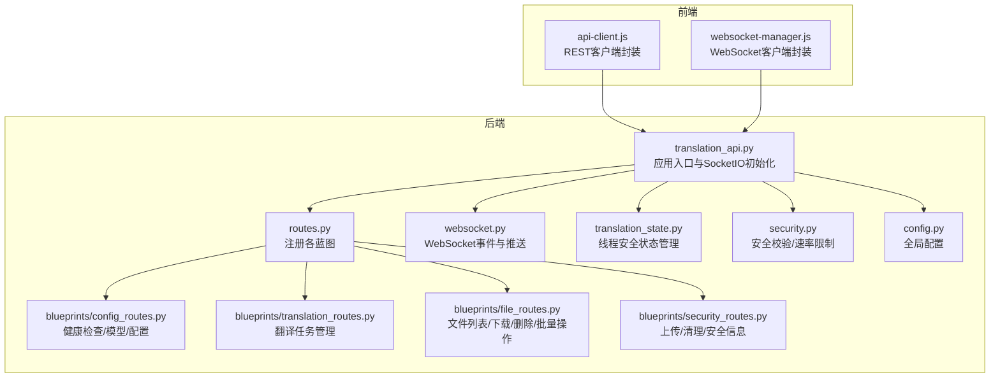
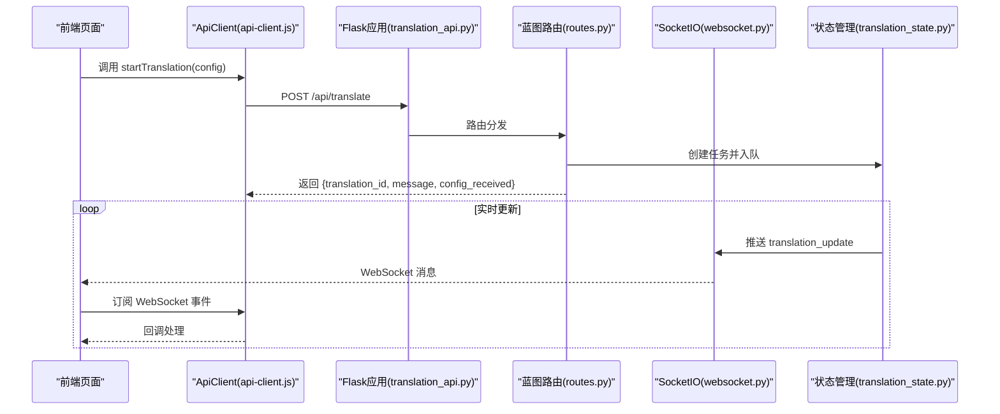
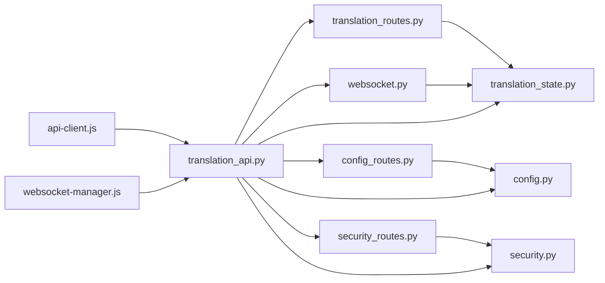

# API参考

<cite>
**本文引用的文件**
- [translation_api.py](file://translation_api.py)
- [routes.py](file://src/api/routes.py)
- [config_routes.py](file://src/api/blueprints/config_routes.py)
- [translation_routes.py](file://src/api/blueprints/translation_routes.py)
- [file_routes.py](file://src/api/blueprints/file_routes.py)
- [security_routes.py](file://src/api/blueprints/security_routes.py)
- [websocket.py](file://src/api/websocket.py)
- [api-client.js](file://src/web/static/js/core/api-client.js)
- [websocket-manager.js](file://src/web/static/js/core/websocket-manager.js)
- [translation_state.py](file://src/api/translation_state.py)
- [security.py](file://src/utils/security.py)
- [config.py](file://src/config.py)
</cite>

## 目录
1. [简介](#简介)
2. [项目结构](#项目结构)
3. [核心组件](#核心组件)
4. [架构总览](#架构总览)
5. [详细组件分析](#详细组件分析)
6. [依赖关系分析](#依赖关系分析)
7. [性能与并发特性](#性能与并发特性)
8. [故障排查指南](#故障排查指南)
9. [结论](#结论)
10. [附录](#附录)

## 简介
本文件为该翻译服务的完整API参考，覆盖RESTful API与WebSocket接口。内容包括：
- REST API端点定义与数据schema
- 认证方式与错误码
- WebSocket连接与消息类型
- JavaScript调用示例（基于前端api-client.js）
- 速率限制、版本控制与向后兼容策略

## 项目结构
后端采用Flask + SocketIO，REST路由通过蓝图模块化组织；前端通过统一的ApiClient封装所有API调用，并使用WebSocketManager进行实时通信。

图表来源
- [translation_api.py](file://translation_api.py#L1-L146)
- [routes.py](file://src/api/routes.py#L1-L66)
- [config_routes.py](file://src/api/blueprints/config_routes.py#L1-L157)
- [translation_routes.py](file://src/api/blueprints/translation_routes.py#L1-L247)
- [file_routes.py](file://src/api/blueprints/file_routes.py#L1-L234)
- [security_routes.py](file://src/api/blueprints/security_routes.py#L1-L156)
- [websocket.py](file://src/api/websocket.py#L1-L43)
- [translation_state.py](file://src/api/translation_state.py#L1-L225)
- [security.py](file://src/utils/security.py#L455-L495)
- [config.py](file://src/config.py#L1-L225)
- [api-client.js](file://src/web/static/js/core/api-client.js#L1-L307)
- [websocket-manager.js](file://src/web/static/js/core/websocket-manager.js#L1-L142)

章节来源
- [translation_api.py](file://translation_api.py#L1-L146)
- [routes.py](file://src/api/routes.py#L1-L66)

## 核心组件
- 应用入口与SocketIO初始化：负责应用启动、CORS、输出目录准备、路由与WebSocket处理器注册、不完整作业恢复。
- 蓝图路由：按功能拆分，包含健康检查、模型查询、翻译任务、文件管理、上传与安全。
- WebSocket：提供连接事件与翻译进度更新事件。
- 前端客户端：统一REST调用与WebSocket事件处理。

章节来源
- [translation_api.py](file://translation_api.py#L1-L146)
- [websocket.py](file://src/api/websocket.py#L1-L43)
- [api-client.js](file://src/web/static/js/core/api-client.js#L1-L307)
- [websocket-manager.js](file://src/web/static/js/core/websocket-manager.js#L1-L142)

## 架构总览
后端以Flask为核心，SocketIO用于WebSocket通信；REST路由通过蓝图注册到应用；状态管理器在内存中维护翻译任务状态，并持久化检查点；前端通过ApiClient发起REST请求，WebSocketManager订阅实时事件。

图表来源
- [translation_api.py](file://translation_api.py#L90-L146)
- [routes.py](file://src/api/routes.py#L23-L66)
- [translation_routes.py](file://src/api/blueprints/translation_routes.py#L26-L85)
- [websocket.py](file://src/api/websocket.py#L21-L43)
- [translation_state.py](file://src/api/translation_state.py#L12-L37)
- [api-client.js](file://src/web/static/js/core/api-client.js#L103-L108)
- [websocket-manager.js](file://src/web/static/js/core/websocket-manager.js#L1-L142)

## 详细组件分析

### REST API 参考

- 基础信息
  - 基础URL：由前端ApiClient自动拼接为当前页面origin，例如 http://localhost:5000
  - 内容类型：默认 application/json；文件下载返回二进制流
  - 认证：未实现鉴权机制，建议在生产环境通过反向代理或网关添加鉴权

- 错误码
  - 400：请求参数缺失或非法（如上传文件为空、模型查询缺少必要参数）
  - 401：未实现鉴权，若接入鉴权将在此返回
  - 403：安全校验失败（如文件类型不被允许、路径穿越等）
  - 404：资源不存在（如翻译任务不存在、文件不存在）
  - 409：冲突（如存在活动翻译导致无法恢复）
  - 429：超出速率限制
  - 500：服务器内部错误

- 端点一览

1) 健康检查
- 方法：GET
- 路径：/api/health
- 请求体：无
- 响应：包含服务状态、支持格式等信息
- 示例响应字段（示意）：status, message, translate_module, ollama_default_endpoint, supported_formats

章节来源
- [config_routes.py](file://src/api/blueprints/config_routes.py#L34-L44)

2) 配置查询
- 方法：GET
- 路径：/api/config
- 查询参数：无
- 响应：默认配置值，如默认模型、分块大小、超时、上下文窗口、最大重试次数、重试延迟、支持格式、默认语言等
- 示例响应字段（示意）：api_endpoint, default_model, chunk_size, timeout, context_window, max_attempts, retry_delay, supported_formats, default_source_language, default_target_language

章节来源
- [config_routes.py](file://src/api/blueprints/config_routes.py#L55-L72)

3) 模型列表
- 方法：GET
- 路径：/api/models
- 查询参数：
  - provider: 字符串，可选值为 ollama 或 gemini，默认 ollama
  - 当 provider=gemini 时，需提供 api_key 参数或设置环境变量 GEMINI_API_KEY
  - 当 provider=ollama 时，可选 api_endpoint 覆盖默认端点
- 响应：
  - provider=ollama：返回可用模型名称数组、默认模型、连接状态、数量
  - provider=gemini：返回模型详情、模型名列表、默认模型、连接状态、数量；当缺少密钥时返回错误提示
- 示例响应字段（示意）：models, model_names, default, status, count, error

章节来源
- [config_routes.py](file://src/api/blueprints/config_routes.py#L45-L155)

4) 文件上传
- 方法：POST
- 路径：/api/upload
- 表单字段：file（必填）
- 速率限制：每IP每分钟最多10次请求
- 安全校验：扩展名限制（.txt/.epub/.srt）、MIME类型限制、文件大小限制（100MB）、内容扫描（可疑脚本关键字）、路径穿越防护
- 响应：成功时返回 file_path、secure_filename、file_type、size、size_mb；可包含警告信息
- 示例响应字段（示意）：success, file_path, filename, secure_filename, file_type, size, size_mb, warnings

章节来源
- [security_routes.py](file://src/api/blueprints/security_routes.py#L23-L98)
- [security.py](file://src/utils/security.py#L34-L110)
- [security.py](file://src/utils/security.py#L455-L495)

5) 文件列表
- 方法：GET
- 路径：/api/files
- 响应：files（含元信息）、total_files、total_size_bytes、total_size_mb

章节来源
- [file_routes.py](file://src/api/blueprints/file_routes.py#L22-L39)

6) 下载文件
- 方法：GET
- 路径：/api/files/{filename}
- 响应：二进制文件流（作为附件下载）

章节来源
- [file_routes.py](file://src/api/blueprints/file_routes.py#L40-L63)

7) 删除文件
- 方法：DELETE
- 路径：/api/files/{filename}
- 响应：成功时返回 {success, message}，否则返回错误

章节来源
- [file_routes.py](file://src/api/blueprints/file_routes.py#L64-L85)

8) 批量下载
- 方法：POST
- 路径：/api/files/batch/download
- 请求体：{ filenames: string[] }
- 响应：二进制zip包（作为附件下载）

章节来源
- [file_routes.py](file://src/api/blueprints/file_routes.py#L86-L132)

9) 批量删除
- 方法：POST
- 路径：/api/files/batch/delete
- 请求体：{ filenames: string[] }
- 响应：包含 deleted、failed、total_deleted

章节来源
- [file_routes.py](file://src/api/blueprints/file_routes.py#L133-L170)

10) 清空上传文件
- 方法：POST
- 路径：/api/uploads/clear
- 请求体：{ file_paths: string[] }
- 响应：包含 deleted、failed、total_deleted

章节来源
- [file_routes.py](file://src/api/blueprints/file_routes.py#L171-L205)

11) 打开本地文件
- 方法：POST
- 路径：/api/files/{filename}/open
- 响应：成功时返回 {success, message, file_path}，否则返回错误

章节来源
- [file_routes.py](file://src/api/blueprints/file_routes.py#L206-L232)

12) 开始翻译
- 方法：POST
- 路径：/api/translate
- 请求体（JSON）：
  - file_path（可选）与 text（可选）二选一：
    - 使用 file_path 时：需提供 file_type（如 txt/epub/srt），以及 source_language、target_language、model、llm_api_endpoint、output_filename
    - 使用 text 时：可选 file_type（默认 txt），以及 source_language、target_language、model、llm_api_endpoint、output_filename
  - 其他常用参数：chunk_size（默认来自配置）、timeout（默认来自配置）、context_window（默认来自配置）、max_attempts（默认来自配置）、retry_delay（默认来自配置）、llm_provider（默认 ollama，可选 gemini/openai）、gemini_api_key（可选）、fast_mode（布尔）
- 响应：{ translation_id, message, config_received }
- 注意：服务端会生成唯一 translation_id 并入队执行

章节来源
- [translation_routes.py](file://src/api/blueprints/translation_routes.py#L26-L85)
- [config.py](file://src/config.py#L56-L100)

13) 获取翻译状态
- 方法：GET
- 路径：/api/translation/{translation_id}
- 响应：包含 translation_id、status、progress、stats（total_chunks、completed_chunks、failed_chunks、start_time、elapsed_time）、logs（最近若干条）、error、config、output_filepath；当任务完成或中断时，result_preview 提示下载查看

章节来源
- [translation_routes.py](file://src/api/blueprints/translation_routes.py#L86-L123)

14) 中断翻译
- 方法：POST
- 路径：/api/translation/{translation_id}/interrupt
- 响应：若可中断则返回提示；否则返回错误

章节来源
- [translation_routes.py](file://src/api/blueprints/translation_routes.py#L124-L140)

15) 列出所有翻译
- 方法：GET
- 路径：/api/translations
- 响应：{ translations: [{ translation_id, status, progress, start_time, output_filename, file_type }, ...] }

章节来源
- [translation_routes.py](file://src/api/blueprints/translation_routes.py#L141-L146)

16) 可恢复任务列表
- 方法：GET
- 路径：/api/resumable
- 响应：{ resumable_jobs: [...] }

章节来源
- [translation_routes.py](file://src/api/blueprints/translation_routes.py#L147-L152)

17) 恢复翻译
- 方法：POST
- 路径：/api/resume/{translation_id}
- 前置条件：必须没有活动翻译（running/queued）
- 响应：成功返回 { translation_id, message, resume_from_chunk }；否则返回错误（如无检查点、文件不存在、冲突等）

章节来源
- [translation_routes.py](file://src/api/blueprints/translation_routes.py#L153-L232)

18) 删除检查点
- 方法：DELETE
- 路径：/api/checkpoint/{translation_id}
- 响应：成功返回 { message, translation_id }；否则返回错误

章节来源
- [translation_routes.py](file://src/api/blueprints/translation_routes.py#L233-L245)

### WebSocket 接口参考

- 连接路径
  - 默认使用 SocketIO 的默认命名空间 /，前端通过 io() 连接到当前页面origin
  - 连接建立后，服务端会发送 'connected' 事件

- 事件类型与载荷

1) 连接事件
- 事件名：'connect'
- 载荷：无
- 作用：前端收到连接成功通知

2) 断开事件
- 事件名：'disconnect'
- 载荷：无
- 作用：前端收到断开通知

3) 翻译更新事件
- 事件名：'translation_update'
- 载荷（示例字段）：
  - translation_id: 任务ID
  - stats: 统计信息（total_chunks、completed_chunks、failed_chunks、start_time、elapsed_time）
  - progress: 进度百分比或片段索引
  - 其他业务相关字段（如日志片段、状态变更等）
- 说明：服务端在状态变化时推送，前端通过 WebSocketManager 订阅并处理

- 客户端交互模式
  - 初始化：页面加载后，WebSocketManager 自动连接
  - 订阅：注册 'translation_update' 事件回调，更新UI
  - 发送：当前实现仅服务端推送，客户端无需发送消息

章节来源
- [websocket.py](file://src/api/websocket.py#L8-L43)
- [websocket-manager.js](file://src/web/static/js/core/websocket-manager.js#L1-L142)

### JavaScript 调用示例（基于 api-client.js）

- 设置基础URL（可选，默认使用当前页面origin）
  - ApiClient.setBaseUrl("http://localhost:5000")

- 健康检查
  - ApiClient.healthCheck()

- 获取配置
  - ApiClient.getConfig()

- 开始翻译
  - ApiClient.startTranslation({ file_path 或 text, source_language, target_language, model, llm_api_endpoint, output_filename, ... })

- 查询翻译状态
  - ApiClient.getTranslationStatus(translationId)

- 列出活动翻译
  - ApiClient.getActiveTranslations()

- 中断翻译
  - ApiClient.interruptTranslation(translationId)

- 上传文件
  - const formData = new FormData(); formData.append('file', file); ApiClient.uploadFile(file)

- 文件管理
  - ApiClient.getFileList()
  - ApiClient.getFileDownloadUrl(filename)
  - ApiClient.deleteFile(filename)
  - ApiClient.batchDownloadFiles(filenames)
  - ApiClient.batchDeleteFiles(filenames)
  - ApiClient.openLocalFile(filename)
  - ApiClient.clearUploadedFiles(filePaths)

- 模型查询
  - ApiClient.getModels('ollama', { api_endpoint }) 或 ApiClient.getModels('gemini', { api_key })

- 可恢复任务
  - ApiClient.getResumableJobs()
  - ApiClient.resumeJob(translationId)
  - ApiClient.deleteCheckpoint(translationId)

章节来源
- [api-client.js](file://src/web/static/js/core/api-client.js#L1-L307)

## 依赖关系分析

图表来源
- [translation_routes.py](file://src/api/blueprints/translation_routes.py#L1-L247)
- [translation_state.py](file://src/api/translation_state.py#L1-L225)
- [security_routes.py](file://src/api/blueprints/security_routes.py#L1-L156)
- [security.py](file://src/utils/security.py#L455-L495)
- [config_routes.py](file://src/api/blueprints/config_routes.py#L1-L157)
- [config.py](file://src/config.py#L1-L225)
- [websocket.py](file://src/api/websocket.py#L1-L43)
- [translation_api.py](file://translation_api.py#L1-L146)
- [api-client.js](file://src/web/static/js/core/api-client.js#L1-L307)
- [websocket-manager.js](file://src/web/static/js/core/websocket-manager.js#L1-L142)

## 性能与并发特性
- 并发与线程安全
  - 状态管理器使用可重入锁保护共享状态，确保多线程下安全更新
  - 翻译任务在独立线程中运行，避免阻塞Web请求
- I/O与网络
  - 文件上传采用临时文件写入与二次验证，防止恶意内容
  - 模型查询对Ollama/Gemini分别处理，带超时与错误降级
- 速率限制
  - 每IP每分钟最多10次上传请求，超过返回429

章节来源
- [translation_state.py](file://src/api/translation_state.py#L12-L37)
- [security_routes.py](file://src/api/blueprints/security_routes.py#L23-L98)
- [security.py](file://src/utils/security.py#L455-L495)

## 故障排查指南
- 常见错误与定位
  - 400 参数错误：检查 /api/translate 请求体字段是否齐全，或 /api/models 是否正确传入 provider 和 api_key
  - 403 安全错误：确认文件扩展名、MIME类型、大小限制；检查路径穿越与可疑内容
  - 404 资源不存在：确认 translation_id 或文件名是否正确
  - 409 冲突：当前有活动翻译，等待完成后重试恢复
  - 429 速率限制：等待冷却时间或降低请求频率
  - 500 服务器错误：查看服务端日志，关注 traceback
- 前端调试
  - 使用 ApiClient.setBaseUrl 指定后端地址
  - 在浏览器开发者工具Network面板观察请求与响应
  - 在Console查看 WebSocket 连接与事件日志

章节来源
- [routes.py](file://src/api/routes.py#L54-L66)
- [security_routes.py](file://src/api/blueprints/security_routes.py#L23-L112)
- [translation_routes.py](file://src/api/blueprints/translation_routes.py#L153-L232)
- [websocket-manager.js](file://src/web/static/js/core/websocket-manager.js#L1-L142)

## 结论
本API提供了从文件上传、翻译任务管理到文件下载与WebSocket实时更新的完整能力。REST端点设计清晰，WebSocket用于实时反馈；前端通过统一客户端封装简化了集成。建议在生产环境增加鉴权与限流策略，并根据实际部署场景调整速率限制与上下文窗口。

## 附录

### 版本控制与向后兼容
- 版本号：服务启动时打印的版本字符串（形如 YYYYMMDD-HHMM），可用于追踪部署版本
- 向后兼容：当前API未引入破坏性变更；新增端点（如 /api/resume/{id}、/api/checkpoint/{id}）不影响既有端点

章节来源
- [translation_api.py](file://translation_api.py#L123-L146)