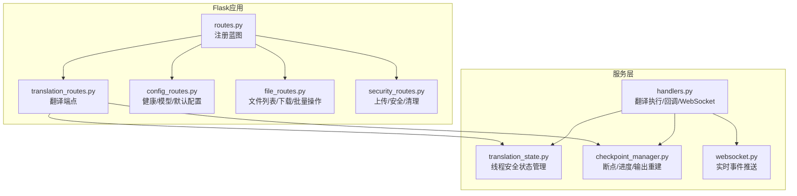
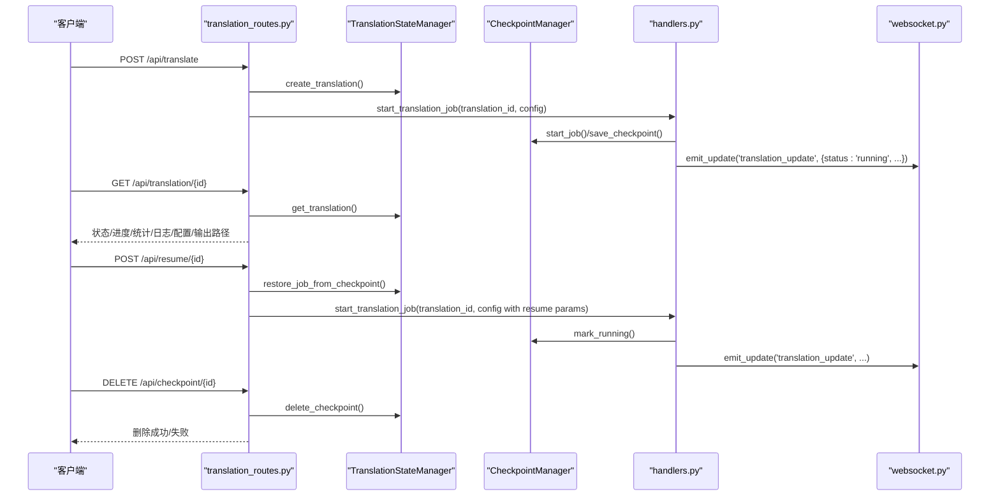
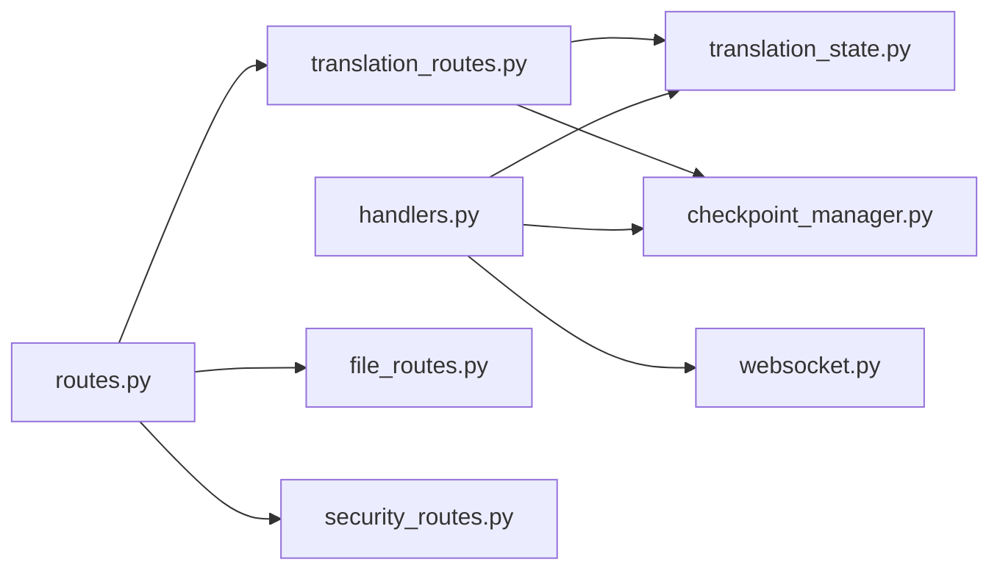

# REST API参考

<cite>
**本文引用的文件**
- [translation_routes.py](file://src/api/blueprints/translation_routes.py)
- [routes.py](file://src/api/routes.py)
- [translation_state.py](file://src/api/translation_state.py)
- [checkpoint_manager.py](file://src/persistence/checkpoint_manager.py)
- [handlers.py](file://src/api/handlers.py)
- [api-client.js](file://src/web/static/js/core/api-client.js)
- [config_routes.py](file://src/api/blueprints/config_routes.py)
- [file_routes.py](file://src/api/blueprints/file_routes.py)
- [security_routes.py](file://src/api/blueprints/security_routes.py)
- [websocket.py](file://src/api/websocket.py)
- [config.py](file://src/config.py)
</cite>

## 目录
1. [简介](#简介)
2. [项目结构](#项目结构)
3. [核心组件](#核心组件)
4. [架构总览](#架构总览)
5. [详细端点说明](#详细端点说明)
6. [依赖关系分析](#依赖关系分析)
7. [性能与并发特性](#性能与并发特性)
8. [故障排查指南](#故障排查指南)
9. [结论](#结论)
10. [附录：JavaScript调用示例](#附录javascript调用示例)

## 简介
本文件为项目中翻译作业管理相关REST API的完整参考，覆盖以下端点：
- POST /api/translate：提交新的翻译任务
- GET /api/translation/{id}：查询翻译任务状态
- GET /api/translations：列出所有翻译任务摘要
- POST /api/translation/{id}/interrupt：中断运行中的任务
- GET /api/resumable：列出可恢复的任务
- POST /api/resume/{id}：从断点恢复任务
- DELETE /api/checkpoint/{id}：删除断点（清理）

同时结合前端 JavaScript 客户端方法（如 startTranslation、getTranslationStatus 等），给出调用示例；并说明认证方式（当前无）、速率限制策略与版本控制建议。

## 项目结构
翻译API由多个蓝图模块组成，并通过路由协调器统一注册到Flask应用：
- 蓝图：翻译管理、配置与健康检查、文件管理、安全上传
- 状态管理：内存态+数据库断点持久化
- 处理器：异步执行翻译、进度统计、日志回调、WebSocket推送
- 前端客户端：封装fetch请求、统一错误处理与响应解析

图表来源
- [routes.py](file://src/api/routes.py#L23-L66)
- [translation_routes.py](file://src/api/blueprints/translation_routes.py#L16-L247)
- [config_routes.py](file://src/api/blueprints/config_routes.py#L22-L157)
- [file_routes.py](file://src/api/blueprints/file_routes.py#L12-L234)
- [security_routes.py](file://src/api/blueprints/security_routes.py#L10-L139)
- [translation_state.py](file://src/api/translation_state.py#L12-L225)
- [checkpoint_manager.py](file://src/persistence/checkpoint_manager.py#L12-L528)
- [handlers.py](file://src/api/handlers.py#L18-L452)
- [websocket.py](file://src/api/websocket.py#L8-L43)

章节来源
- [routes.py](file://src/api/routes.py#L23-L66)

## 核心组件
- 翻译状态管理器（TranslationStateManager）
  - 提供线程安全的内存态存储，包含状态、进度、统计、日志、中断标记等
  - 与数据库断点管理器协作，实现任务的暂停/中断/恢复/清理
- 断点管理器（CheckpointManager）
  - 数据库存储任务元信息、分块翻译结果、上下文
  - 支持保存/加载断点、标记状态（运行/暂停/中断/完成）、重建输出
- 翻译处理器（handlers.py）
  - 异步执行翻译流程，按文件类型（txt/srt/epub）调用不同逻辑
  - 回调更新进度、统计、日志，支持中断信号
  - 通过WebSocket推送实时事件
- WebSocket（websocket.py）
  - 连接建立/断开事件，以及翻译更新事件推送

章节来源
- [translation_state.py](file://src/api/translation_state.py#L12-L225)
- [checkpoint_manager.py](file://src/persistence/checkpoint_manager.py#L12-L528)
- [handlers.py](file://src/api/handlers.py#L18-L452)
- [websocket.py](file://src/api/websocket.py#L8-L43)

## 架构总览
下图展示翻译任务从提交到完成/中断/恢复的关键交互路径。

图表来源
- [translation_routes.py](file://src/api/blueprints/translation_routes.py#L26-L247)
- [translation_state.py](file://src/api/translation_state.py#L12-L225)
- [checkpoint_manager.py](file://src/persistence/checkpoint_manager.py#L12-L528)
- [handlers.py](file://src/api/handlers.py#L18-L452)
- [websocket.py](file://src/api/websocket.py#L21-L43)

## 详细端点说明

### POST /api/translate
- 功能：提交新的翻译任务
- 请求体字段（必填项以“必填”标注，部分字段在文本输入时可为空但有例外规则）
  - file_path（可选，若未提供则使用 text）
  - text（可选，当 file_type 为 txt 且 text 为空时允许）
  - file_type（必填，取值：txt、srt、epub）
  - source_language（必填）
  - target_language（必填）
  - model（必填）
  - llm_api_endpoint（必填）
  - output_filename（必填）
  - 其他可选参数（来自请求体或默认配置）：
    - chunk_size（默认来自配置）
    - timeout（默认来自配置）
    - context_window（默认来自配置）
    - max_attempts（默认来自配置）
    - retry_delay（默认来自配置）
    - llm_provider（默认 'ollama'）
    - gemini_api_key（可选，优先来自请求体，否则读取环境变量）
    - fast_mode（布尔，默认 false）
    - auto_adjust_context、min_chunk_size、max_chunk_size（用于上下文优化）
- 成功响应：返回 translation_id、消息与收到的配置
- 错误码：
  - 400：缺少或空字段（除特殊说明外）
  - 500：服务器内部错误（异常抛出时）

章节来源
- [translation_routes.py](file://src/api/blueprints/translation_routes.py#L26-L85)
- [config.py](file://src/config.py#L56-L109)

### GET /api/translation/{id}
- 功能：查询指定翻译任务的状态与统计
- 响应字段（节选）：
  - translation_id、status、progress
  - stats：total_chunks、completed_chunks、failed_chunks、start_time、elapsed_time
  - logs：最近日志条目（最多100条）
  - result_preview：在已完成/中断后提示预览不可用，需下载查看
  - error、config、output_filepath
- 错误码：
  - 404：任务不存在

章节来源
- [translation_routes.py](file://src/api/blueprints/translation_routes.py#L86-L123)
- [translation_state.py](file://src/api/translation_state.py#L65-L72)

### GET /api/translations
- 功能：列出所有翻译任务摘要（按开始时间倒序）
- 响应字段：
  - translations：数组，每项包含 translation_id、status、progress、start_time、output_filename、file_type

章节来源
- [translation_routes.py](file://src/api/blueprints/translation_routes.py#L141-L146)
- [translation_state.py](file://src/api/translation_state.py#L118-L131)

### POST /api/translation/{id}/interrupt
- 功能：向运行中或排队中的任务发送中断信号
- 行为：
  - 若任务处于可中断状态（运行/排队），设置中断标志并返回提示
  - 否则返回错误提示
- 错误码：
  - 404：任务不存在
  - 400：任务不在可中断状态

章节来源
- [translation_routes.py](file://src/api/blueprints/translation_routes.py#L124-L139)
- [translation_state.py](file://src/api/translation_state.py#L133-L147)

### GET /api/resumable
- 功能：列出所有可恢复的任务（含进度百分比、输入/输出文件名）
- 响应字段：
  - resumable_jobs：数组，每项包含 progress_percentage、input_filename、output_filename 等

章节来源
- [translation_routes.py](file://src/api/blueprints/translation_routes.py#L147-L152)
- [checkpoint_manager.py](file://src/persistence/checkpoint_manager.py#L207-L242)

### POST /api/resume/{id}
- 功能：从断点恢复任务
- 预检与约束：
  - 若存在正在运行/排队的任务，则拒绝恢复（返回冲突）
  - 检查断点是否存在，不存在则返回404
  - 尝试从断点恢复到内存态，若失败返回500
  - 恢复配置时会注入 resume_from_index 与 is_resume 标记
  - 若原输入文件被保留，会校验其存在性，不存在则返回404并给出建议
- 成功响应：返回 translation_id、消息与恢复起点索引
- 错误码：
  - 409：存在活动任务
  - 404：无断点/输入文件缺失
  - 500：恢复失败

章节来源
- [translation_routes.py](file://src/api/blueprints/translation_routes.py#L153-L232)
- [translation_state.py](file://src/api/translation_state.py#L152-L181)
- [checkpoint_manager.py](file://src/persistence/checkpoint_manager.py#L175-L206)

### DELETE /api/checkpoint/{id}
- 功能：手动删除断点（清理）
- 行为：
  - 删除数据库记录与对应上传目录备份
- 成功响应：返回删除成功消息与 translation_id
- 错误码：
  - 404：断点不存在/删除失败

章节来源
- [translation_routes.py](file://src/api/blueprints/translation_routes.py#L233-L245)
- [translation_state.py](file://src/api/translation_state.py#L184-L201)
- [checkpoint_manager.py](file://src/persistence/checkpoint_manager.py#L291-L313)

## 依赖关系分析
- 端点与服务层耦合
  - translation_routes.py 依赖 TranslationStateManager 与 CheckpointManager
  - handlers.py 作为翻译执行入口，依赖状态与断点管理器，并通过 WebSocket 推送
- 路由注册
  - routes.py 统一注册各蓝图，确保端点可用
- 文件与安全
  - file_routes.py 提供文件列表/下载/批量操作
  - security_routes.py 提供上传与安全策略（含速率限制）

图表来源
- [translation_routes.py](file://src/api/blueprints/translation_routes.py#L16-L247)
- [routes.py](file://src/api/routes.py#L23-L66)
- [handlers.py](file://src/api/handlers.py#L18-L452)
- [websocket.py](file://src/api/websocket.py#L21-L43)
- [file_routes.py](file://src/api/blueprints/file_routes.py#L12-L234)
- [security_routes.py](file://src/api/blueprints/security_routes.py#L10-L139)

## 性能与并发特性
- 并发模型
  - 翻译任务在独立线程中运行，避免阻塞Web请求
  - 状态管理器使用可重入锁，保证多线程安全
- 实时更新
  - WebSocket推送翻译进度、统计与日志，前端可订阅实时事件
- 断点与恢复
  - 分块保存断点，支持从断点继续，减少重复工作量
- 速率限制
  - 上传接口内置简单内存型限流（每分钟最大请求数），超过将返回429

章节来源
- [handlers.py](file://src/api/handlers.py#L436-L452)
- [translation_state.py](file://src/api/translation_state.py#L12-L21)
- [websocket.py](file://src/api/websocket.py#L21-L43)
- [security_routes.py](file://src/api/blueprints/security_routes.py#L23-L46)
- [security.py](file://src/utils/security.py#L455-L495)

## 故障排查指南
- 常见错误与定位
  - 400 缺少字段：检查请求体是否包含必填字段，注意 text 在特定场景下的空值规则
  - 404 任务不存在：确认 translation_id 是否正确，或先调用 /api/translations 获取最新列表
  - 409 存在活动任务：在恢复前等待其他任务完成或中断
  - 404 断点/输入文件缺失：确认断点存在且输入文件仍可访问
  - 500 服务器内部错误：查看后端日志，关注 handlers 中的异常分支
- 日志与统计
  - 使用 GET /api/translation/{id} 的 logs 字段辅助定位问题
  - 关注 stats 中 total/completed/failed 的变化
- 上传与安全
  - 上传失败或被拒绝：检查文件大小、类型、路径穿越风险与速率限制

章节来源
- [translation_routes.py](file://src/api/blueprints/translation_routes.py#L26-L123)
- [handlers.py](file://src/api/handlers.py#L18-L119)
- [security_routes.py](file://src/api/blueprints/security_routes.py#L23-L46)

## 结论
该API围绕“任务生命周期管理”构建，提供从提交、监控、中断、恢复到清理的全链路能力。前端通过 WebSocket 实时接收进度，后端通过断点与状态管理器保障可靠性。当前无认证与CORS限制，适合本地或受控网络使用；如需生产部署，建议补充鉴权、限流与跨域策略。

## 附录：JavaScript调用示例
以下示例基于前端 ApiClient 封装的方法，展示如何调用上述端点。请根据实际需要替换占位符。

- 启动翻译任务
  - 方法：ApiClient.startTranslation(config)
  - 参数：与 POST /api/translate 请求体一致
  - 返回：translation_id、消息与收到的配置
  - 参考路径：[api-client.js](file://src/web/static/js/core/api-client.js#L98-L108)

- 查询任务状态
  - 方法：ApiClient.getTranslationStatus(translationId)
  - 返回：状态、进度、统计、日志、配置、输出路径等
  - 参考路径：[api-client.js](file://src/web/static/js/core/api-client.js#L110-L118)

- 获取活动任务列表
  - 方法：ApiClient.getActiveTranslations()
  - 返回：任务摘要列表
  - 参考路径：[api-client.js](file://src/web/static/js/core/api-client.js#L119-L126)

- 中断任务
  - 方法：ApiClient.interruptTranslation(translationId)
  - 返回：中断结果
  - 参考路径：[api-client.js](file://src/web/static/js/core/api-client.js#L127-L136)

- 获取可恢复任务列表
  - 方法：ApiClient.getResumableJobs()
  - 返回：可恢复任务列表
  - 参考路径：[api-client.js](file://src/web/static/js/core/api-client.js#L272-L278)

- 恢复任务
  - 方法：ApiClient.resumeJob(translationId)
  - 行为：检查活动任务、断点存在性、输入文件有效性，成功后启动恢复流程
  - 参考路径：[api-client.js](file://src/web/static/js/core/api-client.js#L280-L290)

- 删除断点
  - 方法：ApiClient.deleteCheckpoint(translationId)
  - 返回：删除成功消息
  - 参考路径：[api-client.js](file://src/web/static/js/core/api-client.js#L292-L300)

- 健康检查与配置
  - 方法：ApiClient.healthCheck()、ApiClient.getConfig()
  - 返回：健康状态与默认配置
  - 参考路径：[api-client.js](file://src/web/static/js/core/api-client.js#L82-L92)

- 上传文件（与翻译流程配合）
  - 方法：ApiClient.uploadFile(file)
  - 返回：file_path、file_type 等
  - 参考路径：[api-client.js](file://src/web/static/js/core/api-client.js#L142-L161)

- 文件管理（下载/删除/批量）
  - 方法：ApiClient.getFileList()、ApiClient.getFileDownloadUrl(filename)、ApiClient.deleteFile(filename)、ApiClient.batchDownloadFiles(filenames)、ApiClient.batchDeleteFiles(filenames)
  - 参考路径：[api-client.js](file://src/web/static/js/core/api-client.js#L163-L215)

- 模型查询
  - 方法：ApiClient.getModels(provider, options)
  - 返回：可用模型列表
  - 参考路径：[api-client.js](file://src/web/static/js/core/api-client.js#L244-L267)

- WebSocket 订阅
  - 事件：translation_update
  - 用途：接收实时进度、统计、日志
  - 参考路径：[websocket.py](file://src/api/websocket.py#L21-L43)