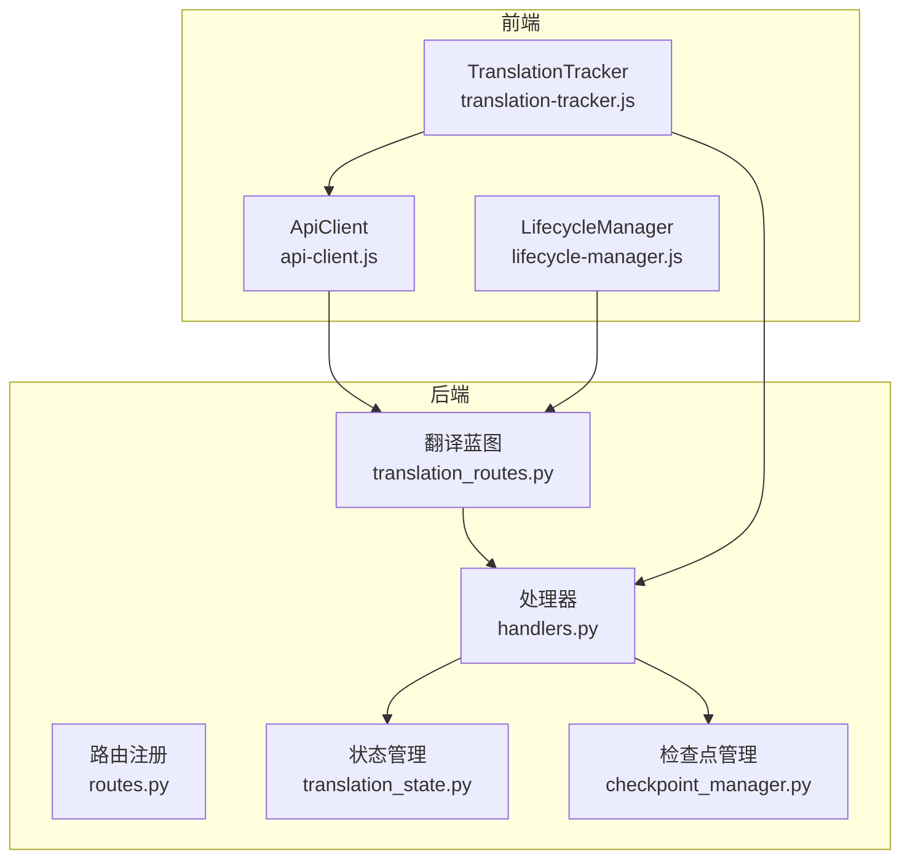
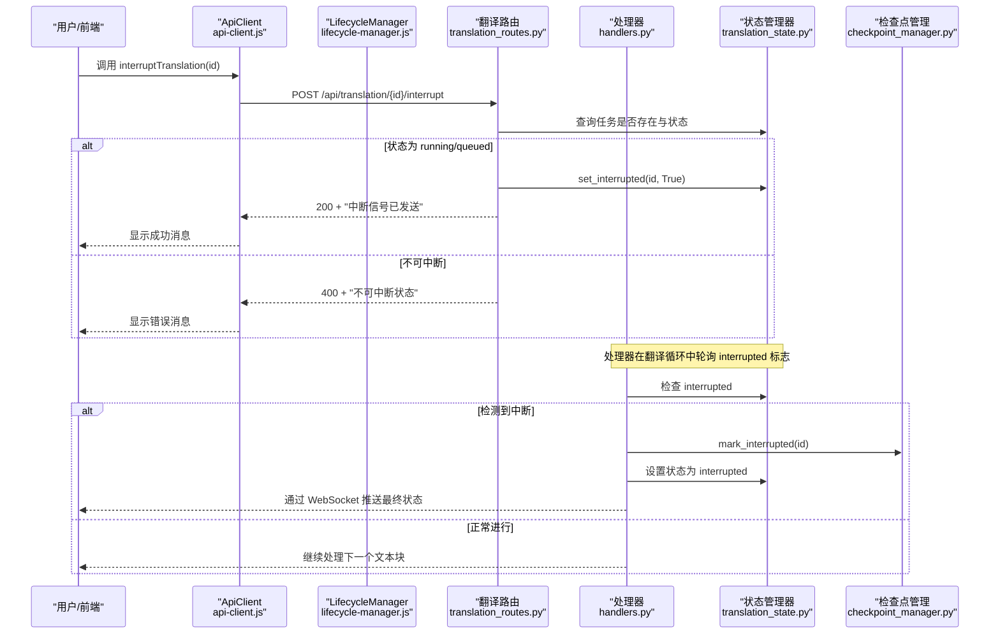
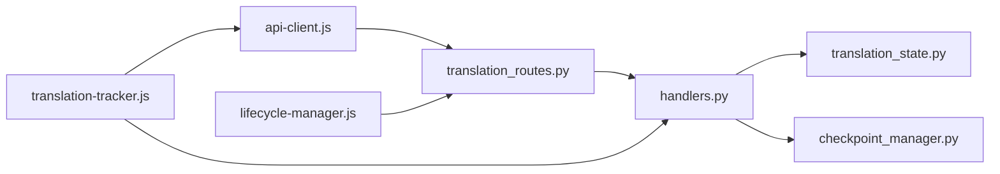

# 中断翻译任务

<cite>
**本文引用的文件**
- [routes.py](file://src/api/routes.py)
- [translation_routes.py](file://src/api/blueprints/translation_routes.py)
- [handlers.py](file://src/api/handlers.py)
- [translation_state.py](file://src/api/translation_state.py)
- [checkpoint_manager.py](file://src/persistence/checkpoint_manager.py)
- [api-client.js](file://src/web/static/js/core/api-client.js)
- [lifecycle-manager.js](file://src/web/static/js/utils/lifecycle-manager.js)
- [translation-tracker.js](file://src/web/static/js/translation/translation-tracker.js)
</cite>

## 目录
1. [简介](#简介)
2. [项目结构](#项目结构)
3. [核心组件](#核心组件)
4. [架构总览](#架构总览)
5. [详细组件分析](#详细组件分析)
6. [依赖关系分析](#依赖关系分析)
7. [性能考量](#性能考量)
8. [故障排查指南](#故障排查指南)
9. [结论](#结论)

## 简介
本文件围绕 POST /api/translation/<id>/interrupt 端点，系统性说明如何安全地中断一个正在运行或排队中的翻译任务。该机制通过在状态管理器中设置中断标志，使当前处理的文本块在完成后再停止，从而保证数据一致性与完整性。成功响应返回 200 状态码及“中断信号已发送”的消息；若任务处于不可中断状态（例如已完成或已失败），则返回 400 状态码。同时，文档结合前端 api-client.js 的 interruptTranslation 方法，给出中断按钮的调用示例，并阐述中断机制与直接终止进程的区别，强调其“优雅退出”的设计，避免产生损坏的输出文件或检查点。最后，说明中断后任务状态变为“interrupted”，并可由后续的 resume 操作重新激活，这是实现断点续传的关键环节。

## 项目结构
该功能涉及后端路由、处理器、状态管理与持久化层，以及前端 API 客户端与生命周期管理模块。关键路径如下：
- 后端路由注册与蓝图：routes.py 注册 translation 蓝图
- 翻译路由：translation_routes.py 提供 /api/translation/<id>/interrupt
- 处理器与状态：handlers.py 在执行过程中轮询中断标志；translation_state.py 维护任务状态与中断标志
- 持久化与断点：checkpoint_manager.py 记录中断状态、保存检查点、支持恢复
- 前端客户端：api-client.js 提供 interruptTranslation 方法；lifecycle-manager.js 在页面关闭时自动发送中断请求；translation-tracker.js 更新 UI 并处理中断后的状态

图表来源
- [routes.py](file://src/api/routes.py#L23-L49)
- [translation_routes.py](file://src/api/blueprints/translation_routes.py#L124-L139)
- [handlers.py](file://src/api/handlers.py#L18-L47)
- [translation_state.py](file://src/api/translation_state.py#L12-L37)
- [checkpoint_manager.py](file://src/persistence/checkpoint_manager.py#L12-L56)

章节来源
- [routes.py](file://src/api/routes.py#L23-L49)
- [translation_routes.py](file://src/api/blueprints/translation_routes.py#L124-L139)

## 核心组件
- 中断端点：/api/translation/<id>/interrupt（POST）
  - 仅当任务状态为 running 或 queued 时才允许中断；否则返回 400
  - 成功时设置状态管理器中的 interrupted 标志，并返回 200 与提示信息
- 状态管理器：维护每个任务的状态、进度、日志、统计、中断标志等
- 处理器：在翻译主流程中定期检查中断标志，一旦检测到则优雅停止，标记状态为 interrupted 并写入数据库
- 检查点管理：记录中断状态、保存检查点、支持恢复与清理
- 前端客户端：提供 interruptTranslation 方法；生命周期管理在页面关闭时自动发送中断请求；翻译跟踪器负责 UI 状态同步与中断后的处理

章节来源
- [translation_routes.py](file://src/api/blueprints/translation_routes.py#L124-L139)
- [translation_state.py](file://src/api/translation_state.py#L133-L146)
- [handlers.py](file://src/api/handlers.py#L67-L71)
- [checkpoint_manager.py](file://src/persistence/checkpoint_manager.py#L255-L266)
- [api-client.js](file://src/web/static/js/core/api-client.js#L120-L136)
- [lifecycle-manager.js](file://src/web/static/js/utils/lifecycle-manager.js#L83-L114)
- [translation-tracker.js](file://src/web/static/js/translation/translation-tracker.js#L82-L121)

## 架构总览
下图展示从用户触发中断到后端处理与状态更新的整体流程。

图表来源
- [api-client.js](file://src/web/static/js/core/api-client.js#L120-L136)
- [lifecycle-manager.js](file://src/web/static/js/utils/lifecycle-manager.js#L83-L114)
- [translation_routes.py](file://src/api/blueprints/translation_routes.py#L124-L139)
- [handlers.py](file://src/api/handlers.py#L67-L71)
- [translation_state.py](file://src/api/translation_state.py#L133-L146)
- [checkpoint_manager.py](file://src/persistence/checkpoint_manager.py#L255-L266)

## 详细组件分析

### 中断端点：POST /api/translation/<id>/interrupt
- 请求：POST /api/translation/{translation_id}/interrupt
- 行为：
  - 若任务不存在，返回 404
  - 若任务状态为 running 或 queued，设置 interrupted 标志为 True，并返回 200 与提示信息
  - 否则返回 400，提示任务处于不可中断状态
- 设计要点：
  - 仅允许对“可中断”的任务进行中断，避免对已完成或已失败的任务重复中断
  - 返回明确的成功/失败语义，便于前端提示

章节来源
- [translation_routes.py](file://src/api/blueprints/translation_routes.py#L124-L139)

### 状态管理器：中断标志与状态流转
- 关键字段：
  - interrupted：布尔值，指示是否收到中断信号
  - status：任务状态（queued、running、completed、interrupted、error）
  - progress：进度百分比
  - logs：日志列表
  - stats：统计信息（开始时间、总块数、完成/失败块数等）
- 中断相关方法：
  - set_interrupted(id, True)：设置中断标志
  - is_interrupted(id)：查询中断标志
- 流程影响：
  - 处理器在每次循环前检查 interrupted 标志，检测到后不再继续新的块处理，等待当前块完成再退出
  - 最终将状态置为 interrupted，并通过 WebSocket 推送最终状态

章节来源
- [translation_state.py](file://src/api/translation_state.py#L12-L37)
- [translation_state.py](file://src/api/translation_state.py#L133-L146)
- [handlers.py](file://src/api/handlers.py#L67-L71)
- [handlers.py](file://src/api/handlers.py#L309-L325)

### 处理器：中断检测与优雅退出
- 中断检测回调 should_interrupt_current_task：
  - 读取 interrupted 标志，若为真则记录日志并返回 True
- 进度与统计回调：
  - 进度回调：仅在未中断时更新 progress
  - 统计回调：更新 stats 并计算耗时
- 中断后的处理：
  - 将状态设为 interrupted
  - 标记数据库为 interrupted
  - 通过 WebSocket 发送 checkpoint_created 事件，UI 可据此显示“已暂停并创建检查点”
  - 保留上传文件以支持后续 resume（若存在备份副本）

章节来源
- [handlers.py](file://src/api/handlers.py#L67-L71)
- [handlers.py](file://src/api/handlers.py#L120-L133)
- [handlers.py](file://src/api/handlers.py#L309-L325)
- [handlers.py](file://src/api/handlers.py#L326-L354)

### 检查点管理：中断状态与恢复
- 中断状态标记：
  - mark_interrupted(id)：更新数据库中任务状态为 interrupted
- 恢复能力：
  - load_checkpoint(id)：加载作业元数据、已完成块、恢复索引等
  - restore_job_from_checkpoint(id)：将作业恢复到内存状态（状态为 paused，等待 resume）
  - get_resumable_jobs()：列出可恢复作业
- 清理策略：
  - cleanup_completed_job(id)：完成作业后立即清理检查点
  - delete_checkpoint(id)：手动删除检查点（含上传文件目录）

章节来源
- [checkpoint_manager.py](file://src/persistence/checkpoint_manager.py#L255-L266)
- [checkpoint_manager.py](file://src/persistence/checkpoint_manager.py#L175-L206)
- [translation_state.py](file://src/api/translation_state.py#L148-L181)
- [translation_state.py](file://src/api/translation_state.py#L202-L217)

### 前端集成：中断按钮与自动中断
- ApiClient.interruptTranslation(id)：
  - 发起 POST /api/translation/{id}/interrupt
  - 统一错误处理与非 JSON 响应处理
- 生命周期自动中断：
  - 页面关闭时（pagehide）使用 navigator.sendBeacon 或同步 XHR 发送中断请求
  - 防止误关页面时的意外中断
- 翻译跟踪器：
  - 监听 WebSocket 推送的最终状态（completed/interrupted/error）
  - 中断后重置 UI、停止批量队列、提示用户并刷新可恢复作业列表

章节来源
- [api-client.js](file://src/web/static/js/core/api-client.js#L120-L136)
- [lifecycle-manager.js](file://src/web/static/js/utils/lifecycle-manager.js#L83-L114)
- [translation-tracker.js](file://src/web/static/js/translation/translation-tracker.js#L82-L121)
- [translation-tracker.js](file://src/web/static/js/translation/translation-tracker.js#L190-L224)

### 中断机制与直接终止进程的区别
- 优雅退出：
  - 中断仅设置标志，等待当前文本块处理完成再退出，避免产生半成品输出或损坏的检查点
  - 保留上传文件以便后续 resume，确保断点续传可用
- 直接终止：
  - 可能导致文件写入中断、检查点不一致、输出文件损坏
  - 无法保证数据一致性，也不利于后续恢复

章节来源
- [handlers.py](file://src/api/handlers.py#L309-L325)
- [handlers.py](file://src/api/handlers.py#L326-L354)

### 中断后的状态与断点续传
- 中断后状态：
  - 服务器端：状态为 interrupted，数据库标记为 interrupted
  - 前端：WebSocket 推送最终状态，UI 显示“已暂停并创建检查点”
- 断点续传：
  - 可通过 /api/resume/<id> 恢复作业
  - 恢复前需确保无其他活动翻译；恢复时从检查点恢复配置与进度
  - 恢复后重新进入 running 状态，继续处理剩余块

章节来源
- [handlers.py](file://src/api/handlers.py#L309-L325)
- [translation_routes.py](file://src/api/blueprints/translation_routes.py#L153-L231)
- [translation_state.py](file://src/api/translation_state.py#L148-L181)

## 依赖关系分析
- 路由层依赖状态管理器与启动函数，用于创建与启动翻译任务
- 处理器依赖状态管理器与检查点管理器，负责实际翻译逻辑与状态持久化
- 前端客户端依赖后端路由，生命周期管理在页面关闭时自动触发中断请求
- 翻译跟踪器订阅 WebSocket 事件，驱动 UI 更新与批量队列控制

图表来源
- [translation_routes.py](file://src/api/blueprints/translation_routes.py#L124-L139)
- [handlers.py](file://src/api/handlers.py#L18-L47)
- [translation_state.py](file://src/api/translation_state.py#L12-L37)
- [checkpoint_manager.py](file://src/persistence/checkpoint_manager.py#L12-L56)
- [api-client.js](file://src/web/static/js/core/api-client.js#L120-L136)
- [lifecycle-manager.js](file://src/web/static/js/utils/lifecycle-manager.js#L83-L114)
- [translation-tracker.js](file://src/web/static/js/translation/translation-tracker.js#L40-L121)

章节来源
- [routes.py](file://src/api/routes.py#L23-L49)
- [translation_routes.py](file://src/api/blueprints/translation_routes.py#L124-L139)
- [handlers.py](file://src/api/handlers.py#L18-L47)
- [translation_state.py](file://src/api/translation_state.py#L12-L37)
- [checkpoint_manager.py](file://src/persistence/checkpoint_manager.py#L12-L56)
- [api-client.js](file://src/web/static/js/core/api-client.js#L120-L136)
- [lifecycle-manager.js](file://src/web/static/js/utils/lifecycle-manager.js#L83-L114)
- [translation-tracker.js](file://src/web/static/js/translation/translation-tracker.js#L40-L121)

## 性能考量
- 中断检测开销极低：仅一次状态查询，不影响翻译主循环性能
- 优雅退出避免了频繁 IO 异常与回滚成本，减少资源浪费
- 检查点粒度适中：按块保存，既保证恢复效率又避免过度写入
- 前端自动中断采用 sendBeacon，确保在网络不稳定情况下仍可靠发送

## 故障排查指南
- 400 错误：“任务处于不可中断状态”
  - 可能原因：任务已完成、已失败或尚未开始（非 running/queued）
  - 处理建议：确认任务状态后再尝试中断
- 404 错误：“任务不存在”
  - 可能原因：translation_id 错误或任务已被清理
  - 处理建议：重新提交任务或检查任务列表
- 中断后 UI 未更新
  - 可能原因：WebSocket 未连接或网络异常
  - 处理建议：刷新页面或检查服务端日志；生命周期管理会在可见性变化时进行状态一致性检查
- 恢复失败
  - 可能原因：检查点缺失、备份输入文件丢失、存在其他活动翻译
  - 处理建议：先清理冲突的活动任务，确认检查点与备份文件存在后再恢复

章节来源
- [translation_routes.py](file://src/api/blueprints/translation_routes.py#L124-L139)
- [translation_routes.py](file://src/api/blueprints/translation_routes.py#L153-L231)
- [lifecycle-manager.js](file://src/web/static/js/utils/lifecycle-manager.js#L132-L179)
- [translation-tracker.js](file://src/web/static/js/translation/translation-tracker.js#L250-L279)

## 结论
POST /api/translation/<id>/interrupt 提供了安全、可控且优雅的中断能力。通过状态管理器的中断标志与处理器的轮询检测，系统能够在当前文本块完成后安全停止，避免损坏输出与检查点。中断后任务状态为 interrupted，配合检查点管理与恢复接口，实现了断点续传的关键闭环。前端通过 ApiClient.interruptTranslation 与生命周期自动中断，提供了便捷的用户体验保障。整体设计兼顾了数据一致性、可恢复性与用户友好性。