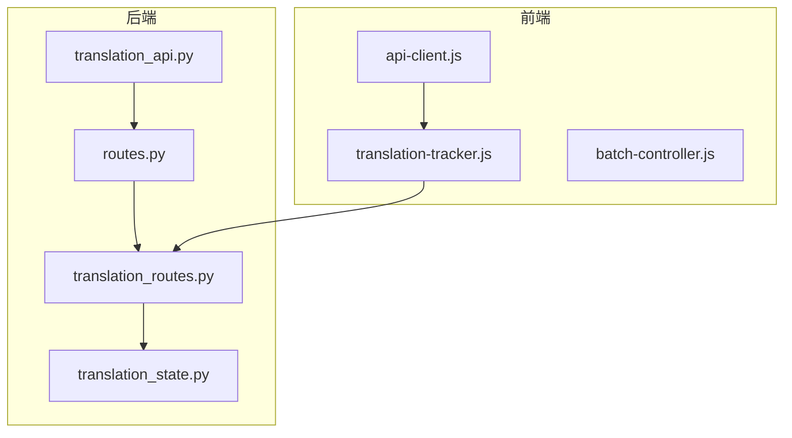
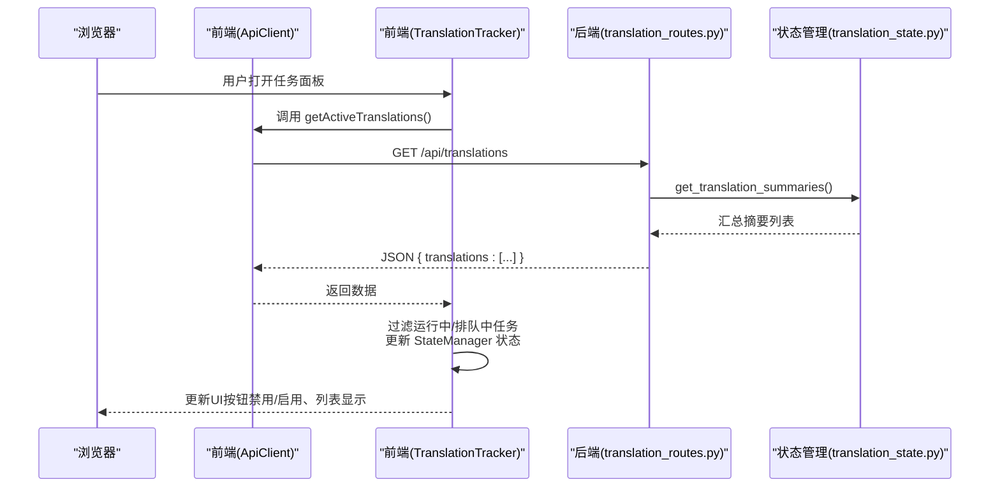
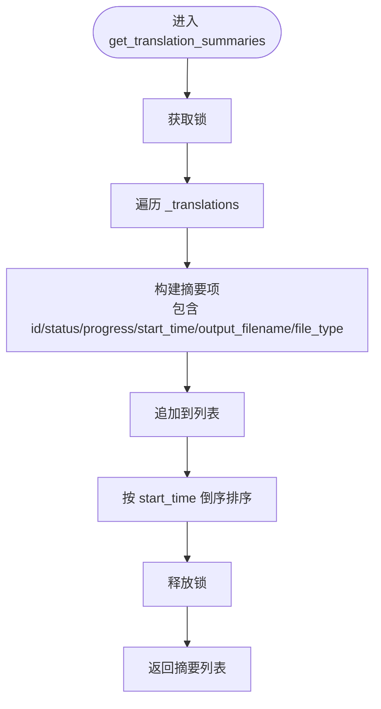
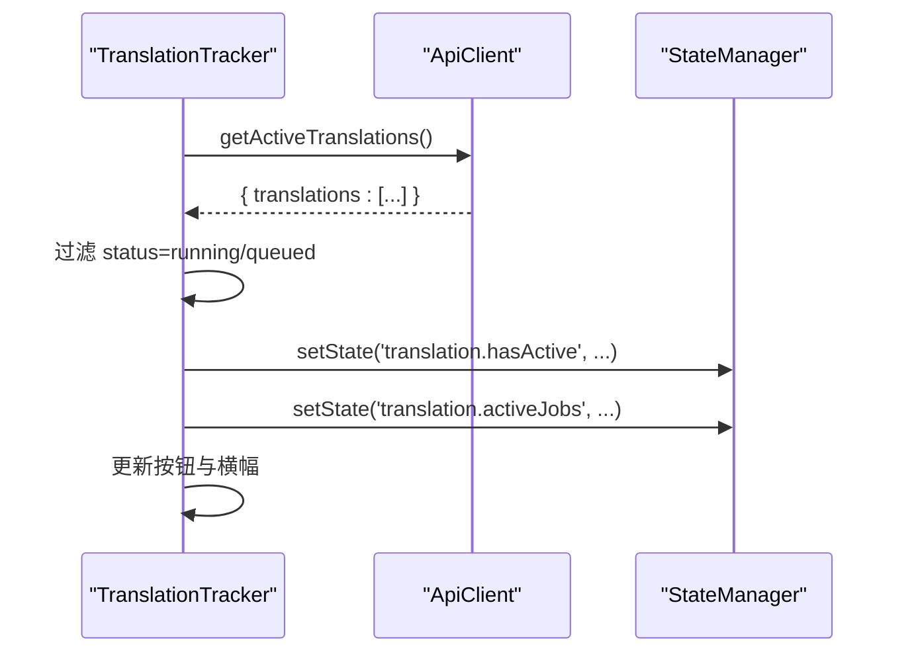
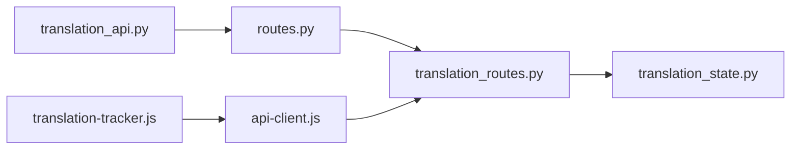

# 列出所有翻译任务

<cite>
**本文引用的文件**
- [translation_api.py](file://translation_api.py)
- [routes.py](file://src/api/routes.py)
- [translation_routes.py](file://src/api/blueprints/translation_routes.py)
- [translation_state.py](file://src/api/translation_state.py)
- [api-client.js](file://src/web/static/js/core/api-client.js)
- [translation-tracker.js](file://src/web/static/js/translation/translation-tracker.js)
- [batch-controller.js](file://src/web/static/js/translation/batch-controller.js)
</cite>

## 目录
1. [简介](#简介)
2. [项目结构](#项目结构)
3. [核心组件](#核心组件)
4. [架构总览](#架构总览)
5. [详细组件分析](#详细组件分析)
6. [依赖关系分析](#依赖关系分析)
7. [性能考量](#性能考量)
8. [故障排查指南](#故障排查指南)
9. [结论](#结论)
10. [附录](#附录)

## 简介
本文件围绕 GET /api/translations 端点进行系统化说明，目标是帮助开发者与使用者理解：
- 该端点如何返回所有已创建翻译任务的“摘要列表”
- 响应体结构（包含 translations 数组）
- 每个任务摘要的关键字段：id、status、progress、output_filename、创建时间等
- 与 get_translation_job_status 的区别：前者用于批量概览，后者用于单个任务的详细状态
- 结合前端 api-client.js 中的 getActiveTranslations 方法，演示任务管理面板的数据加载流程
- state_manager.get_translation_summaries() 的实现逻辑与多任务管理场景下的性能考虑与最佳实践

## 项目结构
与本主题直接相关的后端与前端模块如下：
- 后端路由注册与蓝图：translation_api.py、routes.py、translation_routes.py
- 状态管理：translation_state.py
- 前端 API 客户端与任务面板：api-client.js、translation-tracker.js、batch-controller.js

图表来源
- [translation_api.py](file://translation_api.py#L90-L121)
- [routes.py](file://src/api/routes.py#L23-L53)
- [translation_routes.py](file://src/api/blueprints/translation_routes.py#L141-L146)
- [translation_state.py](file://src/api/translation_state.py#L118-L131)
- [api-client.js](file://src/web/static/js/core/api-client.js#L119-L125)
- [translation-tracker.js](file://src/web/static/js/translation/translation-tracker.js#L252-L279)

章节来源
- [translation_api.py](file://translation_api.py#L90-L121)
- [routes.py](file://src/api/routes.py#L23-L53)

## 核心组件
- 路由层：在 translation_routes.py 中定义 /api/translations GET 接口，调用 state_manager.get_translation_summaries() 返回任务摘要列表。
- 状态管理层：在 translation_state.py 中维护内存态，提供 get_translation_summaries() 生成摘要并按创建时间倒序排序。
- 前端 API 客户端：在 api-client.js 中提供 getActiveTranslations() 方法，封装 /api/translations 请求。
- 前端任务面板：在 translation-tracker.js 中通过 ApiClient.getActiveTranslations() 获取数据，并更新 UI 状态与按钮可用性。

章节来源
- [translation_routes.py](file://src/api/blueprints/translation_routes.py#L141-L146)
- [translation_state.py](file://src/api/translation_state.py#L118-L131)
- [api-client.js](file://src/web/static/js/core/api-client.js#L119-L125)
- [translation-tracker.js](file://src/web/static/js/translation/translation-tracker.js#L252-L279)

## 架构总览
下图展示从浏览器到后端的状态管理与路由处理链路，以及前端如何消费该接口。

图表来源
- [translation_routes.py](file://src/api/blueprints/translation_routes.py#L141-L146)
- [translation_state.py](file://src/api/translation_state.py#L118-L131)
- [api-client.js](file://src/web/static/js/core/api-client.js#L119-L125)
- [translation-tracker.js](file://src/web/static/js/translation/translation-tracker.js#L252-L279)

## 详细组件分析

### 后端端点：GET /api/translations
- 路由定义位置：translation_routes.py
- 处理逻辑：
  - 调用 state_manager.get_translation_summaries() 获取任务摘要列表
  - 将结果包装为 { "translations": [...] } 并返回
- 关键点：
  - 仅返回“摘要”，不包含详细日志或统计细节
  - 适合前端任务面板快速渲染与筛选

章节来源
- [translation_routes.py](file://src/api/blueprints/translation_routes.py#L141-L146)

### 状态管理：get_translation_summaries()
- 实现位置：translation_state.py
- 数据来源：内部字典 _translations
- 输出字段（每个摘要项）：
  - translation_id
  - status
  - progress
  - start_time（来自 stats.start_time）
  - output_filename（来自 config.output_filename）
  - file_type（来自 config.file_type，默认 txt）
- 排序规则：按 start_time 倒序排列
- 线程安全：使用 RLock 保护并发访问

图表来源
- [translation_state.py](file://src/api/translation_state.py#L118-L131)

章节来源
- [translation_state.py](file://src/api/translation_state.py#L118-L131)

### 前端集成：ApiClient.getActiveTranslations()
- 方法位置：api-client.js
- 行为：发起 GET /api/translations 请求，返回 JSON 对象
- 使用场景：任务面板初始化时拉取任务列表；轮询刷新；与 WebSocket 推送事件配合

章节来源
- [api-client.js](file://src/web/static/js/core/api-client.js#L119-L125)

### 前端任务面板：TranslationTracker.updateActiveTranslationsState()
- 调用 ApiClient.getActiveTranslations() 获取数据
- 过滤条件：仅保留 status 为 running 或 queued 的任务
- 更新 StateManager：
  - translation.hasActive：是否存在活动任务
  - translation.activeJobs：活动任务列表
- 根据状态更新“恢复”按钮与横幅提示

图表来源
- [translation-tracker.js](file://src/web/static/js/translation/translation-tracker.js#L252-L279)

章节来源
- [translation-tracker.js](file://src/web/static/js/translation/translation-tracker.js#L252-L279)

### 与 get_translation_job_status 的区别
- GET /api/translations
  - 批量获取：返回所有任务的“摘要列表”
  - 字段精简：仅包含 id、status、progress、start_time、output_filename、file_type
  - 用途：任务面板概览、筛选、状态联动
- GET /api/translation/{translation_id}
  - 单个任务详情：返回完整状态、统计、日志、错误、配置、输出路径等
  - 用途：查看具体任务的详细进度与问题定位

章节来源
- [translation_routes.py](file://src/api/blueprints/translation_routes.py#L86-L123)
- [translation_routes.py](file://src/api/blueprints/translation_routes.py#L141-L146)

### 与批处理流程的关系
- BatchController 在启动翻译时会设置当前任务并触发事件
- TranslationTracker 在多个生命周期事件中都会重新拉取 /api/translations，以保持 UI 与服务端状态一致
- 当存在活动任务时，前端会禁用“恢复”按钮并显示警告横幅

章节来源
- [batch-controller.js](file://src/web/static/js/translation/batch-controller.js#L101-L165)
- [translation-tracker.js](file://src/web/static/js/translation/translation-tracker.js#L281-L343)

## 依赖关系分析
- translation_api.py
  - 注册蓝图 configure_routes
  - 初始化 state_manager
- routes.py
  - 统一注册各蓝图（配置、翻译、文件、安全）
- translation_routes.py
  - 定义 /api/translations GET 路由
  - 调用 state_manager.get_translation_summaries()
- translation_state.py
  - 提供线程安全的任务状态存取与汇总
- 前端
  - api-client.js 封装 /api/translations 请求
  - translation-tracker.js 使用该请求更新 UI

图表来源
- [translation_api.py](file://translation_api.py#L90-L121)
- [routes.py](file://src/api/routes.py#L23-L53)
- [translation_routes.py](file://src/api/blueprints/translation_routes.py#L141-L146)
- [translation_state.py](file://src/api/translation_state.py#L118-L131)
- [api-client.js](file://src/web/static/js/core/api-client.js#L119-L125)
- [translation-tracker.js](file://src/web/static/js/translation/translation-tracker.js#L252-L279)

## 性能考量
- 摘要生成复杂度
  - get_translation_summaries() 遍历 _translations 并构建摘要，时间复杂度 O(n)，n 为任务数量
  - 排序按 start_time 倒序，时间复杂度 O(n log n)
- 线程安全
  - 使用 RLock 保证并发安全，避免竞态条件
- 前端轮询策略
  - 建议采用节流/去抖策略，避免频繁请求导致服务器压力
  - 可结合 WebSocket 推送减少轮询频率
- 大规模任务场景
  - 若任务数量巨大，可考虑分页或增量刷新
  - 前端仅渲染最近若干条摘要，降低渲染开销

章节来源
- [translation_state.py](file://src/api/translation_state.py#L118-L131)
- [translation-tracker.js](file://src/web/static/js/translation/translation-tracker.js#L252-L279)

## 故障排查指南
- 404/未找到
  - 确认请求路径是否为 /api/translations
  - 检查后端蓝图是否正确注册
- 无数据或空列表
  - 确认已有翻译任务被创建且未清理
  - 检查前端是否正确调用 getActiveTranslations()
- 状态不一致
  - 前端可通过 WebSocket 事件与轮询同步
  - 如出现异常状态，检查 translation_tracer 是否正确处理完成/中断/错误事件
- 并发问题
  - 状态管理为线程安全，但前端仍需避免重复提交或竞态更新

章节来源
- [translation_routes.py](file://src/api/blueprints/translation_routes.py#L141-L146)
- [translation-tracker.js](file://src/web/static/js/translation/translation-tracker.js#L252-L279)

## 结论
- GET /api/translations 提供了高效、简洁的任务概览能力，适合前端任务面板的批量展示与交互
- 与 get_translation_job_status 形成互补：前者聚焦“概览”，后者聚焦“详情”
- 借助 state_manager.get_translation_summaries() 的线程安全实现与合理排序，可在多任务场景下稳定运行
- 前端通过 ApiClient.getActiveTranslations() 与 TranslationTracker.updateActiveTranslationsState() 实现状态联动与 UI 更新

## 附录

### 接口定义与响应格式
- 端点：GET /api/translations
- 请求参数：无
- 成功响应：JSON 对象，包含 translations 数组
  - 每个元素包含：
    - translation_id：任务标识
    - status：任务状态（如 queued、running、completed、interrupted、error）
    - progress：任务进度百分比
    - start_time：任务开始时间戳
    - output_filename：输出文件名
    - file_type：文件类型（默认 txt）

章节来源
- [translation_routes.py](file://src/api/blueprints/translation_routes.py#L141-L146)
- [translation_state.py](file://src/api/translation_state.py#L118-L131)