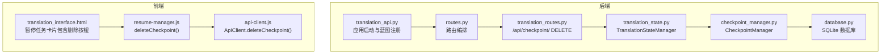
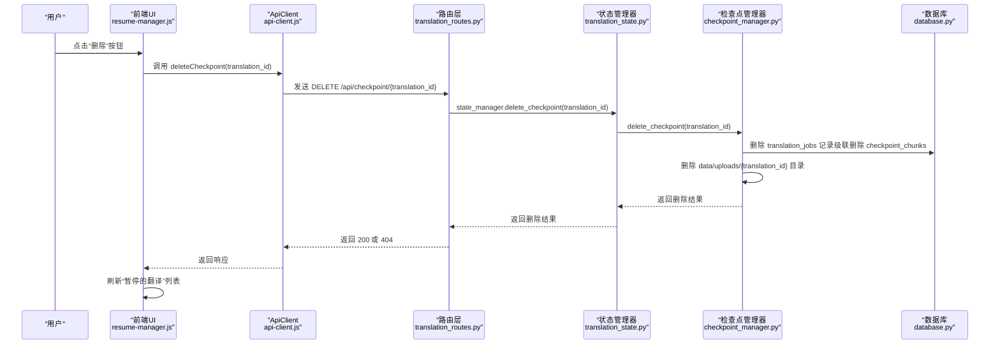
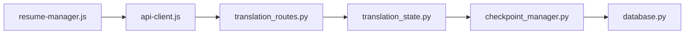

# 删除检查点

<cite>
**本文引用的文件**
- [translation_api.py](file://translation_api.py)
- [routes.py](file://src/api/routes.py)
- [translation_routes.py](file://src/api/blueprints/translation_routes.py)
- [translation_state.py](file://src/api/translation_state.py)
- [checkpoint_manager.py](file://src/persistence/checkpoint_manager.py)
- [database.py](file://src/persistence/database.py)
- [api-client.js](file://src/web/static/js/core/api-client.js)
- [resume-manager.js](file://src/web/static/js/translation/resume-manager.js)
- [translation_interface.html](file://src/web/templates/translation_interface.html)
</cite>

## 目录
1. [简介](#简介)
2. [项目结构](#项目结构)
3. [核心组件](#核心组件)
4. [架构总览](#架构总览)
5. [详细组件分析](#详细组件分析)
6. [依赖关系分析](#依赖关系分析)
7. [性能与资源管理](#性能与资源管理)
8. [故障排查指南](#故障排查指南)
9. [结论](#结论)
10. [附录](#附录)

## 简介
本文件围绕 DELETE /api/checkpoint/<id> 端点进行精确说明，该端点为用户提供“手动清理”能力，用于删除指定翻译任务的检查点数据。删除后，该任务的进度、分块翻译记录、输入文件备份等将被彻底清除，且不可恢复。后端通过状态管理器协调数据库与文件系统清理；前端通过 ApiClient 的 deleteCheckpoint 方法与后端交互，并在“暂停的翻译”列表中提供一键删除按钮。

## 项目结构
该功能涉及后端路由、状态管理、持久化层与前端 UI 模块的协同：
- 后端：蓝图注册与路由定义、状态管理器、检查点管理器、数据库模型
- 前端：ApiClient 统一请求封装、ResumeManager 负责暂停任务列表与删除操作、HTML 模板渲染删除按钮

图表来源
- [translation_api.py](file://translation_api.py#L90-L121)
- [routes.py](file://src/api/routes.py#L23-L53)
- [translation_routes.py](file://src/api/blueprints/translation_routes.py#L233-L246)
- [translation_state.py](file://src/api/translation_state.py#L184-L201)
- [checkpoint_manager.py](file://src/persistence/checkpoint_manager.py#L291-L313)
- [database.py](file://src/persistence/database.py#L439-L464)
- [api-client.js](file://src/web/static/js/core/api-client.js#L291-L301)
- [resume-manager.js](file://src/web/static/js/translation/resume-manager.js#L280-L305)
- [translation_interface.html](file://src/web/templates/translation_interface.html#L200-L218)

章节来源
- [translation_api.py](file://translation_api.py#L90-L121)
- [routes.py](file://src/api/routes.py#L23-L53)
- [translation_routes.py](file://src/api/blueprints/translation_routes.py#L233-L246)
- [translation_state.py](file://src/api/translation_state.py#L184-L201)
- [checkpoint_manager.py](file://src/persistence/checkpoint_manager.py#L291-L313)
- [database.py](file://src/persistence/database.py#L439-L464)
- [api-client.js](file://src/web/static/js/core/api-client.js#L291-L301)
- [resume-manager.js](file://src/web/static/js/translation/resume-manager.js#L280-L305)
- [translation_interface.html](file://src/web/templates/translation_interface.html#L200-L218)

## 核心组件
- 后端路由层：在翻译蓝图中定义 DELETE /api/checkpoint/<id>，调用状态管理器执行删除
- 状态管理层：负责内存态同步与委派到检查点管理器
- 检查点管理层：删除数据库记录与上传目录备份，支持自动清理完成任务
- 数据库层：translation_jobs 表与 checkpoint_chunks 表，外键级联删除分块
- 前端客户端：ApiClient 封装 DELETE 请求；ResumeManager 调用客户端并刷新 UI

章节来源
- [translation_routes.py](file://src/api/blueprints/translation_routes.py#L233-L246)
- [translation_state.py](file://src/api/translation_state.py#L184-L201)
- [checkpoint_manager.py](file://src/persistence/checkpoint_manager.py#L291-L313)
- [database.py](file://src/persistence/database.py#L439-L464)
- [api-client.js](file://src/web/static/js/core/api-client.js#L291-L301)
- [resume-manager.js](file://src/web/static/js/translation/resume-manager.js#L280-L305)

## 架构总览
DELETE /api/checkpoint/<id> 的端到端调用链如下：

图表来源
- [translation_routes.py](file://src/api/blueprints/translation_routes.py#L233-L246)
- [translation_state.py](file://src/api/translation_state.py#L184-L201)
- [checkpoint_manager.py](file://src/persistence/checkpoint_manager.py#L291-L313)
- [database.py](file://src/persistence/database.py#L439-L464)
- [api-client.js](file://src/web/static/js/core/api-client.js#L291-L301)
- [resume-manager.js](file://src/web/static/js/translation/resume-manager.js#L280-L305)

## 详细组件分析

### 后端路由：DELETE /api/checkpoint/<id>
- 定义位置：翻译蓝图
- 行为：调用 state_manager.delete_checkpoint(translation_id)，根据结果返回 200 或 404
- 错误处理：未找到检查点返回 404；内部错误由全局错误处理器捕获并返回 500

章节来源
- [translation_routes.py](file://src/api/blueprints/translation_routes.py#L233-L246)
- [routes.py](file://src/api/routes.py#L54-L66)

### 状态管理层：TranslationStateManager.delete_checkpoint
- 内存态同步：若存在同名任务则先从内存态移除
- 委派清理：调用 CheckpointManager.delete_checkpoint
- 返回值：布尔型，表示是否删除成功

章节来源
- [translation_state.py](file://src/api/translation_state.py#L184-L201)

### 检查点管理层：CheckpointManager.delete_checkpoint
- 数据库删除：删除 translation_jobs 记录；由于外键设置为级联删除，checkpoint_chunks 会随之删除
- 文件系统清理：删除 data/uploads/{translation_id} 目录（包含已保存的原始输入文件备份）
- 返回值：布尔型，表示删除是否成功

章节来源
- [checkpoint_manager.py](file://src/persistence/checkpoint_manager.py#L291-L313)
- [database.py](file://src/persistence/database.py#L439-L464)

### 数据库模型：translation_jobs 与 checkpoint_chunks
- translation_jobs：存储任务元数据、配置、进度、上下文与时间戳
- checkpoint_chunks：按 translation_id 分组存储每个分块的原文、译文、状态与时间
- 约束：checkpoint_chunks 外键关联 translation_jobs，ON DELETE CASCADE 自动清理分块

章节来源
- [database.py](file://src/persistence/database.py#L48-L98)
- [database.py](file://src/persistence/database.py#L220-L267)
- [database.py](file://src/persistence/database.py#L334-L370)
- [database.py](file://src/persistence/database.py#L439-L464)

### 前端：ApiClient.deleteCheckpoint 与 ResumeManager.deleteCheckpoint
- ApiClient.deleteCheckpoint：封装 DELETE /api/checkpoint/{translation_id}
- ResumeManager.deleteCheckpoint：弹出确认对话框，调用 ApiClient.deleteCheckpoint，成功后刷新“暂停的翻译”列表

章节来源
- [api-client.js](file://src/web/static/js/core/api-client.js#L291-L301)
- [resume-manager.js](file://src/web/static/js/translation/resume-manager.js#L280-L305)

### 前端 UI：暂停任务卡片中的删除按钮
- HTML 中直接绑定 onclick="deleteCheckpoint(translation_id)"
- 与 ResumeManager.deleteCheckpoint 对应，确保删除动作一致

章节来源
- [translation_interface.html](file://src/web/templates/translation_interface.html#L200-L218)
- [resume-manager.js](file://src/web/static/js/translation/resume-manager.js#L280-L305)

## 依赖关系分析
- 路由依赖：translation_routes 依赖 translation_state
- 状态管理依赖：translation_state 依赖 checkpoint_manager
- 检查点管理依赖：checkpoint_manager 依赖 database
- 前端依赖：resume-manager 依赖 api-client；api-client 依赖 fetch

图表来源
- [translation_routes.py](file://src/api/blueprints/translation_routes.py#L233-L246)
- [translation_state.py](file://src/api/translation_state.py#L184-L201)
- [checkpoint_manager.py](file://src/persistence/checkpoint_manager.py#L291-L313)
- [database.py](file://src/persistence/database.py#L439-L464)
- [api-client.js](file://src/web/static/js/core/api-client.js#L291-L301)
- [resume-manager.js](file://src/web/static/js/translation/resume-manager.js#L280-L305)

## 性能与资源管理
- 删除流程复杂度
  - 数据库删除：translation_jobs 删除为 O(1)，checkpoint_chunks 级联删除受分块数量影响
  - 文件系统删除：删除 data/uploads/{translation_id} 目录，成本与备份文件大小和数量相关
- 磁盘空间管理
  - 检查点清理可显著释放空间，特别是 EPUB 快速模式下的纯文本重建与大量分块
  - 建议定期清理已完成或长时间未使用的检查点，避免磁盘占用增长
- 并发与一致性
  - 状态管理器使用线程锁保护，避免并发修改导致的数据不一致
  - 删除操作在内存态与持久态之间保持一致，防止残留状态

[本节为通用性能讨论，无需特定文件来源]

## 故障排查指南
- 常见错误与原因
  - 404 未找到：translation_id 不存在或已被清理
  - 500 内部错误：数据库异常或文件系统删除失败
- 排查步骤
  - 确认 translation_id 是否正确
  - 查看服务端日志定位数据库或文件系统异常
  - 检查 data/uploads/{translation_id} 目录是否存在残留
- 前端提示
  - 删除前弹窗确认，避免误删
  - 成功后自动刷新“暂停的翻译”列表，确认不再显示

章节来源
- [translation_routes.py](file://src/api/blueprints/translation_routes.py#L233-L246)
- [routes.py](file://src/api/routes.py#L54-L66)
- [resume-manager.js](file://src/web/static/js/translation/resume-manager.js#L280-L305)

## 结论
DELETE /api/checkpoint/<id> 提供了安全可控的检查点清理能力。后端通过状态管理器与检查点管理器协调数据库与文件系统的清理，前端通过统一的 ApiClient 与 ResumeManager 实现一键删除。该设计兼顾了用户控制权与资源管理效率，建议在批量任务完成后定期清理，以维持良好的磁盘空间与运行性能。

[本节为总结性内容，无需特定文件来源]

## 附录

### API 定义与行为摘要
- 端点：DELETE /api/checkpoint/{translation_id}
- 成功：返回 200，包含成功消息与 translation_id
- 失败：
  - 404：检查点不存在
  - 500：内部错误（数据库或文件系统异常）

章节来源
- [translation_routes.py](file://src/api/blueprints/translation_routes.py#L233-L246)
- [routes.py](file://src/api/routes.py#L54-L66)

### 物理存储位置与命名约定
- 数据库存储：SQLite 文件位于 data/jobs.db
- 分块表：checkpoint_chunks，按 translation_id 分组
- 输入文件备份：data/uploads/{translation_id}/ 原始文件名（保留哈希前缀）
- 清理范围：translation_jobs 记录与对应分块，以及 data/uploads/{translation_id} 目录

章节来源
- [database.py](file://src/persistence/database.py#L48-L98)
- [database.py](file://src/persistence/database.py#L439-L464)
- [checkpoint_manager.py](file://src/persistence/checkpoint_manager.py#L291-L313)

### 前端清理按钮实现要点
- HTML 按钮：onclick 绑定 deleteCheckpoint(translation_id)
- 确认对话框：避免误删
- 成功反馈：消息提示与列表刷新
- 与 ApiClient 协作：统一的 DELETE 请求封装

章节来源
- [translation_interface.html](file://src/web/templates/translation_interface.html#L200-L218)
- [resume-manager.js](file://src/web/static/js/translation/resume-manager.js#L280-L305)
- [api-client.js](file://src/web/static/js/core/api-client.js#L291-L301)