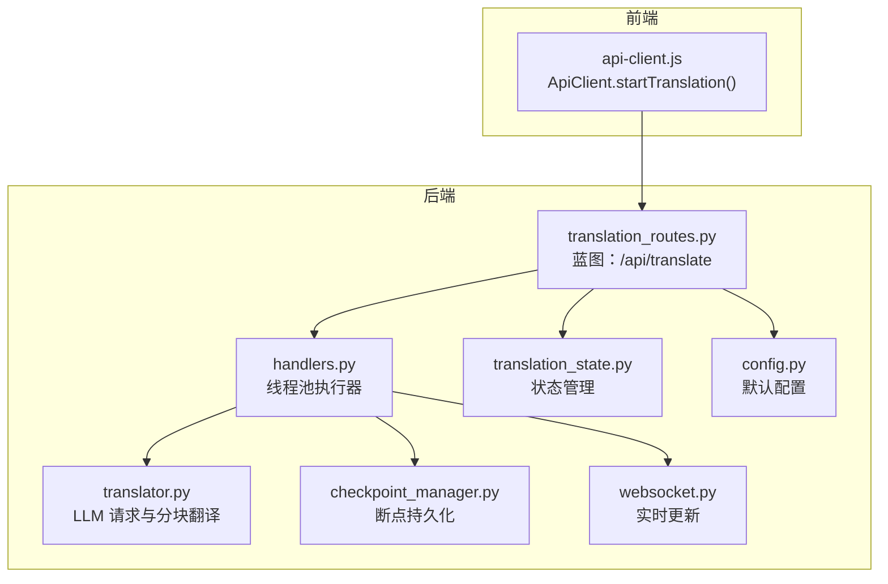

# 启动翻译任务

<cite>
**本文引用的文件列表**
- [translation_routes.py](file://src/api/blueprints/translation_routes.py)
- [api-client.js](file://src/web/static/js/core/api-client.js)
- [handlers.py](file://src/api/handlers.py)
- [translator.py](file://src/core/translator.py)
- [translation_state.py](file://src/api/translation_state.py)
- [checkpoint_manager.py](file://src/persistence/checkpoint_manager.py)
- [websocket.py](file://src/api/websocket.py)
- [config.py](file://src/config.py)
</cite>

## 目录
1. [简介](#简介)
2. [项目结构](#项目结构)
3. [核心组件](#核心组件)
4. [架构总览](#架构总览)
5. [详细组件分析](#详细组件分析)
6. [依赖关系分析](#依赖关系分析)
7. [性能考量](#性能考量)
8. [故障排查指南](#故障排查指南)
9. [结论](#结论)
10. [附录：JavaScript 调用示例](#附录javascript-调用示例)

## 简介
本文件为 POST /api/translate 端点的完整 API 文档，面向前端与集成开发者，覆盖以下内容：
- HTTP 方法、URL 模式、请求头要求
- 请求体 Schema（字段类型、是否必需、默认值）
- 响应格式（成功/失败）
- 可能的 HTTP 状态码
- 与核心翻译引擎的交互流程
- 如何生成唯一任务 ID 并触发后台异步翻译作业
- 高级参数（chunk_size、context_window 等）的作用与影响
- 结合 api-client.js 的 JavaScript 调用示例

## 项目结构
与该端点直接相关的后端模块与前端客户端如下图所示：

图表来源
- [translation_routes.py](file://src/api/blueprints/translation_routes.py#L26-L85)
- [handlers.py](file://src/api/handlers.py#L436-L452)
- [translator.py](file://src/core/translator.py#L123-L371)
- [translation_state.py](file://src/api/translation_state.py#L12-L38)
- [checkpoint_manager.py](file://src/persistence/checkpoint_manager.py#L12-L56)
- [websocket.py](file://src/api/websocket.py#L21-L43)
- [config.py](file://src/config.py#L56-L72)
- [api-client.js](file://src/web/static/js/core/api-client.js#L98-L108)

章节来源
- [translation_routes.py](file://src/api/blueprints/translation_routes.py#L26-L85)
- [api-client.js](file://src/web/static/js/core/api-client.js#L98-L108)

## 核心组件
- 端点定义与请求校验：在蓝图中定义 POST /api/translate，进行必填字段校验与配置构建。
- 状态管理：创建任务条目，设置初始状态、进度、日志、统计信息。
- 异步执行：将翻译任务放入线程池，异步运行，不阻塞 HTTP 请求。
- LLM 交互：按分块发送请求，自动上下文优化与重试策略。
- 断点与恢复：保存每块翻译结果，支持中断后恢复。
- 实时反馈：通过 WebSocket 推送进度、统计、日志与最终结果。

章节来源
- [translation_routes.py](file://src/api/blueprints/translation_routes.py#L26-L85)
- [handlers.py](file://src/api/handlers.py#L436-L452)
- [translator.py](file://src/core/translator.py#L123-L371)
- [translation_state.py](file://src/api/translation_state.py#L12-L38)
- [checkpoint_manager.py](file://src/persistence/checkpoint_manager.py#L120-L174)
- [websocket.py](file://src/api/websocket.py#L21-L43)

## 架构总览
POST /api/translate 的端到端调用序列如下：

图表来源
- [api-client.js](file://src/web/static/js/core/api-client.js#L98-L108)
- [translation_routes.py](file://src/api/blueprints/translation_routes.py#L26-L85)
- [handlers.py](file://src/api/handlers.py#L436-L452)
- [translator.py](file://src/core/translator.py#L123-L371)
- [translation_state.py](file://src/api/translation_state.py#L12-L38)
- [checkpoint_manager.py](file://src/persistence/checkpoint_manager.py#L120-L174)
- [websocket.py](file://src/api/websocket.py#L21-L43)

## 详细组件分析

### 端点：POST /api/translate
- HTTP 方法：POST
- URL 模式：/api/translate
- 请求头要求：Content-Type: application/json
- 请求体 Schema（字段说明）
  - file_path：字符串，可选；当提供时，需同时提供 source_language、target_language、model、llm_api_endpoint、output_filename、file_type
  - text：字符串，可选；当 file_path 缺失时，需提供 text、source_language、target_language、model、llm_api_endpoint、output_filename
  - source_language：字符串，必填
  - target_language：字符串，必填
  - model：字符串，必填
  - llm_api_endpoint：字符串，必填
  - output_filename：字符串，必填
  - file_type：字符串，必填（当使用 file_path 时），可选（当使用 text 时，默认为 txt）
  - chunk_size：整数，可选，默认取自环境变量 MAIN_LINES_PER_CHUNK（见配置）
  - timeout：整数，可选，默认取自 REQUEST_TIMEOUT（见配置）
  - context_window：整数，可选，默认取自 OLLAMA_NUM_CTX（见配置）
  - max_attempts：整数，可选，默认 2
  - retry_delay：整数，可选，默认 2
  - llm_provider：字符串，可选，默认 "ollama"
  - gemini_api_key：字符串，可选；若未提供则从环境变量读取
  - fast_mode：布尔，可选，默认 false
  - 其他：如 min_chunk_size、auto_adjust_context 等，用于分块与上下文优化（见下节）
- 成功响应：包含 translation_id、消息、config_received
- 失败响应：包含错误信息
- 可能的 HTTP 状态码：
  - 200：成功
  - 400：缺少或空字段
  - 500：服务器内部错误（异常捕获）

章节来源
- [translation_routes.py](file://src/api/blueprints/translation_routes.py#L26-L85)
- [config.py](file://src/config.py#L56-L72)

### 状态管理与任务生命周期
- 创建任务：生成唯一 translation_id（时间戳前缀），初始化状态为 queued，写入初始日志与统计
- 运行中：状态切换为 running，WebSocket 推送开始事件
- 中断：支持用户中断，标记 interrupted，保存断点
- 完成：统计耗时，清理断点，推送完成事件
- 错误：捕获异常，标记 error，推送错误事件

章节来源
- [translation_routes.py](file://src/api/blueprints/translation_routes.py#L46-L85)
- [translation_state.py](file://src/api/translation_state.py#L12-L38)
- [handlers.py](file://src/api/handlers.py#L49-L134)

### 与核心翻译引擎的交互
- 线程池执行：start_translation_job 将任务投递到独立线程，避免阻塞 HTTP
- 分块翻译：translate_chunks 按 chunk_size 切分文本，逐块调用 LLM
- 上下文优化：根据模型与 num_ctx 自动调整参数，必要时警告
- 断点保存：逐块保存翻译结果与统计，支持恢复
- 日志与进度：统一日志回调，周期性推送进度与统计

章节来源
- [handlers.py](file://src/api/handlers.py#L436-L452)
- [translator.py](file://src/core/translator.py#L123-L371)
- [checkpoint_manager.py](file://src/persistence/checkpoint_manager.py#L120-L174)

### 高级参数说明与影响
- chunk_size
  - 作用：每块翻译的行数（文本类文件）
  - 影响：越大吞吐越高但越易超上下文；越小越稳定但并发开销大
  - 默认：来自 MAIN_LINES_PER_CHUNK（见配置）
- context_window（num_ctx）
  - 作用：LLM 上下文窗口大小（tokens）
  - 影响：过大可能导致超限，过小导致上下文不足；系统会进行验证与自动调整
  - 默认：来自 OLLAMA_NUM_CTX（见配置）
- timeout
  - 作用：单次 LLM 请求超时秒数
  - 默认：REQUEST_TIMEOUT（见配置）
- max_attempts/retry_delay
  - 作用：失败重试次数与间隔
  - 默认：2/2
- fast_mode
  - 作用：简化提示词，提升速度
  - 默认：false
- auto_adjust_context/min_chunk_size
  - 作用：自动评估与调整上下文与最小块大小
  - 默认：由配置控制（见配置）

章节来源
- [translation_routes.py](file://src/api/blueprints/translation_routes.py#L46-L64)
- [translator.py](file://src/core/translator.py#L194-L210)
- [config.py](file://src/config.py#L56-L72)

## 依赖关系分析
- translation_routes.py 依赖：
  - config.py 提供默认参数
  - translation_state.py 维护任务状态
  - handlers.py 启动翻译线程
  - checkpoint_manager.py 保存断点
  - websocket.py 推送实时更新
- handlers.py 依赖：
  - translator.py 执行翻译
  - translation_state.py 读写状态
  - checkpoint_manager.py 读写断点
  - websocket.py 推送事件
- translator.py 依赖：
  - llm_client（在 create_llm_client 中创建）
  - context_optimizer（上下文验证与调整）
  - post_processor（清洗输出）
- translation_state.py 依赖：
  - checkpoint_manager.py 数据持久化
- checkpoint_manager.py 依赖：
  - database（SQLite）持久化

图表来源
- [translation_routes.py](file://src/api/blueprints/translation_routes.py#L26-L85)
- [handlers.py](file://src/api/handlers.py#L436-L452)
- [translator.py](file://src/core/translator.py#L123-L371)
- [translation_state.py](file://src/api/translation_state.py#L12-L38)
- [checkpoint_manager.py](file://src/persistence/checkpoint_manager.py#L12-L56)
- [websocket.py](file://src/api/websocket.py#L21-L43)
- [config.py](file://src/config.py#L56-L72)

## 性能考量
- 分块大小与上下文窗口
  - 建议优先启用 auto_adjust_context，让系统根据模型与 num_ctx 自动调整
  - 对于长段落，适当减小 chunk_size 以降低超上下文风险
- 超时与重试
  - 合理设置 timeout 与 max_attempts/retry_delay，避免长时间阻塞
- 并发与中断
  - 支持中断与断点恢复，建议在大批量任务中开启断点保存
- 输出文件名去重
  - 服务端会自动避免覆盖，确保输出安全

[本节为通用指导，无需列出具体文件来源]

## 故障排查指南
- 400 参数缺失或为空
  - 检查 file_path 与 text 的二选一规则，以及 source_language、target_language、model、llm_api_endpoint、output_filename 是否齐全
- 500 服务器内部错误
  - 查看 WebSocket 或后端日志，定位异常堆栈
- 中断与恢复
  - 使用 /api/resume/<translation_id> 恢复；若无断点或输入文件丢失，将无法恢复
- 进度与日志
  - 通过 WebSocket 接收实时更新；也可轮询 /api/translation/<translation_id> 获取状态

章节来源
- [translation_routes.py](file://src/api/blueprints/translation_routes.py#L26-L85)
- [handlers.py](file://src/api/handlers.py#L415-L435)
- [websocket.py](file://src/api/websocket.py#L21-L43)

## 结论
POST /api/translate 提供了简单而强大的翻译任务入口，具备完善的参数校验、异步执行、断点恢复与实时反馈能力。通过合理配置 chunk_size、context_window、timeout 等参数，可在质量与性能之间取得平衡。结合 api-client.js 的调用方式，前端可以快速集成并获得流畅的用户体验。

[本节为总结性内容，无需列出具体文件来源]

## 附录：JavaScript 调用示例
- 使用 ApiClient.startTranslation(config) 发起翻译任务
- config 字段与默认值参考“请求体 Schema”
- 建议在调用前设置正确的 API 基础地址（如需要）
- 前端可通过 WebSocket 接收实时进度与日志，或轮询 /api/translation/<translation_id> 获取状态

章节来源
- [api-client.js](file://src/web/static/js/core/api-client.js#L98-L108)
- [translation_routes.py](file://src/api/blueprints/translation_routes.py#L26-L85)