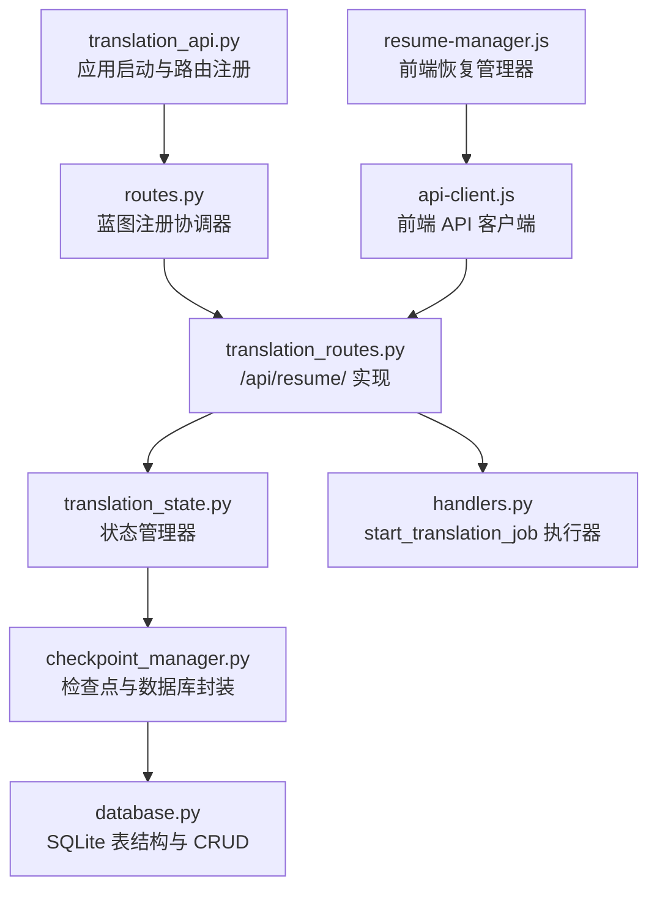
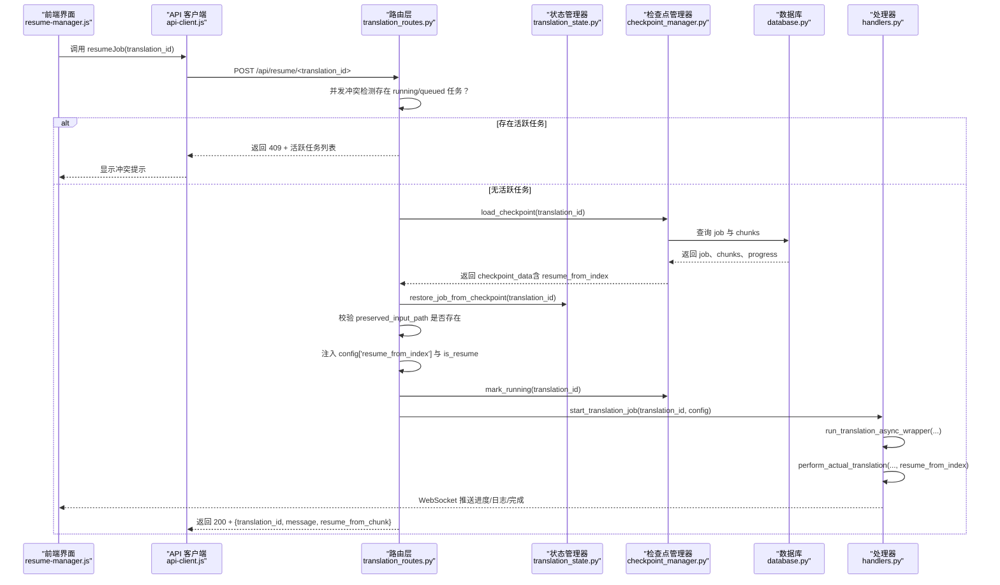
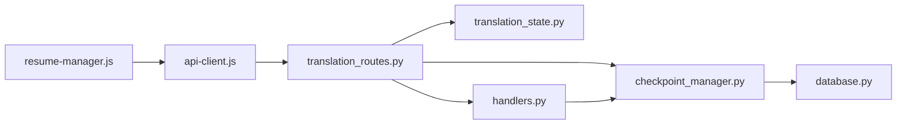

# 恢复翻译任务

<cite>
**本文引用的文件列表**
- [translation_api.py](file://translation_api.py)
- [routes.py](file://src/api/routes.py)
- [translation_routes.py](file://src/api/blueprints/translation_routes.py)
- [translation_state.py](file://src/api/translation_state.py)
- [handlers.py](file://src/api/handlers.py)
- [checkpoint_manager.py](file://src/persistence/checkpoint_manager.py)
- [database.py](file://src/persistence/database.py)
- [api-client.js](file://src/web/static/js/core/api-client.js)
- [resume-manager.js](file://src/web/static/js/translation/resume-manager.js)
</cite>

## 目录
1. [简介](#简介)
2. [项目结构与入口](#项目结构与入口)
3. [核心组件](#核心组件)
4. [架构总览](#架构总览)
5. [详细组件分析](#详细组件分析)
6. [依赖关系分析](#依赖关系分析)
7. [性能与可靠性考量](#性能与可靠性考量)
8. [故障排查指南](#故障排查指南)
9. [结论](#结论)

## 简介
本文件围绕 POST /api/resume/<id> 端点，系统性阐述断点续传的实现机制与流程。重点覆盖：
- 并发控制：在存在活跃任务时拒绝恢复请求，避免资源竞争与状态冲突
- 检查点加载：从数据库与上传目录恢复任务配置、进度与上下文
- 输入文件校验：确保 preserved_input_path 指向的原始文件可访问
- 恢复执行：设置 resume_from_index 与 is_resume 标志，标记运行态并启动翻译工作流
- 响应内容：返回 translation_id、消息与 resume_from_chunk 字段
- 前端集成：结合 api-client.js 的 resumeJob 方法与 resume-manager.js 的交互逻辑
- 检查点机制：何时创建、数据结构（job、resume_from_index）、preserved_input_path 的一致性保障
- 失败场景与处理：文件缺失、检查点损坏、并发冲突等

## 项目结构与入口
后端通过 translation_api.py 启动 Flask 应用，并注册蓝图；翻译路由由 translation_routes.py 提供，实际业务逻辑在 handlers.py 中执行；持久化由 checkpoint_manager.py 与 database.py 负责；前端通过 api-client.js 发起 /api/resume/<id> 请求，resume-manager.js 负责 UI 交互与提示。

图表来源
- [translation_api.py](file://translation_api.py#L89-L118)
- [routes.py](file://src/api/routes.py#L23-L51)
- [translation_routes.py](file://src/api/blueprints/translation_routes.py#L153-L246)
- [translation_state.py](file://src/api/translation_state.py#L12-L21)
- [checkpoint_manager.py](file://src/persistence/checkpoint_manager.py#L12-L31)
- [database.py](file://src/persistence/database.py#L48-L98)
- [handlers.py](file://src/api/handlers.py#L436-L452)
- [api-client.js](file://src/web/static/js/core/api-client.js#L280-L301)
- [resume-manager.js](file://src/web/static/js/translation/resume-manager.js#L179-L211)

章节来源
- [translation_api.py](file://translation_api.py#L89-L118)
- [routes.py](file://src/api/routes.py#L23-L51)

## 核心组件
- 状态管理器（TranslationStateManager）
  - 负责内存中任务状态的增删改查、并发安全（RLock）
  - 提供恢复任务到内存的能力（restore_job_from_checkpoint）
- 检查点管理器（CheckpointManager）
  - 负责 job 创建、检查点保存、加载、清理
  - 维护 preserved_input_path，确保多次恢复时输入文件路径一致
- 数据库（Database）
  - translation_jobs 表：存储 job 元数据、进度、上下文
  - checkpoint_chunks 表：按 chunk_index 存储已完成/失败片段
- 路由层（translation_routes.py）
  - /api/resume/<id>：并发检查、加载检查点、校验输入文件、注入恢复参数、标记运行态并启动翻译
- 处理器（handlers.py）
  - start_translation_job：线程池启动异步翻译流程
  - perform_actual_translation：根据 is_resume 与 resume_from_index 决定从哪一 chunk 开始
- 前端客户端（api-client.js、resume-manager.js）
  - ApiClient.resumeJob：发起 POST /api/resume/<id>
  - ResumeManager.resumeJob：UI 层并发拦截、确认、展示恢复结果与进度

章节来源
- [translation_state.py](file://src/api/translation_state.py#L12-L21)
- [checkpoint_manager.py](file://src/persistence/checkpoint_manager.py#L12-L31)
- [database.py](file://src/persistence/database.py#L48-L98)
- [translation_routes.py](file://src/api/blueprints/translation_routes.py#L153-L246)
- [handlers.py](file://src/api/handlers.py#L436-L452)
- [api-client.js](file://src/web/static/js/core/api-client.js#L280-L301)
- [resume-manager.js](file://src/web/static/js/translation/resume-manager.js#L179-L211)

## 架构总览
下图展示了从用户触发恢复到翻译工作流启动的关键交互。

图表来源
- [translation_routes.py](file://src/api/blueprints/translation_routes.py#L153-L246)
- [translation_state.py](file://src/api/translation_state.py#L148-L182)
- [checkpoint_manager.py](file://src/persistence/checkpoint_manager.py#L175-L206)
- [database.py](file://src/persistence/database.py#L268-L307)
- [handlers.py](file://src/api/handlers.py#L436-L452)
- [api-client.js](file://src/web/static/js/core/api-client.js#L280-L301)
- [resume-manager.js](file://src/web/static/js/translation/resume-manager.js#L179-L211)

## 详细组件分析

### 路由：/api/resume/<id>（POST）
- 并发冲突检测
  - 遍历所有任务，若存在 status 为 running 或 queued，则拒绝恢复并返回 409，携带活跃任务列表
- 加载检查点
  - 使用 checkpoint_manager.load_checkpoint 获取 job、chunks、resume_from_index、translation_context
- 恢复到内存
  - 调用 state_manager.restore_job_from_checkpoint 将 job 状态恢复为 paused，并保留 resume_from_index
- 输入文件校验
  - 优先使用 config['preserved_input_path']，若存在则直接赋给 config['file_path']；否则回退到从数据库查询 preserved_input_path
  - 若最终仍不可用或文件不存在，返回 404 并给出建议
- 注入恢复参数
  - 在 config 中写入 resume_from_index 与 is_resume
- 标记运行态并启动
  - 调用 checkpoint_manager.mark_running 更新数据库状态
  - 调用 start_translation_job 启动翻译工作流
- 成功响应
  - 返回 {translation_id, message, resume_from_chunk}

章节来源
- [translation_routes.py](file://src/api/blueprints/translation_routes.py#L153-L246)

### 状态管理器：restore_job_from_checkpoint
- 从检查点加载 job 与 progress，深拷贝 config，避免污染持久化配置
- 设置状态为 paused，便于后续由 is_resume 控制从 resume_from_index 开始
- 将 resume_from_index 写入内存任务对象，供处理器读取

章节来源
- [translation_state.py](file://src/api/translation_state.py#L148-L182)

### 检查点管理器：load_checkpoint 与 preserved_input_path
- load_checkpoint
  - 从 translation_jobs 读取 job 与 progress
  - 从 checkpoint_chunks 读取已完成片段
  - 计算 resume_from_index = progress['current_chunk_index'] + 1
  - 返回 job、chunks、resume_from_index、translation_context
- preserved_input_path
  - 在 start_job 时将上传文件复制到 data/uploads/<translation_id>/ 下，并更新 config['preserved_input_path']
  - 恢复时始终优先使用 preserved_input_path，保证跨次恢复的一致性
  - 若文件不存在，明确返回 404 并提示无法恢复

章节来源
- [checkpoint_manager.py](file://src/persistence/checkpoint_manager.py#L175-L206)
- [checkpoint_manager.py](file://src/persistence/checkpoint_manager.py#L82-L119)

### 数据库：translation_jobs 与 checkpoint_chunks
- translation_jobs
  - 存储 status、file_type、config（JSON）、progress（JSON）、translation_context（JSON）
  - progress 字段包含 current_chunk_index、total_chunks、completed_chunks、failed_chunks 等
- checkpoint_chunks
  - 以 (translation_id, chunk_index) 为主键，存储每个 chunk 的原文、译文、chunk_data、状态与完成时间
- get_resumable_jobs
  - 查询 status 为 paused、interrupted、error 的任务，用于前端“可恢复任务”列表展示

章节来源
- [database.py](file://src/persistence/database.py#L48-L98)
- [database.py](file://src/persistence/database.py#L268-L307)
- [database.py](file://src/persistence/database.py#L334-L370)
- [database.py](file://src/persistence/database.py#L371-L406)

### 处理器：start_translation_job 与 perform_actual_translation
- start_translation_job
  - 在独立线程中启动 run_translation_async_wrapper，再进入异步事件循环执行 perform_actual_translation
- perform_actual_translation
  - 读取 config['resume_from_index'] 与 config['is_resume']，决定是否从指定索引开始
  - 对 txt/srt/epub 分别调用对应的翻译流程，并将 resume_from_index 传递给底层模块
  - 在中断或完成时更新状态与日志，必要时清理上传文件

章节来源
- [handlers.py](file://src/api/handlers.py#L436-L452)
- [handlers.py](file://src/api/handlers.py#L18-L33)
- [handlers.py](file://src/api/handlers.py#L49-L120)
- [handlers.py](file://src/api/handlers.py#L135-L221)
- [handlers.py](file://src/api/handlers.py#L224-L291)

### 前端：api-client.js 与 resume-manager.js
- ApiClient.resumeJob
  - 发起 POST /api/resume/<translation_id>，返回 JSON
- ResumeManager.resumeJob
  - 在存在活跃任务时阻止恢复并提示
  - 调用 ApiClient.resumeJob，收到响应后显示“从 chunk X 恢复”的成功消息
  - 刷新进度面板与统计信息，滚动到进度区域

章节来源
- [api-client.js](file://src/web/static/js/core/api-client.js#L280-L301)
- [resume-manager.js](file://src/web/static/js/translation/resume-manager.js#L179-L211)

## 依赖关系分析
- 路由层依赖状态管理器与检查点管理器，后者依赖数据库
- 处理器依赖检查点管理器与各文件类型翻译模块
- 前端通过 ApiClient 与路由层交互，resume-manager.js 负责 UI 与提示

图表来源
- [translation_routes.py](file://src/api/blueprints/translation_routes.py#L153-L246)
- [translation_state.py](file://src/api/translation_state.py#L12-L21)
- [checkpoint_manager.py](file://src/persistence/checkpoint_manager.py#L12-L31)
- [database.py](file://src/persistence/database.py#L48-L98)
- [handlers.py](file://src/api/handlers.py#L436-L452)
- [api-client.js](file://src/web/static/js/core/api-client.js#L280-L301)
- [resume-manager.js](file://src/web/static/js/translation/resume-manager.js#L179-L211)

## 性能与可靠性考量
- 并发控制
  - 路由层在恢复前进行活跃任务检测，避免同时运行多个翻译任务导致资源争用
- 检查点粒度
  - 按 chunk 粒度保存，resume_from_index 精确控制重放起点，减少重复计算
- 文件路径一致性
  - preserved_input_path 保证多次恢复时输入文件路径稳定，避免因临时文件被清理导致恢复失败
- 日志与状态
  - WebSocket 推送实时日志与进度，便于用户感知恢复过程
- 自动清理
  - 完成后自动清理检查点与上传文件，降低磁盘占用

[本节为通用指导，不直接分析具体文件]

## 故障排查指南
- 409 冲突：存在活跃任务
  - 现象：返回 {error, message, active_translations}
  - 处理：等待当前任务结束或手动中断后再试
- 404 无检查点
  - 现象：返回 {error: "No checkpoint found for this translation"}
  - 处理：删除该检查点并重新开始翻译
- 404 缺失 preserved_input_path
  - 现象：返回 {error: "Preserved input file not found" 或 "No preserved input file"}
  - 处理：确认 preserved_input_path 指向的文件是否存在；若不存在，删除检查点并重新开始
- 500 恢复失败
  - 现象：返回 {error: "Failed to restore job from checkpoint"}
  - 处理：检查数据库完整性与权限；必要时删除检查点后重建
- 前端提示
  - ResumeManager 对 409 场景有专门的友好提示与错误日志输出

章节来源
- [translation_routes.py](file://src/api/blueprints/translation_routes.py#L153-L246)
- [resume-manager.js](file://src/web/static/js/translation/resume-manager.js#L262-L277)

## 结论
POST /api/resume/<id> 通过严格的并发控制、可靠的检查点加载与 preserved_input_path 一致性保障，实现了稳定的断点续传能力。后端在路由层完成前置校验与参数注入，处理器按 resume_from_index 精准恢复进度，前端通过 ApiClient 与 ResumeManager 提供直观的交互体验。若出现异常，可依据错误码与提示快速定位问题并采取相应措施。