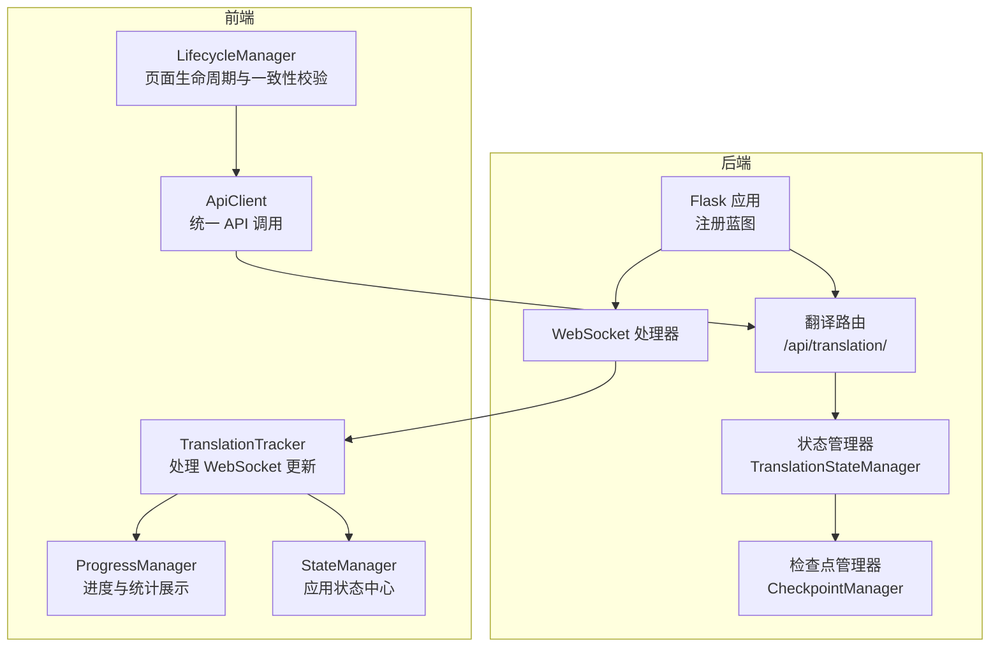
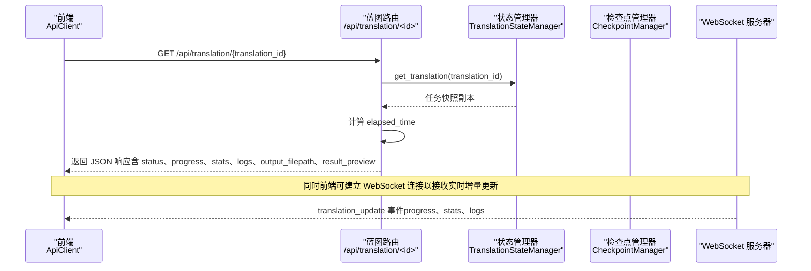
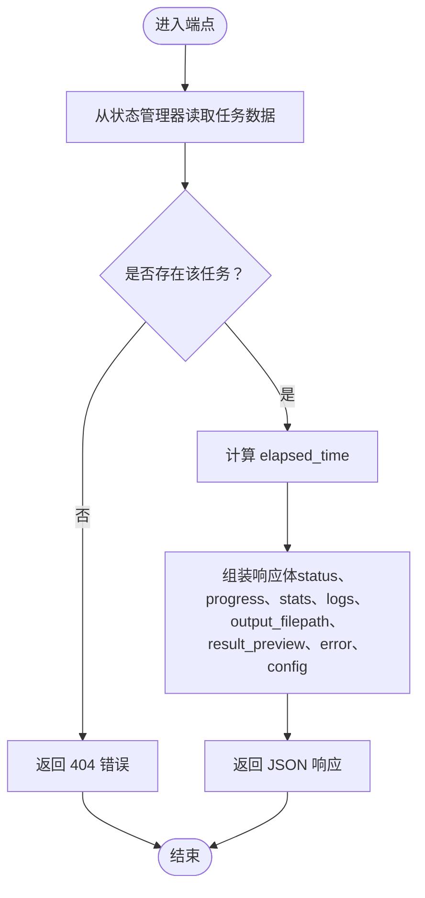
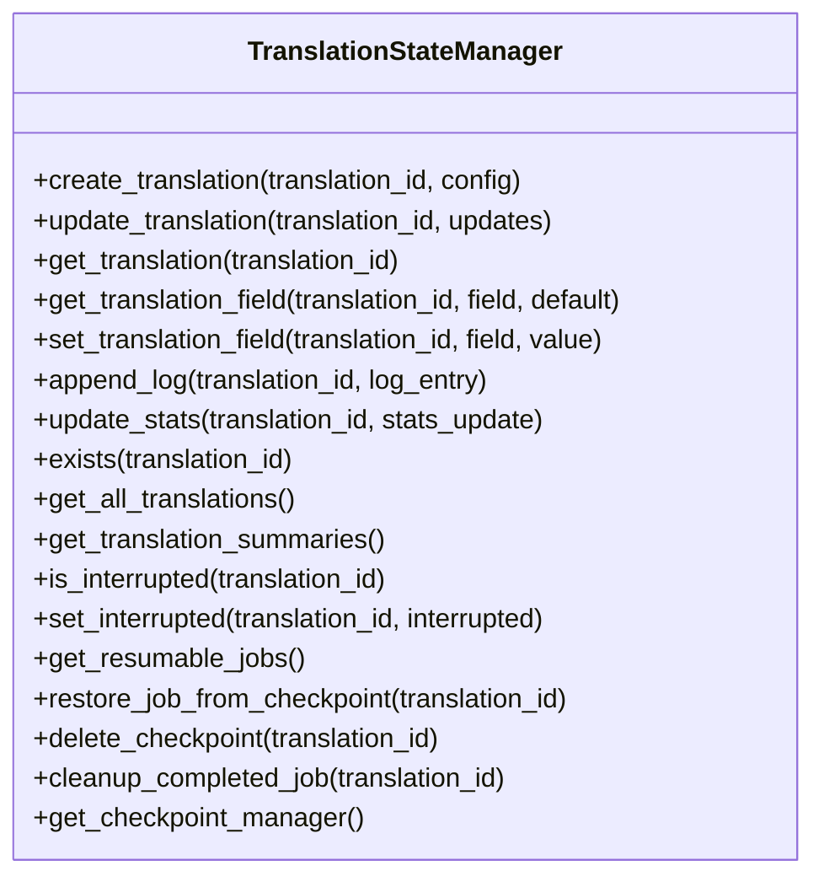
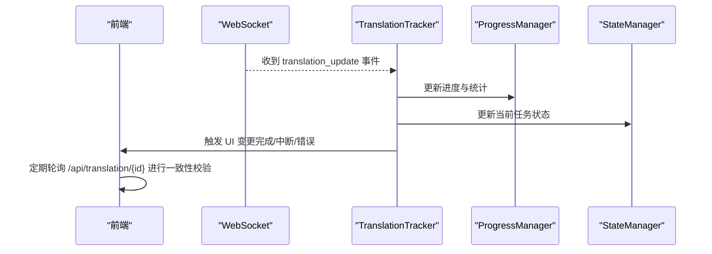
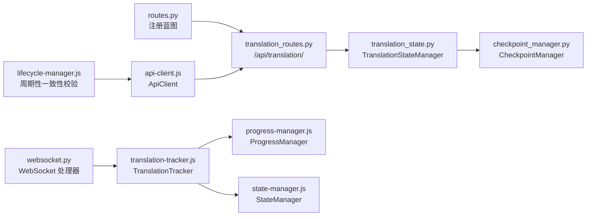

# 获取翻译任务状态

<cite>
**本文引用的文件列表**
- [routes.py](file://src/api/routes.py)
- [translation_routes.py](file://src/api/blueprints/translation_routes.py)
- [translation_state.py](file://src/api/translation_state.py)
- [checkpoint_manager.py](file://src/persistence/checkpoint_manager.py)
- [websocket.py](file://src/api/websocket.py)
- [api-client.js](file://src/web/static/js/core/api-client.js)
- [translation-tracker.js](file://src/web/static/js/translation/translation-tracker.js)
- [progress-manager.js](file://src/web/static/js/translation/progress-manager.js)
- [state-manager.js](file://src/web/static/js/core/state-manager.js)
- [lifecycle-manager.js](file://src/web/static/js/utils/lifecycle-manager.js)
</cite>

## 目录
1. [简介](#简介)
2. [项目结构](#项目结构)
3. [核心组件](#核心组件)
4. [架构总览](#架构总览)
5. [详细组件分析](#详细组件分析)
6. [依赖关系分析](#依赖关系分析)
7. [性能考量](#性能考量)
8. [故障排查指南](#故障排查指南)
9. [结论](#结论)
10. [附录](#附录)

## 简介
本文件围绕后端 API 端点 GET /api/translation/<id> 的实现与前端交互进行系统化说明，重点涵盖：
- 如何通过 translation_id 查询任务状态，返回字段包括 status、progress、stats（总 chunks、已完成 chunks、耗时等）、logs（最近 100 条日志）、output_filepath。
- 当任务完成或中断时 result_preview 字段为何被移除并提示用户下载文件查看内容。
- 结合 api-client.js 中的 getTranslationStatus 方法，给出前端轮询状态的参考实现思路。
- 该接口与 TranslationStateManager 的交互方式、elapsed_time 的计算逻辑，以及不同状态下的响应差异。
- 此 API 在实时进度监控中的作用与其与 WebSocket 的互补关系。

## 项目结构
后端采用 Flask 蓝图组织路由，翻译相关路由集中在 translation_routes.py；状态管理由 TranslationStateManager 提供线程安全的内存态；WebSocket 用于推送增量更新；前端通过 ApiClient 统一发起请求，并由 TranslationTracker 和 ProgressManager 等模块消费数据。

图表来源
- [routes.py](file://src/api/routes.py#L23-L49)
- [translation_routes.py](file://src/api/blueprints/translation_routes.py#L86-L123)
- [translation_state.py](file://src/api/translation_state.py#L12-L37)
- [checkpoint_manager.py](file://src/persistence/checkpoint_manager.py#L12-L31)
- [websocket.py](file://src/api/websocket.py#L8-L43)
- [api-client.js](file://src/web/static/js/core/api-client.js#L110-L118)
- [translation-tracker.js](file://src/web/static/js/translation/translation-tracker.js#L43-L121)
- [progress-manager.js](file://src/web/static/js/translation/progress-manager.js#L23-L54)
- [state-manager.js](file://src/web/static/js/core/state-manager.js#L11-L33)
- [lifecycle-manager.js](file://src/web/static/js/utils/lifecycle-manager.js#L156-L179)

章节来源
- [routes.py](file://src/api/routes.py#L23-L49)
- [translation_routes.py](file://src/api/blueprints/translation_routes.py#L86-L123)

## 核心组件
- 后端路由层：负责解析 translation_id 并调用状态管理器获取任务状态，计算 elapsed_time，组装响应。
- 状态管理器：提供线程安全的创建、读取、更新、删除等操作，维护任务的 stats、logs、progress、status 等字段。
- 检查点管理器：负责持久化进度、上下文、输出重建等能力，支持断点续传。
- 前端客户端：封装 fetch 请求，提供 getTranslationStatus 方法；配合 WebSocket 管理器接收实时更新。
- 前端展示层：TranslationTracker 接收 WebSocket 事件并驱动 UI；ProgressManager 展示进度与统计；LifecycleManager 定期校验服务端状态一致性。

章节来源
- [translation_routes.py](file://src/api/blueprints/translation_routes.py#L86-L123)
- [translation_state.py](file://src/api/translation_state.py#L12-L37)
- [checkpoint_manager.py](file://src/persistence/checkpoint_manager.py#L12-L31)
- [api-client.js](file://src/web/static/js/core/api-client.js#L110-L118)
- [translation-tracker.js](file://src/web/static/js/translation/translation-tracker.js#L43-L121)
- [progress-manager.js](file://src/web/static/js/translation/progress-manager.js#L23-L54)
- [lifecycle-manager.js](file://src/web/static/js/utils/lifecycle-manager.js#L156-L179)

## 架构总览
GET /api/translation/<id> 的调用链路如下：

图表来源
- [translation_routes.py](file://src/api/blueprints/translation_routes.py#L86-L123)
- [translation_state.py](file://src/api/translation_state.py#L65-L72)
- [websocket.py](file://src/api/websocket.py#L21-L43)
- [api-client.js](file://src/web/static/js/core/api-client.js#L110-L118)

## 详细组件分析

### 后端端点：GET /api/translation/<id>
- 功能概述
  - 根据 translation_id 从状态管理器读取任务快照，组装响应体。
  - 计算 elapsed_time：运行中/排队中使用当前时间减去 start_time；已完成/失败则复用 stats 中已记录的 elapsed_time。
  - 返回字段包含：
    - translation_id、status、progress、stats（total_chunks、completed_chunks、failed_chunks、start_time、elapsed_time）、logs（最近 100 条）、error、config、output_filepath。
    - result_preview：仅在任务完成或中断时为提示文本，表示需下载文件查看内容；其他状态不包含该字段。
- 关键实现位置
  - 状态读取与响应组装：见路径 [translation_routes.py](file://src/api/blueprints/translation_routes.py#L86-L123)
  - elapsed_time 计算分支：见路径 [translation_routes.py](file://src/api/blueprints/translation_routes.py#L100-L105)
  - result_preview 的条件性返回：见路径 [translation_routes.py](file://src/api/blueprints/translation_routes.py#L117-L119)

图表来源
- [translation_routes.py](file://src/api/blueprints/translation_routes.py#L86-L123)

章节来源
- [translation_routes.py](file://src/api/blueprints/translation_routes.py#L86-L123)

### 状态管理器：TranslationStateManager
- 职责
  - 创建任务、读取任务、更新字段、追加日志、更新统计、查询中断标记、恢复/清理等。
  - 所有操作均在锁保护下执行，保证多线程安全。
- 关键方法
  - create_translation：初始化任务状态（status=queued、progress=0、stats 包含 start_time 等）。
  - get_translation：返回任务快照副本，避免外部修改。
  - update_translation：支持嵌套更新 stats 与追加 logs。
  - set_interrupted/is_interrupted：设置/查询中断标记。
  - get_translation_summaries：用于列表页摘要。
- 与端点的关系
  - 端点直接调用 get_translation 获取任务快照，再进行 elapsed_time 计算与响应组装。

图表来源
- [translation_state.py](file://src/api/translation_state.py#L12-L217)

章节来源
- [translation_state.py](file://src/api/translation_state.py#L12-L217)

### 检查点管理器：CheckpointManager
- 职责
  - 持久化任务进度、上下文、输出重建等；支持暂停/中断/完成标记；支持删除/清理。
  - 与状态管理器配合，实现断点续传与结果重建。
- 与端点的关系
  - 端点不直接依赖检查点；但状态管理器内部持有 CheckpointManager 实例，用于恢复/清理等场景。

章节来源
- [checkpoint_manager.py](file://src/persistence/checkpoint_manager.py#L12-L31)
- [checkpoint_manager.py](file://src/persistence/checkpoint_manager.py#L243-L290)

### 前端客户端：ApiClient
- 职责
  - 封装 fetch 请求，统一错误处理；提供 getTranslationStatus 方法用于轮询。
- 与端点的关系
  - 前端通过 GET /api/translation/{translation_id} 获取任务状态；同时通过 WebSocket 接收实时增量更新。

章节来源
- [api-client.js](file://src/web/static/js/core/api-client.js#L110-L118)

### 前端展示与一致性：TranslationTracker、ProgressManager、LifecycleManager
- TranslationTracker
  - 处理 WebSocket 的 translation_update 事件，更新 UI（进度、统计、日志、状态变化）。
  - 对于 completed/interrupted/error 状态，触发完成流程并更新活动任务状态。
- ProgressManager
  - 根据 stats 和 progress 更新进度条与统计网格；对不同文件类型（txt、epub、srt）显示不同的统计项。
- LifecycleManager
  - 页面可见性变化时刷新状态；定期向后端轮询一致性（检查服务端状态是否与前端一致），必要时重置 UI。

图表来源
- [translation-tracker.js](file://src/web/static/js/translation/translation-tracker.js#L43-L121)
- [progress-manager.js](file://src/web/static/js/translation/progress-manager.js#L23-L54)
- [lifecycle-manager.js](file://src/web/static/js/utils/lifecycle-manager.js#L156-L179)

章节来源
- [translation-tracker.js](file://src/web/static/js/translation/translation-tracker.js#L43-L121)
- [progress-manager.js](file://src/web/static/js/translation/progress-manager.js#L23-L54)
- [lifecycle-manager.js](file://src/web/static/js/utils/lifecycle-manager.js#L156-L179)

## 依赖关系分析
- 路由注册
  - 路由协调器将翻译蓝图注册到 Flask 应用，注入状态管理器与启动函数，确保端点可用。
- 状态管理与持久化
  - 状态管理器持有检查点管理器实例，用于恢复/清理；端点通过状态管理器读取任务快照。
- 前后端通信
  - ApiClient 提供 getTranslationStatus；TranslationTracker 通过 WebSocket 接收实时更新；LifecycleManager 定期轮询一致性。

图表来源
- [routes.py](file://src/api/routes.py#L23-L49)
- [translation_routes.py](file://src/api/blueprints/translation_routes.py#L86-L123)
- [translation_state.py](file://src/api/translation_state.py#L12-L37)
- [checkpoint_manager.py](file://src/persistence/checkpoint_manager.py#L12-L31)
- [api-client.js](file://src/web/static/js/core/api-client.js#L110-L118)
- [websocket.py](file://src/api/websocket.py#L8-L43)
- [translation-tracker.js](file://src/web/static/js/translation/translation-tracker.js#L43-L121)
- [progress-manager.js](file://src/web/static/js/translation/progress-manager.js#L23-L54)
- [state-manager.js](file://src/web/static/js/core/state-manager.js#L11-L33)
- [lifecycle-manager.js](file://src/web/static/js/utils/lifecycle-manager.js#L156-L179)

章节来源
- [routes.py](file://src/api/routes.py#L23-L49)
- [translation_routes.py](file://src/api/blueprints/translation_routes.py#L86-L123)
- [translation_state.py](file://src/api/translation_state.py#L12-L37)
- [checkpoint_manager.py](file://src/persistence/checkpoint_manager.py#L12-L31)
- [api-client.js](file://src/web/static/js/core/api-client.js#L110-L118)
- [websocket.py](file://src/api/websocket.py#L8-L43)
- [translation-tracker.js](file://src/web/static/js/translation/translation-tracker.js#L43-L121)
- [progress-manager.js](file://src/web/static/js/translation/progress-manager.js#L23-L54)
- [state-manager.js](file://src/web/static/js/core/state-manager.js#L11-L33)
- [lifecycle-manager.js](file://src/web/static/js/utils/lifecycle-manager.js#L156-L179)

## 性能考量
- 线程安全与锁粒度
  - 状态管理器使用可重入锁保护关键路径，避免并发写冲突；读取时返回副本，降低共享状态风险。
- 响应体积控制
  - logs 仅返回最近 100 条，避免单次响应过大；stats 仅包含必要字段。
- 计算开销
  - elapsed_time 计算为常数时间；端点不涉及复杂 IO，主要为内存读取与 JSON 序列化。
- 前端轮询策略
  - 建议根据任务规模与 UI 需求调整轮询间隔；在 WebSocket 可用时优先使用实时推送，减少不必要的轮询。

[本节为通用建议，无需列出具体文件来源]

## 故障排查指南
- 404 未找到任务
  - 可能原因：translation_id 不存在或已被清理。
  - 前端处理：LifecycleManager 的一致性检查会捕获 404 并重置 UI。
- 状态不一致
  - 现象：前端显示与服务端实际状态不符。
  - 处理：启用周期性一致性检查，必要时手动刷新或重新开始任务。
- WebSocket 不可用
  - 现象：无法收到实时更新。
  - 处理：确认后端 WebSocket 已配置；前端检查连接状态与事件订阅。
- result_preview 提示下载
  - 现象：任务完成后或中断后 result_preview 为空或提示下载。
  - 原因：为避免大文本传输，后端不再内嵌预览；请通过 output_filepath 下载文件查看完整内容。

章节来源
- [translation_routes.py](file://src/api/blueprints/translation_routes.py#L86-L123)
- [lifecycle-manager.js](file://src/web/static/js/utils/lifecycle-manager.js#L156-L179)

## 结论
GET /api/translation/<id> 提供了稳定、可扩展的任务状态查询能力：通过 TranslationStateManager 保障线程安全与状态一致性，通过 WebSocket 提供实时增量更新，通过前端模块化组件实现良好的用户体验。在任务完成或中断时移除 result_preview 并引导下载，既优化了传输效率也提升了安全性。结合轮询与 WebSocket 的互补机制，可在不同网络与设备环境下提供可靠的进度监控体验。

[本节为总结性内容，无需列出具体文件来源]

## 附录

### 前端轮询状态的实现要点（基于 api-client.js）
- 使用 ApiClient.getTranslationStatus(translationId) 发起请求。
- 建议在任务运行期间以固定间隔轮询，例如每 2–5 秒一次，依据任务规模与 UI 响应需求调整。
- 在页面可见性变化或连接断开后，及时停止/重启轮询，避免无效请求。
- 与 WebSocket 并行使用：当收到 translation_update 事件时优先更新 UI，减少轮询频率。

章节来源
- [api-client.js](file://src/web/static/js/core/api-client.js#L110-L118)
- [translation-tracker.js](file://src/web/static/js/translation/translation-tracker.js#L43-L121)
- [lifecycle-manager.js](file://src/web/static/js/utils/lifecycle-manager.js#L156-L179)