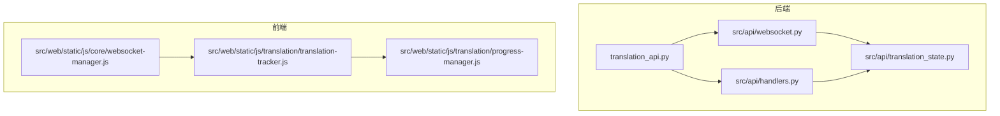
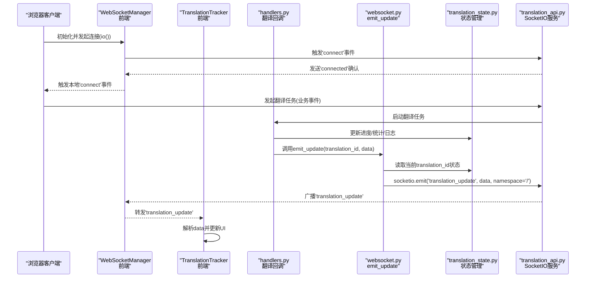
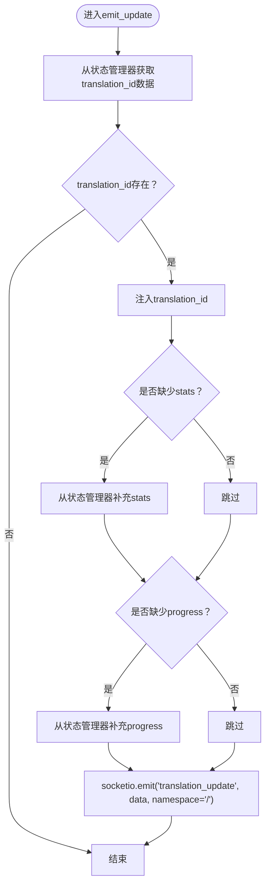
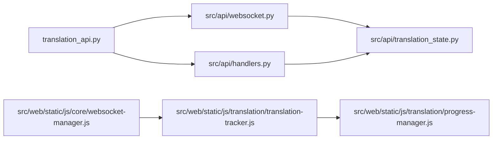

# WebSocket API参考

<cite>
**本文引用的文件**
- [translation_api.py](file://translation_api.py)
- [src/api/websocket.py](file://src/api/websocket.py)
- [src/api/handlers.py](file://src/api/handlers.py)
- [src/api/translation_state.py](file://src/api/translation_state.py)
- [src/web/static/js/core/websocket-manager.js](file://src/web/static/js/core/websocket-manager.js)
- [src/web/static/js/translation/translation-tracker.js](file://src/web/static/js/translation/translation-tracker.js)
- [src/web/static/js/translation/progress-manager.js](file://src/web/static/js/translation/progress-manager.js)
</cite>

## 目录
1. [简介](#简介)
2. [项目结构](#项目结构)
3. [核心组件](#核心组件)
4. [架构总览](#架构总览)
5. [详细组件分析](#详细组件分析)
6. [依赖关系分析](#依赖关系分析)
7. [性能与优化建议](#性能与优化建议)
8. [故障排查指南](#故障排查指南)
9. [结论](#结论)
10. [附录：客户端事件与载荷规范](#附录客户端事件与载荷规范)

## 简介
本参考文档聚焦于基于 Flask-SocketIO 的实时通信机制，围绕/src/api/websocket.py中实现的WebSocket API，系统性说明：
- 连接建立流程（/connect事件）
- 服务端推送的消息类型与事件载荷结构（如translation_update）
- 客户端交互模式与命名空间（namespace='/'）
- 基于handlers.py中的emit_update函数的服务端推送逻辑
- 客户端监听与处理事件的JavaScript示例路径
- 连接错误处理、重连策略与性能优化建议

## 项目结构
WebSocket相关代码分布在后端服务与前端JS模块中：
- 后端
  - translation_api.py：SocketIO实例化与路由、WebSocket处理器注册
  - src/api/websocket.py：WebSocket事件处理与统一推送函数
  - src/api/handlers.py：翻译任务执行与回调，驱动WebSocket推送
  - src/api/translation_state.py：线程安全的状态管理
- 前端
  - src/web/static/js/core/websocket-manager.js：WebSocket生命周期与事件路由
  - src/web/static/js/translation/translation-tracker.js：翻译事件处理与UI联动
  - src/web/static/js/translation/progress-manager.js：进度与统计展示

图表来源
- [translation_api.py](file://translation_api.py#L40-L100)
- [src/api/websocket.py](file://src/api/websocket.py#L8-L43)
- [src/api/handlers.py](file://src/api/handlers.py#L1-L120)
- [src/api/translation_state.py](file://src/api/translation_state.py#L1-L120)
- [src/web/static/js/core/websocket-manager.js](file://src/web/static/js/core/websocket-manager.js#L1-L143)
- [src/web/static/js/translation/translation-tracker.js](file://src/web/static/js/translation/translation-tracker.js#L1-L120)
- [src/web/static/js/translation/progress-manager.js](file://src/web/static/js/translation/progress-manager.js#L1-L130)

章节来源
- [translation_api.py](file://translation_api.py#L40-L100)
- [src/api/websocket.py](file://src/api/websocket.py#L8-L43)
- [src/api/handlers.py](file://src/api/handlers.py#L1-L120)
- [src/api/translation_state.py](file://src/api/translation_state.py#L1-L120)
- [src/web/static/js/core/websocket-manager.js](file://src/web/static/js/core/websocket-manager.js#L1-L143)
- [src/web/static/js/translation/translation-tracker.js](file://src/web/static/js/translation/translation-tracker.js#L1-L120)
- [src/web/static/js/translation/progress-manager.js](file://src/web/static/js/translation/progress-manager.js#L1-L130)

## 核心组件
- SocketIO实例与命名空间
  - 后端在translation_api.py中创建SocketIO实例，并通过configure_websocket_handlers注册WebSocket事件处理器；所有应用级事件均以namespace='/'广播。
- WebSocket事件处理器
  - 在src/api/websocket.py中定义了connect/disconnect事件处理器，以及统一的emit_update推送函数。
- 翻译任务与回调
  - src/api/handlers.py中perform_actual_translation等函数通过回调向客户端推送进度、统计、日志与状态变更。
- 前端WebSocket管理器
  - src/web/static/js/core/websocket-manager.js封装连接、断开、事件转发与发送能力。
- 前端翻译跟踪器
  - src/web/static/js/translation/translation-tracker.js负责接收translation_update并更新UI、状态与队列推进。
- 前端进度管理器
  - src/web/static/js/translation/progress-manager.js负责进度条与统计网格的渲染。

章节来源
- [translation_api.py](file://translation_api.py#L40-L100)
- [src/api/websocket.py](file://src/api/websocket.py#L8-L43)
- [src/api/handlers.py](file://src/api/handlers.py#L1-L120)
- [src/web/static/js/core/websocket-manager.js](file://src/web/static/js/core/websocket-manager.js#L1-L143)
- [src/web/static/js/translation/translation-tracker.js](file://src/web/static/js/translation/translation-tracker.js#L1-L120)
- [src/web/static/js/translation/progress-manager.js](file://src/web/static/js/translation/progress-manager.js#L1-L130)

## 架构总览
下图展示了从翻译任务启动到客户端实时接收事件的完整链路。

图表来源
- [translation_api.py](file://translation_api.py#L90-L100)
- [src/api/websocket.py](file://src/api/websocket.py#L21-L43)
- [src/api/handlers.py](file://src/api/handlers.py#L60-L140)
- [src/api/translation_state.py](file://src/api/translation_state.py#L60-L120)
- [src/web/static/js/core/websocket-manager.js](file://src/web/static/js/core/websocket-manager.js#L20-L60)
- [src/web/static/js/translation/translation-tracker.js](file://src/web/static/js/translation/translation-tracker.js#L40-L120)

## 详细组件分析

### WebSocket连接建立与命名空间
- 连接建立
  - 客户端通过io()创建连接，后端在translation_api.py中注册SocketIO实例并调用configure_websocket_handlers。
  - 后端connect事件处理器会向客户端发送'connected'事件作为握手确认。
- 命名空间
  - 所有应用事件（如translation_update、file_list_changed、checkpoint_created）均以namespace='/'广播，确保与Flask默认根命名空间一致，便于前端统一监听。

章节来源
- [translation_api.py](file://translation_api.py#L40-L100)
- [src/api/websocket.py](file://src/api/websocket.py#L11-L20)
- [src/web/static/js/core/websocket-manager.js](file://src/web/static/js/core/websocket-manager.js#L20-L60)

### 服务端推送函数：emit_update
- 功能概述
  - emit_update根据translation_id从状态管理器读取当前进度与统计，自动补全推送数据，并通过socketio.emit('translation_update', data, namespace='/')推送到客户端。
- 关键行为
  - 自动注入translation_id，避免客户端重复传参
  - 若推送数据未包含stats或progress，则从状态管理器补充，保证客户端始终获得最新值
  - 异常捕获，避免推送失败导致服务中断

图表来源
- [src/api/websocket.py](file://src/api/websocket.py#L21-L43)
- [src/api/translation_state.py](file://src/api/translation_state.py#L60-L120)

章节来源
- [src/api/websocket.py](file://src/api/websocket.py#L21-L43)
- [src/api/translation_state.py](file://src/api/translation_state.py#L60-L120)

### 翻译回调与事件推送
- 进度回调
  - perform_actual_translation中设置状态为'running'并推送初始日志；随后通过_update_translation_progress_callback更新进度并触发emit_update。
- 统计回调
  - _update_translation_stats_callback更新stats并计算elapsed_time，再通过emit_update推送。
- 日志回调
  - web_callback将单条日志写入状态管理器并推送；同时支持log_entry结构化日志（如LLM请求/响应），前端可据此更新翻译预览。
- 结束与异常
  - 任务完成时推送最终状态（completed/interrupted/error），并触发file_list_changed与checkpoint_created等事件。

章节来源
- [src/api/handlers.py](file://src/api/handlers.py#L60-L140)
- [src/api/handlers.py](file://src/api/handlers.py#L140-L320)
- [src/api/handlers.py](file://src/api/handlers.py#L320-L435)

### 前端事件监听与处理
- WebSocketManager
  - 负责连接、断开、事件转发与发送；对'connect'/'disconnect'/'translation_update'/'file_list_changed'/'checkpoint_created'进行统一监听与派发。
- TranslationTracker
  - 接收translation_update后，解析并更新UI：显示日志、更新进度条、更新统计网格、处理状态变化（completed/interrupted/error）。
- ProgressManager
  - 依据fileType（txt/epub/srt）选择不同的统计字段与显示方式，并更新进度条文本与时间。

章节来源
- [src/web/static/js/core/websocket-manager.js](file://src/web/static/js/core/websocket-manager.js#L20-L60)
- [src/web/static/js/translation/translation-tracker.js](file://src/web/static/js/translation/translation-tracker.js#L40-L120)
- [src/web/static/js/translation/progress-manager.js](file://src/web/static/js/translation/progress-manager.js#L1-L130)

## 依赖关系分析
- 后端依赖
  - translation_api.py依赖SocketIO、路由配置、WebSocket处理器与状态管理器
  - websocket.py依赖SocketIO与状态管理器
  - handlers.py依赖websocket.py与状态管理器
- 前端依赖
  - WebSocketManager依赖MessageLogger与ApiClient
  - TranslationTracker依赖StateManager、ApiClient、MessageLogger与DomHelpers
  - ProgressManager依赖DomHelpers

图表来源
- [translation_api.py](file://translation_api.py#L40-L100)
- [src/api/websocket.py](file://src/api/websocket.py#L8-L43)
- [src/api/handlers.py](file://src/api/handlers.py#L1-L120)
- [src/api/translation_state.py](file://src/api/translation_state.py#L1-L120)
- [src/web/static/js/core/websocket-manager.js](file://src/web/static/js/core/websocket-manager.js#L1-L143)
- [src/web/static/js/translation/translation-tracker.js](file://src/web/static/js/translation/translation-tracker.js#L1-L120)
- [src/web/static/js/translation/progress-manager.js](file://src/web/static/js/translation/progress-manager.js#L1-L130)

## 性能与优化建议
- 减少推送频率
  - 将高频进度/统计更新合并为节流/去抖策略，避免过多socketio.emit导致带宽与CPU压力。
- 数据最小化
  - 仅推送必要字段，利用emit_update自动补充缺失的stats/progress，避免前端重复计算。
- 前端批量渲染
  - 在TranslationTracker中对UI更新进行批处理，减少DOM操作次数。
- 连接复用与命名空间一致性
  - 始终使用namespace='/'，避免多命名空间导致的事件分发复杂度。
- 错误隔离
  - emit_update内部已捕获异常，建议在handlers中对回调异常进行隔离，防止个别回调影响整体流程。

[本节为通用建议，不直接分析具体文件]

## 故障排查指南
- 连接问题
  - 检查translation_api.py中SocketIO初始化与configure_websocket_handlers是否正确加载
  - 确认前端WebSocketManager.connect是否成功触发'connect'事件
- 事件未到达
  - 确认handlers.py中回调是否被调用，emit_update是否被正确调用
  - 检查translation_id是否存在于状态管理器
- 前端无响应
  - 确认WebSocketManager是否监听到'connected'并转发'connect'
  - 检查TranslationTracker是否订阅translation_update并更新UI

章节来源
- [translation_api.py](file://translation_api.py#L40-L100)
- [src/api/websocket.py](file://src/api/websocket.py#L21-L43)
- [src/api/handlers.py](file://src/api/handlers.py#L60-L140)
- [src/web/static/js/core/websocket-manager.js](file://src/web/static/js/core/websocket-manager.js#L20-L60)
- [src/web/static/js/translation/translation-tracker.js](file://src/web/static/js/translation/translation-tracker.js#L40-L120)

## 结论
本文档梳理了基于Flask-SocketIO的WebSocket实时通信机制，明确了连接建立、事件推送、命名空间使用与前后端协作流程。通过emit_update与handlers回调，服务端能够稳定地向客户端推送翻译进度、统计与日志；前端通过WebSocketManager与TranslationTracker实现可靠的事件监听与UI更新。建议在生产环境中配合节流、最小化数据与错误隔离策略，进一步提升稳定性与性能。

[本节为总结性内容，不直接分析具体文件]

## 附录：客户端事件与载荷规范

- 命名空间
  - 所有应用事件均以namespace='/'广播，前端应统一监听该命名空间下的事件。

- 事件列表与载荷字段
  - 事件名称："translation_update"
    - 字段：
      - translation_id：字符串，翻译任务标识
      - progress：数字，0-100的进度百分比（可选，若缺失由服务端补充）
      - stats：对象，统计信息（可选，若缺失由服务端补充）
      - log：字符串，日志消息（可选）
      - log_entry：对象，结构化日志（可选）
      - status：字符串，任务状态（running/completed/interrupted/error）
      - result：字符串，结果摘要（可选）
      - error：字符串，错误信息（可选）
      - 其他：根据业务场景可能包含type、message等

  - 事件名称："file_list_changed"
    - 字段：
      - reason：字符串，状态原因（completed/interrupted/error）
      - filename：字符串，输出文件名

  - 事件名称："checkpoint_created"
    - 字段：
      - translation_id：字符串
      - status：字符串，状态（interrupted）
      - message：字符串，提示信息

- 客户端监听与处理示例（路径）
  - 连接与事件转发：[src/web/static/js/core/websocket-manager.js](file://src/web/static/js/core/websocket-manager.js#L20-L60)
  - 翻译事件处理与UI更新：[src/web/static/js/translation/translation-tracker.js](file://src/web/static/js/translation/translation-tracker.js#L40-L120)
  - 进度与统计展示：[src/web/static/js/translation/progress-manager.js](file://src/web/static/js/translation/progress-manager.js#L1-L130)

- 服务端推送触发点
  - 进度更新：[src/api/handlers.py](file://src/api/handlers.py#L120-L135)
  - 统计更新：[src/api/handlers.py](file://src/api/handlers.py#L127-L134)
  - 日志推送：[src/api/handlers.py](file://src/api/handlers.py#L73-L91)
  - 最终状态与文件列表刷新：[src/api/handlers.py](file://src/api/handlers.py#L303-L414)
  - 统一推送函数：[src/api/websocket.py](file://src/api/websocket.py#L21-L43)

- 连接错误处理与重连策略
  - 前端检测断开并记录日志，可在页面可见性恢复或定时器触发时尝试重新连接
  - 建议在WebSocketManager中增加自动重连逻辑（例如指数退避策略），并在connect成功后重新订阅必要的事件

[本节为规范性汇总，不直接分析具体文件]