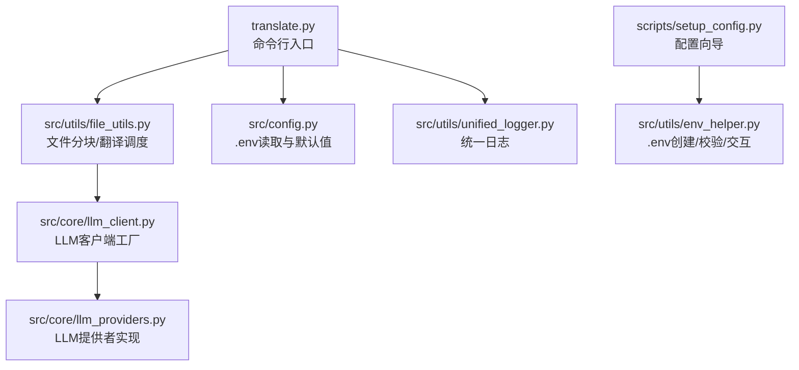
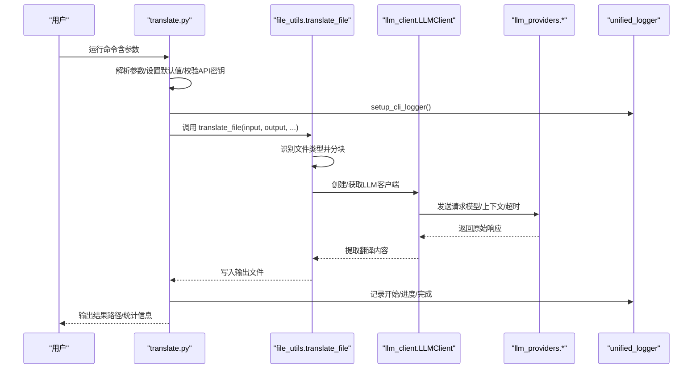
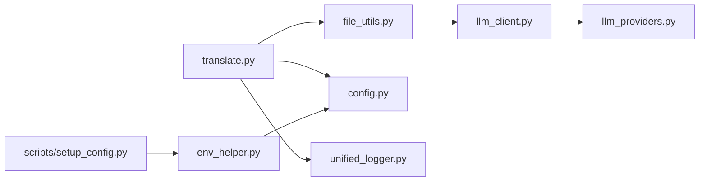
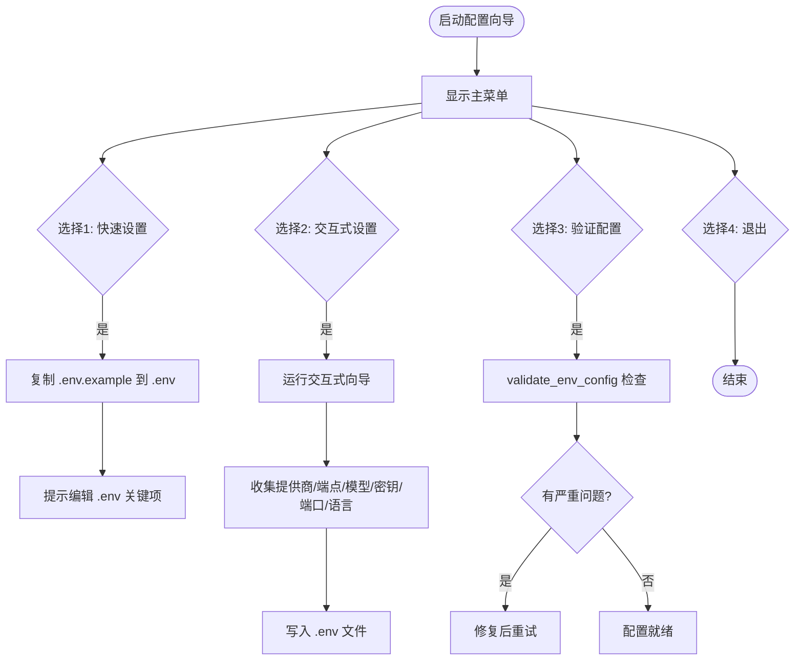

# CLI工具使用

<cite>
**本文引用的文件**
- [translate.py](file://translate.py)
- [scripts/setup_config.py](file://scripts/setup_config.py)
- [src/utils/env_helper.py](file://src/utils/env_helper.py)
- [src/utils/file_utils.py](file://src/utils/file_utils.py)
- [src/core/llm_providers.py](file://src/core/llm_providers.py)
- [src/core/llm_client.py](file://src/core/llm_client.py)
- [src/config.py](file://src/config.py)
- [src/utils/unified_logger.py](file://src/utils/unified_logger.py)
- [requirements.txt](file://requirements.txt)
</cite>

## 目录
1. [简介](#简介)
2. [项目结构](#项目结构)
3. [核心组件](#核心组件)
4. [架构总览](#架构总览)
5. [详细组件分析](#详细组件分析)
6. [依赖关系分析](#依赖关系分析)
7. [性能与批处理建议](#性能与批处理建议)
8. [使用示例](#使用示例)
9. [配置初始化流程](#配置初始化流程)
10. [CLI与Web界面对比](#cli与web界面对比)
11. [错误处理与退出码](#错误处理与退出码)
12. [故障排查指南](#故障排查指南)
13. [结论](#结论)

## 简介
本手册面向偏好命令行操作的用户与自动化脚本开发者，系统讲解 translate.py 的全部命令行参数与工作流程，覆盖文本、EPUB、SRT 文件的翻译；支持 Ollama、Gemini、OpenAI 兼容提供商；提供配置初始化（.env）与交互式向导；给出无头服务器与 CI/CD 批量处理建议；并附带错误处理与退出码说明，帮助快速定位问题。

## 项目结构
- CLI入口：translate.py
- 配置与环境：scripts/setup_config.py、src/utils/env_helper.py、src/config.py
- 文件处理：src/utils/file_utils.py
- LLM抽象与客户端：src/core/llm_providers.py、src/core/llm_client.py
- 日志系统：src/utils/unified_logger.py
- 依赖：requirements.txt

图表来源
- [translate.py](file://translate.py#L1-L147)
- [src/utils/file_utils.py](file://src/utils/file_utils.py#L339-L405)
- [src/core/llm_client.py](file://src/core/llm_client.py#L1-L123)
- [src/core/llm_providers.py](file://src/core/llm_providers.py#L1-L548)
- [src/config.py](file://src/config.py#L1-L225)
- [src/utils/unified_logger.py](file://src/utils/unified_logger.py#L1-L432)
- [scripts/setup_config.py](file://scripts/setup_config.py#L1-L89)
- [src/utils/env_helper.py](file://src/utils/env_helper.py#L1-L239)

章节来源
- [translate.py](file://translate.py#L1-L147)
- [src/utils/file_utils.py](file://src/utils/file_utils.py#L339-L405)
- [src/core/llm_client.py](file://src/core/llm_client.py#L1-L123)
- [src/core/llm_providers.py](file://src/core/llm_providers.py#L1-L548)
- [src/config.py](file://src/config.py#L1-L225)
- [src/utils/unified_logger.py](file://src/utils/unified_logger.py#L1-L432)
- [scripts/setup_config.py](file://scripts/setup_config.py#L1-L89)
- [src/utils/env_helper.py](file://src/utils/env_helper.py#L1-L239)

## 核心组件
- 命令行参数解析与执行流程：translate.py
- 文件类型识别与翻译调度：src/utils/file_utils.py
- LLM提供者抽象与实现：src/core/llm_providers.py
- LLM客户端工厂与请求封装：src/core/llm_client.py
- 配置加载与默认值：src/config.py
- 统一日志系统：src/utils/unified_logger.py
- 配置初始化与校验：scripts/setup_config.py、src/utils/env_helper.py

章节来源
- [translate.py](file://translate.py#L1-L147)
- [src/utils/file_utils.py](file://src/utils/file_utils.py#L339-L405)
- [src/core/llm_providers.py](file://src/core/llm_providers.py#L1-L548)
- [src/core/llm_client.py](file://src/core/llm_client.py#L1-L123)
- [src/config.py](file://src/config.py#L1-L225)
- [src/utils/unified_logger.py](file://src/utils/unified_logger.py#L1-L432)
- [scripts/setup_config.py](file://scripts/setup_config.py#L1-L89)
- [src/utils/env_helper.py](file://src/utils/env_helper.py#L1-L239)

## 架构总览
CLI从命令行参数解析开始，自动推断输入文件类型（.txt/.epub/.srt），随后通过统一的日志系统记录开始与结束事件，并调用文件处理模块进行分块与翻译。翻译过程中根据所选LLM提供商构造相应客户端，发送请求并提取翻译结果。配置来自 .env 或命令行参数，支持颜色输出控制与快速模式。

图表来源
- [translate.py](file://translate.py#L1-L147)
- [src/utils/file_utils.py](file://src/utils/file_utils.py#L339-L405)
- [src/core/llm_client.py](file://src/core/llm_client.py#L1-L123)
- [src/core/llm_providers.py](file://src/core/llm_providers.py#L1-L548)
- [src/utils/unified_logger.py](file://src/utils/unified_logger.py#L1-L432)

## 详细组件分析

### translate.py 命令行参数与流程
- 输入/输出
  - --input/-i：必填，输入文件路径（支持 .txt/.epub/.srt）
  - --output/-o：可选，输出文件路径；未指定时基于输入名与目标语言后缀生成
- 语言与模型
  - --source-lang/-sl：源语言，默认来自 .env
  - --target-lang/-tl：目标语言，默认来自 .env
  - --model/-m：模型名称，默认来自 .env
- 分块与端点
  - --chunksize/-cs：目标每块行数，默认来自 .env
  - --api_endpoint：自定义API端点（兼容Ollama或OpenAI兼容服务）
- 提供商与密钥
  - --provider：可选值 ollama/gemini/openai，默认来自 .env
  - --gemini_api_key：当提供商为 gemini 时必填
  - --openai_api_key：当提供商为 openai 时必填
- 行为控制
  - --no-color：禁用彩色输出
  - --fast-mode：EPUB快速模式（剥离格式，提高小模型稳定性）
- 启动阶段校验与推荐
  - 自动检测小模型（如 ≤12B），在EPUB场景下提示使用 --fast-mode
  - 对于 Ollama，若配置警告且未启用自动调整，会要求确认继续
- 日志与异常
  - 使用统一日志记录开始/结束/错误详情
  - 捕获异常并记录错误信息

章节来源
- [translate.py](file://translate.py#L1-L147)
- [src/config.py](file://src/config.py#L1-L225)
- [src/utils/unified_logger.py](file://src/utils/unified_logger.py#L1-L432)

### 文件处理与类型识别
- 自动识别扩展名决定处理路径：
  - .epub：调用 EPUB翻译流程（内部按标签收集作业并分块）
  - .srt：调用字幕翻译流程（解析/分组/重建）
  - 其他：按文本文件处理，使用分块策略与回调
- 输出路径去重：若同名已存在，自动追加序号避免覆盖

章节来源
- [src/utils/file_utils.py](file://src/utils/file_utils.py#L339-L405)

### LLM提供者与客户端
- 抽象层：LLMProvider 定义生成接口与翻译提取逻辑
- 实现：
  - OllamaProvider：支持 num_ctx 上下文窗口与超长上下文错误处理
  - OpenAICompatibleProvider：兼容 OpenAI风格的消息结构
  - GeminiProvider：支持模型列表查询与系统指令字段
- 客户端工厂：根据提供商类型与参数创建对应实例，支持 Gemini/OpenAI密钥注入

章节来源
- [src/core/llm_providers.py](file://src/core/llm_providers.py#L1-L548)
- [src/core/llm_client.py](file://src/core/llm_client.py#L1-L123)

### 配置加载与默认值
- .env 优先：API_ENDPOINT、DEFAULT_MODEL、PORT、MAIN_LINES_PER_CHUNK、REQUEST_TIMEOUT、OLLAMA_NUM_CTX、MAX_TRANSLATION_ATTEMPTS、RETRY_DELAY_SECONDS、LLM_PROVIDER、GEMINI_API_KEY、OPENAI_API_KEY、DEFAULT_SOURCE_LANGUAGE、DEFAULT_TARGET_LANGUAGE 等
- 未找到 .env 时打印友好提示并使用默认值

章节来源
- [src/config.py](file://src/config.py#L1-L225)

### 日志系统
- 支持多种日志类型：翻译开始/结束、进度、LLM请求/响应、错误详情
- CLI模式下可禁用颜色输出
- 提供“遗留回调”以兼容旧版日志接口

章节来源
- [src/utils/unified_logger.py](file://src/utils/unified_logger.py#L1-L432)

## 依赖关系分析
- translate.py 依赖 file_utils.translate_file、config 默认值、unified_logger
- file_utils 依赖分块器、翻译器、字幕处理器、EPUB翻译器
- llm_client 依赖 llm_providers 工厂函数
- llm_providers 依赖配置常量与HTTP客户端
- setup_config/env_helper 用于 .env 初始化与校验

图表来源
- [translate.py](file://translate.py#L1-L147)
- [src/utils/file_utils.py](file://src/utils/file_utils.py#L339-L405)
- [src/core/llm_client.py](file://src/core/llm_client.py#L1-L123)
- [src/core/llm_providers.py](file://src/core/llm_providers.py#L1-L548)
- [src/config.py](file://src/config.py#L1-L225)
- [src/utils/unified_logger.py](file://src/utils/unified_logger.py#L1-L432)
- [scripts/setup_config.py](file://scripts/setup_config.py#L1-L89)
- [src/utils/env_helper.py](file://src/utils/env_helper.py#L1-L239)

## 性能与批处理建议
- 小模型（如 ≤12B）建议使用 --fast-mode 处理 EPUB，减少标签管理复杂度
- 合理设置 --chunksize 以平衡吞吐与上下文窗口；Ollama 模型可通过 num_ctx 控制
- 在无头/CI环境建议：
  - 显式传入 --provider、--api_endpoint、--model、--gemini_api_key/--openai_api_key
  - 使用 --no-color 减少非必要输出
  - 批量脚本中逐个文件循环调用，结合输出路径去重机制
- 网络不稳定时适当增大 REQUEST_TIMEOUT 与 MAX_TRANSLATION_ATTEMPTS

[本节为通用建议，不直接分析具体文件]

## 使用示例
以下示例均以命令形式展示，不包含具体代码片段。请根据实际环境替换路径与密钥。

- 基础文本翻译
  - translate.py -i ./book.txt -o ./book_zh.txt -sl English -tl Chinese -m qwen3:14b -cs 25
- EPUB翻译（本地Ollama）
  - translate.py -i ./book.epub -o ./book_zh.epub -sl English -tl Chinese -m qwen3:14b -cs 25 --provider ollama --api_endpoint http://localhost:11434/api/generate
- EPUB翻译（远程Ollama）
  - translate.py -i ./book.epub -o ./book_zh.epub -sl English -tl Chinese -m llama3.2:3b -cs 25 --provider ollama --api_endpoint https://your-remote-server/api/generate
- EPUB翻译（Gemini）
  - translate.py -i ./book.epub -o ./book_zh.epub -sl English -tl Chinese -m gemini-2.0-flash --provider gemini --gemini_api_key YOUR_GEMINI_KEY
- EPUB翻译（OpenAI兼容）
  - translate.py -i ./book.epub -o ./book_zh.epub -sl English -tl Chinese -m gpt-4o --provider openai --openai_api_key YOUR_OPENAI_KEY --api_endpoint https://api.openai.com/v1/chat/completions
- SRT字幕翻译
  - translate.py -i ./subs.srt -o ./subs_zh.srt -sl English -tl Chinese -m qwen3:14b -cs 25 --provider ollama
- 禁用颜色输出（CI）
  - translate.py -i ./book.txt -o ./book_zh.txt --no-color
- 快速模式（EPUB小模型）
  - translate.py -i ./book.epub -o ./book_zh.epub --fast-mode

[本节为示例说明，不直接分析具体文件]

## 配置初始化流程
- 快速设置
  - 使用 scripts/setup_config.py 的“快速设置”选项复制 .env.example 到 .env 并提示编辑关键项
- 交互式配置
  - scripts/setup_config.py 提供菜单：快速设置、交互式向导、验证当前配置、退出
  - src/utils/env_helper.py 的交互式向导会引导输入提供商、端点、模型、密钥、端口、默认语言等
- 验证配置
  - scripts/setup_config.py 与 src/utils/env_helper.py 的 validate_env_config 会检查缺失项、远程Ollama警告、默认配置提示等

图表来源
- [scripts/setup_config.py](file://scripts/setup_config.py#L1-L89)
- [src/utils/env_helper.py](file://src/utils/env_helper.py#L1-L239)

章节来源
- [scripts/setup_config.py](file://scripts/setup_config.py#L1-L89)
- [src/utils/env_helper.py](file://src/utils/env_helper.py#L1-L239)

## CLI与Web界面对比
- CLI优势
  - 适合自动化脚本与CI/CD流水线
  - 参数可控、可批量化、便于日志与错误处理
  - 无浏览器依赖，适合无头服务器
- Web界面优势
  - 可视化进度、错误提示与日志
  - 支持多文件队列与实时状态更新
  - 无需手动拼接命令行参数
- 选择建议
  - 批量/无人值守：优先CLI
  - 交互式调试/少量文件：优先Web界面

[本节为概念性对比，不直接分析具体文件]

## 错误处理与退出码
- CLI异常捕获
  - translate.py 在翻译失败时记录错误详情并终止
- 常见错误类型
  - 输入文件不存在或读取失败
  - SRT格式无效
  - LLM上下文溢出（Ollama）
  - API密钥缺失（gemini/openai）
  - 配置警告但未确认继续（Ollama）
- 退出行为
  - 翻译成功：正常退出
  - 翻译失败：记录错误后退出（退出码由运行环境决定）

章节来源
- [translate.py](file://translate.py#L120-L147)
- [src/utils/file_utils.py](file://src/utils/file_utils.py#L58-L193)
- [src/utils/file_utils.py](file://src/utils/file_utils.py#L195-L337)
- [src/core/llm_providers.py](file://src/core/llm_providers.py#L180-L218)

## 故障排查指南
- .env未创建或缺失关键项
  - 使用 scripts/setup_config.py 快速设置或交互式向导
  - validate_env_config 检查远程Ollama、默认配置、密钥缺失等问题
- Ollama上下文溢出
  - 减小 --chunksize 或增大 OLLAMA_NUM_CTX；或切换到大模型
- API密钥错误
  - 确认 --gemini_api_key/--openai_api_key 与 .env 中对应变量一致
- EPUB翻译异常
  - 小模型建议添加 --fast-mode
  - 检查输出目录权限与磁盘空间
- 日志与调试
  - 使用 --no-color 禁用颜色输出（CI）
  - 查看统一日志中的开始/结束/错误详情消息

章节来源
- [scripts/setup_config.py](file://scripts/setup_config.py#L1-L89)
- [src/utils/env_helper.py](file://src/utils/env_helper.py#L41-L116)
- [src/utils/env_helper.py](file://src/utils/env_helper.py#L118-L216)
- [src/utils/unified_logger.py](file://src/utils/unified_logger.py#L1-L432)
- [src/core/llm_providers.py](file://src/core/llm_providers.py#L180-L218)

## 结论
translate.py 提供了简洁而强大的命令行翻译能力，覆盖文本、EPUB、SRT三类文件，支持三大主流LLM提供商。配合 .env 初始化与校验工具，可在本地或CI/CD环境中稳定运行。建议在自动化场景中显式传入所有关键参数，并结合日志与错误处理策略提升可观测性与可靠性。