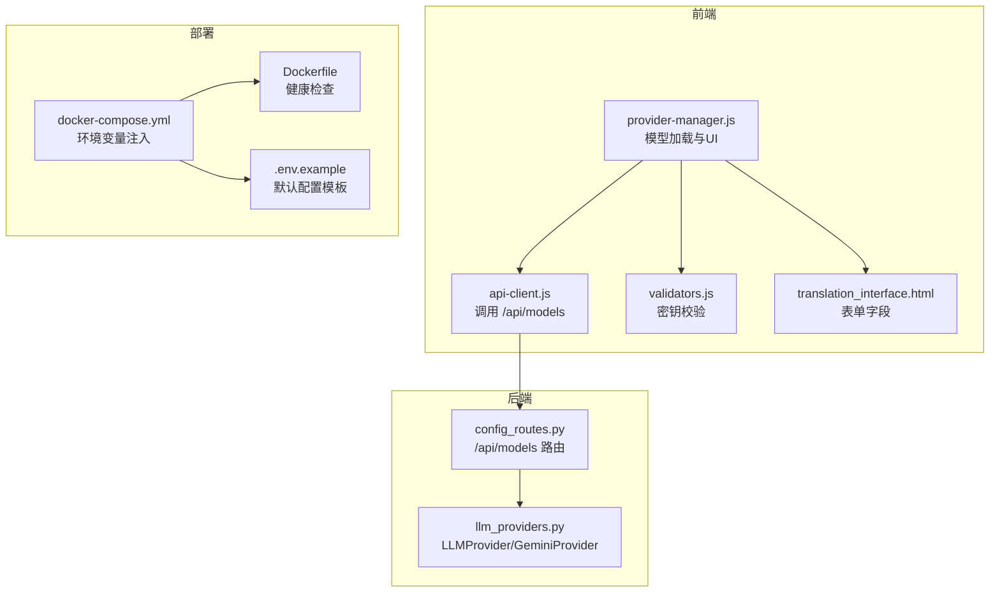
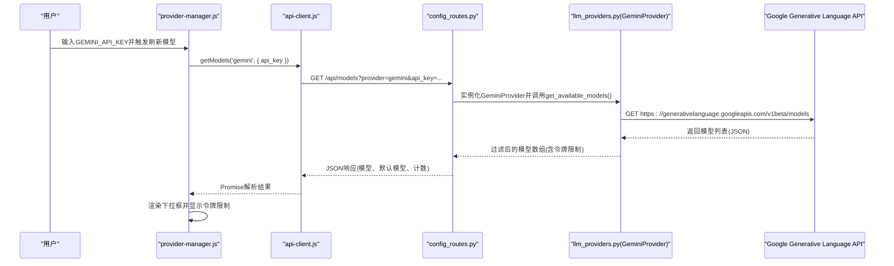
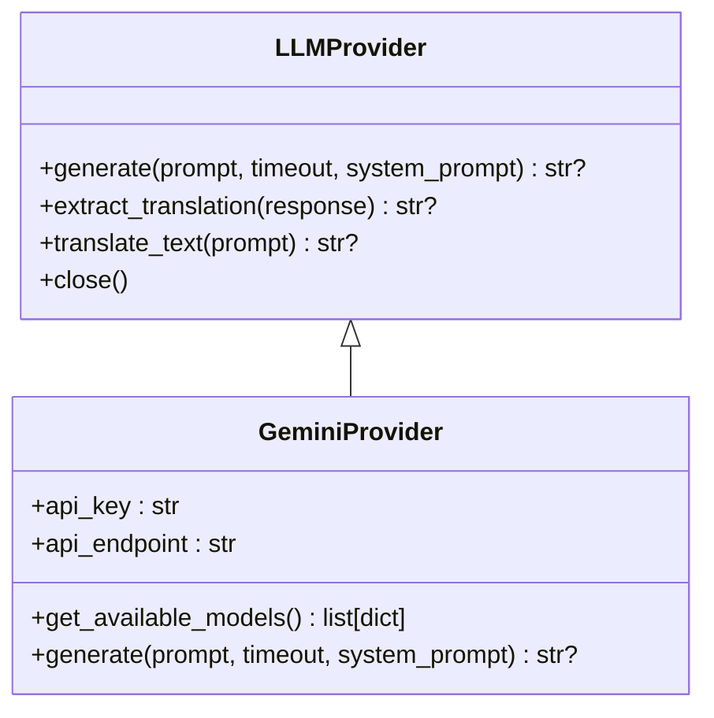
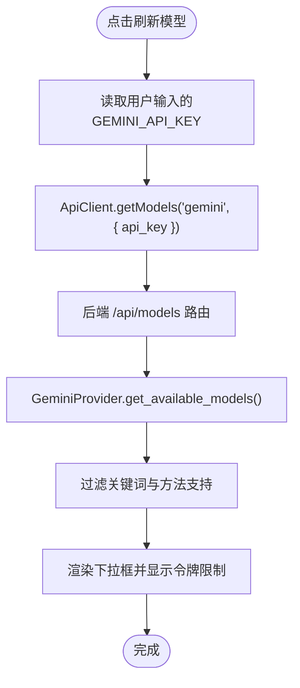
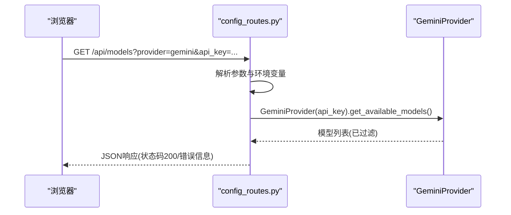
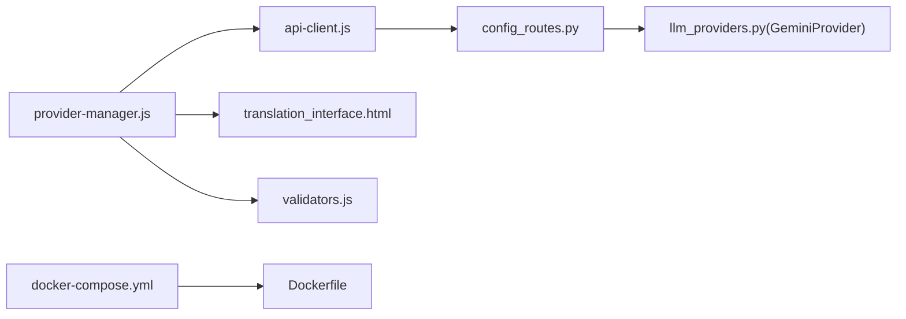

# Google Gemini提供商

<cite>
**本文引用的文件**
- [llm_providers.py](file://src/core/llm_providers.py)
- [config_routes.py](file://src/api/blueprints/config_routes.py)
- [provider-manager.js](file://src/web/static/js/providers/provider-manager.js)
- [api-client.js](file://src/web/static/js/core/api-client.js)
- [.env.example](file://.env.example)
- [docker-compose.yml](file://deployment/docker-compose.yml)
- [Dockerfile](file://deployment/Dockerfile)
- [translation_interface.html](file://src/web/templates/translation_interface.html)
- [validators.js](file://src/web/static/js/utils/validators.js)
- [env_helper.py](file://src/utils/env_helper.py)
</cite>

## 目录
1. [简介](#简介)
2. [项目结构](#项目结构)
3. [核心组件](#核心组件)
4. [架构总览](#架构总览)
5. [详细组件分析](#详细组件分析)
6. [依赖关系分析](#依赖关系分析)
7. [性能考虑](#性能考虑)
8. [故障排除指南](#故障排除指南)
9. [结论](#结论)
10. [附录](#附录)

## 简介
本文件为Google Gemini提供商的权威文档，聚焦于云服务集成的配置与使用。内容涵盖：
- GeminiProvider类的实现细节与认证机制（通过GEMINI_API_KEY）
- 与Google Generative Language API v1beta的交互流程（模型查询与文本生成）
- get_available_models方法如何动态拉取可用模型并自动过滤“thinking”“experimental”“vision”等关键词
- 前端provider-manager.js如何在Web界面中基于用户输入的API密钥动态加载模型列表，并展示输入/输出令牌限制
- 配置示例：环境变量、Docker部署参数、CLI命令行参数
- 免费配额优势提示与常见问题排查

## 项目结构
围绕Gemini提供商的关键文件分布如下：
- 后端Python层：LLM抽象与具体实现、API路由
- 前端JavaScript层：模型加载、UI交互、校验逻辑
- 部署与配置：Docker镜像与编排、示例环境变量

图表来源
- [llm_providers.py](file://src/core/llm_providers.py#L363-L548)
- [config_routes.py](file://src/api/blueprints/config_routes.py#L45-L111)
- [provider-manager.js](file://src/web/static/js/providers/provider-manager.js#L255-L295)
- [api-client.js](file://src/web/static/js/core/api-client.js#L240-L266)
- [validators.js](file://src/web/static/js/utils/validators.js#L76-L93)
- [translation_interface.html](file://src/web/templates/translation_interface.html#L37-L57)
- [docker-compose.yml](file://deployment/docker-compose.yml#L1-L69)
- [Dockerfile](file://deployment/Dockerfile#L1-L35)
- [.env.example](file://.env.example#L1-L45)

章节来源
- [llm_providers.py](file://src/core/llm_providers.py#L363-L548)
- [config_routes.py](file://src/api/blueprints/config_routes.py#L45-L111)
- [provider-manager.js](file://src/web/static/js/providers/provider-manager.js#L255-L295)
- [api-client.js](file://src/web/static/js/core/api-client.js#L240-L266)
- [validators.js](file://src/web/static/js/utils/validators.js#L76-L93)
- [translation_interface.html](file://src/web/templates/translation_interface.html#L37-L57)
- [docker-compose.yml](file://deployment/docker-compose.yml#L1-L69)
- [Dockerfile](file://deployment/Dockerfile#L1-L35)
- [.env.example](file://.env.example#L1-L45)

## 核心组件
- GeminiProvider：封装Google Gemini API的认证与请求，支持动态获取模型列表与文本生成
- /api/models路由：接收前端请求，返回可用模型清单（含令牌限制）
- provider-manager.js：负责前端模型下拉框渲染、令牌限制提示、错误消息展示
- api-client.js：统一发起HTTP请求到后端路由
- validators.js：对Gemini API Key进行必填校验
- docker-compose.yml与Dockerfile：容器化部署与环境变量注入
- .env.example：示例环境变量模板，包含GEMINI_API_KEY与GEMINI_MODEL

章节来源
- [llm_providers.py](file://src/core/llm_providers.py#L363-L548)
- [config_routes.py](file://src/api/blueprints/config_routes.py#L45-L111)
- [provider-manager.js](file://src/web/static/js/providers/provider-manager.js#L255-L295)
- [api-client.js](file://src/web/static/js/core/api-client.js#L240-L266)
- [validators.js](file://src/web/static/js/utils/validators.js#L76-L93)
- [docker-compose.yml](file://deployment/docker-compose.yml#L1-L69)
- [.env.example](file://.env.example#L1-L45)

## 架构总览
下面的序列图展示了从Web界面到Google Gemini API的完整调用链路。

图表来源
- [provider-manager.js](file://src/web/static/js/providers/provider-manager.js#L255-L295)
- [api-client.js](file://src/web/static/js/core/api-client.js#L240-L266)
- [config_routes.py](file://src/api/blueprints/config_routes.py#L45-L111)
- [llm_providers.py](file://src/core/llm_providers.py#L363-L417)

## 详细组件分析

### GeminiProvider类
- 认证方式：通过请求头携带GEMINI_API_KEY（x-goog-api-key）
- 模型查询端点：https://generativelanguage.googleapis.com/v1beta/models
- 文本生成端点：https://generativelanguage.googleapis.com/v1beta/models/{model}:generateContent
- 动态模型过滤策略：
  - 排除包含关键词“thinking”“experimental”“latest”“vision”“-exp-”的模型
  - 仅保留支持“generateContent”的模型
  - 返回字段包含：name、displayName、description、inputTokenLimit、outputTokenLimit
- 生成流程：
  - 组装payload（contents、generationConfig、可选systemInstruction）
  - 发起POST请求，解析candidates[0].content.parts[0].text作为返回文本
  - 失败重试与超时控制

图表来源
- [llm_providers.py](file://src/core/llm_providers.py#L23-L137)
- [llm_providers.py](file://src/core/llm_providers.py#L363-L548)

章节来源
- [llm_providers.py](file://src/core/llm_providers.py#L363-L548)

### 前端模型加载与令牌限制展示
- provider-manager.js
  - 读取用户输入的GEMINI_API_KEY
  - 调用ApiClient.getModels('gemini', { apiKey })发起请求
  - 渲染下拉框：option.title包含Input/Output令牌限制
  - 成功/失败的消息提示与日志记录
- api-client.js
  - 将provider与api_key拼接为查询参数，请求/api/models
- translation_interface.html
  - 提供geminiApiKey输入框
- validators.js
  - 对Gemini提供者进行API Key必填校验

图表来源
- [provider-manager.js](file://src/web/static/js/providers/provider-manager.js#L255-L295)
- [api-client.js](file://src/web/static/js/core/api-client.js#L240-L266)
- [translation_interface.html](file://src/web/templates/translation_interface.html#L37-L57)
- [validators.js](file://src/web/static/js/utils/validators.js#L76-L93)

章节来源
- [provider-manager.js](file://src/web/static/js/providers/provider-manager.js#L255-L295)
- [api-client.js](file://src/web/static/js/core/api-client.js#L240-L266)
- [translation_interface.html](file://src/web/templates/translation_interface.html#L37-L57)
- [validators.js](file://src/web/static/js/utils/validators.js#L76-L93)

### 后端路由与模型获取
- /api/models
  - 当provider=gemini时，优先从查询参数读取api_key；若为空则回退至环境变量GEMINI_API_KEY
  - 实例化GeminiProvider并调用get_available_models()
  - 返回JSON：models、model_names、default、status、count、error（如存在）

图表来源
- [config_routes.py](file://src/api/blueprints/config_routes.py#L45-L111)
- [llm_providers.py](file://src/core/llm_providers.py#L363-L417)

章节来源
- [config_routes.py](file://src/api/blueprints/config_routes.py#L45-L111)

### 配置与部署

- 环境变量
  - GEMINI_API_KEY：用于Gemini认证
  - GEMINI_MODEL：默认模型名（如gemini-2.0-flash）
  - LLM_PROVIDER：选择gemini
  - 其他通用配置：PORT、DEFAULT_SOURCE_LANGUAGE、DEFAULT_TARGET_LANGUAGE、REQUEST_TIMEOUT等
- Docker部署
  - docker-compose.yml中通过environment注入GEMINI_API_KEY、GEMINI_MODEL等
  - Dockerfile定义健康检查，确保容器启动后对外提供/api/health
- CLI命令行参数
  - 可通过命令行运行脚本创建/验证/交互式生成.env文件（参考env_helper.py）

章节来源
- [.env.example](file://.env.example#L1-L45)
- [docker-compose.yml](file://deployment/docker-compose.yml#L1-L69)
- [Dockerfile](file://deployment/Dockerfile#L1-L35)
- [env_helper.py](file://src/utils/env_helper.py#L1-L239)

## 依赖关系分析
- provider-manager.js依赖api-client.js发起请求
- api-client.js依赖后端路由config_routes.py
- config_routes.py依赖llm_providers.py中的GeminiProvider
- 前端HTML模板提供输入控件，validators.js进行前端校验
- Docker编排注入环境变量，Dockerfile定义健康检查

图表来源
- [provider-manager.js](file://src/web/static/js/providers/provider-manager.js#L255-L295)
- [api-client.js](file://src/web/static/js/core/api-client.js#L240-L266)
- [config_routes.py](file://src/api/blueprints/config_routes.py#L45-L111)
- [llm_providers.py](file://src/core/llm_providers.py#L363-L548)
- [translation_interface.html](file://src/web/templates/translation_interface.html#L37-L57)
- [validators.js](file://src/web/static/js/utils/validators.js#L76-L93)
- [docker-compose.yml](file://deployment/docker-compose.yml#L1-L69)
- [Dockerfile](file://deployment/Dockerfile#L1-L35)

章节来源
- [provider-manager.js](file://src/web/static/js/providers/provider-manager.js#L255-L295)
- [api-client.js](file://src/web/static/js/core/api-client.js#L240-L266)
- [config_routes.py](file://src/api/blueprints/config_routes.py#L45-L111)
- [llm_providers.py](file://src/core/llm_providers.py#L363-L548)
- [translation_interface.html](file://src/web/templates/translation_interface.html#L37-L57)
- [validators.js](file://src/web/static/js/utils/validators.js#L76-L93)
- [docker-compose.yml](file://deployment/docker-compose.yml#L1-L69)
- [Dockerfile](file://deployment/Dockerfile#L1-L35)

## 性能考虑
- 连接池与超时：LLMProvider内部使用httpx.AsyncClient并设置超时，避免阻塞
- 重试策略：generate与get_available_models均内置最大尝试次数与延迟
- 模型过滤：前端与后端均对不合适的模型进行过滤，减少无效请求
- 令牌限制：前端在option.title中展示input/output token限制，便于用户选择合适模型

章节来源
- [llm_providers.py](file://src/core/llm_providers.py#L23-L137)
- [llm_providers.py](file://src/core/llm_providers.py#L363-L548)

## 故障排除指南
- API密钥无效
  - 现象：/api/models返回“缺少API Key”或后端抛出异常
  - 排查：
    - 确认GEMINI_API_KEY是否正确设置（环境变量或传参）
    - 前端validators.js会提示Gemini API Key必填
    - 后端config_routes.py会在缺失时直接返回错误信息
- 配额耗尽或网络连接问题
  - 现象：请求超时、HTTP状态错误、JSON解析失败
  - 排查：
    - 查看provider-manager.js与llm_providers.py中的重试与错误日志
    - 检查网络连通性与Google API可达性
    - 适当增大REQUEST_TIMEOUT并减少并发
- 模型列表为空
  - 现象：前端显示“无可用模型”
  - 排查：
    - 确认GEMINI_API_KEY有效且账户有可用配额
    - 检查get_available_models过滤规则（排除thinking/experimental/latest/vision/-exp-）
- Docker部署问题
  - 现象：容器无法健康启动
  - 排查：
    - 确认docker-compose.yml中GEMINI_API_KEY已注入
    - 使用Dockerfile中的健康检查命令验证服务状态

章节来源
- [validators.js](file://src/web/static/js/utils/validators.js#L76-L93)
- [config_routes.py](file://src/api/blueprints/config_routes.py#L74-L121)
- [llm_providers.py](file://src/core/llm_providers.py#L363-L548)
- [provider-manager.js](file://src/web/static/js/providers/provider-manager.js#L255-L295)
- [Dockerfile](file://deployment/Dockerfile#L1-L35)
- [docker-compose.yml](file://deployment/docker-compose.yml#L1-L69)

## 结论
本文件系统性梳理了Google Gemini提供商在本项目中的实现与使用路径，覆盖认证、模型查询、前端渲染、部署与故障排除。通过严格的模型过滤与令牌限制展示，用户可在Web界面中高效选择适合的模型；借助Docker与环境变量配置，可快速完成本地或容器化部署。

## 附录

### 配置示例

- 环境变量（.env）
  - GEMINI_API_KEY：你的Google Gemini API密钥
  - GEMINI_MODEL：默认模型名（如gemini-2.0-flash）
  - LLM_PROVIDER：gemini
  - 其他：PORT、DEFAULT_SOURCE_LANGUAGE、DEFAULT_TARGET_LANGUAGE、REQUEST_TIMEOUT等

- Docker部署参数
  - 在docker-compose.yml中设置：
    - GEMINI_API_KEY：注入到容器环境
    - GEMINI_MODEL：默认模型
  - 容器暴露端口与健康检查由Dockerfile定义

- CLI命令行参数
  - 使用env_helper.py提供的命令：
    - 创建.env：python -m src.utils.env_helper create
    - 校验配置：python -m src.utils.env_helper validate
    - 交互式设置：python -m src.utils.env_helper setup

章节来源
- [.env.example](file://.env.example#L1-L45)
- [docker-compose.yml](file://deployment/docker-compose.yml#L1-L69)
- [Dockerfile](file://deployment/Dockerfile#L1-L35)
- [env_helper.py](file://src/utils/env_helper.py#L1-L239)