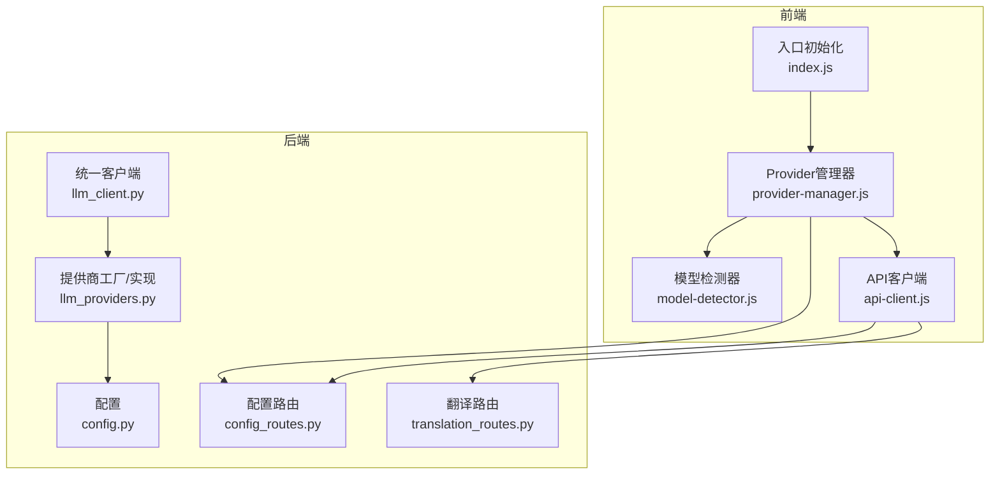
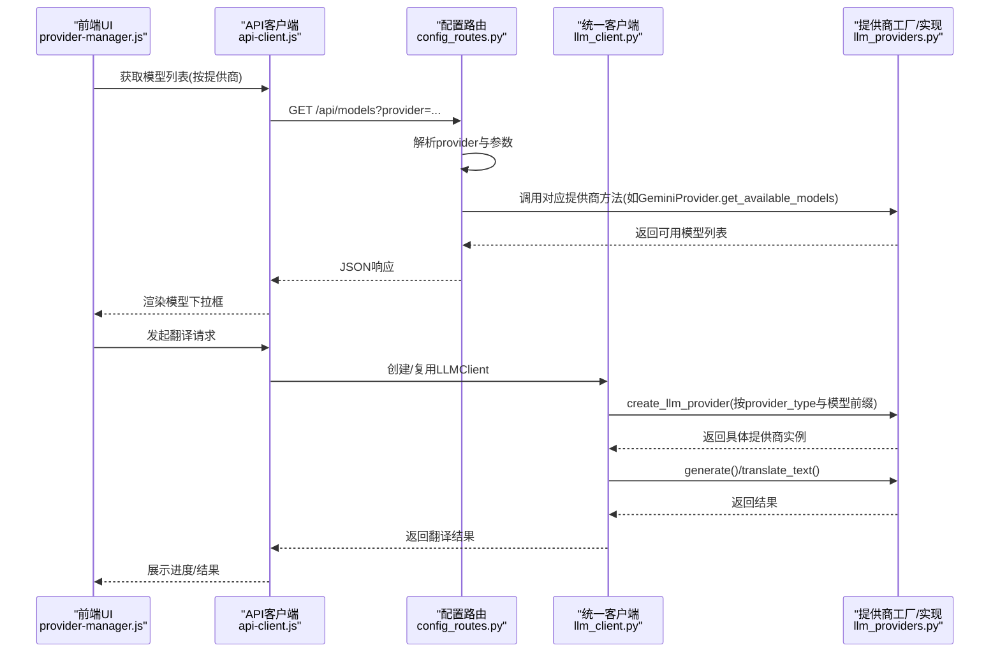
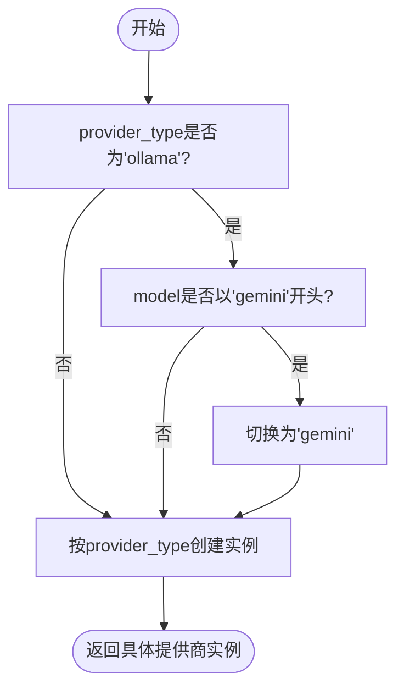
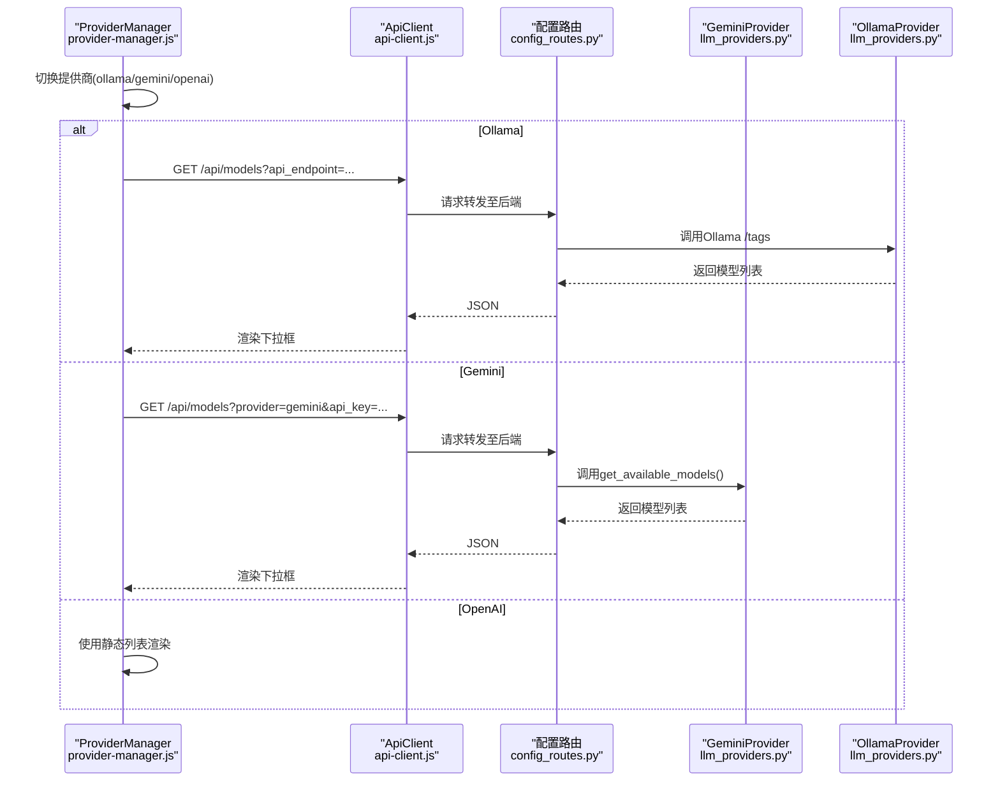
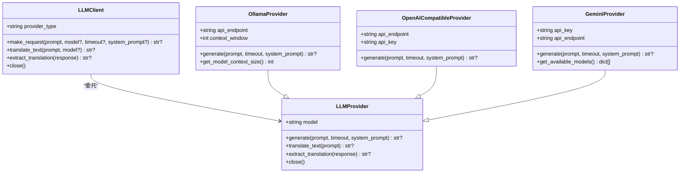
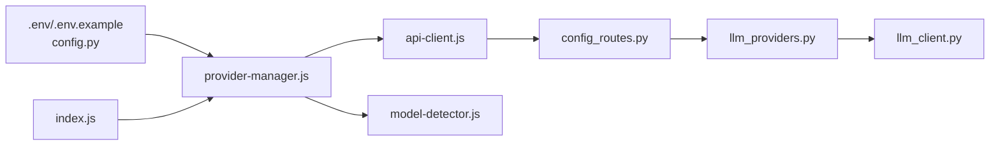

# LLM提供商集成

<cite>
**本文引用的文件**
- [llm_providers.py](file://src/core/llm_providers.py)
- [llm_client.py](file://src/core/llm_client.py)
- [config.py](file://src/config.py)
- [provider-manager.js](file://src/web/static/js/providers/provider-manager.js)
- [model-detector.js](file://src/web/static/js/providers/model-detector.js)
- [api-client.js](file://src/web/static/js/core/api-client.js)
- [config_routes.py](file://src/api/blueprints/config_routes.py)
- [.env.example](file://.env.example)
- [index.js](file://src/web/static/js/index.js)
- [translation_routes.py](file://src/api/blueprints/translation_routes.py)
</cite>

## 目录
1. [简介](#简介)
2. [项目结构](#项目结构)
3. [核心组件](#核心组件)
4. [架构总览](#架构总览)
5. [详细组件分析](#详细组件分析)
6. [依赖关系分析](#依赖关系分析)
7. [性能与可靠性](#性能与可靠性)
8. [故障排查指南](#故障排查指南)
9. [结论](#结论)
10. [附录：配置与使用示例](#附录配置与使用示例)

## 简介
本文件为“LLM提供商集成”的权威文档，面向开发者与运维人员，系统性说明如何在本项目中配置与使用三种LLM提供商：Ollama、Gemini、OpenAI-Compatible。重点涵盖：
- 工厂模式设计与动态实例化逻辑（基于provider_type参数）
- 认证方式与API端点配置
- 模型命名规则与自动检测机制（如以“gemini”开头的模型自动切换到Gemini）
- 前端provider-manager.js如何动态加载各提供商的可用模型列表
- 配置示例与常见问题排查（网络连接、服务未就绪等）

## 项目结构
围绕LLM提供商的核心代码位于以下位置：
- 后端核心：src/core/llm_providers.py（抽象与实现）、src/core/llm_client.py（统一客户端）
- 配置中心：src/config.py（环境变量与默认值）
- Web前端：src/web/static/js/providers/provider-manager.js、src/web/static/js/providers/model-detector.js、src/web/static/js/core/api-client.js
- API路由：src/api/blueprints/config_routes.py、src/api/blueprints/translation_routes.py
- 示例配置：.env.example

图表来源
- [llm_providers.py](file://src/core/llm_providers.py#L515-L548)
- [llm_client.py](file://src/core/llm_client.py#L1-L123)
- [config.py](file://src/config.py#L56-L106)
- [provider-manager.js](file://src/web/static/js/providers/provider-manager.js#L1-L331)
- [model-detector.js](file://src/web/static/js/providers/model-detector.js#L1-L129)
- [api-client.js](file://src/web/static/js/core/api-client.js#L240-L307)
- [config_routes.py](file://src/api/blueprints/config_routes.py#L45-L156)
- [translation_routes.py](file://src/api/blueprints/translation_routes.py#L26-L85)

章节来源
- [llm_providers.py](file://src/core/llm_providers.py#L515-L548)
- [llm_client.py](file://src/core/llm_client.py#L1-L123)
- [config.py](file://src/config.py#L56-L106)
- [provider-manager.js](file://src/web/static/js/providers/provider-manager.js#L1-L331)
- [model-detector.js](file://src/web/static/js/providers/model-detector.js#L1-L129)
- [api-client.js](file://src/web/static/js/core/api-client.js#L240-L307)
- [config_routes.py](file://src/api/blueprints/config_routes.py#L45-L156)
- [translation_routes.py](file://src/api/blueprints/translation_routes.py#L26-L85)

## 核心组件
- 抽象基类与提供商实现
  - LLMProvider：定义统一接口与通用能力（如提取翻译标签、重试与超时处理）
  - OllamaProvider：对接本地Ollama服务，支持上下文窗口查询与自适应
  - OpenAICompatibleProvider：兼容OpenAI风格的消息格式与请求体
  - GeminiProvider：对接Google Gemini API，支持动态获取可用模型列表
- 工厂函数
  - create_llm_provider：根据provider_type与模型前缀自动选择具体实现
- 统一客户端
  - LLMClient：封装请求、提取翻译、关闭资源；负责延迟创建提供商实例
- 配置中心
  - config.py：集中读取环境变量，提供默认值与统一配置对象
- 前端Provider管理器
  - provider-manager.js：切换提供商、加载模型、自动重试Ollama、更新状态
  - model-detector.js：从模型名推断参数规模并给出快速模式建议
  - api-client.js：封装后端API调用，统一错误处理
- API路由
  - config_routes.py：提供健康检查、默认配置、模型列表（Ollama/Gemini）
  - translation_routes.py：接收翻译请求，构建配置并启动任务

章节来源
- [llm_providers.py](file://src/core/llm_providers.py#L23-L137)
- [llm_providers.py](file://src/core/llm_providers.py#L139-L279)
- [llm_providers.py](file://src/core/llm_providers.py#L281-L361)
- [llm_providers.py](file://src/core/llm_providers.py#L363-L513)
- [llm_providers.py](file://src/core/llm_providers.py#L515-L548)
- [llm_client.py](file://src/core/llm_client.py#L1-L123)
- [config.py](file://src/config.py#L56-L106)
- [provider-manager.js](file://src/web/static/js/providers/provider-manager.js#L1-L331)
- [model-detector.js](file://src/web/static/js/providers/model-detector.js#L1-L129)
- [api-client.js](file://src/web/static/js/core/api-client.js#L240-L307)
- [config_routes.py](file://src/api/blueprints/config_routes.py#L45-L156)
- [translation_routes.py](file://src/api/blueprints/translation_routes.py#L26-L85)

## 架构总览
下图展示从Web前端到后端API再到LLM提供商的整体流程，以及工厂模式在运行时的动态选择。

图表来源
- [provider-manager.js](file://src/web/static/js/providers/provider-manager.js#L240-L303)
- [api-client.js](file://src/web/static/js/core/api-client.js#L240-L307)
- [config_routes.py](file://src/api/blueprints/config_routes.py#L45-L156)
- [llm_client.py](file://src/core/llm_client.py#L1-L98)
- [llm_providers.py](file://src/core/llm_providers.py#L515-L548)

## 详细组件分析

### 工厂模式与动态实例化
- 设计要点
  - create_llm_provider根据provider_type创建具体提供商实例
  - 自动检测：当provider_type为“ollama”且model以“gemini”开头时，自动切换为“gemini”
  - GeminiProvider在未显式传入api_key时尝试从环境变量GEMINI_API_KEY读取
- 关键路径
  - 工厂函数定义与分支逻辑：[llm_providers.py](file://src/core/llm_providers.py#L515-L548)
  - 统一客户端通过工厂创建实例：[llm_client.py](file://src/core/llm_client.py#L26-L30)

图表来源
- [llm_providers.py](file://src/core/llm_providers.py#L515-L548)

章节来源
- [llm_providers.py](file://src/core/llm_providers.py#L515-L548)
- [llm_client.py](file://src/core/llm_client.py#L26-L30)

### 认证方式与API端点配置
- Ollama
  - 端点：默认API_ENDPOINT指向本地Ollama服务
  - 上下文窗口：可通过OLLAMA_NUM_CTX配置；运行时可查询模型实际上下文大小
  - 端点与模型列表获取：后端通过Ollama的/tags端点获取模型列表
- Gemini
  - 端点：固定为Google Generative Language API；每个模型有独立生成端点
  - 认证：需GEMINI_API_KEY；前端可直接传入或由后端读取
  - 可用模型：通过/models接口过滤非generateContent模型
- OpenAI-Compatible
  - 端点：自定义兼容服务（如第三方代理）；需提供api_endpoint与api_key
  - 认证：Authorization: Bearer <api_key>

章节来源
- [config.py](file://src/config.py#L56-L64)
- [config_routes.py](file://src/api/blueprints/config_routes.py#L123-L155)
- [llm_providers.py](file://src/core/llm_providers.py#L139-L279)
- [llm_providers.py](file://src/core/llm_providers.py#L281-L361)
- [llm_providers.py](file://src/core/llm_providers.py#L363-L513)

### 模型命名规则与自动检测
- 命名规则
  - Ollama：通常形如“模型名:版本号”，如“qwen3:14b”
  - Gemini：形如“gemini-2.0-flash”等
  - OpenAI：形如“gpt-4o”、“gpt-4o-mini”等
- 自动检测
  - 当provider_type为“ollama”且model以“gemini”开头时，自动切换到Gemini提供商
  - 前端模型检测器可从模型名解析参数规模（如“14b”），并提示启用快速模式

章节来源
- [llm_providers.py](file://src/core/llm_providers.py#L515-L548)
- [model-detector.js](file://src/web/static/js/providers/model-detector.js#L1-L129)

### 前端动态加载模型列表
- ProviderManager职责
  - 切换提供商时显示/隐藏对应设置区域
  - 加载Ollama模型：轮询失败时自动重试，成功后停止重试
  - 加载Gemini模型：直接调用后端/models?provider=gemini&api_key=...
  - 加载OpenAI模型：使用静态列表
- ApiClient
  - 统一封装GET /api/models并拼接provider与参数
- 状态管理
  - 使用StateManager记录当前提供商、模型、加载请求等

图表来源
- [provider-manager.js](file://src/web/static/js/providers/provider-manager.js#L141-L303)
- [api-client.js](file://src/web/static/js/core/api-client.js#L240-L307)
- [config_routes.py](file://src/api/blueprints/config_routes.py#L45-L156)
- [llm_providers.py](file://src/core/llm_providers.py#L363-L417)

章节来源
- [provider-manager.js](file://src/web/static/js/providers/provider-manager.js#L1-L331)
- [api-client.js](file://src/web/static/js/core/api-client.js#L240-L307)
- [config_routes.py](file://src/api/blueprints/config_routes.py#L45-L156)
- [llm_providers.py](file://src/core/llm_providers.py#L363-L417)

### 统一客户端与提供商交互
- LLMClient
  - 延迟创建提供商实例
  - 提供make_request、translate_text、extract_translation等统一接口
- LLMProvider
  - generate抽象方法由各提供商实现
  - 统一的重试与超时策略
  - 提供extract_translation用于严格提取翻译标签

图表来源
- [llm_client.py](file://src/core/llm_client.py#L1-L98)
- [llm_providers.py](file://src/core/llm_providers.py#L23-L137)
- [llm_providers.py](file://src/core/llm_providers.py#L139-L279)
- [llm_providers.py](file://src/core/llm_providers.py#L281-L361)
- [llm_providers.py](file://src/core/llm_providers.py#L363-L513)

章节来源
- [llm_client.py](file://src/core/llm_client.py#L1-L123)
- [llm_providers.py](file://src/core/llm_providers.py#L23-L137)
- [llm_providers.py](file://src/core/llm_providers.py#L139-L279)
- [llm_providers.py](file://src/core/llm_providers.py#L281-L361)
- [llm_providers.py](file://src/core/llm_providers.py#L363-L513)

## 依赖关系分析
- 配置依赖
  - config.py集中读取环境变量，为后端与前端提供默认值
- 前后端耦合
  - provider-manager.js通过api-client.js调用后端/config与/models接口
  - config_routes.py对Gemini与Ollama分别提供模型列表获取
- 工厂与客户端
  - llm_client.py依赖llm_providers.py中的工厂函数进行实例化
- 自动检测链路
  - provider-manager.js触发模型加载
  - llm_providers.py在工厂层做自动检测与切换

图表来源
- [config.py](file://src/config.py#L56-L106)
- [provider-manager.js](file://src/web/static/js/providers/provider-manager.js#L1-L331)
- [api-client.js](file://src/web/static/js/core/api-client.js#L240-L307)
- [config_routes.py](file://src/api/blueprints/config_routes.py#L45-L156)
- [llm_providers.py](file://src/core/llm_providers.py#L515-L548)
- [llm_client.py](file://src/core/llm_client.py#L1-L98)
- [index.js](file://src/web/static/js/index.js#L269-L280)

章节来源
- [config.py](file://src/config.py#L56-L106)
- [provider-manager.js](file://src/web/static/js/providers/provider-manager.js#L1-L331)
- [api-client.js](file://src/web/static/js/core/api-client.js#L240-L307)
- [config_routes.py](file://src/api/blueprints/config_routes.py#L45-L156)
- [llm_providers.py](file://src/core/llm_providers.py#L515-L548)
- [llm_client.py](file://src/core/llm_client.py#L1-L98)
- [index.js](file://src/web/static/js/index.js#L269-L280)

## 性能与可靠性
- 连接池与超时
  - LLMProvider内部使用httpx.AsyncClient并设置连接池上限与超时
- 重试与退避
  - 各提供商均内置最大尝试次数与延迟重试
- 上下文窗口优化
  - OllamaProvider支持运行时查询模型上下文大小，并提供默认族系阈值
- 前端自动重试
  - ProviderManager对Ollama提供静默重试与可视化提示

章节来源
- [llm_providers.py](file://src/core/llm_providers.py#L34-L47)
- [llm_providers.py](file://src/core/llm_providers.py#L176-L218)
- [llm_providers.py](file://src/core/llm_providers.py#L318-L360)
- [llm_providers.py](file://src/core/llm_providers.py#L461-L512)
- [provider-manager.js](file://src/web/static/js/providers/provider-manager.js#L141-L219)

## 故障排查指南
- OpenAI网络连接问题
  - 现象：HTTP超时、状态码异常、JSON解析失败
  - 排查要点：
    - 确认api_endpoint与api_key正确
    - 检查网络连通性与防火墙
    - 适当提高REQUEST_TIMEOUT与MAX_TRANSLATION_ATTEMPTS
  - 参考实现位置：
    - [llm_providers.py](file://src/core/llm_providers.py#L318-L360)
    - [config.py](file://src/config.py#L56-L64)

- Ollama服务未就绪或无模型
  - 现象：/api/models返回空列表或错误信息
  - 排查要点：
    - 确认Ollama已启动（ollama serve）
    - 校验API_ENDPOINT是否正确（应包含/api/generate）
    - 等待ProviderManager自动重试或手动刷新
  - 参考实现位置：
    - [config_routes.py](file://src/api/blueprints/config_routes.py#L123-L155)
    - [provider-manager.js](file://src/web/static/js/providers/provider-manager.js#L141-L219)

- Gemini认证失败
  - 现象：/api/models返回缺少api_key或连接失败
  - 排查要点：
    - 设置GEMINI_API_KEY环境变量或在前端传入
    - 确认Google API可用性与配额
  - 参考实现位置：
    - [config_routes.py](file://src/api/blueprints/config_routes.py#L74-L122)
    - [llm_providers.py](file://src/core/llm_providers.py#L536-L546)

- 上下文溢出
  - 现象：Ollama返回上下文过长错误
  - 排查要点：
    - 减小chunk_size或增大OLLAMA_NUM_CTX
    - 使用模型上下文探测功能
  - 参考实现位置：
    - [llm_providers.py](file://src/core/llm_providers.py#L184-L206)
    - [llm_providers.py](file://src/core/llm_providers.py#L219-L279)
    - [config.py](file://src/config.py#L62-L64)

- 自动检测未生效
  - 现象：输入gemini-xxx但未切换到Gemini
  - 排查要点：
    - 确保provider_type为“ollama”且model以“gemini”开头
    - 检查前端是否正确传递model
  - 参考实现位置：
    - [llm_providers.py](file://src/core/llm_providers.py#L515-L523)
    - [provider-manager.js](file://src/web/static/js/providers/provider-manager.js#L1-L331)

## 结论
本项目通过统一的工厂模式与抽象基类，实现了对Ollama、Gemini、OpenAI-Compatible三类提供商的一致接入。前端ProviderManager与后端config_routes配合，提供了直观的模型列表加载体验；工厂层的自动检测机制进一步提升了易用性。结合完善的重试、超时与上下文管理策略，系统在复杂网络环境下仍具备良好的稳定性与可维护性。

## 附录：配置与使用示例
- 环境变量与默认值
  - 参考：[config.py](file://src/config.py#L56-L106)
  - 示例模板：[.env.example](file://.env.example#L1-L45)
- 前端初始化与模块加载
  - 入口文件导出ProviderManager等模块：[index.js](file://src/web/static/js/index.js#L269-L280)
- 翻译请求与配置传递
  - 翻译路由接收配置并启动任务：[translation_routes.py](file://src/api/blueprints/translation_routes.py#L26-L85)
- 模型列表获取
  - Ollama：GET /api/models?api_endpoint=...
  - Gemini：GET /api/models?provider=gemini&api_key=...
  - OpenAI：前端静态列表
  - 参考：[api-client.js](file://src/web/static/js/core/api-client.js#L240-L307)，[config_routes.py](file://src/api/blueprints/config_routes.py#L45-L156)