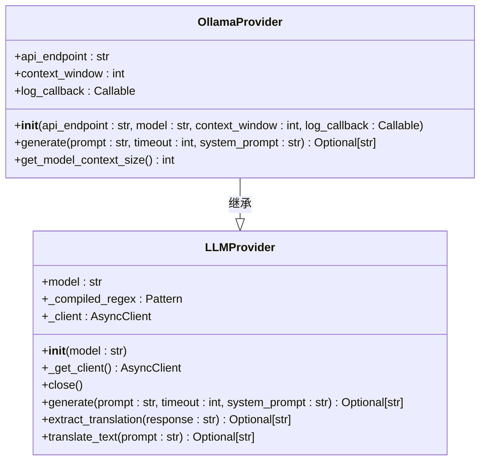
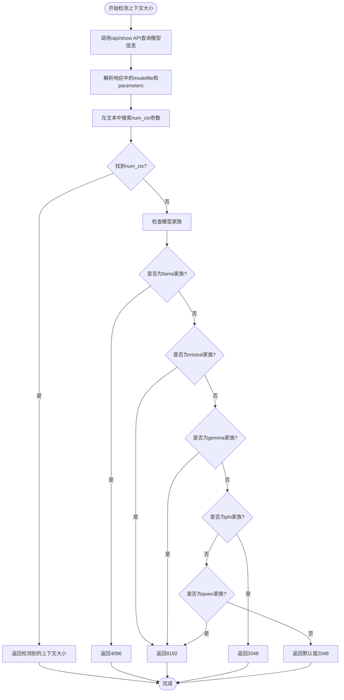
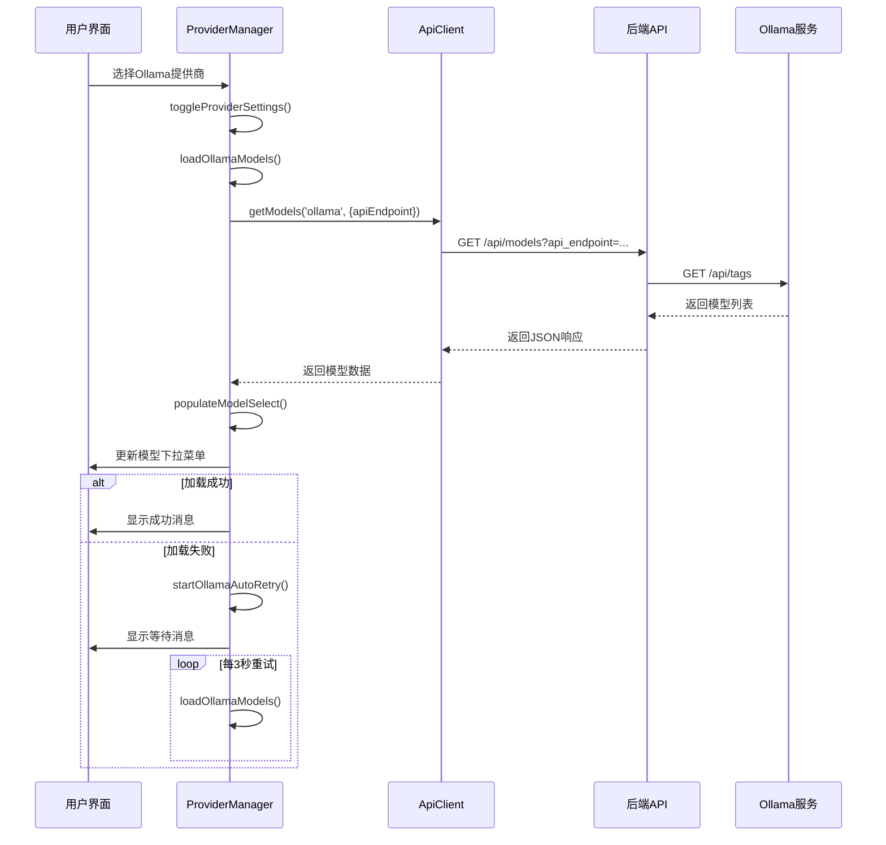
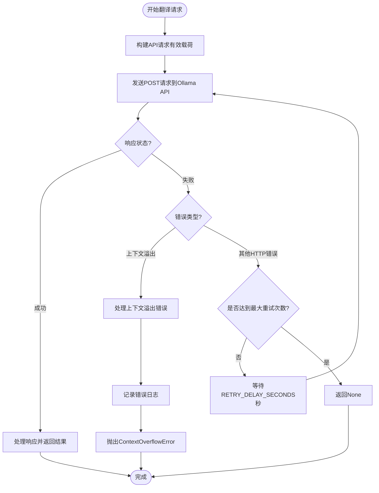

# Ollama提供商

<cite>
**本文档引用的文件**   
- [llm_providers.py](file://src/core/llm_providers.py)
- [provider-manager.js](file://src/web/static/js/providers/provider-manager.js)
- [config.py](file://src/config.py)
- [config_routes.py](file://src/api/blueprints/config_routes.py)
- [translate.py](file://translate.py)
- [Dockerfile](file://deployment/Dockerfile)
- [.env.example](file://.env.example)
</cite>

## 目录
1. [简介](#简介)
2. [OllamaProvider类实现](#ollamaprovider类实现)
3. [上下文大小自动检测](#上下文大小自动检测)
4. [前端模型管理](#前端模型管理)
5. [配置与部署](#配置与部署)
6. [上下文溢出错误处理](#上下文溢出错误处理)
7. [总结](#总结)

## 简介

Ollama提供商是本项目中用于连接本地LLM服务的核心组件。它通过Ollama API与本地运行的大语言模型进行交互，为文本翻译任务提供强大的语言处理能力。该提供商支持灵活的配置选项，包括API端点、模型选择、上下文窗口大小等，能够适应不同的使用场景和需求。

Ollama作为一种本地LLM服务，允许用户在自己的硬件上运行大语言模型，确保了数据隐私和安全性。本项目的Ollama提供商实现了与Ollama服务的无缝集成，通过精心设计的API调用和错误处理机制，确保了翻译任务的稳定性和可靠性。

## OllamaProvider类实现

OllamaProvider类是LLMProvider抽象基类的具体实现，负责与Ollama API进行通信。其核心功能包括初始化连接参数、生成文本以及处理API响应。



**代码片段路径**
- [llm_providers.py#L139-L148](file://src/core/llm_providers.py#L139-L148)

OllamaProvider的构造函数接受四个主要参数：`api_endpoint`、`model`、`context_window`和`log_callback`。其中，`api_endpoint`指定Ollama服务的API端点，默认值从配置文件中获取；`model`指定要使用的模型名称；`context_window`控制上下文长度，决定了模型能够处理的输入文本的最大长度；`log_callback`是一个可选的日志回调函数，用于记录操作过程中的重要信息。

在生成文本时，OllamaProvider会构建一个包含模型名称、提示词和选项的JSON有效载荷，然后通过HTTP POST请求发送到Ollama API。请求中包含了`num_ctx`参数，用于指定上下文窗口大小，并设置了`truncate`为`False`，以防止输入被截断。

## 上下文大小自动检测

OllamaProvider具备自动检测模型上下文大小的能力，这对于优化翻译性能至关重要。该功能通过查询Ollama API的`/api/show`端点来实现，获取模型的`modelfile`和`parameters`信息，然后从中提取`num_ctx`值。



**代码片段路径**
- [llm_providers.py#L219-L278](file://src/core/llm_providers.py#L219-L278)

如果在`modelfile`或`parameters`中找到了`num_ctx`参数，则直接返回其值。如果没有找到，则根据模型名称中的家族标识（如"llama"、"mistral"等）返回相应的默认值。这种回退机制确保了即使在无法精确检测的情况下，也能提供一个合理的上下文大小估计。

## 前端模型管理

前端通过`provider-manager.js`文件中的`ProviderManager`模块实现Ollama模型的自动加载和管理。该模块负责在用户选择Ollama作为LLM提供商时，从Ollama服务获取可用的模型列表，并在界面上进行展示。



**代码片段路径**
- [provider-manager.js#L144-L242](file://src/web/static/js/providers/provider-manager.js#L144-L242)

当Ollama服务暂时不可用时，前端实现了智能的重试机制。如果首次连接失败，系统会自动每3秒重试一次，最多静默重试5次。在此期间，用户界面会显示"等待Ollama启动..."的消息，提示用户服务正在尝试重新连接。这种机制确保了即使在Ollama服务启动较慢的情况下，用户也不需要手动刷新页面或重新操作。

## 配置与部署

Ollama提供商的配置可以通过多种方式进行，包括环境变量、Docker部署参数和CLI命令行参数。

### 环境变量配置

通过`.env`文件可以设置Ollama提供商的关键参数：

```env
# LLM Provider Settings
LLM_PROVIDER=ollama
API_ENDPOINT=http://localhost:11434/api/generate
DEFAULT_MODEL=qwen3:14b

# Context Management
OLLAMA_NUM_CTX=8192
AUTO_ADJUST_CONTEXT=true
MIN_CHUNK_SIZE=5
MAX_CHUNK_SIZE=100
```

**代码片段路径**
- [.env.example#L11-L27](file://.env.example#L11-L27)

### Docker部署

使用Docker部署时，可以在`docker-compose.yml`中配置相关参数：

```yaml
services:
  translator:
    build: .
    ports:
      - "5000:5000"
    environment:
      - LLM_PROVIDER=ollama
      - API_ENDPOINT=http://host.docker.internal:11434/api/generate
      - OLLAMA_NUM_CTX=8192
    volumes:
      - ./translated_files:/app/translated_files
```

**代码片段路径**
- [Dockerfile#L23-L25](file://deployment/Dockerfile#L23-L25)

### CLI命令行参数

通过`translate.py`脚本可以使用命令行参数进行配置：

```bash
python translate.py \
  --input input.txt \
  --output output.txt \
  --provider ollama \
  --api_endpoint http://localhost:11434/api/generate \
  --model qwen3:14b \
  --chunksize 25
```

**代码片段路径**
- [translate.py#L14-L27](file://translate.py#L14-L27)

## 上下文溢出错误处理

当输入文本超出模型的上下文窗口大小时，OllamaProvider会抛出`ContextOverflowError`异常。该异常的处理是确保系统稳定性的关键环节。



**代码片段路径**
- [llm_providers.py#L184-L205](file://src/core/llm_providers.py#L184-L205)

当检测到"context"、"truncate"、"length"或"too long"等关键词时，系统会识别为上下文溢出错误，并抛出`ContextOverflowError`。同时，会通过`log_callback`记录详细的错误信息，建议用户通过减少`chunk_size`或增加`OLLAMA_NUM_CTX`来解决此问题。

为了预防上下文溢出，系统还实现了自动上下文优化功能。`context_optimizer.py`模块会根据估计的令牌数量和模型的最大上下文大小，自动调整`num_ctx`或`chunk_size`参数，确保输入文本适合模型处理。

## 总结

Ollama提供商作为本项目的核心组件，实现了与本地LLM服务的高效集成。通过精心设计的API调用、智能的上下文管理、前端的自动重试机制以及完善的错误处理，为用户提供了一个稳定可靠的翻译解决方案。

其主要特点包括：
- **灵活的配置**：支持环境变量、Docker和CLI等多种配置方式
- **智能的上下文管理**：自动检测模型上下文大小，并提供回退机制
- **健壮的错误处理**：对上下文溢出等常见错误提供明确的解决方案
- **用户友好的前端**：自动加载模型，服务未就绪时自动重试
- **可扩展的架构**：基于抽象基类设计，便于添加新的LLM提供商

通过合理配置`chunk_size`和`OLLAMA_NUM_CTX`参数，用户可以根据自己的硬件条件和模型能力，优化翻译性能，避免上下文溢出问题，实现高效准确的文本翻译。