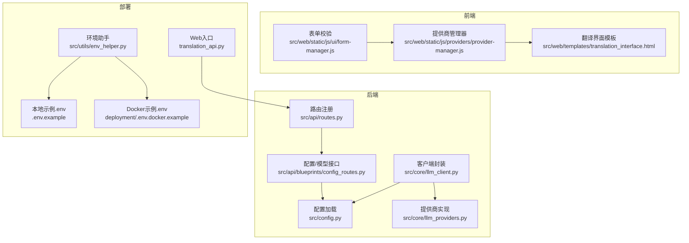
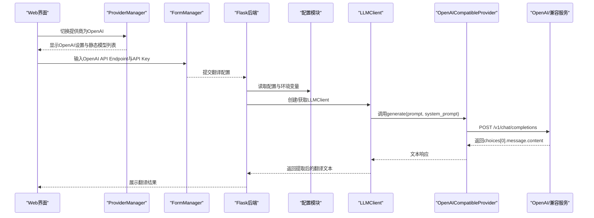
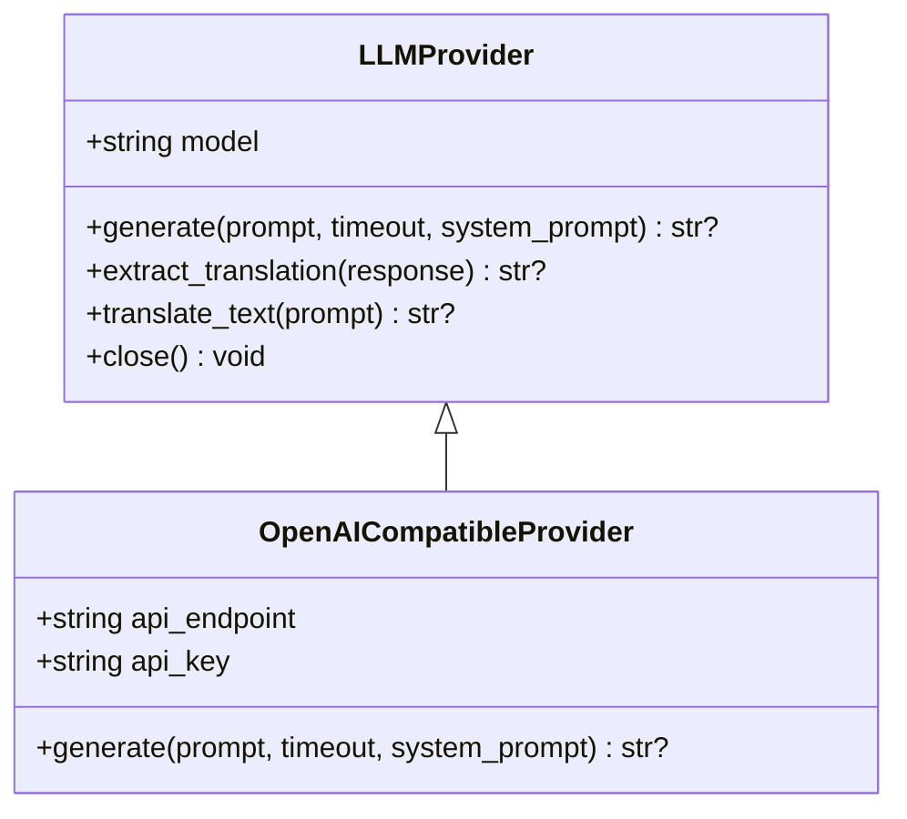
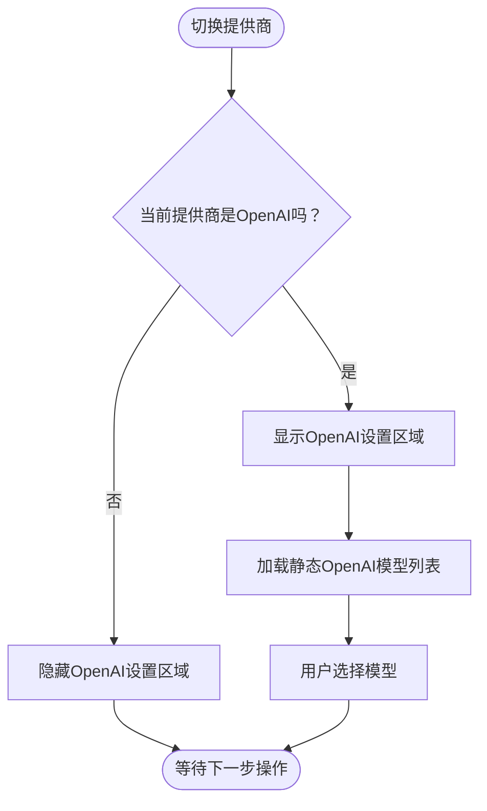
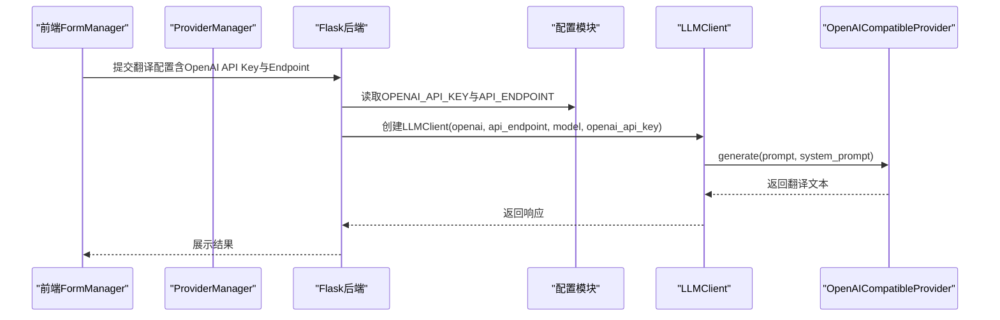
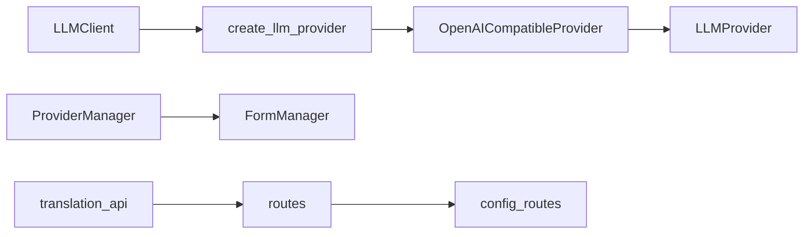

# OpenAI提供商

<cite>
**本文引用的文件**
- [llm_providers.py](file://src/core/llm_providers.py)
- [llm_client.py](file://src/core/llm_client.py)
- [provider-manager.js](file://src/web/static/js/providers/provider-manager.js)
- [translation_interface.html](file://src/web/templates/translation_interface.html)
- [config.py](file://src/config.py)
- [.env.example](file://.env.example)
- [deployment/.env.docker.example](file://deployment/.env.docker.example)
- [translation_api.py](file://translation_api.py)
- [routes.py](file://src/api/routes.py)
- [config_routes.py](file://src/api/blueprints/config_routes.py)
- [form-manager.js](file://src/web/static/js/ui/form-manager.js)
- [env_helper.py](file://src/utils/env_helper.py)
- [context_optimizer.py](file://src/core/context_optimizer.py)
</cite>

## 目录
1. [简介](#简介)
2. [项目结构](#项目结构)
3. [核心组件](#核心组件)
4. [架构总览](#架构总览)
5. [详细组件分析](#详细组件分析)
6. [依赖关系分析](#依赖关系分析)
7. [性能与成本估算](#性能与成本估算)
8. [故障排除指南](#故障排除指南)
9. [结论](#结论)
10. [附录](#附录)

## 简介
本文件是针对OpenAI兼容提供商的权威文档，面向希望在本项目中使用OpenAI标准API或兼容接口的用户。内容涵盖：
- OpenAICompatibleProvider类的实现与行为
- 基于OPENAI_API_KEY的认证机制
- 自定义API_ENDPOINT的配置方式（如https://api.openai.com/v1/chat/completions）
- 请求构造逻辑：将system_prompt转换为messages数组中的system角色
- Web界面provider-manager.js如何为OpenAI提供商提供静态常用模型列表（如gpt-4o、gpt-3.5-turbo）
- 环境变量、Docker部署参数与CLI参数的配置示例
- 成本估算方法与常见问题排查

## 项目结构
围绕OpenAI提供商的关键文件与职责如下：
- 后端核心
  - 提供商抽象与实现：src/core/llm_providers.py
  - 客户端封装：src/core/llm_client.py
  - 配置加载与默认值：src/config.py
  - 接口路由注册：src/api/routes.py
  - 模型列表与配置接口：src/api/blueprints/config_routes.py
- 前端界面
  - 提供商管理器（含OpenAI静态模型列表）：src/web/static/js/providers/provider-manager.js
  - 翻译界面模板（包含OpenAI输入项）：src/web/templates/translation_interface.html
  - 表单校验（API密钥必填等）：src/web/static/js/ui/form-manager.js
- 部署与示例
  - 本地示例环境变量：.env.example
  - Docker示例环境变量：deployment/.env.docker.example
  - Web服务入口：translation_api.py
  - 环境助手（交互式配置）：src/utils/env_helper.py
- 上下文与成本估算
  - 上下文估算工具：src/core/context_optimizer.py

图表来源
- [llm_providers.py](file://src/core/llm_providers.py#L281-L361)
- [llm_client.py](file://src/core/llm_client.py#L1-L123)
- [provider-manager.js](file://src/web/static/js/providers/provider-manager.js#L1-L331)
- [translation_interface.html](file://src/web/templates/translation_interface.html#L37-L57)
- [config.py](file://src/config.py#L56-L110)
- [.env.example](file://.env.example#L1-L45)
- [deployment/.env.docker.example](file://deployment/.env.docker.example#L1-L84)
- [translation_api.py](file://translation_api.py#L1-L146)
- [routes.py](file://src/api/routes.py#L1-L66)
- [config_routes.py](file://src/api/blueprints/config_routes.py#L113-L135)
- [form-manager.js](file://src/web/static/js/ui/form-manager.js#L354-L388)
- [env_helper.py](file://src/utils/env_helper.py#L54-L154)

章节来源
- [llm_providers.py](file://src/core/llm_providers.py#L281-L361)
- [llm_client.py](file://src/core/llm_client.py#L1-L123)
- [provider-manager.js](file://src/web/static/js/providers/provider-manager.js#L1-L331)
- [translation_interface.html](file://src/web/templates/translation_interface.html#L37-L57)
- [config.py](file://src/config.py#L56-L110)
- [.env.example](file://.env.example#L1-L45)
- [deployment/.env.docker.example](file://deployment/.env.docker.example#L1-L84)
- [translation_api.py](file://translation_api.py#L1-L146)
- [routes.py](file://src/api/routes.py#L1-L66)
- [config_routes.py](file://src/api/blueprints/config_routes.py#L113-L135)
- [form-manager.js](file://src/web/static/js/ui/form-manager.js#L354-L388)
- [env_helper.py](file://src/utils/env_helper.py#L54-L154)

## 核心组件
- OpenAICompatibleProvider
  - 支持标准OpenAI API与兼容接口
  - 使用Authorization头携带OPENAI_API_KEY
  - 将system_prompt放入messages数组的system角色，再追加用户消息
  - 固定stream=false，返回choices[0].message.content
- LLMClient
  - 统一的请求入口，负责创建与复用提供商实例
  - 支持按需覆盖model与timeout
- ProviderManager（前端）
  - 为OpenAI提供静态常用模型列表（如gpt-4o、gpt-3.5-turbo）
  - 切换提供商时动态显示/隐藏对应设置区域
- 配置系统
  - 通过环境变量控制API_ENDPOINT、OPENAI_API_KEY、LLM_PROVIDER等
  - 提供.docker示例与交互式.env助手

章节来源
- [llm_providers.py](file://src/core/llm_providers.py#L281-L361)
- [llm_client.py](file://src/core/llm_client.py#L1-L123)
- [provider-manager.js](file://src/web/static/js/providers/provider-manager.js#L1-L331)
- [config.py](file://src/config.py#L56-L110)
- [.env.example](file://.env.example#L1-L45)
- [deployment/.env.docker.example](file://deployment/.env.docker.example#L1-L84)

## 架构总览
OpenAI提供商在系统中的调用链路如下：

图表来源
- [provider-manager.js](file://src/web/static/js/providers/provider-manager.js#L1-L331)
- [form-manager.js](file://src/web/static/js/ui/form-manager.js#L304-L388)
- [config.py](file://src/config.py#L56-L110)
- [llm_client.py](file://src/core/llm_client.py#L1-L123)
- [llm_providers.py](file://src/core/llm_providers.py#L281-L361)
- [translation_interface.html](file://src/web/templates/translation_interface.html#L37-L57)

## 详细组件分析

### OpenAICompatibleProvider实现
- 认证方式
  - 若提供api_key，则在请求头添加Authorization: Bearer {api_key}
- 请求构造
  - 将system_prompt作为messages数组的第一个元素，角色为system
  - 追加一条用户消息，内容为prompt
  - 固定stream=false
- 响应解析
  - 解析choices[0].message.content作为最终文本
- 错误处理
  - 超时、HTTP状态错误、JSON解析失败均会重试，最多尝试MAX_TRANSLATION_ATTEMPTS次，间隔RETRY_DELAY_SECONDS秒
- 资源管理
  - 复用httpx.AsyncClient，保持连接池与超时设置

图表来源
- [llm_providers.py](file://src/core/llm_providers.py#L23-L137)
- [llm_providers.py](file://src/core/llm_providers.py#L281-L361)

章节来源
- [llm_providers.py](file://src/core/llm_providers.py#L281-L361)

### LLMClient与工厂函数
- LLMClient
  - 统一入口，按需创建提供商实例
  - 支持覆盖model与timeout
- 工厂函数create_llm_client
  - 当llm_provider为openai时，传入api_endpoint与openai_api_key以启用OpenAI提供商

章节来源
- [llm_client.py](file://src/core/llm_client.py#L1-L123)

### Web界面：ProviderManager与静态模型列表
- ProviderManager
  - 切换提供商时显示/隐藏对应设置区域
  - 加载OpenAI模型时使用静态列表（OPENAI_MODELS）
- OPENAI_MODELS
  - 包含常用模型项（如gpt-4o、gpt-3.5-turbo），用于前端展示与选择
- 翻译界面模板
  - 提供OpenAI API Endpoint与OpenAI API Key输入框

图表来源
- [provider-manager.js](file://src/web/static/js/providers/provider-manager.js#L1-L331)
- [translation_interface.html](file://src/web/templates/translation_interface.html#L37-L57)

章节来源
- [provider-manager.js](file://src/web/static/js/providers/provider-manager.js#L1-L331)
- [translation_interface.html](file://src/web/templates/translation_interface.html#L37-L57)

### 配置与部署要点
- 环境变量
  - OPENAI_API_KEY：OpenAI提供商必需
  - API_ENDPOINT：OpenAI兼容服务端点（如https://api.openai.com/v1/chat/completions）
  - LLM_PROVIDER=openai：启用OpenAI提供商
- 本地示例
  - .env.example提供默认键名与注释
- Docker示例
  - deployment/.env.docker.example提供容器内配置模板
- 交互式配置
  - src/utils/env_helper.py可引导用户填写OPENAI_API_KEY、API_ENDPOINT与DEFAULT_MODEL

章节来源
- [.env.example](file://.env.example#L1-L45)
- [deployment/.env.docker.example](file://deployment/.env.docker.example#L1-L84)
- [env_helper.py](file://src/utils/env_helper.py#L54-L154)
- [config.py](file://src/config.py#L56-L110)

### 请求流程与数据流
- 前端
  - FormManager收集配置，校验OpenAI API Key必填
  - ProviderManager加载OpenAI静态模型列表
- 后端
  - translation_api.py启动Flask服务，注册路由
  - routes.py注册蓝图，config_routes.py提供模型与配置接口
  - LLMClient调用OpenAICompatibleProvider执行请求

图表来源
- [form-manager.js](file://src/web/static/js/ui/form-manager.js#L304-L388)
- [provider-manager.js](file://src/web/static/js/providers/provider-manager.js#L1-L331)
- [translation_api.py](file://translation_api.py#L1-L146)
- [routes.py](file://src/api/routes.py#L1-L66)
- [config_routes.py](file://src/api/blueprints/config_routes.py#L113-L135)
- [llm_client.py](file://src/core/llm_client.py#L1-L123)
- [llm_providers.py](file://src/core/llm_providers.py#L281-L361)

## 依赖关系分析
- 组件耦合
  - LLMClient依赖create_llm_provider工厂函数创建具体提供商
  - OpenAICompatibleProvider继承LLMProvider，共享提取翻译文本等通用能力
  - 前端ProviderManager与FormManager分别负责模型列表与表单校验
- 外部依赖
  - httpx用于异步HTTP请求
  - Flask/Sockets用于Web服务与WebSocket
- 可能的循环依赖
  - 未发现直接循环导入；模块间通过函数与类解耦

图表来源
- [llm_client.py](file://src/core/llm_client.py#L1-L123)
- [llm_providers.py](file://src/core/llm_providers.py#L515-L548)
- [provider-manager.js](file://src/web/static/js/providers/provider-manager.js#L1-L331)
- [form-manager.js](file://src/web/static/js/ui/form-manager.js#L304-L388)
- [translation_api.py](file://translation_api.py#L1-L146)
- [routes.py](file://src/api/routes.py#L1-L66)
- [config_routes.py](file://src/api/blueprints/config_routes.py#L113-L135)

章节来源
- [llm_client.py](file://src/core/llm_client.py#L1-L123)
- [llm_providers.py](file://src/core/llm_providers.py#L515-L548)
- [provider-manager.js](file://src/web/static/js/providers/provider-manager.js#L1-L331)
- [form-manager.js](file://src/web/static/js/ui/form-manager.js#L304-L388)
- [translation_api.py](file://translation_api.py#L1-L146)
- [routes.py](file://src/api/routes.py#L1-L66)
- [config_routes.py](file://src/api/blueprints/config_routes.py#L113-L135)

## 性能与成本估算
- 上下文与分块策略
  - 项目内置上下文估算与最优分块计算工具，可参考以下路径了解估算方法与公式：
    - [context_optimizer.py](file://src/core/context_optimizer.py#L101-L320)
- 成本估算步骤（适用于OpenAI兼容服务）
  - 步骤1：确定模型单价
    - 通常以每1K tokens计价（输入与输出各计价）
  - 步骤2：估算总tokens
    - 使用字符数除以语言平均字符到token比率，乘以安全余量
    - 参考估算方法：[context_optimizer.py](file://src/core/context_optimizer.py#L101-L115)
  - 步骤3：计算总费用
    - 总费用 ≈ (输入tokens + 输出tokens) × 单价
  - 步骤4：书籍规模估算
    - 以平均每页约300字、全书约300页为例，估算字符数与tokens，再按单价折算
- 实践建议
  - 使用较小的chunk_size与合适的上下文窗口，避免超出模型上下文
  - 结合AUTO_ADJUST_CONTEXT与MIN/MAX_CHUNK_SIZE自动优化

章节来源
- [context_optimizer.py](file://src/core/context_optimizer.py#L101-L320)

## 故障排除指南
- API密钥无效
  - 症状：HTTP 401/403或服务端返回错误
  - 排查：
    - 确认OPENAI_API_KEY已正确设置
    - 在Web界面中检查OpenAI API Key输入框是否为空
    - 参考前端表单校验逻辑：[form-manager.js](file://src/web/static/js/ui/form-manager.js#L354-L388)
- 网络连接超时
  - 症状：超时异常，重试多次后失败
  - 排查：
    - 检查API_ENDPOINT可达性
    - 调整REQUEST_TIMEOUT与RETRY_DELAY_SECONDS
    - 参考OpenAICompatibleProvider的重试逻辑：[llm_providers.py](file://src/core/llm_providers.py#L319-L360)
- 速率限制
  - 症状：频繁收到429或服务端限流
  - 排查：
    - 降低并发与请求频率
    - 增大RETRY_DELAY_SECONDS
    - 使用更经济的模型或减少上下文长度
- 模型不可用或无可用模型
  - 症状：OpenAI模型列表为空或无法加载
  - 排查：
    - 确认API Key有效且有配额
    - 前端ProviderManager会加载静态OpenAI模型列表，若仍为空，检查网络与密钥
    - 参考：[provider-manager.js](file://src/web/static/js/providers/provider-manager.js#L290-L303)
- 配置错误
  - 症状：启动时报错或功能异常
  - 排查：
    - 使用.env.example或deployment/.env.docker.example对照修正
    - 使用环境助手交互式配置：[env_helper.py](file://src/utils/env_helper.py#L54-L154)
    - Web服务启动前的配置校验：[translation_api.py](file://translation_api.py#L50-L75)

章节来源
- [form-manager.js](file://src/web/static/js/ui/form-manager.js#L354-L388)
- [llm_providers.py](file://src/core/llm_providers.py#L319-L360)
- [provider-manager.js](file://src/web/static/js/providers/provider-manager.js#L290-L303)
- [env_helper.py](file://src/utils/env_helper.py#L54-L154)
- [translation_api.py](file://translation_api.py#L50-L75)

## 结论
- OpenAICompatibleProvider提供了对标准OpenAI API与兼容接口的统一支持，具备完善的认证、请求构造与错误重试机制
- Web界面通过ProviderManager提供OpenAI静态模型列表，配合表单校验确保API Key与Endpoint正确
- 通过环境变量与Docker示例，用户可以快速完成OpenAI提供商的本地与容器化部署
- 成本估算与上下文优化工具帮助用户在保证质量的同时控制开销

## 附录

### 配置示例（环境变量）
- 本地开发
  - 参考：[.env.example](file://.env.example#L1-L45)
- Docker部署
  - 参考：[deployment/.env.docker.example](file://deployment/.env.docker.example#L1-L84)

### CLI命令行参数（参考）
- 通过create_llm_client工厂函数可知，可传入llm_provider、api_endpoint、model_name与openai_api_key等参数
  - 参考：[llm_client.py](file://src/core/llm_client.py#L100-L123)

### Web界面输入项
- OpenAI API Endpoint与OpenAI API Key
  - 参考：[translation_interface.html](file://src/web/templates/translation_interface.html#L37-L57)