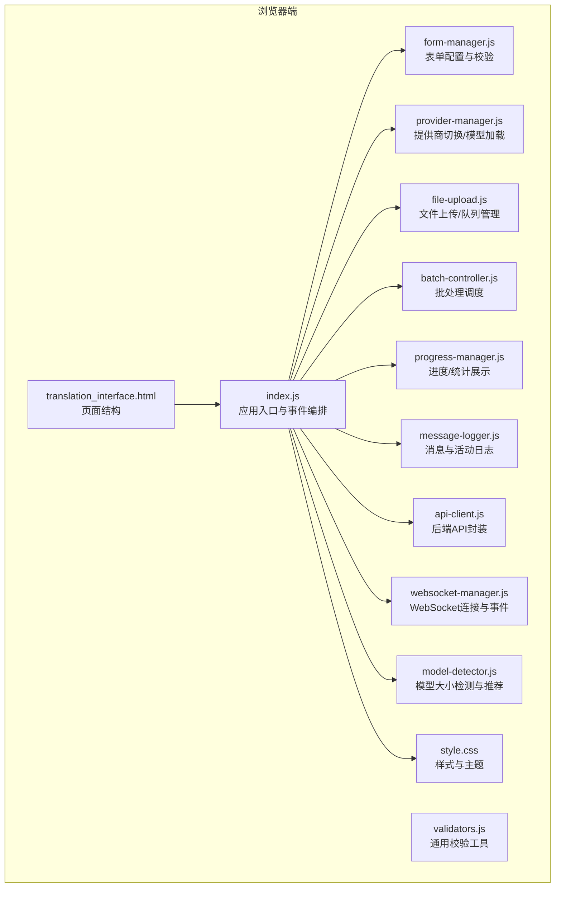
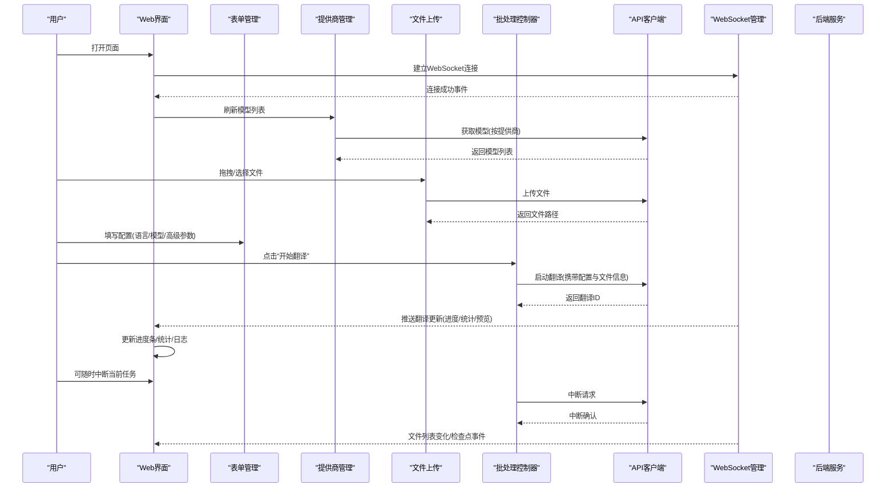
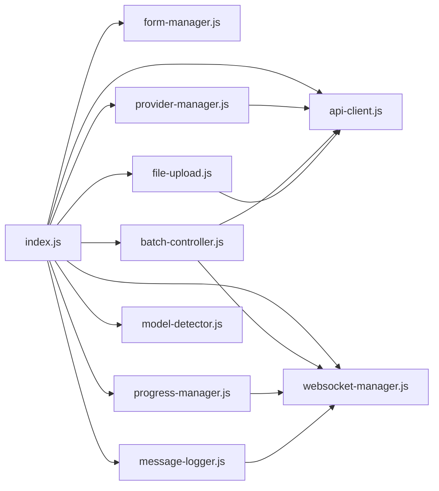

# Web界面使用

<cite>
**本文引用的文件**
- [translation_interface.html](file://src/web/templates/translation_interface.html)
- [index.js](file://src/web/static/js/index.js)
- [form-manager.js](file://src/web/static/js/ui/form-manager.js)
- [provider-manager.js](file://src/web/static/js/providers/provider-manager.js)
- [file-upload.js](file://src/web/static/js/files/file-upload.js)
- [batch-controller.js](file://src/web/static/js/translation/batch-controller.js)
- [progress-manager.js](file://src/web/static/js/translation/progress-manager.js)
- [message-logger.js](file://src/web/static/js/ui/message-logger.js)
- [validators.js](file://src/web/static/js/utils/validators.js)
- [api-client.js](file://src/web/static/js/core/api-client.js)
- [websocket-manager.js](file://src/web/static/js/core/websocket-manager.js)
- [model-detector.js](file://src/web/static/js/providers/model-detector.js)
- [style.css](file://src/web/static/style.css)
</cite>

## 目录
1. [简介](#简介)
2. [项目结构](#项目结构)
3. [核心组件](#核心组件)
4. [架构总览](#架构总览)
5. [详细组件解析](#详细组件解析)
6. [依赖关系分析](#依赖关系分析)
7. [性能与可用性建议](#性能与可用性建议)
8. [故障排查指南](#故障排查指南)
9. [结论](#结论)
10. [附录：界面操作步骤与截图建议](#附录界面操作步骤与截图建议)

## 简介
本文件面向最终用户，帮助您通过浏览器高效地使用 TranslateBookWithLLM 的 Web 界面完成书籍/字幕/文本的批量翻译。内容涵盖界面布局、各区域功能说明、配置项含义与设置方法、完整工作流、前端校验逻辑（尤其是 Gemini/OpenAI API 密钥必填）、以及监控进度与日志的方法。文末提供截图建议与交互提示，便于快速上手。

## 项目结构
Web 界面由一个 HTML 模板与一组模块化 JavaScript 组成：
- 模板层：定义页面结构与 UI 区域
- 核心模块：状态管理、API 客户端、WebSocket 管理
- UI 模块：表单管理、消息日志、DOM 辅助
- 功能模块：文件上传/管理、提供商切换与模型加载、批处理控制、进度展示、模型大小检测
- 样式层：统一视觉风格与响应式布局

图表来源
- [translation_interface.html](file://src/web/templates/translation_interface.html#L1-L291)
- [index.js](file://src/web/static/js/index.js#L1-L329)
- [form-manager.js](file://src/web/static/js/ui/form-manager.js#L1-L389)
- [provider-manager.js](file://src/web/static/js/providers/provider-manager.js#L1-L331)
- [file-upload.js](file://src/web/static/js/files/file-upload.js#L1-L258)
- [batch-controller.js](file://src/web/static/js/translation/batch-controller.js#L1-L303)
- [progress-manager.js](file://src/web/static/js/translation/progress-manager.js#L1-L130)
- [message-logger.js](file://src/web/static/js/ui/message-logger.js#L1-L146)
- [validators.js](file://src/web/static/js/utils/validators.js#L1-L164)
- [api-client.js](file://src/web/static/js/core/api-client.js#L1-L307)
- [websocket-manager.js](file://src/web/static/js/core/websocket-manager.js#L1-L143)
- [model-detector.js](file://src/web/static/js/providers/model-detector.js#L1-L129)
- [style.css](file://src/web/static/style.css#L1-L200)

章节来源
- [translation_interface.html](file://src/web/templates/translation_interface.html#L1-L291)
- [index.js](file://src/web/static/js/index.js#L1-L329)

## 核心组件
- 页面容器与卡片布局：标题、主卡片、文件上传区、配置表单、进度与日志、文件管理、暂停任务等区域
- 表单管理：LLM 提供商切换、模型列表加载、语言选择（含自定义）、输出文件名模式、高级设置、Fast Mode
- 文件上传：拖拽/点击选择、多文件入队、生成输出文件名、上传到服务端并记录路径
- 批处理控制器：校验配置、启动批次、逐个提交翻译任务、中断当前任务、推进下一个文件
- 进度管理：进度条、统计卡片（分块总数/完成/失败/耗时）、EPUB 时不显示分块统计
- 消息与日志：用户提示消息、活动日志滚动、翻译预览（清理占位符）
- 提供商管理：Ollama（本地）、Gemini（云端）、OpenAI（云端）三类；按提供商动态显示/隐藏对应设置并加载模型
- 模型大小检测：根据模型名称推断参数规模，对 ≤12B 的模型在 EPUB 翻译时给出启用 Fast Mode 的建议
- WebSocket：连接建立、翻译更新推送、文件列表变化、检查点事件
- API 客户端：统一封装健康检查、配置获取、翻译启动/状态查询/中断、文件上传/下载/删除/打包下载、模型列表、暂停任务等

章节来源
- [translation_interface.html](file://src/web/templates/translation_interface.html#L1-L291)
- [form-manager.js](file://src/web/static/js/ui/form-manager.js#L1-L389)
- [provider-manager.js](file://src/web/static/js/providers/provider-manager.js#L1-L331)
- [file-upload.js](file://src/web/static/js/files/file-upload.js#L1-L258)
- [batch-controller.js](file://src/web/static/js/translation/batch-controller.js#L1-L303)
- [progress-manager.js](file://src/web/static/js/translation/progress-manager.js#L1-L130)
- [message-logger.js](file://src/web/static/js/ui/message-logger.js#L1-L146)
- [validators.js](file://src/web/static/js/utils/validators.js#L1-L164)
- [api-client.js](file://src/web/static/js/core/api-client.js#L1-L307)
- [websocket-manager.js](file://src/web/static/js/core/websocket-manager.js#L1-L143)
- [model-detector.js](file://src/web/static/js/providers/model-detector.js#L1-L129)

## 架构总览
浏览器端通过 WebSocket 与后端保持长连接，实时接收翻译进度与状态；同时通过 API 客户端调用后端接口完成文件上传、翻译启动、中断、文件管理与模型列表获取等操作。应用入口负责初始化各模块、绑定事件、暴露全局函数给 HTML 的 onclick 使用，并在 WebSocket 连接建立后触发模型刷新、任务恢复与文件列表刷新。

图表来源
- [index.js](file://src/web/static/js/index.js#L120-L207)
- [provider-manager.js](file://src/web/static/js/providers/provider-manager.js#L126-L139)
- [file-upload.js](file://src/web/static/js/files/file-upload.js#L132-L173)
- [batch-controller.js](file://src/web/static/js/translation/batch-controller.js#L105-L165)
- [api-client.js](file://src/web/static/js/core/api-client.js#L98-L136)
- [websocket-manager.js](file://src/web/static/js/core/websocket-manager.js#L23-L54)

## 详细组件解析

### 界面布局与区域说明
- 头部区域：品牌标识
- 主卡片“翻译配置”：包含提供商选择、API 端点/密钥、模型选择、源/目标语言、输出文件名模式、Fast Mode、高级设置
- 文件上传区：支持拖拽与点击选择，多文件入队，显示已选文件列表
- 进度与日志：进度条、统计卡片、最后翻译预览、活动日志
- 暂停任务与文件管理：列出可恢复的任务、刷新列表、批量下载/删除、全选

章节来源
- [translation_interface.html](file://src/web/templates/translation_interface.html#L16-L291)
- [style.css](file://src/web/static/style.css#L1-L200)

### 配置表单详解
- LLM 提供商切换
  - Ollama（本地）：需配置本地 API 端点
  - Gemini（云端）：需填写 API Key
  - OpenAI（云端）：需填写 API Key 与可选端点
- 模型选择
  - 根据提供商动态加载模型列表；Ollama 显示字符串模型名；Gemini 展示模型详情；OpenAI 显示常用模型
- 源语言/目标语言
  - 支持内置语言，也可选择“Other”并手动输入自定义语言
- 输出文件名模式
  - 默认值包含占位符 {originalName} 与 {ext}，可按示例调整
- Fast Mode（EPUB 专用）
  - 移除格式，提高可靠性；对 ≤12B 模型自动给出推荐
- 高级设置
  - 分块大小、请求超时、上下文窗口、每块最大重试次数、重试间隔

章节来源
- [translation_interface.html](file://src/web/templates/translation_interface.html#L21-L142)
- [form-manager.js](file://src/web/static/js/ui/form-manager.js#L171-L216)
- [provider-manager.js](file://src/web/static/js/providers/provider-manager.js#L73-L124)
- [model-detector.js](file://src/web/static/js/providers/model-detector.js#L45-L88)

### 前端校验逻辑（重点：Gemini/OpenAI API 密钥必填）
- 表单校验（FormManager.validateConfig）
  - 源语言/目标语言非空
  - 选择模型
  - API 端点非空
  - 当提供商为 Gemini/OpenAI 时，对应的 API Key 必须填写
- 批次启动前校验（BatchController.startBatchTranslation）
  - 自定义语言需填写
  - 选择模型
  - Ollama 端点非空
  - 启动翻译前再次校验提供商 API Key
- 通用校验工具（Validators）
  - 语言不同、模型必填、端点 URL 格式、提供商密钥必填、数值范围、文件至少一个

章节来源
- [form-manager.js](file://src/web/static/js/ui/form-manager.js#L354-L389)
- [batch-controller.js](file://src/web/static/js/translation/batch-controller.js#L105-L165)
- [validators.js](file://src/web/static/js/utils/validators.js#L1-L164)

### 文件上传与队列管理
- 支持拖拽与点击选择，多文件依次入队
- 自动生成输出文件名（基于模式）
- 上传成功后记录文件类型、路径、大小、状态（Queued）
- UI 展示已选文件列表，启用“开始翻译”按钮

章节来源
- [translation_interface.html](file://src/web/templates/translation_interface.html#L144-L158)
- [file-upload.js](file://src/web/static/js/files/file-upload.js#L1-L258)

### 批处理与翻译流程
- 开始翻译：校验配置，标记批次活跃，显示中断按钮，逐个提交翻译任务
- 提交翻译：构造配置（含文件类型/路径或文本内容、输出文件名、Fast Mode 等），调用 API 启动翻译
- 中断当前任务：向后端发送中断请求，更新按钮状态与消息
- 下一个文件：收到完成/错误事件后继续队列

章节来源
- [batch-controller.js](file://src/web/static/js/translation/batch-controller.js#L105-L303)

### 实时进度与日志
- 进度条：百分比更新
- 统计卡片：分块总数/完成/失败/耗时；EPUB 不显示分块统计
- 最后翻译预览：从服务器推送的翻译片段中提取并清理占位符，展示可读文本
- 活动日志：自动滚动，过滤部分技术细节，支持清空

章节来源
- [progress-manager.js](file://src/web/static/js/translation/progress-manager.js#L1-L130)
- [message-logger.js](file://src/web/static/js/ui/message-logger.js#L1-L146)
- [translation_interface.html](file://src/web/templates/translation_interface.html#L165-L191)

### WebSocket 与后端集成
- 连接建立：首次连接后触发模型刷新、任务恢复、文件列表刷新
- 事件路由：翻译更新、文件列表变化、检查点创建
- 断开处理：记录日志并停止推送

章节来源
- [index.js](file://src/web/static/js/index.js#L120-L145)
- [websocket-manager.js](file://src/web/static/js/core/websocket-manager.js#L1-L143)

### 模型大小检测与推荐
- 从模型名称中提取参数规模（如 qwen3:14b、llama-12b）
- 对 ≤12B 的模型在 EPUB 翻译时建议启用 Fast Mode
- 与 Fast Mode 复选框联动，动态显示/隐藏推荐提示

章节来源
- [model-detector.js](file://src/web/static/js/providers/model-detector.js#L1-L129)
- [translation_interface.html](file://src/web/templates/translation_interface.html#L95-L112)

## 依赖关系分析
- 应用入口 index.js 负责初始化所有模块并建立跨模块事件桥接
- ProviderManager 依赖 ApiClient 获取模型列表，并与 FormManager/ModelDetector 协作
- BatchController 依赖 ApiClient 启动翻译、依赖 WebSocketManager 订阅翻译更新
- FileUpload 依赖 ApiClient 上传文件并维护状态
- ProgressManager 与 MessageLogger 依赖 DOM 辅助工具更新 UI
- WebSocketManager 作为事件中枢，驱动多个模块的状态同步

图表来源
- [index.js](file://src/web/static/js/index.js#L1-L207)
- [provider-manager.js](file://src/web/static/js/providers/provider-manager.js#L1-L124)
- [batch-controller.js](file://src/web/static/js/translation/batch-controller.js#L1-L165)
- [file-upload.js](file://src/web/static/js/files/file-upload.js#L1-L173)
- [progress-manager.js](file://src/web/static/js/translation/progress-manager.js#L1-L90)
- [message-logger.js](file://src/web/static/js/ui/message-logger.js#L1-L90)
- [api-client.js](file://src/web/static/js/core/api-client.js#L1-L120)
- [websocket-manager.js](file://src/web/static/js/core/websocket-manager.js#L1-L70)

## 性能与可用性建议
- 适当增大“分块大小”可减少请求次数，但会增加单次失败风险；根据网络与模型能力权衡
- “请求超时”应留有余量，避免弱网环境下频繁中断
- “上下文窗口”过大可能引发成本与延迟上升，建议按模型规格合理设置
- “每块最大重试次数”与“重试间隔”应与网络稳定性匹配，避免过度重试导致资源浪费
- Fast Mode 在小模型与复杂 EPUB 文档中通常更稳定，建议优先启用

[本节为通用建议，不直接分析具体文件]

## 故障排查指南
- WebSocket 连接失败
  - 检查后端服务是否运行、网络连通性
  - 观察活动日志中“WebSocket 连接已建立/丢失”的提示
- Ollama 模型加载失败
  - 确认本地 Ollama 已启动且端点可达
  - 界面会自动重试，若长时间无模型，检查端点配置
- Gemini/OpenAI API 密钥缺失
  - 表单校验会阻止提交；请在对应提供商设置区域填写密钥
- 翻译启动后无进度
  - 确认已正确选择模型与文件类型
  - 查看活动日志定位错误原因
- 中断无效
  - 确认当前存在活跃翻译任务，按钮状态与消息提示应同步更新

章节来源
- [websocket-manager.js](file://src/web/static/js/core/websocket-manager.js#L23-L54)
- [provider-manager.js](file://src/web/static/js/providers/provider-manager.js#L141-L219)
- [form-manager.js](file://src/web/static/js/ui/form-manager.js#L354-L389)
- [batch-controller.js](file://src/web/static/js/translation/batch-controller.js#L218-L243)
- [message-logger.js](file://src/web/static/js/ui/message-logger.js#L1-L90)

## 结论
该 Web 界面提供了从文件上传、配置校验、批处理翻译到实时进度与日志的完整闭环体验。通过提供商切换、模型加载、Fast Mode 与高级参数，用户可在不同场景下灵活选择最优策略。前端严格的校验与清晰的日志反馈有助于快速定位问题并提升成功率。

[本节为总结，不直接分析具体文件]

## 附录：界面操作步骤与截图建议

### 一、界面布局与区域说明（截图建议）
- 页面顶部品牌标识
- “翻译配置”主卡片：提供商、模型、语言、输出文件名、Fast Mode、高级设置
- 文件上传区：拖拽/点击选择、已选文件列表
- 进度与日志：进度条、统计卡片、最后翻译预览、活动日志
- 暂停任务与文件管理：可恢复任务列表、刷新、批量下载/删除、全选

章节来源
- [translation_interface.html](file://src/web/templates/translation_interface.html#L16-L291)
- [style.css](file://src/web/static/style.css#L1-L200)

### 二、完整工作流（步骤与截图建议）
- 步骤1：打开页面，等待 WebSocket 连接与模型加载
  - 截图：连接成功日志、模型加载成功提示
- 步骤2：拖拽或选择文件
  - 截图：文件列表显示、输出文件名生成
- 步骤3：填写配置
  - 截图：提供商切换、模型列表、语言选择、输出文件名模式、Fast Mode、高级设置
- 步骤4：点击“开始翻译”
  - 截图：按钮禁用、中断按钮出现、活动日志提示批次开始
- 步骤5：监控实时进度
  - 截图：进度条、统计卡片、最后翻译预览
- 步骤6：查看活动日志
  - 截图：日志滚动、错误/警告信息
- 步骤7：下载完成文件
  - 截图：文件管理卡片、批量下载按钮

章节来源
- [index.js](file://src/web/static/js/index.js#L120-L207)
- [file-upload.js](file://src/web/static/js/files/file-upload.js#L132-L173)
- [batch-controller.js](file://src/web/static/js/translation/batch-controller.js#L105-L165)
- [progress-manager.js](file://src/web/static/js/translation/progress-manager.js#L1-L130)
- [message-logger.js](file://src/web/static/js/ui/message-logger.js#L1-L146)
- [translation_interface.html](file://src/web/templates/translation_interface.html#L144-L191)

### 三、配置项含义与设置方法（截图建议）
- LLM 提供商
  - 截图：提供商下拉菜单、对应设置区域显隐
- 模型
  - 截图：模型列表加载、选择模型
- 源/目标语言
  - 截图：内置语言与“Other”自定义输入
- 输出文件名模式
  - 截图：默认模式与示例说明
- Fast Mode
  - 截图：开启后的说明与推荐提示
- 高级设置
  - 截图：分块大小、超时、上下文窗口、重试次数与间隔

章节来源
- [translation_interface.html](file://src/web/templates/translation_interface.html#L21-L142)
- [form-manager.js](file://src/web/static/js/ui/form-manager.js#L171-L216)
- [provider-manager.js](file://src/web/static/js/providers/provider-manager.js#L73-L124)
- [model-detector.js](file://src/web/static/js/providers/model-detector.js#L45-L88)

### 四、前端校验要点（截图建议）
- 表单校验：缺少 API Key 或模型未选时的错误提示
- 批次校验：自定义语言未填写、端点为空、密钥缺失时的提示
- 通用校验：URL 格式错误、数值越界、文件未选择

章节来源
- [form-manager.js](file://src/web/static/js/ui/form-manager.js#L354-L389)
- [batch-controller.js](file://src/web/static/js/translation/batch-controller.js#L105-L165)
- [validators.js](file://src/web/static/js/utils/validators.js#L1-L164)

### 五、交互提示
- 模型加载失败时的自动重试与提示
- 中断按钮的禁用/启用状态与文案变化
- 活动日志的自动滚动与清空按钮
- 文件管理的批量操作与全选复选框

章节来源
- [provider-manager.js](file://src/web/static/js/providers/provider-manager.js#L141-L219)
- [batch-controller.js](file://src/web/static/js/translation/batch-controller.js#L238-L303)
- [message-logger.js](file://src/web/static/js/ui/message-logger.js#L1-L90)
- [translation_interface.html](file://src/web/templates/translation_interface.html#L220-L276)