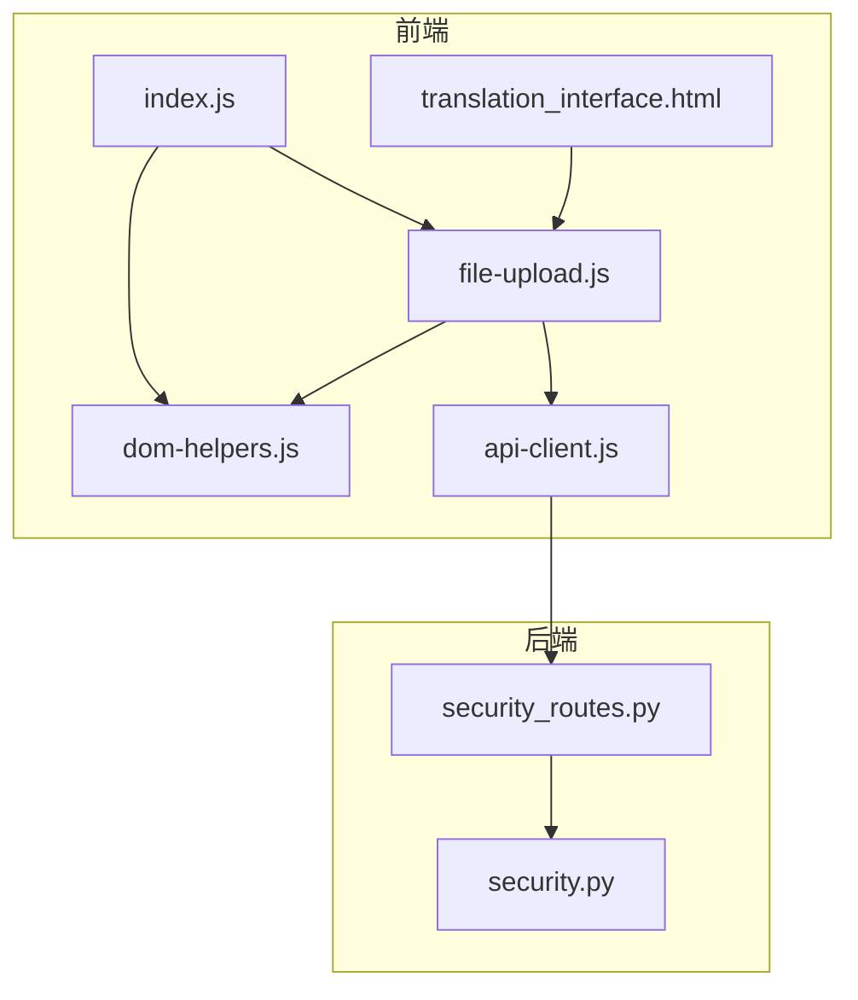
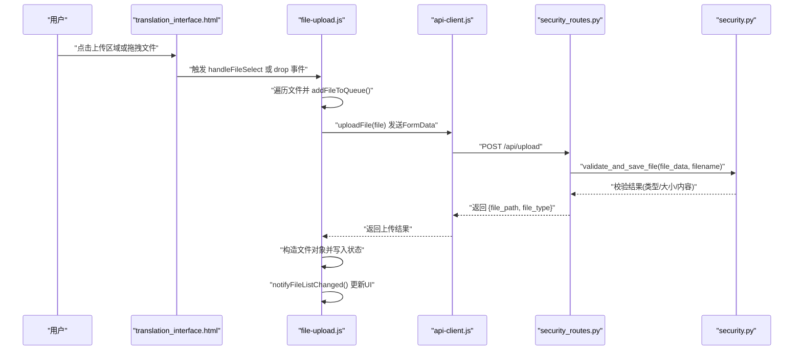
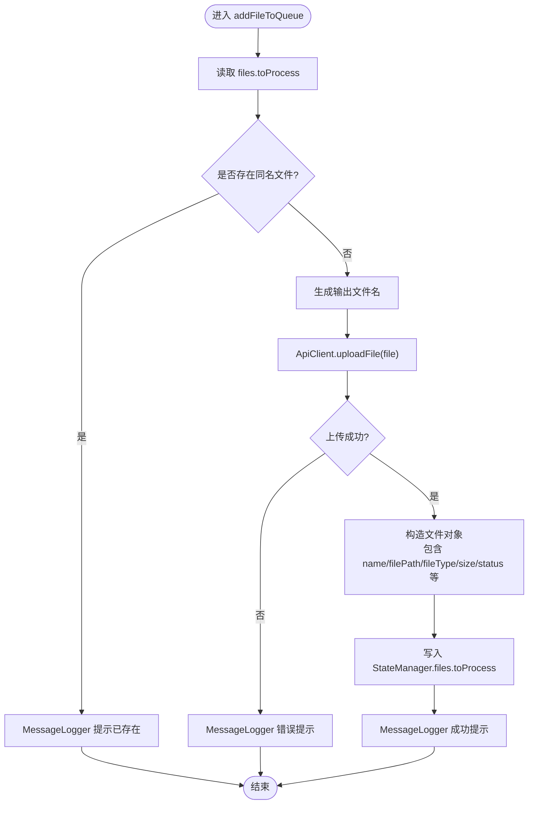
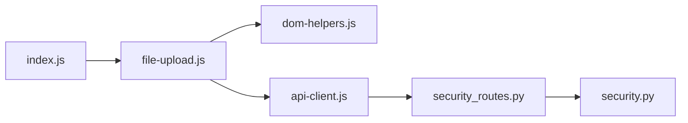

# 文件上传

<cite>
**本文引用的文件**
- [translation_interface.html](file://src/web/templates/translation_interface.html)
- [file-upload.js](file://src/web/static/js/files/file-upload.js)
- [dom-helpers.js](file://src/web/static/js/ui/dom-helpers.js)
- [index.js](file://src/web/static/js/index.js)
- [api-client.js](file://src/web/static/js/core/api-client.js)
- [security.py](file://src/utils/security.py)
- [security_routes.py](file://src/api/blueprints/security_routes.py)
</cite>

## 目录
1. [简介](#简介)
2. [项目结构](#项目结构)
3. [核心组件](#核心组件)
4. [架构总览](#架构总览)
5. [详细组件分析](#详细组件分析)
6. [依赖关系分析](#依赖关系分析)
7. [性能与可用性考虑](#性能与可用性考虑)
8. [故障排查指南](#故障排查指南)
9. [结论](#结论)

## 简介
本文件上传功能文档聚焦于用户通过“拖放”或“点击选择”两种方式上传 TXT、EPUB 和 SRT 格式文件的完整流程。前端通过 file-upload.js 处理文件输入事件，验证文件类型（accept=".txt,.epub,.srt"），将选中的文件加入待处理队列，并在 translation_interface.html 的文件上传容器中动态渲染文件列表。同时，文档说明了拖拽高亮、多文件支持、文件列表动态渲染、错误处理以及 resetFiles 清空当前选择列表的机制。

## 项目结构
文件上传功能涉及前端模板与脚本模块，以及后端安全校验与路由处理：
- 前端模板：translation_interface.html 定义上传区域与文件列表容器
- 前端脚本：
  - file-upload.js：负责拖放、文件选择、类型检测、上传、入队与UI更新
  - dom-helpers.js：封装DOM操作工具
  - index.js：应用入口，初始化模块并暴露 resetFiles 等全局函数
  - api-client.js：封装上传请求与统一错误处理
- 后端：
  - security.py：服务端文件类型与内容安全校验
  - security_routes.py：接收上传请求并调用安全校验

图表来源
- [translation_interface.html](file://src/web/templates/translation_interface.html#L144-L153)
- [file-upload.js](file://src/web/static/js/files/file-upload.js#L41-L116)
- [dom-helpers.js](file://src/web/static/js/ui/dom-helpers.js#L1-L120)
- [index.js](file://src/web/static/js/index.js#L218-L228)
- [api-client.js](file://src/web/static/js/core/api-client.js#L142-L161)
- [security_routes.py](file://src/api/blueprints/security_routes.py#L39-L77)
- [security.py](file://src/utils/security.py#L34-L70)

章节来源
- [translation_interface.html](file://src/web/templates/translation_interface.html#L144-L153)
- [file-upload.js](file://src/web/static/js/files/file-upload.js#L41-L116)
- [index.js](file://src/web/static/js/index.js#L218-L228)
- [api-client.js](file://src/web/static/js/core/api-client.js#L142-L161)
- [security_routes.py](file://src/api/blueprints/security_routes.py#L39-L77)
- [security.py](file://src/utils/security.py#L34-L70)

## 核心组件
- 文件上传容器与输入控件
  - 容器：id="fileUpload"，作为拖放区域与点击触发器
  - 输入：id="fileInput"，accept=".txt,.epub,.srt"，multiple 支持多文件
- 文件上传模块（FileUpload）
  - 初始化：setupDragDrop、setupFileInput
  - 拖放：dragover/dragleave/drop 高亮与文件提取
  - 选择：handleFileSelect 触发文件处理
  - 入队：addFileToQueue 将文件上传并写入状态管理
  - UI：updateFileDisplay 动态渲染文件列表
  - 通知：notifyFileListChanged 触发UI更新与事件派发
  - 清空：clearAll 重置待处理队列
- DOM助手（DomHelpers）
  - 提供 getElement、addClass、removeClass、setValue、hide/show 等常用DOM操作
- 应用入口（index.js）
  - 暴露 resetFiles，清空文件列表并隐藏容器
- API客户端（api-client.js）
  - uploadFile 使用 FormData 调用 /api/upload 并返回 file_path 与 file_type
  - 统一错误处理与响应解析

章节来源
- [translation_interface.html](file://src/web/templates/translation_interface.html#L144-L153)
- [file-upload.js](file://src/web/static/js/files/file-upload.js#L41-L258)
- [dom-helpers.js](file://src/web/static/js/ui/dom-helpers.js#L1-L262)
- [index.js](file://src/web/static/js/index.js#L218-L228)
- [api-client.js](file://src/web/static/js/core/api-client.js#L142-L161)

## 架构总览
下图展示从用户交互到后端安全校验的整体流程：

图表来源
- [translation_interface.html](file://src/web/templates/translation_interface.html#L144-L153)
- [file-upload.js](file://src/web/static/js/files/file-upload.js#L96-L173)
- [api-client.js](file://src/web/static/js/core/api-client.js#L142-L161)
- [security_routes.py](file://src/api/blueprints/security_routes.py#L39-L77)
- [security.py](file://src/utils/security.py#L34-L70)

## 详细组件分析

### 文件上传区域与交互行为
- 拖放高亮
  - dragover 添加高亮类，dragleave 移除高亮类
  - drop 事件阻止默认行为，移除高亮类，读取 e.dataTransfer.files 并交由 handleFiles 处理
- 多文件支持
  - HTML input 设置 multiple，允许一次选择多个文件
  - JS 遍历数组逐个 addFileToQueue
- 文件列表动态渲染
  - updateFileDisplay 读取状态 files.toProcess，为每个文件创建列表项，包含图标、名称、大小与状态
  - 当存在文件时显示文件信息容器；否则隐藏
  - 根据是否处于批量翻译中控制开始按钮禁用状态

章节来源
- [translation_interface.html](file://src/web/templates/translation_interface.html#L144-L153)
- [file-upload.js](file://src/web/static/js/files/file-upload.js#L53-L116)
- [file-upload.js](file://src/web/static/js/files/file-upload.js#L175-L225)

### 文件类型检测与输出命名
- 类型检测
  - detectFileType 基于扩展名判断 txt/epub/srt
- 输出命名
  - generateOutputFilename 基于输出模式生成目标文件名，使用原始文件名与扩展名占位符

章节来源
- [file-upload.js](file://src/web/static/js/files/file-upload.js#L19-L39)
- [file-upload.js](file://src/web/static/js/files/file-upload.js#L19-L39)

### 文件入队与上传流程
- addFileToQueue
  - 去重检查：若同名文件已在队列则提示信息并跳过
  - 生成输出文件名
  - 调用 ApiClient.uploadFile(file) 获取 file_path 与 file_type
  - 构造文件对象并写入 StateManager 的 files.toProcess
  - 成功/失败消息通过 MessageLogger 输出
- handleFiles
  - 顺序遍历文件，逐个 addFileToQueue
  - 完成后调用 notifyFileListChanged 触发 UI 更新

图表来源
- [file-upload.js](file://src/web/static/js/files/file-upload.js#L122-L173)

章节来源
- [file-upload.js](file://src/web/static/js/files/file-upload.js#L122-L173)

### 错误处理场景
- 前端错误
  - 上传失败：捕获异常并通过 MessageLogger 输出错误信息
  - 重复文件：提示信息并跳过
- 后端错误
  - 安全校验失败：返回错误信息（如无效类型、过大、空文件、SRT格式不符等）
  - 客户端统一错误处理：apiRequest 对非2xx响应抛出错误，由调用方捕获

章节来源
- [file-upload.js](file://src/web/static/js/files/file-upload.js#L167-L173)
- [api-client.js](file://src/web/static/js/core/api-client.js#L1-L23)
- [security_routes.py](file://src/api/blueprints/security_routes.py#L39-L77)
- [security.py](file://src/utils/security.py#L34-L70)

### resetFiles 清空功能
- 行为
  - 调用 FileUpload.clearAll 清空 files.toProcess
  - 隐藏文件信息容器
  - 清空列表容器内容
  - 通过 MessageLogger 输出“文件列表已清空”的信息
- 触发方式
  - translation_interface.html 中的“清空全部”按钮绑定 onclick 调用 resetFiles

章节来源
- [index.js](file://src/web/static/js/index.js#L218-L228)
- [translation_interface.html](file://src/web/templates/translation_interface.html#L150-L153)
- [file-upload.js](file://src/web/static/js/files/file-upload.js#L250-L258)

## 依赖关系分析
- 模块耦合
  - file-upload.js 依赖 DomHelpers 进行DOM操作，依赖 ApiClient 进行上传，依赖 StateManager 存储文件队列
  - index.js 在初始化时注册 FileUpload 与 FileManager，并暴露 resetFiles 供HTML调用
  - api-client.js 仅负责网络层，不关心业务逻辑
  - 后端 security_routes.py 与 security.py 形成安全校验链路
- 关键事件流
  - fileListChanged 事件用于跨模块同步UI更新
  - translateBtn 的启用/禁用受 files.toProcess 与 translation.isBatchActive 双重状态影响

图表来源
- [index.js](file://src/web/static/js/index.js#L169-L207)
- [file-upload.js](file://src/web/static/js/files/file-upload.js#L41-L116)
- [api-client.js](file://src/web/static/js/core/api-client.js#L142-L161)
- [security_routes.py](file://src/api/blueprints/security_routes.py#L39-L77)
- [security.py](file://src/utils/security.py#L34-L70)

章节来源
- [index.js](file://src/web/static/js/index.js#L169-L207)
- [file-upload.js](file://src/web/static/js/files/file-upload.js#L41-L116)
- [api-client.js](file://src/web/static/js/core/api-client.js#L142-L161)
- [security_routes.py](file://src/api/blueprints/security_routes.py#L39-L77)
- [security.py](file://src/utils/security.py#L34-L70)

## 性能与可用性考虑
- 多文件顺序上传
  - handleFiles 采用 for-of 顺序处理，避免并发导致的状态竞争，但会增加总耗时。若需要提升吞吐，可评估改为并发限制策略并在 UI 上显示进度
- UI更新频率
  - 每次 addFileToQueue 后立即更新显示，频繁文件时建议节流/防抖
- 文件去重
  - 已在前端进行去重，避免重复入队；后端仍需进行安全校验以防止恶意重复提交
- 错误提示
  - 建议在 MessageLogger 中区分 info/warn/error，便于用户快速识别问题

[本节为通用建议，无需列出具体文件来源]

## 故障排查指南
- 无法选择文件
  - 检查 input 是否正确设置 accept=".txt,.epub,.srt" 且未被样式隐藏
  - 确认 HTML onclick="document.getElementById('fileInput').click()" 是否生效
- 拖放无反应
  - 确认 dragover/dragleave/drop 事件已绑定到 id="fileUpload"
  - 检查 DomHelpers.addClass/removeClass 是否正常工作
- 上传失败
  - 查看 MessageLogger 输出的错误信息
  - 检查后端日志：security_routes.py 返回的错误详情
  - 确认文件大小未超过 MAX_FILE_SIZE，且类型在 ALLOWED_EXTENSIONS 内
- 重复文件提示
  - 若提示“已在列表中”，确认是否需要替换或直接继续
- 清空无效
  - 确认 resetFiles 已被调用，且 fileListContainer 已清空，fileInfo 已隐藏

章节来源
- [translation_interface.html](file://src/web/templates/translation_interface.html#L144-L153)
- [file-upload.js](file://src/web/static/js/files/file-upload.js#L53-L116)
- [file-upload.js](file://src/web/static/js/files/file-upload.js#L122-L173)
- [index.js](file://src/web/static/js/index.js#L218-L228)
- [security_routes.py](file://src/api/blueprints/security_routes.py#L39-L77)
- [security.py](file://src/utils/security.py#L34-L70)

## 结论
该文件上传功能通过简洁的前端模块化设计，实现了拖放与点击选择、多文件支持、类型检测、入队与UI动态渲染，并在后端配合安全校验确保上传文件的合法性与安全性。resetFiles 提供了便捷的清空能力，配合 MessageLogger 的反馈机制，使用户能够直观地了解上传状态与问题所在。后续可在并发上传、UI节流与错误分类方面进一步优化体验。