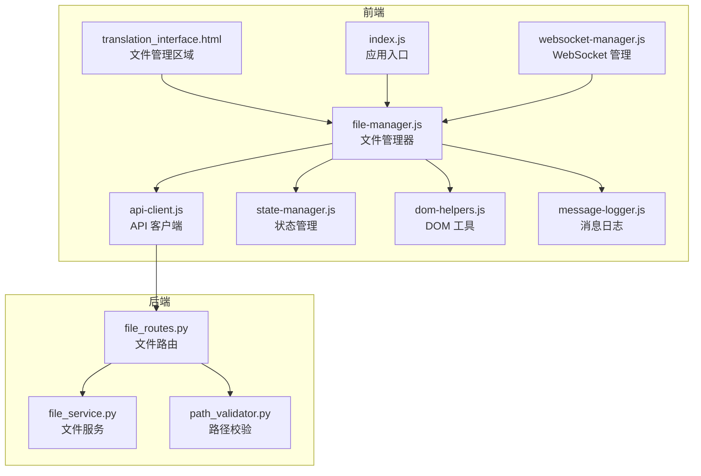
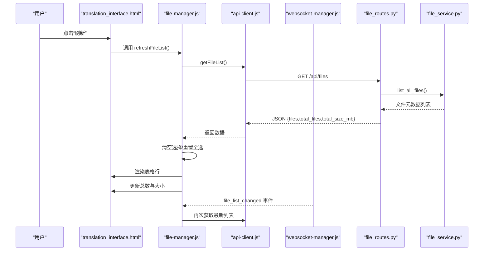
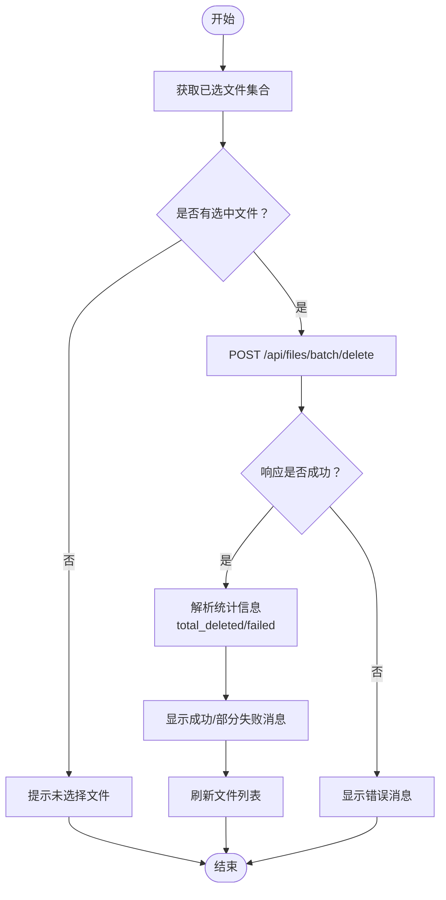
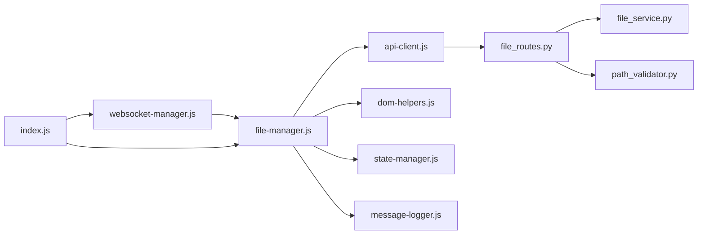

# 文件管理

<cite>
**本文引用的文件**
- [translation_interface.html](file://src/web/templates/translation_interface.html)
- [file-manager.js](file://src/web/static/js/files/file-manager.js)
- [api-client.js](file://src/web/static/js/core/api-client.js)
- [file_routes.py](file://src/api/blueprints/file_routes.py)
- [file_service.py](file://src/api/services/file_service.py)
- [path_validator.py](file://src/api/services/path_validator.py)
- [state-manager.js](file://src/web/static/js/core/state-manager.js)
- [dom-helpers.js](file://src/web/static/js/ui/dom-helpers.js)
- [message-logger.js](file://src/web/static/js/ui/message-logger.js)
- [websocket-manager.js](file://src/web/static/js/core/websocket-manager.js)
- [index.js](file://src/web/static/js/index.js)
</cite>

## 目录
1. [简介](#简介)
2. [项目结构](#项目结构)
3. [核心组件](#核心组件)
4. [架构总览](#架构总览)
5. [详细组件分析](#详细组件分析)
6. [依赖关系分析](#依赖关系分析)
7. [性能考量](#性能考量)
8. [故障排查指南](#故障排查指南)
9. [结论](#结论)
10. [附录](#附录)

## 简介
本章节系统性说明“文件管理”功能的使用方法与技术实现，重点覆盖：
- 如何在“文件管理”区域列出已翻译的文件，并展示文件名、类型、大小、修改时间等信息；
- 文件表格的交互能力：复选框选择、全选/取消全选、批量下载、批量删除；
- 单个文件操作：下载、删除、本地打开；
- 刷新按钮如何触发 API 调用重新加载文件列表；
- 结合前端模块 file-manager.js 与 ApiClient 的交互流程；
- 功能与后端持久化层（文件系统）的关系，明确文件存储位置与生命周期。

## 项目结构
文件管理功能由前端模块与后端蓝图共同实现，前端负责 UI 渲染与交互，后端提供文件元数据与操作接口，二者通过 ApiClient 统一通信。

图表来源
- [translation_interface.html](file://src/web/templates/translation_interface.html#L220-L276)
- [file-manager.js](file://src/web/static/js/files/file-manager.js#L1-L120)
- [api-client.js](file://src/web/static/js/core/api-client.js#L140-L220)
- [file_routes.py](file://src/api/blueprints/file_routes.py#L12-L234)
- [file_service.py](file://src/api/services/file_service.py#L61-L137)
- [path_validator.py](file://src/api/services/path_validator.py#L12-L63)
- [websocket-manager.js](file://src/web/static/js/core/websocket-manager.js#L1-L143)
- [index.js](file://src/web/static/js/index.js#L1-L200)

章节来源
- [translation_interface.html](file://src/web/templates/translation_interface.html#L220-L276)
- [file-manager.js](file://src/web/static/js/files/file-manager.js#L1-L120)
- [api-client.js](file://src/web/static/js/core/api-client.js#L140-L220)
- [file_routes.py](file://src/api/blueprints/file_routes.py#L12-L234)
- [file_service.py](file://src/api/services/file_service.py#L61-L137)
- [path_validator.py](file://src/api/services/path_validator.py#L12-L63)
- [websocket-manager.js](file://src/web/static/js/core/websocket-manager.js#L1-L143)
- [index.js](file://src/web/static/js/index.js#L1-L200)

## 核心组件
- 文件管理器（FileManager）
  - 负责初始化事件监听、刷新文件列表、渲染表格行、处理选择与批量操作、单个文件操作以及本地打开。
- API 客户端（ApiClient）
  - 封装统一的 API 请求与错误处理，提供获取文件列表、下载、删除、批量下载、批量删除、本地打开等方法。
- 文件服务（FileService）
  - 后端文件操作的核心，负责列出文件、删除文件、计算总大小、打开文件等。
- 路径校验（PathValidator）
  - 防止目录穿越与非法路径，保障文件操作安全。
- 状态管理（StateManager）
  - 维护前端状态，如已选中文件集合、已管理文件列表等，驱动 UI 更新。
- DOM 工具（DomHelpers）
  - 提供元素查询、禁用启用、文本设置、HTML 设置等通用 DOM 操作。
- 消息日志（MessageLogger）
  - 统一的消息提示与活动日志输出，便于用户感知操作结果。
- WebSocket 管理（WebSocketManager）
  - 接收服务器推送的文件列表变更事件，自动刷新文件列表。
- 应用入口（index.js）
  - 初始化各模块并建立事件联动，暴露全局函数供 HTML onclick 使用。

章节来源
- [file-manager.js](file://src/web/static/js/files/file-manager.js#L1-L120)
- [api-client.js](file://src/web/static/js/core/api-client.js#L140-L220)
- [file_service.py](file://src/api/services/file_service.py#L61-L137)
- [path_validator.py](file://src/api/services/path_validator.py#L12-L63)
- [state-manager.js](file://src/web/static/js/core/state-manager.js#L1-L120)
- [dom-helpers.js](file://src/web/static/js/ui/dom-helpers.js#L1-L120)
- [message-logger.js](file://src/web/static/js/ui/message-logger.js#L1-L90)
- [websocket-manager.js](file://src/web/static/js/core/websocket-manager.js#L1-L120)
- [index.js](file://src/web/static/js/index.js#L1-L120)

## 架构总览
文件管理的端到端流程如下：
- 用户点击“文件管理”区域的“刷新”按钮或收到 WebSocket 推送的“文件列表变更”事件时，前端调用 ApiClient 获取文件列表；
- 后端路由根据输出目录扫描已翻译文件，返回文件元数据；
- 前端将元数据渲染为表格行，支持复选框选择、全选/取消全选、批量下载/删除、单个下载/删除/本地打开；
- 删除与批量删除会触发后端删除操作，成功后刷新列表；
- 本地打开通过后端调用系统默认程序打开文件。

图表来源
- [translation_interface.html](file://src/web/templates/translation_interface.html#L220-L276)
- [file-manager.js](file://src/web/static/js/files/file-manager.js#L56-L120)
- [api-client.js](file://src/web/static/js/core/api-client.js#L160-L170)
- [file_routes.py](file://src/api/blueprints/file_routes.py#L22-L39)
- [file_service.py](file://src/api/services/file_service.py#L61-L82)
- [websocket-manager.js](file://src/web/static/js/core/websocket-manager.js#L39-L54)
- [index.js](file://src/web/static/js/index.js#L120-L144)

## 详细组件分析

### 文件列表展示与刷新
- 列表来源
  - 后端通过 FileService 从输出目录读取已翻译文件，排除临时文件与上传目录中的源文件，按修改时间倒序返回。
- 前端渲染
  - FileManager.refreshFileList() 调用 ApiClient.getFileList() 获取数据，清空选择与“全选”状态，渲染表格行，更新总数与总大小。
- 刷新触发
  - 用户点击“刷新”按钮；或 WebSocket 收到 file_list_changed 事件后自动刷新。

章节来源
- [file_routes.py](file://src/api/blueprints/file_routes.py#L22-L39)
- [file_service.py](file://src/api/services/file_service.py#L61-L137)
- [file-manager.js](file://src/web/static/js/files/file-manager.js#L56-L120)
- [translation_interface.html](file://src/web/templates/translation_interface.html#L220-L276)
- [websocket-manager.js](file://src/web/static/js/core/websocket-manager.js#L39-L54)
- [index.js](file://src/web/static/js/index.js#L120-L144)

### 文件表格交互：选择与批量操作
- 复选框选择
  - 每行包含一个复选框，点击切换当前文件的选中状态，写入 StateManager 的 files.selected 集合。
- 全选/取消全选
  - 通过“Select All”复选框控制，toggleSelectAll() 会同步所有行的复选框状态，并更新 StateManager。
- 批量下载
  - downloadSelectedFiles() 从 StateManager 取出已选文件名数组，向 /api/files/batch/download 发起 POST 请求，后端打包为 zip 并返回二进制流，前端以下载方式保存。
- 批量删除
  - deleteSelectedFiles() 同样基于已选文件名数组，向 /api/files/batch/delete 发起 POST，后端逐个删除并返回统计结果，前端根据失败数提示用户。

图表来源
- [file-manager.js](file://src/web/static/js/files/file-manager.js#L364-L405)
- [file_routes.py](file://src/api/blueprints/file_routes.py#L133-L169)

章节来源
- [file-manager.js](file://src/web/static/js/files/file-manager.js#L200-L291)
- [file-manager.js](file://src/web/static/js/files/file-manager.js#L320-L405)
- [file_routes.py](file://src/api/blueprints/file_routes.py#L86-L169)

### 单个文件操作：下载、删除、本地打开
- 下载
  - downloadSingleFile(filename) 使用 ApiClient.getFileDownloadUrl(filename) 生成下载链接并跳转下载。
- 删除
  - deleteSingleFile(filename) 调用 ApiClient.deleteFile(filename)，确认后删除，成功后刷新列表。
- 本地打开
  - openLocalFile(filename) 调用 ApiClient.openLocalFile(filename)，后端根据平台调用系统默认程序打开文件。

章节来源
- [file-manager.js](file://src/web/static/js/files/file-manager.js#L293-L420)
- [api-client.js](file://src/web/static/js/core/api-client.js#L170-L226)
- [file_routes.py](file://src/api/blueprints/file_routes.py#L64-L85)
- [file_routes.py](file://src/api/blueprints/file_routes.py#L206-L232)
- [file_service.py](file://src/api/services/file_service.py#L183-L215)

### 刷新按钮与 WebSocket 自动刷新
- 刷新按钮
  - HTML 中的“刷新”按钮绑定到 window.refreshFileList，即 FileManager.refreshFileList()。
- WebSocket 自动刷新
  - WebSocketManager 监听 file_list_changed 事件，触发 FileManager.refreshFileList()，无需手动刷新。

章节来源
- [translation_interface.html](file://src/web/templates/translation_interface.html#L220-L276)
- [index.js](file://src/web/static/js/index.js#L120-L144)
- [websocket-manager.js](file://src/web/static/js/core/websocket-manager.js#L39-L54)
- [file-manager.js](file://src/web/static/js/files/file-manager.js#L18-L31)

### 与后端持久化层的关系与文件存储位置
- 存储位置
  - FileService 在初始化时接收 output_dir，文件列表仅来自该目录（不包含 uploads 子目录），因此“文件管理”只展示已翻译完成的输出文件。
- 生命周期
  - 文件在翻译完成后被写入 output_dir，可通过“删除”操作移除；批量下载用于导出多个文件；本地打开用于直接在系统中查看。
- 安全性
  - 所有文件名与路径均经过 PathValidator 校验，防止目录穿越与绝对路径注入。

章节来源
- [file_service.py](file://src/api/services/file_service.py#L13-L22)
- [file_service.py](file://src/api/services/file_service.py#L61-L82)
- [file_routes.py](file://src/api/blueprints/file_routes.py#L40-L85)
- [path_validator.py](file://src/api/services/path_validator.py#L12-L63)

## 依赖关系分析
- 前端模块耦合
  - FileManager 依赖 ApiClient、DomHelpers、StateManager、MessageLogger；
  - index.js 负责初始化并建立事件桥接，使 WebSocket 事件能触发 FileManager 刷新。
- 后端模块耦合
  - file_routes.py 依赖 FileService 与 PathValidator，负责对外暴露文件管理 API。
- 数据流向
  - 前端通过 ApiClient 调用后端接口，后端 FileService 读写文件系统，返回 JSON 或二进制响应。

图表来源
- [file-manager.js](file://src/web/static/js/files/file-manager.js#L1-L60)
- [api-client.js](file://src/web/static/js/core/api-client.js#L140-L220)
- [file_routes.py](file://src/api/blueprints/file_routes.py#L12-L234)
- [file_service.py](file://src/api/services/file_service.py#L1-L60)
- [path_validator.py](file://src/api/services/path_validator.py#L1-L40)
- [websocket-manager.js](file://src/web/static/js/core/websocket-manager.js#L1-L80)
- [index.js](file://src/web/static/js/index.js#L160-L200)

章节来源
- [file-manager.js](file://src/web/static/js/files/file-manager.js#L1-L60)
- [api-client.js](file://src/web/static/js/core/api-client.js#L140-L220)
- [file_routes.py](file://src/api/blueprints/file_routes.py#L12-L234)
- [file_service.py](file://src/api/services/file_service.py#L1-L60)
- [path_validator.py](file://src/api/services/path_validator.py#L1-L40)
- [websocket-manager.js](file://src/web/static/js/core/websocket-manager.js#L1-L80)
- [index.js](file://src/web/static/js/index.js#L160-L200)

## 性能考量
- 文件列表渲染
  - 后端按修改时间排序，前端一次性渲染，避免频繁 DOM 操作；当文件数量较多时，可考虑虚拟滚动或分页。
- 批量下载
  - 后端在内存中构建 zip，适合中小规模批量导出；大文件集建议拆分批次或提供压缩策略。
- 错误处理
  - ApiClient 对非 JSON 响应（如下载）进行特殊处理，避免解析异常；前端对网络错误与业务错误分别提示。

[本节为通用指导，不直接分析具体文件]

## 故障排查指南
- 无法加载文件列表
  - 检查后端 /api/files 是否返回正确 JSON；查看浏览器网络面板与后端日志。
- 批量删除失败
  - 查看后端返回的 failed 数组，定位具体文件名与原因；确认文件是否存在且未被占用。
- 本地打开失败
  - 确认后端 open_local_file 调用是否成功；检查系统平台与默认程序配置。
- WebSocket 未触发刷新
  - 检查 WebSocket 连接状态与 file_list_changed 事件是否到达前端；确认 index.js 中事件绑定是否生效。

章节来源
- [file-manager.js](file://src/web/static/js/files/file-manager.js#L116-L123)
- [file_routes.py](file://src/api/blueprints/file_routes.py#L133-L169)
- [websocket-manager.js](file://src/web/static/js/core/websocket-manager.js#L39-L54)
- [index.js](file://src/web/static/js/index.js#L120-L144)

## 结论
文件管理功能通过清晰的前后端职责划分实现了完整的文件生命周期管理：列出已翻译文件、选择与批量操作、单个操作与本地打开，并通过 WebSocket 实现自动刷新。后端 FileService 与 PathValidator 确保了安全性与可靠性，前端模块化设计提升了可维护性与扩展性。

[本节为总结，不直接分析具体文件]

## 附录

### 关键 API 一览
- 获取文件列表
  - 方法：GET /api/files
  - 返回：files、total_files、total_size_bytes、total_size_mb
- 下载单个文件
  - 方法：GET /api/files/{filename}
- 删除单个文件
  - 方法：DELETE /api/files/{filename}
- 批量下载
  - 方法：POST /api/files/batch/download
  - 请求体：{ filenames: [string[]] }
- 批量删除
  - 方法：POST /api/files/batch/delete
  - 请求体：{ filenames: [string[]] }
- 本地打开
  - 方法：POST /api/files/{filename}/open
  - 返回：message、file_path

章节来源
- [file_routes.py](file://src/api/blueprints/file_routes.py#L22-L232)
- [api-client.js](file://src/web/static/js/core/api-client.js#L160-L226)