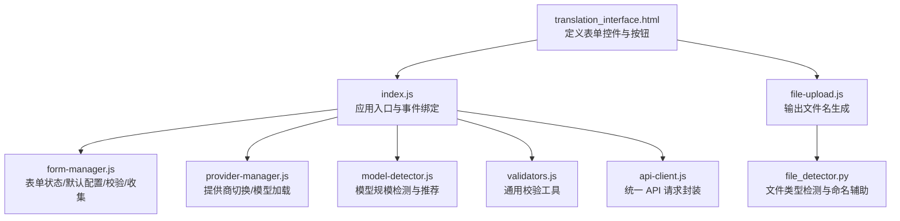
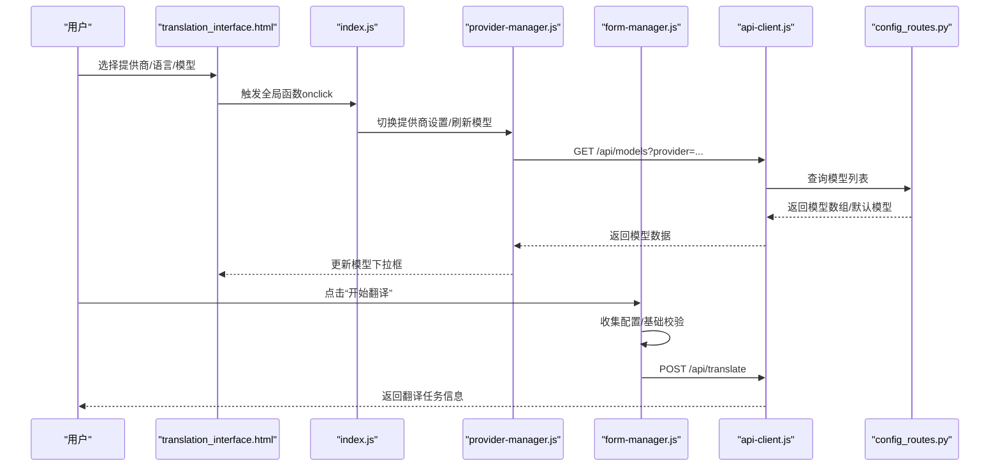
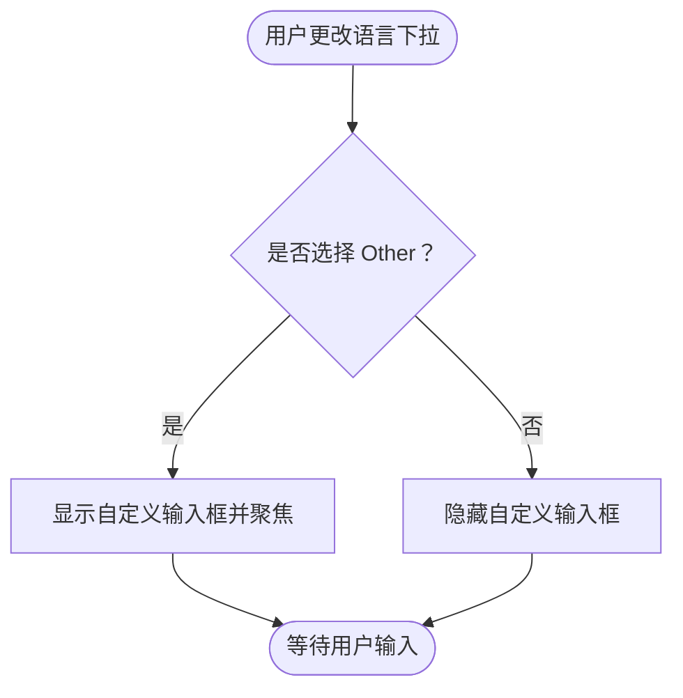
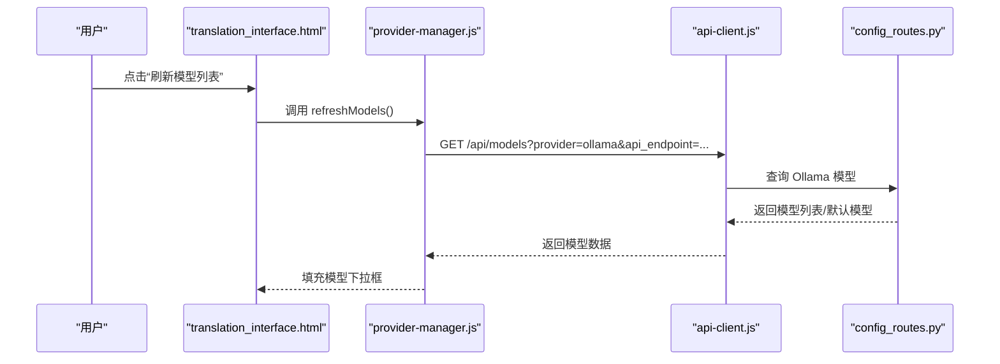
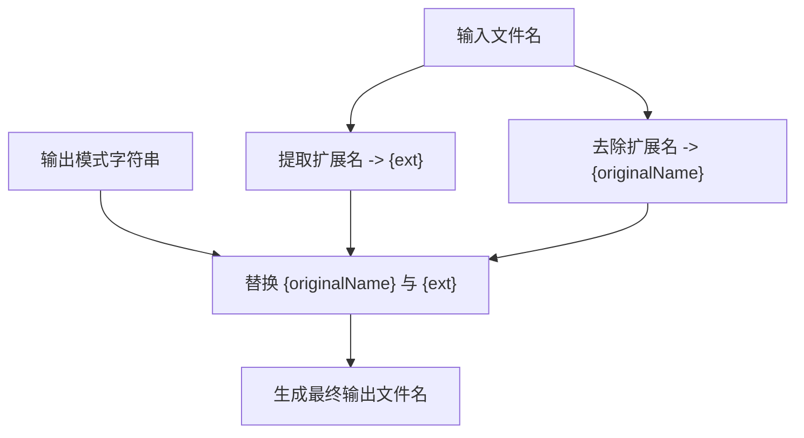
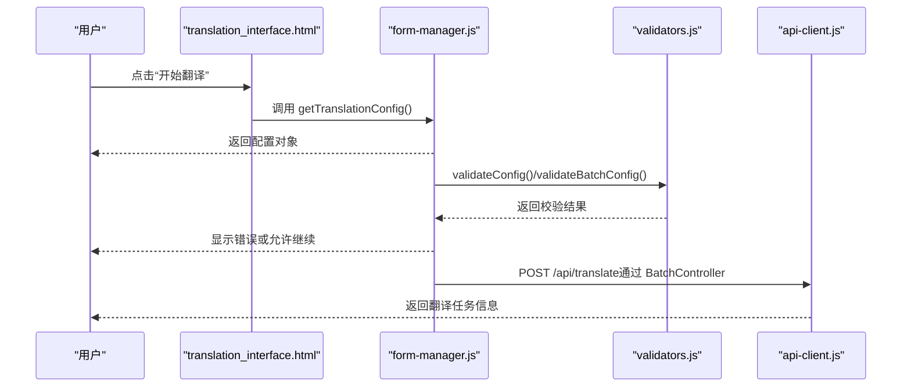
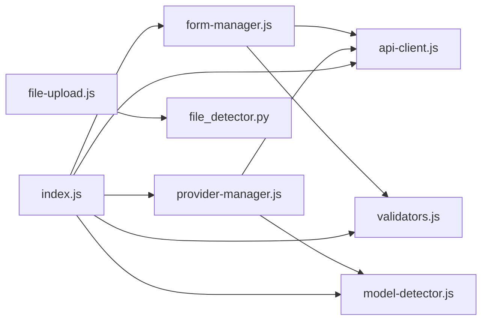

# 翻译配置

<cite>
**本文引用的文件**
- [translation_interface.html](file://src/web/templates/translation_interface.html)
- [form-manager.js](file://src/web/static/js/ui/form-manager.js)
- [provider-manager.js](file://src/web/static/js/providers/provider-manager.js)
- [model-detector.js](file://src/web/static/js/providers/model-detector.js)
- [validators.js](file://src/web/static/js/utils/validators.js)
- [dom-helpers.js](file://src/web/static/js/ui/dom-helpers.js)
- [api-client.js](file://src/web/static/js/core/api-client.js)
- [index.js](file://src/web/static/js/index.js)
- [config_routes.py](file://src/api/blueprints/config_routes.py)
- [file-upload.js](file://src/web/static/js/files/file-upload.js)
- [file_detector.py](file://src/utils/file_detector.py)
</cite>

## 目录
1. [简介](#简介)
2. [项目结构](#项目结构)
3. [核心组件](#核心组件)
4. [架构总览](#架构总览)
5. [详细组件分析](#详细组件分析)
6. [依赖关系分析](#依赖关系分析)
7. [性能考量](#性能考量)
8. [故障排查指南](#故障排查指南)
9. [结论](#结论)
10. [附录](#附录)

## 简介
本文件围绕“翻译配置表单”的各项功能与前端实现机制进行深入讲解，覆盖以下主题：
- LLM 提供商选择（Ollama、Gemini、OpenAI），以及 form-manager.js 如何根据选择动态切换显示对应的 API 配置字段（如 Gemini API Key 或 OpenAI Endpoint）
- 源语言/目标语言下拉菜单的工作方式，包括“Other”选项触发自定义输入框的逻辑
- 模型选择器如何与后端通信获取可用模型列表，并通过 refreshModels 按钮手动刷新
- 输出文件名模式中 {originalName} 和 {ext} 占位符的替换规则
- 高级设置中的分块大小、超时时间、上下文窗口等参数对翻译过程的影响
- 结合 HTML 模板中的表单元素与 JavaScript 中的验证逻辑，说明配置数据如何被收集并用于后续翻译请求

## 项目结构
前端翻译界面由 HTML 模板与一组模块化 JS 组件构成，入口文件负责初始化与事件绑定，各模块职责清晰：
- HTML 模板定义表单控件与交互入口
- ProviderManager 负责提供商切换与模型加载
- FormManager 负责表单状态、默认配置加载、校验与配置收集
- ModelDetector 基于模型名称推断参数规模并给出推荐
- Validators 提供通用校验工具
- ApiClient 封装后端 API 请求
- 文件上传模块负责输出文件名生成与文件队列管理

图表来源
- [translation_interface.html](file://src/web/templates/translation_interface.html#L1-L180)
- [index.js](file://src/web/static/js/index.js#L1-L210)
- [form-manager.js](file://src/web/static/js/ui/form-manager.js#L1-L120)
- [provider-manager.js](file://src/web/static/js/providers/provider-manager.js#L1-L120)
- [model-detector.js](file://src/web/static/js/providers/model-detector.js#L1-L80)
- [validators.js](file://src/web/static/js/utils/validators.js#L1-L80)
- [api-client.js](file://src/web/static/js/core/api-client.js#L1-L120)
- [file-upload.js](file://src/web/static/js/files/file-upload.js#L1-L48)
- [file_detector.py](file://src/utils/file_detector.py#L1-L48)

章节来源
- [translation_interface.html](file://src/web/templates/translation_interface.html#L1-L180)
- [index.js](file://src/web/static/js/index.js#L1-L210)

## 核心组件
- 表单管理器（FormManager）
  - 初始化事件监听、加载默认配置、重置表单、更新进度条、收集翻译配置、执行基础校验
- 提供商管理器（ProviderManager）
  - 切换提供商设置可见性、调用后端获取模型列表、自动重试 Ollama 连接、刷新模型
- 模型检测器（ModelDetector）
  - 从模型名提取参数规模（如 12B），在小模型且未启用快速模式时提示开启快速模式
- DOM 辅助（DomHelpers）
  - 统一的 DOM 操作封装，简化元素查找、显示/隐藏、值读取/设置、禁用/启用等
- API 客户端（ApiClient）
  - 统一封装健康检查、配置获取、模型列表获取、翻译启动与中断、文件上传/下载/批量操作等
- 校验工具（Validators）
  - 通用校验：必填、范围、URL、文件选择、语言不同、提供商密钥要求等
- 文件上传（file-upload.js）
  - 输出文件名生成：基于 {originalName} 与 {ext} 占位符替换
- 后端配置路由（config_routes.py）
  - 提供默认配置、模型列表查询（Ollama/Gemini）、健康检查

章节来源
- [form-manager.js](file://src/web/static/js/ui/form-manager.js#L1-L120)
- [provider-manager.js](file://src/web/static/js/providers/provider-manager.js#L1-L120)
- [model-detector.js](file://src/web/static/js/providers/model-detector.js#L1-L80)
- [dom-helpers.js](file://src/web/static/js/ui/dom-helpers.js#L1-L160)
- [api-client.js](file://src/web/static/js/core/api-client.js#L1-L120)
- [validators.js](file://src/web/static/js/utils/validators.js#L1-L120)
- [file-upload.js](file://src/web/static/js/files/file-upload.js#L1-L48)
- [config_routes.py](file://src/api/blueprints/config_routes.py#L1-L72)

## 架构总览
前端通过 index.js 统一初始化各模块，HTML 模板提供表单控件与按钮；ProviderManager 在提供商切换时调用 ApiClient 获取模型列表；FormManager 收集配置并通过 Validators 执行基础校验；最终将配置传递给后端翻译接口。

图表来源
- [index.js](file://src/web/static/js/index.js#L210-L305)
- [provider-manager.js](file://src/web/static/js/providers/provider-manager.js#L120-L210)
- [form-manager.js](file://src/web/static/js/ui/form-manager.js#L300-L389)
- [api-client.js](file://src/web/static/js/core/api-client.js#L240-L306)
- [config_routes.py](file://src/api/blueprints/config_routes.py#L45-L72)

## 详细组件分析

### LLM 提供商选择与动态字段切换
- HTML 模板提供 LLM Provider 下拉框，初始值为本地 Ollama
- ProviderManager 监听提供商变更，按提供商显示/隐藏对应设置区域：
  - Ollama：显示 Ollama API Endpoint 输入框
  - Gemini：显示 Gemini API Key 输入框
  - OpenAI：显示 OpenAI API Endpoint 与 API Key 输入框
- ProviderManager 调用 ApiClient.getModels 获取模型列表：
  - Ollama：传入 api_endpoint 参数
  - Gemini：传入 api_key 参数
  - OpenAI：使用静态常见模型列表
- 用户可点击“刷新模型列表”按钮触发 ProviderManager.refreshModels

章节来源
- [translation_interface.html](file://src/web/templates/translation_interface.html#L21-L47)
- [provider-manager.js](file://src/web/static/js/providers/provider-manager.js#L73-L124)
- [provider-manager.js](file://src/web/static/js/providers/provider-manager.js#L126-L160)
- [provider-manager.js](file://src/web/static/js/providers/provider-manager.js#L255-L303)
- [api-client.js](file://src/web/static/js/core/api-client.js#L244-L266)

### 源语言/目标语言下拉菜单与“Other”自定义输入
- 源语言/目标语言下拉菜单包含预设语言与“Other（指定）”选项
- FormManager 在 change 事件中判断是否为“Other”，若是则显示对应的自定义输入框并聚焦
- 收集配置时，若语言选择为“Other”，则取自定义输入框内容作为实际语言值

图表来源
- [form-manager.js](file://src/web/static/js/ui/form-manager.js#L98-L132)
- [form-manager.js](file://src/web/static/js/ui/form-manager.js#L308-L320)
- [translation_interface.html](file://src/web/templates/translation_interface.html#L59-L87)

章节来源
- [form-manager.js](file://src/web/static/js/ui/form-manager.js#L98-L132)
- [form-manager.js](file://src/web/static/js/ui/form-manager.js#L308-L320)
- [translation_interface.html](file://src/web/templates/translation_interface.html#L59-L87)

### 模型选择器与后端通信、手动刷新
- ProviderManager 在提供商切换时自动加载模型；也可通过 HTML 模板中的“刷新模型列表”按钮触发
- 加载流程：
  - 设置“加载中”选项
  - 调用 ApiClient.getModels(provider, options)
  - 成功后填充模型下拉框并缓存到 StateManager
  - 若 Ollama 不可用，则启动定时重试并在达到阈值后提示等待
- ModelDetector 根据模型名提取参数规模，向用户展示快速模式建议

图表来源
- [translation_interface.html](file://src/web/templates/translation_interface.html#L49-L57)
- [provider-manager.js](file://src/web/static/js/providers/provider-manager.js#L126-L160)
- [provider-manager.js](file://src/web/static/js/providers/provider-manager.js#L141-L219)
- [api-client.js](file://src/web/static/js/core/api-client.js#L244-L266)
- [config_routes.py](file://src/api/blueprints/config_routes.py#L123-L155)

章节来源
- [provider-manager.js](file://src/web/static/js/providers/provider-manager.js#L126-L219)
- [model-detector.js](file://src/web/static/js/providers/model-detector.js#L45-L88)
- [config_routes.py](file://src/api/blueprints/config_routes.py#L123-L155)

### 输出文件名模式：{originalName} 与 {ext} 替换规则
- HTML 模板提供输出文件名模式输入框，默认值包含 {originalName} 与 {ext}
- 文件上传模块在生成输出文件名时，先从原文件名去除扩展名得到 {originalName}，再以原扩展名为 {ext} 进行替换
- 支持的文件类型由 file_detector.py 的 detect_file_type 决定（txt、epub、srt）

图表来源
- [translation_interface.html](file://src/web/templates/translation_interface.html#L88-L92)
- [file-upload.js](file://src/web/static/js/files/file-upload.js#L1-L48)
- [file_detector.py](file://src/utils/file_detector.py#L1-L48)

章节来源
- [translation_interface.html](file://src/web/templates/translation_interface.html#L88-L92)
- [file-upload.js](file://src/web/static/js/files/file-upload.js#L1-L48)
- [file_detector.py](file://src/utils/file_detector.py#L1-L48)

### 高级设置参数对翻译过程的影响
- 分块大小（lines）：影响每次翻译请求处理的文本行数，过大可能超出上下文限制，过小会增加请求次数
- 请求超时（seconds）：控制网络请求的最大等待时间，避免长时间阻塞
- 上下文窗口（tokens）：决定模型可接收的历史上下文长度，影响长文档翻译质量与稳定性
- 最大重试次数：失败时自动重试的次数上限
- 重试延迟（seconds）：每次重试之间的等待时间
- 快速模式（Fast Mode）：EPUB 仅提取纯文本，不保留格式，提高可靠性但会丢失内联格式

章节来源
- [translation_interface.html](file://src/web/templates/translation_interface.html#L114-L142)
- [form-manager.js](file://src/web/static/js/ui/form-manager.js#L337-L351)

### 配置数据收集与验证流程
- FormManager.getTranslationConfig 收集：
  - 源语言/目标语言（若为 Other 则取自定义输入）
  - LLM 提供商与模型
  - API 端点（根据提供商选择不同字段）
  - API 密钥（Gemini/OpenAI）
  - 高级设置参数（分块大小、超时、上下文窗口、最大重试、重试延迟、快速模式）
- FormManager.validateConfig 执行基础校验：
  - 源语言/目标语言必填
  - 模型必选
  - API 端点必填
  - 当提供商为云服务时，相应密钥必填
- Validators 提供更细粒度的校验（范围、URL、文件选择、语言不同等），可在批量翻译前统一校验

图表来源
- [form-manager.js](file://src/web/static/js/ui/form-manager.js#L308-L389)
- [validators.js](file://src/web/static/js/utils/validators.js#L1-L164)
- [api-client.js](file://src/web/static/js/core/api-client.js#L98-L131)

章节来源
- [form-manager.js](file://src/web/static/js/ui/form-manager.js#L308-L389)
- [validators.js](file://src/web/static/js/utils/validators.js#L1-L164)
- [api-client.js](file://src/web/static/js/core/api-client.js#L98-L131)

## 依赖关系分析
- 模块耦合与协作
  - index.js 作为中枢，导入并初始化所有模块，负责事件绑定与跨模块通信
  - FormManager 依赖 DomHelpers、StateManager、MessageLogger、ApiClient
  - ProviderManager 依赖 DomHelpers、StateManager、MessageLogger、ApiClient、ModelDetector
  - ModelDetector 依赖 DomHelpers
  - ApiClient 为 ProviderManager/FormManager 等模块提供统一 API 访问
  - 文件上传模块与后端配置路由配合，完成输出文件名生成与文件类型检测

图表来源
- [index.js](file://src/web/static/js/index.js#L1-L120)
- [form-manager.js](file://src/web/static/js/ui/form-manager.js#L1-L60)
- [provider-manager.js](file://src/web/static/js/providers/provider-manager.js#L1-L40)
- [model-detector.js](file://src/web/static/js/providers/model-detector.js#L1-L40)
- [validators.js](file://src/web/static/js/utils/validators.js#L1-L40)
- [api-client.js](file://src/web/static/js/core/api-client.js#L1-L60)
- [file-upload.js](file://src/web/static/js/files/file-upload.js#L1-L48)
- [file_detector.py](file://src/utils/file_detector.py#L1-L48)

章节来源
- [index.js](file://src/web/static/js/index.js#L1-L120)
- [form-manager.js](file://src/web/static/js/ui/form-manager.js#L1-L60)
- [provider-manager.js](file://src/web/static/js/providers/provider-manager.js#L1-L40)
- [model-detector.js](file://src/web/static/js/providers/model-detector.js#L1-L40)
- [validators.js](file://src/web/static/js/utils/validators.js#L1-L40)
- [api-client.js](file://src/web/static/js/core/api-client.js#L1-L60)
- [file-upload.js](file://src/web/static/js/files/file-upload.js#L1-L48)
- [file_detector.py](file://src/utils/file_detector.py#L1-L48)

## 性能考量
- 分块大小与上下文窗口
  - 合理设置分块大小与上下文窗口可减少重复上下文传输，提升吞吐量
  - 对于较小模型，建议开启快速模式以降低复杂度
- 超时与重试
  - 超时过短可能导致频繁失败，重试次数与延迟需平衡成功率与资源占用
- Ollama 自动重试
  - ProviderManager 对 Ollama 提供了静默重试机制，避免 UI 长时间卡死

章节来源
- [provider-manager.js](file://src/web/static/js/providers/provider-manager.js#L141-L219)
- [translation_interface.html](file://src/web/templates/translation_interface.html#L114-L142)

## 故障排查指南
- Ollama 无法连接
  - 现象：模型列表为空，UI 提示等待 Ollama
  - 处理：确认 Ollama 已运行且端点正确；ProviderManager 会自动重试
- Gemini API Key 缺失
  - 现象：获取模型失败或提示需要密钥
  - 处理：在表单中填写 Gemini API Key 或设置环境变量
- OpenAI 端点或密钥缺失
  - 现象：基础校验失败
  - 处理：填写 OpenAI Endpoint 与 API Key
- 输出文件名异常
  - 现象：生成文件名不符合预期
  - 处理：检查输出文件名模式中 {originalName} 与 {ext} 是否正确；确认文件扩展名存在

章节来源
- [provider-manager.js](file://src/web/static/js/providers/provider-manager.js#L141-L219)
- [config_routes.py](file://src/api/blueprints/config_routes.py#L74-L122)
- [form-manager.js](file://src/web/static/js/ui/form-manager.js#L354-L389)
- [file-upload.js](file://src/web/static/js/files/file-upload.js#L1-L48)

## 结论
翻译配置表单通过模块化设计实现了灵活的提供商切换、动态字段显示、模型列表加载与校验收集。FormManager 与 ProviderManager 协作，结合 Validators 与 ApiClient，确保配置在提交前满足基本约束；输出文件名生成遵循 {originalName}/{ext} 占位符约定，便于用户定制命名策略。合理设置高级参数可显著提升翻译效率与稳定性。

## 附录
- 默认配置来源：后端 /api/config 提供默认值（如 Ollama 端点、分块大小、超时、上下文窗口、最大重试、重试延迟、默认语言等）
- 快速模式提示：当模型参数规模小于等于 12B 且未启用快速模式时，ModelDetector 会提示开启快速模式

章节来源
- [config_routes.py](file://src/api/blueprints/config_routes.py#L55-L72)
- [form-manager.js](file://src/web/static/js/ui/form-manager.js#L171-L216)
- [model-detector.js](file://src/web/static/js/providers/model-detector.js#L45-L88)