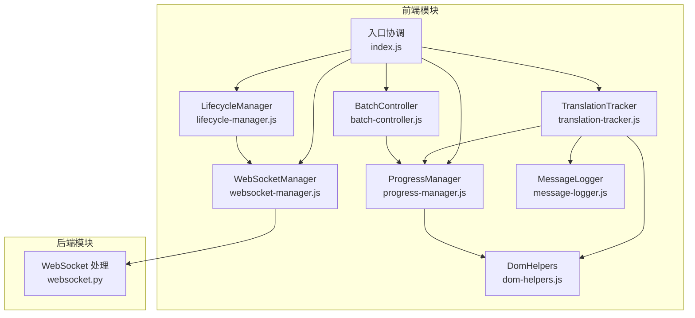
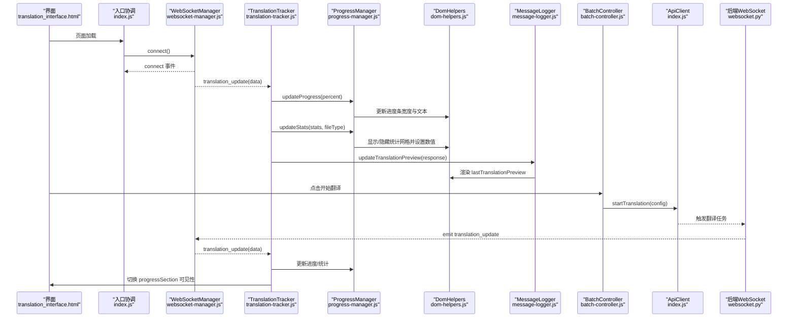
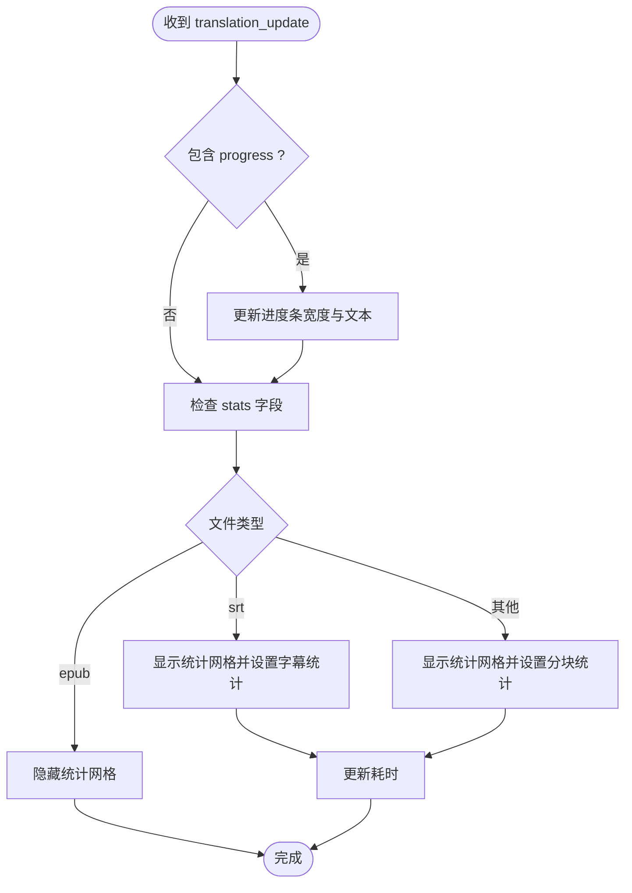
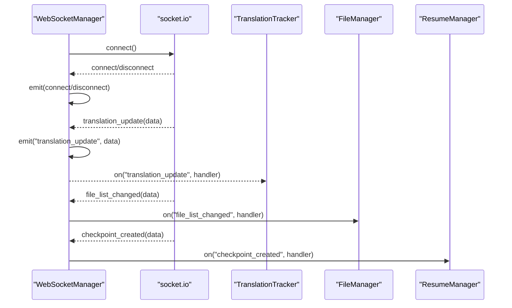
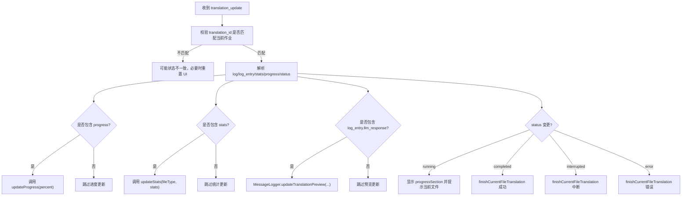
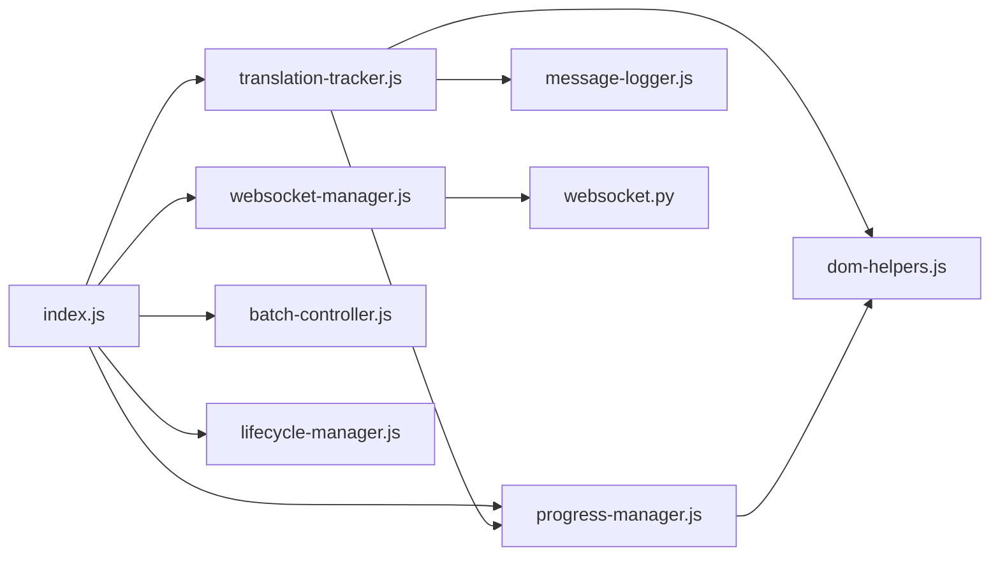

# 进度监控

<cite>
**本文引用的文件**
- [translation_interface.html](file://src/web/templates/translation_interface.html)
- [index.js](file://src/web/static/js/index.js)
- [websocket-manager.js](file://src/web/static/js/core/websocket-manager.js)
- [websocket.py](file://src/api/websocket.py)
- [translation-tracker.js](file://src/web/static/js/translation/translation-tracker.js)
- [progress-manager.js](file://src/web/static/js/translation/progress-manager.js)
- [dom-helpers.js](file://src/web/static/js/ui/dom-helpers.js)
- [message-logger.js](file://src/web/static/js/ui/message-logger.js)
- [batch-controller.js](file://src/web/static/js/translation/batch-controller.js)
- [lifecycle-manager.js](file://src/web/static/js/utils/lifecycle-manager.js)
</cite>

## 目录
1. [简介](#简介)
2. [项目结构](#项目结构)
3. [核心组件](#核心组件)
4. [架构总览](#架构总览)
5. [详细组件分析](#详细组件分析)
6. [依赖关系分析](#依赖关系分析)
7. [性能与可用性考量](#性能与可用性考量)
8. [故障排查指南](#故障排查指南)
9. [结论](#结论)

## 简介
本文件围绕“实时进度监控系统”的实现原理与用户界面展示展开，重点说明：
- progress-section 在开始翻译后如何显示，并通过 WebSocket 接收 translation_update 消息更新进度条与统计信息；
- progress-manager.js 如何计算整体进度百分比并更新 UI；
- lastTranslationPreview 区域如何展示最近一次翻译片段的预览内容；
- 结合 websocket-manager.js 的事件监听机制，前端如何订阅翻译更新事件并安全地更新 DOM 元素；
- 中断按钮（interruptBtn）的状态控制逻辑：在翻译进行时启用，点击后向 API 发送中断请求；
- WebSocket 连接异常时的降级处理建议。

## 项目结构
前端采用模块化组织，核心模块包括：
- WebSocket 管理：负责连接生命周期与事件路由
- 翻译跟踪器：处理 WebSocket 更新、状态变更、完成/中断/错误处理
- 进度管理器：负责进度条与统计信息的 UI 更新
- DOM 辅助工具：统一的 DOM 操作封装，避免直接操作原生 DOM
- 生命周期管理：页面加载、卸载、可见性变化与一致性检查
- 批处理控制器：批量翻译启动、队列推进、中断控制

图表来源
- [index.js](file://src/web/static/js/index.js#L1-L200)
- [websocket-manager.js](file://src/web/static/js/core/websocket-manager.js#L1-L143)
- [translation-tracker.js](file://src/web/static/js/translation/translation-tracker.js#L1-L120)
- [progress-manager.js](file://src/web/static/js/translation/progress-manager.js#L1-L130)
- [websocket.py](file://src/api/websocket.py#L1-L43)

章节来源
- [translation_interface.html](file://src/web/templates/translation_interface.html#L150-L182)
- [index.js](file://src/web/static/js/index.js#L1-L200)

## 核心组件
- WebSocketManager：建立与维护 WebSocket 连接，注册/注销事件处理器，转发应用事件（如 translation_update）
- TranslationTracker：接收 WebSocket 更新，解析进度、统计、日志与状态，驱动 UI 更新与批处理队列推进
- ProgressManager：集中管理进度条与统计信息的 UI 更新，支持不同文件类型（文本、EPUB、SRT）的差异化展示
- DomHelpers：统一的 DOM 操作封装，提供安全的文本/HTML 设置、元素显示/隐藏、禁用/启用等
- MessageLogger：活动日志与翻译预览更新，lastTranslationPreview 即由其负责渲染
- BatchController：批量翻译的启动、配置校验、中断控制、队列推进
- LifecycleManager：页面生命周期管理、一致性检查、页面关闭时的中断请求发送

章节来源
- [websocket-manager.js](file://src/web/static/js/core/websocket-manager.js#L1-L143)
- [translation-tracker.js](file://src/web/static/js/translation/translation-tracker.js#L1-L120)
- [progress-manager.js](file://src/web/static/js/translation/progress-manager.js#L1-L130)
- [dom-helpers.js](file://src/web/static/js/ui/dom-helpers.js#L1-L262)
- [message-logger.js](file://src/web/static/js/ui/message-logger.js#L92-L145)
- [batch-controller.js](file://src/web/static/js/translation/batch-controller.js#L100-L170)
- [lifecycle-manager.js](file://src/web/static/js/utils/lifecycle-manager.js#L1-L190)

## 架构总览
前端通过 index.js 统一初始化各模块，建立 WebSocket 连接后，TranslationTracker 订阅 translation_update 事件；当 BatchController 启动翻译后，后端通过 WebSocket 推送实时进度与统计；ProgressManager 负责更新进度条与统计网格；MessageLogger 负责活动日志与翻译预览；LifecycleManager 在页面不可见或关闭时进行一致性检查与中断请求。

图表来源
- [index.js](file://src/web/static/js/index.js#L120-L160)
- [websocket-manager.js](file://src/web/static/js/core/websocket-manager.js#L39-L54)
- [translation-tracker.js](file://src/web/static/js/translation/translation-tracker.js#L40-L121)
- [progress-manager.js](file://src/web/static/js/translation/progress-manager.js#L56-L107)
- [dom-helpers.js](file://src/web/static/js/ui/dom-helpers.js#L53-L90)
- [message-logger.js](file://src/web/static/js/ui/message-logger.js#L92-L145)
- [batch-controller.js](file://src/web/static/js/translation/batch-controller.js#L100-L170)
- [websocket.py](file://src/api/websocket.py#L21-L43)

## 详细组件分析

### 进度条与统计更新（ProgressManager）
- 进度条更新：根据传入的百分比设置进度条宽度与文本
- 统计信息更新：按文件类型显示不同的统计字段（EPUB 隐藏统计网格；SRT 使用字幕统计；文本文件使用分块统计），并更新耗时
- UI 控制：提供 show/hide/reset/complete/getCurrentProgress 等方法，用于控制进度区域的显示与重置

图表来源
- [progress-manager.js](file://src/web/static/js/translation/progress-manager.js#L14-L54)
- [progress-manager.js](file://src/web/static/js/translation/progress-manager.js#L56-L107)

章节来源
- [progress-manager.js](file://src/web/static/js/translation/progress-manager.js#L1-L130)

### WebSocket 事件订阅与转发（WebSocketManager）
- 连接建立与断开：记录连接状态并通过 emit 分发 connect/disconnect 事件
- 应用事件：订阅 translation_update、file_list_changed、checkpoint_created 等事件并转发给上层模块
- 安全性：事件转发在 try/catch 中执行，避免单个处理器异常影响整体链路

图表来源
- [websocket-manager.js](file://src/web/static/js/core/websocket-manager.js#L17-L54)
- [index.js](file://src/web/static/js/index.js#L120-L160)

章节来源
- [websocket-manager.js](file://src/web/static/js/core/websocket-manager.js#L1-L143)
- [index.js](file://src/web/static/js/index.js#L120-L160)

### 翻译更新处理与 UI 驱动（TranslationTracker）
- 状态校验：确保收到的 translation_update 对应当前作业，否则在必要时重置 UI
- 日志与预览：解析 log_entry 类型为 llm_response 的数据，提取翻译片段并调用 MessageLogger 更新 lastTranslationPreview
- 进度与统计：根据文件类型更新进度条与统计网格
- 状态变更：根据 status（completed/interrupted/error/running）更新 UI、文件列表状态，并推进批处理队列

图表来源
- [translation-tracker.js](file://src/web/static/js/translation/translation-tracker.js#L40-L121)
- [translation-tracker.js](file://src/web/static/js/translation/translation-tracker.js#L123-L178)
- [message-logger.js](file://src/web/static/js/ui/message-logger.js#L92-L145)

章节来源
- [translation-tracker.js](file://src/web/static/js/translation/translation-tracker.js#L1-L224)
- [message-logger.js](file://src/web/static/js/ui/message-logger.js#L92-L145)

### 最近翻译预览（lastTranslationPreview）
- 预览内容提取：从 log_entry.data.response 中提取位于特定标签内的翻译文本
- 内容清洗：移除占位符标记与公共缩进，保证预览可读性
- DOM 更新：通过 DomHelpers.setHtml 将清洗后的文本以带样式的容器插入到 lastTranslationPreview 区域

章节来源
- [message-logger.js](file://src/web/static/js/ui/message-logger.js#L92-L145)
- [translation_interface.html](file://src/web/templates/translation_interface.html#L176-L182)

### 中断按钮（interruptBtn）状态控制
- 启用条件：当存在当前作业且批处理处于活跃状态时显示并启用中断按钮
- 点击行为：调用 ApiClient.interruptTranslation(currentJob.translationId)，发送中断请求；同时更新按钮状态为“正在中断”
- 页面关闭保护：LifecycleManager 在 pagehide 事件中尝试通过 sendBeacon 或同步 XHR 向后端发送中断请求，确保服务端能及时停止

章节来源
- [batch-controller.js](file://src/web/static/js/translation/batch-controller.js#L144-L170)
- [index.js](file://src/web/static/js/index.js#L236-L262)
- [lifecycle-manager.js](file://src/web/static/js/utils/lifecycle-manager.js#L83-L115)

### WebSocket 连接异常的降级处理建议
- 健康检查与回退：页面加载时进行健康检查，若服务器不可达，提示用户并记录日志
- 一致性检查：周期性检查当前作业状态，若服务端已结束而 UI 仍显示活跃，则触发 UI 同步
- 事件降级：即使 WebSocket 断开，仍可通过轮询或本地状态维持基本 UI 行为；当恢复连接后，重新拉取最新状态
- 用户提示：在断连期间，禁用部分交互或显示“离线模式”提示，避免误操作

章节来源
- [lifecycle-manager.js](file://src/web/static/js/utils/lifecycle-manager.js#L1-L76)
- [lifecycle-manager.js](file://src/web/static/js/utils/lifecycle-manager.js#L132-L190)
- [websocket-manager.js](file://src/web/static/js/core/websocket-manager.js#L33-L54)

## 依赖关系分析
- 模块耦合
  - index.js 作为中枢，将 WebSocketManager、TranslationTracker、ProgressManager、BatchController、LifecycleManager 等模块串联
  - TranslationTracker 依赖 ProgressManager、DomHelpers、MessageLogger
  - ProgressManager 依赖 DomHelpers
  - WebSocketManager 依赖 ApiClient（用于日志中的基础地址）
- 外部依赖
  - 后端通过 Flask-SocketIO 提供 translation_update 事件推送
  - 前端通过 socket.io 客户端建立连接

图表来源
- [index.js](file://src/web/static/js/index.js#L1-L200)
- [websocket-manager.js](file://src/web/static/js/core/websocket-manager.js#L1-L143)
- [translation-tracker.js](file://src/web/static/js/translation/translation-tracker.js#L1-L120)
- [progress-manager.js](file://src/web/static/js/translation/progress-manager.js#L1-L130)
- [websocket.py](file://src/api/websocket.py#L1-L43)

章节来源
- [index.js](file://src/web/static/js/index.js#L1-L200)
- [websocket-manager.js](file://src/web/static/js/core/websocket-manager.js#L1-L143)
- [translation-tracker.js](file://src/web/static/js/translation/translation-tracker.js#L1-L120)
- [progress-manager.js](file://src/web/static/js/translation/progress-manager.js#L1-L130)
- [websocket.py](file://src/api/websocket.py#L1-L43)

## 性能与可用性考量
- WebSocket 事件处理的健壮性：所有事件回调均在 try/catch 中执行，避免单点异常导致 UI 崩溃
- DOM 更新最小化：通过 DomHelpers 统一封装，减少重复查询与直接样式修改
- 状态一致性：周期性检查当前作业状态，防止 UI 与服务端状态不一致
- 中断可靠性：页面关闭时优先使用 sendBeacon，兼容旧浏览器时回退到同步 XHR，确保中断请求至少被尝试发送

## 故障排查指南
- WebSocket 未连接
  - 检查页面健康检查是否成功，确认 ApiClient 基础地址正确
  - 查看控制台日志中 connect/disconnect 事件是否正常触发
- 翻译进度不更新
  - 确认 translation_update 事件是否到达 TranslationTracker
  - 检查当前作业 translation_id 是否与收到的数据一致
  - 核对 stats/progress 字段是否存在
- 预览不显示
  - 确认 log_entry 类型为 llm_response 且包含响应文本
  - 检查标签提取逻辑是否匹配实际格式
- 中断无效
  - 确认当前存在有效作业且按钮未被禁用
  - 检查页面关闭时是否触发了 sendBeacon 或同步 XHR 请求

章节来源
- [websocket-manager.js](file://src/web/static/js/core/websocket-manager.js#L33-L54)
- [translation-tracker.js](file://src/web/static/js/translation/translation-tracker.js#L40-L121)
- [message-logger.js](file://src/web/static/js/ui/message-logger.js#L92-L145)
- [lifecycle-manager.js](file://src/web/static/js/utils/lifecycle-manager.js#L83-L115)

## 结论
该进度监控系统通过 WebSocket 实现实时更新，结合 TranslationTracker 的状态机与 ProgressManager 的 UI 管理，实现了流畅的翻译进度可视化与预览展示。中断按钮与生命周期管理提供了可靠的用户控制与保护机制。在连接异常时，系统具备一致性检查与降级策略，保障用户体验与数据安全。