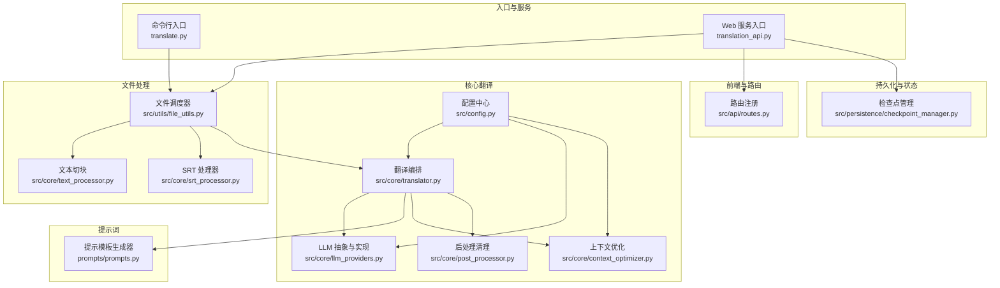
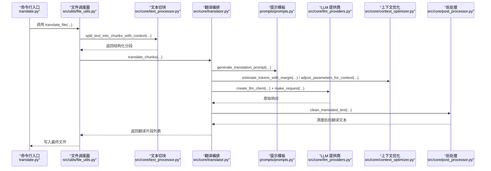
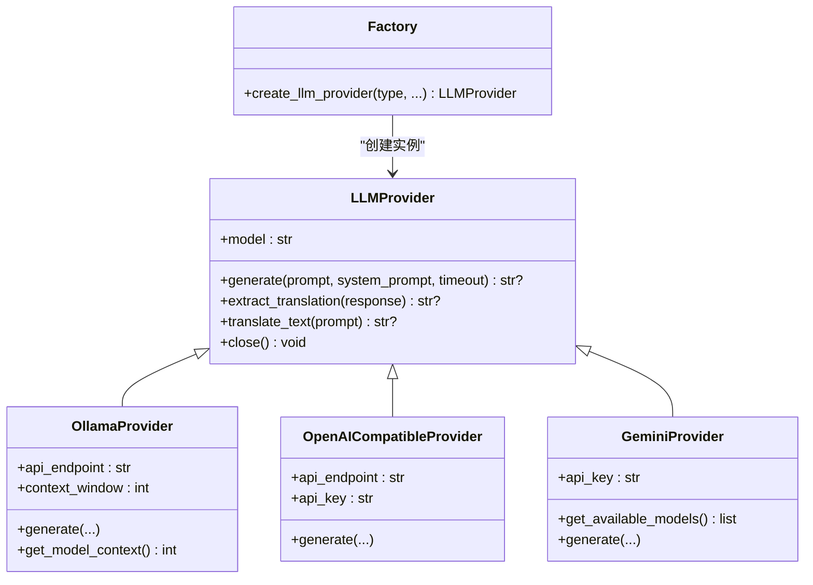
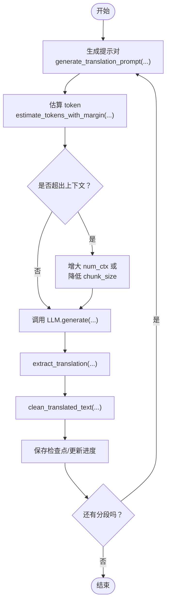
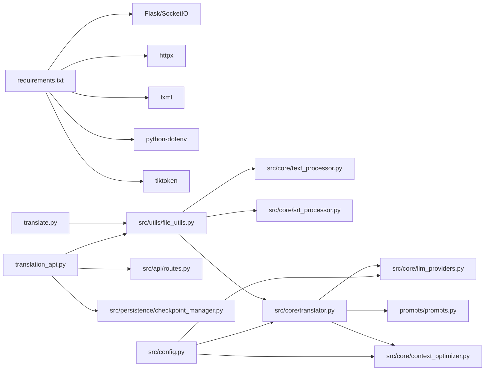

# 开发者指南

<cite>
**本文引用的文件列表**
- [translate.py](file://translate.py)
- [translation_api.py](file://translation_api.py)
- [src/config.py](file://src/config.py)
- [src/core/llm_providers.py](file://src/core/llm_providers.py)
- [src/core/translator.py](file://src/core/translator.py)
- [prompts/prompts.py](file://prompts/prompts.py)
- [src/utils/file_utils.py](file://src/utils/file_utils.py)
- [src/core/text_processor.py](file://src/core/text_processor.py)
- [src/core/srt_processor.py](file://src/core/srt_processor.py)
- [src/api/routes.py](file://src/api/routes.py)
- [src/core/context_optimizer.py](file://src/core/context_optimizer.py)
- [src/persistence/checkpoint_manager.py](file://src/persistence/checkpoint_manager.py)
- [requirements.txt](file://requirements.txt)
- [docs/README.md](file://docs/README.md)
- [deployment/TESTING.md](file://deployment/TESTING.md)
- [scripts/setup_config.py](file://scripts/setup_config.py)
</cite>

## 目录
1. [简介](#简介)
2. [项目结构](#项目结构)
3. [核心组件](#核心组件)
4. [架构总览](#架构总览)
5. [详细组件分析](#详细组件分析)
6. [依赖关系分析](#依赖关系分析)
7. [性能与参数调优](#性能与参数调优)
8. [调试与故障排查](#调试与故障排查)
9. [贡献与开发规范](#贡献与开发规范)
10. [结论](#结论)

## 简介
本指南面向希望为 TranslateBookWithLLM 贡献代码或进行二次开发的开发者，系统性介绍项目整体代码结构、模块职责、扩展方式与最佳实践。重点覆盖以下主题：
- 如何添加新的文件格式支持：实现新处理器并接入主翻译流程
- 如何扩展新的 LLM 提供商：实现 LLMProvider 接口并通过工厂函数注册
- 提示词（prompts）管理机制：如何修改或新增提示模板以提升翻译质量
- 代码风格、测试与提交流程规范
- 调试技巧：如何在本地复现特定翻译场景

## 项目结构
项目采用“分层+功能域”的组织方式：
- 入口与服务层：命令行入口与 Web 服务入口
- 核心翻译层：LLM 抽象、翻译编排、上下文优化、后处理
- 文件处理层：文本、EPUB、SRT 的解析与重建
- 提示词层：统一的提示模板生成器
- 配置与持久化：集中配置、检查点与数据库
- 前端与路由：Flask 路由与 WebSocket 通信
- 工具与脚本：环境配置、安装辅助

图表来源
- [translate.py](file://translate.py#L1-L147)
- [translation_api.py](file://translation_api.py#L1-L146)
- [src/config.py](file://src/config.py#L1-L225)
- [src/core/llm_providers.py](file://src/core/llm_providers.py#L1-L548)
- [src/core/translator.py](file://src/core/translator.py#L1-L371)
- [src/core/context_optimizer.py](file://src/core/context_optimizer.py#L1-L321)
- [src/core/text_processor.py](file://src/core/text_processor.py#L1-L174)
- [src/core/srt_processor.py](file://src/core/srt_processor.py#L1-L236)
- [prompts/prompts.py](file://prompts/prompts.py#L1-L322)
- [src/utils/file_utils.py](file://src/utils/file_utils.py#L1-L405)
- [src/api/routes.py](file://src/api/routes.py#L1-L66)
- [src/persistence/checkpoint_manager.py](file://src/persistence/checkpoint_manager.py#L1-L528)

章节来源
- [translate.py](file://translate.py#L1-L147)
- [translation_api.py](file://translation_api.py#L1-L146)
- [src/config.py](file://src/config.py#L1-L225)

## 核心组件
- 配置中心：集中管理默认模型、端点、语言、上下文窗口、超时等参数，并提供从 CLI/Web 请求构造统一配置对象的能力
- LLM 抽象与实现：定义 LLMProvider 抽象接口，提供 Ollama、OpenAI 兼容、Gemini 三种实现；内置响应提取与重试策略
- 翻译编排：负责将文本切块、生成提示、调用 LLM、提取结果、后处理与统计
- 上下文优化：基于 tiktoken 或字符比估算 token 数量，自动调整 num_ctx 与 chunk_size
- 提示词模板：标准化输出格式、占位符保留、多语言示例与一致性约束
- 文件处理：文本按句边界切块；SRT 解析/合并/重建；EPUB 快速模式与标准模式（快速模式已支持断点续传）
- 持久化与状态：SQLite 记录任务进度、断点、上传文件备份；WebSocket 实时通知
- Web 路由：蓝图式注册配置、翻译、文件、安全等路由

章节来源
- [src/config.py](file://src/config.py#L1-L225)
- [src/core/llm_providers.py](file://src/core/llm_providers.py#L1-L548)
- [src/core/translator.py](file://src/core/translator.py#L1-L371)
- [src/core/context_optimizer.py](file://src/core/context_optimizer.py#L1-L321)
- [prompts/prompts.py](file://prompts/prompts.py#L1-L322)
- [src/utils/file_utils.py](file://src/utils/file_utils.py#L1-L405)
- [src/core/srt_processor.py](file://src/core/srt_processor.py#L1-L236)
- [src/persistence/checkpoint_manager.py](file://src/persistence/checkpoint_manager.py#L1-L528)
- [src/api/routes.py](file://src/api/routes.py#L1-L66)

## 架构总览
下面的序列图展示了从 CLI 到翻译完成的关键调用链路，体现“文件调度 → 文本切块 → 上下文估算 → LLM 请求 → 结果提取 → 后处理 → 保存”的完整流程。

图表来源
- [translate.py](file://translate.py#L1-L147)
- [src/utils/file_utils.py](file://src/utils/file_utils.py#L1-L405)
- [src/core/text_processor.py](file://src/core/text_processor.py#L1-L174)
- [src/core/translator.py](file://src/core/translator.py#L1-L371)
- [prompts/prompts.py](file://prompts/prompts.py#L1-L322)
- [src/core/llm_providers.py](file://src/core/llm_providers.py#L1-L548)
- [src/core/context_optimizer.py](file://src/core/context_optimizer.py#L1-L321)

## 详细组件分析

### LLM 提供商抽象与工厂
- 抽象接口：LLMProvider 定义 generate(prompt, system_prompt) 与 extract_translation(response)，并内置响应清洗逻辑（去除 think 区块、严格边界校验）
- 具体实现：
  - OllamaProvider：支持 num_ctx 查询与上下文溢出错误抛出
  - OpenAICompatibleProvider：兼容 OpenAI 风格的消息结构
  - GeminiProvider：支持模型列表查询与系统指令字段
- 工厂函数：create_llm_provider 根据 provider 类型与模型名自动选择实现，并注入 API Key/端点等参数

图表来源
- [src/core/llm_providers.py](file://src/core/llm_providers.py#L1-L548)

章节来源
- [src/core/llm_providers.py](file://src/core/llm_providers.py#L1-L548)

### 翻译编排与上下文优化
- generate_translation_request：生成系统/用户提示对，记录请求/响应日志，调用 LLM 并提取翻译文本，回退清洗
- translate_chunks：循环处理分段，支持断点续传、上下文连续性、自动参数调整、统计上报与进度回调
- 上下文优化：estimate_tokens_with_margin 使用 tiktoken 或字符比估算 token；adjust_parameters_for_context 优先增大 num_ctx，否则降低 chunk_size；validate_configuration 给出警告建议

图表来源
- [src/core/translator.py](file://src/core/translator.py#L1-L371)
- [src/core/context_optimizer.py](file://src/core/context_optimizer.py#L1-L321)
- [prompts/prompts.py](file://prompts/prompts.py#L1-L322)

章节来源
- [src/core/translator.py](file://src/core/translator.py#L1-L371)
- [src/core/context_optimizer.py](file://src/core/context_optimizer.py#L1-L321)

### 提示词（Prompts）管理机制
- PromptPair：系统提示与用户提示的命名元组
- 输出格式约束：严格的起止标签、禁止重复输入、保留空格/换行/缩进
- 占位符保留：针对 EPUB/XML 场景的占位符保护规则
- 多语言示例：根据目标语言选择示例文本，保证输出格式正确
- 字幕提示：索引标记保留、长度控制、自然口语化

章节来源
- [prompts/prompts.py](file://prompts/prompts.py#L1-L322)

### 文件格式支持扩展指南
当前支持的格式与入口如下：
- 文本（.txt）：通过 translate_text_file_with_callbacks 自动切块并翻译
- SRT（.srt）：通过 SRTProcessor 解析/合并/重建，按块翻译
- EPUB：通过 translate_epub_file（位于 file_utils 中）处理，标准模式未实现断点续传，快读模式支持断点续传

新增文件格式的步骤（以“新格式 X”为例）：
1. 在 src/utils/file_utils.py 中新增 translate_x_file_with_callbacks(...) 异步函数，负责：
   - 输入校验与读取
   - 将原始内容拆分为可翻译单元（如段落/句子/块）
   - 调用 translate_chunks(...) 进行翻译
   - 合并翻译结果并写入输出文件
2. 在 translate_file(...) 中增加对 .x 扩展名的分支，调用你新增的 translate_x_file_with_callbacks(...)
3. 若需要 UI 支持，在 Web 界面中增加对应文件类型提示与下载链接
4. 可选：为该格式补充提示模板（如 generate_xxx_prompt(...)），或复用现有模板

章节来源
- [src/utils/file_utils.py](file://src/utils/file_utils.py#L1-L405)
- [src/core/text_processor.py](file://src/core/text_processor.py#L1-L174)
- [src/core/srt_processor.py](file://src/core/srt_processor.py#L1-L236)

### 新增 LLM 提供商扩展指南
要新增一个 LLM 提供商（如“新提供商 Y”）：
1. 在 src/core/llm_providers.py 中：
   - 定义 NewProvider 类，继承 LLMProvider，实现 generate(prompt, system_prompt, timeout)
   - 如需连接池/超时/重试，请参考现有实现
   - 如有特殊上下文限制，可在 generate 中抛出 ContextOverflowError
2. 在 create_llm_provider(...) 中增加分支，根据 provider_type 或模型名识别并返回 NewProvider 实例
3. 在 CLI/Web 中允许用户指定新提供商类型与必要参数（API Key/Endpoint/模型名）
4. 如需自动模型检测或上下文查询，可在 NewProvider 中实现相应方法

章节来源
- [src/core/llm_providers.py](file://src/core/llm_providers.py#L1-L548)

### Web 服务与路由
- translation_api.py：初始化 Flask、SocketIO、CORS；注册路由与 WebSocket；启动时恢复未完成任务
- src/api/routes.py：蓝图式注册配置、翻译、文件、安全路由，并统一错误处理

章节来源
- [translation_api.py](file://translation_api.py#L1-L146)
- [src/api/routes.py](file://src/api/routes.py#L1-L66)

## 依赖关系分析
- 外部依赖：Flask、Flask-SocketIO、httpx、lxml、aiofiles、tiktoken、python-dotenv 等
- 内部模块耦合：
  - translate.py 与 translation_api.py 分别依赖 src/utils/file_utils.py
  - file_utils 依赖 text_processor、srt_processor、translator、llm_providers、config
  - translator 依赖 prompts、llm_providers、context_optimizer、post_processor
  - llm_providers 依赖 config 的全局常量与超时/重试设置
  - persistence 依赖 database（SQLite）与文件系统

图表来源
- [requirements.txt](file://requirements.txt#L1-L12)
- [translate.py](file://translate.py#L1-L147)
- [translation_api.py](file://translation_api.py#L1-L146)
- [src/utils/file_utils.py](file://src/utils/file_utils.py#L1-L405)
- [src/core/translator.py](file://src/core/translator.py#L1-L371)
- [src/core/llm_providers.py](file://src/core/llm_providers.py#L1-L548)
- [prompts/prompts.py](file://prompts/prompts.py#L1-L322)
- [src/core/context_optimizer.py](file://src/core/context_optimizer.py#L1-L321)
- [src/api/routes.py](file://src/api/routes.py#L1-L66)
- [src/persistence/checkpoint_manager.py](file://src/persistence/checkpoint_manager.py#L1-L528)
- [src/config.py](file://src/config.py#L1-L225)

## 性能与参数调优
- 上下文窗口与分块大小
  - 使用 estimate_tokens_with_margin(...) 估算 token，结合 adjust_parameters_for_context(...) 动态调整 num_ctx 与 chunk_size
  - validate_configuration(...) 给出推荐值与警告
- 超时与重试
  - REQUEST_TIMEOUT 控制单次请求超时；MAX_TRANSLATION_ATTEMPTS 与 RETRY_DELAY_SECONDS 控制重试次数与间隔
- 模型选择
  - 对于 EPUB 标准模式，建议使用大模型（>12B）；小模型推荐使用 Fast Mode
- 日志与统计
  - translate_chunks(...) 支持进度、统计回调，便于监控与调试

章节来源
- [src/core/context_optimizer.py](file://src/core/context_optimizer.py#L1-L321)
- [src/config.py](file://src/config.py#L1-L225)
- [src/core/translator.py](file://src/core/translator.py#L1-L371)

## 调试与故障排查
- 常见问题定位
  - Ollama 连接失败：确认 Ollama 正在运行、端口开放、API_ENDPOINT 正确
  - 模型不存在：使用 ollama list 检查，或拉取所需模型
  - 上下文过长：降低 chunk_size 或增大 OLLAMA_NUM_CTX；必要时启用 AUTO_ADJUST_CONTEXT
  - 超时：增大 REQUEST_TIMEOUT，或减小 chunk_size
  - EPUB 打不开：切换 Fast Mode；更换更宽松的阅读器
- Docker 测试
  - 使用 deployment/TESTING.md 的自动化脚本或手动命令验证健康检查、端点与界面可用性
- 断点续传
  - 通过 checkpoint_manager 保存/加载进度；Web 界面支持恢复未完成任务

章节来源
- [docs/README.md](file://docs/README.md#L1-L835)
- [deployment/TESTING.md](file://deployment/TESTING.md#L1-L368)
- [src/persistence/checkpoint_manager.py](file://src/persistence/checkpoint_manager.py#L1-L528)

## 贡献与开发规范
- 代码风格
  - 使用 Python 语义化命名，模块内职责单一，避免循环依赖
  - 异步函数使用 asyncio/aiofiles，网络请求使用 httpx.AsyncClient
  - 错误处理：显式捕获异常并记录日志；必要时抛出自定义异常（如 ContextOverflowError）
- 提交流程
  - 使用 Git 提交，遵循“功能/修复/文档”三类分支策略
  - 提供最小可复现示例与测试步骤（尤其涉及提示词或上下文优化变更）
- 测试
  - 使用 deployment/TESTING.md 的 Docker 测试脚本验证部署与 API 可用性
  - 针对新增格式或提供商，补充 CLI/HTTP 接口测试用例
- 配置与脚本
  - 使用 scripts/setup_config.py 快速生成与校验 .env
  - 通过 .env.example 与 docs/README.md 的配置说明，确保新特性具备清晰的默认行为

章节来源
- [scripts/setup_config.py](file://scripts/setup_config.py#L1-L89)
- [docs/README.md](file://docs/README.md#L1-L835)
- [deployment/TESTING.md](file://deployment/TESTING.md#L1-L368)

## 结论
本指南从整体架构、核心模块、扩展路径与调试方法四个维度，帮助开发者高效地为 TranslateBookWithLLM 增加新格式支持与新 LLM 提供商，同时通过统一的提示词模板与上下文优化机制，持续提升翻译质量与稳定性。建议在新增功能时，优先完善测试与配置说明，确保与现有生态无缝集成。