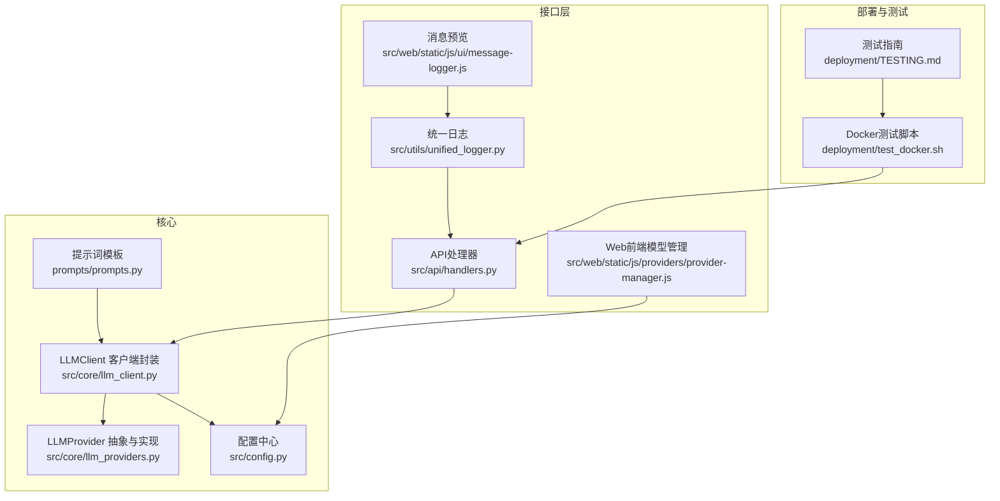
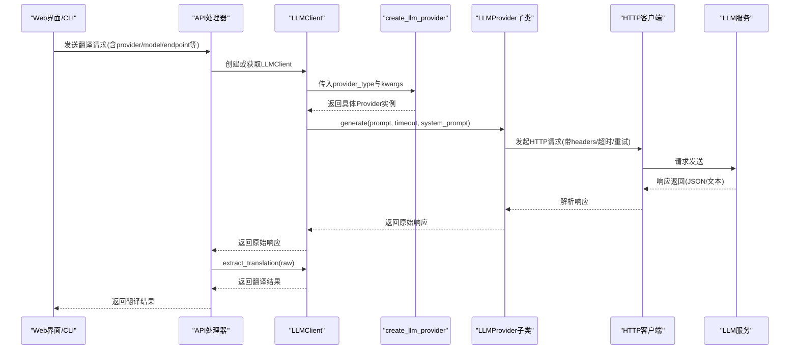
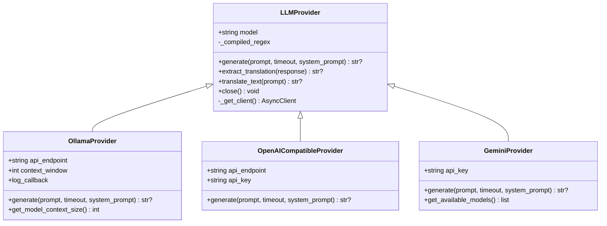
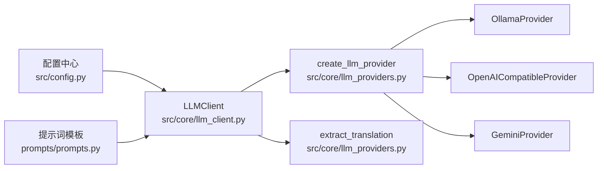

# 扩展LLM提供商

<cite>
**本文引用的文件**
- [src/core/llm_providers.py](file://src/core/llm_providers.py)
- [src/core/llm_client.py](file://src/core/llm_client.py)
- [src/config.py](file://src/config.py)
- [prompts/prompts.py](file://prompts/prompts.py)
- [src/api/handlers.py](file://src/api/handlers.py)
- [src/web/static/js/providers/provider-manager.js](file://src/web/static/js/providers/provider-manager.js)
- [src/web/static/js/ui/message-logger.js](file://src/web/static/js/ui/message-logger.js)
- [src/utils/unified_logger.py](file://src/utils/unified_logger.py)
- [deployment/test_docker.sh](file://deployment/test_docker.sh)
- [deployment/TESTING.md](file://deployment/TESTING.md)
</cite>

## 目录
1. [简介](#简介)
2. [项目结构](#项目结构)
3. [核心组件](#核心组件)
4. [架构总览](#架构总览)
5. [详细组件分析](#详细组件分析)
6. [依赖关系分析](#依赖关系分析)
7. [性能与可靠性考量](#性能与可靠性考量)
8. [故障排查指南](#故障排查指南)
9. [结论](#结论)
10. [附录](#附录)

## 简介
本文件面向希望在现有系统中集成新的LLM服务提供商的开发者，系统性说明LLMProvider抽象基类的设计与实现要求，以及OllamaProvider、GeminiProvider、OpenAICompatibleProvider三种适配器的差异与共性。重点包括：
- 抽象基类LLMProvider的设计：必须实现generate方法；可复用extract_translation进行统一的响应解析。
- 工厂函数create_llm_provider的工作机制：如何根据provider类型与模型名自动选择具体提供商。
- 集成新提供商的步骤：认证、端点配置、错误处理（超时、上下文溢出）、重试逻辑、响应解析一致性。
- 调试技巧：如何使用HTTP客户端直接测试API端点，并对比不同提供商的请求/响应格式差异。

## 项目结构
围绕LLM提供商扩展的相关模块组织如下：
- 核心抽象与实现：src/core/llm_providers.py
- 客户端封装：src/core/llm_client.py
- 配置中心：src/config.py
- 提示词模板：prompts/prompts.py
- Web端模型选择UI：src/web/static/js/providers/provider-manager.js
- 日志与前端预览：src/utils/unified_logger.py、src/web/static/js/ui/message-logger.js
- API路由与作业调度：src/api/handlers.py
- 部署与测试脚本：deployment/test_docker.sh、deployment/TESTING.md

图表来源
- [src/core/llm_providers.py](file://src/core/llm_providers.py#L1-L140)
- [src/core/llm_client.py](file://src/core/llm_client.py#L1-L123)
- [src/config.py](file://src/config.py#L56-L110)
- [prompts/prompts.py](file://prompts/prompts.py#L1-L120)
- [src/api/handlers.py](file://src/api/handlers.py#L1-L120)
- [src/web/static/js/providers/provider-manager.js](file://src/web/static/js/providers/provider-manager.js#L43-L78)
- [src/utils/unified_logger.py](file://src/utils/unified_logger.py#L1-L120)
- [src/web/static/js/ui/message-logger.js](file://src/web/static/js/ui/message-logger.js#L92-L128)
- [deployment/test_docker.sh](file://deployment/test_docker.sh#L78-L95)
- [deployment/TESTING.md](file://deployment/TESTING.md#L70-L88)

章节来源
- [src/core/llm_providers.py](file://src/core/llm_providers.py#L1-L140)
- [src/core/llm_client.py](file://src/core/llm_client.py#L1-L123)
- [src/config.py](file://src/config.py#L56-L110)
- [prompts/prompts.py](file://prompts/prompts.py#L1-L120)
- [src/api/handlers.py](file://src/api/handlers.py#L1-L120)
- [src/web/static/js/providers/provider-manager.js](file://src/web/static/js/providers/provider-manager.js#L43-L78)
- [src/utils/unified_logger.py](file://src/utils/unified_logger.py#L1-L120)
- [src/web/static/js/ui/message-logger.js](file://src/web/static/js/ui/message-logger.js#L92-L128)
- [deployment/test_docker.sh](file://deployment/test_docker.sh#L78-L95)
- [deployment/TESTING.md](file://deployment/TESTING.md#L70-L88)

## 核心组件
- LLMProvider抽象基类
  - 必须实现：generate(prompt, timeout, system_prompt) -> Optional[str]
  - 可复用：extract_translation(response) -> Optional[str]，严格解析<TRANSLATION>...</TRANSLATION>边界标签，忽略思考块与孤儿闭合标签，保证输出一致性
  - 内部工具：持久化httpx.AsyncClient连接池、统一超时配置、重试次数与延迟
- 具体提供商
  - OllamaProvider：本地API，支持system字段、上下文窗口查询与溢出检测
  - OpenAICompatibleProvider：兼容OpenAI格式的API，支持Authorization头与messages数组
  - GeminiProvider：Google生成式AI API，支持systemInstruction字段与模型列表查询
- 工厂函数create_llm_provider：根据provider_type与模型名自动切换，支持Gemini模型名自动识别为Gemini提供商
- LLMClient：统一入口，负责创建/复用提供商实例、调用generate、提取翻译结果

章节来源
- [src/core/llm_providers.py](file://src/core/llm_providers.py#L23-L137)
- [src/core/llm_providers.py](file://src/core/llm_providers.py#L139-L279)
- [src/core/llm_providers.py](file://src/core/llm_providers.py#L281-L361)
- [src/core/llm_providers.py](file://src/core/llm_providers.py#L363-L513)
- [src/core/llm_providers.py](file://src/core/llm_providers.py#L515-L548)
- [src/core/llm_client.py](file://src/core/llm_client.py#L1-L95)
- [src/core/llm_client.py](file://src/core/llm_client.py#L96-L123)

## 架构总览
下图展示了从配置到提示词、再到LLM提供商与客户端的整体流程。

图表来源
- [src/api/handlers.py](file://src/api/handlers.py#L1-L120)
- [src/core/llm_client.py](file://src/core/llm_client.py#L1-L95)
- [src/core/llm_providers.py](file://src/core/llm_providers.py#L515-L548)

## 详细组件分析

### LLMProvider抽象基类设计
- 设计要点
  - 统一接口：generate必须实现，返回原始响应字符串
  - 统一解析：extract_translation严格解析<TRANSLATION>...</TRANSLATION>边界，优先完整边界匹配，其次正则查找；忽略思考块与孤儿闭合标签
  - 连接复用：内部维护httpx.AsyncClient连接池，避免重复建立连接
  - 超时与重试：通过全局配置控制超时、最大尝试次数与重试间隔
- 关键行为
  - 上下文溢出：OllamaProvider在特定错误时抛出ContextOverflowError，便于上层调整分块大小或上下文窗口
  - 模型上下文探测：OllamaProvider支持查询模型上下文上限，用于动态优化

图表来源
- [src/core/llm_providers.py](file://src/core/llm_providers.py#L23-L137)
- [src/core/llm_providers.py](file://src/core/llm_providers.py#L139-L279)
- [src/core/llm_providers.py](file://src/core/llm_providers.py#L281-L361)
- [src/core/llm_providers.py](file://src/core/llm_providers.py#L363-L513)

章节来源
- [src/core/llm_providers.py](file://src/core/llm_providers.py#L23-L137)
- [src/core/llm_providers.py](file://src/core/llm_providers.py#L139-L279)
- [src/core/llm_providers.py](file://src/core/llm_providers.py#L281-L361)
- [src/core/llm_providers.py](file://src/core/llm_providers.py#L363-L513)

### OllamaProvider：本地API适配
- 特点
  - 使用本地Ollama API，支持system字段
  - 支持上下文窗口查询与溢出检测，抛出ContextOverflowError
  - 自动重试与超时处理
- 集成要点
  - 认证：无需API Key
  - 端点：默认API_ENDPOINT，可通过kwargs覆盖
  - 错误处理：针对“上下文过大”等关键词进行特殊处理
  - 建议：结合上下文优化策略，动态调整num_ctx与chunk_size

章节来源
- [src/core/llm_providers.py](file://src/core/llm_providers.py#L139-L279)
- [src/config.py](file://src/config.py#L56-L72)

### OpenAICompatibleProvider：标准OpenAI格式适配
- 特点
  - 使用标准OpenAI格式的messages数组与system角色
  - 支持Authorization头（Bearer Token）
  - 自动重试与超时处理
- 集成要点
  - 认证：api_key参数或环境变量OPENAI_API_KEY
  - 端点：api_endpoint需指向chat.completions风格的URL
  - 错误处理：HTTP状态码与JSON解析异常均纳入重试与告警

章节来源
- [src/core/llm_providers.py](file://src/core/llm_providers.py#L281-L361)
- [src/config.py](file://src/config.py#L76-L82)

### GeminiProvider：Google生成式AI API适配
- 特点
  - 使用Google Generative Language API，支持systemInstruction字段
  - 提供可用模型查询接口，过滤掉不合适的模型
  - 自动重试与超时处理
- 集成要点
  - 认证：api_key参数或环境变量GEMINI_API_KEY
  - 端点：内置模型生成内容URL，无需自定义
  - 错误处理：HTTP状态码与JSON解析异常均纳入重试与告警

章节来源
- [src/core/llm_providers.py](file://src/core/llm_providers.py#L363-L513)
- [src/config.py](file://src/config.py#L74-L76)

### 工厂函数create_llm_provider：提供商选择与自动切换
- 行为
  - 根据provider_type创建对应提供商实例
  - 当provider_type为“ollama”且模型名以“gemini”开头时，自动切换为GeminiProvider
  - GeminiProvider缺少api_key时，优先从环境变量读取，否则抛出异常
- 使用场景
  - Web界面与CLI均可通过provider_type与model参数驱动
  - LLMClient内部通过该工厂创建提供商实例

章节来源
- [src/core/llm_providers.py](file://src/core/llm_providers.py#L515-L548)
- [src/core/llm_client.py](file://src/core/llm_client.py#L96-L123)

### 提示词与响应解析一致性
- 提示词模板
  - 通过prompts/prompts.py生成标准化system/user提示，明确要求输出严格包裹在<TRANSLATION>...</TRANSLATION>内
  - 对占位符保留、换行与缩进等细节有明确约束
- 响应解析
  - LLMProvider.extract_translation严格校验边界标签，忽略思考块与孤儿闭合标签
  - 若未在边界找到标签，回退到正则匹配，但会发出警告，提示LLM可能未遵循指令

章节来源
- [prompts/prompts.py](file://prompts/prompts.py#L1-L120)
- [src/core/llm_providers.py](file://src/core/llm_providers.py#L65-L130)

### Web端模型选择与展示
- ProviderManager根据provider类型动态渲染模型选项
  - Gemini：展示模型名称、显示名、描述及输入/输出token限制
  - OpenAI：展示模型值与标签
  - Ollama：展示模型字符串
- 与配置中心配合，确保默认模型与端点一致

章节来源
- [src/web/static/js/providers/provider-manager.js](file://src/web/static/js/providers/provider-manager.js#L43-L78)
- [src/config.py](file://src/config.py#L74-L76)

## 依赖关系分析
- 组件耦合
  - LLMClient依赖create_llm_provider与LLMProvider族，形成“客户端-工厂-抽象”的清晰分层
  - LLMProvider内部依赖配置中心的超时、重试、上下文窗口等参数
  - 提示词模板与响应解析共同保障输出格式一致性
- 外部依赖
  - httpx.AsyncClient用于异步HTTP通信
  - Google Generative Language API、Ollama API、OpenAI兼容API

图表来源
- [src/config.py](file://src/config.py#L56-L72)
- [src/core/llm_client.py](file://src/core/llm_client.py#L1-L95)
- [src/core/llm_providers.py](file://src/core/llm_providers.py#L515-L548)
- [prompts/prompts.py](file://prompts/prompts.py#L1-L120)

章节来源
- [src/config.py](file://src/config.py#L56-L72)
- [src/core/llm_client.py](file://src/core/llm_client.py#L1-L95)
- [src/core/llm_providers.py](file://src/core/llm_providers.py#L515-L548)
- [prompts/prompts.py](file://prompts/prompts.py#L1-L120)

## 性能与可靠性考量
- 连接池与超时
  - LLMProvider内部使用httpx.AsyncClient并设置连接池上限与超时，减少握手开销
- 重试与退避
  - 通过MAX_TRANSLATION_ATTEMPTS与RETRY_DELAY_SECONDS控制重试次数与间隔
- 上下文优化
  - OllamaProvider支持查询模型上下文上限，结合上下文优化策略动态调整num_ctx与chunk_size
- 日志与可观测性
  - 统一日志系统记录LLM请求/响应、进度与错误详情，便于定位问题

章节来源
- [src/core/llm_providers.py](file://src/core/llm_providers.py#L139-L279)
- [src/config.py](file://src/config.py#L60-L65)
- [src/utils/unified_logger.py](file://src/utils/unified_logger.py#L140-L182)

## 故障排查指南
- 健康检查与端点测试
  - 使用部署脚本中的健康检查命令验证服务运行状态
  - 在浏览器或curl中访问健康端点，确认服务正常
- 直接HTTP测试
  - Ollama：向API_ENDPOINT发送POST请求，携带model、prompt、system、options等字段
  - OpenAI兼容：向api_endpoint发送POST请求，携带Authorization头与messages数组
  - Gemini：向模型生成内容URL发送POST请求，携带x-goog-api-key头与contents/systemInstruction
- 常见错误与对策
  - 超时：增大REQUEST_TIMEOUT或减少chunk_size
  - 上下文溢出：降低chunk_size或提升OLLAMA_NUM_CTX（Ollama），或调整模型上下文
  - JSON解析失败：检查响应是否为JSON，必要时在上游增加日志
  - 缺少API Key：确保GEMINI_API_KEY或OPENAI_API_KEY已正确设置
- 前端预览与日志
  - 使用前端消息预览功能，快速查看<TRANSLATION>标签内的翻译文本
  - 通过统一日志查看LLM请求/响应详情，定位边界标签缺失或格式不规范问题

章节来源
- [deployment/test_docker.sh](file://deployment/test_docker.sh#L78-L95)
- [deployment/TESTING.md](file://deployment/TESTING.md#L70-L88)
- [src/web/static/js/ui/message-logger.js](file://src/web/static/js/ui/message-logger.js#L92-L128)
- [src/utils/unified_logger.py](file://src/utils/unified_logger.py#L140-L182)

## 结论
通过LLMProvider抽象基类与工厂函数create_llm_provider，系统实现了对多种LLM提供商的统一接入与一致的响应解析。开发者只需遵循以下原则即可快速集成新提供商：
- 实现generate方法，返回原始响应字符串
- 复用extract_translation，确保输出严格包裹在<TRANSLATION>...</TRANSLATION>内
- 正确处理认证、端点、超时、重试与上下文溢出
- 保持响应解析一致性，避免额外文本污染边界标签

## 附录

### 开发者集成新提供商的步骤清单
- 继承LLMProvider并实现generate
- 如需支持system提示，确保在请求中传递system字段
- 在create_llm_provider中注册新提供商类型
- 在Web前端provider-manager.js中补充模型展示逻辑
- 在配置中心添加必要的环境变量与默认值
- 编写HTTP测试脚本，验证请求/响应格式
- 使用统一日志与前端预览功能进行联调

章节来源
- [src/core/llm_providers.py](file://src/core/llm_providers.py#L515-L548)
- [src/web/static/js/providers/provider-manager.js](file://src/web/static/js/providers/provider-manager.js#L43-L78)
- [src/config.py](file://src/config.py#L74-L76)
- [deployment/TESTING.md](file://deployment/TESTING.md#L70-L88)