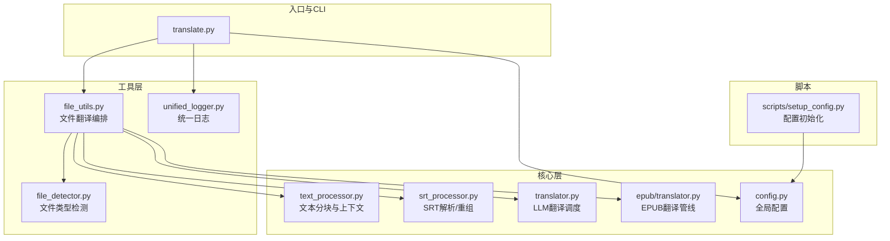
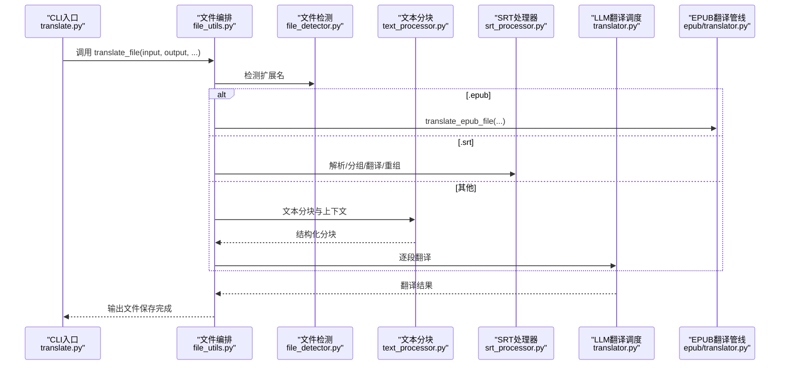
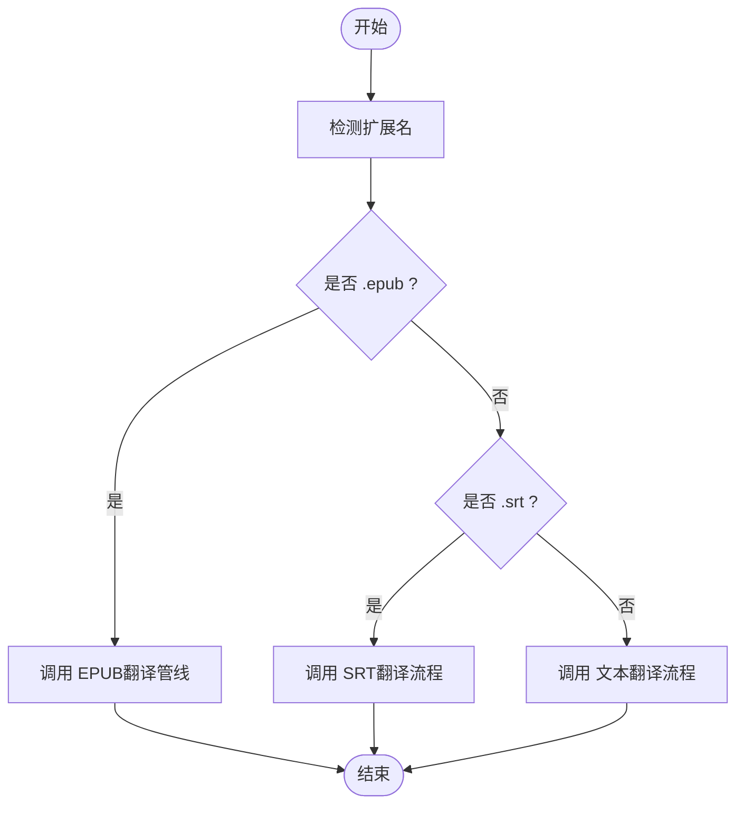
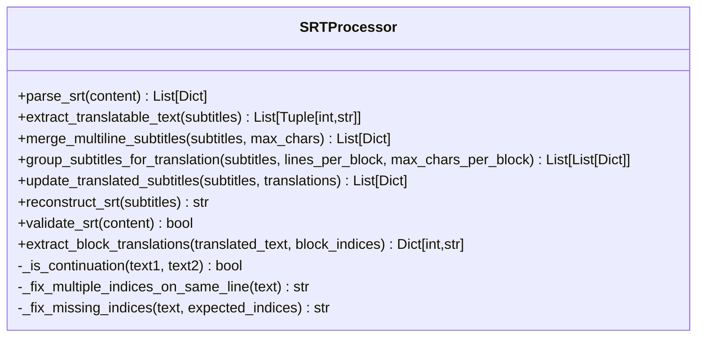
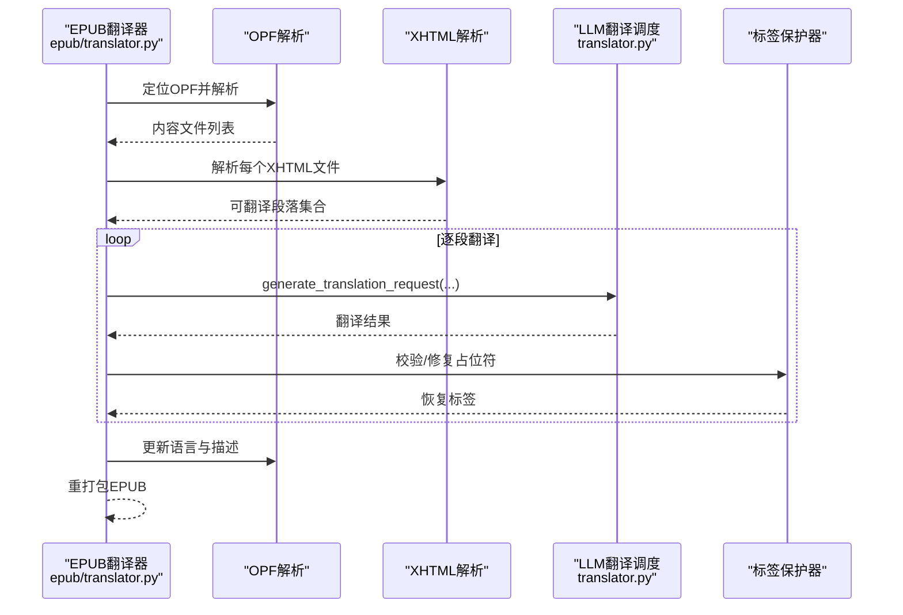
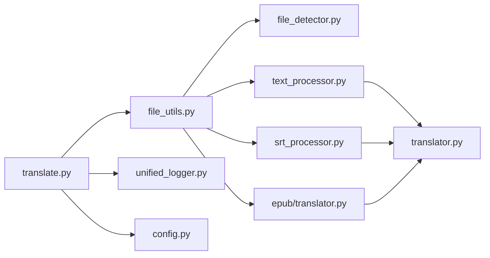

# 添加新文件格式支持

<cite>
**本文引用的文件**
- [src/utils/file_detector.py](file://src/utils/file_detector.py)
- [src/utils/file_utils.py](file://src/utils/file_utils.py)
- [src/core/text_processor.py](file://src/core/text_processor.py)
- [src/core/srt_processor.py](file://src/core/srt_processor.py)
- [src/core/translator.py](file://src/core/translator.py)
- [src/core/epub/translator.py](file://src/core/epub/translator.py)
- [src/config.py](file://src/config.py)
- [translate.py](file://translate.py)
- [scripts/setup_config.py](file://scripts/setup_config.py)
- [src/utils/unified_logger.py](file://src/utils/unified_logger.py)
</cite>

## 目录
1. [简介](#简介)
2. [项目结构](#项目结构)
3. [核心组件](#核心组件)
4. [架构总览](#架构总览)
5. [详细组件分析](#详细组件分析)
6. [依赖关系分析](#依赖关系分析)
7. [性能考量](#性能考量)
8. [故障排查指南](#故障排查指南)
9. [结论](#结论)
10. [附录：新增处理器步骤与示例](#附录新增处理器步骤与示例)

## 简介
本指南面向希望扩展新文件格式支持的开发者，系统讲解项目中的文件处理架构与扩展流程。重点包括：
- FileDetector 如何识别文件类型并路由到相应处理器
- 新增处理器的实现规范（必须继承 BaseProcessor 并实现 process_file 与 save_file）
- 以 SRT 处理器为例，说明如何解析字幕块、保持时间轴格式、处理多行字幕
- 文本处理器作为简单文本处理的参考实现
- 处理器注册机制与在 file_service.py 中添加映射的方法
- 调试建议（使用 setup_config.py 脚本生成测试文件，通过 translate.py 进行端到端测试）
- 格式保持的重要性：新处理器必须确保非文本内容（如 EPUB 的 HTML 标签、SRT 的时间码）在翻译后保持不变

## 项目结构
项目采用分层与功能模块化组织：
- utils 层：通用工具（文件检测、文件操作、日志等）
- core 层：核心翻译逻辑与各格式处理器（文本、SRT、EPUB）
- api 层：Web 接口相关服务（文件服务等）
- scripts 层：辅助脚本（配置初始化等）

图表来源
- [translate.py](file://translate.py#L1-L147)
- [src/utils/file_detector.py](file://src/utils/file_detector.py#L1-L48)
- [src/utils/file_utils.py](file://src/utils/file_utils.py#L1-L405)
- [src/core/text_processor.py](file://src/core/text_processor.py#L1-L174)
- [src/core/srt_processor.py](file://src/core/srt_processor.py#L1-L236)
- [src/core/translator.py](file://src/core/translator.py#L1-L371)
- [src/core/epub/translator.py](file://src/core/epub/translator.py#L1-L800)
- [src/config.py](file://src/config.py#L1-L225)
- [scripts/setup_config.py](file://scripts/setup_config.py#L1-L89)
- [src/utils/unified_logger.py](file://src/utils/unified_logger.py#L1-L432)

章节来源
- [translate.py](file://translate.py#L1-L147)
- [src/utils/file_detector.py](file://src/utils/file_detector.py#L1-L48)
- [src/utils/file_utils.py](file://src/utils/file_utils.py#L1-L405)
- [src/core/text_processor.py](file://src/core/text_processor.py#L1-L174)
- [src/core/srt_processor.py](file://src/core/srt_processor.py#L1-L236)
- [src/core/translator.py](file://src/core/translator.py#L1-L371)
- [src/core/epub/translator.py](file://src/core/epub/translator.py#L1-L800)
- [src/config.py](file://src/config.py#L1-L225)
- [scripts/setup_config.py](file://scripts/setup_config.py#L1-L89)
- [src/utils/unified_logger.py](file://src/utils/unified_logger.py#L1-L432)

## 核心组件
- 文件类型检测：基于扩展名判断 txt、epub、srt，不支持则抛出异常
- 文件翻译编排：根据扩展名选择对应翻译路径（EPUB、SRT 或文本）
- 文本处理器：提供句子边界对齐、上下文保留的分块算法
- SRT 处理器：解析/合并/重组字幕块，保持时间轴与索引格式
- EPUB 翻译管线：抽取/收集翻译任务、占位符保护与恢复、元数据更新、重打包
- 统一日志：为 CLI/Web 提供一致的日志输出与状态上报
- 配置中心：集中管理模型、上下文窗口、SRT 分块参数、签名开关等

章节来源
- [src/utils/file_detector.py](file://src/utils/file_detector.py#L1-L48)
- [src/utils/file_utils.py](file://src/utils/file_utils.py#L1-L405)
- [src/core/text_processor.py](file://src/core/text_processor.py#L1-L174)
- [src/core/srt_processor.py](file://src/core/srt_processor.py#L1-L236)
- [src/core/epub/translator.py](file://src/core/epub/translator.py#L1-L800)
- [src/utils/unified_logger.py](file://src/utils/unified_logger.py#L1-L432)
- [src/config.py](file://src/config.py#L1-L225)

## 架构总览
文件处理从 CLI 入口开始，通过文件检测确定类型，再由文件编排器选择具体翻译流程；文本与 SRT 使用统一的 LLM 翻译调度器；EPUB 则走专用管线，包含占位符保护与标签恢复。

图表来源
- [translate.py](file://translate.py#L1-L147)
- [src/utils/file_utils.py](file://src/utils/file_utils.py#L1-L405)
- [src/utils/file_detector.py](file://src/utils/file_detector.py#L1-L48)
- [src/core/text_processor.py](file://src/core/text_processor.py#L1-L174)
- [src/core/srt_processor.py](file://src/core/srt_processor.py#L1-L236)
- [src/core/translator.py](file://src/core/translator.py#L1-L371)
- [src/core/epub/translator.py](file://src/core/epub/translator.py#L1-L800)

## 详细组件分析

### 文件类型检测与路由
- FileDetector 基于扩展名返回类型枚举，不支持的类型抛出异常
- translate_file 在编排层根据扩展名选择 EPUB/SRT 或文本翻译路径

图表来源
- [src/utils/file_detector.py](file://src/utils/file_detector.py#L1-L48)
- [src/utils/file_utils.py](file://src/utils/file_utils.py#L1-L405)

章节来源
- [src/utils/file_detector.py](file://src/utils/file_detector.py#L1-L48)
- [src/utils/file_utils.py](file://src/utils/file_utils.py#L1-L405)

### 文本处理器（参考实现）
- 提供按句子边界对齐的分块算法，避免切分到句中
- 支持上下文前后缀，保证翻译一致性
- 适合纯文本格式的翻译扩展

章节来源
- [src/core/text_processor.py](file://src/core/text_processor.py#L1-L174)

### SRT 处理器（完整示例）
- 解析：按块读取索引、时间轴与正文，保持原始文本
- 合并：按最大字符数与续写规则合并相邻字幕
- 分组：按行数与字符数限制将字幕分组，便于批量翻译
- 重组：重建 SRT 内容，可选添加项目签名注释
- 回写：从 LLM 返回的块中提取对应索引的翻译结果

图表来源
- [src/core/srt_processor.py](file://src/core/srt_processor.py#L1-L236)

章节来源
- [src/core/srt_processor.py](file://src/core/srt_processor.py#L1-L236)

### EPUB 翻译管线（复杂流程）
- 抽取与解析：解压 EPUB、定位 OPF、解析 XHTML 内容
- 作业收集：从内容文件中收集可翻译段落，支持忽略标签与内容块标签
- 翻译：逐段调用 LLM 翻译请求，维护翻译上下文
- 占位符保护与恢复：在翻译前后校验占位符，必要时重试
- 应用翻译：将翻译结果回写到元素文本或尾部，清理残留占位符
- 元数据更新：更新语言与描述信息
- 重打包：写回 XHTML 并重新压缩为 EPUB

图表来源
- [src/core/epub/translator.py](file://src/core/epub/translator.py#L1-L800)
- [src/core/translator.py](file://src/core/translator.py#L1-L371)

章节来源
- [src/core/epub/translator.py](file://src/core/epub/translator.py#L1-L800)
- [src/core/translator.py](file://src/core/translator.py#L1-L371)

### LLM 翻译调度（通用）
- 生成翻译请求：构造系统与用户提示词，记录请求/响应日志
- 上下文优化：根据模型能力动态调整上下文窗口与分块大小
- 错误处理：缺失翻译标签、输入回显等情况的降级与告警
- 进度与统计：回调通知进度与统计信息

章节来源
- [src/core/translator.py](file://src/core/translator.py#L1-L371)

## 依赖关系分析
- translate.py 作为 CLI 入口，依赖 file_utils.translate_file
- file_utils.translate_file 依据扩展名路由至 EPUB/SRT/文本翻译
- 文本翻译链路：file_utils -> text_processor -> translator
- SRT 翻译链路：file_utils -> srt_processor -> translator
- EPUB 翻译链路：file_utils -> epub/translator（内部再调用 translator）

图表来源
- [translate.py](file://translate.py#L1-L147)
- [src/utils/file_utils.py](file://src/utils/file_utils.py#L1-L405)
- [src/utils/file_detector.py](file://src/utils/file_detector.py#L1-L48)
- [src/core/text_processor.py](file://src/core/text_processor.py#L1-L174)
- [src/core/srt_processor.py](file://src/core/srt_processor.py#L1-L236)
- [src/core/translator.py](file://src/core/translator.py#L1-L371)
- [src/core/epub/translator.py](file://src/core/epub/translator.py#L1-L800)
- [src/utils/unified_logger.py](file://src/utils/unified_logger.py#L1-L432)
- [src/config.py](file://src/config.py#L1-L225)

章节来源
- [translate.py](file://translate.py#L1-L147)
- [src/utils/file_utils.py](file://src/utils/file_utils.py#L1-L405)
- [src/utils/file_detector.py](file://src/utils/file_detector.py#L1-L48)
- [src/core/text_processor.py](file://src/core/text_processor.py#L1-L174)
- [src/core/srt_processor.py](file://src/core/srt_processor.py#L1-L236)
- [src/core/translator.py](file://src/core/translator.py#L1-L371)
- [src/core/epub/translator.py](file://src/core/epub/translator.py#L1-L800)
- [src/utils/unified_logger.py](file://src/utils/unified_logger.py#L1-L432)
- [src/config.py](file://src/config.py#L1-L225)

## 性能考量
- 文本分块：合理设置每块行数，避免过小导致过多请求，过大导致上下文溢出
- 上下文优化：根据模型 num_ctx 自动调整，减少失败重试
- SRT 分组：控制每块字符数与行数，平衡 LLM 承载与翻译质量
- EPUB 翻译：占位符校验与重试会增加往返次数，建议在弱模型场景启用快速模式（剥离标签）

## 故障排查指南
- 配置初始化：使用 setup_config.py 快速复制模板并交互式配置 .env
- 端到端测试：通过 translate.py 指定输入/输出、源语言/目标语言、模型与提供方进行翻译
- 日志查看：CLI 使用统一日志系统，可在终端看到 LLM 请求/响应、进度与错误详情
- 常见问题：
  - 不支持的文件类型：检查扩展名是否在 FileDetector 支持列表中
  - SRT 格式无效：确认时间轴格式与索引连续性
  - EPUB 标签错位：弱模型建议启用快速模式，或检查占位符修复日志

章节来源
- [scripts/setup_config.py](file://scripts/setup_config.py#L1-L89)
- [translate.py](file://translate.py#L1-L147)
- [src/utils/unified_logger.py](file://src/utils/unified_logger.py#L1-L432)

## 结论
新增文件格式支持的关键在于：
- 明确文件类型检测与路由
- 实现处理器接口（process_file/save_file），并确保非文本内容格式保持
- 在编排层添加扩展名到处理器的映射
- 通过 CLI/脚本进行端到端验证与调试

## 附录：新增处理器步骤与示例

### 1. 设计处理器类
- 必须继承 BaseProcessor（若存在）并实现以下方法：
  - process_file(input_path, config) -> 输出内容/中间结构
  - save_file(output_path, content) -> 保存文件
- 若无 BaseProcessor，可参考现有 SRT/文本处理器的职责划分与命名约定

章节来源
- [src/core/srt_processor.py](file://src/core/srt_processor.py#L1-L236)
- [src/core/text_processor.py](file://src/core/text_processor.py#L1-L174)

### 2. 解析与格式保持要点（以 SRT 为例）
- 解析阶段：严格匹配索引、时间轴格式，保留换行与空行
- 翻译阶段：仅翻译正文部分，不改动索引与时间轴
- 重组阶段：按原顺序重建 SRT，必要时追加签名注释
- 多行字幕：按字符数与续写规则合并，确保时间轴正确延续

章节来源
- [src/core/srt_processor.py](file://src/core/srt_processor.py#L1-L236)

### 3. 注册处理器映射
- 在文件编排层（例如 file_utils.translate_file）中，根据扩展名添加分支：
  - 当扩展名为你的新格式时，调用你实现的处理器
- 保持与现有 EPUB/SRT/文本分支一致的参数传递与回调风格

章节来源
- [src/utils/file_utils.py](file://src/utils/file_utils.py#L1-L405)

### 4. 配置与调试
- 使用 setup_config.py 生成/校验 .env，确保 LLM 提供方与模型配置正确
- 使用 translate.py 进行端到端测试，观察日志输出与错误提示
- 对于复杂格式（如 EPUB），可先用快速模式验证流程，再逐步引入标签保护逻辑

章节来源
- [scripts/setup_config.py](file://scripts/setup_config.py#L1-L89)
- [translate.py](file://translate.py#L1-L147)
- [src/utils/unified_logger.py](file://src/utils/unified_logger.py#L1-L432)