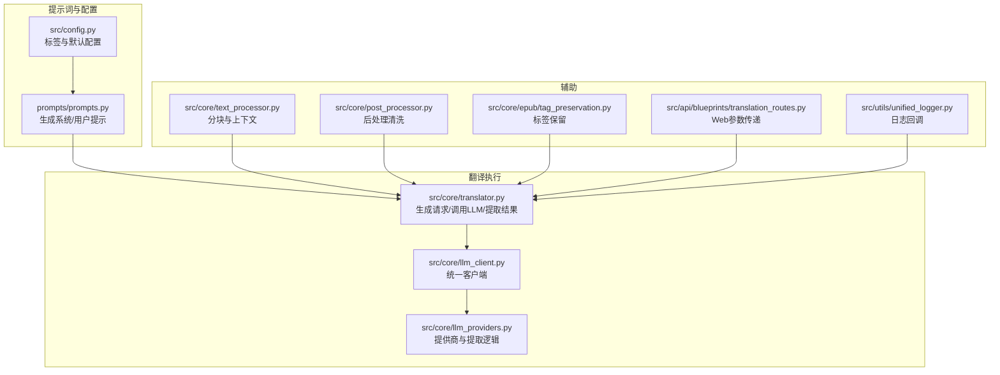
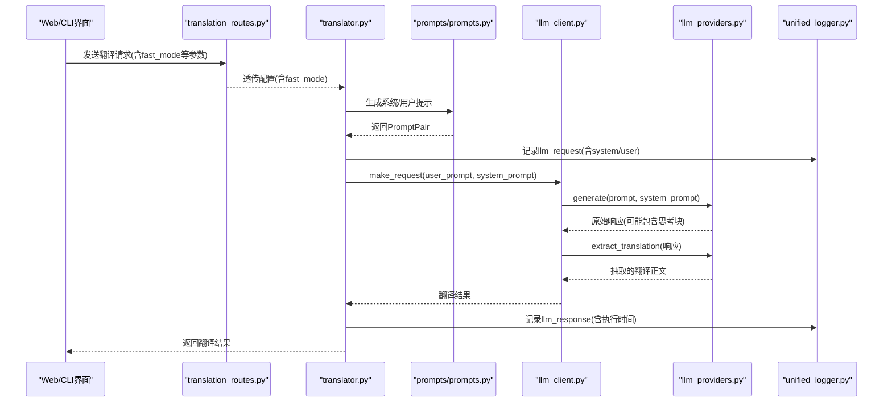
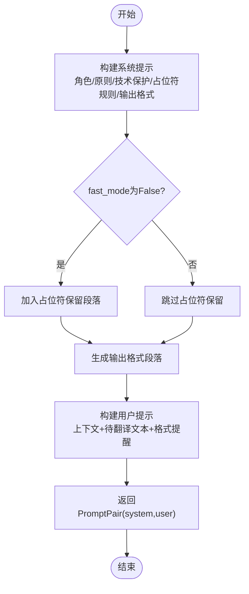

# 自定义提示词模板

<cite>
**本文引用的文件**
- [prompts/prompts.py](file://prompts/prompts.py)
- [src/core/translator.py](file://src/core/translator.py)
- [src/core/llm_client.py](file://src/core/llm_client.py)
- [src/core/llm_providers.py](file://src/core/llm_providers.py)
- [src/config.py](file://src/config.py)
- [src/utils/unified_logger.py](file://src/utils/unified_logger.py)
- [src/api/blueprints/translation_routes.py](file://src/api/blueprints/translation_routes.py)
- [src/core/text_processor.py](file://src/core/text_processor.py)
- [src/core/post_processor.py](file://src/core/post_processor.py)
- [src/core/epub/tag_preservation.py](file://src/core/epub/tag_preservation.py)
</cite>

## 目录
1. [简介](#简介)
2. [项目结构](#项目结构)
3. [核心组件](#核心组件)
4. [架构总览](#架构总览)
5. [详细组件分析](#详细组件分析)
6. [依赖关系分析](#依赖关系分析)
7. [性能考量](#性能考量)
8. [故障排查指南](#故障排查指南)
9. [结论](#结论)
10. [附录](#附录)

## 简介
本指南面向希望优化翻译质量的开发者，聚焦“提示词模板”的设计与定制。提示词在翻译流程中扮演“指令与上下文”的双重角色：
- 系统提示（System Prompt）：定义翻译角色、语言目标、输出格式约束、占位符保留规则等稳定不变的指令。
- 用户提示（User Prompt）：注入待翻译文本、前后文、先前译文上下文等动态内容。

本文将详解 generate_translation_prompt 如何构建系统与用户提示；如何针对不同领域（如技术文档、文学作品、字幕）定制提示模板；如何新增提示模板变体并在代码中通过参数选择使用；强调标签一致性（TRANSLATE_TAG_IN/OUT 与 INPUT_TAG_IN/OUT）与提取逻辑的匹配；并给出 A/B 测试与日志回调对比的实践建议。

## 项目结构
围绕提示词与翻译流程的关键模块如下：
- 提示词模板：prompts/prompts.py
- 翻译主流程：src/core/translator.py
- LLM 客户端与提供商：src/core/llm_client.py、src/core/llm_providers.py
- 配置与标签：src/config.py
- 日志系统：src/utils/unified_logger.py
- Web 接口参数：src/api/blueprints/translation_routes.py
- 文本分块与上下文：src/core/text_processor.py
- 后处理清洗：src/core/post_processor.py
- EPUB 标签保留：src/core/epub/tag_preservation.py

图表来源
- [prompts/prompts.py](file://prompts/prompts.py#L1-L206)
- [src/core/translator.py](file://src/core/translator.py#L26-L121)
- [src/core/llm_client.py](file://src/core/llm_client.py#L1-L98)
- [src/core/llm_providers.py](file://src/core/llm_providers.py#L1-L130)
- [src/config.py](file://src/config.py#L101-L106)
- [src/utils/unified_logger.py](file://src/utils/unified_logger.py#L1-L120)
- [src/api/blueprints/translation_routes.py](file://src/api/blueprints/translation_routes.py#L26-L84)
- [src/core/text_processor.py](file://src/core/text_processor.py#L42-L174)
- [src/core/post_processor.py](file://src/core/post_processor.py#L1-L169)
- [src/core/epub/tag_preservation.py](file://src/core/epub/tag_preservation.py#L1-L80)

章节来源
- [prompts/prompts.py](file://prompts/prompts.py#L1-L206)
- [src/core/translator.py](file://src/core/translator.py#L26-L121)
- [src/core/llm_client.py](file://src/core/llm_client.py#L1-L98)
- [src/core/llm_providers.py](file://src/core/llm_providers.py#L1-L130)
- [src/config.py](file://src/config.py#L101-L106)
- [src/utils/unified_logger.py](file://src/utils/unified_logger.py#L1-L120)
- [src/api/blueprints/translation_routes.py](file://src/api/blueprints/translation_routes.py#L26-L84)
- [src/core/text_processor.py](file://src/core/text_processor.py#L42-L174)
- [src/core/post_processor.py](file://src/core/post_processor.py#L1-L169)
- [src/core/epub/tag_preservation.py](file://src/core/epub/tag_preservation.py#L1-L80)

## 核心组件
- 提示词生成器：generate_translation_prompt 负责拼装系统提示与用户提示，支持多语言示例、占位符保留、输出格式约束、快速模式（fast_mode）等。
- LLM 客户端：LLMClient 将系统提示与用户提示分别传给提供商；extract_translation 使用配置的标签从原始响应中抽取翻译正文。
- 提供商提取：LLMProvider.extract_translation 严格匹配 TRANSLATE_TAG_IN/OUT 边界，必要时回退到正则查找，并忽略内部思考块。
- 日志回调：UnifiedLogger 支持结构化输出 LLM 请求/响应，便于 A/B 对比与问题定位。
- Web 参数：translation_routes 将 fast_mode 等参数透传至翻译流程。

章节来源
- [prompts/prompts.py](file://prompts/prompts.py#L87-L206)
- [src/core/llm_client.py](file://src/core/llm_client.py#L32-L69)
- [src/core/llm_providers.py](file://src/core/llm_providers.py#L65-L130)
- [src/utils/unified_logger.py](file://src/utils/unified_logger.py#L140-L182)
- [src/api/blueprints/translation_routes.py](file://src/api/blueprints/translation_routes.py#L50-L64)

## 架构总览
提示词在翻译链路中的位置与交互如下：

图表来源
- [src/api/blueprints/translation_routes.py](file://src/api/blueprints/translation_routes.py#L26-L84)
- [src/core/translator.py](file://src/core/translator.py#L26-L121)
- [prompts/prompts.py](file://prompts/prompts.py#L87-L206)
- [src/core/llm_client.py](file://src/core/llm_client.py#L32-L69)
- [src/core/llm_providers.py](file://src/core/llm_providers.py#L65-L130)
- [src/utils/unified_logger.py](file://src/utils/unified_logger.py#L140-L182)

## 详细组件分析

### 提示词结构设计与生成逻辑
- 系统提示（System Prompt）
  - 角色与语言目标：明确翻译角色、源/目标语言、输出仅限目标语言。
  - 翻译原则：信达雅、风格保持、文化适配、布局与换行保留。
  - 技术内容保护：代码、命令、路径、URL、标识符等不翻译。
  - 占位符保留（可选）：当 fast_mode=False 时启用，严格禁止修改/移除/解释占位符，必须保持原位置与空格。
  - 输出格式约束：限定仅翻译输入文本区间，强制以 TRANSLATE_TAG_IN 开头、TRANSLATE_TAG_OUT 结尾，禁止额外注释或问候语。
- 用户提示（User Prompt）
  - 上下文：previous_translation_context 用于前后文一致性。
  - 待翻译文本：使用 INPUT_TAG_IN/INPUT_TAG_OUT 包裹 main_content。
  - 提醒格式：重复输出格式要求，强调必须以 TRANSLATE_TAG_IN 开头、结尾。

图表来源
- [prompts/prompts.py](file://prompts/prompts.py#L87-L206)

章节来源
- [prompts/prompts.py](file://prompts/prompts.py#L87-L206)

### 字幕提示模板与自定义指令
- generate_subtitle_block_prompt 专为字幕翻译设计：
  - 每条字幕带索引标记 [index]text，必须严格保留索引与换行。
  - 输出格式同样受 _get_output_format_section 约束。
  - 支持 custom_instructions 注入领域特定指令（如语气、风格、长度限制）。

章节来源
- [prompts/prompts.py](file://prompts/prompts.py#L209-L321)

### 标签一致性与提取逻辑匹配
- 配置标签
  - TRANSLATE_TAG_IN/OUT：用于包裹翻译正文。
  - INPUT_TAG_IN/OUT：用于包裹待翻译文本。
- 提供商提取
  - LLMProvider.extract_translation 会：
    - 先移除内部思考块（识别 