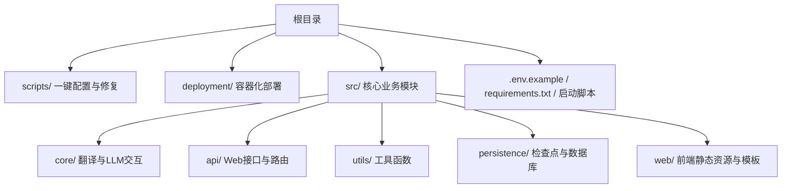
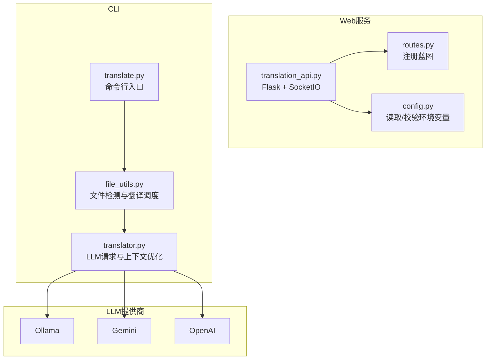
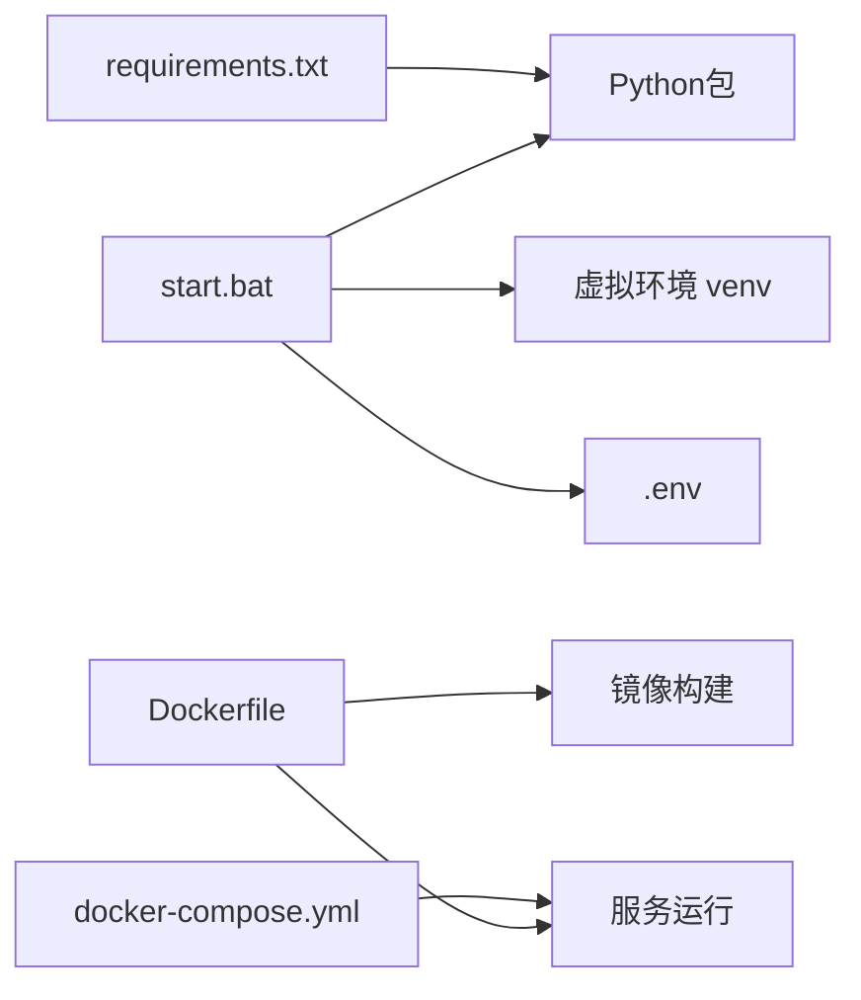

# 快速开始

<cite>
**本文引用的文件**
- [.env.example](file://.env.example)
- [requirements.txt](file://requirements.txt)
- [start.bat](file://start.bat)
- [translate.py](file://translate.py)
- [translation_api.py](file://translation_api.py)
- [src/config.py](file://src/config.py)
- [src/utils/env_helper.py](file://src/utils/env_helper.py)
- [scripts/setup_config.py](file://scripts/setup_config.py)
- [scripts/fix_installation.py](file://scripts/fix_installation.py)
- [src/utils/file_utils.py](file://src/utils/file_utils.py)
- [src/core/translator.py](file://src/core/translator.py)
- [src/api/routes.py](file://src/api/routes.py)
- [deployment/Dockerfile](file://deployment/Dockerfile)
- [deployment/docker-compose.yml](file://deployment/docker-compose.yml)
</cite>

## 目录
1. [简介](#简介)
2. [项目结构](#项目结构)
3. [核心组件](#核心组件)
4. [架构总览](#架构总览)
5. [详细组件分析](#详细组件分析)
6. [依赖关系分析](#依赖关系分析)
7. [性能与参数建议](#性能与参数建议)
8. [故障排查指南](#故障排查指南)
9. [结论](#结论)
10. [附录](#附录)

## 简介
本指南面向完全零经验的开发者，帮助你在最短时间内运行 TranslateBookWithLLM，并完成一次端到端的翻译任务（TXT 文件从英文翻译为中文）。你将学会：
- 克隆仓库与准备环境
- 安装Python依赖
- 配置环境变量（基于 .env.example 创建本地 .env）
- 选择LLM提供商（Ollama/Gemini/OpenAI），并填写对应密钥或端点
- 启动Web服务（通过 start.bat 或直接运行 translation_api.py）
- 使用CLI工具 translate.py 执行翻译任务
- 完整的端到端示例流程
- 常见初始化问题与解决方案
- 安装成功后的验证检查点

## 项目结构
该仓库采用“按功能域分层”的组织方式：
- 根目录：入口脚本、配置模板与Docker部署
- src：核心业务逻辑（翻译、EPUB/SRT处理、LLM客户端、配置加载等）
- scripts：辅助工具（一键配置、修复安装问题）
- deployment：容器化部署（Dockerfile、docker-compose）

图表来源
- [start.bat](file://start.bat#L1-L211)
- [translation_api.py](file://translation_api.py#L1-L146)
- [src/config.py](file://src/config.py#L1-L225)

章节来源
- [start.bat](file://start.bat#L1-L211)
- [translation_api.py](file://translation_api.py#L1-L146)
- [src/config.py](file://src/config.py#L1-L225)

## 核心组件
- 环境配置与加载：通过 .env 加载配置，支持默认值与提示信息
- LLM提供商适配：支持 Ollama、Gemini、OpenAI；自动根据配置选择
- CLI翻译：translate.py 提供命令行翻译入口，支持TXT/EPUB/SRT
- Web服务：translation_api.py 提供Flask+SocketIO的Web界面与REST API
- 文件处理：根据扩展名自动识别格式并调用对应翻译流程
- 上下文优化：针对Ollama自动估算token并调整上下文窗口与块大小

章节来源
- [src/config.py](file://src/config.py#L1-L225)
- [translate.py](file://translate.py#L1-L147)
- [translation_api.py](file://translation_api.py#L1-L146)
- [src/utils/file_utils.py](file://src/utils/file_utils.py#L1-L405)
- [src/core/translator.py](file://src/core/translator.py#L1-L371)

## 架构总览
Web服务与CLI共享同一套翻译引擎与配置系统。Web服务负责UI与REST API，CLI负责批量与自动化场景。

图表来源
- [translation_api.py](file://translation_api.py#L1-L146)
- [src/api/routes.py](file://src/api/routes.py#L1-L66)
- [src/config.py](file://src/config.py#L1-L225)
- [translate.py](file://translate.py#L1-L147)
- [src/utils/file_utils.py](file://src/utils/file_utils.py#L1-L405)
- [src/core/translator.py](file://src/core/translator.py#L1-L371)

## 详细组件分析

### 环境配置与LLM提供商设置
- .env.example 提供了默认端口、模型、语言、上下文窗口、重试策略等配置项
- 支持三种LLM提供商：ollama、gemini、openai
- 当未找到 .env 时，程序会打印提示并使用默认值运行，但强烈建议手动配置

章节来源
- [.env.example](file://.env.example#L1-L45)
- [src/config.py](file://src/config.py#L1-L225)
- [src/utils/env_helper.py](file://src/utils/env_helper.py#L1-L239)
- [scripts/setup_config.py](file://scripts/setup_config.py#L1-L89)

### Web服务启动流程（推荐方式：start.bat）
- 自动检测Python版本与路径
- 自动创建/激活虚拟环境
- 检测requirements变化并升级依赖
- 自动复制 .env.example 到 .env 并打开编辑
- 自动创建输出目录
- 读取 .env 中的端口，启动Flask应用并在浏览器中打开
- 服务器健康检查地址与接口说明会在日志中打印

章节来源
- [start.bat](file://start.bat#L1-L211)
- [translation_api.py](file://translation_api.py#L1-L146)

### Web服务启动流程（直接运行）
- 运行 translation_api.py 启动Flask+SocketIO服务
- 启动前进行配置校验（端口、模型、端点等）
- 输出服务器地址、健康检查URL、支持的文件格式等信息
- 可绑定到所有网络接口（生产环境建议使用WSGI）

章节来源
- [translation_api.py](file://translation_api.py#L1-L146)

### CLI翻译流程（translate.py）
- 解析命令行参数（输入文件、输出文件、源语言、目标语言、模型、块大小、提供商、密钥等）
- 自动推断文件类型（TXT/EPUB/SRT）
- 对于EPUB，若检测到小模型且未启用fast模式，会给出推荐提示
- 调用文件处理模块进行分块、翻译、落盘
- 提供统一的日志回调与进度统计

章节来源
- [translate.py](file://translate.py#L1-L147)
- [src/utils/file_utils.py](file://src/utils/file_utils.py#L1-L405)
- [src/core/translator.py](file://src/core/translator.py#L1-L371)

### 端到端示例：将TXT从英文翻译为中文
- 准备一个英文TXT文件（例如 sample.txt）
- 在 .env 中配置：
  - LLM_PROVIDER=ollama（或其他提供商）
  - API_ENDPOINT=你的LLM端点（如 http://localhost:11434/api/generate）
  - DEFAULT_MODEL=你的模型名称（如 qwen3:14b）
  - GEMINI_API_KEY 或 OPENAI_API_KEY（按所选提供商填写）
- 启动Web服务（推荐）或直接运行CLI
- Web方式：访问 http://localhost:5000，上传文件并开始翻译
- CLI方式：执行命令（示例命令路径见下方“附录”），等待完成后在当前目录看到输出文件

章节来源
- [.env.example](file://.env.example#L1-L45)
- [translation_api.py](file://translation_api.py#L1-L146)
- [translate.py](file://translate.py#L1-L147)

## 依赖关系分析
- Python依赖由 requirements.txt 统一管理
- 启动脚本 start.bat 会自动安装/更新依赖并创建 .env
- Dockerfile 与 docker-compose.yml 提供容器化部署方案

图表来源
- [requirements.txt](file://requirements.txt#L1-L12)
- [start.bat](file://start.bat#L1-L211)
- [deployment/Dockerfile](file://deployment/Dockerfile#L1-L35)
- [deployment/docker-compose.yml](file://deployment/docker-compose.yml#L1-L69)

章节来源
- [requirements.txt](file://requirements.txt#L1-L12)
- [start.bat](file://start.bat#L1-L211)
- [deployment/Dockerfile](file://deployment/Dockerfile#L1-L35)
- [deployment/docker-compose.yml](file://deployment/docker-compose.yml#L1-L69)

## 性能与参数建议
- 上下文窗口与块大小：Ollama 的上下文窗口过小会导致提示过大而失败。建议在 .env 中设置合适的 OLLAMA_NUM_CTX，并开启 AUTO_ADJUST_CONTEXT
- 块大小：MAIN_LINES_PER_CHUNK 控制每块行数，可根据模型能力与内存情况调整
- 超时与重试：REQUEST_TIMEOUT、MAX_TRANSLATION_ATTEMPTS、RETRY_DELAY_SECONDS 影响稳定性
- SRT翻译：SRT_LINES_PER_BLOCK、SRT_MAX_CHARS_PER_BLOCK 控制字幕块大小

章节来源
- [.env.example](file://.env.example#L1-L45)
- [src/config.py](file://src/config.py#L1-L225)
- [src/core/translator.py](file://src/core/translator.py#L1-L371)

## 故障排查指南
- 端口占用
  - 现象：启动时报端口被占用
  - 处理：修改 .env 中的 PORT，或关闭占用端口的进程
  - 参考：translation_api.py 会打印端口与健康检查地址
- 依赖缺失
  - 现象：运行报错缺少模块
  - 处理：使用 start.bat 或手动 pip install -r requirements.txt
  - 参考：requirements.txt 列出所需包
- API密钥错误
  - 现象：Gemini或OpenAI报错
  - 处理：确认 .env 中对应API密钥已正确填写；CLI模式下也可通过命令行参数传入
  - 参考：translate.py 会在指定提供商但未提供密钥时报错
- Ollama端点不可达
  - 现象：无法连接到本地或远程Ollama
  - 处理：检查API_ENDPOINT；Windows/Mac使用 host.docker.internal 访问宿主机时需注意网络映射
- 安装问题修复
  - 使用 scripts/fix_installation.py 进行Python版本、prompts文件、缓存清理与导入测试
  - 使用 scripts/setup_config.py 进行一键配置或交互式配置向导

章节来源
- [translation_api.py](file://translation_api.py#L1-L146)
- [requirements.txt](file://requirements.txt#L1-L12)
- [translate.py](file://translate.py#L1-L147)
- [scripts/fix_installation.py](file://scripts/fix_installation.py#L1-L270)
- [scripts/setup_config.py](file://scripts/setup_config.py#L1-L89)
- [src/utils/env_helper.py](file://src/utils/env_helper.py#L1-L239)

## 结论
通过本指南，你可以：
- 在最短时间内完成环境准备与LLM配置
- 选择Web或CLI两种方式运行项目
- 成功完成一次端到端的TXT翻译任务
- 掌握常见问题的定位与解决方法

## 附录

### 安装与启动步骤清单
- 克隆仓库后，进入项目根目录
- 使用 start.bat 完成Python环境、虚拟环境、依赖安装与 .env 初始化
- 或者手动执行以下步骤：
  - 创建并激活虚拟环境
  - pip install -r requirements.txt
  - 复制 .env.example 为 .env 并按需编辑
  - 运行 translation_api.py 启动Web服务
  - 或运行 translate.py 执行CLI翻译

章节来源
- [start.bat](file://start.bat#L1-L211)
- [requirements.txt](file://requirements.txt#L1-L12)
- [.env.example](file://.env.example#L1-L45)
- [translation_api.py](file://translation_api.py#L1-L146)
- [translate.py](file://translate.py#L1-L147)

### 环境变量配置要点
- LLM_PROVIDER：ollama/gemini/openai
- API_ENDPOINT：Ollama或OpenAI兼容端点
- DEFAULT_MODEL：模型名称
- GEMINI_API_KEY / OPENAI_API_KEY：对应提供商密钥
- PORT/HOST/OUTPUT_DIR：服务端口、监听地址、输出目录
- OLLAMA_NUM_CTX/AUTO_ADJUST_CONTEXT：上下文窗口与自动调整策略

章节来源
- [.env.example](file://.env.example#L1-L45)
- [src/config.py](file://src/config.py#L1-L225)
- [src/utils/env_helper.py](file://src/utils/env_helper.py#L1-L239)

### Web服务与CLI启动命令参考
- Web服务（推荐）：双击 start.bat，或在终端运行 translation_api.py
- CLI翻译：python translate.py -i 输入文件 -o 输出文件 -sl 源语言 -tl 目标语言 -m 模型名 --provider 提供商 [--gemini_api_key/--openai_api_key]

章节来源
- [start.bat](file://start.bat#L1-L211)
- [translation_api.py](file://translation_api.py#L1-L146)
- [translate.py](file://translate.py#L1-L147)

### 容器化部署（可选）
- 使用 deployment/Dockerfile 构建镜像
- 使用 deployment/docker-compose.yml 指定环境变量并挂载卷
- 注意：容器内访问宿主机Ollama时，Windows/Mac使用 host.docker.internal

章节来源
- [deployment/Dockerfile](file://deployment/Dockerfile#L1-L35)
- [deployment/docker-compose.yml](file://deployment/docker-compose.yml#L1-L69)