# EPUB格式支持

<cite>
**本文引用的文件列表**
- [src/core/epub/__init__.py](file://src/core/epub/__init__.py)
- [src/core/epub/constants.py](file://src/core/epub/constants.py)
- [src/core/epub/job_collector.py](file://src/core/epub/job_collector.py)
- [src/core/epub/tag_preservation.py](file://src/core/epub/tag_preservation.py)
- [src/core/epub/xml_helpers.py](file://src/core/epub/xml_helpers.py)
- [src/core/epub/translator.py](file://src/core/epub/translator.py)
- [src/core/epub/epub_fast_processor.py](file://src/core/epub/epub_fast_processor.py)
- [src/config.py](file://src/config.py)
- [src/persistence/checkpoint_manager.py](file://src/persistence/checkpoint_manager.py)
</cite>

## 目录
1. [简介](#简介)
2. [项目结构](#项目结构)
3. [核心组件](#核心组件)
4. [架构总览](#架构总览)
5. [详细组件分析](#详细组件分析)
6. [依赖关系分析](#依赖关系分析)
7. [性能考量](#性能考量)
8. [故障排查指南](#故障排查指南)
9. [结论](#结论)
10. [附录](#附录)

## 简介
本文件面向希望深入理解并使用该仓库中EPUB翻译能力的工程师与产品人员。文档围绕EPUB翻译管道的六大阶段进行系统化阐述：解压与解析、任务收集、翻译执行、内容应用、元数据更新、重新打包；同时详解lxml解析OPF/NCX结构、遍历XHTML内容文档的方法；重点说明TagPreserver类通过占位符机制（PLACEHOLDER_PATTERN）在翻译前后保持HTML标签完整性；解释rebuild_element_from_translated_content函数如何重建带有内联标签的复杂HTML结构；对比标准模式与快速模式（fast_mode）的技术差异；给出OPF元数据修改（语言更新、贡献者添加）的具体实现路径；并展示断点续传在EPUB处理中的集成方式。

## 项目结构
EPUB相关功能集中在src/core/epub目录下，配合全局配置与持久化模块协同工作：
- 核心模块
  - __init__.py：导出入口与常量
  - constants.py：上下文窗口与占位符正则等常量
  - job_collector.py：从EPUB内容树收集可翻译任务
  - tag_preservation.py：HTML/XML标签占位符保全
  - xml_helpers.py：安全的lxml元素操作与复杂结构重建
  - translator.py：EPUB翻译主流程编排（标准模式）
  - epub_fast_processor.py：快速模式（纯文本抽取、翻译、重建）
- 全局配置
  - config.py：命名空间、忽略标签、块级标签、默认模型等
- 持久化
  - persistence/checkpoint_manager.py：断点续传与输出重建

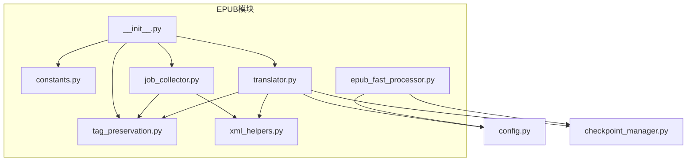

图表来源
- [src/core/epub/__init__.py](file://src/core/epub/__init__.py#L1-L46)
- [src/core/epub/translator.py](file://src/core/epub/translator.py#L1-L120)
- [src/core/epub/job_collector.py](file://src/core/epub/job_collector.py#L1-L120)
- [src/core/epub/tag_preservation.py](file://src/core/epub/tag_preservation.py#L1-L80)
- [src/core/epub/xml_helpers.py](file://src/core/epub/xml_helpers.py#L1-L120)
- [src/core/epub/epub_fast_processor.py](file://src/core/epub/epub_fast_processor.py#L1-L120)
- [src/config.py](file://src/config.py#L110-L136)
- [src/persistence/checkpoint_manager.py](file://src/persistence/checkpoint_manager.py#L1-L120)

章节来源
- [src/core/epub/__init__.py](file://src/core/epub/__init__.py#L1-L46)
- [src/config.py](file://src/config.py#L110-L136)

## 核心组件
- 占位符与标签保全
  - TagPreserver：将HTML/XML标签替换为简单占位符，翻译后再恢复，避免LLM误改结构
  - PLACEHOLDER_PATTERN：用于检测占位符是否完整保留
- 任务收集器
  - collect_translation_jobs：递归遍历XHTML树，识别块级内容、直接文本与尾随文本，生成翻译任务
- XML助手
  - safe_*系列：兼容不同lxml版本的安全迭代与属性访问
  - serialize_inline_tags：序列化节点内容，保留或移除内联标签
  - rebuild_element_from_translated_content：从包含内联标签的翻译结果重建元素树
- 标准翻译编排
  - translate_epub_file：协调解压、收集、翻译、应用、元数据更新、保存
- 快速模式处理器
  - extract_pure_text_from_epub：剥离所有标记，仅提取纯文本
  - create_simple_epub：基于翻译后的纯文本重建最小EPUB（EPUB 2.0）
  - translate_text_as_string：标准文本翻译流程（供快速模式复用）

章节来源
- [src/core/epub/tag_preservation.py](file://src/core/epub/tag_preservation.py#L1-L155)
- [src/core/epub/constants.py](file://src/core/epub/constants.py#L1-L24)
- [src/core/epub/job_collector.py](file://src/core/epub/job_collector.py#L1-L219)
- [src/core/epub/xml_helpers.py](file://src/core/epub/xml_helpers.py#L1-L280)
- [src/core/epub/translator.py](file://src/core/epub/translator.py#L1-L200)
- [src/core/epub/epub_fast_processor.py](file://src/core/epub/epub_fast_processor.py#L1-L200)

## 架构总览
EPUB翻译采用“标准模式”和“快速模式”双通道：
- 标准模式：保留原结构，使用TagPreserver与rebuild_element_from_translated_content确保标签不被破坏
- 快速模式：完全剥离结构，仅翻译纯文本，再重建最小EPUB，适合弱模型或严格阅读器

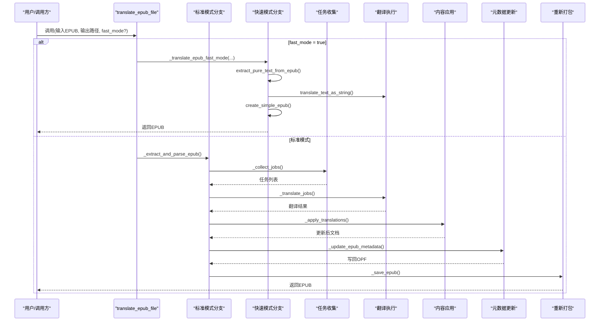

图表来源
- [src/core/epub/translator.py](file://src/core/epub/translator.py#L32-L149)
- [src/core/epub/epub_fast_processor.py](file://src/core/epub/epub_fast_processor.py#L732-L833)

## 详细组件分析

### 标准模式：解压与解析
- 解压EPUB并定位OPF
  - 使用zipfile解压到临时目录
  - 查找content.opf，解析OPF树，读取manifest/spine
- 解析XHTML内容
  - 遍历spine顺序，逐个读取XHTML内容
  - 使用lxml解析，保留空白与结构，便于后续任务收集

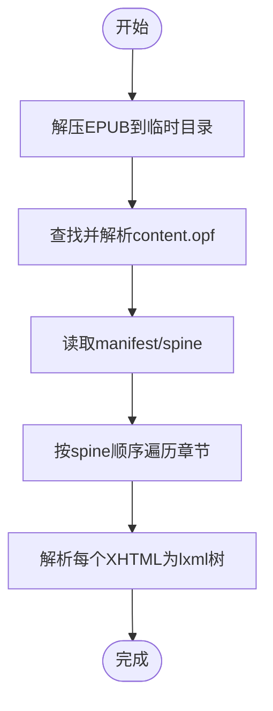

图表来源
- [src/core/epub/translator.py](file://src/core/epub/translator.py#L150-L204)

章节来源
- [src/core/epub/translator.py](file://src/core/epub/translator.py#L150-L204)

### 标准模式：任务收集
- 递归遍历XHTML树，识别三类可翻译内容：
  - 块级内容：若无子块级元素，则整体序列化为带内联标签的文本，交由TagPreserver处理
  - 直接文本：element.text
  - 尾随文本：element.tail（非块级元素）
- 文本分块策略
  - 使用split_text_into_chunks_with_context按目标行数切分
  - 保留首尾空白，记录leading_space/trailing_space以便回写

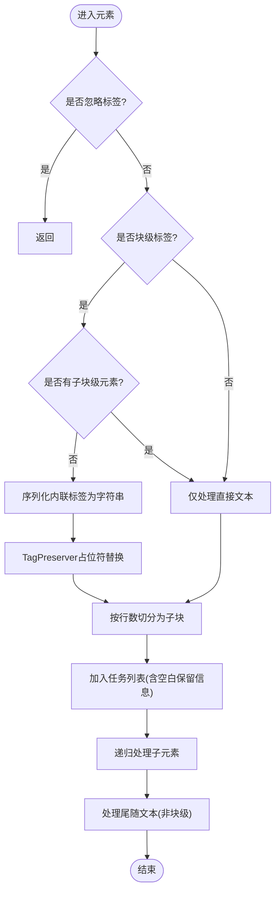

图表来源
- [src/core/epub/job_collector.py](file://src/core/epub/job_collector.py#L15-L129)
- [src/core/epub/job_collector.py](file://src/core/epub/job_collector.py#L131-L219)
- [src/core/epub/xml_helpers.py](file://src/core/epub/xml_helpers.py#L172-L221)

章节来源
- [src/core/epub/job_collector.py](file://src/core/epub/job_collector.py#L1-L219)
- [src/core/epub/xml_helpers.py](file://src/core/epub/xml_helpers.py#L172-L221)

### 标准模式：翻译执行
- 上下文构建
  - 维护最近翻译片段的累积上下文，限制行数与词数，控制上下文窗口大小
- 占位符校验与重试
  - 在翻译后检测PLACEHOLDER_PATTERN，若缺失则触发重试
- 标签恢复
  - 使用TagPreserver.validate_placeholders与restore_tags恢复标签
  - 若仍缺失，提示启用快速模式

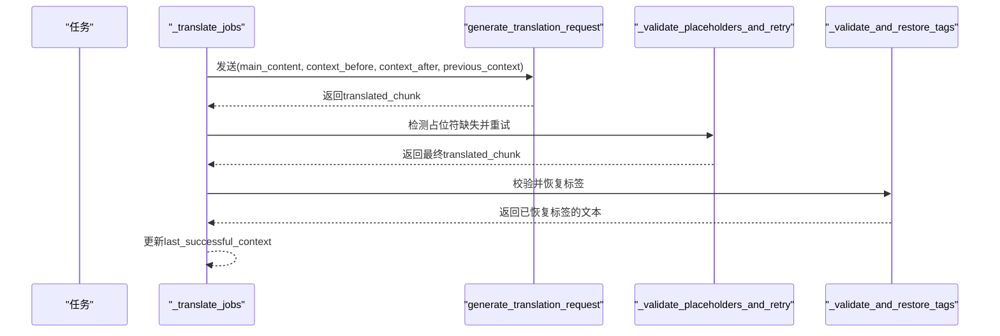

图表来源
- [src/core/epub/translator.py](file://src/core/epub/translator.py#L270-L360)
- [src/core/epub/translator.py](file://src/core/epub/translator.py#L362-L494)
- [src/core/epub/translator.py](file://src/core/epub/translator.py#L496-L537)
- [src/core/epub/constants.py](file://src/core/epub/constants.py#L21-L24)

章节来源
- [src/core/epub/translator.py](file://src/core/epub/translator.py#L270-L537)
- [src/core/epub/constants.py](file://src/core/epub/constants.py#L21-L24)

### 标准模式：内容应用
- 回写翻译结果
  - 对块级内容：若存在内联标签，使用rebuild_element_from_translated_content重建元素树；否则直接设置text并清空子节点
  - 对直接文本/尾随文本：保留leading_space/trailing_space，回写翻译文本
- HTML实体转义
  - 使用html.unescape还原实体

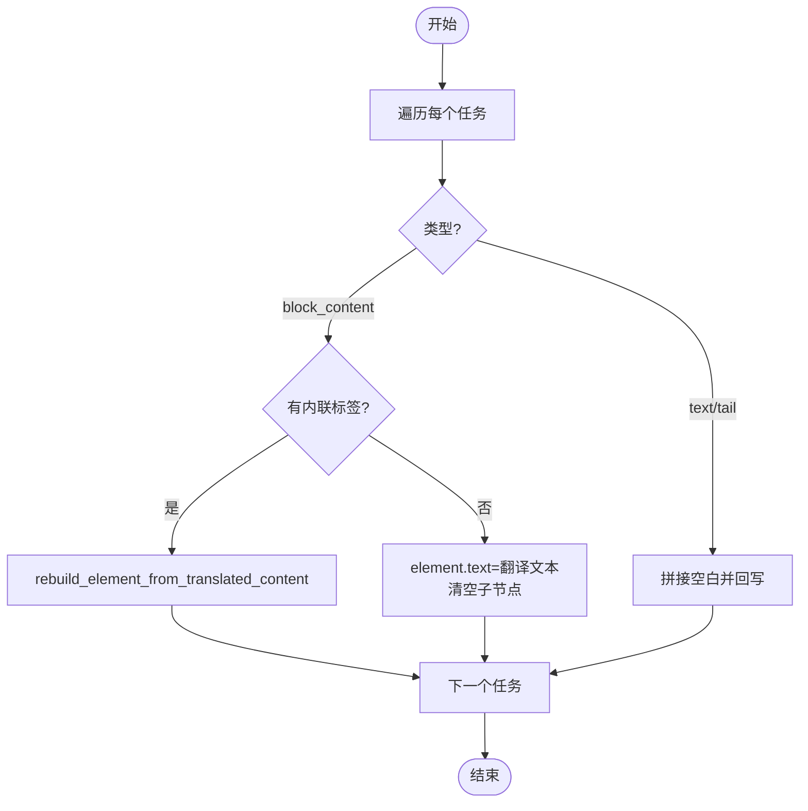

图表来源
- [src/core/epub/translator.py](file://src/core/epub/translator.py#L581-L620)
- [src/core/epub/xml_helpers.py](file://src/core/epub/xml_helpers.py#L223-L266)

章节来源
- [src/core/epub/translator.py](file://src/core/epub/translator.py#L581-L620)
- [src/core/epub/xml_helpers.py](file://src/core/epub/xml_helpers.py#L223-L266)

### 标准模式：元数据更新与重新打包
- OPF元数据更新
  - 更新dc:language为目标语言前缀
  - 添加contributor（译者）与description签名（可选）
  - 写回OPF
- 重新打包
  - 清理残留占位符
  - 逐个保存XHTML
  - 创建EPUB：先写入mimetype（不压缩），再写入其余文件

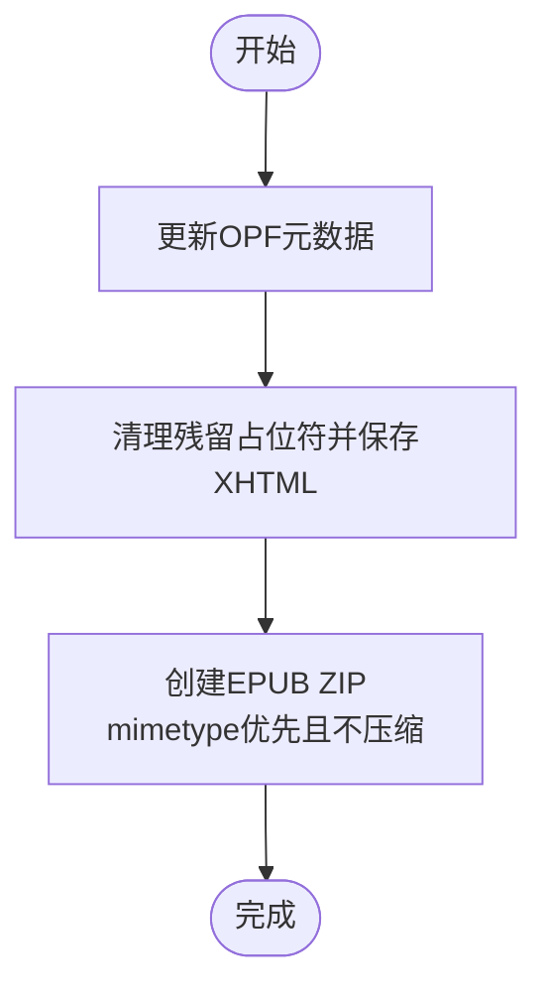

图表来源
- [src/core/epub/translator.py](file://src/core/epub/translator.py#L621-L730)

章节来源
- [src/core/epub/translator.py](file://src/core/epub/translator.py#L621-L730)

### 快速模式：纯文本抽取、翻译与重建
- 抽取纯文本
  - 解析OPF提取标题/作者/语言/标识
  - 遍历spine，按顺序抽取XHTML纯文本，合并为完整文本
- 翻译
  - 使用标准文本翻译流程（translate_chunks）
- 重建EPUB
  - 自动分章（按字数）
  - 生成content.opf、toc.ncx、样式表与章节XHTML
  - 严格遵循EPUB 2.0文件顺序与压缩策略

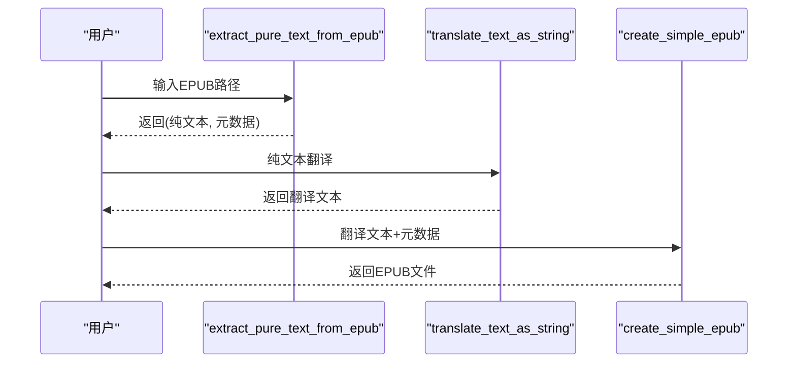

图表来源
- [src/core/epub/epub_fast_processor.py](file://src/core/epub/epub_fast_processor.py#L40-L173)
- [src/core/epub/epub_fast_processor.py](file://src/core/epub/epub_fast_processor.py#L714-L833)

章节来源
- [src/core/epub/epub_fast_processor.py](file://src/core/epub/epub_fast_processor.py#L40-L173)
- [src/core/epub/epub_fast_processor.py](file://src/core/epub/epub_fast_processor.py#L714-L833)

### TagPreserver类与占位符机制
- 作用
  - 在翻译前将HTML/XML标签替换为简单占位符，翻译后恢复
- 关键方法
  - preserve_tags：替换标签为占位符，返回映射表
  - restore_tags：按逆序替换占位符，避免部分匹配
  - validate_placeholders：检测缺失与变异（如[[TAG0]]等），返回缺失与变异清单
  - fix_mutated_placeholders：尝试修复常见变异
- 占位符正则
  - 使用PLACEHOLDER_PATTERN检测占位符是否完整保留

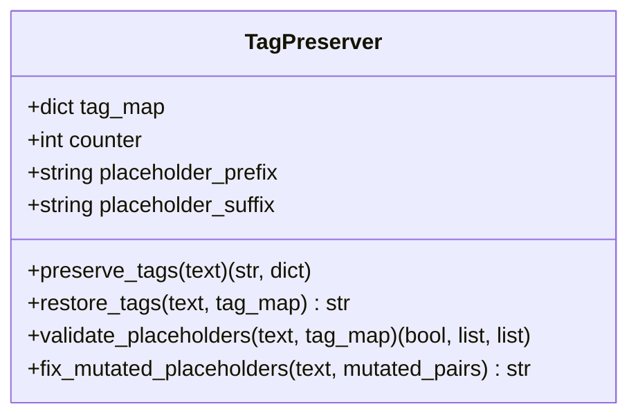

图表来源
- [src/core/epub/tag_preservation.py](file://src/core/epub/tag_preservation.py#L1-L155)
- [src/core/epub/constants.py](file://src/core/epub/constants.py#L21-L24)

章节来源
- [src/core/epub/tag_preservation.py](file://src/core/epub/tag_preservation.py#L1-L155)
- [src/core/epub/constants.py](file://src/core/epub/constants.py#L21-L24)

### rebuild_element_from_translated_content：复杂HTML结构重建
- 步骤
  - 清空元素的text/tail/子节点
  - 将翻译文本包裹在临时根节点中，使用recover模式解析为XML片段
  - 复制子节点（含标签、属性、text/tail），递归复制嵌套子节点
  - 若解析失败，回退为直接设置为文本
- 安全性
  - 使用safe_*工具保证跨版本lxml兼容

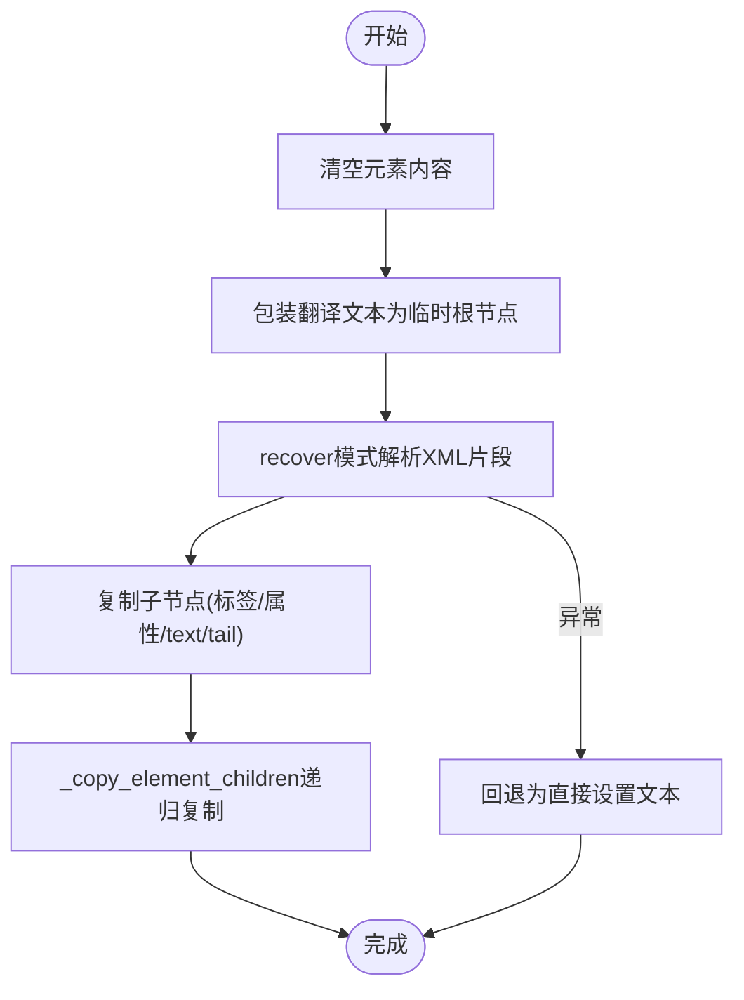

图表来源
- [src/core/epub/xml_helpers.py](file://src/core/epub/xml_helpers.py#L223-L280)

章节来源
- [src/core/epub/xml_helpers.py](file://src/core/epub/xml_helpers.py#L223-L280)

### 标准模式 vs 快速模式
- 标准模式
  - 优点：保留原文档结构与内联标签，适合需要保持排版一致性的场景
  - 风险：LLM可能误改标签结构，需占位符保全与校验
- 快速模式
  - 优点：完全剥离结构，仅翻译纯文本，避免标签错乱；兼容性强
  - 缺点：失去原有结构与样式，最终产物为最小EPUB
- 选择建议
  - 弱模型或严格阅读器：优先快速模式
  - 需要保留结构：使用标准模式并开启占位符校验

章节来源
- [src/core/epub/translator.py](file://src/core/epub/translator.py#L92-L103)
- [src/core/epub/epub_fast_processor.py](file://src/core/epub/epub_fast_processor.py#L1-L40)

### OPF元数据修改（语言更新、贡献者添加）
- 语言更新
  - 查找dc:language并设置为目标语言前缀
- 贡献者添加
  - 添加dc:contributor（译者），role=trl
- 描述签名
  - 可选添加/追加dc:description，包含项目名称与链接
- 写回OPF

章节来源
- [src/core/epub/translator.py](file://src/core/epub/translator.py#L621-L671)
- [src/config.py](file://src/config.py#L83-L92)

### 断点续传在EPUB处理中的集成
- 标准模式
  - 通过checkpoint_manager保存每个任务的原始文本、翻译结果、统计信息与翻译上下文
  - 支持暂停、中断、恢复、删除检查点
  - 当前标准模式未实现从检查点重建EPUB（返回提示）
- 快速模式
  - 在fast_mode激活时，将EPUB元数据保存至检查点配置
  - 支持从检查点重建完整EPUB（基于翻译后的纯文本与元数据）

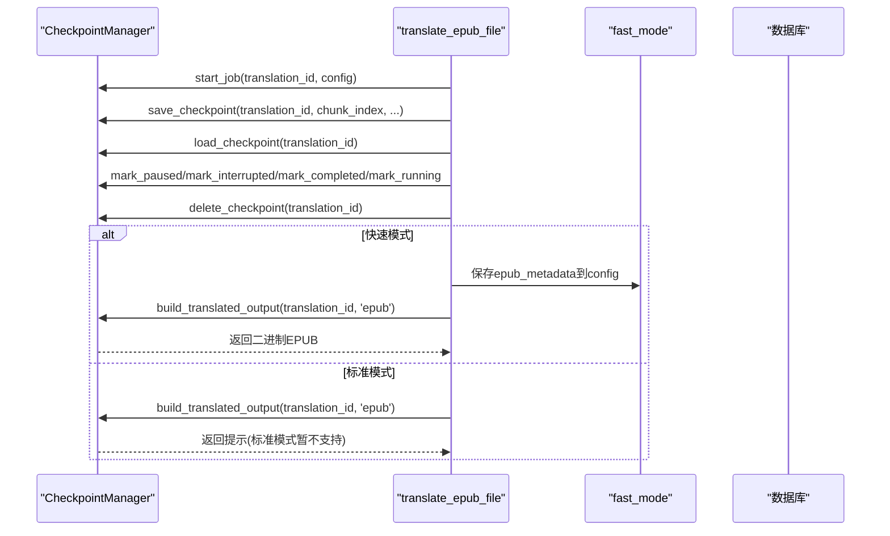

图表来源
- [src/persistence/checkpoint_manager.py](file://src/persistence/checkpoint_manager.py#L1-L120)
- [src/persistence/checkpoint_manager.py](file://src/persistence/checkpoint_manager.py#L426-L525)
- [src/core/epub/translator.py](file://src/core/epub/translator.py#L732-L800)

章节来源
- [src/persistence/checkpoint_manager.py](file://src/persistence/checkpoint_manager.py#L1-L120)
- [src/persistence/checkpoint_manager.py](file://src/persistence/checkpoint_manager.py#L426-L525)
- [src/core/epub/translator.py](file://src/core/epub/translator.py#L732-L800)

## 依赖关系分析
- 模块耦合
  - translator依赖job_collector、tag_preservation、xml_helpers、config、post_processor
  - job_collector依赖xml_helpers与tag_preservation
  - xml_helpers依赖lxml，提供安全封装
  - epub_fast_processor独立于标准流程，但共享部分配置
- 外部依赖
  - lxml：XML/HTML解析与序列化
  - zipfile：EPUB解包与打包
  - aiofiles：异步文件读写
  - sqlite（通过Database）：检查点持久化

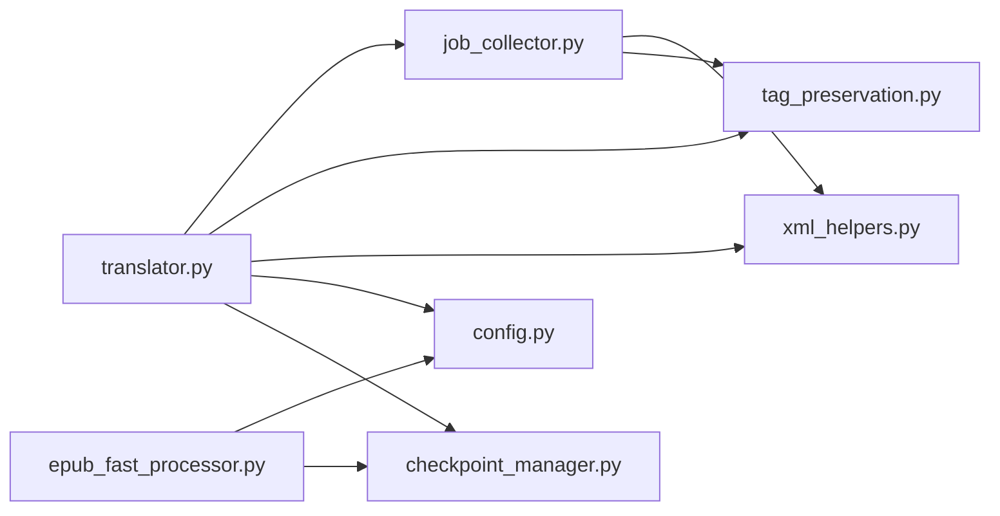

图表来源
- [src/core/epub/translator.py](file://src/core/epub/translator.py#L1-L120)
- [src/core/epub/job_collector.py](file://src/core/epub/job_collector.py#L1-L40)
- [src/core/epub/tag_preservation.py](file://src/core/epub/tag_preservation.py#L1-L40)
- [src/core/epub/xml_helpers.py](file://src/core/epub/xml_helpers.py#L1-L40)
- [src/core/epub/epub_fast_processor.py](file://src/core/epub/epub_fast_processor.py#L1-L40)
- [src/config.py](file://src/config.py#L110-L136)
- [src/persistence/checkpoint_manager.py](file://src/persistence/checkpoint_manager.py#L1-L60)

章节来源
- [src/core/epub/translator.py](file://src/core/epub/translator.py#L1-L120)
- [src/core/epub/job_collector.py](file://src/core/epub/job_collector.py#L1-L40)
- [src/core/epub/tag_preservation.py](file://src/core/epub/tag_preservation.py#L1-L40)
- [src/core/epub/xml_helpers.py](file://src/core/epub/xml_helpers.py#L1-L40)
- [src/core/epub/epub_fast_processor.py](file://src/core/epub/epub_fast_processor.py#L1-L40)
- [src/config.py](file://src/config.py#L110-L136)
- [src/persistence/checkpoint_manager.py](file://src/persistence/checkpoint_manager.py#L1-L60)

## 性能考量
- 上下文窗口管理
  - 通过MIN_CONTEXT_LINES/MIN_CONTEXT_WORDS与MAX_CONTEXT_LINES/MAX_CONTEXT_BLOCKS限制累积上下文大小，平衡一致性与性能
- 分块策略
  - 使用split_text_into_chunks_with_context按行数切分，避免过长上下文导致token超限
- 解析健壮性
  - 使用recover模式解析XHTML，容忍轻微格式错误
- I/O优化
  - 异步文件读写（aiofiles），减少I/O阻塞
- 快速模式优势
  - 纯文本翻译避免标签解析开销，适合大规模书籍

章节来源
- [src/core/epub/translator.py](file://src/core/epub/translator.py#L539-L579)
- [src/core/epub/translator.py](file://src/core/epub/translator.py#L362-L436)
- [src/core/epub/xml_helpers.py](file://src/core/epub/xml_helpers.py#L241-L266)

## 故障排查指南
- 占位符缺失或变异
  - 现象：翻译后检测到PLACEHOLDER_PATTERN缺失或变异（如[[TAG0]]）
  - 处理：自动重试；若仍缺失，提示启用快速模式
- XML解析错误
  - 现象：XHTML解析失败或OPF缺失
  - 处理：检查EPUB完整性；确认content.opf存在且结构正确
- 文件写入失败
  - 现象：保存XHTML或打包EPUB时报错
  - 处理：检查输出目录权限与磁盘空间；确认编码为UTF-8
- 元数据未更新
  - 现象：OPF语言或贡献者未变更
  - 处理：确认SIGNATURE_ENABLED与PROJECT_NAME/PROJECT_GITHUB配置；检查命名空间与元素路径

章节来源
- [src/core/epub/translator.py](file://src/core/epub/translator.py#L362-L494)
- [src/core/epub/translator.py](file://src/core/epub/translator.py#L621-L730)
- [src/config.py](file://src/config.py#L83-L92)

## 结论
该EPUB翻译系统提供了两条稳健路径：标准模式在保留结构的同时通过占位符保全机制确保标签安全；快速模式以纯文本翻译为核心，最大化兼容性与稳定性。通过完善的上下文管理、占位符校验与重试、断点续传与元数据签名，系统在工程可用性与质量上达到良好平衡。对于需要严格结构保留的场景，建议使用标准模式并配合强模型；对于追求稳定与兼容性的场景，快速模式是更稳妥的选择。

## 附录
- 命名空间与忽略标签
  - NAMESPACES：opf、dc、xhtml、epub
  - IGNORED_TAGS_EPUB：script、style、meta、link
  - CONTENT_BLOCK_TAGS_EPUB：p、div、li、h1-h6、blockquote、td/th/caption、dt/dd等
- 常量
  - MIN_CONTEXT_LINES/MIN_CONTEXT_WORDS/MAX_CONTEXT_LINES/MAX_CONTEXT_BLOCKS：上下文窗口参数
  - PLACEHOLDER_PATTERN：占位符正则

章节来源
- [src/config.py](file://src/config.py#L110-L136)
- [src/core/epub/constants.py](file://src/core/epub/constants.py#L1-L24)