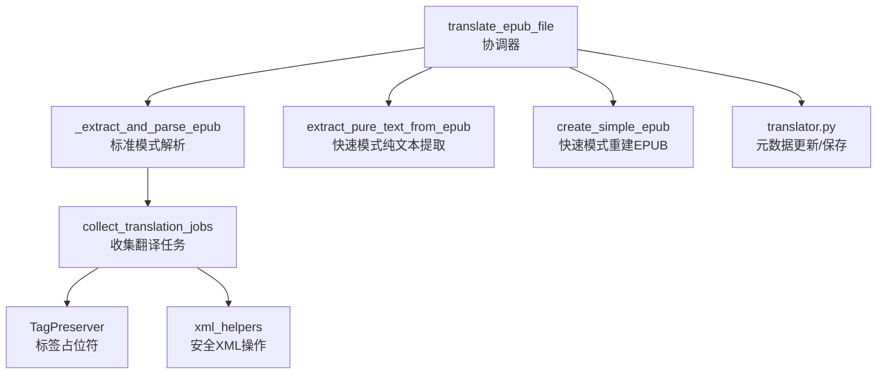
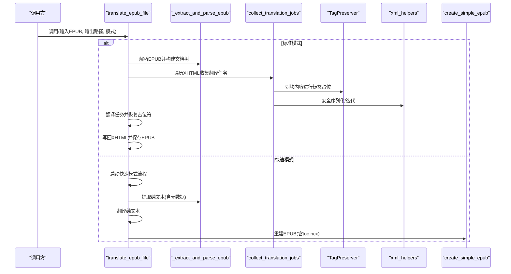
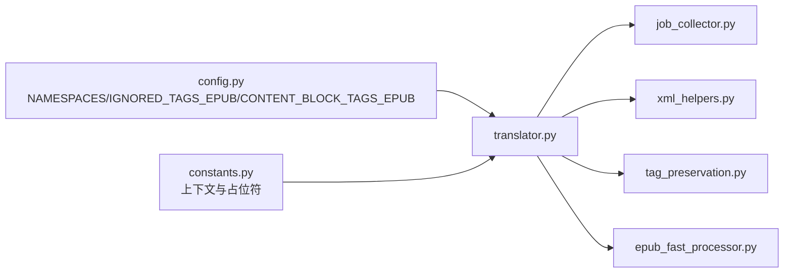

# EPUB解析与结构处理

<cite>
**本文引用的文件**
- [src/core/epub/__init__.py](file://src/core/epub/__init__.py)
- [src/core/epub/translator.py](file://src/core/epub/translator.py)
- [src/core/epub/epub_fast_processor.py](file://src/core/epub/epub_fast_processor.py)
- [src/core/epub/job_collector.py](file://src/core/epub/job_collector.py)
- [src/core/epub/xml_helpers.py](file://src/core/epub/xml_helpers.py)
- [src/core/epub/tag_preservation.py](file://src/core/epub/tag_preservation.py)
- [src/core/epub/constants.py](file://src/core/epub/constants.py)
- [src/config.py](file://src/config.py)
</cite>

## 目录
1. [简介](#简介)
2. [项目结构](#项目结构)
3. [核心组件](#核心组件)
4. [架构总览](#架构总览)
5. [详细组件分析](#详细组件分析)
6. [依赖关系分析](#依赖关系分析)
7. [性能考量](#性能考量)
8. [故障排查指南](#故障排查指南)
9. [结论](#结论)
10. [附录](#附录)

## 简介
本技术文档聚焦于EPUB文件的解析与结构处理，系统性阐述如何使用lxml解析EPUB的OPF（Package Document）与NCX（Navigation Center eXtended）文件，详解NAMESPACES命名空间配置及其在XPath查询中的作用；说明如何通过_spine_与_manifest_定位内容文档（XHTML），并提取可翻译文本；解释_extract_and_parse_epub函数如何在临时目录中解压EPUB并构建解析后的文档树；给出遍历XHTML文档中段落（
标签）与章节标题（<h1>-<h6>）的方法；说明IGNORED_TAGS_EPUB如何排除script、style等非文本元素；对比EPUB 2.0与3.0结构差异对解析的影响；并提供处理损坏或非标准EPUB文件的容错策略。

## 项目结构
EPUB相关功能集中在src/core/epub目录下，采用模块化设计：
- 核心入口：translate_epub_file（协调完整流程）
- 解析与提取：_extract_and_parse_epub（标准模式）、extract_pure_text_from_epub（快速模式）
- 文本收集：collect_translation_jobs（递归收集可翻译片段）
- 标签保护：TagPreserver（占位符替换与恢复）
- XML工具：xml_helpers（安全迭代、序列化、重建元素）
- 常量与配置：constants（上下文窗口与占位符正则）、config（NAMESPACES、IGNORED_TAGS_EPUB、CONTENT_BLOCK_TAGS_EPUB）

图表来源
- [src/core/epub/translator.py](file://src/core/epub/translator.py#L32-L145)
- [src/core/epub/translator.py](file://src/core/epub/translator.py#L150-L204)
- [src/core/epub/job_collector.py](file://src/core/epub/job_collector.py#L15-L129)
- [src/core/epub/tag_preservation.py](file://src/core/epub/tag_preservation.py#L11-L93)
- [src/core/epub/xml_helpers.py](file://src/core/epub/xml_helpers.py#L1-L170)
- [src/core/epub/epub_fast_processor.py](file://src/core/epub/epub_fast_processor.py#L353-L458)

章节来源
- [src/core/epub/__init__.py](file://src/core/epub/__init__.py#L1-L46)
- [src/core/epub/translator.py](file://src/core/epub/translator.py#L32-L145)

## 核心组件
- translate_epub_file：主入口，支持“标准模式”和“快速模式”。标准模式解析OPF/NCX/XHTML，收集翻译任务，翻译后回写并保存；快速模式直接抽取纯文本，翻译后再重建EPUB。
- _extract_and_parse_epub：在临时目录解压EPUB，定位OPF，解析manifest/spine，构建内容文件列表。
- extract_pure_text_from_epub：快速模式专用，从OPF读取元数据，按阅读顺序遍历spine，解析每个XHTML为纯文本。
- collect_translation_jobs：递归遍历XHTML树，识别块级与内联文本，生成翻译任务；忽略IGNORED_TAGS_EPUB。
- TagPreserver：将HTML/XML标签替换为简单占位符，翻译后再恢复，保证结构不被破坏。
- xml_helpers：提供安全的子节点迭代、标签名获取、带 换行处理的文本提取、重建元素等工具。
- constants：定义上下文窗口常量与占位符正则；config：定义NAMESPACES、IGNORED_TAGS_EPUB、CONTENT_BLOCK_TAGS_EPUB。

章节来源
- [src/core/epub/translator.py](file://src/core/epub/translator.py#L32-L145)
- [src/core/epub/translator.py](file://src/core/epub/translator.py#L150-L204)
- [src/core/epub/epub_fast_processor.py](file://src/core/epub/epub_fast_processor.py#L40-L173)
- [src/core/epub/job_collector.py](file://src/core/epub/job_collector.py#L15-L129)
- [src/core/epub/tag_preservation.py](file://src/core/epub/tag_preservation.py#L11-L93)
- [src/core/epub/xml_helpers.py](file://src/core/epub/xml_helpers.py#L1-L170)
- [src/core/epub/constants.py](file://src/core/epub/constants.py#L1-L24)
- [src/config.py](file://src/config.py#L110-L136)

## 架构总览
标准模式与快速模式两条路径：
- 标准模式：解析OPF/NCX/XHTML，收集翻译任务，翻译后重建文档树并保存。
- 快速模式：抽取纯文本，翻译后按章节重建EPUB 2.0兼容结构（含toc.ncx）。

图表来源
- [src/core/epub/translator.py](file://src/core/epub/translator.py#L32-L145)
- [src/core/epub/translator.py](file://src/core/epub/translator.py#L150-L204)
- [src/core/epub/translator.py](file://src/core/epub/translator.py#L800-L820)
- [src/core/epub/epub_fast_processor.py](file://src/core/epub/epub_fast_processor.py#L353-L458)

## 详细组件分析

### OPF与NCX解析及命名空间
- OPF解析：通过NAMESPACES在XPath中查找opf:metadata、opf:manifest、opf:spine等节点，确保跨版本兼容。
- NCX生成：快速模式下生成toc.ncx，用于EPUB 2.0导航；标准模式下通常由OPF spine toc属性指向NCX。
- 命名空间作用：NAMESPACES统一映射opf、dc、xhtml、epub等前缀，使XPath查询稳定可靠，避免硬编码URI带来的脆弱性。

章节来源
- [src/core/epub/translator.py](file://src/core/epub/translator.py#L150-L204)
- [src/core/epub/translator.py](file://src/core/epub/translator.py#L621-L671)
- [src/config.py](file://src/config.py#L110-L116)

### 标准模式：解析与提取
_extract_and_parse_epub负责：
- 解压EPUB到临时目录
- 查找并解析OPF
- 从spine中按阅读顺序提取content文件href
- 将解析后的XHTML根节点存入parsed_xhtml_docs，供后续收集翻译任务

章节来源
- [src/core/epub/translator.py](file://src/core/epub/translator.py#L150-L204)
- [src/core/epub/translator.py](file://src/core/epub/translator.py#L826-L847)

### 快速模式：纯文本提取与重建
extract_pure_text_from_epub负责：
- 解压EPUB并定位OPF
- 解析元数据（title/author/language/identifier）
- 依据manifest建立id到href映射，再按spine顺序读取XHTML
- 使用_lxml_解析XHTML，移除script/style等非文本元素，递归提取文本并规范化段落
- 返回纯文本与元数据字典

章节来源
- [src/core/epub/epub_fast_processor.py](file://src/core/epub/epub_fast_processor.py#L40-L173)
- [src/core/epub/epub_fast_processor.py](file://src/core/epub/epub_fast_processor.py#L182-L233)

### 翻译任务收集：遍历XHTML并提取可翻译文本
collect_translation_jobs：
- 忽略IGNORED_TAGS_EPUB（如script/style/meta/link）
- 区分块级元素（p/div/li/h1-h6等）与内联文本，分别处理
- 对块级元素使用serialize_inline_tags保留内联标签，再进行分块
- 记录原始文本、前后空白、元素引用、文件路径等信息

章节来源
- [src/core/epub/job_collector.py](file://src/core/epub/job_collector.py#L15-L129)
- [src/core/epub/job_collector.py](file://src/core/epub/job_collector.py#L131-L219)
- [src/core/epub/xml_helpers.py](file://src/core/epub/xml_helpers.py#L120-L170)
- [src/config.py](file://src/config.py#L118-L134)

### 标签占位与恢复：TagPreserver
- preserve_tags：将HTML/XML标签替换为简单占位符，便于LLM翻译时保持结构
- restore_tags：将占位符还原为原始标签
- validate_placeholders/fix_mutated_placeholders：检测缺失或变异占位符并尝试修复

章节来源
- [src/core/epub/tag_preservation.py](file://src/core/epub/tag_preservation.py#L11-L93)
- [src/core/epub/tag_preservation.py](file://src/core/epub/tag_preservation.py#L94-L155)

### XML安全工具：xml_helpers
- safe_iter_children/safe_get_tag/safe_get_attrib：兼容不同lxml版本，安全获取子节点与属性
- get_node_text_content_with_br_as_newline：将 转换为换行，尊重块级元素边界
- serialize_inline_tags：序列化内联标签，支持保留或去除标签
- rebuild_element_from_translated_content：从翻译结果重建元素树，保留结构

章节来源
- [src/core/epub/xml_helpers.py](file://src/core/epub/xml_helpers.py#L1-L170)
- [src/core/epub/xml_helpers.py](file://src/core/epub/xml_helpers.py#L172-L280)

### EPUB 2.0与3.0结构差异
- EPUB 2.0：使用toc.ncx作为导航；OPF spine包含toc="ncx"；容器文件container.xml指向根目录content.opf
- EPUB 3.0：推荐使用nav.xhtml作为导航，OPF spine不再强制要求toc；但本项目在快速模式仍生成toc.ncx以提升兼容性
- 本项目在快速模式下明确生成toc.ncx与content.opf，确保严格阅读器兼容

章节来源
- [src/core/epub/epub_fast_processor.py](file://src/core/epub/epub_fast_processor.py#L425-L458)
- [src/core/epub/epub_fast_processor.py](file://src/core/epub/epub_fast_processor.py#L668-L712)
- [src/core/epub/epub_fast_processor.py](file://src/core/epub/epub_fast_processor.py#L602-L666)

### 非标准与损坏EPUB的容错策略
- ZIP校验：捕获zipfile.BadZipFile并提示无效EPUB
- OPF缺失：未找到content.opf时抛出异常
- OPF解析失败：捕获异常并提示OPF解析错误
- XHTML解析：recover=True，尽量从语法错误中恢复
- 文件缺失：跳过不存在的内容文件并记录警告
- 占位符缺失：重试翻译并记录占位符缺失问题
- 元数据缺失：提供默认值并继续处理

章节来源
- [src/core/epub/epub_fast_processor.py](file://src/core/epub/epub_fast_processor.py#L40-L173)
- [src/core/epub/translator.py](file://src/core/epub/translator.py#L150-L204)
- [src/core/epub/translator.py](file://src/core/epub/translator.py#L860-L929)

## 依赖关系分析
- translate_epub_file依赖NAMESPACES、IGNORED_TAGS_EPUB、CONTENT_BLOCK_TAGS_EPUB、MIN_CONTEXT_*、PLACEHOLDER_PATTERN等全局配置
- 标准模式依赖job_collector与xml_helpers完成树遍历与安全操作
- 快速模式依赖epub_fast_processor完成纯文本提取与EPUB重建

图表来源
- [src/config.py](file://src/config.py#L110-L136)
- [src/core/epub/constants.py](file://src/core/epub/constants.py#L1-L24)
- [src/core/epub/translator.py](file://src/core/epub/translator.py#L32-L145)
- [src/core/epub/job_collector.py](file://src/core/epub/job_collector.py#L15-L129)
- [src/core/epub/xml_helpers.py](file://src/core/epub/xml_helpers.py#L1-L170)
- [src/core/epub/tag_preservation.py](file://src/core/epub/tag_preservation.py#L11-L93)
- [src/core/epub/epub_fast_processor.py](file://src/core/epub/epub_fast_processor.py#L353-L458)

## 性能考量
- XPath查询使用NAMESPACES减少字符串拼接开销，提高稳定性
- 快速模式通过纯文本提取与重建，避免复杂DOM操作，整体性能更优
- 分块翻译时维护上下文累积，限制最大块数与行数，平衡一致性与性能
- IO层面采用异步文件读写与ZIP写入，降低阻塞

章节来源
- [src/core/epub/translator.py](file://src/core/epub/translator.py#L539-L579)
- [src/core/epub/epub_fast_processor.py](file://src/core/epub/epub_fast_processor.py#L460-L511)

## 故障排查指南
- 输入文件不存在或非ZIP：检查路径与文件完整性
- OPF缺失：确认EPUB结构是否正确，container.xml是否指向正确的content.opf
- XHTML解析失败：查看日志中的XML语法错误，必要时启用快速模式
- 占位符缺失：查看占位符验证日志，考虑启用快速模式以消除标签干扰
- 写入失败：检查输出路径权限与磁盘空间

章节来源
- [src/core/epub/translator.py](file://src/core/epub/translator.py#L860-L929)

## 结论
该EPUB处理模块以lxml为核心，结合严格的命名空间管理、安全的XML工具与灵活的任务收集机制，既能在标准模式下精细保留结构，也能在快速模式下高效产出纯文本翻译结果。通过IGNORED_TAGS_EPUB与TagPreserver，有效规避非文本与标签破坏问题；通过NAMESPACES与XPath，确保OPF/NCX/XHTML解析的稳定性。针对非标准与损坏EPUB，提供了完善的容错与降级策略，满足生产环境的可靠性需求。

## 附录

### 如何遍历XHTML中的段落与章节标题
- 使用collect_translation_jobs遍历XHTML树，块级元素（p、h1-h6等）会被识别为可翻译单元
- 忽略列表中的非文本标签（script、style、meta、link）
- 可根据需要扩展CONTENT_BLOCK_TAGS_EPUB以覆盖更多块级元素

章节来源
- [src/core/epub/job_collector.py](file://src/core/epub/job_collector.py#L15-L129)
- [src/config.py](file://src/config.py#L118-L134)

### EPUB 2.0与3.0结构差异要点
- 导航：EPUB 2.0使用toc.ncx；EPUB 3.0推荐nav.xhtml
- 本项目在快速模式下仍生成toc.ncx，确保严格阅读器兼容

章节来源
- [src/core/epub/epub_fast_processor.py](file://src/core/epub/epub_fast_processor.py#L425-L458)
- [src/core/epub/epub_fast_processor.py](file://src/core/epub/epub_fast_processor.py#L668-L712)