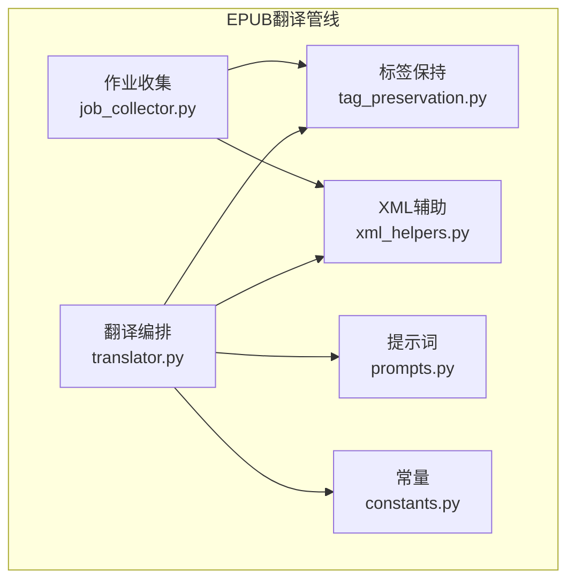
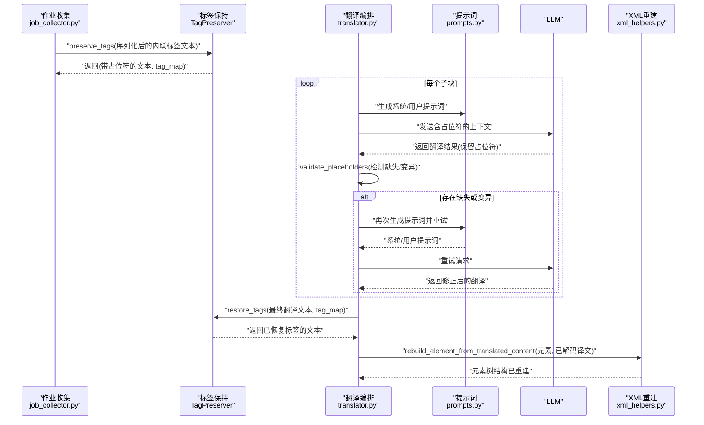
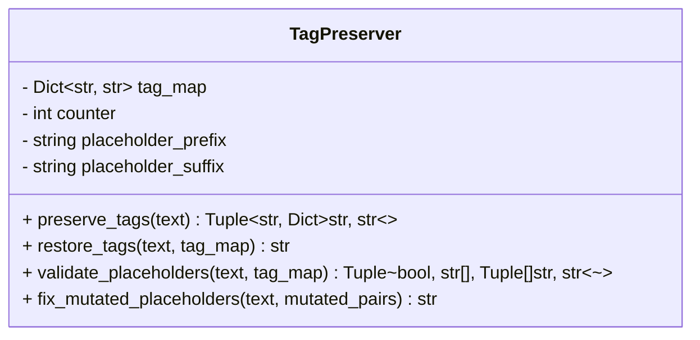
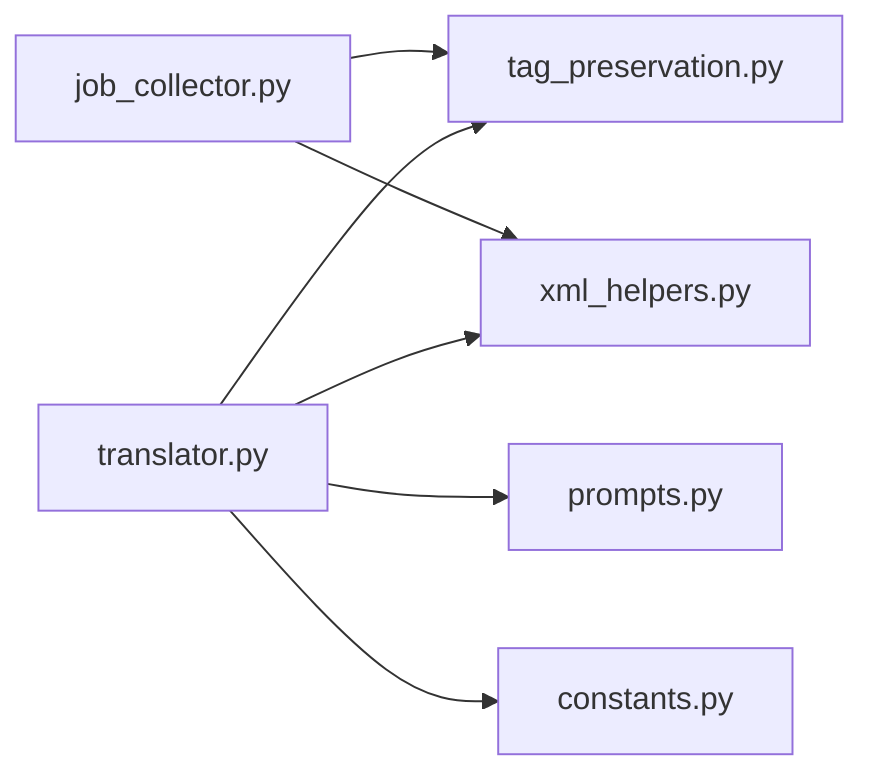

# HTML标签完整性保持

<cite>
**本文引用的文件列表**
- [src/core/epub/tag_preservation.py](file://src/core/epub/tag_preservation.py)
- [src/core/epub/translator.py](file://src/core/epub/translator.py)
- [src/core/epub/xml_helpers.py](file://src/core/epub/xml_helpers.py)
- [src/core/epub/constants.py](file://src/core/epub/constants.py)
- [prompts/prompts.py](file://prompts/prompts.py)
- [src/core/epub/job_collector.py](file://src/core/epub/job_collector.py)
</cite>

## 目录
1. [引言](#引言)
2. [项目结构](#项目结构)
3. [核心组件](#核心组件)
4. [架构总览](#架构总览)
5. [详细组件分析](#详细组件分析)
6. [依赖关系分析](#依赖关系分析)
7. [性能考量](#性能考量)
8. [故障排查指南](#故障排查指南)
9. [结论](#结论)

## 引言
本技术文档聚焦于EPUB翻译中的HTML/XML标签保持机制，系统性解析TagPreserver类的工作原理与实现细节，涵盖以下关键点：
- 如何通过正则表达式匹配任意HTML/XML标签，并以不可见占位符形式替换，避免LLM在翻译过程中修改或破坏结构。
- preserve_tags与restore_tags方法的实现逻辑，以及tag_map字典的构建与恢复机制。
- 结合PLACEHOLDER_PRESERVATION_SECTION，解释LLM指令如何强制模型严格保留占位符不变。
- rebuild_element_from_translated_content函数如何重建包含内联标签（如<em>、<strong>）的复杂HTML结构。
- 提供从<em>重要</em>到TAG0重要TAG1再到<em>译文</em>的完整转换流程示例路径。
- 分析该机制在防止标签错乱、嵌套破坏方面的优势与潜在边界情况。

## 项目结构
围绕标签保持机制的相关模块组织如下：
- 标签保持核心：TagPreserver类（src/core/epub/tag_preservation.py）
- 翻译编排与应用：EPUB翻译主流程（src/core/epub/translator.py），包含占位符验证与最终恢复
- 内联标签序列化与重建：XML辅助工具（src/core/epub/xml_helpers.py）
- 占位符模式与上下文常量：EPUB常量（src/core/epub/constants.py）
- LLM提示词：占位符保留指令（prompts/prompts.py）
- 作业收集与预处理：将块级内容序列化并进行占位符替换（src/core/epub/job_collector.py）

图表来源
- [src/core/epub/job_collector.py](file://src/core/epub/job_collector.py#L176-L219)
- [src/core/epub/translator.py](file://src/core/epub/translator.py#L270-L537)
- [src/core/epub/tag_preservation.py](file://src/core/epub/tag_preservation.py#L26-L93)
- [src/core/epub/xml_helpers.py](file://src/core/epub/xml_helpers.py#L223-L280)
- [prompts/prompts.py](file://prompts/prompts.py#L15-L33)
- [src/core/epub/constants.py](file://src/core/epub/constants.py#L21-L24)

章节来源
- [src/core/epub/tag_preservation.py](file://src/core/epub/tag_preservation.py#L1-L155)
- [src/core/epub/translator.py](file://src/core/epub/translator.py#L270-L537)
- [src/core/epub/xml_helpers.py](file://src/core/epub/xml_helpers.py#L1-L280)
- [src/core/epub/constants.py](file://src/core/epub/constants.py#L1-L24)
- [prompts/prompts.py](file://prompts/prompts.py#L1-L206)
- [src/core/epub/job_collector.py](file://src/core/epub/job_collector.py#L60-L219)

## 核心组件
- TagPreserver：负责将HTML/XML标签替换为不可见占位符，以及在翻译后恢复标签；同时提供占位符验证与修复能力。
- EPUB翻译器：协调提取、分块、翻译、验证与恢复、重建、保存等阶段，贯穿占位符生命周期。
- XML辅助工具：提供内联标签序列化与复杂结构重建能力，保障翻译后结构正确性。
- 提示词系统：通过明确的“占位符保留规则”，约束LLM行为，确保占位符不被修改。
- 常量定义：统一占位符正则模式，便于跨模块一致检测与重试。

章节来源
- [src/core/epub/tag_preservation.py](file://src/core/epub/tag_preservation.py#L11-L155)
- [src/core/epub/translator.py](file://src/core/epub/translator.py#L270-L537)
- [src/core/epub/xml_helpers.py](file://src/core/epub/xml_helpers.py#L223-L280)
- [prompts/prompts.py](file://prompts/prompts.py#L15-L33)
- [src/core/epub/constants.py](file://src/core/epub/constants.py#L21-L24)

## 架构总览
下图展示了从内容提取到翻译完成的端到端流程，重点标注了标签保持与重建的关键节点。

图表来源
- [src/core/epub/job_collector.py](file://src/core/epub/job_collector.py#L176-L219)
- [src/core/epub/tag_preservation.py](file://src/core/epub/tag_preservation.py#L26-L93)
- [src/core/epub/translator.py](file://src/core/epub/translator.py#L362-L537)
- [prompts/prompts.py](file://prompts/prompts.py#L15-L33)
- [src/core/epub/xml_helpers.py](file://src/core/epub/xml_helpers.py#L223-L280)

## 详细组件分析

### TagPreserver类
TagPreserver通过正则表达式识别并替换HTML/XML标签，采用不可见占位符保护结构，随后在翻译完成后按序恢复。

- 关键属性
  - tag_map：占位符到原始标签的映射字典
  - counter：占位符计数器
  - placeholder_prefix/suffix：占位符前后缀（用于生成与识别）

- preserve_tags
  - 使用正则表达式匹配任意HTML/XML标签（包括自闭合标签）
  - 为每个匹配到的标签生成递增的占位符，并写入tag_map
  - 返回替换后的文本与tag_map副本

- restore_tags
  - 为避免短占位符误替换长占位符（如TAG0与TAG10），按占位符编号逆序排序
  - 遍历排序后的占位符，逐一替换回原始标签

- validate_placeholders
  - 检查翻译结果是否包含全部预期占位符
  - 对常见变异（如双括号、单括号、花括号、角度括号、无括号、编码问题）进行检测
  - 返回校验状态、缺失列表与变异对列表

- fix_mutated_placeholders
  - 将检测到的变异占位符修复为标准格式

图表来源
- [src/core/epub/tag_preservation.py](file://src/core/epub/tag_preservation.py#L11-L155)

章节来源
- [src/core/epub/tag_preservation.py](file://src/core/epub/tag_preservation.py#L26-L155)

### 作业收集与预处理（job_collector.py）
- 在收集块级内容时，使用serialize_inline_tags将内联标签序列化为XML字符串，以便后续preserve_tags处理
- 调用TagPreserver.preserve_tags，得到带占位符的文本与tag_map，并将二者随作业一起传递给翻译阶段

章节来源
- [src/core/epub/job_collector.py](file://src/core/epub/job_collector.py#L60-L219)

### 翻译编排与恢复（translator.py）
- 翻译阶段：对每个子块调用generate_translation_request，传入上下文与包含占位符的文本
- 占位符验证与重试：使用PLACEHOLDER_PATTERN检测缺失占位符，必要时重新请求
- 最终恢复：调用_validate_and_restore_tags，内部实例化TagPreserver执行validate_placeholders与restore_tags
- 应用翻译：对块级元素，若存在内联标签，则调用rebuild_element_from_translated_content重建结构；否则直接设置text/tail并清理子节点

章节来源
- [src/core/epub/translator.py](file://src/core/epub/translator.py#L362-L537)
- [src/core/epub/constants.py](file://src/core/epub/constants.py#L21-L24)

### XML重建（xml_helpers.py）
- rebuild_element_from_translated_content
  - 清空元素的text、tail与子节点
  - 将翻译后的文本作为XML片段解析（recover=True容错）
  - 将解析出的子节点复制到目标元素，递归复制属性与嵌套结构
  - 若解析失败，回退为直接设置为纯文本

章节来源
- [src/core/epub/xml_helpers.py](file://src/core/epub/xml_helpers.py#L223-L280)

### 提示词与占位符保留（prompts.py）
- PLACEHOLDER_PRESERVATION_SECTION
  - 明确告知模型遇到的占位符含义与必须严格保留的要求
  - 规定不得翻译、修改、移除或解释占位符，且必须保持其在句中的精确位置
  - 提供多语言示例，强调占位符不添加额外空格

章节来源
- [prompts/prompts.py](file://prompts/prompts.py#L15-L33)

### 完整转换流程示例（路径指引）
以下为从<em>重要</em>到TAG0重要TAG1再到<em>译文</em>的完整转换流程路径指引：
- 作业收集阶段：序列化内联标签并调用preserve_tags
  - 参考路径：[src/core/epub/job_collector.py](file://src/core/epub/job_collector.py#L176-L219)
- 翻译阶段：生成提示词并发送含占位符的文本
  - 参考路径：[src/core/epub/translator.py](file://src/core/epub/translator.py#L362-L435), [prompts/prompts.py](file://prompts/prompts.py#L15-L33)
- 验证与重试：检测缺失占位符并重试
  - 参考路径：[src/core/epub/translator.py](file://src/core/epub/translator.py#L438-L494), [src/core/epub/constants.py](file://src/core/epub/constants.py#L21-L24)
- 最终恢复：validate_placeholders与restore_tags
  - 参考路径：[src/core/epub/translator.py](file://src/core/epub/translator.py#L496-L537), [src/core/epub/tag_preservation.py](file://src/core/epub/tag_preservation.py#L94-L155)
- 结构重建：rebuild_element_from_translated_content
  - 参考路径：[src/core/epub/xml_helpers.py](file://src/core/epub/xml_helpers.py#L223-L280)

## 依赖关系分析
- 模块耦合
  - job_collector.py依赖TagPreserver与serialize_inline_tags，负责预处理与占位符注入
  - translator.py依赖TagPreserver、提示词系统与常量，负责翻译、验证与恢复
  - xml_helpers.py独立提供XML重建能力，服务于translator.py的应用阶段
- 外部依赖
  - 正则表达式用于标签识别与占位符检测
  - lxml用于XML解析与序列化，支持recover模式提升鲁棒性

图表来源
- [src/core/epub/job_collector.py](file://src/core/epub/job_collector.py#L60-L219)
- [src/core/epub/translator.py](file://src/core/epub/translator.py#L270-L537)
- [src/core/epub/tag_preservation.py](file://src/core/epub/tag_preservation.py#L26-L155)
- [src/core/epub/xml_helpers.py](file://src/core/epub/xml_helpers.py#L223-L280)
- [prompts/prompts.py](file://prompts/prompts.py#L15-L33)
- [src/core/epub/constants.py](file://src/core/epub/constants.py#L21-L24)

章节来源
- [src/core/epub/job_collector.py](file://src/core/epub/job_collector.py#L60-L219)
- [src/core/epub/translator.py](file://src/core/epub/translator.py#L270-L537)
- [src/core/epub/tag_preservation.py](file://src/core/epub/tag_preservation.py#L26-L155)
- [src/core/epub/xml_helpers.py](file://src/core/epub/xml_helpers.py#L223-L280)
- [prompts/prompts.py](file://prompts/prompts.py#L15-L33)
- [src/core/epub/constants.py](file://src/core/epub/constants.py#L21-L24)

## 性能考量
- 正则匹配与替换
  - preserve_tags使用全局替换，时间复杂度近似O(n)，其中n为文本长度
  - restore_tags按编号逆序替换，避免重复扫描，整体仍为线性级别
- 占位符验证
  - validate_placeholders对tag_map中每个占位符进行检查，复杂度O(k)，k为占位符数量
  - 变异检测对每缺失项尝试多种模式，最坏O(k·m)，m为变异模式数
- XML重建
  - rebuild_element_from_translated_content解析XML片段，recover模式可容忍部分不规范内容，但解析成本与嵌套深度相关
- 实践建议
  - 控制chunk大小，减少单次翻译中的占位符数量
  - 对大段内联标签内容，优先使用serialize_inline_tags保证结构完整
  - 合理设置上下文窗口，避免过长上下文导致LLM注意力分散

## 故障排查指南
- 常见问题
  - 占位符缺失：翻译结果中缺少预期占位符
  - 占位符变异：出现双括号、单括号、花括号、角度括号或无括号等形式
  - 标签错乱或嵌套破坏：翻译后结构异常
- 排查步骤
  - 使用PLACEHOLDER_PATTERN检测缺失占位符，触发重试逻辑
  - validate_placeholders输出缺失与变异清单，定位具体问题
  - fix_mutated_placeholders尝试修复常见变异
  - 若仍失败，考虑启用fast mode（移除HTML标签后再翻译），降低结构复杂度
- 建议
  - 在提示词中明确强调占位符保留的重要性
  - 对复杂内联结构，优先使用rebuild_element_from_translated_content进行重建
  - 对解析失败的回退策略，确保最终产物至少保留可读文本

章节来源
- [src/core/epub/translator.py](file://src/core/epub/translator.py#L362-L537)
- [src/core/epub/tag_preservation.py](file://src/core/epub/tag_preservation.py#L94-L155)
- [src/core/epub/constants.py](file://src/core/epub/constants.py#L21-L24)
- [src/core/epub/xml_helpers.py](file://src/core/epub/xml_helpers.py#L223-L280)

## 结论
TagPreserver及其配套机制有效解决了EPUB翻译中HTML/XML标签的完整性问题：
- 通过正则识别与不可见占位符替换，隔离结构与语义，显著降低LLM误改风险
- 严格的验证与修复流程，配合明确的提示词规则，进一步提升稳定性
- rebuild_element_from_translated_content确保复杂内联结构在翻译后得以正确重建
- 在实践中，应结合上下文控制、重试与回退策略，平衡质量与性能，获得稳定可靠的翻译结果