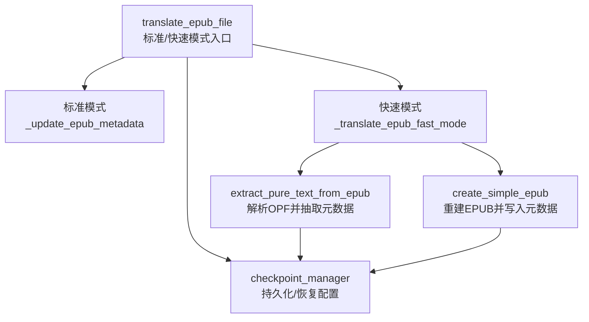
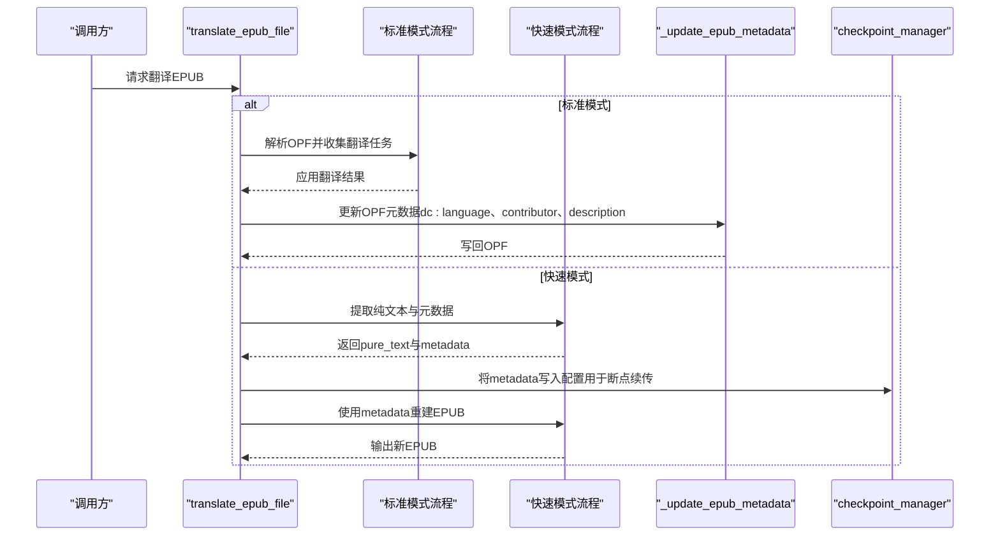
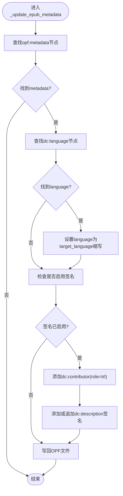
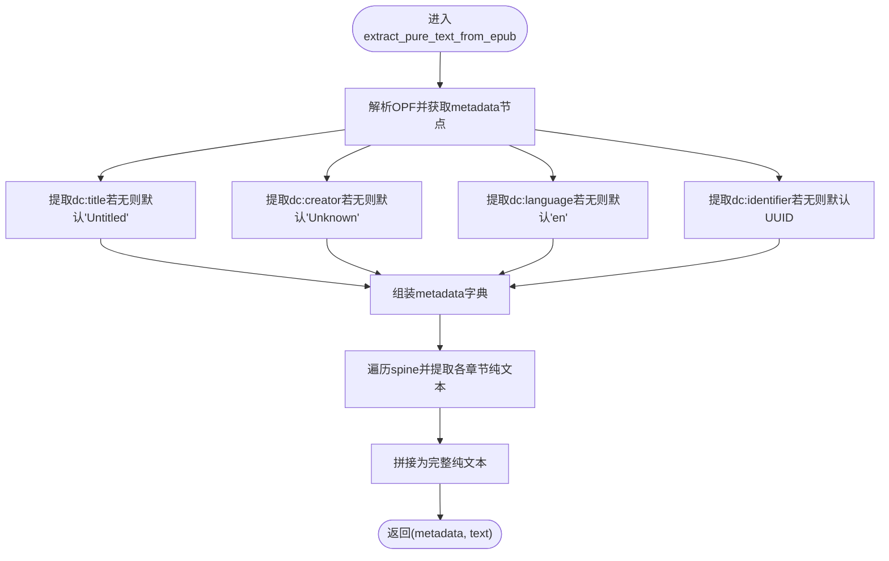
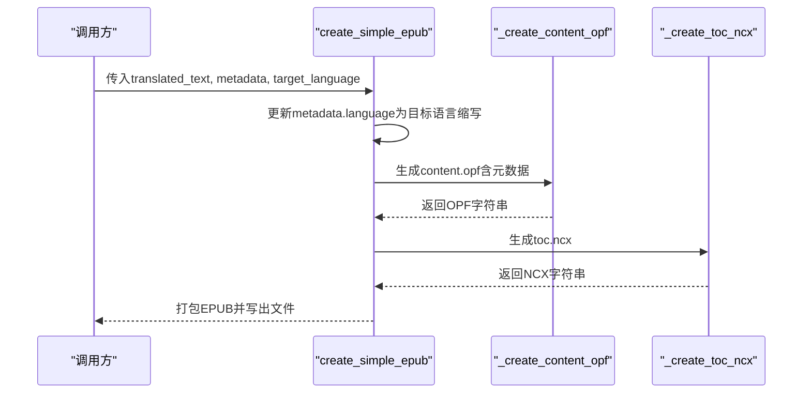
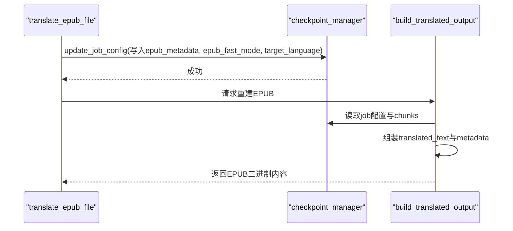
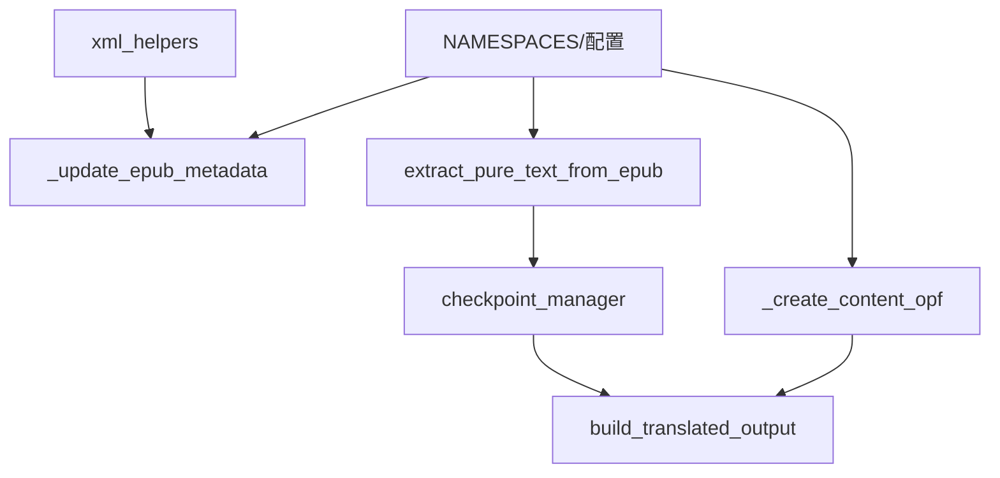

# 元数据更新与管理

<cite>
**本文引用的文件**
- [src/core/epub/translator.py](file://src/core/epub/translator.py)
- [src/core/epub/epub_fast_processor.py](file://src/core/epub/epub_fast_processor.py)
- [src/core/epub/xml_helpers.py](file://src/core/epub/xml_helpers.py)
- [src/persistence/checkpoint_manager.py](file://src/persistence/checkpoint_manager.py)
- [src/config.py](file://src/config.py)
- [src/core/epub/constants.py](file://src/core/epub/constants.py)
</cite>

## 目录
1. [简介](#简介)
2. [项目结构](#项目结构)
3. [核心组件](#核心组件)
4. [架构总览](#架构总览)
5. [详细组件分析](#详细组件分析)
6. [依赖关系分析](#依赖关系分析)
7. [性能考量](#性能考量)
8. [故障排查指南](#故障排查指南)
9. [结论](#结论)

## 简介
本文件聚焦于EPUB元数据处理流程，系统性说明两种翻译模式下的元数据更新策略：
- 标准模式：通过_lxml修改OPF中的dc:language、dc:creator等元素，注入目标语言与翻译贡献者信息。
- 快速模式：从原始OPF中抽取title、author、identifier等基础元数据，交由重建阶段重新注入到新OPF中，确保阅读器能正确识别书籍信息。

同时，文档阐述metadata字典的结构、在断点续传中的持久化与恢复机制，以及XPath查询示例，帮助读者理解元数据在整个翻译流水线中的关键作用。

## 项目结构
围绕EPUB元数据处理的关键模块如下：
- 标准模式元数据更新：在翻译完成后，直接修改原OPF文件的元数据节点。
- 快速模式元数据抽取与重建：先从OPF解析出title、author、language、identifier，再在重建阶段写入新的content.opf。
- 断点续传支持：通过checkpoint_manager持久化metadata字典，以便在快速模式下恢复重建。

图表来源
- [src/core/epub/translator.py](file://src/core/epub/translator.py#L120-L145)
- [src/core/epub/translator.py](file://src/core/epub/translator.py#L732-L824)
- [src/core/epub/epub_fast_processor.py](file://src/core/epub/epub_fast_processor.py#L40-L173)
- [src/core/epub/epub_fast_processor.py](file://src/core/epub/epub_fast_processor.py#L353-L458)
- [src/persistence/checkpoint_manager.py](file://src/persistence/checkpoint_manager.py#L48-L81)

章节来源
- [src/core/epub/translator.py](file://src/core/epub/translator.py#L120-L145)
- [src/core/epub/epub_fast_processor.py](file://src/core/epub/epub_fast_processor.py#L40-L173)
- [src/persistence/checkpoint_manager.py](file://src/persistence/checkpoint_manager.py#L48-L81)

## 核心组件
- 标准模式元数据更新函数：_update_epub_metadata
  - 功能：定位OPF的metadata节点，更新dc:language为目标语言缩写；在启用签名时添加dc:contributor与dc:description。
  - 路径参考：[src/core/epub/translator.py](file://src/core/epub/translator.py#L621-L672)
- 快速模式元数据抽取：extract_pure_text_from_epub
  - 功能：解析OPF，提取title、author、language、identifier等字段，作为metadata字典返回。
  - 路径参考：[src/core/epub/epub_fast_processor.py](file://src/core/epub/epub_fast_processor.py#L105-L123)
- 快速模式元数据重建：create_simple_epub
  - 功能：基于metadata字典创建content.opf，写入dc:title、dc:creator、dc:language、dc:identifier等。
  - 路径参考：[src/core/epub/epub_fast_processor.py](file://src/core/epub/epub_fast_processor.py#L602-L666)
- 断点续传与metadata持久化：checkpoint_manager
  - 功能：在快速模式翻译过程中保存metadata字典，供后续重建使用；支持加载检查点、恢复进度。
  - 路径参考：[src/persistence/checkpoint_manager.py](file://src/persistence/checkpoint_manager.py#L48-L81)
  - 恢复重建逻辑：[src/persistence/checkpoint_manager.py](file://src/persistence/checkpoint_manager.py#L426-L521)

章节来源
- [src/core/epub/translator.py](file://src/core/epub/translator.py#L621-L672)
- [src/core/epub/epub_fast_processor.py](file://src/core/epub/epub_fast_processor.py#L105-L123)
- [src/core/epub/epub_fast_processor.py](file://src/core/epub/epub_fast_processor.py#L602-L666)
- [src/persistence/checkpoint_manager.py](file://src/persistence/checkpoint_manager.py#L48-L81)
- [src/persistence/checkpoint_manager.py](file://src/persistence/checkpoint_manager.py#L426-L521)

## 架构总览
标准模式与快速模式在元数据处理上的差异与衔接如下：

图表来源
- [src/core/epub/translator.py](file://src/core/epub/translator.py#L120-L145)
- [src/core/epub/translator.py](file://src/core/epub/translator.py#L621-L672)
- [src/core/epub/translator.py](file://src/core/epub/translator.py#L732-L824)
- [src/core/epub/epub_fast_processor.py](file://src/core/epub/epub_fast_processor.py#L40-L173)
- [src/core/epub/epub_fast_processor.py](file://src/core/epub/epub_fast_processor.py#L353-L458)
- [src/persistence/checkpoint_manager.py](file://src/persistence/checkpoint_manager.py#L48-L81)

## 详细组件分析

### 标准模式元数据更新：_update_epub_metadata
- XPath定位与更新
  - 定位metadata节点：使用命名空间映射查找opf:metadata。
  - 更新dc:language：将语言设置为target_language的小写前两位（如“zh”）。
  - 添加贡献者与描述：当启用签名时，添加dc:contributor（role=trl），并在dc:description追加签名文本。
- 写回OPF
  - 使用lxml写回原OPF路径，保持UTF-8编码与格式化输出。

图表来源
- [src/core/epub/translator.py](file://src/core/epub/translator.py#L621-L672)
- [src/config.py](file://src/config.py#L110-L116)

章节来源
- [src/core/epub/translator.py](file://src/core/epub/translator.py#L621-L672)
- [src/config.py](file://src/config.py#L110-L116)

### 快速模式元数据抽取：extract_pure_text_from_epub
- OPF解析与元数据提取
  - 查找opf:metadata，依次提取dc:title、dc:creator、dc:language、dc:identifier。
  - 若缺失则使用默认值（title、author默认“未命名/未知”，language默认“en”，identifier默认UUID）。
- 内容遍历
  - 基于spine顺序遍历内容文件，逐个提取纯文本，最终拼接为完整文本。
- 返回值
  - 返回元数据字典metadata与纯文本字符串。

图表来源
- [src/core/epub/epub_fast_processor.py](file://src/core/epub/epub_fast_processor.py#L105-L123)
- [src/core/epub/epub_fast_processor.py](file://src/core/epub/epub_fast_processor.py#L40-L173)

章节来源
- [src/core/epub/epub_fast_processor.py](file://src/core/epub/epub_fast_processor.py#L105-L123)
- [src/core/epub/epub_fast_processor.py](file://src/core/epub/epub_fast_processor.py#L40-L173)

### 快速模式元数据重建：create_simple_epub
- 语言更新
  - 在创建章节XHTML之前，将metadata['language']更新为目标语言缩写。
- OPF与NCX生成
  - _create_content_opf根据metadata字典生成content.opf，包含dc:title、dc:creator、dc:language、dc:identifier等。
  - _create_toc_ncx生成导航文件toc.ncx。
- 文件打包
  - 按EPUB规范顺序写入mimetype、META-INF/container.xml、content.opf、toc.ncx、样式表与章节文件。

图表来源
- [src/core/epub/epub_fast_processor.py](file://src/core/epub/epub_fast_processor.py#L353-L458)
- [src/core/epub/epub_fast_processor.py](file://src/core/epub/epub_fast_processor.py#L602-L666)
- [src/core/epub/epub_fast_processor.py](file://src/core/epub/epub_fast_processor.py#L668-L712)

章节来源
- [src/core/epub/epub_fast_processor.py](file://src/core/epub/epub_fast_processor.py#L353-L458)
- [src/core/epub/epub_fast_processor.py](file://src/core/epub/epub_fast_processor.py#L602-L666)
- [src/core/epub/epub_fast_processor.py](file://src/core/epub/epub_fast_processor.py#L668-L712)

### 断点续传中的metadata字典
- 快速模式保存
  - 在翻译开始后，将extract_pure_text_from_epub返回的metadata写入job配置，标记epub_fast_mode与target_language，便于后续重建。
  - 路径参考：[src/core/epub/translator.py](file://src/core/epub/translator.py#L770-L814)
- 恢复重建
  - 通过checkpoint_manager.build_translated_output读取已保存的metadata与翻译片段，重建EPUB。
  - 路径参考：[src/persistence/checkpoint_manager.py](file://src/persistence/checkpoint_manager.py#L426-L521)

图表来源
- [src/core/epub/translator.py](file://src/core/epub/translator.py#L770-L814)
- [src/persistence/checkpoint_manager.py](file://src/persistence/checkpoint_manager.py#L426-L521)

章节来源
- [src/core/epub/translator.py](file://src/core/epub/translator.py#L770-L814)
- [src/persistence/checkpoint_manager.py](file://src/persistence/checkpoint_manager.py#L426-L521)

### XPath查询示例（定位Dublin Core元数据节点）
以下示例展示如何使用XPath定位OPF中的常见元数据节点（需结合命名空间映射）：
- 定位metadata容器节点
  - XPath: //opf:metadata
  - 参考路径：[src/core/epub/translator.py](file://src/core/epub/translator.py#L636-L639)
  - 参考路径：[src/core/epub/epub_fast_processor.py](file://src/core/epub/epub_fast_processor.py#L105-L107)
- 定位dc:title
  - XPath: //opf:metadata/dc:title
  - 参考路径：[src/core/epub/epub_fast_processor.py](file://src/core/epub/epub_fast_processor.py#L108-L110)
- 定位dc:identifier
  - XPath: //opf:metadata/dc:identifier
  - 参考路径：[src/core/epub/epub_fast_processor.py](file://src/core/epub/epub_fast_processor.py#L120-L122)
- 定位dc:language
  - XPath: //opf:metadata/dc:language
  - 参考路径：[src/core/epub/translator.py](file://src/core/epub/translator.py#L640-L642)
- 定位dc:creator
  - XPath: //opf:metadata/dc:creator
  - 参考路径：[src/core/epub/epub_fast_processor.py](file://src/core/epub/epub_fast_processor.py#L112-L114)

章节来源
- [src/core/epub/translator.py](file://src/core/epub/translator.py#L636-L642)
- [src/core/epub/epub_fast_processor.py](file://src/core/epub/epub_fast_processor.py#L108-L122)

## 依赖关系分析
- 命名空间与常量
  - NAMESPACES定义了opf、dc、xhtml、epub等命名空间，是所有XPath查询的基础。
  - 参考路径：[src/config.py](file://src/config.py#L110-L116)
- 标准模式依赖
  - _update_epub_metadata依赖NAMESPACES与签名配置（SIGNATURE_ENABLED、PROJECT_NAME、PROJECT_GITHUB）。
  - 参考路径：[src/core/epub/translator.py](file://src/core/epub/translator.py#L634-L671)
  - 参考路径：[src/config.py](file://src/config.py#L83-L91)
- 快速模式依赖
  - extract_pure_text_from_epub与_create_content_opf均依赖NAMESPACES与签名配置。
  - 参考路径：[src/core/epub/epub_fast_processor.py](file://src/core/epub/epub_fast_processor.py#L105-L123)
  - 参考路径：[src/core/epub/epub_fast_processor.py](file://src/core/epub/epub_fast_processor.py#L602-L666)
- 元素重建工具
  - xml_helpers提供安全的元素操作与重建能力，辅助标准模式下复杂结构的还原。
  - 参考路径：[src/core/epub/xml_helpers.py](file://src/core/epub/xml_helpers.py#L223-L280)

图表来源
- [src/config.py](file://src/config.py#L110-L116)
- [src/core/epub/translator.py](file://src/core/epub/translator.py#L634-L671)
- [src/core/epub/epub_fast_processor.py](file://src/core/epub/epub_fast_processor.py#L105-L123)
- [src/core/epub/epub_fast_processor.py](file://src/core/epub/epub_fast_processor.py#L602-L666)
- [src/core/epub/xml_helpers.py](file://src/core/epub/xml_helpers.py#L223-L280)
- [src/persistence/checkpoint_manager.py](file://src/persistence/checkpoint_manager.py#L426-L521)

章节来源
- [src/config.py](file://src/config.py#L110-L116)
- [src/core/epub/translator.py](file://src/core/epub/translator.py#L634-L671)
- [src/core/epub/epub_fast_processor.py](file://src/core/epub/epub_fast_processor.py#L105-L123)
- [src/core/epub/epub_fast_processor.py](file://src/core/epub/epub_fast_processor.py#L602-L666)
- [src/core/epub/xml_helpers.py](file://src/core/epub/xml_helpers.py#L223-L280)
- [src/persistence/checkpoint_manager.py](file://src/persistence/checkpoint_manager.py#L426-L521)

## 性能考量
- 标准模式
  - 直接修改OPF文件，避免重排内容结构，I/O开销较低；但需要确保命名空间与节点存在性判断，防止空指针。
- 快速模式
  - 先抽取纯文本再重建，可绕过复杂标签占位符问题，提升稳定性；但需注意语言字段在重建前更新，避免生成错误的元数据。
- 断点续传
  - 仅保存metadata与翻译片段，恢复时按相同逻辑重建，减少重复计算；建议在大文件场景下开启以提升可用性。

## 故障排查指南
- OPF解析失败
  - 现象：找不到OPF或解析异常。
  - 排查：确认EPUB结构完整，manifest/spine存在；检查NAMESPACES映射是否正确。
  - 参考路径：[src/core/epub/epub_fast_processor.py](file://src/core/epub/epub_fast_processor.py#L95-L129)
- 缺失元数据节点
  - 现象：dc:title、dc:identifier等缺失导致默认值生效。
  - 排查：确认OPF中是否存在对应节点；必要时手动补充。
  - 参考路径：[src/core/epub/epub_fast_processor.py](file://src/core/epub/epub_fast_processor.py#L108-L122)
- 签名未生效
  - 现象：dc:contributor、dc:description未出现。
  - 排查：检查SIGNATURE_ENABLED是否开启；确认PROJECT_NAME与PROJECT_GITHUB配置。
  - 参考路径：[src/config.py](file://src/config.py#L83-L91)
  - 参考路径：[src/core/epub/translator.py](file://src/core/epub/translator.py#L644-L669)
- 断点续传metadata丢失
  - 现象：恢复重建时缺少元数据。
  - 排查：确认checkpoint_manager.update_job_config是否成功写入；检查job配置中epub_metadata字段。
  - 参考路径：[src/core/epub/translator.py](file://src/core/epub/translator.py#L774-L784)
  - 参考路径：[src/persistence/checkpoint_manager.py](file://src/persistence/checkpoint_manager.py#L426-L451)

章节来源
- [src/core/epub/epub_fast_processor.py](file://src/core/epub/epub_fast_processor.py#L95-L129)
- [src/core/epub/epub_fast_processor.py](file://src/core/epub/epub_fast_processor.py#L108-L122)
- [src/config.py](file://src/config.py#L83-L91)
- [src/core/epub/translator.py](file://src/core/epub/translator.py#L644-L669)
- [src/core/epub/translator.py](file://src/core/epub/translator.py#L774-L784)
- [src/persistence/checkpoint_manager.py](file://src/persistence/checkpoint_manager.py#L426-L451)

## 结论
- 标准模式通过_lxml直接修改OPF元数据，确保与原文档结构一致，适合保留复杂排版的场景。
- 快速模式通过抽取与重建的方式，简化了标签处理与占位符校验，更适合大规模翻译与严格阅读器兼容。
- metadata字典在断点续传中扮演关键角色，既保证了元数据一致性，也提升了整体流程的鲁棒性。
- 正确使用XPath与命名空间映射，是可靠定位与更新Dublin Core元数据的前提。