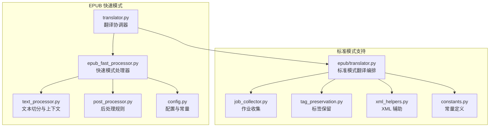
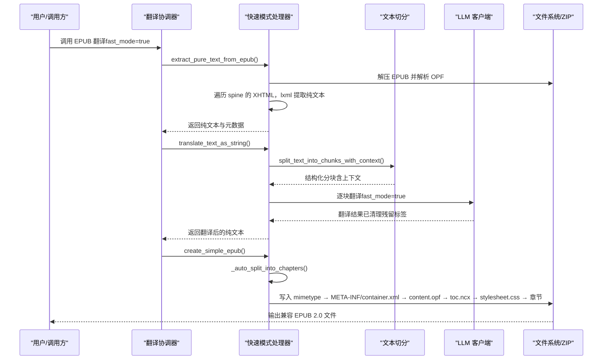
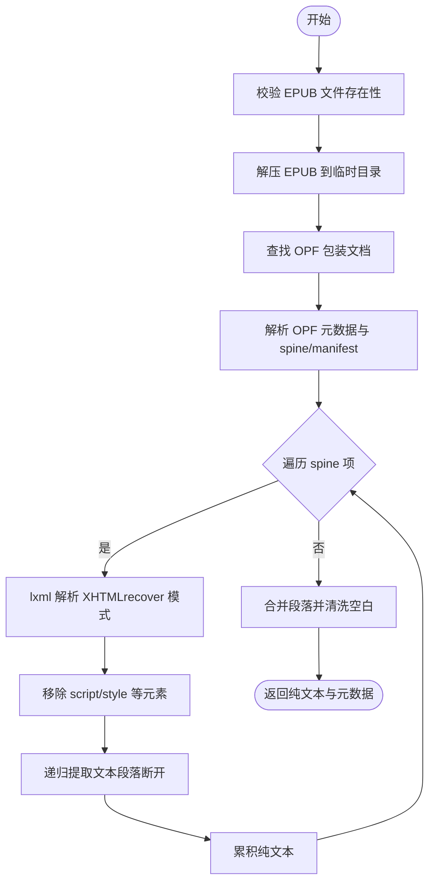
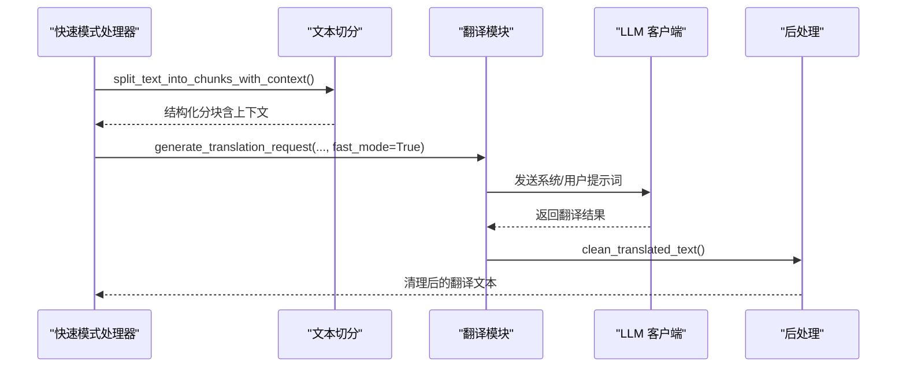
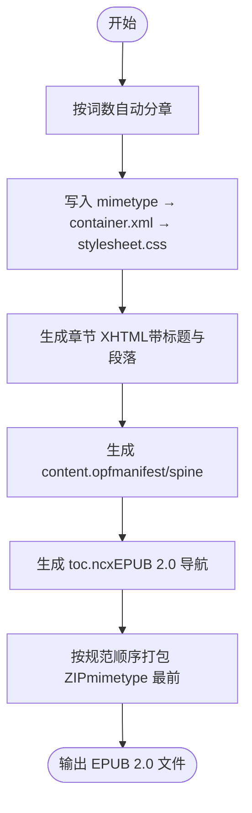
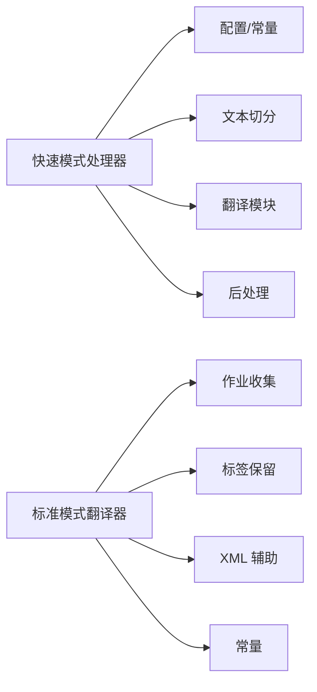

# 快速模式：纯文本重建

<cite>
**本文引用的文件列表**
- [epub_fast_processor.py](file://src/core/epub/epub_fast_processor.py)
- [translator.py](file://src/core/translator.py)
- [text_processor.py](file://src/core/text_processor.py)
- [post_processor.py](file://src/core/post_processor.py)
- [translator_module.py](file://src/core/epub/translator.py)
- [constants.py](file://src/core/epub/constants.py)
- [tag_preservation.py](file://src/core/epub/tag_preservation.py)
- [xml_helpers.py](file://src/core/epub/xml_helpers.py)
- [job_collector.py](file://src/core/epub/job_collector.py)
- [config.py](file://src/config.py)
</cite>

## 目录
1. [引言](#引言)
2. [项目结构](#项目结构)
3. [核心组件](#核心组件)
4. [架构总览](#架构总览)
5. [详细组件分析](#详细组件分析)
6. [依赖关系分析](#依赖关系分析)
7. [性能考量](#性能考量)
8. [故障排查指南](#故障排查指南)
9. [结论](#结论)
10. [附录](#附录)

## 引言
本技术文档聚焦于 EPUB 快速模式（Fast Mode），系统阐述其生产级设计理念与实现细节。快速模式通过“完全剥离 HTML 结构，提取纯文本进行翻译，再重建标准化 EPUB 2.0 文件”的路径，彻底规避标签保持难题，确保在严格阅读器（如 Aquile Reader 等）上获得最高兼容性与稳定性。本文将深入解析以下关键流程：
- 如何递归遍历所有 XHTML 文档并使用 lxml 提取纯文本；
- 如何调用标准文本翻译管道处理大文本块；
- 如何构建扁平目录、正确 ZIP 文件顺序（mimetype 优先）、UTF-8 编码、EPUB 2.0 NCX 导航文件；
- 如何通过自动分章实现等量分段与简洁 CSS 样式表；
- 对比标准模式在兼容性、稳定性与格式保真度上的取舍。

## 项目结构
快速模式位于 EPUB 子模块中，核心文件包括：
- 快速模式处理器：负责提取纯文本、翻译、重建 EPUB；
- 翻译协调器：在标准模式与快速模式之间路由；
- 文本处理器：提供按句边界切分与上下文保留；
- 后处理模块：清理翻译残留标记与多余空白；
- 配置与常量：命名空间、分句终止符、占位符模式等。

图表来源
- [epub_fast_processor.py](file://src/core/epub/epub_fast_processor.py#L1-L120)
- [translator.py](file://src/core/translator.py#L1-L120)
- [text_processor.py](file://src/core/text_processor.py#L1-L120)
- [post_processor.py](file://src/core/post_processor.py#L1-L120)
- [translator_module.py](file://src/core/epub/translator.py#L1-L120)
- [job_collector.py](file://src/core/epub/job_collector.py#L1-L120)
- [tag_preservation.py](file://src/core/epub/tag_preservation.py#L1-L120)
- [xml_helpers.py](file://src/core/epub/xml_helpers.py#L1-L120)
- [constants.py](file://src/core/epub/constants.py#L1-L24)
- [config.py](file://src/config.py#L100-L140)

章节来源
- [epub_fast_processor.py](file://src/core/epub/epub_fast_processor.py#L1-L120)
- [translator.py](file://src/core/translator.py#L1-L120)
- [config.py](file://src/config.py#L100-L140)

## 核心组件
- 快速模式处理器（extract_pure_text_from_epub、translate_text_as_string、create_simple_epub）
- 文本切分与上下文（split_text_into_chunks_with_context）
- 后处理规则（移除残留标签占位符、清理多余空白、HTML 实体清理）
- 标准模式对比组件（作业收集、标签保留、XML 辅助）

章节来源
- [epub_fast_processor.py](file://src/core/epub/epub_fast_processor.py#L40-L173)
- [epub_fast_processor.py](file://src/core/epub/epub_fast_processor.py#L714-L833)
- [epub_fast_processor.py](file://src/core/epub/epub_fast_processor.py#L353-L459)
- [text_processor.py](file://src/core/text_processor.py#L42-L174)
- [post_processor.py](file://src/core/post_processor.py#L1-L120)
- [translator_module.py](file://src/core/epub/translator.py#L1-L120)

## 架构总览
快速模式的端到端流程如下：
- 输入 EPUB 解压并定位 OPF；
- 遍历 spine 中的 XHTML 内容，使用 lxml 解析并提取纯文本；
- 将纯文本送入标准文本翻译管道，按句边界切分为等量块；
- 重建 EPUB 2.0 结构：扁平目录、正确 ZIP 顺序、UTF-8 编码、NCX 导航；
- 自动分章（按词数），生成简洁 CSS 样式表。

图表来源
- [translator.py](file://src/core/translator.py#L92-L103)
- [translator_module.py](file://src/core/epub/translator.py#L732-L833)
- [epub_fast_processor.py](file://src/core/epub/epub_fast_processor.py#L40-L173)
- [epub_fast_processor.py](file://src/core/epub/epub_fast_processor.py#L714-L833)
- [epub_fast_processor.py](file://src/core/epub/epub_fast_processor.py#L353-L459)
- [text_processor.py](file://src/core/text_processor.py#L42-L174)

## 详细组件分析

### 组件A：纯文本提取（extract_pure_text_from_epub）
- 设计理念：剥离一切 HTML/XML/结构，仅保留可读文本；对异常 EPUB 做稳健降级与错误分类。
- 关键步骤：
  - 校验输入并解压 EPUB；
  - 查找 OPF 并解析元数据（标题、作者、语言、标识）；
  - 从 manifest/spine 获取 XHTML 列表，按阅读顺序遍历；
  - 使用 lxml 解析 XHTML，移除 script/style 等不可见内容，递归提取文本；
  - 清洗段落与空白，合并为纯文本串。
- 错误处理：对 ZIP/OPF 解析失败、结构缺失、单章提取失败等情况分别抛出明确异常，保证可观测性与可恢复性。

图表来源
- [epub_fast_processor.py](file://src/core/epub/epub_fast_processor.py#L40-L173)
- [epub_fast_processor.py](file://src/core/epub/epub_fast_processor.py#L182-L233)
- [epub_fast_processor.py](file://src/core/epub/epub_fast_processor.py#L235-L318)

章节来源
- [epub_fast_processor.py](file://src/core/epub/epub_fast_processor.py#L40-L173)
- [epub_fast_processor.py](file://src/core/epub/epub_fast_processor.py#L182-L233)
- [epub_fast_processor.py](file://src/core/epub/epub_fast_processor.py#L235-L318)

### 组件B：标准文本翻译管道（translate_text_as_string）
- 设计理念：以“纯文本 + 句边界 + 上下文”为核心，确保大文本块翻译稳定与一致性。
- 关键步骤：
  - 使用文本处理器按句边界切分，保留前后文；
  - 调用翻译模块生成请求（fast_mode=true，不包含占位符指令）；
  - 收集翻译结果并进行后处理（清理残留标签、多余空白、HTML 实体）。
- 性能与稳定性：支持进度回调、统计回调、中断检查、断点续传（结合检查点管理器）。

图表来源
- [epub_fast_processor.py](file://src/core/epub/epub_fast_processor.py#L714-L833)
- [text_processor.py](file://src/core/text_processor.py#L42-L174)
- [translator.py](file://src/core/translator.py#L26-L121)
- [post_processor.py](file://src/core/post_processor.py#L1-L120)

章节来源
- [epub_fast_processor.py](file://src/core/epub/epub_fast_processor.py#L714-L833)
- [text_processor.py](file://src/core/text_processor.py#L42-L174)
- [translator.py](file://src/core/translator.py#L26-L121)
- [post_processor.py](file://src/core/post_processor.py#L1-L120)

### 组件C：EPUB 2.0 重建（create_simple_epub）
- 设计理念：扁平目录、严格 ZIP 顺序（mimetype → META-INF/container.xml → content.opf → toc.ncx → 其他）、UTF-8 编码、EPUB 2.0 NCX 导航。
- 关键步骤：
  - 自动分章：按词数（默认约 5000 词/章）分割纯文本，尊重段落与句边界；
  - 创建 mimetype（无压缩）、container.xml（指向根目录 content.opf）、stylesheet.css（简洁易读）；
  - 生成章节 XHTML（每章一个文件，标题“Chapter N”，段落 p 标签，首段缩进）；
  - 生成 content.opf（manifest/spine，EPUB 2.0 规范，不含 nav.xhtml）；
  - 生成 toc.ncx（EPUB 2.0 导航，基于章节数量）；
  - 正确打包：先 mimetype，再 META-INF/container.xml，随后 OPF/NCX/CSS，最后章节文件。
- 样式与兼容性：使用简洁 CSS，避免复杂布局；EPUB 2.0 导航与扁平结构最大化兼容严格阅读器。

图表来源
- [epub_fast_processor.py](file://src/core/epub/epub_fast_processor.py#L353-L459)
- [epub_fast_processor.py](file://src/core/epub/epub_fast_processor.py#L460-L511)
- [epub_fast_processor.py](file://src/core/epub/epub_fast_processor.py#L513-L712)

章节来源
- [epub_fast_processor.py](file://src/core/epub/epub_fast_processor.py#L353-L459)
- [epub_fast_processor.py](file://src/core/epub/epub_fast_processor.py#L460-L511)
- [epub_fast_processor.py](file://src/core/epub/epub_fast_processor.py#L513-L712)

### 组件D：自动分章与样式（_auto_split_into_chapters 与 CSS）
- 自动分章策略：
  - 以段落为单位（由空行分隔）；
  - 计算词数阈值（默认 5000 词/章），超过阈值则保存当前章节并开启新章节；
  - 保证至少一章，若无段落则将整段作为一章。
- 样式表：
  - 简洁字体与行高，最大宽度限制；
  - 标题居中，段落两端对齐，首段缩进；
  - 适合移动端与严格阅读器的可读性设计。

章节来源
- [epub_fast_processor.py](file://src/core/epub/epub_fast_processor.py#L460-L511)
- [epub_fast_processor.py](file://src/core/epub/epub_fast_processor.py#L524-L549)

### 组件E：标签保持与回写（标准模式对比）
- 标签保留机制（标准模式）：
  - 使用 TagPreserver 将 HTML/XML 标签替换为占位符（如 TAG0），翻译后再还原；
  - 在应用阶段，使用 XML 辅助工具安全重建元素树，保留内联标签结构；
  - 若检测到占位符缺失或变异，执行修复与重试。
- 快速模式取舍：
  - 不保留任何标签，直接重建纯文本章节；
  - 优点：兼容性与稳定性显著提升，适合弱模型与严格阅读器；
  - 代价：失去内联样式与结构化标记（如 em/strong/链接等）。

章节来源
- [tag_preservation.py](file://src/core/epub/tag_preservation.py#L1-L155)
- [xml_helpers.py](file://src/core/epub/xml_helpers.py#L223-L280)
- [translator_module.py](file://src/core/epub/translator.py#L496-L537)

## 依赖关系分析
- 快速模式处理器依赖：
  - 配置与常量（命名空间、分句终止符、翻译标签）；
  - 文本处理器（按句切分与上下文）；
  - 翻译模块（fast_mode=true 的请求生成与后处理）；
  - 后处理模块（清理残留标签与多余空白）。
- 标准模式依赖：
  - 作业收集器（识别可翻译段落，处理块内容与尾部文本）；
  - 标签保留器（占位符替换与还原）；
  - XML 辅助（安全迭代、序列化、重建元素树）；
  - 常量（上下文窗口、占位符正则）。

图表来源
- [epub_fast_processor.py](file://src/core/epub/epub_fast_processor.py#L1-L120)
- [text_processor.py](file://src/core/text_processor.py#L1-L120)
- [translator.py](file://src/core/translator.py#L1-L120)
- [post_processor.py](file://src/core/post_processor.py#L1-L120)
- [translator_module.py](file://src/core/epub/translator.py#L1-L120)
- [job_collector.py](file://src/core/epub/job_collector.py#L1-L120)
- [tag_preservation.py](file://src/core/epub/tag_preservation.py#L1-L120)
- [xml_helpers.py](file://src/core/epub/xml_helpers.py#L1-L120)
- [constants.py](file://src/core/epub/constants.py#L1-L24)
- [config.py](file://src/config.py#L100-L140)

章节来源
- [epub_fast_processor.py](file://src/core/epub/epub_fast_processor.py#L1-L120)
- [translator_module.py](file://src/core/epub/translator.py#L1-L120)

## 性能考量
- I/O 与内存：
  - 快速模式在提取阶段一次性读取并解析 XHTML，建议对超大 EPUB 使用流式处理或分批处理（当前实现为一次性加载，注意内存占用）。
  - 分章时按词数切分，避免过大的单章导致翻译不稳定。
- 翻译效率：
  - 文本切分按句边界，减少跨句语义断裂；
  - fast_mode 下不包含占位符指令，提示词更简洁，降低 LLM 失真风险。
- ZIP 打包顺序：
  - 严格遵循 mimetype → META-INF/container.xml → OPF/NCX/CSS → 章节的顺序，避免某些阅读器解析失败。
- 编码与兼容性：
  - 全部使用 UTF-8 无 BOM，EPUB 2.0 导航与扁平结构最大化兼容严格阅读器。

[本节为通用性能讨论，无需列出具体文件来源]

## 故障排查指南
- EPUB 文件无效：
  - 现象：抛出“EPUB 文件不存在/不是有效 ZIP/OPF 结构无效”等错误；
  - 排查：确认输入路径、EPUB 是否被其他进程占用、是否为完整 ZIP；
  - 处理：修正输入或重新下载 EPUB。
- 单章提取失败：
  - 现象：某章节解析异常导致跳过；
  - 排查：查看日志回调事件类型，确认章节路径与解析错误；
  - 处理：忽略该章节继续，或手动修复该章节 XHTML。
- 翻译失败或占位符缺失：
  - 现象：标准模式下出现占位符缺失/变异警告；
  - 排查：检查 LLM 返回内容是否包含翻译标签、是否存在输入回显；
  - 处理：启用快速模式，或调整提示词与上下文窗口。
- ZIP 无法打开：
  - 现象：部分阅读器报错；
  - 排查：确认 mimetype 是否无压缩、container.xml 是否在 META-INF、OPF/NCX 是否先于章节写入；
  - 处理：重新打包并检查顺序。

章节来源
- [epub_fast_processor.py](file://src/core/epub/epub_fast_processor.py#L174-L180)
- [translator_module.py](file://src/core/epub/translator.py#L438-L494)
- [translator_module.py](file://src/core/epub/translator.py#L539-L579)

## 结论
快速模式通过“纯文本 + 标准翻译管道 + EPUB 2.0 重建”的组合，实现了在严格阅读器与弱模型环境下的高兼容性与高稳定性。其核心优势在于：
- 彻底规避标签保持难题，避免占位符丢失与结构破坏；
- 扁平结构与正确 ZIP 顺序确保广泛兼容；
- 自动分章与简洁样式提升可读性与可移植性。

在需要保留内联样式与结构标记的场景，可选择标准模式；而在追求稳定与兼容性的大多数情况下，快速模式是更稳妥的选择。

[本节为总结性内容，无需列出具体文件来源]

## 附录
- 快速模式参数与行为要点：
  - 分句终止符来自配置，用于切分句边界；
  - 默认每章约 5000 词，可根据设备与阅读习惯调整；
  - 输出 EPUB 2.0，不包含 nav.xhtml，导航通过 NCX 实现；
  - 自动清理翻译标签与多余空白，确保最终文本整洁。

章节来源
- [config.py](file://src/config.py#L100-L140)
- [epub_fast_processor.py](file://src/core/epub/epub_fast_processor.py#L460-L511)
- [epub_fast_processor.py](file://src/core/epub/epub_fast_processor.py#L353-L459)