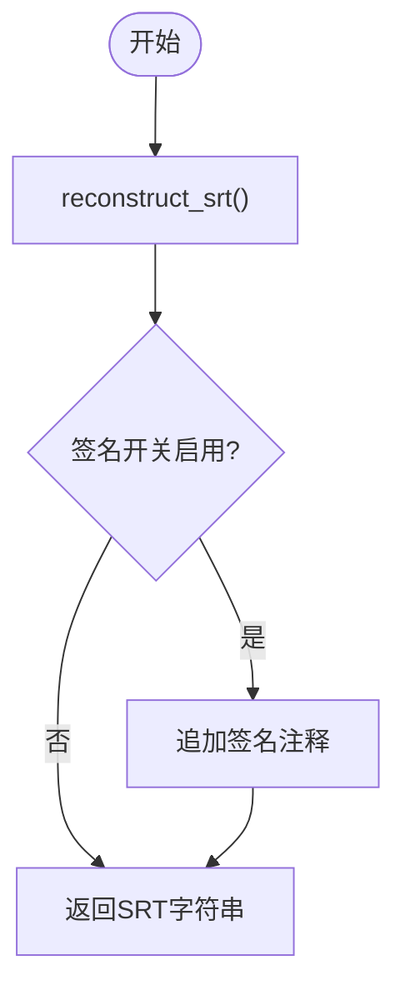

# SRT字幕格式支持

<cite>
**本文引用的文件列表**
- [srt_processor.py](file://src/core/srt_processor.py)
- [subtitle_translator.py](file://src/core/subtitle_translator.py)
- [prompts.py](file://prompts/prompts.py)
- [file_utils.py](file://src/utils/file_utils.py)
- [config.py](file://src/config.py)
- [handlers.py](file://src/api/handlers.py)
- [routes.py](file://src/api/routes.py)
- [translation_routes.py](file://src/api/blueprints/translation_routes.py)
- [index.js](file://src/web/static/js/index.js)
- [translate.py](file://translate.py)
</cite>

## 目录
1. [简介](#简介)
2. [项目结构与入口](#项目结构与入口)
3. [核心组件](#核心组件)
4. [架构总览](#架构总览)
5. [详细组件分析](#详细组件分析)
6. [依赖关系分析](#依赖关系分析)
7. [性能考量](#性能考量)
8. [故障排查指南](#故障排查指南)
9. [结论](#结论)

## 简介
本文件围绕SRT字幕文件支持进行系统化文档化，聚焦以下关键能力：
- SRTProcessor类如何通过正则表达式解析SRT块结构（序号、时间码、文本内容）
- parse_srt方法对换行符与空白块的规范化处理流程
- group_subtitles_for_translation如何将多个字幕条目按行数与字符数限制分组为翻译块，以提升翻译效率
- extract_block_translations函数如何从LLM返回的带索引文本（[1]...[2]...）中准确提取对应翻译结果，并处理索引缺失或错位等常见问题
- merge_multiline_subtitles合并断句字幕的启发式规则（基于标点和大小写判断是否为连续句子）
- 字幕文件末尾自动添加项目签名的功能实现

## 项目结构与入口
SRT字幕支持贯穿CLI与Web两种入口：
- CLI入口：translate.py根据输入文件类型自动识别并调用SRT翻译流程
- Web入口：API路由与WebSocket事件驱动翻译任务，统一委托至file_utils.translate_srt_file_with_callbacks

图表来源
- [translate.py](file://translate.py#L39-L49)
- [file_utils.py](file://src/utils/file_utils.py#L377-L388)
- [handlers.py](file://src/api/handlers.py#L266-L288)
- [srt_processor.py](file://src/core/srt_processor.py#L17-L57)
- [subtitle_translator.py](file://src/core/subtitle_translator.py#L130-L170)
- [prompts.py](file://prompts/prompts.py#L209-L322)
- [config.py](file://src/config.py#L79-L92)

章节来源
- [translate.py](file://translate.py#L39-L49)
- [file_utils.py](file://src/utils/file_utils.py#L377-L388)
- [handlers.py](file://src/api/handlers.py#L266-L288)

## 核心组件
- SRTProcessor：负责SRT解析、分组、翻译结果提取、重建与断句合并
- subtitle_translator：提供逐条与分块翻译流程，包含重试与占位符校验
- prompts：生成面向字幕翻译的系统与用户提示词，强调索引标记保留
- file_utils：统一文件类型识别与翻译流程调度（含SRT）
- config：提供SRT分块参数与签名开关等配置项

章节来源
- [srt_processor.py](file://src/core/srt_processor.py#L17-L57)
- [subtitle_translator.py](file://src/core/subtitle_translator.py#L130-L170)
- [prompts.py](file://prompts/prompts.py#L209-L322)
- [file_utils.py](file://src/utils/file_utils.py#L377-L388)
- [config.py](file://src/config.py#L79-L92)

## 架构总览
SRT翻译的端到端流程如下：

图表来源
- [handlers.py](file://src/api/handlers.py#L266-L288)
- [file_utils.py](file://src/utils/file_utils.py#L195-L337)
- [srt_processor.py](file://src/core/srt_processor.py#L96-L180)
- [subtitle_translator.py](file://src/core/subtitle_translator.py#L130-L488)
- [prompts.py](file://prompts/prompts.py#L209-L322)

## 详细组件分析

### SRTProcessor：SRT解析与重建
- 正则解析块结构
  - 使用多行模式的正则表达式捕获序号、起止时间码、以及中间的文本行
  - 解析前对换行符进行归一化，确保跨平台一致性
  - 将每个块拆分为若干段落，过滤掉不完整或非数字序号的块
- 文本规范化
  - 对空白块与换行进行标准化处理，保证后续翻译与重建稳定
- 分组策略
  - 按“每块最大行数”和“每块最大字符数”进行分组，避免单次请求过大
- 翻译结果提取
  - 从LLM返回的带索引文本中提取对应翻译，修复同一行存在多个索引或缺失索引的问题
- 断句合并
  - 基于句末标点与首字母大写等启发式规则，将相邻短句合并为更自然的长句
- 重建与签名
  - 重建SRT文本，末尾可选添加项目签名注释

图表来源
- [srt_processor.py](file://src/core/srt_processor.py#L17-L236)

章节来源
- [srt_processor.py](file://src/core/srt_processor.py#L17-L57)
- [srt_processor.py](file://src/core/srt_processor.py#L96-L180)
- [srt_processor.py](file://src/core/srt_processor.py#L181-L236)

### parse_srt：换行与空白块规范化流程
- 归一化换行：将Windows与旧版Mac换行统一为Unix风格
- 结尾补行：确保内容以换行结尾，便于后续按空行切分块
- 块切分：以双换行作为块边界，过滤空块与序号非数字的块
- 行级校验：要求至少三行（序号、时间码、正文），并验证时间码格式
- 文本拼接：将正文多行合并为一个文本字段，保留原始文本以便回填

图表来源
- [srt_processor.py](file://src/core/srt_processor.py#L17-L57)

章节来源
- [srt_processor.py](file://src/core/srt_processor.py#L17-L57)

### group_subtitles_for_translation：分块策略
- 目标
  - 将多个字幕条目按“每块最大行数”和“每块最大字符数”限制分组，减少LLM上下文压力，提升翻译稳定性
- 关键逻辑
  - 遍历字幕，累计当前块的行数与字符数
  - 当超过任一阈值时，提交当前块并开启新块
  - 空字幕条目会直接加入当前块，但不会计入字符计数，以保持语义完整性
- 输出
  - 返回多个子列表，每个子列表代表一个翻译块

图表来源
- [srt_processor.py](file://src/core/srt_processor.py#L138-L173)
- [config.py](file://src/config.py#L79-L82)

章节来源
- [srt_processor.py](file://src/core/srt_processor.py#L138-L173)
- [config.py](file://src/config.py#L79-L82)

### extract_block_translations：从LLM返回文本中提取翻译
- 输入
  - LLM返回的带索引文本（如[1]、[2]等），以及该块对应的索引列表
- 处理步骤
  - 修复同一行存在多个索引的问题：将同一行的多个索引拆分到不同行
  - 检测缺失索引：统计期望索引与实际出现索引的差集，记录告警
  - 逐行扫描：以“[索引]正文”的形式提取翻译；若索引行仅包含索引无正文，则正文从下一行开始累积
  - 收敛：当遇到新的索引或处理完最后一行时，将已累积的正文写入对应索引
- 输出
  - 返回索引到翻译文本的映射；对缺失索引记录警告

图表来源
- [srt_processor.py](file://src/core/srt_processor.py#L175-L211)
- [subtitle_translator.py](file://src/core/subtitle_translator.py#L373-L395)

章节来源
- [srt_processor.py](file://src/core/srt_processor.py#L175-L211)
- [subtitle_translator.py](file://src/core/subtitle_translator.py#L373-L395)

### merge_multiline_subtitles：断句合并启发式
- 合并目标
  - 将相邻短句合并为更自然的长句，提升可读性
- 判断规则
  - 若前一句以句末标点结束，且后一句不以大写字母开头（或为“I ”等特例），则认为可连续
  - 合并时更新结束时间码为后一条的时间码，并记录被合并的序号列表，便于溯源
- 参数
  - 可配置最大字符数，避免过度合并导致超长

图表来源
- [srt_processor.py](file://src/core/srt_processor.py#L99-L137)

章节来源
- [srt_processor.py](file://src/core/srt_processor.py#L99-L137)

### 项目签名：SRT末尾自动添加
- 触发条件
  - 在重建SRT时，若签名开关启用，则在文件末尾追加注释行，包含项目名称与仓库链接
- 配置来源
  - 由配置模块提供签名开关、项目名与仓库地址

图表来源
- [srt_processor.py](file://src/core/srt_processor.py#L76-L95)
- [config.py](file://src/config.py#L83-L92)

章节来源
- [srt_processor.py](file://src/core/srt_processor.py#L76-L95)
- [config.py](file://src/config.py#L83-L92)

## 依赖关系分析
- 文件工具层
  - file_utils.translate_srt_file_with_callbacks负责SRT文件读取、格式校验、解析、分块、翻译、回填与重建
- 处理器层
  - srt_processor提供解析、分组、提取、合并与重建能力
- 翻译层
  - subtitle_translator封装逐条与分块翻译流程，包含重试与占位符校验
- 提示词层
  - prompts.generate_subtitle_block_prompt为字幕块翻译生成系统与用户提示词，强调索引标记保留
- 配置层
  - config提供SRT分块参数与签名开关

图表来源
- [file_utils.py](file://src/utils/file_utils.py#L195-L337)
- [srt_processor.py](file://src/core/srt_processor.py#L17-L236)
- [subtitle_translator.py](file://src/core/subtitle_translator.py#L130-L488)
- [prompts.py](file://prompts/prompts.py#L209-L322)
- [config.py](file://src/config.py#L79-L92)

章节来源
- [file_utils.py](file://src/utils/file_utils.py#L195-L337)
- [srt_processor.py](file://src/core/srt_processor.py#L17-L236)
- [subtitle_translator.py](file://src/core/subtitle_translator.py#L130-L488)
- [prompts.py](file://prompts/prompts.py#L209-L322)
- [config.py](file://src/config.py#L79-L92)

## 性能考量
- 分块策略
  - 合理设置每块最大行数与字符数，平衡LLM上下文窗口与翻译稳定性
- 合并策略
  - 在保证可读性的前提下适度合并，避免超长导致LLM截断或理解偏差
- 日志与重试
  - 分块翻译具备重试机制与占位符校验，降低失败率
- I/O与并发
  - Web端通过异步与WebSocket推送进度，CLI端通过进度条反馈

[本节为通用建议，无需列出具体文件来源]

## 故障排查指南
- SRT格式无效
  - 现象：解析失败或无字幕
  - 排查：确认validate_srt返回True；检查时间码格式与块边界
  - 参考路径：[validate_srt](file://src/core/srt_processor.py#L96-L98)，[parse_srt](file://src/core/srt_processor.py#L17-L57)
- 翻译块索引缺失或错位
  - 现象：extract_block_translations返回映射不完整
  - 排查：查看日志中“缺失翻译索引”告警；必要时增强提示词中的占位符保留指令
  - 参考路径：[_fix_missing_indices](file://src/core/srt_processor.py#L221-L236)，[extract_block_translations](file://src/core/srt_processor.py#L175-L211)，[占位符校验与重试](file://src/core/subtitle_translator.py#L310-L348)
- 合并后时间码异常
  - 现象：合并后end_time未更新
  - 排查：确认merge_multiline_subtitles在合并时更新end_time
  - 参考路径：[merge_multiline_subtitles](file://src/core/srt_processor.py#L99-L137)
- 签名未生效
  - 现象：SRT末尾无签名注释
  - 排查：确认SIGNATURE_ENABLED为true，检查PROJECT_NAME与PROJECT_GITHUB配置
  - 参考路径：[reconstruct_srt签名追加](file://src/core/srt_processor.py#L88-L95)，[签名配置](file://src/config.py#L83-L92)

章节来源
- [srt_processor.py](file://src/core/srt_processor.py#L96-L137)
- [subtitle_translator.py](file://src/core/subtitle_translator.py#L310-L348)
- [config.py](file://src/config.py#L83-L92)

## 结论
SRT字幕支持通过SRTProcessor与subtitle_translator形成完整的解析、分块、翻译与重建链路。其特性包括：
- 稳健的SRT解析与规范化
- 可控的分块策略与占位符校验
- 针对索引标记的鲁棒提取与告警
- 基于标点与大小写的断句合并
- 可选的项目签名添加

这些能力共同保障了SRT翻译的准确性、可维护性与用户体验。