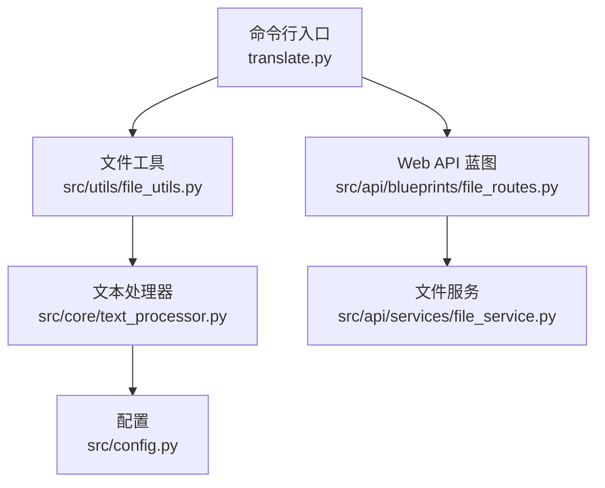
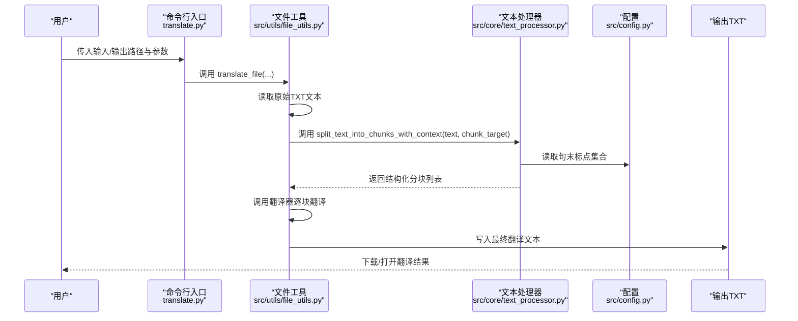
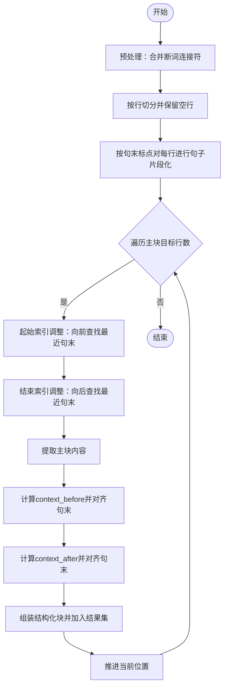
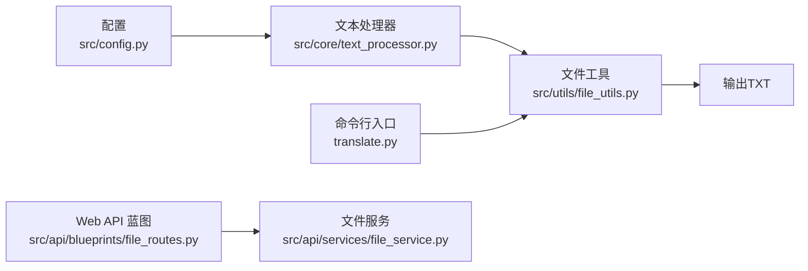
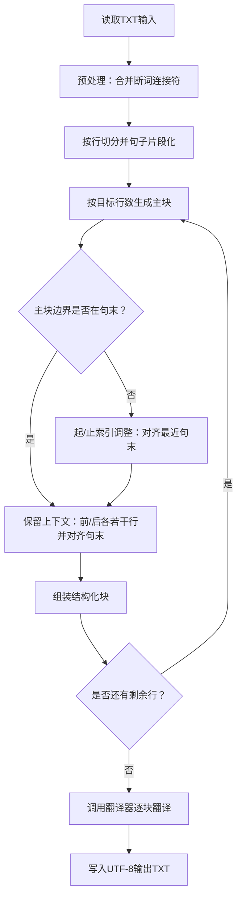

# TXT格式支持

<cite>
**本文引用的文件列表**
- [src/core/text_processor.py](file://src/core/text_processor.py)
- [src/config.py](file://src/config.py)
- [src/utils/file_utils.py](file://src/utils/file_utils.py)
- [translate.py](file://translate.py)
- [src/api/blueprints/file_routes.py](file://src/api/blueprints/file_routes.py)
- [src/api/services/file_service.py](file://src/api/services/file_service.py)
</cite>

## 目录
1. [简介](#简介)
2. [项目结构与入口](#项目结构与入口)
3. [核心组件](#核心组件)
4. [架构总览](#架构总览)
5. [组件详解](#组件详解)
6. [依赖关系分析](#依赖关系分析)
7. [性能与复杂度](#性能与复杂度)
8. [故障排查](#故障排查)
9. [结论](#结论)
10. [附录：TXT处理流程图](#附录txt处理流程图)

## 简介
本章节聚焦于TXT纯文本文件的处理机制，系统性阐述以下内容：
- 如何将长文本分割为“带上下文”的块，以提升翻译连贯性；
- 句子边界对齐算法（起止索引调整）如何利用句末标点（如句号、问号等）优化分块边界；
- 上下文前后保留策略（context_before/context_after）在维持语义完整性中的作用；
- 提供端到端的代码路径示例，展示从读取TXT到保存翻译结果的完整流程；
- 讨论该方法在处理不同语言文本时的适应性；
- 指出TXT格式处理的优势（简单高效）与局限性（无结构信息）。

## 项目结构与入口
- 命令行入口负责解析参数并调用统一的文件翻译接口；
- 文件工具模块根据扩展名自动识别TXT并执行对应流程；
- 文本处理器模块实现分块与上下文对齐的核心逻辑；
- 配置模块集中定义句末标点集合等关键参数；
- Web API层提供下载、删除等文件管理能力，便于用户获取翻译结果。

图表来源
- [translate.py](file://translate.py#L1-L147)
- [src/utils/file_utils.py](file://src/utils/file_utils.py#L390-L405)
- [src/core/text_processor.py](file://src/core/text_processor.py#L1-L174)
- [src/config.py](file://src/config.py#L107-L109)
- [src/api/blueprints/file_routes.py](file://src/api/blueprints/file_routes.py#L1-L234)
- [src/api/services/file_service.py](file://src/api/services/file_service.py#L1-L215)

章节来源
- [translate.py](file://translate.py#L1-L147)
- [src/utils/file_utils.py](file://src/utils/file_utils.py#L390-L405)

## 核心组件
- 分块与上下文对齐算法：位于文本处理器模块，负责将输入文本按目标行数切分为主块，并在主块前后保留若干行上下文，同时保证分块边界落在句子末尾。
- 配置项：句末标点集合（用于句子边界检测），以及主块目标行数等参数。
- 文件处理流程：CLI/Web入口调用文件工具，读取TXT内容，调用分块函数生成结构化块，再进行翻译与落盘。

章节来源
- [src/core/text_processor.py](file://src/core/text_processor.py#L1-L174)
- [src/config.py](file://src/config.py#L107-L109)
- [src/utils/file_utils.py](file://src/utils/file_utils.py#L58-L194)

## 架构总览
下图展示了从用户触发翻译到最终保存TXT输出的整体流程，涵盖CLI/Web入口、文件读取、分块与上下文对齐、翻译执行与落盘。

图表来源
- [translate.py](file://translate.py#L116-L137)
- [src/utils/file_utils.py](file://src/utils/file_utils.py#L58-L194)
- [src/core/text_processor.py](file://src/core/text_processor.py#L42-L174)
- [src/config.py](file://src/config.py#L107-L109)

## 组件详解

### 分块与上下文对齐算法
- 输入预处理：尝试合并被换行中断的单词连接符，避免跨行误切。
- 行级句子切分：基于配置中的句末标点集合，将每行拆分为多个句子片段，保持空白行原样。
- 主块生成：以目标行数为基准，逐步推进；若主块起止位置不在句末，则通过“起始索引调整”和“结束索引调整”向前后搜索最近的句末标点，使边界对齐。
- 上下文保留：在主块前保留若干行作为context_before，在主块后保留若干行作为context_after，均同样遵循句末对齐原则。
- 边界收敛：当主块为空或越界时，回退到初始边界，确保循环继续推进。

图表来源
- [src/core/text_processor.py](file://src/core/text_processor.py#L42-L174)
- [src/config.py](file://src/config.py#L107-L109)

章节来源
- [src/core/text_processor.py](file://src/core/text_processor.py#L1-L174)

### 句子边界对齐算法
- 起始索引调整（向前搜索）：从目标起始位置向前最多固定行数，寻找以句末标点结尾的行，返回其后一行作为新的起始位置；若未找到且接近边界，则退回至边界。
- 结束索引调整（向后搜索）：从目标结束位置向后最多固定行数，寻找以句末标点结尾的行，返回其后一行作为新的结束位置；若未找到且接近边界，则退回至边界。
- 适用范围：主块边界与上下文边界均使用该策略，确保翻译单元在语义上完整。

章节来源
- [src/core/text_processor.py](file://src/core/text_processor.py#L8-L39)

### 上下文前后保留策略
- context_before：取主块起始位置前的若干行，上限由目标行数决定，且同样对齐到最近的句末。
- context_after：取主块结束位置后的若干行，上限由目标行数决定，且同样对齐到最近的句末。
- 作用：在LLM翻译时提供前后语境，减少跨句歧义，提升整体一致性。

章节来源
- [src/core/text_processor.py](file://src/core/text_processor.py#L134-L156)

### 句末标点集合与语言适配
- 句末标点集合来自配置，包含常见标点及部分括号闭合场景，有助于在多语言环境下更稳健地切分句子。
- 对不同语言文本的适应性：可通过扩展配置中的标点集合来增强对特定语言的兼容性；当前实现已覆盖多类常见标点，适合英文、中文等常见场景。

章节来源
- [src/config.py](file://src/config.py#L107-L109)

### 端到端TXT处理流程（CLI）
- CLI解析参数并调用统一文件翻译接口；
- 自动识别TXT并进入文本翻译流程；
- 读取原始文本，调用分块函数生成结构化块；
- 若未生成任何块但输入非空，回退为单块处理；
- 执行翻译并将结果写入UTF-8编码的输出文件。

章节来源
- [translate.py](file://translate.py#L116-L137)
- [src/utils/file_utils.py](file://src/utils/file_utils.py#L58-L194)

### 端到端TXT处理流程（Web API）
- Web界面触发翻译后，后端通过蓝图路由与文件服务完成文件管理；
- 翻译完成后，用户可在文件管理页面下载或打开翻译结果。

章节来源
- [src/api/blueprints/file_routes.py](file://src/api/blueprints/file_routes.py#L1-L234)
- [src/api/services/file_service.py](file://src/api/services/file_service.py#L1-L215)

## 依赖关系分析
- 文本处理器依赖配置中的句末标点集合；
- 文件工具在识别到TXT时调用文本处理器进行分块；
- CLI与Web入口分别通过文件工具触发翻译流程；
- Web API提供下载与删除等文件管理能力。

图表来源
- [src/config.py](file://src/config.py#L107-L109)
- [src/core/text_processor.py](file://src/core/text_processor.py#L1-L174)
- [src/utils/file_utils.py](file://src/utils/file_utils.py#L58-L194)
- [translate.py](file://translate.py#L116-L137)
- [src/api/blueprints/file_routes.py](file://src/api/blueprints/file_routes.py#L1-L234)
- [src/api/services/file_service.py](file://src/api/services/file_service.py#L1-L215)

## 性能与复杂度
- 时间复杂度：主要由两部分构成：
  - 句子片段化：对每行进行正则匹配，整体近似O(N)，N为字符总数；
  - 分块与上下文对齐：主块推进过程中对每块进行前后有限步搜索，整体近似O(M)，M为主块数量；
- 空间复杂度：存储所有行与分块结果，约为O(N)。
- 参数影响：
  - 主块目标行数越大，分块数量越少，但每块上下文越大，可能增加LLM上下文压力；
  - 上下文搜索步长受“主/上下文限制”控制，避免过度扩大窗口。

章节来源
- [src/core/text_processor.py](file://src/core/text_processor.py#L42-L174)

## 故障排查
- 无分块但输入非空：当按句末标点无法生成有效分块时，会回退为单块处理并发出警告日志，可检查输入是否缺少句末标点或被异常截断。
- 空输入文件：直接创建空输出文件并记录信息日志，无需翻译。
- 输出写入失败：捕获异常并记录错误日志，建议检查磁盘空间与权限。

章节来源
- [src/utils/file_utils.py](file://src/utils/file_utils.py#L104-L194)

## 结论
TXT格式处理以“简单高效”为核心优势：无需解析结构，直接按行与句末标点进行切分，配合上下文对齐策略，显著提升翻译连贯性。其局限在于不携带结构信息，无法保留原文排版与标签。通过合理设置主块目标行数与上下文窗口，可在不同语言文本中取得良好效果；必要时可扩展句末标点集合以增强语言适配性。

## 附录：TXT处理流程图
以下流程图汇总了从读取TXT到保存翻译结果的关键步骤，便于快速定位问题与优化参数。

图表来源
- [src/utils/file_utils.py](file://src/utils/file_utils.py#L58-L194)
- [src/core/text_processor.py](file://src/core/text_processor.py#L42-L174)
- [src/config.py](file://src/config.py#L107-L109)