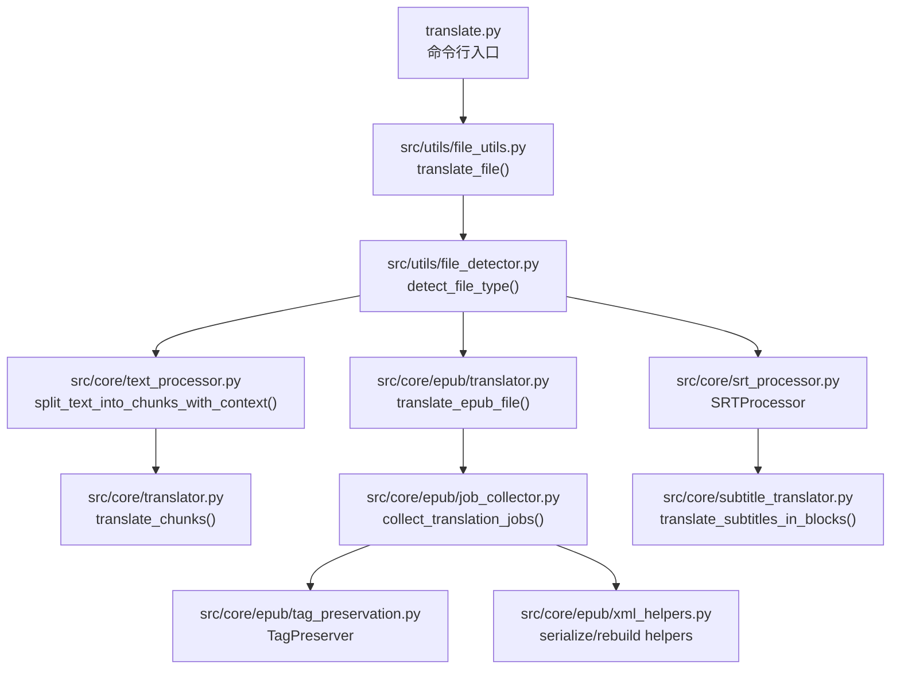
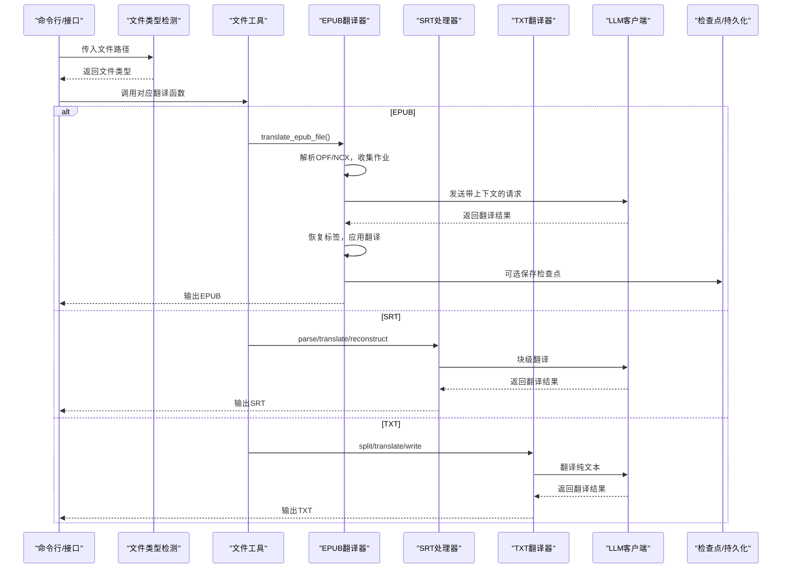
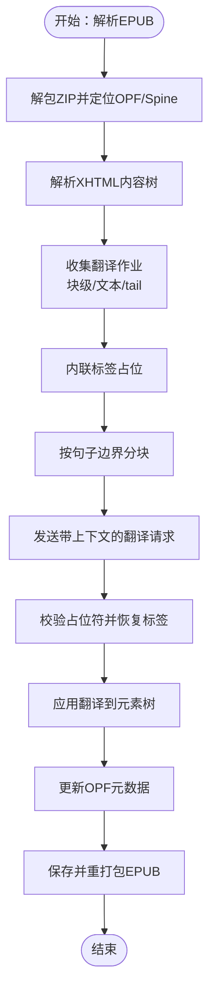
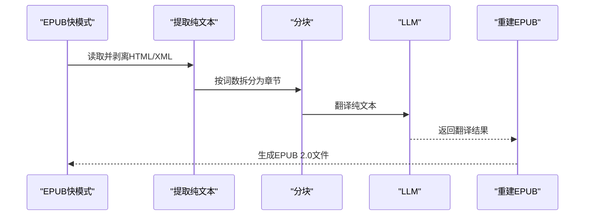
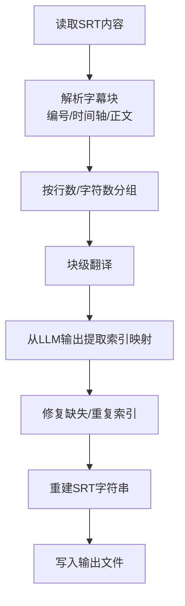
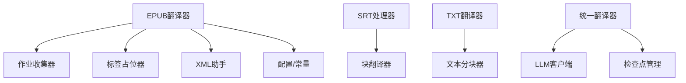

# 支持的文件格式

<cite>
**本文引用的文件**
- [translate.py](file://translate.py)
- [file_utils.py](file://src/utils/file_utils.py)
- [file_detector.py](file://src/utils/file_detector.py)
- [config.py](file://src/config.py)
- [translator.py](file://src/core/translator.py)
- [text_processor.py](file://src/core/text_processor.py)
- [translator.py](file://src/core/epub/translator.py)
- [job_collector.py](file://src/core/epub/job_collector.py)
- [xml_helpers.py](file://src/core/epub/xml_helpers.py)
- [tag_preservation.py](file://src/core/epub/tag_preservation.py)
- [epub_fast_processor.py](file://src/core/epub/epub_fast_processor.py)
- [srt_processor.py](file://src/core/srt_processor.py)
- [security.py](file://src/utils/security.py)
- [checkpoint_manager.py](file://src/persistence/checkpoint_manager.py)
</cite>

## 目录
1. [简介](#简介)
2. [项目结构与入口](#项目结构与入口)
3. [核心组件概览](#核心组件概览)
4. [架构总览](#架构总览)
5. [详细组件分析](#详细组件分析)
6. [依赖关系分析](#依赖关系分析)
7. [性能与上下文优化](#性能与上下文优化)
8. [故障排查指南](#故障排查指南)
9. [结论](#结论)
10. [附录：格式对比与最佳实践](#附录格式对比与最佳实践)

## 简介
本文件系统性介绍 TranslateBookWithLLM 所支持的三种文件格式（TXT、EPUB、SRT）的处理机制，涵盖：
- 解析原理与文本提取策略
- 翻译上下文管理
- 格式还原技术
- 分块策略（chunking）差异
- 翻译后内容重组与格式保持
- 各格式的限制与最佳实践

## 项目结构与入口
- 文件类型检测与路由：根据扩展名自动选择对应翻译流程（.txt、.epub、.srt）。
- 入口脚本负责读取配置、调用工具函数执行翻译，并写回结果。

图表来源
- [translate.py](file://translate.py#L1-L200)
- [file_utils.py](file://src/utils/file_utils.py#L339-L405)
- [file_detector.py](file://src/utils/file_detector.py#L10-L33)
- [text_processor.py](file://src/core/text_processor.py#L42-L174)
- [translator.py](file://src/core/epub/translator.py#L1-L120)
- [job_collector.py](file://src/core/epub/job_collector.py#L15-L120)
- [tag_preservation.py](file://src/core/epub/tag_preservation.py#L1-L155)
- [xml_helpers.py](file://src/core/epub/xml_helpers.py#L120-L280)
- [srt_processor.py](file://src/core/srt_processor.py#L1-L120)

章节来源
- [translate.py](file://translate.py#L1-L200)
- [file_utils.py](file://src/utils/file_utils.py#L339-L405)
- [file_detector.py](file://src/utils/file_detector.py#L10-L33)

## 核心组件概览
- 文本分块与上下文：统一使用句子边界对齐的分块策略，保证语义连贯。
- EPUB 处理器：解析 OPF/NCX 结构，收集可翻译段落，保留并恢复 HTML 标签，重建 XHTML 内容。
- SRT 处理器：严格解析时间轴与字幕块，按行数与字符数进行分组，精确还原时间码与块结构。
- TXT 处理器：直接按分块策略翻译纯文本，无标签干扰，适合弱模型或快速翻译。

章节来源
- [text_processor.py](file://src/core/text_processor.py#L42-L174)
- [translator.py](file://src/core/epub/translator.py#L1-L120)
- [srt_processor.py](file://src/core/srt_processor.py#L1-L120)
- [file_utils.py](file://src/utils/file_utils.py#L339-L405)

## 架构总览
下图展示从输入到输出的关键流程与模块交互。

图表来源
- [file_detector.py](file://src/utils/file_detector.py#L10-L33)
- [file_utils.py](file://src/utils/file_utils.py#L339-L405)
- [translator.py](file://src/core/epub/translator.py#L1-L120)
- [srt_processor.py](file://src/core/srt_processor.py#L1-L120)
- [translator.py](file://src/core/translator.py#L1-L120)
- [checkpoint_manager.py](file://src/persistence/checkpoint_manager.py#L356-L385)

## 详细组件分析

### EPUB 处理机制
- 解析原理
  - 使用 ZIP 解包 EPUB，定位 OPF 包装文档与 spine 阅读顺序，解析 manifest 获取内容文件映射。
  - 使用 lxml 解析 XHTML 内容，识别块级元素与内联标签，构建可翻译作业。
- 文本提取策略
  - 忽略脚本、样式等非文本节点；对块级元素（如 p/div/li/h1-h6 等）整体提取，内联标签序列化为占位符以便翻译。
  - 对非块级元素提取 text/tail 文本，保留首尾空白以维持排版。
- 翻译上下文管理
  - 采用“主段落 + 上下文前后文”的结构化分块，按句子边界对齐，避免跨句切分。
  - 维护最近翻译块的累积上下文，用于后续翻译的一致性。
- 格式还原技术
  - 使用 TagPreserver 将 HTML/XML 标签替换为简单占位符，翻译后再恢复。
  - 对包含内联标签的块，使用 rebuild_element_from_translated_content 重建元素树，确保标签完整性。
  - 应用翻译后，更新 OPF 元数据（语言、贡献者签名等），并重新打包为 EPUB。
- 分块策略差异
  - 块级元素整块翻译，内联标签占位；非块级元素按文本节点分块，保留首尾空白。
- 样例输入/输出对比
  - 输入：包含内联标签的 XHTML 片段（如 <em>强调</em>）。
  - 输出：翻译后的 XHTML，标签位置与层级保持不变。
- 限制与最佳实践
  - 强依赖 lxml 的 XML/HTML 解析能力，遇到严重畸形需启用快模式（见下）。
  - 若标签缺失或变异较多，建议开启“快模式”，先抽取纯文本再重建 EPUB，提高兼容性。
  - 注意 EPUB 规范的 mimetype、container.xml、content.opf、toc.ncx 的顺序与压缩方式。

图表来源
- [translator.py](file://src/core/epub/translator.py#L105-L145)
- [job_collector.py](file://src/core/epub/job_collector.py#L15-L120)
- [tag_preservation.py](file://src/core/epub/tag_preservation.py#L1-L155)
- [xml_helpers.py](file://src/core/epub/xml_helpers.py#L223-L280)

章节来源
- [translator.py](file://src/core/epub/translator.py#L105-L145)
- [job_collector.py](file://src/core/epub/job_collector.py#L15-L120)
- [tag_preservation.py](file://src/core/epub/tag_preservation.py#L1-L155)
- [xml_helpers.py](file://src/core/epub/xml_helpers.py#L120-L280)
- [epub_fast_processor.py](file://src/core/epub/epub_fast_processor.py#L1-L120)

### EPUB 快速模式（Fast Mode）
- 适用场景：复杂 EPUB 或弱模型，优先保证可读性与兼容性。
- 处理流程
  - 提取纯文本：移除所有 HTML/XML 标签与结构，仅保留可读文本。
  - 翻译：使用标准文本分块策略翻译纯文本。
  - 重建：生成最小化的 EPUB 2.0 结构（flat 目录、正确文件顺序、CSS、导航 NCX），并写入翻译结果。
- 优势
  - 消除标签问题，提升稳定性；兼容严格阅读器。
- 限制
  - 无法保留原文本结构与样式；仅生成通用章节。

图表来源
- [epub_fast_processor.py](file://src/core/epub/epub_fast_processor.py#L1-L120)
- [epub_fast_processor.py](file://src/core/epub/epub_fast_processor.py#L353-L458)

章节来源
- [epub_fast_processor.py](file://src/core/epub/epub_fast_processor.py#L1-L120)
- [epub_fast_processor.py](file://src/core/epub/epub_fast_processor.py#L353-L458)

### SRT 处理机制
- 解析原理
  - 使用正则匹配字幕编号、时间轴与正文，支持 Windows/Linux 换行符。
- 文本提取策略
  - 逐条提取可翻译文本，忽略空块。
- 翻译上下文管理
  - 按行数与字符数进行分组，控制单次翻译负载，避免超长提示。
- 格式还原技术
  - 严格保留时间码与块序号，支持多行合并规则（句末标点、大小写、大写字母 I 等）。
  - 从 LLM 输出中提取带索引的翻译结果，修复缺失索引与同一行多个索引的问题。
- 分块策略差异
  - 以“字幕条目”为单位，按固定行数与最大字符数分组，兼顾时序与可读性。
- 样例输入/输出对比
  - 输入：包含编号、时间轴与正文的 SRT 字符串。
  - 输出：翻译后的 SRT，时间轴与块序号保持一致。
- 限制与最佳实践
  - 时间轴格式必须符合 HH:MM:SS,mmm --> HH:MM:SS,mmm。
  - 若 LLM 输出遗漏索引，会记录警告并尝试修复。

图表来源
- [srt_processor.py](file://src/core/srt_processor.py#L1-L120)
- [srt_processor.py](file://src/core/srt_processor.py#L138-L174)
- [srt_processor.py](file://src/core/srt_processor.py#L175-L236)

章节来源
- [srt_processor.py](file://src/core/srt_processor.py#L1-L120)
- [srt_processor.py](file://src/core/srt_processor.py#L138-L174)
- [srt_processor.py](file://src/core/srt_processor.py#L175-L236)

### TXT 处理机制
- 解析原理
  - 直接读取 UTF-8 文本，无需解析结构。
- 文本提取策略
  - 使用统一的句子边界分块策略，避免跨句切分。
- 翻译上下文管理
  - 与 EPUB/TXT 相同的上下文构建逻辑，支持累积最近翻译块。
- 格式还原技术
  - 直接写回翻译后的纯文本，可选添加项目签名页脚。
- 分块策略差异
  - 无标签与结构，按行数目标进行分块，适合弱模型或快速翻译。
- 样例输入/输出对比
  - 输入：任意 UTF-8 文本。
  - 输出：翻译后的纯文本。
- 限制与最佳实践
  - 不保留任何格式信息；适合非结构化文本翻译。

章节来源
- [file_utils.py](file://src/utils/file_utils.py#L58-L194)
- [text_processor.py](file://src/core/text_processor.py#L42-L174)

## 依赖关系分析
- 模块耦合
  - EPUB：依赖 lxml 解析、TagPreserver 占位符、xml_helpers 元素重建、job_collector 作业收集。
  - SRT：依赖正则解析、分组策略、块翻译器。
  - TXT：依赖统一分块与翻译流程。
- 外部依赖
  - LLM 客户端：通过统一接口发送翻译请求。
  - 检查点管理：支持断点续传与结果拼接（SRT 需特殊处理）。

图表来源
- [translator.py](file://src/core/epub/translator.py#L1-L120)
- [job_collector.py](file://src/core/epub/job_collector.py#L15-L120)
- [tag_preservation.py](file://src/core/epub/tag_preservation.py#L1-L155)
- [xml_helpers.py](file://src/core/epub/xml_helpers.py#L120-L280)
- [srt_processor.py](file://src/core/srt_processor.py#L1-L120)
- [file_utils.py](file://src/utils/file_utils.py#L339-L405)
- [checkpoint_manager.py](file://src/persistence/checkpoint_manager.py#L356-L385)

章节来源
- [translator.py](file://src/core/epub/translator.py#L1-L120)
- [srt_processor.py](file://src/core/srt_processor.py#L1-L120)
- [file_utils.py](file://src/utils/file_utils.py#L339-L405)
- [checkpoint_manager.py](file://src/persistence/checkpoint_manager.py#L356-L385)

## 性能与上下文优化
- 分块策略
  - 以句子边界对齐为主，兼顾上下文前后文长度，避免过长导致上下文溢出。
- 上下文窗口
  - 支持自动调整上下文窗口，结合最小/最大块尺寸参数，平衡吞吐与一致性。
- 快速模式
  - EPUB 快速模式通过纯文本翻译与最小化结构，显著降低失败率与重试成本。
- 检查点与断点续传
  - 支持按块保存翻译进度，SRT 需要从块翻译映射重建最终文件。

章节来源
- [text_processor.py](file://src/core/text_processor.py#L42-L174)
- [config.py](file://src/config.py#L56-L109)
- [epub_fast_processor.py](file://src/core/epub/epub_fast_processor.py#L714-L800)
- [checkpoint_manager.py](file://src/persistence/checkpoint_manager.py#L356-L385)

## 故障排查指南
- EPUB
  - OPF/NCX 缺失：检查 EPUB 结构是否完整。
  - 标签丢失/变异：启用快模式或增强提示词，确保占位符保留。
  - 保存失败：确认输出目录权限与磁盘空间。
- SRT
  - 时间轴不匹配：核对 HH:MM:SS,mmm 格式。
  - 索引缺失：查看日志中的缺失索引列表，必要时手动修正。
- TXT
  - 空文件：直接返回空输出，确认输入是否为空。
- 通用
  - LLM 请求失败：检查网络、超时与重试设置。
  - 文件类型不支持：确认扩展名为 .txt/.epub/.srt。

章节来源
- [translator.py](file://src/core/epub/translator.py#L146-L204)
- [srt_processor.py](file://src/core/srt_processor.py#L175-L236)
- [file_utils.py](file://src/utils/file_utils.py#L104-L194)
- [security.py](file://src/utils/security.py#L221-L347)

## 结论
- EPUB：强结构、强标签，适合保留原格式但需要更强的解析与标签恢复能力；快模式可显著提升稳定性。
- SRT：强时序约束，需严格的时间轴与块序号管理；分组策略直接影响字幕同步质量。
- TXT：最简流程，适合非结构化文本与弱模型；无格式保持需求。
- 统一的分块与上下文策略确保了跨格式的一致性与可维护性。

## 附录：格式对比与最佳实践
- 分块策略对比
  - EPUB：块级元素整块 + 文本节点分块，内联标签占位。
  - SRT：按字幕条目分组，控制行数与字符数。
  - TXT：按句子边界分块，无标签干扰。
- 格式保持要点
  - EPUB：标签占位与恢复、元素树重建、OPF 元数据更新。
  - SRT：时间轴与编号严格保留，块序号与换行规则。
  - TXT：无格式保持，直接写回纯文本。
- 最佳实践
  - EPUB：复杂结构或弱模型优先快模式；强模型可保留标签以获得更佳排版。
  - SRT：合理设置分组参数，确保时序与可读性的平衡。
  - TXT：小模型或快速翻译场景，启用 fast_mode 参数。

章节来源
- [translator.py](file://src/core/epub/translator.py#L565-L790)
- [srt_processor.py](file://src/core/srt_processor.py#L138-L174)
- [file_utils.py](file://src/utils/file_utils.py#L339-L405)
- [epub_fast_processor.py](file://src/core/epub/epub_fast_processor.py#L1-L120)