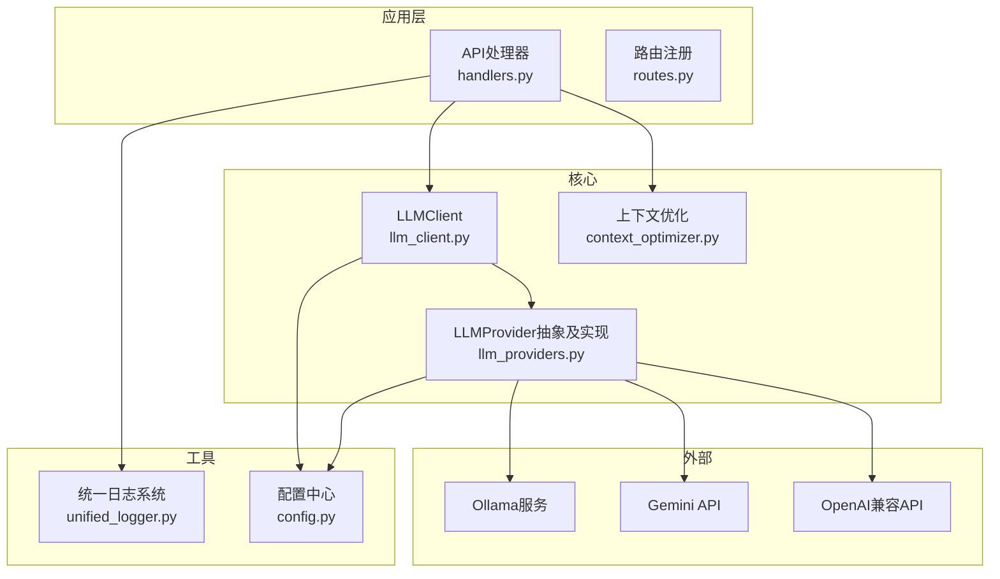
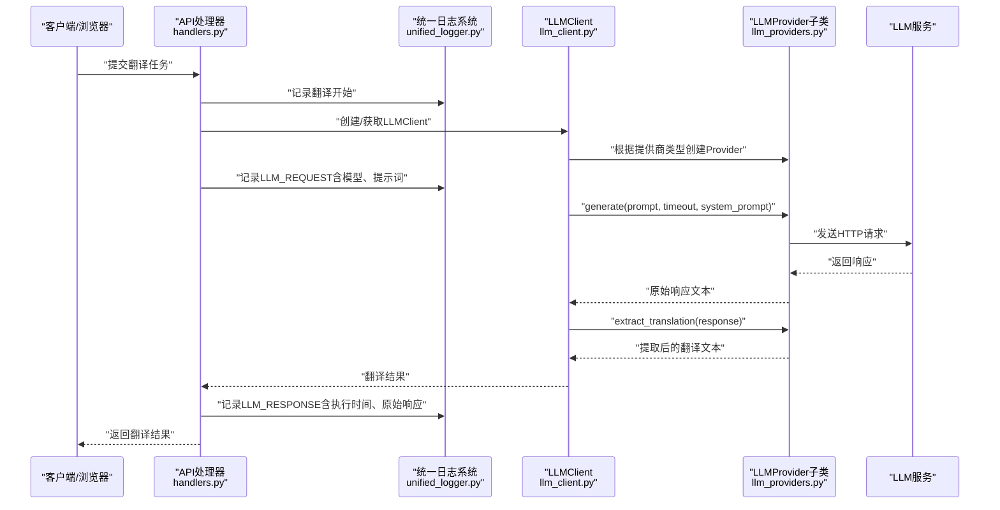
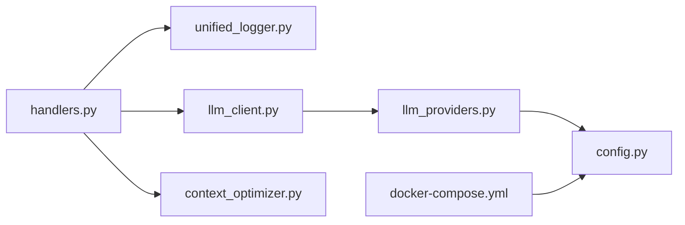

# LLM连接问题

<cite>
**本文引用的文件**
- [llm_client.py](file://src/core/llm_client.py)
- [llm_providers.py](file://src/core/llm_providers.py)
- [unified_logger.py](file://src/utils/unified_logger.py)
- [TESTING.md](file://deployment/TESTING.md)
- [config.py](file://src/config.py)
- [handlers.py](file://src/api/handlers.py)
- [routes.py](file://src/api/routes.py)
- [context_optimizer.py](file://src/core/context_optimizer.py)
- [docker-compose.yml](file://deployment/docker-compose.yml)
- [.env.docker.example](file://deployment/.env.docker.example)
</cite>

## 目录
1. [简介](#简介)
2. [项目结构与定位](#项目结构与定位)
3. [核心组件与职责](#核心组件与职责)
4. [架构总览](#架构总览)
5. [详细组件分析](#详细组件分析)
6. [依赖关系分析](#依赖关系分析)
7. [性能与超时特性](#性能与超时特性)
8. [诊断步骤与排障指南](#诊断步骤与排障指南)
9. [结论](#结论)

## 简介
本指南聚焦于LLM连接失败的常见问题与诊断方法，结合统一日志系统中的日志类型（如LLM_REQUEST、LLM_RESPONSE），说明如何通过日志识别请求是否发出、响应是否超时；并基于llm_client.py与llm_providers.py的实现逻辑，解释不同提供商（Ollama、Gemini、OpenAI）的连接配置差异。最后提供检查服务状态、验证API端点可达性、确认环境变量设置的具体步骤，并结合TESTING.md中关于Docker部署时host.docker.internal的配置示例，说明容器内外通信问题的解决方案，附带curl测试命令与预期输出。

## 项目结构与定位
- LLM客户端与提供商抽象位于src/core目录：
  - LLMClient负责统一调用与资源管理
  - LLMProvider及其子类封装各提供商的HTTP交互细节
- 日志系统位于src/utils/unified_logger.py，提供LLM_REQUEST/LLM_RESPONSE等专用日志类型
- 配置中心位于src/config.py，读取.env并暴露默认值
- API层在src/api，包含路由注册与作业处理，作业中使用统一日志系统
- Docker部署与测试文档位于deployment/TESTING.md，包含host.docker.internal的使用示例

图表来源
- [handlers.py](file://src/api/handlers.py#L1-L120)
- [routes.py](file://src/api/routes.py#L1-L66)
- [llm_client.py](file://src/core/llm_client.py#L1-L123)
- [llm_providers.py](file://src/core/llm_providers.py#L1-L120)
- [unified_logger.py](file://src/utils/unified_logger.py#L1-L120)
- [config.py](file://src/config.py#L1-L120)

章节来源
- [llm_client.py](file://src/core/llm_client.py#L1-L123)
- [llm_providers.py](file://src/core/llm_providers.py#L1-L120)
- [unified_logger.py](file://src/utils/unified_logger.py#L1-L120)
- [config.py](file://src/config.py#L1-L120)
- [handlers.py](file://src/api/handlers.py#L1-L120)
- [routes.py](file://src/api/routes.py#L1-L66)

## 核心组件与职责
- LLMClient
  - 负责根据提供商类型创建对应的LLMProvider实例
  - 提供make_request/translate_text等高层接口，内部委托给Provider
  - 支持可选的超时参数与系统提示
- LLMProvider抽象
  - 定义generate/extract_translation等接口
  - 统一管理httpx.AsyncClient生命周期与超时
  - 子类分别实现Ollama、OpenAI兼容、Gemini的请求细节
- 统一日志系统
  - 提供LLM_REQUEST/LLM_RESPONSE等专用类型，用于格式化LLM请求与响应日志
  - 在Web端通过回调转发到前端
- 配置中心
  - 从环境变量加载API_ENDPOINT、DEFAULT_MODEL、REQUEST_TIMEOUT等
  - 为各提供商提供默认值与缺省行为

章节来源
- [llm_client.py](file://src/core/llm_client.py#L1-L123)
- [llm_providers.py](file://src/core/llm_providers.py#L1-L120)
- [unified_logger.py](file://src/utils/unified_logger.py#L1-L120)
- [config.py](file://src/config.py#L1-L120)

## 架构总览
下图展示一次翻译任务从API入口到LLM提供商的完整调用链，以及日志类型在流程中的作用。

图表来源
- [handlers.py](file://src/api/handlers.py#L120-L220)
- [unified_logger.py](file://src/utils/unified_logger.py#L120-L200)
- [llm_client.py](file://src/core/llm_client.py#L30-L90)
- [llm_providers.py](file://src/core/llm_providers.py#L139-L218)

## 详细组件分析

### LLMClient与Provider工厂
- LLMClient
  - 初始化时保存提供商类型与参数，默认使用全局配置的API_ENDPOINT与DEFAULT_MODEL
  - make_request支持传入timeout与system_prompt，内部委托Provider.generate
  - translate_text组合generate与extract_translation
  - close负责关闭底层httpx.AsyncClient
- create_llm_client
  - 基于提供商类型与API端点/密钥创建对应客户端
  - 对于Gemini需显式提供api_key或从环境变量读取
  - 对于OpenAI需显式提供api_key与API_ENDPOINT
  - 对于Ollama总是新建实例以确保正确配置

章节来源
- [llm_client.py](file://src/core/llm_client.py#L1-L123)
- [llm_providers.py](file://src/core/llm_providers.py#L515-L548)

### Provider实现差异（Ollama/Gemini/OpenAI）
- OllamaProvider
  - 使用POST /api/generate，payload包含model、prompt、options（num_ctx等）
  - 支持可选system字段
  - 超时异常会重试多次（由MAX_TRANSLATION_ATTEMPTS与RETRY_DELAY_SECONDS控制）
  - 当检测到上下文溢出错误时抛出ContextOverflowError
- OpenAICompatibleProvider
  - 使用OpenAI兼容的chat/completions端点
  - 通过Authorization头携带Bearer Token
  - payload为messages数组（可选system）
  - 同样具备重试与超时处理
- GeminiProvider
  - 使用Google Generative Language API端点
  - 通过x-goog-api-key头传递API Key
  - payload为contents与generationConfig，支持systemInstruction
  - 具备重试与超时处理

章节来源
- [llm_providers.py](file://src/core/llm_providers.py#L139-L218)
- [llm_providers.py](file://src/core/llm_providers.py#L281-L361)
- [llm_providers.py](file://src/core/llm_providers.py#L363-L513)

### 统一日志系统（LLM_REQUEST/LLM_RESPONSE）
- LogType定义了LLM_REQUEST与LLM_RESPONSE两类专用日志类型
- LLM_REQUEST用于格式化“发送到LLM”的请求详情（模型、原始提示词等）
- LLM_RESPONSE用于格式化“LLM响应”详情（执行时间、原始响应等）
- Web端通过回调将日志条目推送到前端，便于用户实时观察请求与响应

章节来源
- [unified_logger.py](file://src/utils/unified_logger.py#L20-L40)
- [unified_logger.py](file://src/utils/unified_logger.py#L120-L200)
- [handlers.py](file://src/api/handlers.py#L92-L120)

### 配置与上下文优化
- config.py从环境变量读取API_ENDPOINT、DEFAULT_MODEL、REQUEST_TIMEOUT、OLLAMA_NUM_CTX等
- context_optimizer.py提供上下文估算、最优分块大小计算与参数调整策略
- 当提示过大导致上下文溢出时，OllamaProvider会抛出ContextOverflowError并触发告警

章节来源
- [config.py](file://src/config.py#L56-L120)
- [context_optimizer.py](file://src/core/context_optimizer.py#L1-L120)
- [llm_providers.py](file://src/core/llm_providers.py#L176-L218)

## 依赖关系分析
- LLMClient依赖LLMProvider工厂与配置中心
- LLMProvider抽象依赖httpx.AsyncClient与配置中心
- API层在作业启动时创建统一日志实例，并在LLM请求前后记录LLM_REQUEST/LLM_RESPONSE
- Docker部署文档明确host.docker.internal的使用场景与替代方案

图表来源
- [config.py](file://src/config.py#L1-L120)
- [unified_logger.py](file://src/utils/unified_logger.py#L1-L120)
- [handlers.py](file://src/api/handlers.py#L1-L120)
- [llm_client.py](file://src/core/llm_client.py#L1-L123)
- [llm_providers.py](file://src/core/llm_providers.py#L1-L120)
- [context_optimizer.py](file://src/core/context_optimizer.py#L1-L120)
- [docker-compose.yml](file://deployment/docker-compose.yml#L33-L68)

章节来源
- [config.py](file://src/config.py#L1-L120)
- [unified_logger.py](file://src/utils/unified_logger.py#L1-L120)
- [handlers.py](file://src/api/handlers.py#L1-L120)
- [llm_client.py](file://src/core/llm_client.py#L1-L123)
- [llm_providers.py](file://src/core/llm_providers.py#L1-L120)
- [context_optimizer.py](file://src/core/context_optimizer.py#L1-L120)
- [docker-compose.yml](file://deployment/docker-compose.yml#L33-L68)

## 性能与超时特性
- 请求超时
  - LLMProvider在创建httpx.AsyncClient时使用统一的REQUEST_TIMEOUT
  - 各Provider在generate中按timeout参数进行HTTP请求
  - 超时异常会触发重试（最多MAX_TRANSLATION_ATTEMPTS次，间隔RETRY_DELAY_SECONDS秒）
- 上下文窗口
  - OllamaProvider支持num_ctx参数，可通过OPTIONS或查询/show接口获取模型上下文上限
  - 当提示过大时，会抛出ContextOverflowError并建议降低分块大小或增大上下文
- 分块与上下文估算
  - context_optimizer.py提供估算与自动调整策略，避免超出模型上下文

章节来源
- [llm_providers.py](file://src/core/llm_providers.py#L34-L60)
- [llm_providers.py](file://src/core/llm_providers.py#L176-L218)
- [config.py](file://src/config.py#L56-L120)
- [context_optimizer.py](file://src/core/context_optimizer.py#L1-L120)

## 诊断步骤与排障指南

### 一、常见连接失败原因与识别
- Ollama服务未运行
  - 现象：请求超时、HTTP错误、JSON解析失败
  - 识别：日志中出现TimeoutException或HTTP错误；LLM_REQUEST已记录但无LLM_RESPONSE
- API密钥无效
  - Gemini：x-goog-api-key缺失或错误
  - OpenAI：Authorization头缺失或格式不正确
  - 识别：Provider捕获HTTP 401/403或400，随后重试；最终失败
- 网络不通
  - Docker容器无法访问host.docker.internal或宿主机IP
  - 识别：curl测试失败；容器内日志显示连接超时或拒绝
- 上下文溢出
  - 现象：Provider抛出ContextOverflowError
  - 识别：日志提示“上下文大小超出”，建议减小分块或增大OLLAMA_NUM_CTX

章节来源
- [llm_providers.py](file://src/core/llm_providers.py#L176-L218)
- [llm_providers.py](file://src/core/llm_providers.py#L333-L360)
- [llm_providers.py](file://src/core/llm_providers.py#L485-L512)
- [handlers.py](file://src/api/handlers.py#L150-L170)

### 二、通过日志识别请求与响应
- LLM_REQUEST
  - 触发时机：每次向LLM发送请求前
  - 内容要点：模型名、原始提示词、当前分块进度
  - 用途：确认请求已发出，便于定位问题发生在请求阶段还是响应阶段
- LLM_RESPONSE
  - 触发时机：收到LLM响应后
  - 内容要点：执行耗时、原始响应文本
  - 用途：判断响应是否到达，是否被正确提取翻译

章节来源
- [unified_logger.py](file://src/utils/unified_logger.py#L120-L200)
- [handlers.py](file://src/api/handlers.py#L92-L120)

### 三、检查服务状态与端点可达性
- 检查本地Ollama
  - 在宿主机上使用curl验证API端点
  - 示例命令（Windows/macOS）：
    - curl http://localhost:11434/api/tags
  - 预期输出：返回可用模型列表的JSON
- Docker容器内连通性
  - 在容器内使用curl验证host.docker.internal
  - 示例命令：
    - docker-compose exec translatebook curl http://host.docker.internal:11434/api/tags
  - 预期输出：返回可用模型列表的JSON
- OpenAI/Gemini端点
  - 使用curl验证端点与鉴权头
  - 示例命令（Gemini）：
    - curl -H "x-goog-api-key: YOUR_API_KEY" "https://generativelanguage.googleapis.com/v1beta/models"
  - 示例命令（OpenAI兼容）：
    - curl -H "Authorization: Bearer YOUR_API_KEY" -H "Content-Type: application/json" -d '{}' "https://api.openai.com/v1/models"
  - 预期输出：返回可用模型列表或成功响应

章节来源
- [TESTING.md](file://deployment/TESTING.md#L243-L263)
- [llm_providers.py](file://src/core/llm_providers.py#L363-L417)
- [llm_providers.py](file://src/core/llm_providers.py#L281-L331)

### 四、确认环境变量设置
- 关键变量
  - LLM_PROVIDER：'ollama'、'gemini'、'openai'
  - API_ENDPOINT：Ollama或OpenAI兼容端点
  - DEFAULT_MODEL：默认模型名
  - GEMINI_API_KEY：Gemini API Key
  - OPENAI_API_KEY：OpenAI API Key
  - REQUEST_TIMEOUT：请求超时秒数
  - OLLAMA_NUM_CTX：上下文窗口大小
- Docker环境
  - .env.docker.example提供了host.docker.internal的示例配置
  - docker-compose.yml中healthcheck使用curl探测本地端口

章节来源
- [config.py](file://src/config.py#L56-L120)
- [.env.docker.example](file://deployment/.env.docker.example#L1-L28)
- [docker-compose.yml](file://deployment/docker-compose.yml#L33-L68)

### 五、容器内外通信问题与host.docker.internal
- Windows/macOS
  - 使用host.docker.internal指向宿主机，API_ENDPOINT应指向host.docker.internal:11434/api/generate
- Linux
  - 可通过extra_hosts映射host.docker.internal到host-gateway
  - 或直接使用宿主机IP（如172.17.0.1）
- 验证
  - 在容器内执行curl http://host.docker.internal:11434/api/tags
  - 若失败，检查防火墙、网络桥接与extra_hosts配置

章节来源
- [TESTING.md](file://deployment/TESTING.md#L243-L263)
- [.env.docker.example](file://deployment/.env.docker.example#L1-L28)
- [docker-compose.yml](file://deployment/docker-compose.yml#L64-L68)

### 六、上下文溢出与分块策略
- 症状：Provider抛出ContextOverflowError
- 处理建议：
  - 减小分块大小（chunk_size）
  - 增大OLLAMA_NUM_CTX
  - 使用context_optimizer.py提供的估算与调整策略
- 日志提示：Provider会在检测到上下文溢出时输出警告，指导用户调整

章节来源
- [llm_providers.py](file://src/core/llm_providers.py#L176-L218)
- [context_optimizer.py](file://src/core/context_optimizer.py#L254-L321)

## 结论
- LLM连接失败通常由服务未运行、API密钥无效、网络不可达或上下文溢出引起
- 通过LLM_REQUEST/LLM_RESPONSE日志类型，可以清晰区分请求是否发出、响应是否到达
- 不同提供商的连接配置差异主要体现在端点、鉴权方式与消息结构
- Docker部署中，host.docker.internal是容器访问宿主机服务的关键；Linux需额外配置extra_hosts
- 建议优先使用curl验证端点与鉴权，再结合日志定位问题；必要时调整分块大小与上下文窗口