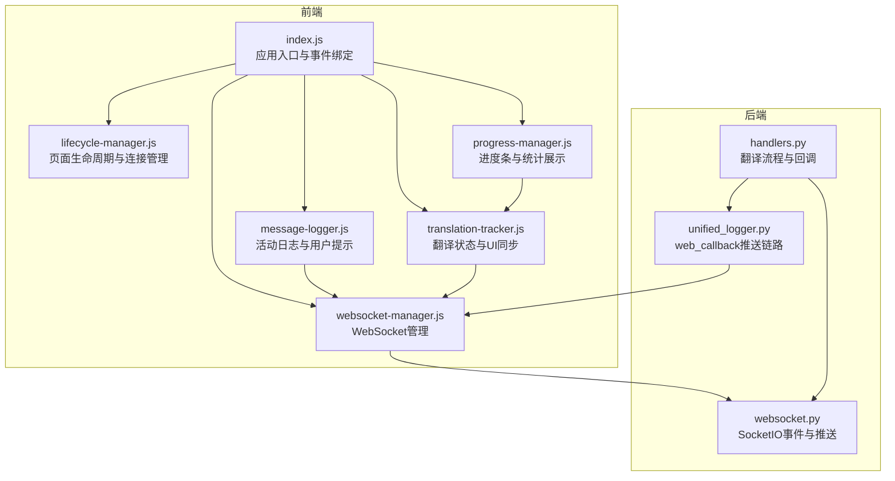
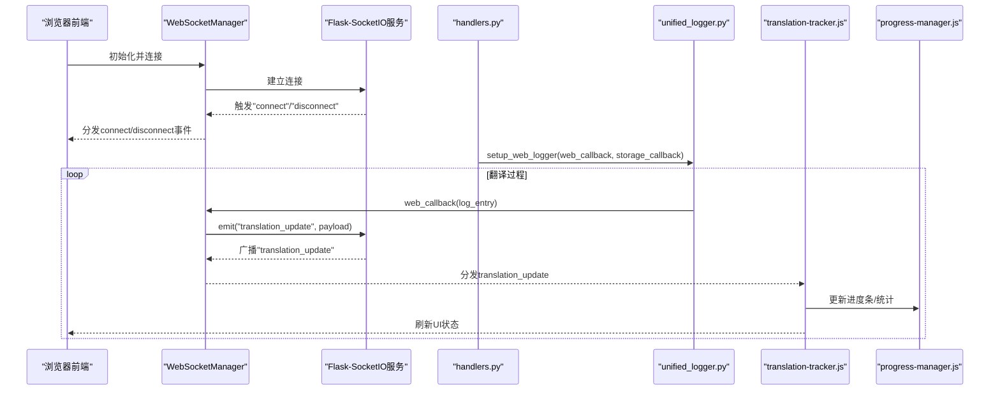
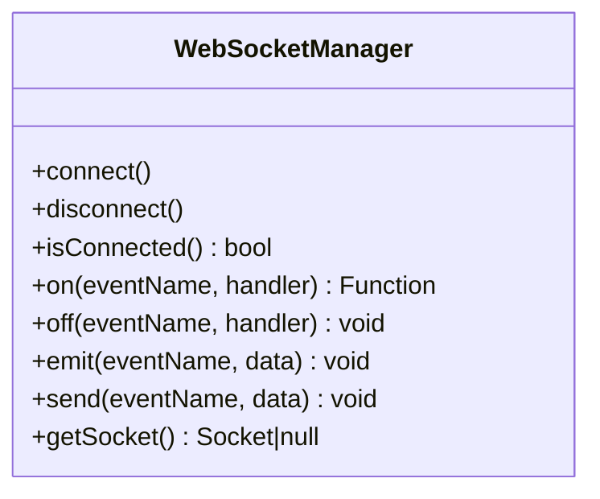
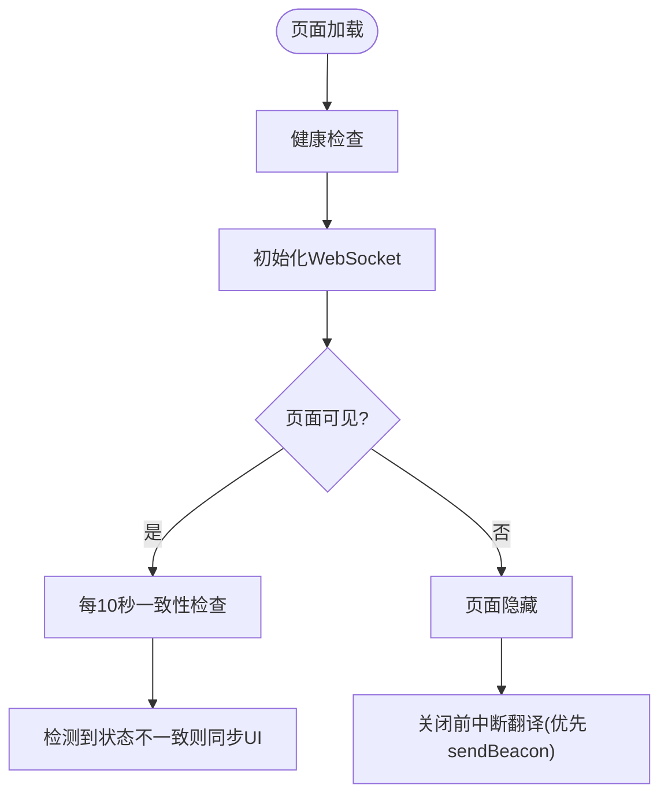
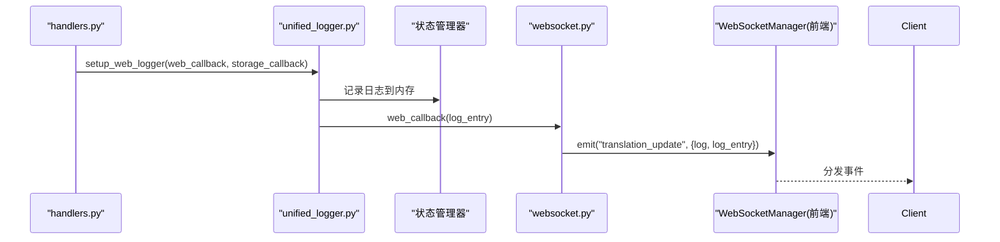
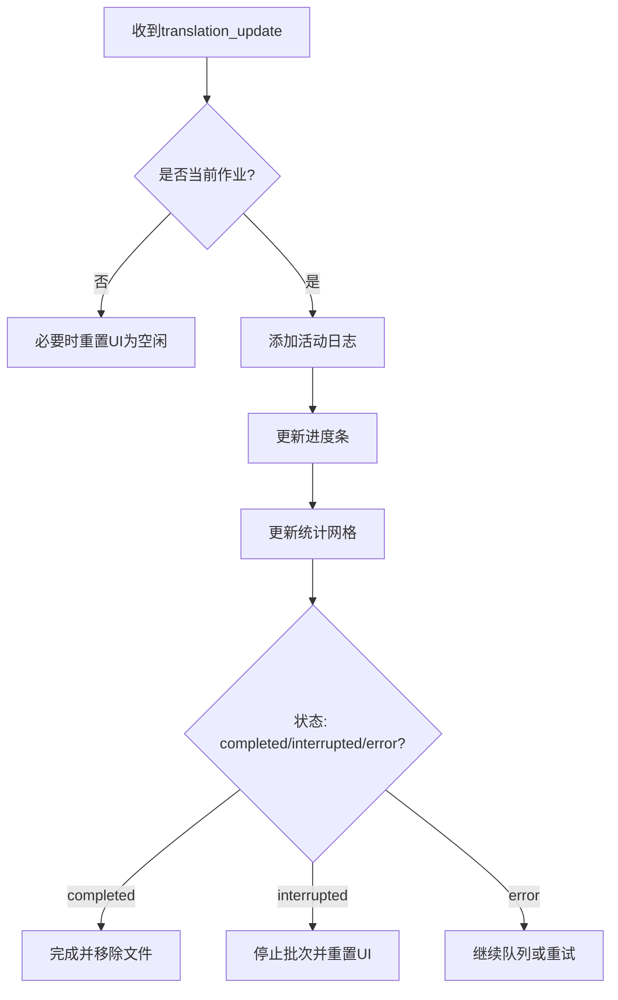
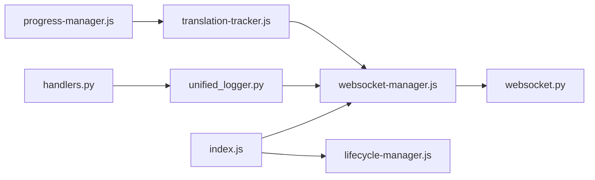

# Web界面异常

<cite>
**本文引用的文件**
- [websocket-manager.js](file://src/web/static/js/core/websocket-manager.js)
- [websocket.py](file://src/api/websocket.py)
- [unified_logger.py](file://src/utils/unified_logger.py)
- [handlers.py](file://src/api/handlers.py)
- [index.js](file://src/web/static/js/index.js)
- [lifecycle-manager.js](file://src/web/static/js/utils/lifecycle-manager.js)
- [message-logger.js](file://src/web/static/js/ui/message-logger.js)
- [progress-manager.js](file://src/web/static/js/translation/progress-manager.js)
- [translation-tracker.js](file://src/web/static/js/translation/translation-tracker.js)
- [TESTING.md](file://deployment/TESTING.md)
</cite>

## 目录
1. [简介](#简介)
2. [项目结构](#项目结构)
3. [核心组件](#核心组件)
4. [架构总览](#架构总览)
5. [详细组件分析](#详细组件分析)
6. [依赖关系分析](#依赖关系分析)
7. [性能与稳定性考量](#性能与稳定性考量)
8. [故障排查指南](#故障排查指南)
9. [结论](#结论)
10. [附录](#附录)

## 简介
本文件聚焦于Web界面常见异常问题：WebSocket断连、按钮无响应、进度条不更新等。基于仓库中的前端WebSocket管理器与后端Flask-SocketIO实现，系统性说明客户端与服务端的实时通信机制；结合统一日志系统的web_callback推送链路，解释日志如何通过WebSocket推送到前端，并指出消息丢失的可能原因（如连接超时、事件监听器未正确绑定）。同时，依据部署目录下的健康检查文档，提供验证API服务可用性的方法；最后给出前端缓存清理、重新建立连接的操作步骤，并建议收集浏览器控制台日志以辅助定位问题。

## 项目结构
围绕Web界面异常处理，涉及的关键模块包括：
- 前端：WebSocket管理器、生命周期管理器、UI日志记录器、进度管理器、翻译跟踪器
- 后端：Flask-SocketIO事件处理、统一日志系统、翻译处理器

图表来源
- [index.js](file://src/web/static/js/index.js#L1-L200)
- [websocket-manager.js](file://src/web/static/js/core/websocket-manager.js#L1-L143)
- [lifecycle-manager.js](file://src/web/static/js/utils/lifecycle-manager.js#L1-L190)
- [message-logger.js](file://src/web/static/js/ui/message-logger.js#L1-L146)
- [progress-manager.js](file://src/web/static/js/translation/progress-manager.js#L1-L130)
- [translation-tracker.js](file://src/web/static/js/translation/translation-tracker.js#L1-L380)
- [handlers.py](file://src/api/handlers.py#L70-L269)
- [websocket.py](file://src/api/websocket.py#L1-L43)
- [unified_logger.py](file://src/utils/unified_logger.py#L320-L332)

章节来源
- [index.js](file://src/web/static/js/index.js#L1-L200)
- [websocket-manager.js](file://src/web/static/js/core/websocket-manager.js#L1-L143)
- [lifecycle-manager.js](file://src/web/static/js/utils/lifecycle-manager.js#L1-L190)
- [message-logger.js](file://src/web/static/js/ui/message-logger.js#L1-L146)
- [progress-manager.js](file://src/web/static/js/translation/progress-manager.js#L1-L130)
- [translation-tracker.js](file://src/web/static/js/translation/translation-tracker.js#L1-L380)
- [handlers.py](file://src/api/handlers.py#L70-L269)
- [websocket.py](file://src/api/websocket.py#L1-L43)
- [unified_logger.py](file://src/utils/unified_logger.py#L320-L332)

## 核心组件
- WebSocket管理器：负责连接建立、断开、事件路由、发送消息与连接状态查询。
- 生命周期管理器：负责页面加载健康检查、WebSocket初始化、页面隐藏/显示一致性检查、关闭前中断翻译。
- 统一日志系统：提供web_callback钩子，将结构化日志通过WebSocket推送到前端。
- 翻译跟踪器：接收WebSocket更新，驱动UI进度条、统计信息与状态切换。
- 进度管理器：负责进度百分比与统计网格的渲染。
- 活动日志记录器：在前端侧汇总用户可读的日志与提示。

章节来源
- [websocket-manager.js](file://src/web/static/js/core/websocket-manager.js#L1-L143)
- [lifecycle-manager.js](file://src/web/static/js/utils/lifecycle-manager.js#L1-L190)
- [unified_logger.py](file://src/utils/unified_logger.py#L320-L332)
- [translation-tracker.js](file://src/web/static/js/translation/translation-tracker.js#L1-L380)
- [progress-manager.js](file://src/web/static/js/translation/progress-manager.js#L1-L130)
- [message-logger.js](file://src/web/static/js/ui/message-logger.js#L1-L146)

## 架构总览
下图展示了从后端日志到前端UI的完整链路，以及前端事件如何驱动UI更新。

图表来源
- [websocket-manager.js](file://src/web/static/js/core/websocket-manager.js#L1-L143)
- [websocket.py](file://src/api/websocket.py#L1-L43)
- [unified_logger.py](file://src/utils/unified_logger.py#L320-L332)
- [handlers.py](file://src/api/handlers.py#L70-L269)
- [translation-tracker.js](file://src/web/static/js/translation/translation-tracker.js#L1-L380)
- [progress-manager.js](file://src/web/static/js/translation/progress-manager.js#L1-L130)

## 详细组件分析

### WebSocket管理器（前端）
- 职责：封装socket.io实例，注册/注销事件处理器，分发连接与业务事件，发送消息。
- 关键点：
  - 连接事件与断开事件会触发内部emit，供上层模块订阅。
  - 发送消息前检查连接状态，避免在断连时出错。
  - 提供getSocket便于高级用法或调试。

图表来源
- [websocket-manager.js](file://src/web/static/js/core/websocket-manager.js#L1-L143)

章节来源
- [websocket-manager.js](file://src/web/static/js/core/websocket-manager.js#L1-L143)

### 生命周期管理器（前端）
- 职责：页面加载时进行健康检查，初始化WebSocket；页面隐藏/显示时刷新状态；关闭前尝试中断翻译。
- 关键点：
  - 页面可见时定期检查服务端状态，检测UI与服务端状态不一致并触发同步。
  - 使用sendBeacon确保在页面卸载时可靠发送中断请求。

图表来源
- [lifecycle-manager.js](file://src/web/static/js/utils/lifecycle-manager.js#L1-L190)

章节来源
- [lifecycle-manager.js](file://src/web/static/js/utils/lifecycle-manager.js#L1-L190)

### 统一日志系统（后端）与WebSocket推送
- 职责：为Web界面提供统一日志输出，支持web_callback钩子将结构化日志通过WebSocket推送到前端。
- 关键点：
  - setup_web_logger创建logger实例并注入web_callback与storage_callback。
  - handlers.py中为每个翻译任务设置web_callback，将日志写入状态管理器并通过emit_update广播。
  - emit_update会自动补充stats/progress字段，确保前端能及时更新UI。

图表来源
- [handlers.py](file://src/api/handlers.py#L70-L269)
- [unified_logger.py](file://src/utils/unified_logger.py#L320-L332)
- [websocket.py](file://src/api/websocket.py#L1-L43)
- [websocket-manager.js](file://src/web/static/js/core/websocket-manager.js#L1-L143)

章节来源
- [handlers.py](file://src/api/handlers.py#L70-L269)
- [unified_logger.py](file://src/utils/unified_logger.py#L320-L332)
- [websocket.py](file://src/api/websocket.py#L1-L43)
- [websocket-manager.js](file://src/web/static/js/core/websocket-manager.js#L1-L143)

### 翻译跟踪器与进度管理器（前端）
- 职责：接收translation_update，更新UI进度条、统计信息与状态；根据状态完成/中断/错误切换UI。
- 关键点：
  - 当收到非当前作业的更新时，进行状态校验并必要时重置UI为空闲态。
  - 针对不同文件类型（txt/epub/srt）调整统计展示逻辑。

图表来源
- [translation-tracker.js](file://src/web/static/js/translation/translation-tracker.js#L1-L380)
- [progress-manager.js](file://src/web/static/js/translation/progress-manager.js#L1-L130)
- [message-logger.js](file://src/web/static/js/ui/message-logger.js#L1-L146)

章节来源
- [translation-tracker.js](file://src/web/static/js/translation/translation-tracker.js#L1-L380)
- [progress-manager.js](file://src/web/static/js/translation/progress-manager.js#L1-L130)
- [message-logger.js](file://src/web/static/js/ui/message-logger.js#L1-L146)

## 依赖关系分析
- 前端入口index.js在初始化阶段即建立WebSocket连接，并将多个模块事件与WebSocket事件打通。
- WebSocketManager作为事件中枢，向上层模块提供统一的事件接口。
- handlers.py通过setup_web_logger注入web_callback，形成“后端日志→WebSocket→前端UI”的闭环。
- lifecycle-manager.js在页面可见时周期性检查服务端状态，防止UI与服务端状态不一致导致的按钮无响应或进度条卡住。

图表来源
- [index.js](file://src/web/static/js/index.js#L1-L200)
- [websocket-manager.js](file://src/web/static/js/core/websocket-manager.js#L1-L143)
- [lifecycle-manager.js](file://src/web/static/js/utils/lifecycle-manager.js#L1-L190)
- [handlers.py](file://src/api/handlers.py#L70-L269)
- [unified_logger.py](file://src/utils/unified_logger.py#L320-L332)
- [translation-tracker.js](file://src/web/static/js/translation/translation-tracker.js#L1-L380)
- [progress-manager.js](file://src/web/static/js/translation/progress-manager.js#L1-L130)

章节来源
- [index.js](file://src/web/static/js/index.js#L1-L200)
- [websocket-manager.js](file://src/web/static/js/core/websocket-manager.js#L1-L143)
- [lifecycle-manager.js](file://src/web/static/js/utils/lifecycle-manager.js#L1-L190)
- [handlers.py](file://src/api/handlers.py#L70-L269)
- [unified_logger.py](file://src/utils/unified_logger.py#L320-L332)
- [translation-tracker.js](file://src/web/static/js/translation/translation-tracker.js#L1-L380)
- [progress-manager.js](file://src/web/static/js/translation/progress-manager.js#L1-L130)

## 性能与稳定性考量
- 连接健壮性：前端在发送消息前检查连接状态，避免无效发送；后端emit_update在异常时打印错误但不中断整体流程。
- UI一致性：页面可见时定期检查服务端状态，发现不一致立即同步，减少“按钮无响应/进度条不动”的体验问题。
- 日志推送：web_callback仅推送结构化日志，前端按需过滤与展示，降低DOM压力。
- 中断可靠性：页面卸载时使用sendBeacon优先发送中断请求，保证服务端资源释放。

[本节为通用建议，无需特定文件引用]

## 故障排查指南

### 一、WebSocket断开连接
- 现象：前端显示“连接丢失”，按钮无响应，进度条不再更新。
- 排查要点：
  - 浏览器控制台确认是否存在网络错误或跨域问题。
  - 检查后端日志是否出现连接断开或异常。
  - 使用生命周期管理器的可见性检查功能，确认页面回到可见时是否触发了状态同步。
- 处理步骤：
  - 在浏览器控制台执行WebSocketManager.getSocket()查看底层实例状态。
  - 若断开，调用WebSocketManager.disconnect()后再调用connect()重建连接。
  - 清理浏览器缓存后重试（见“附录”）。

章节来源
- [websocket-manager.js](file://src/web/static/js/core/websocket-manager.js#L1-L143)
- [lifecycle-manager.js](file://src/web/static/js/utils/lifecycle-manager.js#L1-L190)

### 二、按钮无响应
- 现象：点击开始/中断/下载等按钮无反应。
- 排查要点：
  - 确认页面已成功进行健康检查且WebSocket已连接。
  - 检查HTML中onclick绑定是否正确暴露到window对象（index.js中已统一暴露）。
  - 若处于“有活动翻译”状态，部分按钮会被禁用（生命周期管理器会更新按钮状态）。
- 处理步骤：
  - 打开开发者工具→Elements→检查对应按钮的onclick属性是否正确。
  - 若仍无效，先断开再重建WebSocket连接，然后刷新文件列表与模型列表。

章节来源
- [index.js](file://src/web/static/js/index.js#L210-L280)
- [lifecycle-manager.js](file://src/web/static/js/utils/lifecycle-manager.js#L280-L340)

### 三、进度条不更新
- 现象：进度条卡住或不变化。
- 排查要点：
  - 确认translation_update事件已被前端接收（WebSocketManager已注册该事件）。
  - 检查翻译跟踪器是否收到当前作业的更新数据。
  - 对于EPUB/SRT文件，统计网格展示策略不同，确认文件类型分支逻辑。
- 处理步骤：
  - 在开发者工具Console中查看是否有“状态不一致”或“UI重置”的日志提示。
  - 重新触发翻译或刷新页面，确保前端与后端状态一致。

章节来源
- [websocket-manager.js](file://src/web/static/js/core/websocket-manager.js#L1-L143)
- [translation-tracker.js](file://src/web/static/js/translation/translation-tracker.js#L1-L380)
- [progress-manager.js](file://src/web/static/js/translation/progress-manager.js#L1-L130)

### 四、日志未显示或消息丢失
- 现象：前端活动日志缺失，或仅显示部分日志。
- 可能原因：
  - WebSocket未连接或断开。
  - web_callback未被注入或未正确触发（handlers.py中setup_web_logger）。
  - 前端MessageLogger过滤规则导致部分日志未显示。
- 处理步骤：
  - 确认WebSocket已连接并能接收translation_update。
  - 在后端检查handlers.py中web_callback是否被调用。
  - 在前端检查MessageLogger.shouldFilterLog是否误过滤了目标日志。

章节来源
- [handlers.py](file://src/api/handlers.py#L70-L269)
- [unified_logger.py](file://src/utils/unified_logger.py#L320-L332)
- [message-logger.js](file://src/web/static/js/ui/message-logger.js#L1-L146)

### 五、验证API服务可用性
- 使用部署文档提供的健康检查流程：
  - 访问http://localhost:5000/api/health，确认返回包含“status”: “ok”等关键字段。
  - 若失败，查看容器日志并核对环境变量与端口映射。

章节来源
- [TESTING.md](file://deployment/TESTING.md#L69-L84)

### 六、前端缓存清理与重新连接
- 步骤建议：
  - 清空浏览器缓存与本地存储（IndexedDB/LocalStorage），重启页面。
  - 在控制台手动调用WebSocketManager.disconnect()，再调用connect()重建连接。
  - 刷新文件列表与模型列表，确保UI状态与服务端一致。
- 收集日志：
  - 打开开发者工具→Console，复现问题后截图或复制错误堆栈。
  - 打开Network→WS，观察WebSocket帧收发情况，确认translation_update是否到达。

章节来源
- [websocket-manager.js](file://src/web/static/js/core/websocket-manager.js#L1-L143)
- [index.js](file://src/web/static/js/index.js#L170-L210)

## 结论
本项目的Web界面异常多由WebSocket连接不稳定、事件监听器未正确绑定、UI状态与服务端不一致等因素引起。通过生命周期管理器的可见性检查与定期一致性校验、前端WebSocket事件路由与UI模块解耦设计、以及后端统一日志系统的web_callback推送链路，能够有效提升稳定性与可观测性。建议在遇到问题时优先检查连接状态、事件绑定与UI一致性，并结合健康检查与浏览器开发者工具进行定位。

[本节为总结，无需特定文件引用]

## 附录

### A. 健康检查与API可用性验证
- 访问健康端点：http://localhost:5000/api/health
- 返回示例字段：message、status、supported_formats、translate_module
- 若失败，查看容器日志并核对端口映射与环境变量

章节来源
- [TESTING.md](file://deployment/TESTING.md#L69-L84)

### B. 浏览器开发者工具检查清单
- Network→WS：确认连接建立、帧收发正常。
- Console：查看连接日志、错误堆栈与过滤后的活动日志。
- Elements：检查按钮onclick绑定与UI元素状态。
- Application→Storage：查看LocalStorage/SessionStorage是否异常。

[本节为通用操作指引，无需特定文件引用]