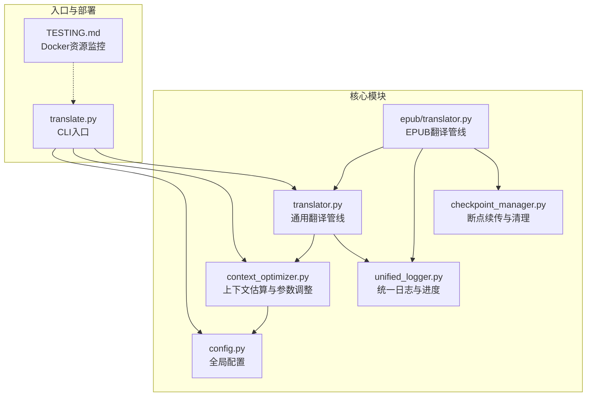
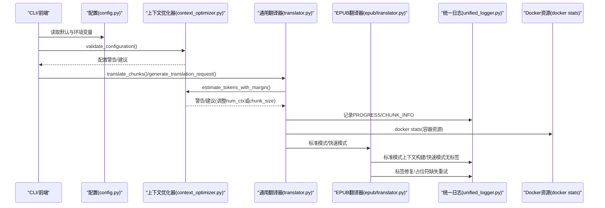
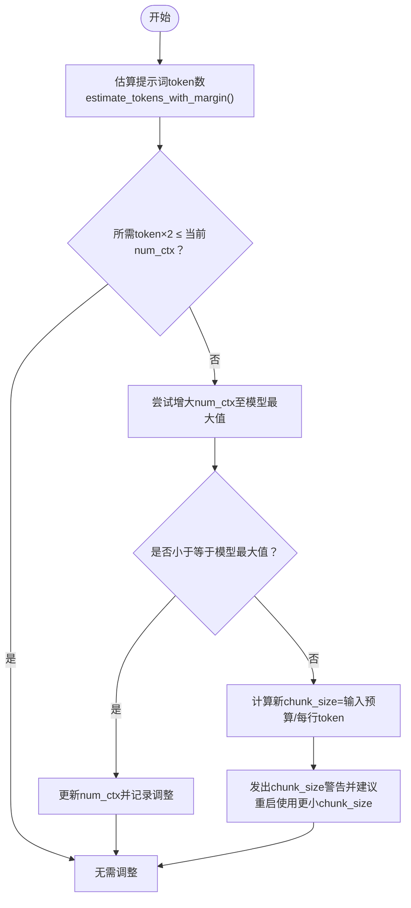
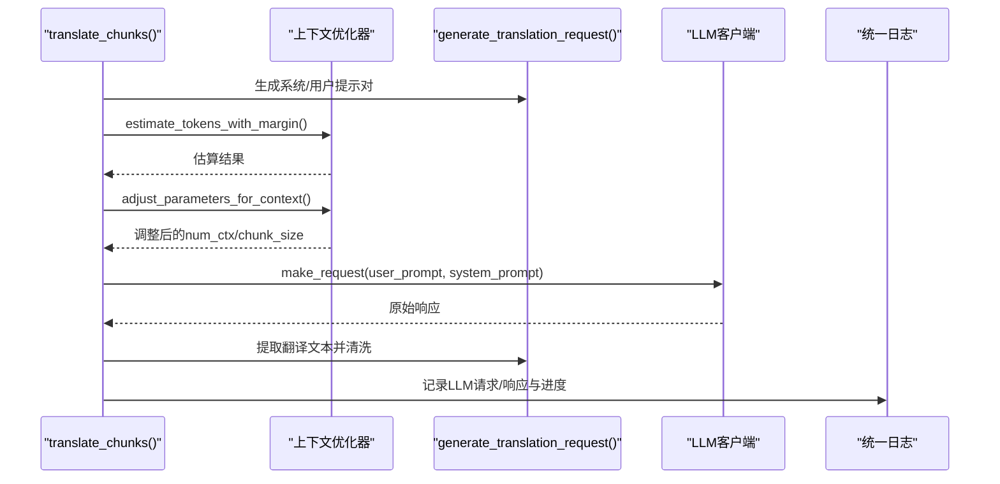
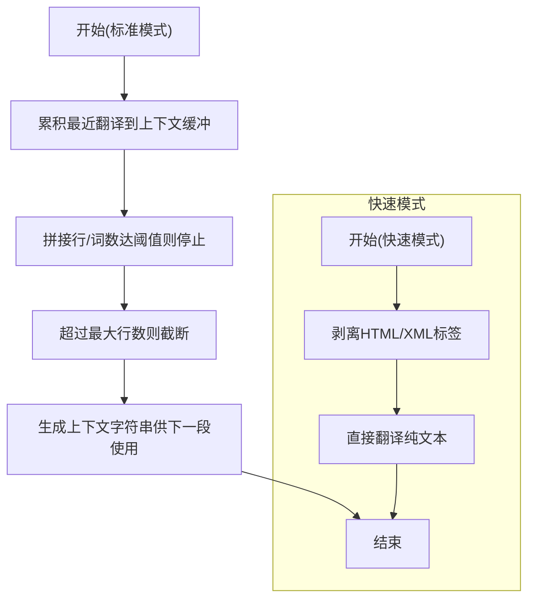
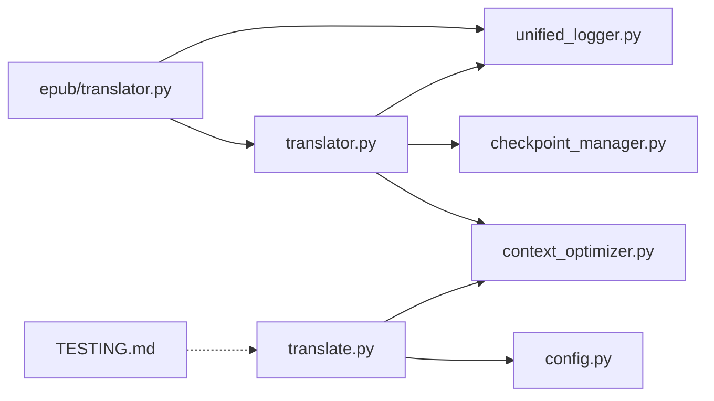

# 性能瓶颈

<cite>
**本文引用的文件**
- [context_optimizer.py](file://src/core/context_optimizer.py)
- [translator.py](file://src/core/translator.py)
- [translator.py（EPUB）](file://src/core/epub/translator.py)
- [unified_logger.py](file://src/utils/unified_logger.py)
- [TESTING.md](file://deployment/TESTING.md)
- [translate.py](file://translate.py)
- [config.py](file://src/config.py)
- [checkpoint_manager.py](file://src/persistence/checkpoint_manager.py)
</cite>

## 目录
1. [引言](#引言)
2. [项目结构](#项目结构)
3. [核心组件](#核心组件)
4. [架构总览](#架构总览)
5. [详细组件分析](#详细组件分析)
6. [依赖关系分析](#依赖关系分析)
7. [性能考量](#性能考量)
8. [故障排查指南](#故障排查指南)
9. [结论](#结论)
10. [附录](#附录)

## 引言
本文件聚焦于翻译过程中的性能瓶颈，特别是翻译速度慢、内存溢出等问题的根本原因与优化路径。通过对上下文管理机制（context_optimizer.py）、分块策略（translator.py 与 epub/translator.py）、日志监控（unified_logger.py）以及容器资源监控（TESTING.md）的深入分析，帮助用户在不同场景下进行参数调优与资源控制，从而获得更稳定、更快捷的翻译体验。

## 项目结构
围绕性能相关的模块主要分布在以下位置：
- 上下文优化与分块策略：src/core/context_optimizer.py、src/core/translator.py、src/core/epub/translator.py
- 日志与进度监控：src/utils/unified_logger.py
- 配置与默认参数：src/config.py
- 命令行入口与启动校验：translate.py
- 容器资源监控：deployment/TESTING.md
- 断点续传与内存释放：src/persistence/checkpoint_manager.py

图表来源
- [context_optimizer.py](file://src/core/context_optimizer.py#L1-L321)
- [translator.py](file://src/core/translator.py#L1-L371)
- [translator.py（EPUB）](file://src/core/epub/translator.py#L1-L800)
- [unified_logger.py](file://src/utils/unified_logger.py#L1-L432)
- [translate.py](file://translate.py#L1-L147)
- [TESTING.md](file://deployment/TESTING.md#L265-L274)

章节来源
- [context_optimizer.py](file://src/core/context_optimizer.py#L1-L321)
- [translator.py](file://src/core/translator.py#L1-L371)
- [translator.py（EPUB）](file://src/core/epub/translator.py#L1-L800)
- [unified_logger.py](file://src/utils/unified_logger.py#L1-L432)
- [translate.py](file://translate.py#L1-L147)
- [TESTING.md](file://deployment/TESTING.md#L265-L274)

## 核心组件
- 上下文优化器：负责基于提示词长度估算 token 数量、计算最优 chunk 大小、自动调整 num_ctx 与 chunk_size，并提供配置校验与警告。
- 通用翻译器：协调分块翻译流程，按需进行 token 估算与上下文调整，记录执行耗时与统计信息。
- EPUB 翻译器：在标准模式下构建上下文字符串以提升一致性；在快速模式下绕过标签处理，降低复杂度。
- 统一日志器：提供 PROGRESS 与 CHUNK_INFO 等日志类型，用于监控实时处理速率与内存趋势。
- 配置中心：集中管理 chunk_size、num_ctx、超时、重试等参数。
- 断点续传：保存已完成片段、统计状态、恢复上下文，避免重复工作并减少内存峰值。

章节来源
- [context_optimizer.py](file://src/core/context_optimizer.py#L1-L321)
- [translator.py](file://src/core/translator.py#L1-L371)
- [translator.py（EPUB）](file://src/core/epub/translator.py#L1-L800)
- [unified_logger.py](file://src/utils/unified_logger.py#L1-L432)
- [config.py](file://src/config.py#L1-L225)
- [checkpoint_manager.py](file://src/persistence/checkpoint_manager.py#L1-L528)

## 架构总览
从 CLI 到服务端，翻译流程的关键节点如下：
- CLI 启动时读取配置并进行上下文配置校验；若不满足，可提示用户调整或自动调整。
- 通用翻译器在每次请求前估算 token 并根据模型最大上下文动态调整 num_ctx 或发出 chunk_size 警告。
- EPUB 翻译器在标准模式下维护“最近翻译上下文”，以提升一致性；在快速模式下去除标签，提高稳定性。
- 统一日志器输出 PROGRESS 与 CHUNK_INFO 类型日志，便于监控速率与内存趋势。
- 容器侧通过 docker stats 实时观测 CPU、内存、网络与磁盘 I/O。

图表来源
- [translate.py](file://translate.py#L80-L102)
- [context_optimizer.py](file://src/core/context_optimizer.py#L254-L310)
- [translator.py](file://src/core/translator.py#L258-L319)
- [translator.py（EPUB）](file://src/core/epub/translator.py#L362-L436)
- [unified_logger.py](file://src/utils/unified_logger.py#L23-L33)
- [TESTING.md](file://deployment/TESTING.md#L265-L274)

## 详细组件分析

### 上下文优化器（context_optimizer.py）
- 估算策略
  - 优先使用 tiktoken 进行 token 估算；若不可用则按语言字符到 token 的比率进行估算，并应用安全余量。
  - 估算结果包含字符数、方法、语言与是否应用安全余量。
- 最优 chunk 计算
  - 公式：输入预算 ≈ (max_context × 50%) − 基础开销；chunk_size ≈ 输入预算 ÷ 每行 token 数；并限制在最小/最大范围内。
- 模型最大上下文
  - 基于模型族名（如 llama、mistral、qwen 等）返回最大上下文 token 数。
- 参数调整
  - 优先尝试增大 num_ctx 至模型最大值；若仍不足，则计算新 chunk_size 并给出警告，提示用户改用更大上下文或手动减小 chunk_size。
- 配置校验
  - 对当前 chunk_size 与 num_ctx 的组合进行推荐阈值评估，给出不足或过大的警告。

图表来源
- [context_optimizer.py](file://src/core/context_optimizer.py#L59-L115)
- [context_optimizer.py](file://src/core/context_optimizer.py#L117-L154)
- [context_optimizer.py](file://src/core/context_optimizer.py#L156-L174)
- [context_optimizer.py](file://src/core/context_optimizer.py#L176-L251)
- [context_optimizer.py](file://src/core/context_optimizer.py#L254-L310)

章节来源
- [context_optimizer.py](file://src/core/context_optimizer.py#L1-L321)

### 通用翻译器（translator.py）
- 分块翻译流程
  - 逐段发送请求，记录每段执行耗时；支持断点续传，恢复已完成片段与上下文。
  - 在每次请求前生成系统/用户提示对，合并后进行 token 估算，再决定是否调整 num_ctx 或发出 chunk_size 警告。
- 上下文管理
  - 仅当翻译文本长度足够时，才将最近翻译的末尾若干词作为后续请求的上下文，以提升一致性。
- 日志与统计
  - 输出 LLM 请求/响应日志，周期性输出进度摘要；统计完成/失败段数。

图表来源
- [translator.py](file://src/core/translator.py#L258-L319)
- [translator.py](file://src/core/translator.py#L1-L122)

章节来源
- [translator.py](file://src/core/translator.py#L1-L371)

### EPUB 翻译器（epub/translator.py）
- 标准模式
  - 为保持一致性，会从最近翻译中累积多段内容，形成“上下文字符串”，并在达到行数/词数上限后截断。
- 快速模式
  - 去除所有 HTML/XML 标签，直接翻译纯文本，避免占位符丢失与标签修复开销，适合弱模型或大体量文本。
- 占位符校验与重试
  - 若检测到占位符缺失，会重新发起翻译请求，确保输出完整性。

图表来源
- [translator.py（EPUB）](file://src/core/epub/translator.py#L539-L578)
- [translator.py（EPUB）](file://src/core/epub/translator.py#L732-L800)

章节来源
- [translator.py（EPUB）](file://src/core/epub/translator.py#L1-L800)

### 统一日志器（unified_logger.py）
- 日志类型
  - PROGRESS：输出累计完成段数、百分比与进度条。
  - CHUNK_INFO：输出当前段号、总段数与执行时间等。
  - LLM_REQUEST/LLM_RESPONSE：输出请求/响应详情，便于定位耗时与错误。
- 进度与速率监控
  - 通过 PROGRESS 类型日志，可以观察每段耗时变化，判断是否存在异常波动或内存压力导致的延迟。

章节来源
- [unified_logger.py](file://src/utils/unified_logger.py#L23-L33)
- [unified_logger.py](file://src/utils/unified_logger.py#L183-L200)
- [unified_logger.py](file://src/utils/unified_logger.py#L140-L182)

### 配置中心（config.py）
- 关键参数
  - MAIN_LINES_PER_CHUNK：默认每块行数。
  - OLLAMA_NUM_CTX：默认上下文窗口（tokens）。
  - AUTO_ADJUST_CONTEXT：是否自动调整上下文。
  - MIN/MAX_CHUNK_SIZE：chunk_size 的上下限。
  - REQUEST_TIMEOUT、MAX_TRANSLATION_ATTEMPTS、RETRY_DELAY_SECONDS：超时与重试策略。
- CLI 启动校验
  - CLI 在使用 Ollama 时调用 validate_configuration，输出配置警告并可提示用户启用自动调整。

章节来源
- [config.py](file://src/config.py#L56-L110)
- [translate.py](file://translate.py#L80-L102)

### 断点续传与内存释放（checkpoint_manager.py）
- 作用
  - 保存已完成片段、统计进度、恢复上下文，避免重复翻译；在 finally 中关闭 LLM 客户端资源，减少内存泄漏风险。
- 适用场景
  - 长文本翻译、容器资源紧张时，可先保存中间结果，再逐步推进，降低峰值内存占用。

章节来源
- [translator.py](file://src/core/translator.py#L363-L368)
- [checkpoint_manager.py](file://src/persistence/checkpoint_manager.py#L120-L174)

## 依赖关系分析
- translate.py 依赖 config.py 与 context_optimizer.py 进行启动前配置校验。
- 通用翻译器依赖 context_optimizer.py 进行 token 估算与参数调整。
- EPUB 翻译器依赖通用翻译器与标签修复工具，同时维护上下文字符串。
- 统一日志器被各层调用，用于输出 PROGRESS/CHUNK_INFO 等关键指标。
- 容器资源监控通过 docker stats 命令在 TESTING.md 中提供。

图表来源
- [translate.py](file://translate.py#L80-L102)
- [context_optimizer.py](file://src/core/context_optimizer.py#L254-L310)
- [translator.py](file://src/core/translator.py#L258-L319)
- [translator.py（EPUB）](file://src/core/epub/translator.py#L362-L436)
- [unified_logger.py](file://src/utils/unified_logger.py#L23-L33)
- [TESTING.md](file://deployment/TESTING.md#L265-L274)

章节来源
- [translate.py](file://translate.py#L1-L147)
- [context_optimizer.py](file://src/core/context_optimizer.py#L1-L321)
- [translator.py](file://src/core/translator.py#L1-L371)
- [translator.py（EPUB）](file://src/core/epub/translator.py#L1-L800)
- [unified_logger.py](file://src/utils/unified_logger.py#L1-L432)
- [TESTING.md](file://deployment/TESTING.md#L265-L274)

## 性能考量
- 过大的上下文窗口
  - 优点：减少跨段上下文缺失带来的不一致。
  - 风险：增加单次请求 token 数，可能触发 num_ctx 不足或模型拒绝，导致失败或降级为更小 chunk_size。
  - 影响：CPU/内存占用上升，网络传输增大，响应时间变长。
- 分块策略与 chunk_size
  - 较小 chunk_size：提升并发与容错，但增加请求次数与上下文碎片化风险。
  - 较大 chunk_size：减少请求次数，但可能超出模型上下文上限，引发失败或需要自动降级。
  - 与每行 token 数成反比：每行 token 数越高，相同 num_ctx 下能容纳的行数越少。
- 快速模式 vs 标准模式
  - 快速模式去除标签，避免占位符缺失与标签修复开销，适合弱模型或大体量文本，显著降低内存与时间成本。
  - 标准模式保留标签，需要上下文累积与标签修复，一致性更好但资源消耗更高。
- 日志与监控
  - PROGRESS 与 CHUNK_INFO 日志可用于观察每段耗时与完成率，识别异常波动。
  - docker stats 可观测容器 CPU、内存、网络与磁盘 I/O，辅助定位资源瓶颈。

章节来源
- [context_optimizer.py](file://src/core/context_optimizer.py#L117-L154)
- [translator.py](file://src/core/translator.py#L258-L319)
- [translator.py（EPUB）](file://src/core/epub/translator.py#L539-L578)
- [unified_logger.py](file://src/utils/unified_logger.py#L183-L200)
- [TESTING.md](file://deployment/TESTING.md#L265-L274)

## 故障排查指南
- 翻译速度慢
  - 检查 PROGRESS 日志，确认是否存在某几段耗时异常升高。
  - 适当增大 chunk_size（在 num_ctx 允许的前提下），减少请求次数。
  - 若使用弱模型，切换快速模式以消除标签处理开销。
- 内存溢出/容器崩溃
  - 使用 docker stats 观察内存曲线，必要时减小 chunk_size 或 num_ctx。
  - 启用断点续传，分批推进，降低峰值内存。
  - 在 finally 中确保 LLM 客户端资源被释放。
- 占位符缺失/标签修复失败
  - 标准模式下出现占位符缺失时，系统会重试；若仍失败，建议启用快速模式或检查模型能力。
- 配置不当
  - CLI 启动时会输出上下文配置警告；根据建议调整 OLLAMA_NUM_CTX 或开启 AUTO_ADJUST_CONTEXT。

章节来源
- [translator.py](file://src/core/translator.py#L321-L368)
- [translator.py（EPUB）](file://src/core/epub/translator.py#L438-L537)
- [TESTING.md](file://deployment/TESTING.md#L265-L274)
- [translate.py](file://translate.py#L80-L102)

## 结论
- 上下文窗口与分块大小是影响翻译速度与资源消耗的核心因素。应结合模型最大上下文与每行 token 数，动态调整 num_ctx 与 chunk_size。
- 标准模式强调一致性，快速模式强调稳定性与效率。对于弱模型或大体量文本，优先考虑快速模式。
- 通过 PROGRESS/CHUNK_INFO 日志与 docker stats，可有效监控实时速率与资源趋势，及时发现并解决问题。
- 断点续传与资源释放有助于在长时间任务中维持稳定性能。

## 附录
- 优化建议清单
  - 调整 chunk_size：在保证 num_ctx 充裕的前提下适度增大，减少请求次数；若出现失败，按警告提示减小。
  - 启用/禁用上下文优化：Ollama 场景建议开启 AUTO_ADJUST_CONTEXT；其他提供商可根据情况关闭以减少动态调整开销。
  - 选择更高效模型：优先选择具有更大上下文窗口的模型，以减少自动降级与重试。
  - 使用快速模式：弱模型或大体量文本优先启用快速模式，降低标签处理与占位符修复成本。
  - 监控容器资源：使用 docker stats 实时查看 CPU、内存、网络与磁盘 I/O，配合日志定位瓶颈。
- 配置参数示例（来自配置中心）
  - MAIN_LINES_PER_CHUNK：默认每块行数（可在 .env 中设置）。
  - OLLAMA_NUM_CTX：默认上下文窗口（tokens）。
  - AUTO_ADJUST_CONTEXT：是否自动调整上下文。
  - MIN/MAX_CHUNK_SIZE：chunk_size 的上下限。
  - REQUEST_TIMEOUT、MAX_TRANSLATION_ATTEMPTS、RETRY_DELAY_SECONDS：超时与重试策略。

章节来源
- [config.py](file://src/config.py#L56-L110)
- [translate.py](file://translate.py#L80-L102)
- [TESTING.md](file://deployment/TESTING.md#L265-L274)