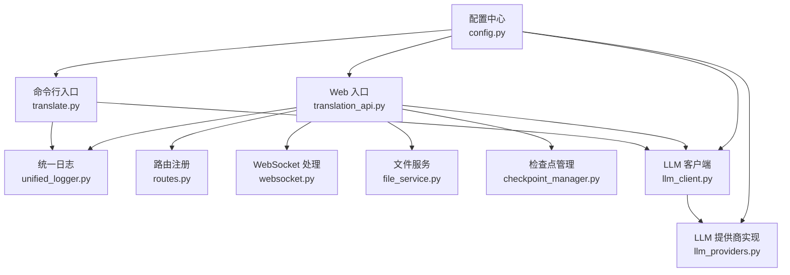
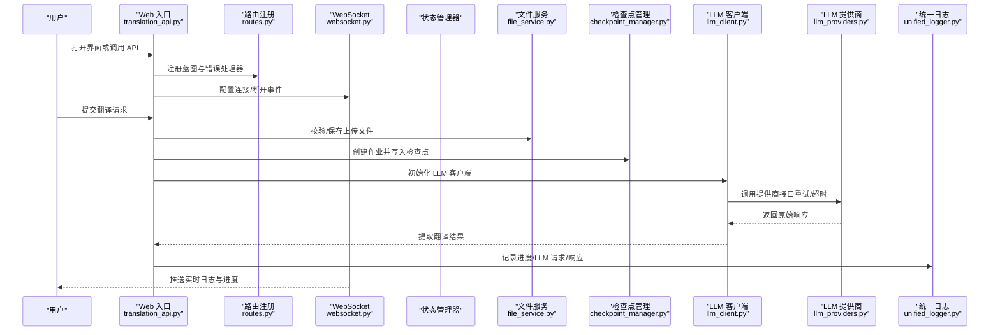
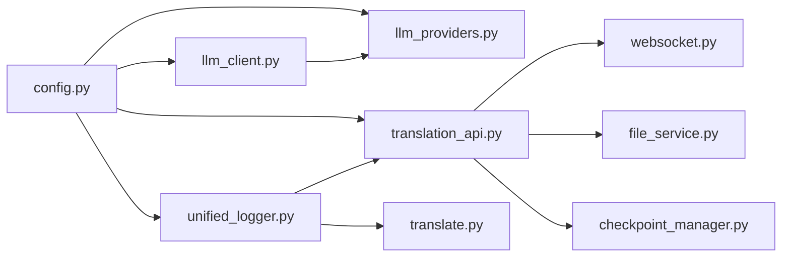

# 故障排除

<cite>
**本文引用的文件**
- [translate.py](file://translate.py)
- [translation_api.py](file://translation_api.py)
- [unified_logger.py](file://src/utils/unified_logger.py)
- [llm_client.py](file://src/core/llm_client.py)
- [llm_providers.py](file://src/core/llm_providers.py)
- [websocket.py](file://src/api/websocket.py)
- [routes.py](file://src/api/routes.py)
- [file_service.py](file://src/api/services/file_service.py)
- [checkpoint_manager.py](file://src/persistence/checkpoint_manager.py)
- [config.py](file://src/config.py)
- [TESTING.md](file://deployment/TESTING.md)
</cite>

## 目录
1. [简介](#简介)
2. [项目结构与定位](#项目结构与定位)
3. [核心组件与日志体系](#核心组件与日志体系)
4. [架构总览与交互流程](#架构总览与交互流程)
5. [按类别故障排除指南](#按类别故障排除指南)
   - [LLM 连接失败](#llm-连接失败)
   - [文件处理错误](#文件处理错误)
   - [性能瓶颈](#性能瓶颈)
   - [Web 界面异常](#web-界面异常)
6. [依赖关系与耦合分析](#依赖关系与耦合分析)
7. [性能优化建议](#性能优化建议)
8. [故障诊断清单与验证方法](#故障诊断清单与验证方法)
9. [结论](#结论)

## 简介
本手册面向使用 TranslateBookWithLLM 的用户与运维人员，聚焦四类常见问题：LLM 连接失败、文件处理错误、性能瓶颈、Web 界面异常。文档基于仓库实际实现，提供症状、可能原因、诊断步骤（重点参考统一日志系统）与具体解决方案，并结合部署测试指南中的测试用例进行修复验证。

## 项目结构与定位
- 命令行入口负责参数校验、日志初始化、配置校验与调用翻译流程。
- Web 入口负责启动 Flask + SocketIO，注册路由与 WebSocket 处理器，恢复未完成任务。
- 统一日志系统在 CLI/Web 双端输出结构化日志并通过 WebSocket 推送。
- LLM 客户端抽象不同提供商（Ollama、OpenAI 兼容、Gemini），内置重试与上下文窗口处理。
- 文件服务与持久化模块分别负责文件操作与作业检查点管理。
- 配置模块集中读取 .env 并提供默认值，影响超时、上下文窗口、分块策略等。

图表来源
- [translate.py](file://translate.py#L1-L147)
- [translation_api.py](file://translation_api.py#L1-L146)
- [unified_logger.py](file://src/utils/unified_logger.py#L1-L432)
- [llm_client.py](file://src/core/llm_client.py#L1-L123)
- [llm_providers.py](file://src/core/llm_providers.py#L1-L548)
- [websocket.py](file://src/api/websocket.py#L1-L43)
- [routes.py](file://src/api/routes.py#L1-L66)
- [file_service.py](file://src/api/services/file_service.py#L1-L215)
- [checkpoint_manager.py](file://src/persistence/checkpoint_manager.py#L1-L528)
- [config.py](file://src/config.py#L1-L225)

章节来源
- [translate.py](file://translate.py#L1-L147)
- [translation_api.py](file://translation_api.py#L1-L146)
- [unified_logger.py](file://src/utils/unified_logger.py#L1-L432)
- [llm_client.py](file://src/core/llm_client.py#L1-L123)
- [llm_providers.py](file://src/core/llm_providers.py#L1-L548)
- [websocket.py](file://src/api/websocket.py#L1-L43)
- [routes.py](file://src/api/routes.py#L1-L66)
- [file_service.py](file://src/api/services/file_service.py#L1-L215)
- [checkpoint_manager.py](file://src/persistence/checkpoint_manager.py#L1-L528)
- [config.py](file://src/config.py#L1-L225)

## 核心组件与日志体系
- 统一日志系统支持 CLI 与 Web 双端，提供结构化日志、进度、LLM 请求/响应格式化输出，并通过 WebSocket 推送至前端。
- Web 端通过状态管理器存储日志并在 WebSocket 上发送更新。
- CLI 端在启动阶段即初始化日志器，并在翻译开始/结束、错误发生时记录详细信息。

章节来源
- [unified_logger.py](file://src/utils/unified_logger.py#L1-L432)
- [translation_api.py](file://translation_api.py#L1-L146)
- [translate.py](file://translate.py#L1-L147)

## 架构总览与交互流程
下面以“发起一次翻译任务”的典型流程为例，展示从 Web 或 CLI 到 LLM 的调用链路与日志传播路径。

图表来源
- [translation_api.py](file://translation_api.py#L1-L146)
- [routes.py](file://src/api/routes.py#L1-L66)
- [websocket.py](file://src/api/websocket.py#L1-L43)
- [file_service.py](file://src/api/services/file_service.py#L1-L215)
- [checkpoint_manager.py](file://src/persistence/checkpoint_manager.py#L1-L528)
- [llm_client.py](file://src/core/llm_client.py#L1-L123)
- [llm_providers.py](file://src/core/llm_providers.py#L1-L548)
- [unified_logger.py](file://src/utils/unified_logger.py#L1-L432)

## 按类别故障排除指南

### LLM 连接失败
- 症状
  - Web 界面提示无法连接 LLM；CLI 报错“LLM 请求失败”或“HTTP 错误”。
  - 日志中出现“上下文超出”“超时”“JSON 解析失败”等字样。
- 可能原因
  - API 端点不可达或鉴权失败（Ollama 未运行、OpenAI/Gemini 密钥无效）。
  - 上下文窗口不足导致请求被拒绝（Ollama 上下文溢出）。
  - 超时或网络抖动导致请求中断。
- 诊断步骤
  - 在 Web 界面查看实时日志与进度条，确认是否出现“LLM 请求/响应”格式化输出。
  - 在 CLI 中运行翻译并观察统一日志输出，注意“LLM 请求”“LLM 响应”“错误详情”等类型日志。
  - 检查 .env 配置项：API_ENDPOINT、LLM_PROVIDER、GEMINI_API_KEY、OPENAI_API_KEY、OLLAMA_NUM_CTX、REQUEST_TIMEOUT。
  - 使用部署测试指南中的健康检查与容器日志定位问题。
- 解决方案
  - 确认 Ollama 已启动且 API 端点可达；若使用远程主机，确保端口映射正确。
  - 对于 Gemini/OpenAI，确认 API 密钥有效且模型名称正确。
  - 若出现“上下文超出”，适当降低 chunk_size 或提高 OLLAMA_NUM_CTX；必要时启用自动调整上下文。
  - 增大 REQUEST_TIMEOUT 并减少并发压力。
- 验证方法
  - 使用部署测试脚本进行自动化验证，或手动访问健康端点与 Web 界面。

章节来源
- [llm_providers.py](file://src/core/llm_providers.py#L1-L548)
- [llm_client.py](file://src/core/llm_client.py#L1-L123)
- [unified_logger.py](file://src/utils/unified_logger.py#L1-L432)
- [config.py](file://src/config.py#L1-L225)
- [TESTING.md](file://deployment/TESTING.md#L1-L368)

### 文件处理错误
- 症状
  - EPUB 解析失败、XML 语法错误、章节文件缺失、写入目标文件失败。
  - SRT 字幕重建失败或乱码。
  - Web 界面文件列表为空或删除失败。
- 可能原因
  - EPUB 内部引用的资源文件缺失或路径不正确。
  - XML 解析异常（标签不闭合、命名空间问题）。
  - SRT 结构重建依赖原始文件，但未保留或已丢失。
  - 文件权限或路径安全校验导致删除失败。
- 诊断步骤
  - 查看统一日志中“EPUB 内容文件未找到”“XML 语法错误”“写入错误”“重大错误”等分类日志。
  - 在 Web 界面使用“文件管理”功能，确认列出的文件是否为最终产物而非临时文件。
  - 检查上传目录与输出目录权限，确认未被安全策略拦截。
- 解决方案
  - 对于 EPUB：优先使用“快速模式”（fast mode）以避免复杂标签管理；确保输入文件完整并可被保留。
  - 对于 SRT：确保原始文件被保留，以便重建字幕结构。
  - 对于文件管理：使用安全删除接口并确认路径在 uploads 子目录内。
- 验证方法
  - 使用部署测试指南中的“性能测试”与“检查点/恢复”流程，验证 EPUB/SRT 处理链路。

章节来源
- [unified_logger.py](file://src/utils/unified_logger.py#L1-L432)
- [file_service.py](file://src/api/services/file_service.py#L1-L215)
- [checkpoint_manager.py](file://src/persistence/checkpoint_manager.py#L1-L528)
- [TESTING.md](file://deployment/TESTING.md#L1-L368)

### 性能瓶颈
- 症状
  - 翻译速度缓慢、CPU/内存占用高、长时间卡在某个进度节点。
  - LLM 请求频繁超时或上下文溢出警告。
- 可能原因
  - chunk_size 设置过大，导致单次请求超过上下文限制或耗时过长。
  - OLLAMA_NUM_CTX 设置过低，频繁触发上下文调整。
  - REQUEST_TIMEOUT 过短，网络波动导致频繁重试。
  - Web 端并发过多，SocketIO 传输阻塞。
- 诊断步骤
  - 观察统一日志中的“进度更新”“上下文估算/调整”“LLM 请求/响应”等日志，定位瓶颈阶段。
  - 在 Web 界面查看实时进度与统计信息（已完成/失败分块数）。
  - 检查 .env 中的 MAIN_LINES_PER_CHUNK、OLLAMA_NUM_CTX、REQUEST_TIMEOUT、MAX_TRANSLATION_ATTEMPTS。
- 解决方案
  - 合理设置 chunk_size，避免过大；根据模型家族上限与语言特性调整 num_ctx。
  - 启用自动上下文调整（AUTO_ADJUST_CONTEXT=true），让系统动态适配。
  - 适当增大 REQUEST_TIMEOUT，减少重试间隔带来的抖动。
  - 控制并发与批处理大小，避免一次性提交过多任务。
- 验证方法
  - 使用部署测试指南中的“性能测试”流程，对比不同配置下的翻译耗时与稳定性。

章节来源
- [llm_providers.py](file://src/core/llm_providers.py#L1-L548)
- [config.py](file://src/config.py#L1-L225)
- [unified_logger.py](file://src/utils/unified_logger.py#L1-L432)
- [TESTING.md](file://deployment/TESTING.md#L1-L368)

### Web 界面异常
- 症状
  - WebSocket 断开、按钮无响应、页面空白或加载失败。
  - 日志中出现“WebSocket 发射错误”“内部服务器错误”。
- 可能原因
  - SocketIO 未正确建立连接或服务端异常。
  - 路由未注册或 404/500 错误未正确处理。
  - 输出目录不存在或权限不足导致文件操作失败。
- 诊断步骤
  - 在浏览器开发者工具 Network/WS 面板查看 WebSocket 连接状态与消息。
  - 在服务端日志中查找“连接/断开”“WebSocket 发射错误”“内部服务器错误”等信息。
  - 确认输出目录存在且可写，必要时手动创建。
- 解决方案
  - 确保 SocketIO 正确配置并允许跨域；检查防火墙与代理设置。
  - 修复路由注册与错误处理器，确保 404/500 场景返回结构化错误信息。
  - 重新创建输出目录并赋予写权限。
- 验证方法
  - 使用部署测试指南中的“健康检查”“容器日志”“Web 界面访问”等步骤进行验证。

章节来源
- [websocket.py](file://src/api/websocket.py#L1-L43)
- [routes.py](file://src/api/routes.py#L1-L66)
- [translation_api.py](file://translation_api.py#L1-L146)
- [TESTING.md](file://deployment/TESTING.md#L1-L368)

## 依赖关系与耦合分析
- LLM 客户端与提供商：LLMClient 通过工厂函数选择具体提供商实现，Ollama/兼容 OpenAI/Gemini 分别封装各自的请求与提取逻辑。
- 日志系统：统一日志在 CLI/Web 双端输出，并通过回调注入到状态管理器与 WebSocket，形成闭环。
- 文件与持久化：文件服务负责可见性过滤与安全删除；检查点管理负责作业生命周期与恢复能力。
- 配置中心：集中读取 .env 并提供默认值，直接影响超时、上下文、分块策略等关键参数。

图表来源
- [config.py](file://src/config.py#L1-L225)
- [llm_client.py](file://src/core/llm_client.py#L1-L123)
- [llm_providers.py](file://src/core/llm_providers.py#L1-L548)
- [unified_logger.py](file://src/utils/unified_logger.py#L1-L432)
- [translation_api.py](file://translation_api.py#L1-L146)
- [websocket.py](file://src/api/websocket.py#L1-L43)
- [file_service.py](file://src/api/services/file_service.py#L1-L215)
- [checkpoint_manager.py](file://src/persistence/checkpoint_manager.py#L1-L528)

## 性能优化建议
- 合理分块：根据语言与模型族设定合适的 MAIN_LINES_PER_CHUNK，避免过大导致上下文溢出。
- 自动上下文：开启 AUTO_ADJUST_CONTEXT，让系统在运行时动态调整 num_ctx 与 chunk_size。
- 超时与重试：适度增大 REQUEST_TIMEOUT，合理设置 MAX_TRANSLATION_ATTEMPTS 与 RETRY_DELAY_SECONDS。
- 资源隔离：生产环境使用 WSGI 服务器与反向代理，避免直接暴露 Flask/Werkzeug。
- 日志采样：在高频场景下减少调试日志输出，保留关键日志类型用于诊断。

## 故障诊断清单与验证方法
- 通用
  - 收集服务端日志（容器日志或本地控制台日志），包含“LLM 请求/响应”“错误详情”“进度更新”等。
  - 确认 .env 配置完整且与实际环境一致。
- LLM 连接
  - 健康检查端点可用；API 端点可达；密钥有效；上下文窗口充足。
- 文件处理
  - EPUB/SRT 输入文件完整；检查点中保留了原始文件；输出目录可写。
- Web 界面
  - WebSocket 连接正常；路由注册无误；错误处理器返回结构化错误信息。
- 验证修复
  - 使用部署测试指南中的自动化脚本或手动步骤进行回归验证，包括健康检查、Web 界面访问、翻译任务执行与日志核对。

章节来源
- [TESTING.md](file://deployment/TESTING.md#L1-L368)
- [translation_api.py](file://translation_api.py#L1-L146)
- [unified_logger.py](file://src/utils/unified_logger.py#L1-L432)

## 结论
通过统一日志体系与完善的配置、路由、WebSocket、文件与持久化模块，TranslateBookWithLLM 能够在多种部署形态下稳定运行。遇到问题时，建议优先从日志入手，结合 .env 配置与部署测试指南进行验证，逐步缩小范围并实施针对性优化与修复。