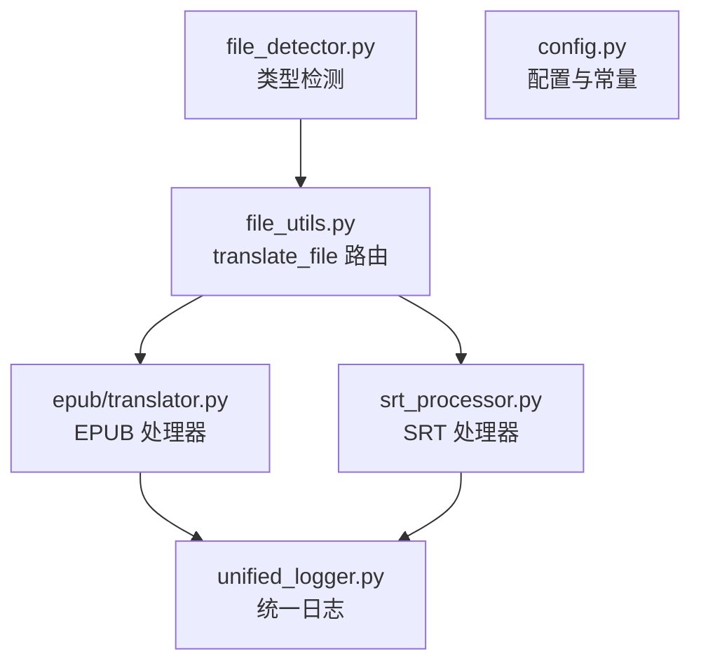
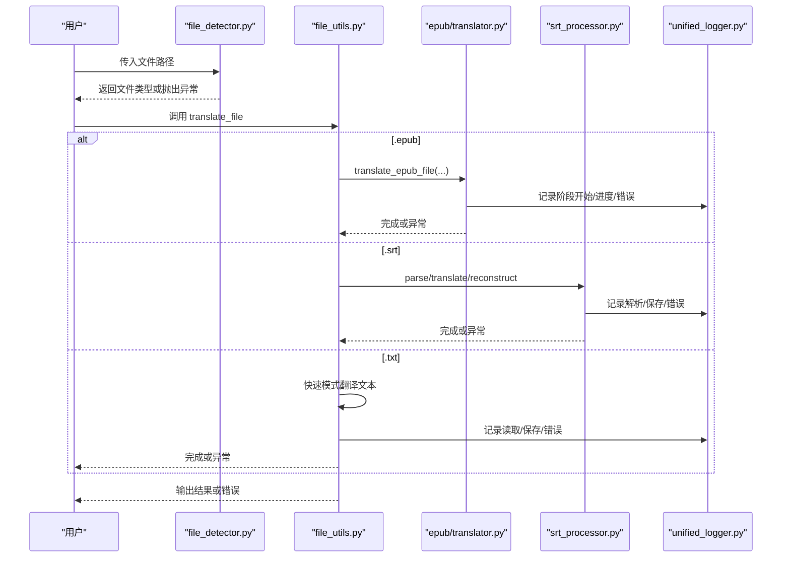
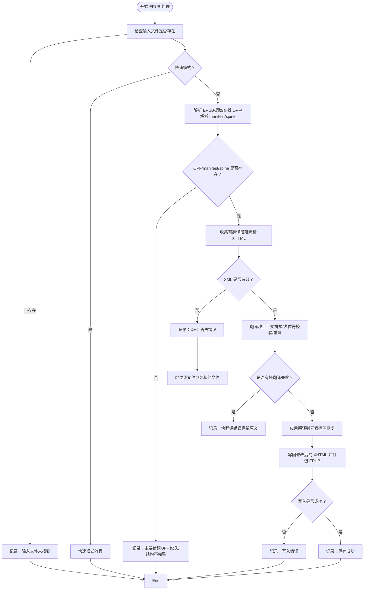
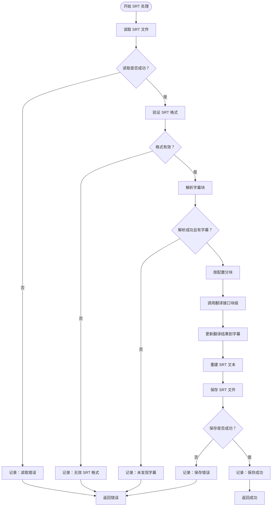
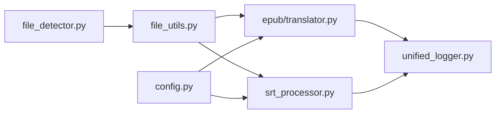

# 文件处理错误

<cite>
**本文引用的文件**
- [file_detector.py](file://src/utils/file_detector.py)
- [translator.py](file://src/core/epub/translator.py)
- [srt_processor.py](file://src/core/srt_processor.py)
- [unified_logger.py](file://src/utils/unified_logger.py)
- [file_utils.py](file://src/utils/file_utils.py)
- [config.py](file://src/config.py)
</cite>

## 目录
1. [简介](#简介)
2. [项目结构与入口](#项目结构与入口)
3. [核心组件与错误处理机制](#核心组件与错误处理机制)
4. [架构总览](#架构总览)
5. [详细组件分析](#详细组件分析)
6. [依赖关系分析](#依赖关系分析)
7. [性能与稳定性考量](#性能与稳定性考量)
8. [故障排查指南](#故障排查指南)
9. [结论](#结论)
10. [附录：常见错误与修复建议](#附录常见错误与修复建议)

## 简介
本文件聚焦于文件处理过程中的常见错误与定位方法，包括：
- EPUB 解析失败（OPF 缺失、XML 结构损坏、内容文件缺失）
- SRT 时间戳格式异常与解析失败
- TXT 编码问题（非 UTF-8）
- 使用统一日志系统定位具体“块/章节/文件”
- 通过 file_detector 的类型检测机制判断文件是否受支持
- 提供修复建议与复现步骤

## 项目结构与入口
- 类型检测：基于扩展名判断文件类型，仅支持 .txt、.epub、.srt
- 文件翻译入口：根据扩展名路由到对应处理器
- 日志系统：统一输出与存储，便于定位错误来源

图表来源
- [file_detector.py](file://src/utils/file_detector.py#L10-L33)
- [file_utils.py](file://src/utils/file_utils.py#L339-L405)
- [translator.py](file://src/core/epub/translator.py#L32-L149)
- [srt_processor.py](file://src/core/srt_processor.py#L1-L20)
- [unified_logger.py](file://src/utils/unified_logger.py#L1-L60)
- [config.py](file://src/config.py#L110-L136)

章节来源
- [file_detector.py](file://src/utils/file_detector.py#L10-L33)
- [file_utils.py](file://src/utils/file_utils.py#L339-L405)

## 核心组件与错误处理机制
- file_detector：仅接受 txt/epub/srt 扩展名；不支持则抛出值错误
- file_utils.translate_file：按扩展名分发至 EPUB 或 SRT 处理器；.txt 默认走快速模式
- EPUB 处理器：在解析、收集、翻译、写回各阶段均通过日志回调上报错误
- SRT 处理器：提供格式校验、解析、重建与分块翻译流程，并在读取、保存时捕获异常
- unified_logger：统一日志格式，支持进度、LLM 请求/响应、错误详情等类型

章节来源
- [file_detector.py](file://src/utils/file_detector.py#L10-L33)
- [file_utils.py](file://src/utils/file_utils.py#L339-L405)
- [translator.py](file://src/core/epub/translator.py#L84-L149)
- [srt_processor.py](file://src/core/srt_processor.py#L1-L20)
- [unified_logger.py](file://src/utils/unified_logger.py#L1-L60)

## 架构总览
下图展示从输入文件到翻译完成的整体流程及错误上报路径。

图表来源
- [file_detector.py](file://src/utils/file_detector.py#L10-L33)
- [file_utils.py](file://src/utils/file_utils.py#L339-L405)
- [translator.py](file://src/core/epub/translator.py#L32-L149)
- [srt_processor.py](file://src/core/srt_processor.py#L1-L20)
- [unified_logger.py](file://src/utils/unified_logger.py#L1-L60)

## 详细组件分析

### EPUB 处理器（translator.py）错误点与定位
- 输入检查与早期失败
  - 输入文件不存在：记录“输入文件未找到”
  - 快速模式激活：记录“快速模式已启用”
- 解析阶段
  - OPF 文件缺失：抛出文件未找到异常
  - manifest/spine 缺失：抛出值错误
  - XHTML/XML 解析失败：捕获 XML 语法错误并记录
- 收集阶段
  - 内容文件路径不存在：记录“内容文件未找到”
  - 其他异常：记录“收集作业错误”
- 翻译阶段
  - 单个块翻译失败：插入占位错误标记并记录“块翻译错误”
  - 占位符缺失：重试并记录“缺少占位符/重试成功”
  - 中断信号：记录“翻译被中断”
- 应用与写回阶段
  - 写回文件失败：记录“写入错误”
  - ZIP 打包失败：记录“打包错误”
- 重大异常
  - 捕获并记录“主要错误”与堆栈

图表来源
- [translator.py](file://src/core/epub/translator.py#L84-L149)
- [translator.py](file://src/core/epub/translator.py#L150-L203)
- [translator.py](file://src/core/epub/translator.py#L206-L267)
- [translator.py](file://src/core/epub/translator.py#L270-L359)
- [translator.py](file://src/core/epub/translator.py#L362-L436)
- [translator.py](file://src/core/epub/translator.py#L496-L537)
- [translator.py](file://src/core/epub/translator.py#L581-L730)
- [translator.py](file://src/core/epub/translator.py#L732-L800)
- [translator.py](file://src/core/epub/translator.py#L860-L928)

章节来源
- [translator.py](file://src/core/epub/translator.py#L84-L149)
- [translator.py](file://src/core/epub/translator.py#L150-L203)
- [translator.py](file://src/core/epub/translator.py#L206-L267)
- [translator.py](file://src/core/epub/translator.py#L270-L359)
- [translator.py](file://src/core/epub/translator.py#L362-L436)
- [translator.py](file://src/core/epub/translator.py#L496-L537)
- [translator.py](file://src/core/epub/translator.py#L581-L730)
- [translator.py](file://src/core/epub/translator.py#L732-L800)
- [translator.py](file://src/core/epub/translator.py#L860-L928)

### SRT 处理器（srt_processor.py）错误点与定位
- 读取与保存
  - 读取失败：记录“读取错误”
  - 保存失败：记录“保存错误”
- 格式校验与解析
  - 校验失败：记录“无效 SRT 格式”
  - 解析后无字幕：记录“未发现字幕”
- 分块翻译与重建
  - 翻译后重建：记录“重建 SRT”
  - 缺失索引：记录“LLM 忘记包含索引”

图表来源
- [srt_processor.py](file://src/core/srt_processor.py#L1-L20)
- [srt_processor.py](file://src/core/srt_processor.py#L212-L236)
- [file_utils.py](file://src/utils/file_utils.py#L195-L338)

章节来源
- [srt_processor.py](file://src/core/srt_processor.py#L1-L20)
- [srt_processor.py](file://src/core/srt_processor.py#L212-L236)
- [file_utils.py](file://src/utils/file_utils.py#L195-L338)

### TXT 处理（file_utils.py）错误点与定位
- 输入文件不存在：记录“输入文件未找到”
- 读取失败：记录“读取错误”
- 空输入：创建空输出并记录“空输出已创建”
- 保存失败：记录“保存错误”
- 快速模式：.txt 强制快速模式（无占位符）

章节来源
- [file_utils.py](file://src/utils/file_utils.py#L58-L194)

## 依赖关系分析
- file_detector 与 file_utils：前者决定类型，后者按类型路由
- file_utils 与 translator/srt_processor：作为统一入口协调错误与日志
- translator/srt_processor 与 unified_logger：通过回调上报阶段、进度、错误
- config：提供命名空间、标签白名单、SRT 块大小等配置

图表来源
- [file_detector.py](file://src/utils/file_detector.py#L10-L33)
- [file_utils.py](file://src/utils/file_utils.py#L339-L405)
- [translator.py](file://src/core/epub/translator.py#L1-L20)
- [srt_processor.py](file://src/core/srt_processor.py#L1-L20)
- [unified_logger.py](file://src/utils/unified_logger.py#L1-L60)
- [config.py](file://src/config.py#L110-L136)

章节来源
- [file_detector.py](file://src/utils/file_detector.py#L10-L33)
- [file_utils.py](file://src/utils/file_utils.py#L339-L405)
- [translator.py](file://src/core/epub/translator.py#L1-L20)
- [srt_processor.py](file://src/core/srt_processor.py#L1-L20)
- [unified_logger.py](file://src/utils/unified_logger.py#L1-L60)
- [config.py](file://src/config.py#L110-L136)

## 性能与稳定性考量
- EPUB：解析与翻译阶段均采用分块策略，避免一次性加载过多内容；快照/检查点可减少中断损失
- SRT：按行数与字符数限制分块，避免单次请求过大；重建时追加签名注释
- TXT：快速模式避免占位符处理开销，适合纯文本翻译
- 日志：统一格式便于批量检索与统计

[本节为通用建议，无需特定文件引用]

## 故障排查指南

### 如何判断文件格式是否受支持？
- 使用类型检测函数，依据扩展名判断：仅支持 .txt、.epub、.srt
- 不支持的扩展名会抛出值错误，可通过日志查看“不支持的类型”

章节来源
- [file_detector.py](file://src/utils/file_detector.py#L10-L33)

### 如何通过日志定位具体出错的文件/块/章节？
- EPUB
  - 阶段标识：如“解析阶段开始”“收集作业完成”“翻译阶段开始”“应用翻译开始”“保存成功”
  - 错误标识：如“输入文件未找到”“XML 语法错误”“内容文件未找到”“块翻译错误”“写入错误”“主要错误”
  - 关键字段：日志条目包含类型、消息、数据（如文件路径、块号、百分比等）
- SRT
  - 阶段标识：如“解析开始”“解析完成”“分块”“翻译开始”“重建 SRT”
  - 错误标识：如“读取错误”“无效 SRT 格式”“未发现字幕”“保存错误”
- TXT
  - 阶段标识：如“读取完成”“分块开始”“翻译完成”“保存成功”
  - 错误标识：如“输入文件未找到”“读取错误”“空输出已创建”“保存错误”

章节来源
- [translator.py](file://src/core/epub/translator.py#L224-L266)
- [translator.py](file://src/core/epub/translator.py#L269-L359)
- [translator.py](file://src/core/epub/translator.py#L362-L436)
- [translator.py](file://src/core/epub/translator.py#L496-L537)
- [translator.py](file://src/core/epub/translator.py#L592-L730)
- [translator.py](file://src/core/epub/translator.py#L708-L730)
- [translator.py](file://src/core/epub/translator.py#L860-L928)
- [srt_processor.py](file://src/core/srt_processor.py#L212-L236)
- [file_utils.py](file://src/utils/file_utils.py#L58-L194)
- [unified_logger.py](file://src/utils/unified_logger.py#L1-L60)

### 从日志中提取 chunk 信息进行问题复现
- 在日志中查找“LLM 请求”“LLM 响应”“进度”等类型，这些条目通常包含当前块号、总块数、模型等
- 若出现“块翻译错误”，可在日志中定位该块的原始内容与错误提示，复现相同上下文进行调试
- 对于 EPUB，关注“应用翻译开始”“写入错误”等，定位具体文件路径与块索引

章节来源
- [unified_logger.py](file://src/utils/unified_logger.py#L140-L200)
- [translator.py](file://src/core/epub/translator.py#L362-L436)
- [translator.py](file://src/core/epub/translator.py#L581-L730)

## 结论
- file_detector 保证了输入类型的合法性，避免不支持格式进入后续流程
- EPUB/SRT/TXT 各自的错误路径都有明确的日志标识，便于快速定位问题来源
- unified_logger 提供统一的结构化日志，支持进度、LLM 请求/响应、错误详情等场景
- 通过日志中的“块号/文件路径/阶段信息”，可以高效复现问题并验证修复

[本节为总结性内容，无需特定文件引用]

## 附录：常见错误与修复建议

- EPUB 解析失败
  - 现象：找不到 OPF、manifest/spine 缺失、XML 语法错误、内容文件路径不存在
  - 原因：EPUB 结构损坏、压缩包内文件缺失、XHTML 编码或格式异常
  - 修复：使用标准工具重新生成 EPUB；确保 mimetype、META-INF、OEBPS 结构完整；清理多余空白与非法字符
  - 参考日志：输入文件未找到、XML 语法错误、内容文件未找到、主要错误

- SRT 时间戳格式异常
  - 现象：无法解析时间轴、格式不规范、缺少换行
  - 原因：时间戳格式不符合“HH:MM:SS,mmm --> HH:MM:SS,mmm”；块之间缺少空行
  - 修复：统一时间戳格式；确保每条字幕块以空行分隔；必要时使用专业字幕编辑器校正
  - 参考日志：无效 SRT 格式、未发现字幕、读取错误、保存错误

- TXT 编码问题
  - 现象：读取时报编码错误、输出乱码
  - 原因：文件非 UTF-8 编码
  - 修复：将文件转换为 UTF-8 编码；确保换行符一致（推荐使用 LF）
  - 参考日志：输入文件未找到、读取错误、保存错误

- 占位符缺失与标签恢复失败（EPUB）
  - 现象：翻译后标签丢失或不匹配，最终校验仍缺失
  - 原因：LLM 未保留占位符或上下文不足
  - 修复：启用快速模式（移除标签再翻译）；提高上下文窗口；检查提示词对占位符保护的强调
  - 参考日志：缺少占位符、重试成功、占位符仍缺失、建议启用快速模式

- 中断与异常
  - 现象：用户中断导致翻译提前结束
  - 原因：用户触发中断信号
  - 修复：在 Web 界面或 CLI 中正确处理中断；利用检查点/断点续传功能

章节来源
- [translator.py](file://src/core/epub/translator.py#L860-L928)
- [srt_processor.py](file://src/core/srt_processor.py#L212-L236)
- [file_utils.py](file://src/utils/file_utils.py#L58-L194)
- [unified_logger.py](file://src/utils/unified_logger.py#L1-L60)