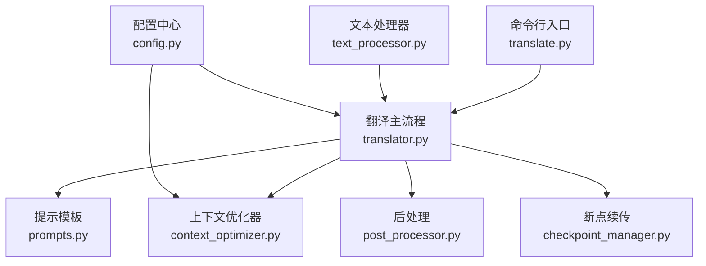
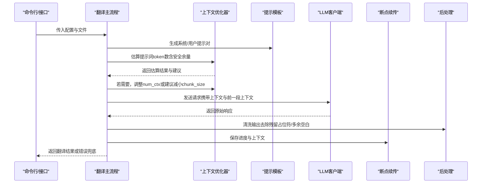
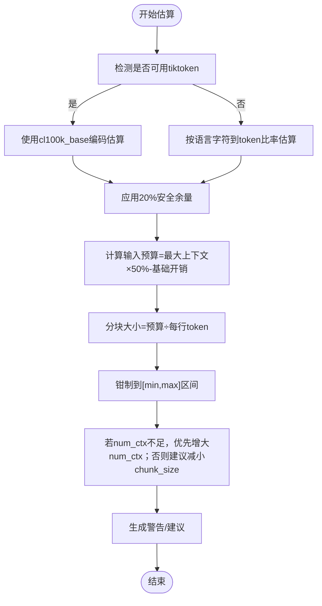
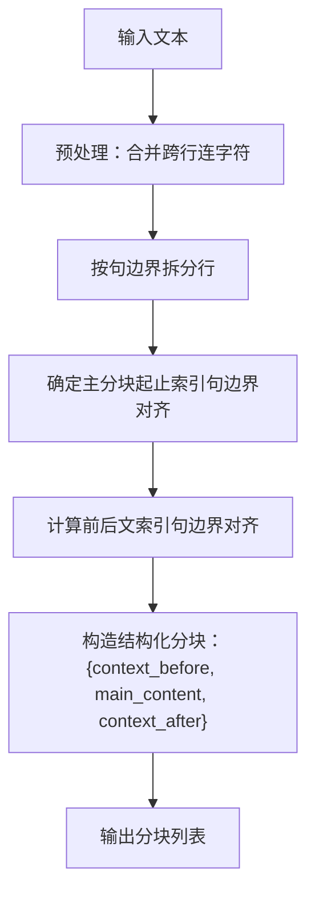
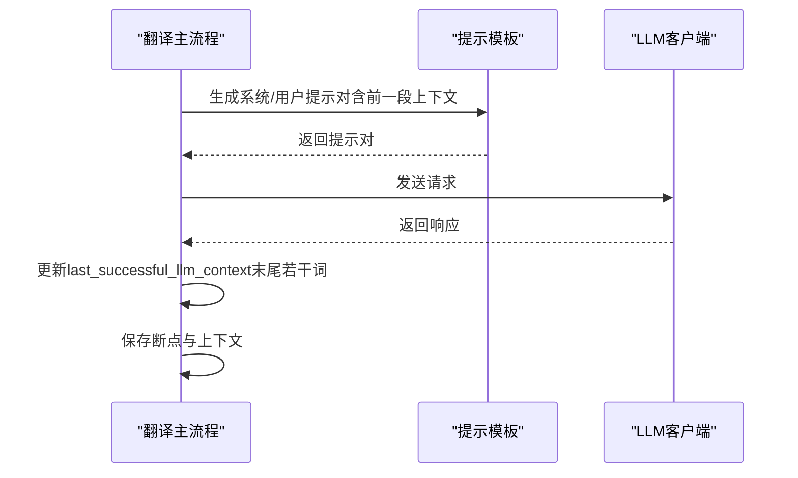
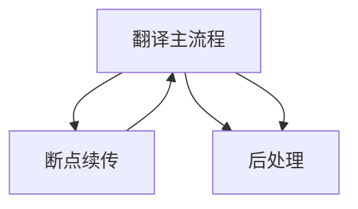
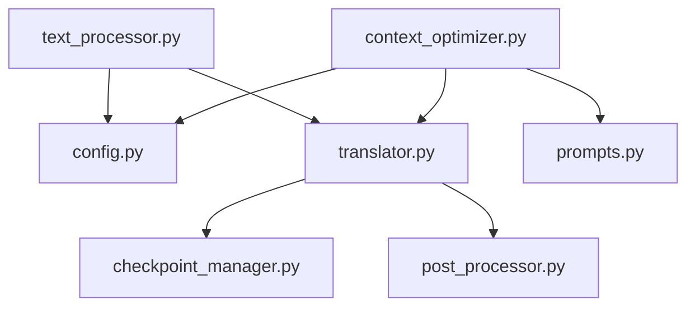

# 上下文优化

<cite>
**本文引用的文件列表**
- [context_optimizer.py](file://src/core/context_optimizer.py)
- [translator.py](file://src/core/translator.py)
- [text_processor.py](file://src/core/text_processor.py)
- [config.py](file://src/config.py)
- [prompts.py](file://prompts/prompts.py)
- [checkpoint_manager.py](file://src/persistence/checkpoint_manager.py)
- [post_processor.py](file://src/core/post_processor.py)
- [translate.py](file://translate.py)
</cite>

## 目录
1. [简介](#简介)
2. [项目结构](#项目结构)
3. [核心组件](#核心组件)
4. [架构总览](#架构总览)
5. [详细组件分析](#详细组件分析)
6. [依赖关系分析](#依赖关系分析)
7. [性能考量](#性能考量)
8. [故障排查指南](#故障排查指南)
9. [结论](#结论)
10. [附录：配置参数与调优建议](#附录配置参数与调优建议)

## 简介
本章节聚焦“上下文优化器（ContextOptimizer）”在提升翻译连贯性方面的技术实现。系统通过以下方式达成目标：
- 基于 tiktoken 或字符比率估算提示词的 token 数量，并引入安全余量；
- 根据模型最大上下文窗口与提示预算，动态调整上下文窗口（num_ctx）或分块大小（chunk_size），以平衡翻译质量与性能；
- 在分块阶段分析文本结构，通过句边界对齐避免句子被截断，保证语义完整性；
- 将“前一段上下文”作为一致性参考注入 LLM，使生成译文更自然流畅；
- 与断点续传、后处理等模块协同工作，保障长文档翻译的稳定性与可恢复性。

## 项目结构
围绕上下文优化的关键文件与职责如下：
- 上下文优化器：负责 token 估算、上下文窗口与分块大小的动态调整、配置校验与日志格式化；
- 文本处理器：负责按句边界进行分块，保留前后文，避免截断；
- 翻译主流程：在发送请求前进行估算与调整，维护“上一段 LLM 上下文”，并与断点续传、后处理衔接；
- 配置中心：集中管理上下文窗口、分块大小、自动调整开关等参数；
- 提示模板：提供稳定的系统提示与用户提示结构，便于估算与一致性控制；
- 断点续传：保存已完成片段、进度与 LLM 上下文，支持恢复；
- 后处理：清洗输出，去除残留占位符与多余空白，提升最终可读性。

图表来源
- [context_optimizer.py](file://src/core/context_optimizer.py#L1-L321)
- [translator.py](file://src/core/translator.py#L1-L371)
- [text_processor.py](file://src/core/text_processor.py#L1-L174)
- [config.py](file://src/config.py#L1-L225)
- [prompts.py](file://prompts/prompts.py#L1-L322)
- [checkpoint_manager.py](file://src/persistence/checkpoint_manager.py#L1-L528)
- [post_processor.py](file://src/core/post_processor.py#L1-L212)
- [translate.py](file://translate.py#L1-L147)

章节来源
- [context_optimizer.py](file://src/core/context_optimizer.py#L1-L321)
- [translator.py](file://src/core/translator.py#L1-L371)
- [text_processor.py](file://src/core/text_processor.py#L1-L174)
- [config.py](file://src/config.py#L1-L225)
- [prompts.py](file://prompts/prompts.py#L1-L322)
- [checkpoint_manager.py](file://src/persistence/checkpoint_manager.py#L1-L528)
- [post_processor.py](file://src/core/post_processor.py#L1-L212)
- [translate.py](file://translate.py#L1-L147)

## 核心组件
- 上下文优化器（context_optimizer.py）
  - token 估算：优先使用 tiktoken（cl100k_base 编码），不可用时采用语言特定字符到 token 比率估算，并应用 20% 安全余量；
  - 上下文窗口与分块大小计算：基于“输入预算=最大上下文×50%-基础开销”公式，结合每行 token 估算得到最优分块大小；
  - 参数调整策略：优先增大 num_ctx 至模型上限；若仍不足，则回退到减小 chunk_size 并给出警告；
  - 配置校验：对当前 chunk_size 与 num_ctx 的组合进行推荐阈值评估，给出不足或过高的风险提示；
  - 日志格式化：提供统一的估算信息格式化函数，便于前端/CLI 展示。
- 文本处理器（text_processor.py）
  - 句边界检测：通过标点符号集合识别句尾，向上/向下搜索限定范围，确保分块不截断句子；
  - 分块结构：返回包含 context_before/main_content/context_after 的结构化字典，便于 LLM 获取前后文；
  - 行内连字符处理：合并跨行连字符，减少误切。
- 翻译主流程（translator.py）
  - 请求生成：先生成系统/用户提示对，再进行 token 估算与参数调整；
  - 连续性上下文：维护 last_successful_llm_context，作为“上一段上下文”注入后续请求，提升一致性；
  - 断点续传：在每次 chunk 处理后保存进度、片段与上下文，支持恢复；
  - 错误兜底：当 LLM 输出异常时，保留原文或进行清洗后返回，避免中断。
- 配置中心（config.py）
  - 关键参数：MAIN_LINES_PER_CHUNK、OLLAMA_NUM_CTX、AUTO_ADJUST_CONTEXT、MIN_CHUNK_SIZE、MAX_CHUNK_SIZE；
  - 统一配置对象：支持 CLI/Web 输入映射，便于在不同入口间共享上下文优化策略。
- 提示模板（prompts.py）
  - 系统提示稳定：角色、原则、输出格式等固定不变，便于估算与一致性；
  - 用户提示包含：前一段上下文、待翻译文本、占位符保留规则（在 fast_mode=false 时启用）。
- 断点续传（checkpoint_manager.py）
  - 数据持久化：保存每个 chunk 的状态、原始文本、翻译结果、进度与翻译上下文；
  - 恢复重建：加载已翻译片段与上下文，从断点继续，避免重复翻译。
- 后处理（post_processor.py）
  - 清洗规则：HTML 实体清理、多余空白与标点间距修正、残留占位符清理；
  - 可扩展：支持新增规则，保证输出整洁一致。

章节来源
- [context_optimizer.py](file://src/core/context_optimizer.py#L1-L321)
- [text_processor.py](file://src/core/text_processor.py#L1-L174)
- [translator.py](file://src/core/translator.py#L1-L371)
- [config.py](file://src/config.py#L1-L225)
- [prompts.py](file://prompts/prompts.py#L1-L322)
- [checkpoint_manager.py](file://src/persistence/checkpoint_manager.py#L1-L528)
- [post_processor.py](file://src/core/post_processor.py#L1-L212)

## 架构总览
上下文优化贯穿“分块→估算→调整→请求→清洗→断点”的完整链路，形成闭环的质量与性能保障。

图表来源
- [translator.py](file://src/core/translator.py#L123-L368)
- [context_optimizer.py](file://src/core/context_optimizer.py#L59-L251)
- [prompts.py](file://prompts/prompts.py#L87-L206)
- [post_processor.py](file://src/core/post_processor.py#L100-L169)
- [checkpoint_manager.py](file://src/persistence/checkpoint_manager.py#L120-L174)

## 详细组件分析

### 上下文优化器（ContextOptimizer）技术实现
- token 估算与安全余量
  - 优先使用 tiktoken（cl100k_base 编码）估算，若失败则回退到字符比率法；
  - 应用 20% 安全余量，降低超出上下文的风险；
  - 支持按语言设置字符到 token 比率，覆盖中/英/日/韩/阿拉伯等。
- 上下文窗口与分块大小计算
  - 公式：输入预算 = 最大上下文 × 50% − 基础开销（约 2000 token）；
  - 分块大小 = 输入预算 ÷ 每行 token（默认 23）；
  - 对最小/最大分块大小进行钳制，确保合理范围。
- 参数调整策略
  - 优先增大 num_ctx 至模型最大值；
  - 若仍不足，记录警告并建议减小 chunk_size；
  - 当 num_ctx 达到模型上限且仍过大时，给出潜在失败风险提示。
- 配置校验
  - 依据 chunk_size 估算提示词大小，给出最小推荐 num_ctx；
  - 对超出模型最大值的 num_ctx 给出警告；
  - 对过小/过大 chunk_size 给出性能与稳定性建议。
- 日志格式化
  - 提供统一的估算信息格式化函数，便于前端/CLI 展示估算详情。

图表来源
- [context_optimizer.py](file://src/core/context_optimizer.py#L59-L251)

章节来源
- [context_optimizer.py](file://src/core/context_optimizer.py#L1-L321)

### 文本结构分析与分块策略
- 句边界对齐
  - 向前/向后搜索限定范围内（默认 ±20 行）的句尾标点，确保分块不截断句子；
  - 对首尾分块进行特殊处理，避免空段或越界。
- 结构化分块
  - 返回包含 context_before/main_content/context_after 的字典；
  - 主分块大小为目标行数，前后文各占 1/4 左右，兼顾上下文与性能。
- 行内连字符处理
  - 合并跨行连字符，减少误切带来的语义断裂。

图表来源
- [text_processor.py](file://src/core/text_processor.py#L42-L174)

章节来源
- [text_processor.py](file://src/core/text_processor.py#L1-L174)

### 为 LLM 提供前后文参考
- 前一段上下文注入
  - 翻译完成后，取最近一段有效译文的末尾若干词（默认 25 个词）作为“上一段上下文”，用于下一次请求；
  - 该上下文在提示模板中以“前一段上下文”形式注入，提升一致性与连贯性。
- 系统/用户提示结构
  - 系统提示稳定，强调语言、风格与输出格式；
  - 用户提示包含“前一段上下文”“待翻译文本”“占位符保留规则”等关键信息。

图表来源
- [translator.py](file://src/core/translator.py#L26-L121)
- [prompts.py](file://prompts/prompts.py#L180-L206)

章节来源
- [translator.py](file://src/core/translator.py#L123-L368)
- [prompts.py](file://prompts/prompts.py#L87-L206)

### 与断点续传、后处理的协同机制
- 断点续传
  - 每次 chunk 处理后保存：原始文本、翻译结果、分块元数据、进度与翻译上下文；
  - 恢复时加载已完成片段与上下文，从断点继续，避免重复翻译；
  - 支持暂停/中断状态标记与清理。
- 后处理
  - 清洗 HTML 实体、多余空白与标点间距；
  - 移除残留占位符，保证最终输出整洁一致；
  - 可扩展自定义规则，满足不同场景需求。

图表来源
- [checkpoint_manager.py](file://src/persistence/checkpoint_manager.py#L120-L174)
- [translator.py](file://src/core/translator.py#L314-L368)
- [post_processor.py](file://src/core/post_processor.py#L100-L169)

章节来源
- [checkpoint_manager.py](file://src/persistence/checkpoint_manager.py#L1-L528)
- [translator.py](file://src/core/translator.py#L123-L368)
- [post_processor.py](file://src/core/post_processor.py#L1-L212)

## 依赖关系分析
- 上下文优化器依赖
  - 配置中心：读取最小/最大分块大小、安全余量、自动调整开关；
  - 提示模板：用于生成系统/用户提示对，参与 token 估算；
  - 翻译主流程：在发送请求前进行估算与调整。
- 文本处理器依赖
  - 配置中心：使用句终止符集合；
  - 翻译主流程：提供结构化分块供 LLM 使用。
- 断点续传与后处理
  - 与翻译主流程紧密耦合，分别负责可恢复性与输出质量。

图表来源
- [context_optimizer.py](file://src/core/context_optimizer.py#L1-L321)
- [translator.py](file://src/core/translator.py#L1-L371)
- [text_processor.py](file://src/core/text_processor.py#L1-L174)
- [config.py](file://src/config.py#L1-L225)
- [prompts.py](file://prompts/prompts.py#L1-L322)
- [checkpoint_manager.py](file://src/persistence/checkpoint_manager.py#L1-L528)
- [post_processor.py](file://src/core/post_processor.py#L1-L212)

章节来源
- [context_optimizer.py](file://src/core/context_optimizer.py#L1-L321)
- [translator.py](file://src/core/translator.py#L1-L371)
- [text_processor.py](file://src/core/text_processor.py#L1-L174)
- [config.py](file://src/config.py#L1-L225)
- [prompts.py](file://prompts/prompts.py#L1-L322)
- [checkpoint_manager.py](file://src/persistence/checkpoint_manager.py#L1-L528)
- [post_processor.py](file://src/core/post_processor.py#L1-L212)

## 性能考量
- token 估算准确性
  - tiktoken 更接近真实 token 数，建议优先安装依赖；
  - 字符比率法适用于无依赖环境，但需结合语言特征与安全余量。
- 上下文窗口与分块大小权衡
  - 增大 num_ctx 可提升一次性上下文信息，但受模型上限限制；
  - 增大 chunk_size 会提高单次负载，需确保 num_ctx 足够；
  - 自动调整策略优先扩大 num_ctx，仅在必要时减小 chunk_size。
- 句边界对齐的成本
  - 搜索句边界带来额外开销，但显著提升连贯性；
  - 通过限制搜索范围（±20 行）平衡性能与效果。
- 断点续传与后处理
  - 断点续传避免重复计算，适合长文档；
  - 后处理在输出端统一清洗，减少 LLM 侧复杂度。

[本节为通用指导，无需列出具体文件来源]

## 故障排查指南
- 提示词过大导致上下文溢出
  - 现象：翻译失败或输出不完整；
  - 排查：查看上下文估算与调整日志，确认是否自动增大 num_ctx 或建议减小 chunk_size；
  - 处理：启用自动调整或手动提高 num_ctx、降低 chunk_size。
- 句子被截断导致语义不完整
  - 现象：译文中出现半句或语义断裂；
  - 排查：检查分块是否严格按句边界对齐；
  - 处理：确认文本处理器已启用句边界检测与对齐逻辑。
- 占位符残留或格式异常
  - 现象：输出中存在残留占位符或多余空白；
  - 处理：启用后处理清洗规则，确保占位符清理与空白规范化。
- 断点续传无法恢复
  - 现象：恢复后进度不正确或上下文缺失；
  - 排查：确认数据库中 chunk 状态、进度与翻译上下文是否保存成功；
  - 处理：重新启动并继续翻译，或清理无效 checkpoint 后重试。

章节来源
- [context_optimizer.py](file://src/core/context_optimizer.py#L176-L251)
- [translator.py](file://src/core/translator.py#L258-L368)
- [text_processor.py](file://src/core/text_processor.py#L1-L174)
- [post_processor.py](file://src/core/post_processor.py#L100-L169)
- [checkpoint_manager.py](file://src/persistence/checkpoint_manager.py#L120-L174)

## 结论
上下文优化器通过“token 估算 + 动态参数调整 + 句边界分块 + 前一段上下文注入”的组合拳，有效提升了翻译的连贯性与稳定性。它与断点续传、后处理协同工作，既保证了长文档翻译的可恢复性，又确保了最终输出的整洁一致。对于不同文档类型（如小说、技术文档），可通过配置参数与自动调整策略灵活适配，达到质量与性能的最佳平衡。

[本节为总结性内容，无需列出具体文件来源]

## 附录：配置参数与调优建议

### 关键配置参数
- 主要参数
  - MAIN_LINES_PER_CHUNK：目标分块行数，默认 25；
  - OLLAMA_NUM_CTX：上下文窗口（token），默认 2048；
  - AUTO_ADJUST_CONTEXT：是否启用自动上下文调整，默认 true；
  - MIN_CHUNK_SIZE/MAX_CHUNK_SIZE：分块大小上下限，默认 5/100；
  - SAFETY_MARGIN：安全余量，默认 1.2（20%）。
- 来源与映射
  - CLI/Web 输入映射至统一配置对象，便于跨入口共享策略；
  - 命令行入口在启动时可进行配置校验并给出警告与建议。

章节来源
- [config.py](file://src/config.py#L56-L110)
- [config.py](file://src/config.py#L137-L225)
- [translate.py](file://translate.py#L80-L102)

### 调优指南（按文档类型）
- 小说类（追求连贯性）
  - 建议：适当增大 chunk_size（如 30–50），确保上下文窗口充足；
  - 注意：若 num_ctx 不足，系统会自动调整或建议减小 chunk_size；
  - 前一段上下文：保持默认长度（约 25 词），有助于维持叙事连贯。
- 技术文档（强调术语一致性）
  - 建议：保持较小 chunk_size（如 15–25），便于术语与上下文对齐；
  - 建议：开启自动调整，确保 num_ctx 足够容纳术语表与上下文；
  - 前一段上下文：可略增长度（如 30–40 词），强化术语一致性。
- 快速草稿/批量预览
  - 建议：减小 chunk_size（如 10–15），提高吞吐；
  - 建议：关闭自动调整或手动设定较低 num_ctx，加速迭代；
  - 注意：可能牺牲部分连贯性，适合快速产出后再人工润色。

[本节为通用指导，无需列出具体文件来源]