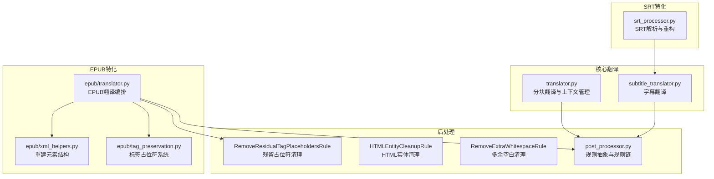
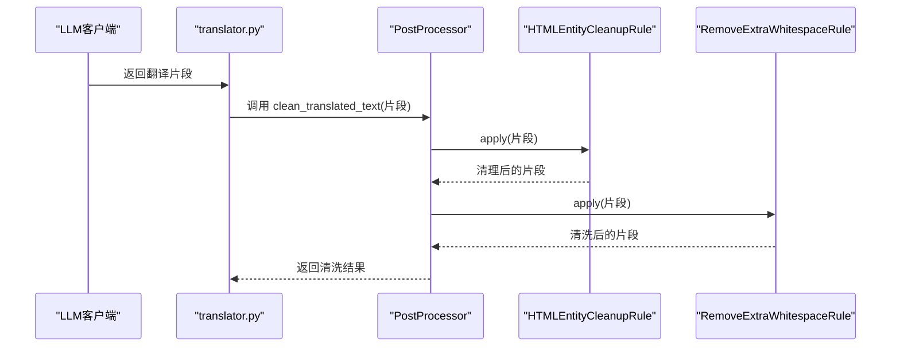
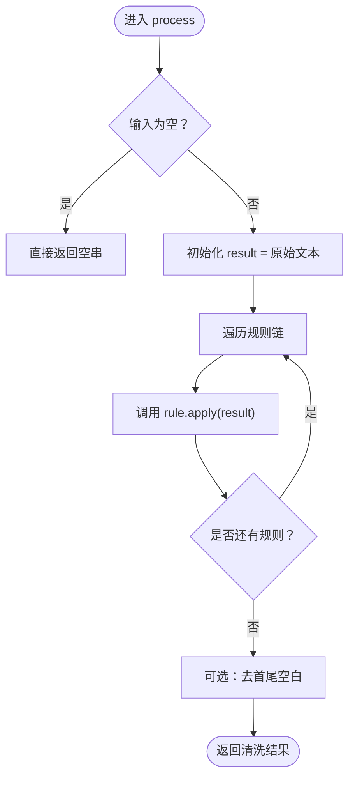
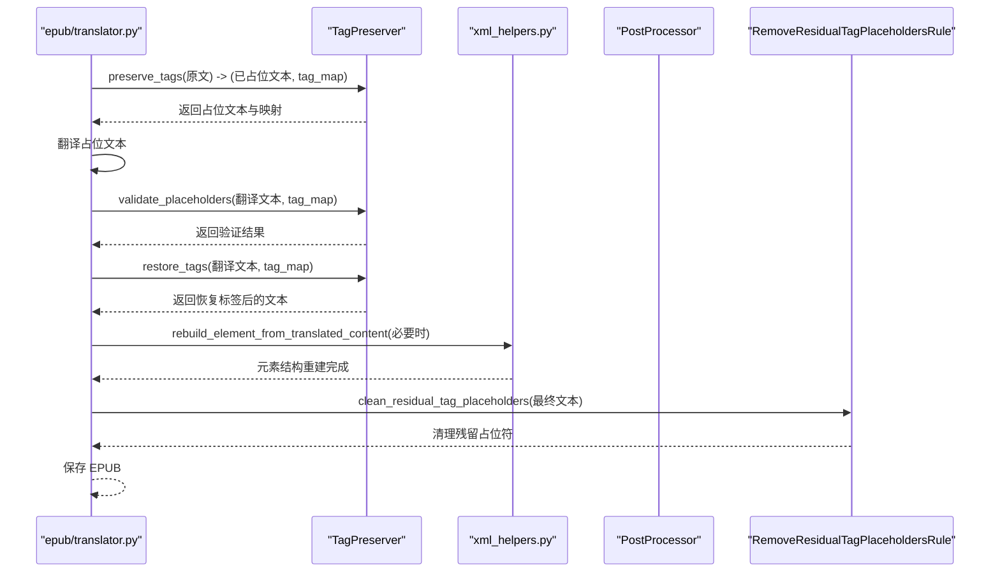
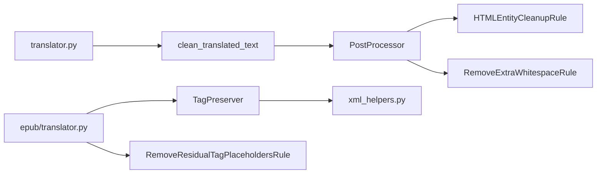

# 后处理

<cite>
**本文引用的文件列表**
- [post_processor.py](file://src/core/post_processor.py)
- [translator.py](file://src/core/translator.py)
- [subtitle_translator.py](file://src/core/subtitle_translator.py)
- [srt_processor.py](file://src/core/srt_processor.py)
- [translator.py（EPUB）](file://src/core/epub/translator.py)
- [tag_preservation.py](file://src/core/epub/tag_preservation.py)
- [xml_helpers.py](file://src/core/epub/xml_helpers.py)
</cite>

## 目录
1. [简介](#简介)
2. [项目结构](#项目结构)
3. [核心组件](#核心组件)
4. [架构总览](#架构总览)
5. [详细组件分析](#详细组件分析)
6. [依赖关系分析](#依赖关系分析)
7. [性能考量](#性能考量)
8. [故障排查指南](#故障排查指南)
9. [结论](#结论)
10. [附录：自定义规则开发指南](#附录自定义规则开发指南)

## 简介
本文件系统性解析后处理器（PostProcessor）在翻译质量保障中的作用，重点阐述其基于“规则链”的设计模式，如何通过 HTMLEntityCleanupRule、RemoveExtraWhitespaceRule 等规则对 LLM 输出进行清洗与标准化；解释 add_rule、remove_rule 等扩展能力，以及 process 方法如何按序应用所有规则；并结合 SRT 与 EPUB 格式的特殊需求，说明后处理器如何修复格式错误、清理残留标签并确保输出质量。最后分析该模块与核心翻译流程的集成点与执行时机。

## 项目结构
后处理器位于核心模块中，作为通用文本清洗工具，服务于多种文件类型的翻译流程：
- 文本翻译：在分块翻译完成后，统一调用后处理清洗。
- 字幕翻译：在生成字幕块翻译后，可选择启用后处理清洗。
- EPUB 翻译：在标签恢复与写回阶段，使用专用清理函数去除残留占位符。

图表来源
- [post_processor.py](file://src/core/post_processor.py#L1-L212)
- [translator.py](file://src/core/translator.py#L321-L344)
- [subtitle_translator.py](file://src/core/subtitle_translator.py#L1-L345)
- [srt_processor.py](file://src/core/srt_processor.py#L1-L236)
- [translator.py（EPUB）](file://src/core/epub/translator.py#L674-L730)
- [tag_preservation.py](file://src/core/epub/tag_preservation.py#L1-L155)
- [xml_helpers.py](file://src/core/epub/xml_helpers.py#L208-L247)

章节来源
- [post_processor.py](file://src/core/post_processor.py#L1-L212)
- [translator.py](file://src/core/translator.py#L321-L344)
- [subtitle_translator.py](file://src/core/subtitle_translator.py#L1-L345)
- [srt_processor.py](file://src/core/srt_processor.py#L1-L236)
- [translator.py（EPUB）](file://src/core/epub/translator.py#L674-L730)
- [tag_preservation.py](file://src/core/epub/tag_preservation.py#L1-L155)
- [xml_helpers.py](file://src/core/epub/xml_helpers.py#L208-L247)

## 核心组件
- 规则抽象与规则链
  - 抽象基类 PostProcessingRule 定义 apply 与 description 接口，确保每条规则职责单一且可组合。
  - PostProcessor 维护规则列表，提供 add_rule、remove_rule、process 等方法，实现“规则链”顺序执行。
- 内置规则
  - HTMLEntityCleanupRule：清理 HTML 实体，如 nbsp、尖括号、引号、省略号等，提升可读性与兼容性。
  - RemoveExtraWhitespaceRule：合并多余空格、修正标点前空格、规整段落换行，保持整洁格式。
  - RemoveResidualTagPlaceholdersRule：清理残留的标签占位符（含多种变异形式），用于最终输出校验。
- 工具函数
  - clean_translated_text：默认实例的便捷入口，按默认规则链清洗文本。
  - clean_residual_tag_placeholders：EPUB 写回前的最终清理步骤。

章节来源
- [post_processor.py](file://src/core/post_processor.py#L11-L212)

## 架构总览
后处理器以“规则链”为核心，贯穿多类翻译场景：
- 文本翻译：在分块翻译完成后统一清洗，保证输出整洁一致。
- 字幕翻译：在字幕块翻译完成后可选启用清洗，避免实体与空白问题影响播放。
- EPUB 翻译：在标签恢复与写回阶段，先进行占位符验证与修复，再使用残留占位符清理函数，确保 XHTML 结构正确、无残留标记。

图表来源
- [translator.py](file://src/core/translator.py#L321-L344)
- [post_processor.py](file://src/core/post_processor.py#L100-L169)

章节来源
- [translator.py](file://src/core/translator.py#L321-L344)
- [post_processor.py](file://src/core/post_processor.py#L100-L169)

## 详细组件分析

### 规则链设计与执行流程
- 设计要点
  - 单一职责：每条规则专注一类清洗任务，便于维护与扩展。
  - 可组合性：规则按添加顺序依次执行，形成“流水线式”清洗。
  - 可配置性：支持动态增删规则，满足不同格式与场景需求。
- 执行流程
  - 初始化默认规则链（HTML 实体清理 + 多余空白清理）。
  - process 按序调用各规则 apply，逐层清洗，返回最终文本。
  - 提供 get_rules 获取当前激活规则清单，便于调试与可视化。

图表来源
- [post_processor.py](file://src/core/post_processor.py#L120-L140)

章节来源
- [post_processor.py](file://src/core/post_processor.py#L100-L169)

### HTML 实体清理规则（HTMLEntityCleanupRule）
- 功能概述
  - 将常见的 HTML 实体替换为对应字符，如 nbsp、尖括号、引号、省略号等，提升可读性与兼容性。
  - 对连续 nbsp 进行特殊处理，还原为不可断行空格。
- 典型效果
  - 将 &nbsp;&nbsp; 替换为不可断行空格序列。
  - 将 &lt;、&gt;、&amp; 等替换为 <、>、&。
  - 将 &quot;、&#39;、&apos; 等替换为 "、'。
  - 将 &mdash;、&ndash;、&hellip; 替换为 —、–、…

章节来源
- [post_processor.py](file://src/core/post_processor.py#L71-L98)

### 多余空白清理规则（RemoveExtraWhitespaceRule）
- 功能概述
  - 合并多个连续空格为单个空格。
  - 移除标点前的多余空格。
  - 规整段落换行，避免三连空行等异常。
  - 最终去除首尾空白。
- 典型效果
  - 清理因标签删除导致的多余空格与换行。
  - 使标点前后间距更规范，提升阅读体验。

章节来源
- [post_processor.py](file://src/core/post_processor.py#L52-L69)

### 残留占位符清理规则（RemoveResidualTagPlaceholdersRule）
- 功能概述
  - 清理残留的标签占位符，包括 Unicode 特殊括号与多种常见变异形式。
  - 针对标签恢复后可能遗留的孤立方括号或占位符进行兜底清理。
- 使用场景
  - EPUB 写回前的最终清理步骤，确保 XHTML 文本不含残留占位符。

章节来源
- [post_processor.py](file://src/core/post_processor.py#L25-L48)

### EPUB 翻译中的后处理集成
- 标签占位符系统（TagPreserver）
  - 在翻译前将 HTML/XML 标签替换为简单占位符，翻译后再恢复，防止 LLM 修改结构。
  - 提供验证与修复机制，检测缺失或变异的占位符并尝试修复。
- 写回阶段的清洗
  - 在保存 EPUB 前，遍历所有元素的 text 与 tail，应用残留占位符清理函数，确保最终输出无残留标记。
- 元素重建
  - 当翻译内容包含内联标签时，使用重建函数将混合内容解析为正确的 XML 结构。

图表来源
- [translator.py（EPUB）](file://src/core/epub/translator.py#L496-L537)
- [translator.py（EPUB）](file://src/core/epub/translator.py#L674-L730)
- [tag_preservation.py](file://src/core/epub/tag_preservation.py#L94-L155)
- [xml_helpers.py](file://src/core/epub/xml_helpers.py#L208-L247)
- [post_processor.py](file://src/core/post_processor.py#L171-L184)

章节来源
- [translator.py（EPUB）](file://src/core/epub/translator.py#L496-L537)
- [translator.py（EPUB）](file://src/core/epub/translator.py#L674-L730)
- [tag_preservation.py](file://src/core/epub/tag_preservation.py#L94-L155)
- [xml_helpers.py](file://src/core/epub/xml_helpers.py#L208-L247)
- [post_processor.py](file://src/core/post_processor.py#L171-L184)

### SRT 翻译中的后处理集成
- 字幕翻译流程
  - 解析 SRT 文件，提取可翻译文本块，生成翻译请求。
  - 在得到翻译结果后，可选启用后处理清洗，确保输出符合字幕格式要求。
- 与 SRT 解析器的协作
  - 通过 SRTProcessor 的解析与重构，保证时间轴与编号信息不被破坏。

章节来源
- [subtitle_translator.py](file://src/core/subtitle_translator.py#L1-L345)
- [srt_processor.py](file://src/core/srt_processor.py#L1-L236)

## 依赖关系分析
- 组件耦合
  - PostProcessor 与具体规则之间为松耦合：通过抽象接口与列表管理，新增规则无需修改现有逻辑。
  - EPUB 翻译模块与标签占位符系统存在强耦合，但后处理仅作为补充清理手段，降低耦合风险。
- 关键依赖链
  - 文本翻译：translator.py -> post_processor.clean_translated_text -> PostProcessor -> 规则链。
  - EPUB 翻译：epub/translator.py -> TagPreserver -> xml_helpers -> PostProcessor.clean_residual_tag_placeholders。
  - 字幕翻译：subtitle_translator.py -> post_processor.clean_translated_text -> PostProcessor -> 规则链。

图表来源
- [translator.py](file://src/core/translator.py#L321-L344)
- [post_processor.py](file://src/core/post_processor.py#L100-L169)
- [translator.py（EPUB）](file://src/core/epub/translator.py#L674-L730)
- [tag_preservation.py](file://src/core/epub/tag_preservation.py#L1-L155)
- [xml_helpers.py](file://src/core/epub/xml_helpers.py#L208-L247)

章节来源
- [translator.py](file://src/core/translator.py#L321-L344)
- [post_processor.py](file://src/core/post_processor.py#L100-L169)
- [translator.py（EPUB）](file://src/core/epub/translator.py#L674-L730)
- [tag_preservation.py](file://src/core/epub/tag_preservation.py#L1-L155)
- [xml_helpers.py](file://src/core/epub/xml_helpers.py#L208-L247)

## 性能考量
- 规则链顺序
  - 默认规则链顺序经过实践验证：先清理实体，再规整空白，有助于减少后续正则匹配成本。
- 正则复杂度
  - 规则内部使用正则替换，整体复杂度与输入长度线性相关；建议在大文本上分块处理，避免一次性处理超长字符串。
- 扩展规则
  - 新增规则应尽量避免重复扫描，优先复用已有规则或合并相似逻辑，减少多次遍历。

[本节为通用指导，不直接分析具体文件]

## 故障排查指南
- 常见问题
  - EPUB 输出仍残留标签占位符：检查是否在保存前调用了残留占位符清理函数。
  - 字幕播放异常：确认是否启用了后处理清洗，避免实体未还原或空白导致的时间轴错乱。
  - 文本格式异常：检查规则链顺序与自定义规则是否覆盖了关键场景。
- 定位方法
  - 开启 verbose 模式查看规则应用顺序与描述。
  - 使用 get_rules 查看当前激活规则，核对是否包含预期规则。
  - 在 EPUB 写回阶段增加日志，定位残留占位符出现位置。

章节来源
- [post_processor.py](file://src/core/post_processor.py#L142-L151)
- [translator.py（EPUB）](file://src/core/epub/translator.py#L674-L730)

## 结论
后处理器通过“规则链”设计，为多类翻译场景提供了统一、可扩展的质量保障机制。默认规则链有效解决了 HTML 实体与多余空白问题；EPUB 场景下配合标签占位符系统与残留占位符清理，确保最终输出结构正确、无残留标记。通过 add_rule/remove_rule，用户可按需扩展规则，满足特定格式与业务需求。

[本节为总结性内容，不直接分析具体文件]

## 附录：自定义规则开发指南
- 接口定义
  - 继承 PostProcessingRule，实现 apply 与 description 两个方法。
  - apply 接收原始文本，返回清洗后的文本。
  - description 返回规则功能简述，便于调试与展示。
- 注册机制
  - 使用 PostProcessor.add_rule 添加自定义规则到规则链末尾。
  - 使用 PostProcessor.remove_rule 按类型移除规则，支持动态调整。
- 开发建议
  - 保持单一职责：每个规则只做一件事，并提供清晰的描述。
  - 注意正则边界：避免误伤非目标内容，必要时先做预处理或限定范围。
  - 可测试性：为规则编写最小化测试用例，覆盖典型输入与边界情况。
- 示例参考
  - 可参考内置规则的实现风格与命名约定，确保一致性。

章节来源
- [post_processor.py](file://src/core/post_processor.py#L11-L212)