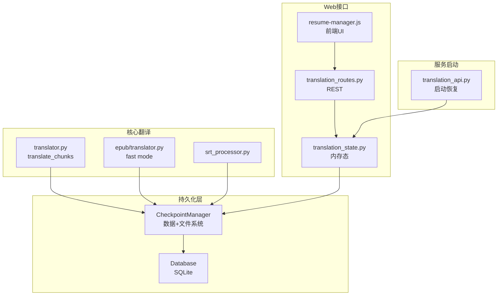
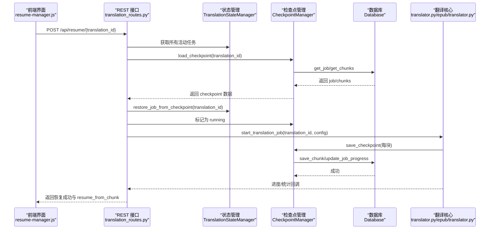
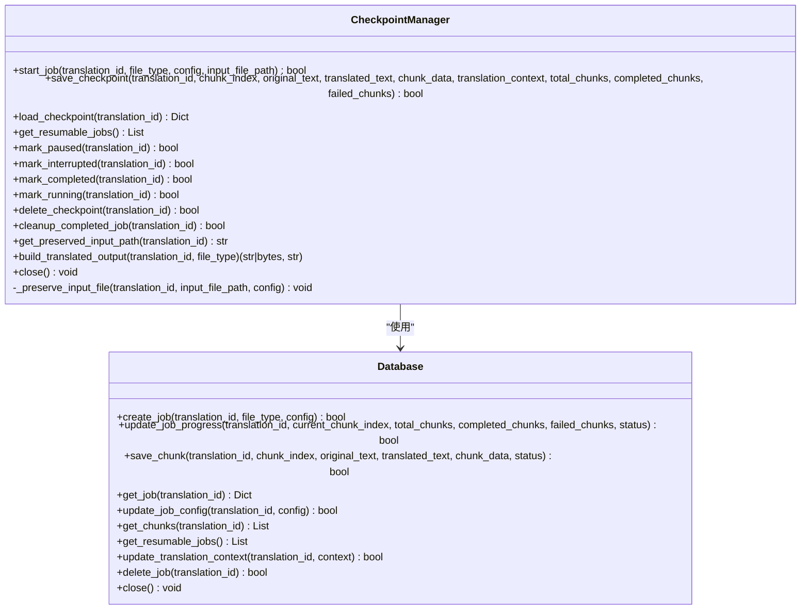
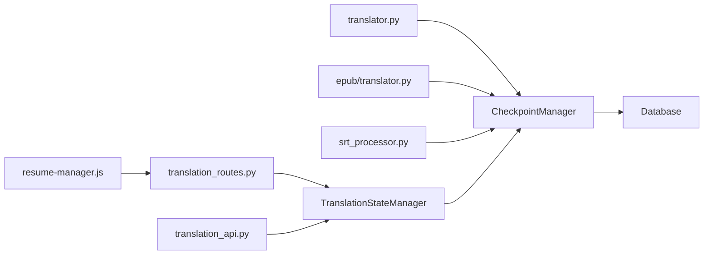
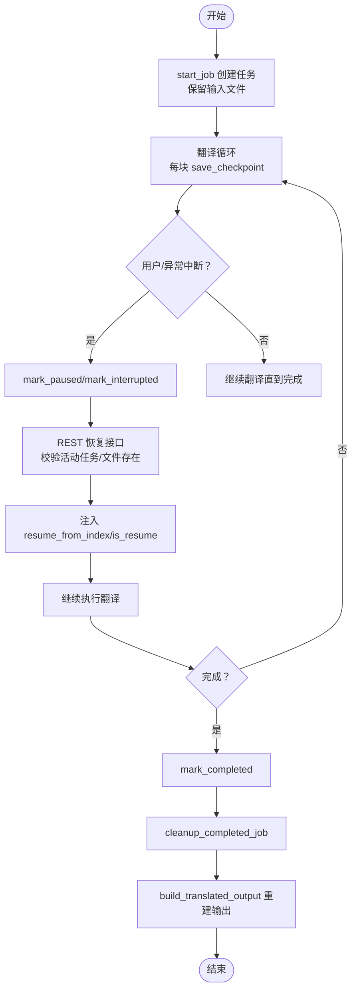

# 断点续传

<cite>
**本文引用的文件**
- [src/persistence/checkpoint_manager.py](file://src/persistence/checkpoint_manager.py)
- [src/persistence/database.py](file://src/persistence/database.py)
- [src/core/translator.py](file://src/core/translator.py)
- [src/core/epub/translator.py](file://src/core/epub/translator.py)
- [src/core/srt_processor.py](file://src/core/srt_processor.py)
- [src/api/translation_state.py](file://src/api/translation_state.py)
- [src/api/blueprints/translation_routes.py](file://src/api/blueprints/translation_routes.py)
- [translation_api.py](file://translation_api.py)
- [src/web/static/js/translation/resume-manager.js](file://src/web/static/js/translation/resume-manager.js)
</cite>

## 目录
1. [简介](#简介)
2. [项目结构](#项目结构)
3. [核心组件](#核心组件)
4. [架构总览](#架构总览)
5. [详细组件分析](#详细组件分析)
6. [依赖关系分析](#依赖关系分析)
7. [性能与存储优化](#性能与存储优化)
8. [故障排查指南](#故障排查指南)
9. [结论](#结论)
10. [附录：断点续传完整生命周期](#附录断点续传完整生命周期)

## 简介
本篇文档深入解析 TranslateBookWithLLM 的断点续传机制，重点围绕 CheckpointManager 类如何通过 SQLite 数据库与本地文件系统协同工作，实现翻译任务状态的持久化与恢复。我们将详细说明 start_job、save_checkpoint、load_checkpoint 等核心方法的实现逻辑，解释 mark_paused、mark_interrupted、mark_completed、mark_running 等状态标记的作用，并展示 build_translated_output 如何从已保存的块中重建最终输出文件（支持 txt、srt、epub）。最后给出优化检查点频率与存储效率的建议，并说明如何处理 EPUB、SRT 等复杂格式的重建过程。

## 项目结构
断点续传相关的关键模块分布如下：
- 持久化层：CheckpointManager（数据库 + 文件系统）
- 数据库层：Database（SQLite 表结构、CRUD、索引）
- 核心翻译流程：translator.py（文本/SRT/EPUB通用翻译循环）
- EPUB 快速模式：epub/translator.py（fast mode 下的纯文本抽取与重建）
- SRT 处理器：srt_processor.py（SRT 解析、重建）
- Web 层：translation_state.py（内存态管理）、translation_routes.py（REST 接口）、resume-manager.js（前端列表与恢复交互）
- 启动与恢复：translation_api.py（服务启动时自动恢复未完成任务）

图表来源
- [src/persistence/checkpoint_manager.py](file://src/persistence/checkpoint_manager.py#L1-L120)
- [src/persistence/database.py](file://src/persistence/database.py#L48-L120)
- [src/core/translator.py](file://src/core/translator.py#L123-L371)
- [src/core/epub/translator.py](file://src/core/epub/translator.py#L732-L800)
- [src/core/srt_processor.py](file://src/core/srt_processor.py#L1-L120)
- [src/api/translation_state.py](file://src/api/translation_state.py#L1-L120)
- [src/api/blueprints/translation_routes.py](file://src/api/blueprints/translation_routes.py#L150-L247)
- [translation_api.py](file://translation_api.py#L90-L122)

章节来源
- [src/persistence/checkpoint_manager.py](file://src/persistence/checkpoint_manager.py#L1-L120)
- [src/persistence/database.py](file://src/persistence/database.py#L48-L120)
- [src/api/translation_state.py](file://src/api/translation_state.py#L1-L120)
- [translation_api.py](file://translation_api.py#L90-L122)

## 核心组件
- CheckpointManager：负责任务开始、检查点保存、加载、状态标记、清理、输入文件保留、输出重建等。
- Database：封装 SQLite 表结构（translation_jobs、checkpoint_chunks），提供线程安全的 CRUD 与索引。
- TranslationStateManager：在内存中维护任务状态，桥接数据库与 Web 前端。
- translator.py：通用翻译循环，支持断点续传参数与上下文恢复。
- epub/translator.py：EPUB 快速模式下的纯文本抽取与重建。
- srt_processor.py：SRT 解析、更新与重建。
- translation_routes.py：REST 接口，提供恢复、删除检查点等操作。
- resume-manager.js：前端展示可恢复任务、触发恢复与删除。

章节来源
- [src/persistence/checkpoint_manager.py](file://src/persistence/checkpoint_manager.py#L1-L220)
- [src/persistence/database.py](file://src/persistence/database.py#L145-L219)
- [src/api/translation_state.py](file://src/api/translation_state.py#L148-L225)
- [src/core/translator.py](file://src/core/translator.py#L123-L371)
- [src/core/epub/translator.py](file://src/core/epub/translator.py#L732-L800)
- [src/core/srt_processor.py](file://src/core/srt_processor.py#L1-L120)
- [src/api/blueprints/translation_routes.py](file://src/api/blueprints/translation_routes.py#L150-L247)
- [src/web/static/js/translation/resume-manager.js](file://src/web/static/js/translation/resume-manager.js#L1-L120)

## 架构总览
断点续传的整体流程：
- 任务开始：start_job 将输入文件复制到 data/uploads 并写入 translation_jobs；随后 translate_chunks/EPUB/SRT 流程按块推进。
- 检查点保存：save_checkpoint 将每个块的原始文本、翻译结果、元数据、统计信息写入 checkpoint_chunks，并更新 translation_jobs 的 progress 与 translation_context。
- 恢复流程：REST 接口加载 checkpoint，校验 preserved_input_path 是否存在，设置 resume_from_index，调用 start_translation_job 继续执行。
- 输出重建：build_translated_output 根据 file_type 从已保存块重建最终输出（txt 直接拼接；srt 读取原文件结构并合并翻译；epub fast mode 重新生成 EPUB）。

图表来源
- [src/api/blueprints/translation_routes.py](file://src/api/blueprints/translation_routes.py#L153-L247)
- [src/api/translation_state.py](file://src/api/translation_state.py#L148-L225)
- [src/persistence/checkpoint_manager.py](file://src/persistence/checkpoint_manager.py#L120-L206)
- [src/persistence/database.py](file://src/persistence/database.py#L220-L334)
- [src/core/translator.py](file://src/core/translator.py#L123-L371)
- [src/core/epub/translator.py](file://src/core/epub/translator.py#L732-L800)

## 详细组件分析

### CheckpointManager 类
- 职责
  - 任务开始：start_job 调用 _preserve_input_file 保留输入文件路径到配置，再创建 job 记录。
  - 检查点保存：save_checkpoint 写入 checkpoint_chunks，更新 job progress 与 translation_context。
  - 加载检查点：load_checkpoint 读取 job、chunks、计算 resume_from_index，并返回 translation_context。
  - 状态标记：mark_paused/mark_interrupted/mark_completed/mark_running 更新 job 状态与时间戳。
  - 清理：delete_checkpoint 删除数据库记录与上传目录；cleanup_completed_job 自动清理已完成任务。
  - 输入文件保留：_preserve_input_file 将临时上传文件复制到 data/uploads/{translation_id}/，并更新 config.preserved_input_path。
  - 输出重建：build_translated_output 支持 txt、srt、epub（fast mode）三种类型。
- 关键实现要点
  - 数据库存储：translation_jobs 存储配置、进度、状态、上下文；checkpoint_chunks 存储每个块的原文、译文、元数据与状态。
  - 恢复点计算：resume_from_index = progress.current_chunk_index + 1。
  - 上下文连续性：translation_context 用于 LLM 上下文延续，避免重复信息。
  - EPUB fast mode：重建时使用 epub_metadata、target_language 等配置。

图表来源
- [src/persistence/checkpoint_manager.py](file://src/persistence/checkpoint_manager.py#L1-L220)
- [src/persistence/database.py](file://src/persistence/database.py#L145-L219)

章节来源
- [src/persistence/checkpoint_manager.py](file://src/persistence/checkpoint_manager.py#L1-L220)
- [src/persistence/database.py](file://src/persistence/database.py#L145-L219)

### Database 类（SQLite）
- 表结构
  - translation_jobs：主表，包含 translation_id、status、file_type、config、progress、translation_context、时间戳字段。
  - checkpoint_chunks：子表，按 (translation_id, chunk_index) 主键，外键级联删除。
- 线程安全
  - 使用线程局部连接与重入锁，保证并发访问安全。
- 关键方法
  - create_job：初始化 progress 字段（含 current_chunk_index、total_chunks、completed_chunks、failed_chunks、start_time）。
  - update_job_progress：原子更新 progress 与 updated_at，按需设置 paused_at/completed_at。
  - save_chunk：INSERT OR REPLACE，记录 chunk_data 与状态。
  - get_resumable_jobs：筛选 status in {'paused','interrupted','error'}。
  - update_translation_context：保存 LLM 上下文以保持一致性。

章节来源
- [src/persistence/database.py](file://src/persistence/database.py#L48-L120)
- [src/persistence/database.py](file://src/persistence/database.py#L145-L219)
- [src/persistence/database.py](file://src/persistence/database.py#L220-L334)
- [src/persistence/database.py](file://src/persistence/database.py#L334-L406)
- [src/persistence/database.py](file://src/persistence/database.py#L407-L438)
- [src/persistence/database.py](file://src/persistence/database.py#L439-L464)
- [src/persistence/database.py](file://src/persistence/database.py#L465-L470)

### 翻译核心（translator.py）
- translate_chunks
  - 支持 resume_from_index 参数，从断点处继续。
  - 加载 checkpoint，恢复已完成/失败块与 translation_context。
  - 每块翻译后调用 save_checkpoint，更新统计与上下文。
  - 用户中断时调用 mark_paused。
- generate_translation_request：构造提示词、调用 LLM、清洗输出、记录日志。

章节来源
- [src/core/translator.py](file://src/core/translator.py#L123-L371)

### EPUB 快速模式（epub/translator.py）
- fast mode：提取纯文本、翻译字符串、重建 EPUB。
- 在 fast mode 中，会将 epub_metadata、epub_fast_mode、target_language 写入 job 配置，供后续重建使用。

章节来源
- [src/core/epub/translator.py](file://src/core/epub/translator.py#L732-L800)

### SRT 处理器（srt_processor.py）
- parse_srt：解析字幕块（编号、时间轴、文本）。
- update_translated_subtitles：根据块索引映射更新文本。
- reconstruct_srt：按原结构重建 SRT 文本。

章节来源
- [src/core/srt_processor.py](file://src/core/srt_processor.py#L1-L120)
- [src/core/srt_processor.py](file://src/core/srt_processor.py#L120-L236)

### Web 状态与接口（translation_state.py、translation_routes.py）
- TranslationStateManager
  - restore_job_from_checkpoint：将数据库中的 job/chunks 恢复到内存态，设置 resume_from_index。
  - get_resumable_jobs：委托 CheckpointManager。
- REST 接口
  - /api/resume/{translation_id}：校验无活动任务、加载 checkpoint、校验 preserved_input_path、注入 resume_from_index 与 is_resume、标记 running、启动翻译。
  - /api/checkpoint/{translation_id}：删除检查点。

章节来源
- [src/api/translation_state.py](file://src/api/translation_state.py#L148-L225)
- [src/api/blueprints/translation_routes.py](file://src/api/blueprints/translation_routes.py#L153-L247)

### 前端恢复管理（resume-manager.js）
- 列出可恢复任务，显示进度百分比、创建/暂停时间。
- 触发恢复或删除检查点，错误时提示冲突的活动任务。

章节来源
- [src/web/static/js/translation/resume-manager.js](file://src/web/static/js/translation/resume-manager.js#L1-L120)
- [src/web/static/js/translation/resume-manager.js](file://src/web/static/js/translation/resume-manager.js#L180-L260)
- [src/web/static/js/translation/resume-manager.js](file://src/web/static/js/translation/resume-manager.js#L280-L320)

## 依赖关系分析
- CheckpointManager 依赖 Database 提供的数据持久化能力。
- TranslationStateManager 在内存中维护任务状态，桥接数据库与 Web 前端。
- REST 接口在恢复前进行活动任务冲突检测，确保同一时刻只有一个翻译任务运行。
- 翻译核心在每次块完成后调用 save_checkpoint，形成细粒度的断点。
- EPUB/SRT 的输出重建依赖 preserved_input_path 或配置中的元数据。

图表来源
- [src/persistence/checkpoint_manager.py](file://src/persistence/checkpoint_manager.py#L1-L120)
- [src/persistence/database.py](file://src/persistence/database.py#L48-L120)
- [src/api/translation_state.py](file://src/api/translation_state.py#L148-L225)
- [src/api/blueprints/translation_routes.py](file://src/api/blueprints/translation_routes.py#L153-L247)
- [src/web/static/js/translation/resume-manager.js](file://src/web/static/js/translation/resume-manager.js#L1-L120)
- [translation_api.py](file://translation_api.py#L90-L122)

## 性能与存储优化
- 检查点频率
  - 当前实现为“每块保存一次”，可按业务需求调整为“每 N 块保存一次”以减少数据库写入压力；但需权衡恢复粒度。
- 存储策略
  - 仅保留必要的 chunk_data，避免冗余元数据；对于 EPUB/SRT，优先保存索引映射而非完整结构。
  - 对于大文件，考虑分片存储或压缩 chunk_data。
- 数据库优化
  - 已有索引 idx_jobs_status、idx_chunks_translation，可进一步评估是否需要复合索引。
  - 批量写入（如事务包裹）可提升 save_checkpoint 的吞吐。
- 上下文连续性
  - translation_context 仅保存最近片段，避免过大 JSON；必要时可限制长度或采用滚动窗口。
- EPUB/SRT 重建
  - SRT 重建依赖 preserved_input_path 与解析结构；若原文件缺失，无法重建，应提前校验。
  - EPUB fast mode 重建依赖 epub_metadata 与 target_language，确保配置正确写入。

[本节为通用建议，无需特定文件引用]

## 故障排查指南
- 恢复时报错“无检查点”
  - 可能原因：数据库中不存在该 translation_id 的 job 或 chunks。
  - 处理：确认 translation_id 正确，或删除检查点后重新开始。
- 恢复时报错“保留的输入文件不存在”
  - 可能原因：web 界面上传的临时文件已被清理，或 preserved_input_path 指向的文件被移动/删除。
  - 处理：重新上传源文件，或删除检查点后重新开始。
- 恢复时报错“有活动翻译在运行”
  - 可能原因：REST 接口检测到当前已有 running/queued 任务。
  - 处理：等待当前任务结束或中断后再恢复。
- EPUB 标签丢失/错位
  - 可能原因：标准模式下标签保留与重建较为复杂，小模型易出现占位符缺失。
  - 处理：启用 fast mode，或升级模型；必要时手动修复。
- SRT 重建失败
  - 可能原因：缺少 preserved_input_path 或 chunk_data 中的 block_translations 不完整。
  - 处理：确保翻译过程中正确收集块索引映射；必要时重新翻译。

章节来源
- [src/api/blueprints/translation_routes.py](file://src/api/blueprints/translation_routes.py#L153-L247)
- [src/persistence/checkpoint_manager.py](file://src/persistence/checkpoint_manager.py#L348-L524)
- [src/core/srt_processor.py](file://src/core/srt_processor.py#L1-L120)

## 结论
本项目通过 CheckpointManager 与 Database 的紧密协作，实现了细粒度的断点续传：每个翻译块都会被持久化，恢复时可从上一个完成块的下一个位置继续，并恢复 LLM 上下文以保证一致性。Web 端提供可恢复任务列表与一键恢复功能，CLI 端同样支持断点续传。针对 EPUB/SRT 等复杂格式，提供了快速模式与结构重建能力。通过合理调整检查点频率与优化存储策略，可在可靠性与性能之间取得平衡。

[本节为总结，无需特定文件引用]

## 附录：断点续传完整生命周期

### 生命周期步骤
1. 任务创建
   - start_job：保留输入文件（若需要）、创建 job 记录。
   - translate_chunks/EPUB/SRT：按块推进，每块翻译后调用 save_checkpoint。
2. 进程中断
   - 用户中断：translate_chunks 中断时调用 mark_paused。
   - 异常中断：Database.update_job_progress(status='interrupted')。
3. 恢复
   - REST 接口 /api/resume/{translation_id}：校验活动任务、加载 checkpoint、校验 preserved_input_path、注入 resume_from_index 与 is_resume、标记 running、启动翻译。
   - 前端 resume-manager.js：列出可恢复任务，触发恢复或删除。
4. 完成与清理
   - mark_completed：完成时标记状态。
   - cleanup_completed_job：自动清理已完成任务的数据库与上传目录。
5. 输出重建
   - build_translated_output：根据 file_type 从已保存块重建最终输出。

图表来源
- [src/persistence/checkpoint_manager.py](file://src/persistence/checkpoint_manager.py#L1-L120)
- [src/persistence/checkpoint_manager.py](file://src/persistence/checkpoint_manager.py#L120-L206)
- [src/persistence/checkpoint_manager.py](file://src/persistence/checkpoint_manager.py#L348-L524)
- [src/api/blueprints/translation_routes.py](file://src/api/blueprints/translation_routes.py#L153-L247)
- [src/core/translator.py](file://src/core/translator.py#L123-L371)
- [translation_api.py](file://translation_api.py#L90-L122)

### 关键方法与职责对照
- start_job
  - 作用：保留输入文件、创建 job 记录。
  - 位置参考：[src/persistence/checkpoint_manager.py](file://src/persistence/checkpoint_manager.py#L29-L56)
- save_checkpoint
  - 作用：保存块、更新进度、更新上下文。
  - 位置参考：[src/persistence/checkpoint_manager.py](file://src/persistence/checkpoint_manager.py#L120-L174)
- load_checkpoint
  - 作用：读取 job/chunks，计算 resume_from_index。
  - 位置参考：[src/persistence/checkpoint_manager.py](file://src/persistence/checkpoint_manager.py#L175-L206)
- mark_paused/mark_interrupted/mark_completed/mark_running
  - 作用：更新 job 状态与时间戳。
  - 位置参考：[src/persistence/checkpoint_manager.py](file://src/persistence/checkpoint_manager.py#L243-L290)
- build_translated_output
  - 作用：按类型重建输出（txt/srt/epub fast）。
  - 位置参考：[src/persistence/checkpoint_manager.py](file://src/persistence/checkpoint_manager.py#L348-L524)

章节来源
- [src/persistence/checkpoint_manager.py](file://src/persistence/checkpoint_manager.py#L29-L56)
- [src/persistence/checkpoint_manager.py](file://src/persistence/checkpoint_manager.py#L120-L174)
- [src/persistence/checkpoint_manager.py](file://src/persistence/checkpoint_manager.py#L175-L206)
- [src/persistence/checkpoint_manager.py](file://src/persistence/checkpoint_manager.py#L243-L290)
- [src/persistence/checkpoint_manager.py](file://src/persistence/checkpoint_manager.py#L348-L524)