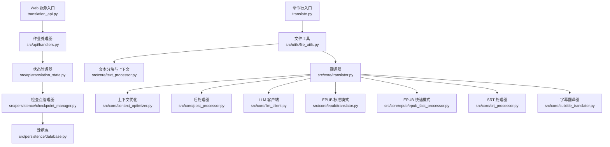
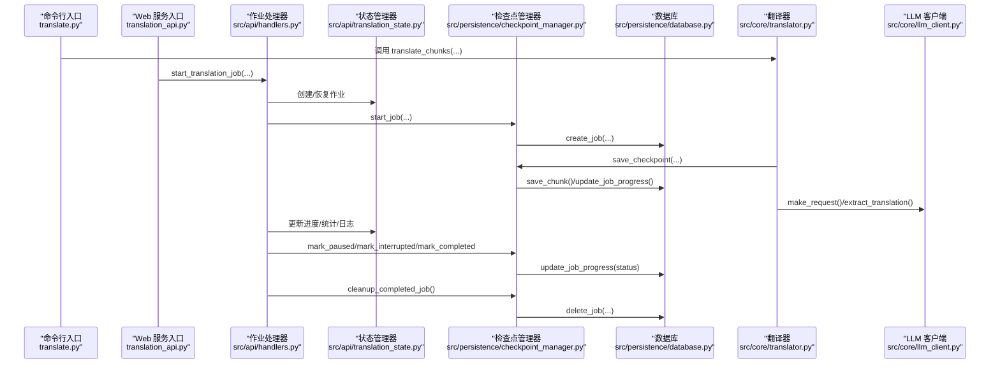
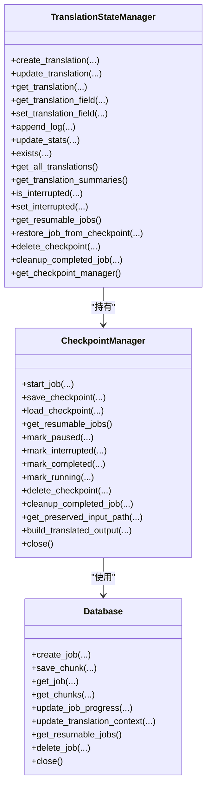
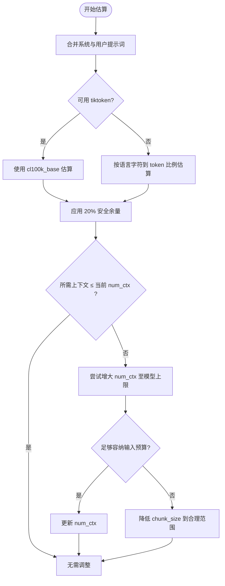
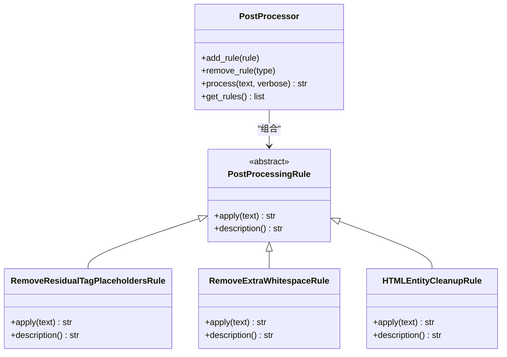
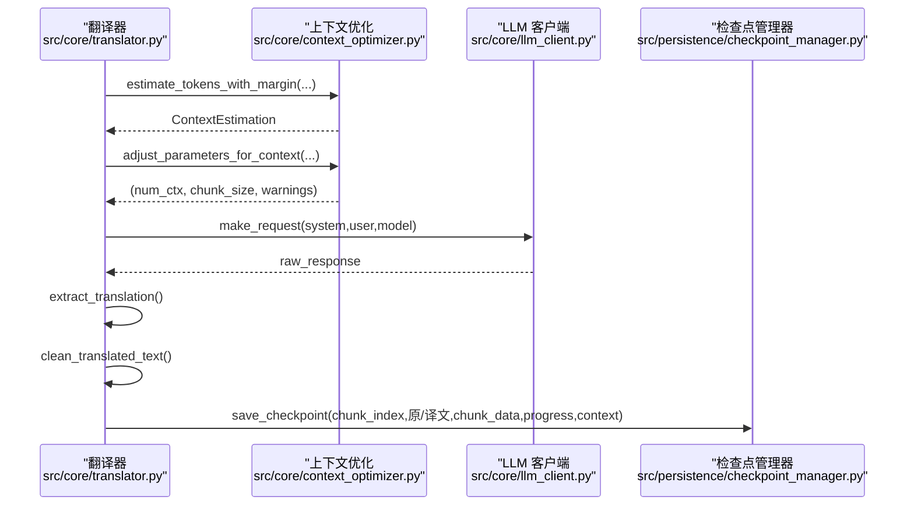
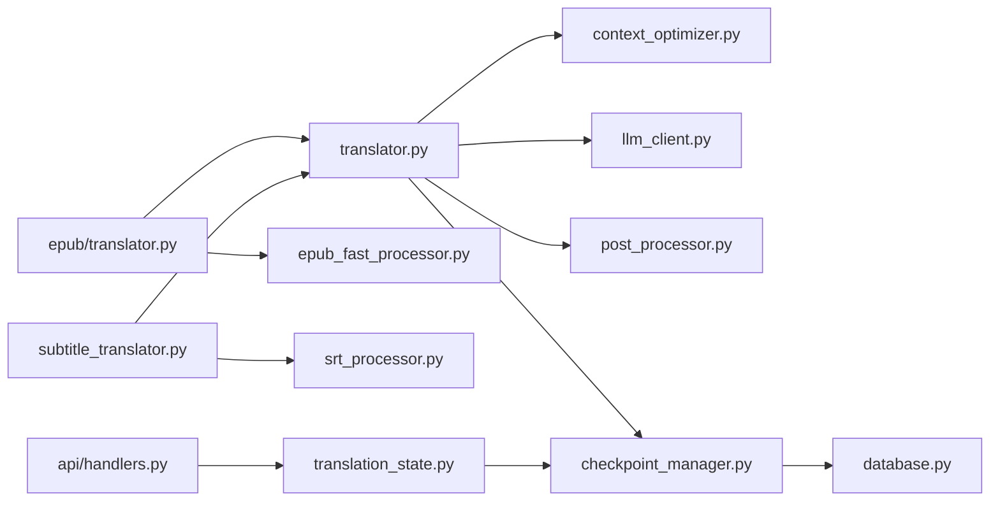

# 核心功能详解

<cite>
**本文引用的文件**
- [translate.py](file://translate.py)
- [translation_api.py](file://translation_api.py)
- [src/persistence/checkpoint_manager.py](file://src/persistence/checkpoint_manager.py)
- [src/persistence/database.py](file://src/persistence/database.py)
- [src/api/translation_state.py](file://src/api/translation_state.py)
- [src/api/handlers.py](file://src/api/handlers.py)
- [src/core/context_optimizer.py](file://src/core/context_optimizer.py)
- [src/core/post_processor.py](file://src/core/post_processor.py)
- [src/core/translator.py](file://src/core/translator.py)
- [src/core/text_processor.py](file://src/core/text_processor.py)
- [src/core/llm_client.py](file://src/core/llm_client.py)
- [src/utils/file_utils.py](file://src/utils/file_utils.py)
- [src/core/epub/translator.py](file://src/core/epub/translator.py)
- [src/core/epub/epub_fast_processor.py](file://src/core/epub/epub_fast_processor.py)
- [src/core/srt_processor.py](file://src/core/srt_processor.py)
- [src/core/subtitle_translator.py](file://src/core/subtitle_translator.py)
- [src/config.py](file://src/config.py)
</cite>

## 目录
1. [引言](#引言)
2. [项目结构](#项目结构)
3. [核心组件](#核心组件)
4. [架构总览](#架构总览)
5. [详细组件分析](#详细组件分析)
6. [依赖关系分析](#依赖关系分析)
7. [性能考量](#性能考量)
8. [故障排查指南](#故障排查指南)
9. [结论](#结论)
10. [附录：高级调优建议](#附录高级调优建议)

## 引言
本文件聚焦 TranslateBookWithLLM 的核心功能与实现细节，围绕以下关键主题展开：
- 断点续传机制：checkpoint_manager 如何序列化与恢复翻译状态，保障长时间任务的可靠性
- 上下文优化：context_optimizer 如何估计与调整上下文窗口，提升翻译一致性与稳定性
- 后处理器：post_processor 在清理 LLM 输出、修复格式错误方面的职责与策略
- 大文件分块翻译：文本、EPUB、SRT 的分块策略与拼接逻辑
- 协同工作机制：上述模块如何配合，形成高质量的翻译体验

## 项目结构
系统采用“分层+功能域”的组织方式：
- 命令行入口与 Web 入口分别位于顶层脚本与 API 蓝图
- 翻译核心位于 src/core，包含上下文优化、LLM 客户端、翻译器、文本处理、EPUB/SRT 处理等
- 持久化位于 src/persistence，负责数据库与检查点管理
- 工具与配置位于 src/utils 与 src/config
- Web 界面前端资源位于 src/web

图表来源
- [translate.py](file://translate.py#L1-L147)
- [translation_api.py](file://translation_api.py#L1-L146)
- [src/utils/file_utils.py](file://src/utils/file_utils.py#L1-L405)
- [src/api/handlers.py](file://src/api/handlers.py#L1-L452)
- [src/api/translation_state.py](file://src/api/translation_state.py#L1-L225)
- [src/persistence/checkpoint_manager.py](file://src/persistence/checkpoint_manager.py#L1-L528)
- [src/persistence/database.py](file://src/persistence/database.py#L1-L470)
- [src/core/text_processor.py](file://src/core/text_processor.py#L1-L174)
- [src/core/translator.py](file://src/core/translator.py#L1-L371)
- [src/core/context_optimizer.py](file://src/core/context_optimizer.py#L1-L321)
- [src/core/post_processor.py](file://src/core/post_processor.py#L1-L212)
- [src/core/llm_client.py](file://src/core/llm_client.py#L1-L123)
- [src/core/epub/translator.py](file://src/core/epub/translator.py#L1-L800)
- [src/core/epub/epub_fast_processor.py](file://src/core/epub/epub_fast_processor.py#L1-L800)
- [src/core/srt_processor.py](file://src/core/srt_processor.py#L1-L236)
- [src/core/subtitle_translator.py](file://src/core/subtitle_translator.py#L1-L488)

章节来源
- [translate.py](file://translate.py#L1-L147)
- [translation_api.py](file://translation_api.py#L1-L146)

## 核心组件
- 检查点管理器（CheckpointManager）：负责作业创建、进度更新、断点保存与恢复、完成清理、以及按文件类型重建输出
- 数据库（Database）：SQLite 存储作业元数据、分块结果、翻译上下文
- 状态管理器（TranslationStateManager）：内存态与持久态之间的桥梁，支持恢复、删除检查点、自动清理
- 上下文优化（ContextOptimizer）：基于提示词长度估算与模型族最大上下文，动态调整 num_ctx 与 chunk_size
- 翻译器（Translator）：统一的文本翻译流程，支持断点续传、上下文累积、后处理、LLM 请求与统计
- 文本处理器（TextProcessor）：按句边界切分，保留前后文，生成结构化分块
- 后处理器（PostProcessor）：清理残留占位符、HTML 实体、多余空白等
- LLM 客户端（LLMClient）：抽象不同提供商的请求与提取逻辑
- EPUB/SRT 处理器：标准模式与快速模式的 EPUB 翻译；SRT 分块翻译与重建

章节来源
- [src/persistence/checkpoint_manager.py](file://src/persistence/checkpoint_manager.py#L1-L528)
- [src/persistence/database.py](file://src/persistence/database.py#L1-L470)
- [src/api/translation_state.py](file://src/api/translation_state.py#L1-L225)
- [src/core/context_optimizer.py](file://src/core/context_optimizer.py#L1-L321)
- [src/core/translator.py](file://src/core/translator.py#L1-L371)
- [src/core/text_processor.py](file://src/core/text_processor.py#L1-L174)
- [src/core/post_processor.py](file://src/core/post_processor.py#L1-L212)
- [src/core/llm_client.py](file://src/core/llm_client.py#L1-L123)
- [src/core/epub/translator.py](file://src/core/epub/translator.py#L1-L800)
- [src/core/epub/epub_fast_processor.py](file://src/core/epub/epub_fast_processor.py#L1-L800)
- [src/core/srt_processor.py](file://src/core/srt_processor.py#L1-L236)
- [src/core/subtitle_translator.py](file://src/core/subtitle_translator.py#L1-L488)

## 架构总览
系统通过“状态管理器 + 检查点管理器 + 数据库”的组合，实现跨进程、跨会话的可靠断点续传。翻译主流程在 CLI 与 Web 中复用同一套核心模块，文件类型由工具层根据扩展名自动选择。

图表来源
- [translate.py](file://translate.py#L1-L147)
- [translation_api.py](file://translation_api.py#L1-L146)
- [src/api/handlers.py](file://src/api/handlers.py#L1-L452)
- [src/api/translation_state.py](file://src/api/translation_state.py#L1-L225)
- [src/persistence/checkpoint_manager.py](file://src/persistence/checkpoint_manager.py#L1-L528)
- [src/persistence/database.py](file://src/persistence/database.py#L1-L470)
- [src/core/translator.py](file://src/core/translator.py#L1-L371)
- [src/core/llm_client.py](file://src/core/llm_client.py#L1-L123)

## 详细组件分析

### 断点续传机制：CheckpointManager 与 Database
- 作业生命周期
  - start_job：创建作业记录，必要时复制上传源文件到 data/uploads/<translation_id>/ 以支持恢复
  - save_checkpoint：保存单个分块、更新进度、可选保存翻译上下文
  - load_checkpoint：加载作业元数据、已完成分块、计算恢复起点
  - get_resumable_jobs：列出可恢复作业并补充进度百分比与文件名信息
  - mark_paused/interrupted/completed/running：更新作业状态
  - delete_checkpoint/cleanup_completed_job：清理作业与上传目录
  - build_translated_output：按文件类型重建最终产物
- 数据库存储
  - translation_jobs：作业元数据、配置、进度、状态、翻译上下文
  - checkpoint_chunks：分块原文、译文、状态、附加数据、时间戳
  - 线程安全：使用线程局部连接与锁，保证并发安全
- Web 恢复
  - 启动时扫描数据库，将可恢复作业恢复到内存态，等待用户操作

图表来源
- [src/persistence/database.py](file://src/persistence/database.py#L1-L470)
- [src/persistence/checkpoint_manager.py](file://src/persistence/checkpoint_manager.py#L1-L528)
- [src/api/translation_state.py](file://src/api/translation_state.py#L1-L225)

章节来源
- [src/persistence/checkpoint_manager.py](file://src/persistence/checkpoint_manager.py#L1-L528)
- [src/persistence/database.py](file://src/persistence/database.py#L1-L470)
- [src/api/translation_state.py](file://src/api/translation_state.py#L1-L225)
- [translation_api.py](file://translation_api.py#L1-L146)

### 上下文优化：ContextOptimizer
- 令牌估算
  - 优先使用 tiktoken 进行更准确的估算；不可用时按语言字符到 token 比例进行估算
  - 应用 20% 安全余量，避免超出模型上下文
- 最优分块大小
  - 基于模型最大上下文、输出预算、每行 token 预估，计算最优 chunk_size 并限制在最小/最大范围内
- 参数调整策略
  - 优先尝试增大 num_ctx 至模型上限；若仍不足，则降低 chunk_size
  - 对 CLI/Web 启动阶段进行配置校验并给出警告与建议
- 日志与可视化
  - 提供格式化的估算信息，便于调试与理解

图表来源
- [src/core/context_optimizer.py](file://src/core/context_optimizer.py#L1-L321)

章节来源
- [src/core/context_optimizer.py](file://src/core/context_optimizer.py#L1-L321)
- [translate.py](file://translate.py#L1-L147)
- [src/api/handlers.py](file://src/api/handlers.py#L1-L452)

### 后处理器：PostProcessor
- 规则体系
  - 清理残留标签占位符（包括特殊 Unicode 方括号与普通方括号）
  - 去除多余空白、修正标点前后空格、压缩多余换行
  - 清洗常见 HTML 实体（如 &nbsp;、&lt;、&gt; 等）
- 扩展性
  - 通过继承抽象基类实现自定义规则
  - 默认实例内置清洗规则，可按需增删

图表来源
- [src/core/post_processor.py](file://src/core/post_processor.py#L1-L212)

章节来源
- [src/core/post_processor.py](file://src/core/post_processor.py#L1-L212)

### 文本分块与上下文管理：TextProcessor
- 句边界对齐
  - 通过句末标点正则，将分块边界对齐至句尾，减少截断带来的语义断裂
- 前后文保留
  - 计算 look_back/look_forward 的上下文行数，确保每个主段落前后有适度上下文
- 结构化输出
  - 返回包含 context_before/main_content/context_after 的字典列表，供翻译器使用

章节来源
- [src/core/text_processor.py](file://src/core/text_processor.py#L1-L174)

### 翻译流程与断点续传：Translator
- 主流程
  - 接收结构化分块，逐块生成提示词，估算令牌并按需调整上下文参数
  - 发送 LLM 请求，提取翻译结果，应用后处理
  - 维护“最近一次成功翻译上下文”，用于后续块的一致性
  - 每块结束后保存检查点，记录完成/失败计数与进度
- 断点续传
  - 支持从指定索引恢复；加载历史分块与上下文，继续推进
  - 用户中断时标记暂停，允许后续恢复
- 统一接口
  - CLI 与 Web 使用相同 translate_chunks，参数差异仅在入口与回调

图表来源
- [src/core/translator.py](file://src/core/translator.py#L1-L371)
- [src/core/context_optimizer.py](file://src/core/context_optimizer.py#L1-L321)
- [src/core/llm_client.py](file://src/core/llm_client.py#L1-L123)
- [src/persistence/checkpoint_manager.py](file://src/persistence/checkpoint_manager.py#L1-L528)

章节来源
- [src/core/translator.py](file://src/core/translator.py#L1-L371)

### 大文件分块翻译与拼接
- 文本文件
  - 读取全文，按句边界切分为结构化分块，逐块翻译后直接拼接
- EPUB 文件
  - 标准模式：抽取可翻译内容，收集翻译作业，逐段翻译，恢复标签，写回 XHTML，重建 EPUB
  - 快速模式：提取纯文本，按固定行数切分，翻译后重建最小 EPUB（无标签问题，兼容性强）
- SRT 字幕
  - 解析为结构化条目，按块大小与字符上限分组，逐块翻译，提取各条目翻译，重建 SRT

章节来源
- [src/utils/file_utils.py](file://src/utils/file_utils.py#L1-L405)
- [src/core/epub/translator.py](file://src/core/epub/translator.py#L1-L800)
- [src/core/epub/epub_fast_processor.py](file://src/core/epub/epub_fast_processor.py#L1-L800)
- [src/core/srt_processor.py](file://src/core/srt_processor.py#L1-L236)
- [src/core/subtitle_translator.py](file://src/core/subtitle_translator.py#L1-L488)

## 依赖关系分析
- 组件耦合
  - Translator 依赖 ContextOptimizer、LLMClient、PostProcessor、CheckpointManager
  - EPUB/SRT 模块依赖 Translator 与各自处理器
  - API 层通过 TranslationStateManager 与 CheckpointManager 协作
- 外部依赖
  - SQLite（持久化）、aiofiles（异步文件 IO）、lxml（EPUB 解析与重建）、tiktoken（可选）
- 循环依赖
  - 未发现循环导入；模块间通过函数/实例传递解耦

图表来源
- [src/core/translator.py](file://src/core/translator.py#L1-L371)
- [src/core/context_optimizer.py](file://src/core/context_optimizer.py#L1-L321)
- [src/core/llm_client.py](file://src/core/llm_client.py#L1-L123)
- [src/core/post_processor.py](file://src/core/post_processor.py#L1-L212)
- [src/persistence/checkpoint_manager.py](file://src/persistence/checkpoint_manager.py#L1-L528)
- [src/api/handlers.py](file://src/api/handlers.py#L1-L452)
- [src/api/translation_state.py](file://src/api/translation_state.py#L1-L225)
- [src/persistence/database.py](file://src/persistence/database.py#L1-L470)
- [src/core/epub/translator.py](file://src/core/epub/translator.py#L1-L800)
- [src/core/epub/epub_fast_processor.py](file://src/core/epub/epub_fast_processor.py#L1-L800)
- [src/core/srt_processor.py](file://src/core/srt_processor.py#L1-L236)
- [src/core/subtitle_translator.py](file://src/core/subtitle_translator.py#L1-L488)

章节来源
- [src/core/translator.py](file://src/core/translator.py#L1-L371)
- [src/api/handlers.py](file://src/api/handlers.py#L1-L452)
- [src/api/translation_state.py](file://src/api/translation_state.py#L1-L225)
- [src/persistence/checkpoint_manager.py](file://src/persistence/checkpoint_manager.py#L1-L528)
- [src/persistence/database.py](file://src/persistence/database.py#L1-L470)

## 性能考量
- 上下文优化
  - 合理设置 MAIN_LINES_PER_CHUNK 与 OLLAMA_NUM_CTX，避免频繁重试与过小的 num_ctx 导致失败
  - 自动调整开启时，尽量使用具备较大上下文的模型
- 分块策略
  - 句边界切分减少截断，提高翻译质量；但过小的 chunk 会增加往返次数
- I/O 与重建
  - EPUB 快速模式绕过复杂标签处理，显著提升稳定性与兼容性
  - SRT 分块大小与字符上限影响 LLM 输入长度，应与上下文优化联动
- 并发与资源
  - 数据库使用线程局部连接与锁，避免竞争；注意磁盘与网络 I/O 成为瓶颈时的限流

[本节为通用指导，不直接分析具体文件]

## 故障排查指南
- 断点续传
  - 若恢复作业缺失或无法恢复，检查 data/jobs.db 是否存在对应记录与分块
  - 确认 preserved_input_path 是否存在，否则快速模式无法重建 EPUB
- 上下文不足
  - 出现“提示过大”或“超出模型容量”警告时，适当增大 num_ctx 或减小 chunk_size
  - 关注日志中的估算信息，确认是否应用了安全余量
- LLM 输出异常
  - 若出现“翻译标签缺失”或“响应中包含输入”，系统会回退并清理原始响应
  - 对 EPUB 标准模式，若占位符缺失，系统会重试并提示启用快速模式
- SRT 翻译
  - 若块内缺少索引，系统会增强提示并重试；仍失败则保留原文
- 文件重建
  - EPUB 快速模式重建失败时，检查临时文件与元数据保存情况
  - SRT 重建失败时，检查原始文件是否存在且格式有效

章节来源
- [src/persistence/checkpoint_manager.py](file://src/persistence/checkpoint_manager.py#L1-L528)
- [src/core/context_optimizer.py](file://src/core/context_optimizer.py#L1-L321)
- [src/core/translator.py](file://src/core/translator.py#L1-L371)
- [src/core/epub/translator.py](file://src/core/epub/translator.py#L1-L800)
- [src/core/srt_processor.py](file://src/core/srt_processor.py#L1-L236)

## 结论
TranslateBookWithLLM 通过“上下文优化 + 断点续传 + 后处理 + 分块翻译”的组合拳，实现了对长文档、EPUB、SRT 的高可靠翻译体验。其关键创新点在于：
- 将“上下文估算与自动调整”嵌入翻译主流程，显著降低失败率
- 以 SQLite + 文件备份为核心的检查点方案，确保长时间任务可恢复
- 针对不同文件类型的分块策略与重建逻辑，兼顾质量与兼容性
- 统一的翻译器与后处理管线，保证输出整洁一致

[本节为总结，不直接分析具体文件]

## 附录：高级调优建议
- 上下文优化
  - 开启 AUTO_ADJUST_CONTEXT，结合 MIN_CHUNK_SIZE/MAX_CHUNK_SIZE 控制分块范围
  - 对小参数模型（≤12B）优先使用快速模式，避免标签问题
- 断点续传
  - 长任务建议启用检查点保存，定期查看 progress 与 failed_chunks
  - 恢复时根据 resume_from_index 选择合适起点，避免重复翻译
- 后处理
  - 如需更强的格式修复，可在 PostProcessor 中添加自定义规则
  - 对 EPUB，建议在保存前执行 clean_residual_tag_placeholders，确保最终文本干净
- 文件类型
  - EPUB：快速模式适合弱模型与严格阅读器；标准模式适合需要保留标签的场景
  - SRT：适当增大 SRT_LINES_PER_BLOCK 与 SRT_MAX_CHARS_PER_BLOCK，平衡上下文与稳定性
- 日志与监控
  - 通过日志回调与 WebSocket 推送，实时掌握翻译进度与错误详情

章节来源
- [src/config.py](file://src/config.py#L1-L225)
- [src/core/post_processor.py](file://src/core/post_processor.py#L1-L212)
- [src/core/epub/translator.py](file://src/core/epub/translator.py#L1-L800)
- [src/core/srt_processor.py](file://src/core/srt_processor.py#L1-L236)
- [src/api/handlers.py](file://src/api/handlers.py#L1-L452)