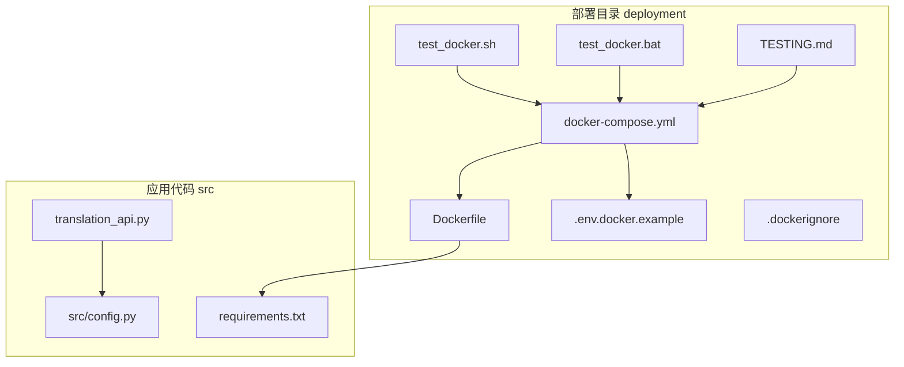
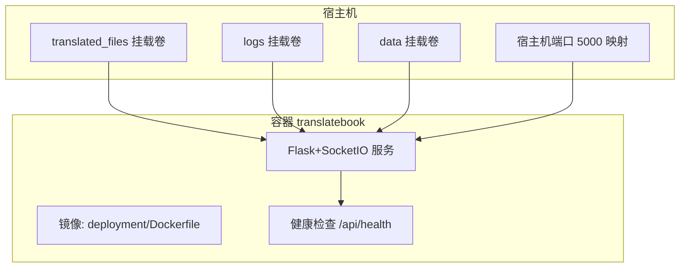
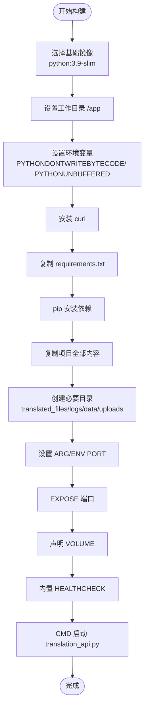
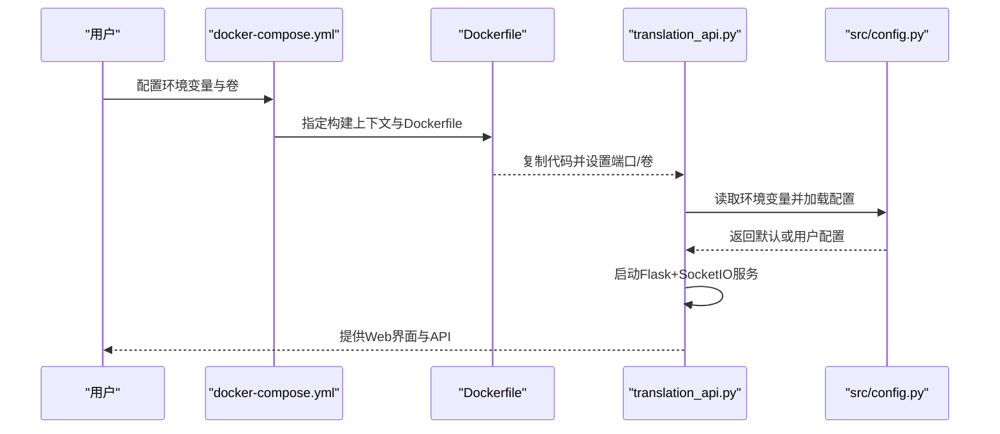
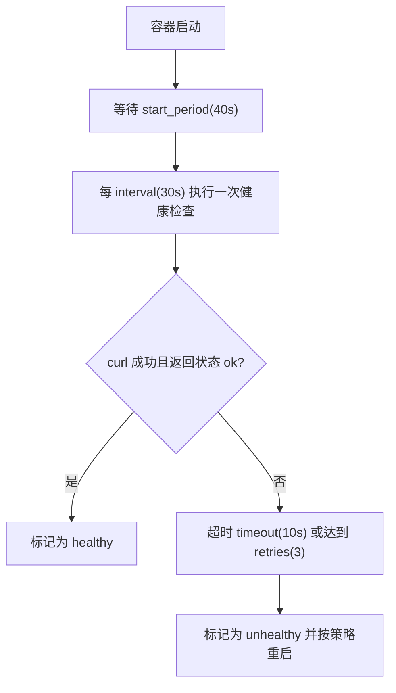
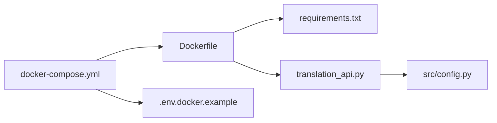

# Docker容器化部署

<cite>
**本文引用的文件**
- [deployment/docker-compose.yml](file://deployment/docker-compose.yml)
- [deployment/Dockerfile](file://deployment/Dockerfile)
- [deployment/.env.docker.example](file://deployment/.env.docker.example)
- [DOCKER.md](file://DOCKER.md)
- [translation_api.py](file://translation_api.py)
- [src/config.py](file://src/config.py)
- [requirements.txt](file://requirements.txt)
- [deployment/.dockerignore](file://deployment/.dockerignore)
- [deployment/test_docker.sh](file://deployment/test_docker.sh)
- [deployment/test_docker.bat](file://deployment/test_docker.bat)
- [deployment/TESTING.md](file://deployment/TESTING.md)
</cite>

## 目录
1. [简介](#简介)
2. [项目结构](#项目结构)
3. [核心组件](#核心组件)
4. [架构总览](#架构总览)
5. [详细组件分析](#详细组件分析)
6. [依赖关系分析](#依赖关系分析)
7. [性能与资源考虑](#性能与资源考虑)
8. [故障排查指南](#故障排查指南)
9. [结论](#结论)
10. [附录](#附录)

## 简介
本指南围绕仓库中的Docker部署能力展开，系统解析docker-compose.yml中各配置项的含义与作用，涵盖服务构建上下文、Dockerfile层指令、端口映射与卷挂载、环境变量体系（尤其是LLM_PROVIDER、API_ENDPOINT、DEFAULT_MODEL等关键项）、健康检查策略，并结合DOCKER.md文档说明“拉取预构建镜像”与“构建自定义镜像”的两种方案。同时提供基于.env.docker.example的环境配置方法，以及针对Ollama、Gemini、OpenAI三种LLM提供商的集成要点。

## 项目结构
与Docker部署直接相关的文件主要位于deployment目录：
- docker-compose.yml：定义服务、构建上下文、端口映射、卷挂载、环境变量与健康检查
- Dockerfile：镜像构建步骤，包含基础镜像、依赖安装、文件复制、目录创建、端口暴露、启动命令与健康检查
- .env.docker.example：示例环境变量模板，指导如何为不同LLM提供商配置
- .dockerignore：构建时排除规则，避免无关文件进入镜像
- 测试脚本与测试文档：自动化测试流程与手动验证步骤

图表来源
- [deployment/docker-compose.yml](file://deployment/docker-compose.yml#L1-L69)
- [deployment/Dockerfile](file://deployment/Dockerfile#L1-L35)
- [deployment/.env.docker.example](file://deployment/.env.docker.example#L1-L84)
- [deployment/.dockerignore](file://deployment/.dockerignore#L1-L40)
- [translation_api.py](file://translation_api.py#L1-L146)
- [src/config.py](file://src/config.py#L1-L120)
- [requirements.txt](file://requirements.txt#L1-L12)
- [deployment/test_docker.sh](file://deployment/test_docker.sh#L46-L95)
- [deployment/test_docker.bat](file://deployment/test_docker.bat#L1-L131)
- [deployment/TESTING.md](file://deployment/TESTING.md#L1-L120)

章节来源
- [deployment/docker-compose.yml](file://deployment/docker-compose.yml#L1-L69)
- [deployment/Dockerfile](file://deployment/Dockerfile#L1-L35)
- [deployment/.env.docker.example](file://deployment/.env.docker.example#L1-L84)
- [deployment/.dockerignore](file://deployment/.dockerignore#L1-L40)
- [translation_api.py](file://translation_api.py#L1-L146)
- [src/config.py](file://src/config.py#L1-L120)
- [requirements.txt](file://requirements.txt#L1-L12)
- [deployment/test_docker.sh](file://deployment/test_docker.sh#L46-L95)
- [deployment/test_docker.bat](file://deployment/test_docker.bat#L1-L131)
- [deployment/TESTING.md](file://deployment/TESTING.md#L1-L120)

## 核心组件
- 服务定义与构建上下文
  - 服务名称：translatebook
  - 构建上下文：父级目录（..），Dockerfile路径：deployment/Dockerfile
  - 容器名：translatebook-llm
- 端口映射
  - 使用环境变量PORT进行映射，默认5000
- 卷挂载
  - translated_files：输出翻译结果
  - logs：可选持久化日志
  - data：必需，用于断点续传、作业历史等
- 环境变量
  - 服务器配置：PORT、HOST、OUTPUT_DIR
  - LLM提供商设置：LLM_PROVIDER、API_ENDPOINT、DEFAULT_MODEL
  - Ollama配置：OLLAMA_NUM_CTX
  - Gemini配置：GEMINI_API_KEY、GEMINI_MODEL
  - OpenAI配置：OPENAI_API_KEY
  - 翻译参数：DEFAULT_SOURCE_LANGUAGE、DEFAULT_TARGET_LANGUAGE、MAIN_LINES_PER_CHUNK、MAIN_CHUNK_SIZE、REQUEST_TIMEOUT
  - 上下文管理：AUTO_ADJUST_CONTEXT、MIN_CHUNK_SIZE、MAX_CHUNK_SIZE
  - 高级设置：MAX_TRANSLATION_ATTEMPTS、RETRY_DELAY_SECONDS
  - SRT特定：SRT_LINES_PER_BLOCK、SRT_MAX_CHARS_PER_BLOCK
- 健康检查
  - 测试命令：curl访问本地/api/health
  - 执行间隔：30秒
  - 超时：10秒
  - 重试次数：3次
  - 启动等待期：40秒

章节来源
- [deployment/docker-compose.yml](file://deployment/docker-compose.yml#L1-L69)

## 架构总览
Docker部署采用单容器模式，容器内运行Flask+SocketIO的Web服务，通过卷挂载实现数据持久化与日志输出；根据LLM_PROVIDER切换不同的推理后端（本地Ollama、云端Gemini或OpenAI兼容接口）。

图表来源
- [deployment/docker-compose.yml](file://deployment/docker-compose.yml#L1-L69)
- [deployment/Dockerfile](file://deployment/Dockerfile#L1-L35)

## 详细组件分析

### docker-compose.yml 配置详解
- 服务与构建
  - build.context：父目录，使Dockerfile能访问根目录的requirements.txt与源码
  - build.dockerfile：指定deployment/Dockerfile
  - container_name：translatebook-llm
- 端口映射
  - 将宿主机PORT映射到容器PORT，支持默认值5000
- 卷挂载
  - translated_files：输出翻译产物
  - logs：可选，便于查看应用日志
  - data：必需，用于上传、临时数据与断点续传
- 环境变量
  - 服务器：PORT、HOST、OUTPUT_DIR
  - LLM：LLM_PROVIDER、API_ENDPOINT、DEFAULT_MODEL、OLLAMA_NUM_CTX
  - Gemini：GEMINI_API_KEY、GEMINI_MODEL
  - OpenAI：OPENAI_API_KEY
  - 翻译：DEFAULT_SOURCE_LANGUAGE、DEFAULT_TARGET_LANGUAGE、MAIN_LINES_PER_CHUNK、MAIN_CHUNK_SIZE、REQUEST_TIMEOUT
  - 上下文：AUTO_ADJUST_CONTEXT、MIN_CHUNK_SIZE、MAX_CHUNK_SIZE
  - 高级：MAX_TRANSLATION_ATTEMPTS、RETRY_DELAY_SECONDS
  - SRT：SRT_LINES_PER_BLOCK、SRT_MAX_CHARS_PER_BLOCK
- 健康检查
  - test：curl访问本地/api/health
  - interval：30s
  - timeout：10s
  - retries：3
  - start_period：40s
- 重启策略
  - unless-stopped

章节来源
- [deployment/docker-compose.yml](file://deployment/docker-compose.yml#L1-L69)

### Dockerfile 层指令解析
- 基础镜像与工作目录
  - 基于python:3.9-slim
  - 设置工作目录/app
- 环境变量
  - 禁止生成.pyc、禁用缓冲，提升容器稳定性
- 依赖安装
  - 安装curl（用于健康检查）
  - 安装requirements.txt中的Python依赖
- 文件复制与目录创建
  - 复制requirements.txt至镜像
  - 复制项目全部内容至/app
  - 创建必要目录：translated_files、logs、data/uploads
- 端口与卷
  - 暴露PORT（默认5000）
  - 声明VOLUME：translated_files、logs、data
- 健康检查
  - 与compose一致的健康检查策略
- 启动命令
  - CMD ["python", "translation_api.py"]

图表来源
- [deployment/Dockerfile](file://deployment/Dockerfile#L1-L35)

章节来源
- [deployment/Dockerfile](file://deployment/Dockerfile#L1-L35)

### 环境变量与LLM提供商集成
- 关键变量
  - LLM_PROVIDER：选择'ollama'、'gemini'或'openai'
  - API_ENDPOINT：本地Ollama地址或云厂商API端点
  - DEFAULT_MODEL：模型名称（本地Ollama需已安装；云厂商对应具体模型）
  - OLLAMA_NUM_CTX：上下文窗口大小
  - GEMINI_API_KEY/GEMINI_MODEL：Gemini密钥与模型
  - OPENAI_API_KEY：OpenAI密钥
- 应用读取逻辑
  - src/config.py从环境变量加载配置，提供默认值
  - translation_api.py在启动前校验关键配置（PORT、DEFAULT_MODEL、API_ENDPOINT）

图表来源
- [deployment/docker-compose.yml](file://deployment/docker-compose.yml#L1-L69)
- [deployment/Dockerfile](file://deployment/Dockerfile#L1-L35)
- [translation_api.py](file://translation_api.py#L1-L146)
- [src/config.py](file://src/config.py#L1-L120)

章节来源
- [src/config.py](file://src/config.py#L1-L120)
- [translation_api.py](file://translation_api.py#L1-L146)

### 健康检查流程
- 测试命令：curl -f http://localhost:${PORT:-5000}/api/health
- 间隔：30秒
- 超时：10秒
- 重试：3次
- 启动等待期：40秒

图表来源
- [deployment/docker-compose.yml](file://deployment/docker-compose.yml#L56-L63)
- [deployment/Dockerfile](file://deployment/Dockerfile#L31-L34)

章节来源
- [deployment/docker-compose.yml](file://deployment/docker-compose.yml#L56-L63)
- [deployment/Dockerfile](file://deployment/Dockerfile#L31-L34)

### 卷挂载与数据持久化
- translated_files：输出翻译结果，建议挂载为独立卷
- logs：应用日志，便于排查问题
- data：必需卷，包含上传、临时数据与断点续传信息

章节来源
- [deployment/docker-compose.yml](file://deployment/docker-compose.yml#L9-L13)

### 端口映射与网络
- 使用环境变量PORT进行映射，默认5000
- HOST在容器内固定为0.0.0.0，允许外部访问

章节来源
- [deployment/docker-compose.yml](file://deployment/docker-compose.yml#L7-L18)
- [translation_api.py](file://translation_api.py#L120-L146)

### 预构建镜像与自定义镜像
- 预构建镜像
  - 拉取最新镜像：ghcr.io/hydropix/translatebookwithllm:latest
  - 运行示例：映射端口、挂载卷、设置API_ENDPOINT与DEFAULT_MODEL
- 自定义镜像
  - 在deployment目录下使用Dockerfile构建自定义镜像
  - 可通过docker-compose build或docker build命令完成

章节来源
- [DOCKER.md](file://DOCKER.md#L1-L120)
- [DOCKER.md](file://DOCKER.md#L237-L252)

### 环境配置文件 .env.docker.example 的使用
- 复制示例文件为实际使用的.env
- 配置LLM_PROVIDER与对应提供商的API密钥与模型
- 其他翻译参数、上下文与高级设置可根据需要调整

章节来源
- [deployment/.env.docker.example](file://deployment/.env.docker.example#L1-L84)

## 依赖关系分析
- 组件耦合
  - docker-compose.yml依赖Dockerfile进行构建
  - translation_api.py依赖src/config.py加载环境变量
  - Dockerfile依赖requirements.txt安装运行时依赖
- 外部依赖
  - LLM提供商：Ollama（本地）、Gemini（云端）、OpenAI（云端）
  - curl：用于健康检查
- 潜在循环依赖
  - 无直接循环，服务间通过卷与网络交互

图表来源
- [deployment/docker-compose.yml](file://deployment/docker-compose.yml#L1-L69)
- [deployment/Dockerfile](file://deployment/Dockerfile#L1-L35)
- [translation_api.py](file://translation_api.py#L1-L146)
- [src/config.py](file://src/config.py#L1-L120)
- [requirements.txt](file://requirements.txt#L1-L12)
- [deployment/.env.docker.example](file://deployment/.env.docker.example#L1-L84)

章节来源
- [deployment/docker-compose.yml](file://deployment/docker-compose.yml#L1-L69)
- [deployment/Dockerfile](file://deployment/Dockerfile#L1-L35)
- [translation_api.py](file://translation_api.py#L1-L146)
- [src/config.py](file://src/config.py#L1-L120)
- [requirements.txt](file://requirements.txt#L1-L12)
- [deployment/.env.docker.example](file://deployment/.env.docker.example#L1-L84)

## 性能与资源考虑
- 健康检查间隔与超时合理设置，避免频繁探测导致负载上升
- OLLAMA_NUM_CTX影响上下文窗口与内存占用，建议根据模型与硬件调优
- 端口映射与卷挂载应避免与宿主机其他服务冲突
- 日志卷建议限制大小或定期轮转，防止磁盘占满

[本节为通用建议，不直接分析具体文件]

## 故障排查指南
- 容器无法启动
  - 查看容器日志，确认端口占用与环境变量是否正确
  - 确认卷权限与路径存在
- 健康检查失败
  - 等待start_period后再观察
  - 检查Flask服务是否成功启动
- 无法连接Ollama
  - Windows/macOS使用host.docker.internal
  - Linux可通过extra_hosts或宿主IP
- 权限问题
  - 确保挂载目录对容器用户可写
- 自动化测试
  - 使用test_docker.sh/test_docker.bat一键构建、启动、健康检查与API测试

章节来源
- [deployment/TESTING.md](file://deployment/TESTING.md#L150-L210)
- [deployment/test_docker.sh](file://deployment/test_docker.sh#L46-L95)
- [deployment/test_docker.bat](file://deployment/test_docker.bat#L1-L131)

## 结论
该Docker部署方案提供了清晰的服务定义、完善的环境变量体系与健康检查机制，支持本地Ollama与云厂商（Gemini/OpenAI）多种推理后端。通过卷挂载实现数据持久化，配合预构建镜像与自定义镜像两种方式，满足快速部署与灵活定制的需求。建议在生产环境中结合反向代理、HTTPS与监控进一步加固。

[本节为总结性内容，不直接分析具体文件]

## 附录

### 环境变量清单与用途
- 服务器配置
  - PORT：Web服务端口（默认5000）
  - HOST：监听地址（容器内固定为0.0.0.0）
  - OUTPUT_DIR：输出目录（默认/app/translated_files）
- LLM提供商设置
  - LLM_PROVIDER：'ollama'/'gemini'/'openai'
  - API_ENDPOINT：推理后端API端点
  - DEFAULT_MODEL：默认模型名称
  - OLLAMA_NUM_CTX：上下文窗口大小
- Gemini配置
  - GEMINI_API_KEY：Gemini API密钥
  - GEMINI_MODEL：Gemini模型
- OpenAI配置
  - OPENAI_API_KEY：OpenAI API密钥
- 翻译参数
  - DEFAULT_SOURCE_LANGUAGE：默认源语言
  - DEFAULT_TARGET_LANGUAGE：默认目标语言
  - MAIN_LINES_PER_CHUNK：每块行数
  - MAIN_CHUNK_SIZE：块大小
  - REQUEST_TIMEOUT：请求超时（秒）
- 上下文管理
  - AUTO_ADJUST_CONTEXT：自动调整上下文
  - MIN_CHUNK_SIZE：最小块大小
  - MAX_CHUNK_SIZE：最大块大小
- 高级设置
  - MAX_TRANSLATION_ATTEMPTS：最大尝试次数
  - RETRY_DELAY_SECONDS：重试延迟（秒）
- SRT特定
  - SRT_LINES_PER_BLOCK：SRT每块行数
  - SRT_MAX_CHARS_PER_BLOCK：SRT每块最大字符数

章节来源
- [deployment/docker-compose.yml](file://deployment/docker-compose.yml#L14-L55)
- [src/config.py](file://src/config.py#L56-L120)

### 卷挂载与权限
- 推荐挂载
  - translated_files：输出文件
  - logs：应用日志
  - data：上传与临时数据
- 权限建议
  - 确保挂载目录对容器用户可读写

章节来源
- [DOCKER.md](file://DOCKER.md#L108-L126)

### LLM提供商集成要点
- Ollama（本地）
  - 使用host.docker.internal访问宿主机Ollama服务
  - 确保模型已在本地Ollama安装
- Gemini（云端）
  - 设置GEMINI_API_KEY与GEMINI_MODEL
- OpenAI（云端）
  - 设置OPENAI_API_KEY与API_ENDPOINT及DEFAULT_MODEL

章节来源
- [deployment/.env.docker.example](file://deployment/.env.docker.example#L1-L84)
- [DOCKER.md](file://DOCKER.md#L168-L191)