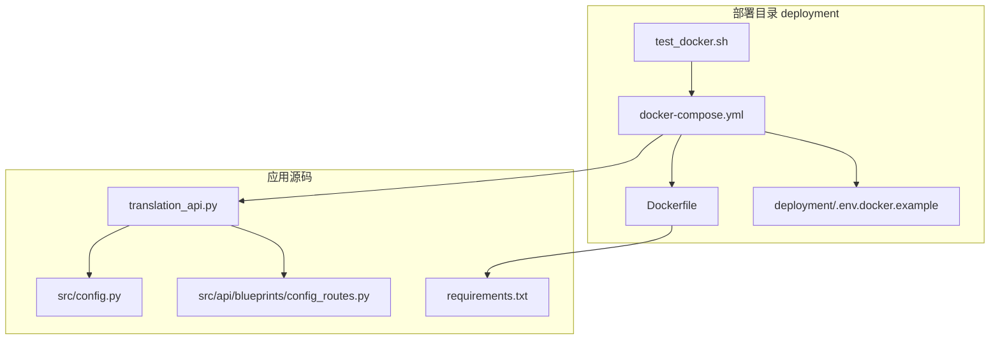
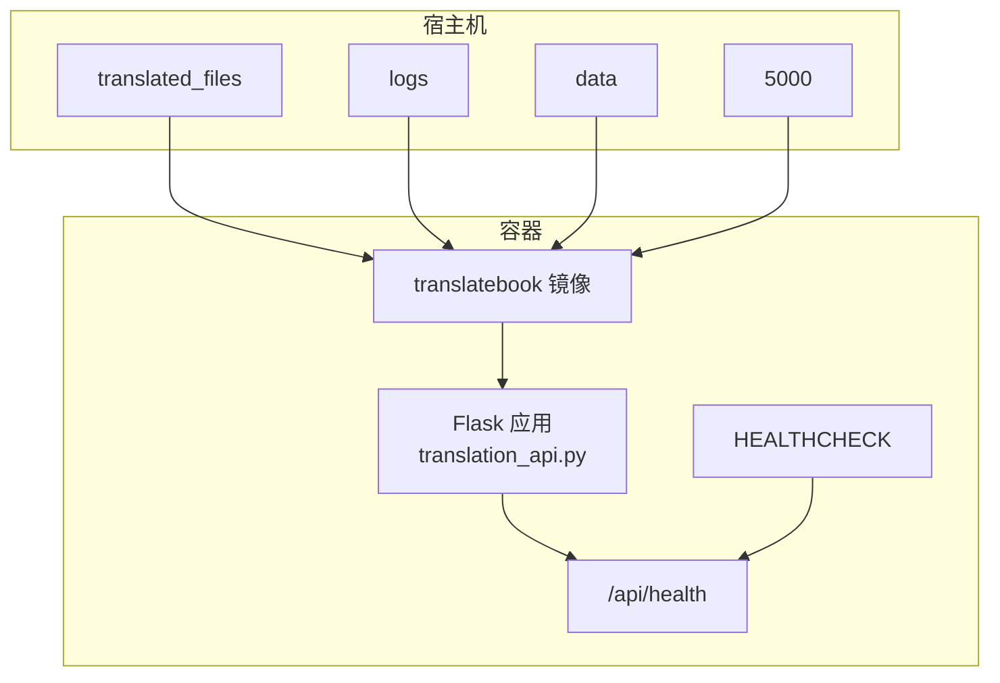
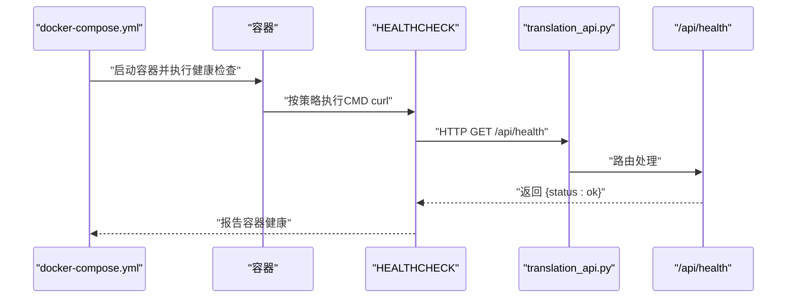
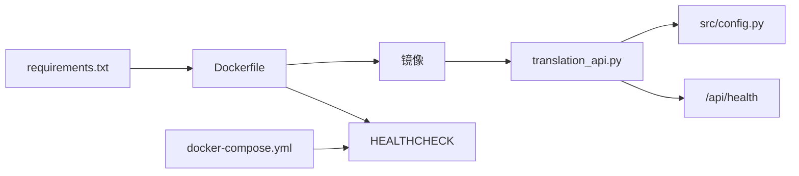

# Docker编排配置

<cite>
**本文引用的文件**
- [deployment/docker-compose.yml](file://deployment/docker-compose.yml)
- [deployment/Dockerfile](file://deployment/Dockerfile)
- [deployment/.env.docker.example](file://deployment/.env.docker.example)
- [translation_api.py](file://translation_api.py)
- [src/api/blueprints/config_routes.py](file://src/api/blueprints/config_routes.py)
- [src/config.py](file://src/config.py)
- [requirements.txt](file://requirements.txt)
- [DOCKER.md](file://DOCKER.md)
- [deployment/test_docker.sh](file://deployment/test_docker.sh)
</cite>

## 目录
1. [简介](#简介)
2. [项目结构](#项目结构)
3. [核心组件](#核心组件)
4. [架构总览](#架构总览)
5. [详细组件分析](#详细组件分析)
6. [依赖分析](#依赖分析)
7. [性能考虑](#性能考虑)
8. [故障排查指南](#故障排查指南)
9. [结论](#结论)
10. [附录](#附录)

## 简介
本文件围绕部署目录下的Docker编排配置进行深入解析，重点覆盖以下方面：
- services.translatebook 的构建上下文与Dockerfile路径选择原因
- 端口映射 ${PORT:-5000}:${PORT:-5000} 的环境变量默认值机制
- 卷挂载作用：translated_files（持久化输出）、logs（日志保留）、data（断点续传与任务历史）
- environment 层级结构：服务器配置、LLM提供商设置、翻译参数、上下文管理、高级设置、SRT特有参数
- 健康检查策略：测试命令、间隔、超时、重试与起始等待时间
- Dockerfile 指令逐层解析：基础镜像、依赖安装、文件复制、目录创建、端口暴露、启动命令与HEALTHCHECK
- compose与Dockerfile中HEALTHCHECK的对应关系

## 项目结构
部署相关文件集中在 deployment 目录，包含编排、镜像构建、示例环境变量与测试脚本；应用主入口为 translation_api.py，路由由 src/api/blueprints 下的蓝图注册；核心配置由 src/config.py 统一加载。

图表来源
- [deployment/docker-compose.yml](file://deployment/docker-compose.yml#L1-L69)
- [deployment/Dockerfile](file://deployment/Dockerfile#L1-L35)
- [deployment/.env.docker.example](file://deployment/.env.docker.example#L1-L84)
- [translation_api.py](file://translation_api.py#L1-L146)
- [src/api/blueprints/config_routes.py](file://src/api/blueprints/config_routes.py#L1-L157)
- [src/config.py](file://src/config.py#L1-L225)
- [requirements.txt](file://requirements.txt#L1-L12)
- [deployment/test_docker.sh](file://deployment/test_docker.sh#L46-L95)

章节来源
- [deployment/docker-compose.yml](file://deployment/docker-compose.yml#L1-L69)
- [deployment/Dockerfile](file://deployment/Dockerfile#L1-L35)
- [translation_api.py](file://translation_api.py#L1-L146)

## 核心组件
- 服务定义与构建上下文
  - 构建上下文指向项目根目录（..），Dockerfile 路径为 deployment/Dockerfile。该设计允许在构建阶段访问项目根目录的依赖清单与源码，同时将构建上下文限制在必要范围，避免无关文件进入镜像层。
- 端口映射与环境变量默认值
  - 端口映射使用 ${PORT:-5000}:${PORT:-5000}，若未提供 PORT，则默认使用 5000。Dockerfile 中也设置了 ARG 和 ENV 默认值，确保容器内默认端口一致。
- 卷挂载
  - translated_files：持久化翻译输出文件，便于宿主机读取与备份。
  - logs：保留应用日志，便于问题定位与审计。
  - data：保存上传、临时数据与断点续传信息，支持任务历史记录与恢复。
- 环境变量层级
  - 服务器配置：PORT、HOST、OUTPUT_DIR
  - LLM提供商设置：LLM_PROVIDER、API_ENDPOINT、DEFAULT_MODEL、OLLAMA_NUM_CTX
  - Gemini/OpenAI配置：GEMINI_API_KEY、GEMINI_MODEL、OPENAI_API_KEY
  - 翻译参数：DEFAULT_SOURCE_LANGUAGE、DEFAULT_TARGET_LANGUAGE、MAIN_LINES_PER_CHUNK、MAIN_CHUNK_SIZE、REQUEST_TIMEOUT
  - 上下文管理：AUTO_ADJUST_CONTEXT、MIN_CHUNK_SIZE、MAX_CHUNK_SIZE
  - 高级设置：MAX_TRANSLATION_ATTEMPTS、RETRY_DELAY_SECONDS
  - SRT特有：SRT_LINES_PER_BLOCK、SRT_MAX_CHARS_PER_BLOCK
- 健康检查
  - compose中测试命令对 /api/health 进行轮询，间隔30秒、超时10秒、重试3次、起始等待40秒；Dockerfile中 HEALTHCHECK 同步了相同策略，保证一致性。

章节来源
- [deployment/docker-compose.yml](file://deployment/docker-compose.yml#L1-L69)
- [deployment/Dockerfile](file://deployment/Dockerfile#L1-L35)
- [src/config.py](file://src/config.py#L56-L100)

## 架构总览
Docker编排通过 docker-compose.yml 定义服务、网络与存储；Dockerfile 描述镜像构建过程；translation_api.py 提供Web服务与WebSocket接口；健康检查在容器内与外部均生效，确保服务可用性。

图表来源
- [deployment/docker-compose.yml](file://deployment/docker-compose.yml#L1-L69)
- [deployment/Dockerfile](file://deployment/Dockerfile#L1-L35)
- [translation_api.py](file://translation_api.py#L120-L146)
- [src/api/blueprints/config_routes.py](file://src/api/blueprints/config_routes.py#L34-L44)

## 详细组件分析

### 服务定义与构建上下文
- 构建上下文 context: .. 与 dockerfile: deployment/Dockerfile 的组合，使构建能够访问根目录的 requirements.txt 与源码，同时将 Dockerfile 放置在 deployment 目录便于版本控制与隔离。
- 该策略的优势：
  - 减少构建上下文大小，提升构建效率
  - 将构建与运行时配置分离，便于维护
  - 保持 Dockerfile 的可移植性

章节来源
- [deployment/docker-compose.yml](file://deployment/docker-compose.yml#L3-L5)
- [requirements.txt](file://requirements.txt#L1-L12)

### 端口映射与环境变量默认值
- 端口映射 ${PORT:-5000}:${PORT:-5000}
  - 若宿主机未显式设置 PORT，则默认使用 5000；容器内同样以 5000 作为默认端口。
- Dockerfile 中的 ARG/ENV 默认值
  - ARG PORT=5000 与 ENV PORT=$PORT 确保容器内默认端口一致，避免端口不匹配导致的启动失败。
- 健康检查中的端口引用
  - compose 中 healthcheck 使用 ${PORT:-5000}，Dockerfile 中 HEALTHCHECK 使用 ${PORT}，两者通过环境变量保持一致。

章节来源
- [deployment/docker-compose.yml](file://deployment/docker-compose.yml#L7-L10)
- [deployment/Dockerfile](file://deployment/Dockerfile#L23-L25)
- [src/config.py](file://src/config.py#L56-L60)

### 卷挂载作用与持久化策略
- translated_files：挂载至 /app/translated_files，用于持久化翻译输出文件，便于宿主机直接访问与备份。
- logs：挂载至 /app/logs，保留应用日志，便于问题排查与审计。
- data：挂载至 /app/data，包含 uploads 子目录，用于断点续传、任务历史记录与中间状态，提升用户体验与可靠性。

章节来源
- [deployment/docker-compose.yml](file://deployment/docker-compose.yml#L10-L12)
- [deployment/Dockerfile](file://deployment/Dockerfile#L20-L22)

### 环境变量层级结构解析
- 服务器配置
  - PORT、HOST、OUTPUT_DIR
- LLM提供商设置
  - LLM_PROVIDER、API_ENDPOINT、DEFAULT_MODEL、OLLAMA_NUM_CTX
- Gemini配置
  - GEMINI_API_KEY、GEMINI_MODEL
- OpenAI配置
  - OPENAI_API_KEY
- 翻译参数
  - DEFAULT_SOURCE_LANGUAGE、DEFAULT_TARGET_LANGUAGE、MAIN_LINES_PER_CHUNK、MAIN_CHUNK_SIZE、REQUEST_TIMEOUT
- 上下文管理
  - AUTO_ADJUST_CONTEXT、MIN_CHUNK_SIZE、MAX_CHUNK_SIZE
- 高级设置
  - MAX_TRANSLATION_ATTEMPTS、RETRY_DELAY_SECONDS
- SRT特有
  - SRT_LINES_PER_BLOCK、SRT_MAX_CHARS_PER_BLOCK

章节来源
- [deployment/docker-compose.yml](file://deployment/docker-compose.yml#L13-L55)
- [src/config.py](file://src/config.py#L56-L100)

### 健康检查策略与实现
- compose中的健康检查
  - 测试命令：curl 访问 http://localhost:${PORT:-5000}/api/health
  - 间隔：30s
  - 超时：10s
  - 重试：3次
  - 起始等待：40s
- Dockerfile中的健康检查
  - HEALTHCHECK --interval=30s --timeout=10s --start-period=40s --retries=3
  - CMD curl -f http://localhost:${PORT}/api/health || exit 1
- 对应关系
  - 两者策略完全一致，确保容器外部与内部健康检查行为统一。

章节来源
- [deployment/docker-compose.yml](file://deployment/docker-compose.yml#L56-L63)
- [deployment/Dockerfile](file://deployment/Dockerfile#L31-L33)
- [src/api/blueprints/config_routes.py](file://src/api/blueprints/config_routes.py#L34-L44)

### Dockerfile逐层指令解析
- FROM python:3.9-slim
  - 选择轻量级Python基础镜像，兼顾体积与兼容性。
- WORKDIR /app
  - 设置工作目录为 /app。
- ENV PYTHONDONTWRITEBYTECODE 1、ENV PYTHONUNBUFFERED 1
  - 禁止生成字节码、启用非缓冲输出，利于日志与开发调试。
- RUN apt-get update && apt-get install -y curl ...
  - 安装 curl，用于容器内健康检查。
- COPY ../requirements.txt .
- RUN pip install --no-cache-dir -r requirements.txt
  - 复制依赖清单并安装，避免缓存影响镜像大小。
- COPY . .
  - 复制项目源码至镜像。
- RUN mkdir -p /app/translated_files /app/logs /app/data/uploads
  - 创建必要的目录，确保卷挂载后具备写入权限。
- ARG PORT=5000
  - 构建参数默认值。
- ENV PORT=$PORT
  - 将构建参数注入运行时环境变量。
- EXPOSE $PORT
  - 暴露端口，便于容器编排工具识别。
- VOLUME /app/translated_files、/app/logs、/app/data
  - 声明卷，确保数据持久化。
- HEALTHCHECK ... CMD curl -f http://localhost:${PORT}/api/health || exit 1
  - 容器内健康检查，与 compose 中策略一致。
- CMD ["python", "translation_api.py"]
  - 启动命令，运行Flask应用。

章节来源
- [deployment/Dockerfile](file://deployment/Dockerfile#L1-L35)
- [requirements.txt](file://requirements.txt#L1-L12)

### 健康检查调用序列（compose与Dockerfile对应）

图表来源
- [deployment/docker-compose.yml](file://deployment/docker-compose.yml#L56-L63)
- [deployment/Dockerfile](file://deployment/Dockerfile#L31-L33)
- [translation_api.py](file://translation_api.py#L120-L146)
- [src/api/blueprints/config_routes.py](file://src/api/blueprints/config_routes.py#L34-L44)

## 依赖分析
- 构建依赖
  - requirements.txt 决定pip安装的第三方库集合，直接影响镜像体积与功能。
- 运行时依赖
  - translation_api.py 依赖 src/config.py 加载环境变量，依赖 src/api/blueprints/config_routes.py 提供 /api/health。
- 健康检查依赖
  - compose 与 Dockerfile 的 HEALTHCHECK 共同依赖 /api/health 路由返回稳定响应。

图表来源
- [requirements.txt](file://requirements.txt#L1-L12)
- [deployment/Dockerfile](file://deployment/Dockerfile#L1-L35)
- [translation_api.py](file://translation_api.py#L1-L146)
- [src/config.py](file://src/config.py#L1-L225)
- [src/api/blueprints/config_routes.py](file://src/api/blueprints/config_routes.py#L1-L157)
- [deployment/docker-compose.yml](file://deployment/docker-compose.yml#L56-L63)

章节来源
- [requirements.txt](file://requirements.txt#L1-L12)
- [src/config.py](file://src/config.py#L56-L100)

## 性能考虑
- 构建优化
  - 使用 python:3.9-slim 基础镜像，减少镜像体积
  - pip 安装时禁用缓存，避免无用层
  - 仅复制必要文件（requirements.txt 与源码），缩小构建上下文
- 运行时优化
  - 非缓冲输出与禁用字节码生成，降低I/O与磁盘占用
  - 健康检查间隔与超时合理设置，平衡可用性与资源消耗
- 数据持久化
  - 卷挂载将热点数据移出容器层，提高性能与可维护性

[本节为通用建议，无需特定文件来源]

## 故障排查指南
- 健康检查失败
  - 使用 compose 的健康检查命令或 curl 手动验证 /api/health 返回是否为 {"status":"ok"}
  - 参考测试脚本中的健康检查流程与日志输出
- 端口冲突
  - 确认宿主机端口 5000 是否被占用；如冲突，请调整 PORT 并重启
- LLM连接问题
  - 若使用本地Ollama，确认 API_ENDPOINT 指向 host.docker.internal，并确保Ollama已启动
  - 在Linux上可能需要额外网络配置或使用 host.docker.internal 映射
- 权限问题
  - 确保挂载目录具有适当权限，避免容器内无法写入
- 日志定位
  - 查看容器日志与挂载的 logs 目录，结合 /api/health 与业务接口返回信息定位问题

章节来源
- [deployment/test_docker.sh](file://deployment/test_docker.sh#L46-L95)
- [DOCKER.md](file://DOCKER.md#L193-L215)
- [deployment/docker-compose.yml](file://deployment/docker-compose.yml#L56-L63)
- [src/api/blueprints/config_routes.py](file://src/api/blueprints/config_routes.py#L34-L44)

## 结论
本编排配置通过清晰的构建上下文、一致的端口与环境变量默认值、合理的卷挂载策略与严格的健康检查机制，实现了可复现、可维护且可靠的容器化部署。compose与Dockerfile在健康检查策略上的同步，确保了容器内外一致的可用性保障。配合 .env.docker.example 的示例配置，用户可以快速完成本地或生产环境的部署与调试。

[本节为总结性内容，无需特定文件来源]

## 附录
- 快速参考
  - 端口映射：${PORT:-5000}:${PORT:-5000}
  - 卷挂载：translated_files、logs、data
  - 健康检查：间隔30s、超时10s、重试3次、起始等待40s
  - 默认端口：5000
  - 默认模型：qwen3:14b
  - 默认提供商：ollama

章节来源
- [deployment/docker-compose.yml](file://deployment/docker-compose.yml#L7-L12)
- [deployment/Dockerfile](file://deployment/Dockerfile#L23-L25)
- [deployment/.env.docker.example](file://deployment/.env.docker.example#L8-L29)