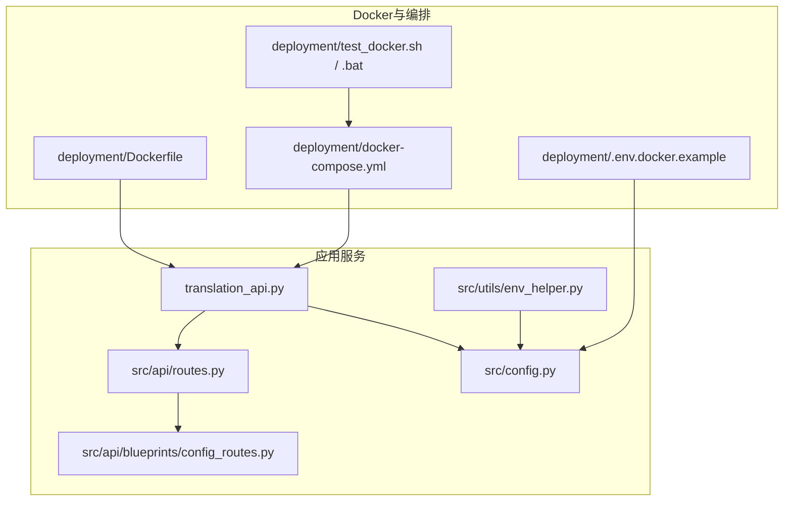
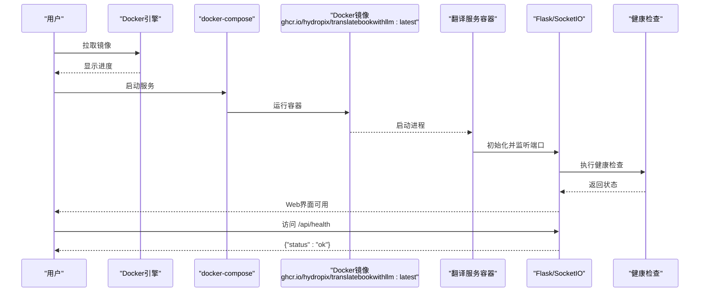
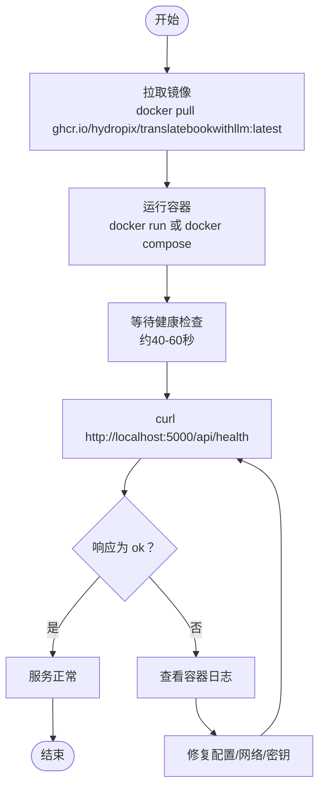
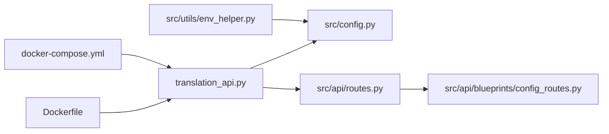

# Docker镜像使用

<cite>
**本文引用的文件**
- [DOCKER.md](file://DOCKER.md)
- [deployment/Dockerfile](file://deployment/Dockerfile)
- [deployment/docker-compose.yml](file://deployment/docker-compose.yml)
- [deployment/.env.docker.example](file://deployment/.env.docker.example)
- [deployment/TESTING.md](file://deployment/TESTING.md)
- [translation_api.py](file://translation_api.py)
- [src/api/routes.py](file://src/api/routes.py)
- [src/api/blueprints/config_routes.py](file://src/api/blueprints/config_routes.py)
- [src/config.py](file://src/config.py)
- [src/utils/env_helper.py](file://src/utils/env_helper.py)
- [deployment/test_docker.sh](file://deployment/test_docker.sh)
- [deployment/test_docker.bat](file://deployment/test_docker.bat)
</cite>

## 目录
1. [简介](#简介)
2. [项目结构](#项目结构)
3. [核心组件](#核心组件)
4. [架构总览](#架构总览)
5. [详细组件分析](#详细组件分析)
6. [依赖关系分析](#依赖关系分析)
7. [性能与可用性建议](#性能与可用性建议)
8. [故障排查指南](#故障排查指南)
9. [结论](#结论)
10. [附录](#附录)

## 简介
本指南面向希望使用官方Docker镜像快速部署 TranslateBookWithLLM 的用户，覆盖从GitHub容器注册表拉取预构建镜像、运行容器、配置环境变量、多平台支持、健康检查验证等全流程。同时提供使用云LLM提供商（Gemini、OpenAI）时的安全配置方法，以及基于 .env 文件的本地化配置实践，帮助避免敏感信息泄露至版本控制。

## 项目结构
围绕Docker部署的关键文件与目录如下：
- 镜像构建与运行：Dockerfile、docker-compose.yml
- 环境配置模板：.env.docker.example
- 健康检查与API路由：translation_api.py、src/api/routes.py、src/api/blueprints/config_routes.py
- 配置加载与校验：src/config.py、src/utils/env_helper.py
- 自动化测试脚本：deployment/test_docker.sh、deployment/test_docker.bat
- 官方部署文档：DOCKER.md、deployment/TESTING.md

图表来源
- [deployment/Dockerfile](file://deployment/Dockerfile#L1-L35)
- [deployment/docker-compose.yml](file://deployment/docker-compose.yml#L1-L69)
- [deployment/.env.docker.example](file://deployment/.env.docker.example#L1-L84)
- [translation_api.py](file://translation_api.py#L1-L146)
- [src/api/routes.py](file://src/api/routes.py#L1-L66)
- [src/api/blueprints/config_routes.py](file://src/api/blueprints/config_routes.py#L1-L43)
- [src/config.py](file://src/config.py#L1-L120)
- [src/utils/env_helper.py](file://src/utils/env_helper.py#L1-L120)
- [deployment/test_docker.sh](file://deployment/test_docker.sh#L1-L120)

章节来源
- [DOCKER.md](file://DOCKER.md#L1-L120)
- [deployment/Dockerfile](file://deployment/Dockerfile#L1-L35)
- [deployment/docker-compose.yml](file://deployment/docker-compose.yml#L1-L69)
- [deployment/.env.docker.example](file://deployment/.env.docker.example#L1-L84)

## 核心组件
- Docker镜像与容器
  - 使用官方镜像 ghcr.io/hydropix/translatebookwithllm:latest 拉取最新稳定版
  - Dockerfile 定义基础镜像、工作目录、安装curl用于健康检查、复制依赖与源码、暴露端口、声明卷、内置健康检查
  - docker-compose.yml 提供服务编排、端口映射、卷挂载、环境变量注入、健康检查
- 应用服务与路由
  - translation_api.py 启动Flask+SocketIO服务，加载配置并注册路由
  - src/api/routes.py 注册各蓝图（配置/健康、翻译、文件、安全）
  - src/api/blueprints/config_routes.py 提供 /api/health 健康检查端点
- 配置系统
  - src/config.py 从 .env 加载环境变量，提供默认值与类型转换
  - src/utils/env_helper.py 提供 .env 创建、校验与交互式配置工具
- 测试与验证
  - deployment/test_docker.sh / .bat 自动化构建、启动、等待健康、测试 /api/health 与Web界面

章节来源
- [DOCKER.md](file://DOCKER.md#L1-L120)
- [deployment/Dockerfile](file://deployment/Dockerfile#L1-L35)
- [deployment/docker-compose.yml](file://deployment/docker-compose.yml#L1-L69)
- [translation_api.py](file://translation_api.py#L1-L146)
- [src/api/routes.py](file://src/api/routes.py#L1-L66)
- [src/api/blueprints/config_routes.py](file://src/api/blueprints/config_routes.py#L1-L43)
- [src/config.py](file://src/config.py#L1-L120)
- [src/utils/env_helper.py](file://src/utils/env_helper.py#L1-L120)
- [deployment/test_docker.sh](file://deployment/test_docker.sh#L1-L120)
- [deployment/test_docker.bat](file://deployment/test_docker.bat#L1-L120)

## 架构总览
下图展示从镜像拉取到容器运行、健康检查与Web接口访问的整体流程。

图表来源
- [DOCKER.md](file://DOCKER.md#L1-L120)
- [deployment/docker-compose.yml](file://deployment/docker-compose.yml#L1-L69)
- [translation_api.py](file://translation_api.py#L1-L146)
- [src/api/blueprints/config_routes.py](file://src/api/blueprints/config_routes.py#L1-L43)

## 详细组件分析

### 镜像与容器运行
- 拉取镜像
  - 使用命令：docker pull ghcr.io/hydropix/translatebookwithllm:latest
  - 参考路径：[DOCKER.md](file://DOCKER.md#L1-L40)
- 运行容器（单容器示例）
  - 端口映射：-p 5000:5000
  - 卷挂载：translated_files、logs、data
  - 环境变量：API_ENDPOINT、DEFAULT_MODEL 等
  - 参考路径：[DOCKER.md](file://DOCKER.md#L1-L40)
- docker-compose 编排
  - 服务名称、端口映射、卷挂载、环境变量、健康检查
  - 参考路径：[deployment/docker-compose.yml](file://deployment/docker-compose.yml#L1-L69)

章节来源
- [DOCKER.md](file://DOCKER.md#L1-L84)
- [deployment/docker-compose.yml](file://deployment/docker-compose.yml#L1-L69)

### 镜像标签语义与适用场景
- latest：主分支的最新稳定版本
- v1.2.3：具体语义化版本（如 v1.0.0、v2.1.3）
- v1.2：主次版本的最新补丁版本
- v1：主版本的最新小版本与补丁版本
- main-<sha>：主分支特定提交的镜像
- 参考路径：[DOCKER.md](file://DOCKER.md#L27-L37)

章节来源
- [DOCKER.md](file://DOCKER.md#L27-L37)

### 多平台支持与架构选择
- 支持架构：linux/amd64、linux/arm64
- Docker会自动为宿主机选择匹配的镜像架构
- 参考路径：[DOCKER.md](file://DOCKER.md#L85-L92)

章节来源
- [DOCKER.md](file://DOCKER.md#L85-L92)

### 环境变量与安全配置
- 关键变量
  - API_ENDPOINT：LLM API端点（默认本地Ollama）
  - DEFAULT_MODEL：默认模型名
  - LLM_PROVIDER：提供方（ollama/gemini/openai）
  - GEMINI_API_KEY：Gemini API密钥
  - OPENAI_API_KEY：OpenAI API密钥
  - PORT：服务端口（默认5000）
  - OLLAMA_NUM_CTX：上下文窗口大小
  - REQUEST_TIMEOUT：请求超时（秒）
  - 其他：分块大小、语言、签名开关等
- 安全建议
  - 不要将包含API密钥的 .env 提交到版本控制
  - 在生产中使用Docker secrets或Kubernetes secrets管理敏感信息
  - 参考路径：[DOCKER.md](file://DOCKER.md#L93-L120)
- .env 示例与注释
  - 参考路径：[deployment/.env.docker.example](file://deployment/.env.docker.example#L1-L84)
- 配置加载与校验
  - src/config.py 从 .env 加载并提供默认值
  - src/utils/env_helper.py 提供创建、校验与交互式配置能力
  - 参考路径：[src/config.py](file://src/config.py#L1-L120)、[src/utils/env_helper.py](file://src/utils/env_helper.py#L1-L120)

章节来源
- [DOCKER.md](file://DOCKER.md#L93-L120)
- [deployment/.env.docker.example](file://deployment/.env.docker.example#L1-L84)
- [src/config.py](file://src/config.py#L1-L120)
- [src/utils/env_helper.py](file://src/utils/env_helper.py#L1-L120)

### 健康检查与验证
- 内置健康检查
  - Dockerfile 中的 HEALTHCHECK
  - docker-compose.yml 中的 healthcheck
  - translation_api.py 启动日志中的健康检查提示
  - 参考路径：[deployment/Dockerfile](file://deployment/Dockerfile#L31-L35)、[deployment/docker-compose.yml](file://deployment/docker-compose.yml#L56-L63)、[translation_api.py](file://translation_api.py#L120-L146)
- /api/health 端点
  - 蓝图实现返回 {"status":"ok"} 等信息
  - 参考路径：[src/api/blueprints/config_routes.py](file://src/api/blueprints/config_routes.py#L1-L43)
- curl 验证
  - curl http://localhost:5000/api/health
  - 参考路径：[DOCKER.md](file://DOCKER.md#L193-L205)、[deployment/TESTING.md](file://deployment/TESTING.md#L69-L90)

章节来源
- [deployment/Dockerfile](file://deployment/Dockerfile#L31-L35)
- [deployment/docker-compose.yml](file://deployment/docker-compose.yml#L56-L63)
- [translation_api.py](file://translation_api.py#L120-L146)
- [src/api/blueprints/config_routes.py](file://src/api/blueprints/config_routes.py#L1-L43)
- [DOCKER.md](file://DOCKER.md#L193-L205)
- [deployment/TESTING.md](file://deployment/TESTING.md#L69-L90)

### 云LLM提供商配置示例
- Gemini
  - 设置 LLM_PROVIDER=gemini、GEMINI_API_KEY、可选 DEFAULT_MODEL
  - 参考路径：[DOCKER.md](file://DOCKER.md#L168-L191)、[deployment/.env.docker.example](file://deployment/.env.docker.example#L30-L42)
- OpenAI
  - 设置 LLM_PROVIDER=openai、OPENAI_API_KEY、API_ENDPOINT、DEFAULT_MODEL
  - 参考路径：[DOCKER.md](file://DOCKER.md#L181-L191)、[deployment/.env.docker.example](file://deployment/.env.docker.example#L38-L42)
- Ollama（本地/远程）
  - 使用 host.docker.internal 或宿主IP，设置 API_ENDPOINT 与 DEFAULT_MODEL
  - 参考路径：[DOCKER.md](file://DOCKER.md#L127-L167)、[deployment/.env.docker.example](file://deployment/.env.docker.example#L18-L30)

章节来源
- [DOCKER.md](file://DOCKER.md#L127-L191)
- [deployment/.env.docker.example](file://deployment/.env.docker.example#L18-L42)

### 自定义 .env 与 .env.docker.example
- 创建 .env
  - 复制 .env.docker.example 并按需编辑
  - 参考路径：[DOCKER.md](file://DOCKER.md#L37-L53)、[deployment/.env.docker.example](file://deployment/.env.docker.example#L1-L10)
- 配置项说明
  - 服务器配置、LLM提供方选择、Ollama/Gemini/OpenAI参数、翻译设置、上下文管理、高级选项、SRT配置、签名开关
  - 参考路径：[deployment/.env.docker.example](file://deployment/.env.docker.example#L1-L84)
- 配置校验与交互式设置
  - src/utils/env_helper.py 提供 create/validate/setup 子命令
  - 参考路径：[src/utils/env_helper.py](file://src/utils/env_helper.py#L1-L120)

章节来源
- [DOCKER.md](file://DOCKER.md#L37-L53)
- [deployment/.env.docker.example](file://deployment/.env.docker.example#L1-L84)
- [src/utils/env_helper.py](file://src/utils/env_helper.py#L1-L120)

### 容器运行后的健康检查验证流程

图表来源
- [DOCKER.md](file://DOCKER.md#L193-L205)
- [deployment/TESTING.md](file://deployment/TESTING.md#L69-L90)
- [deployment/test_docker.sh](file://deployment/test_docker.sh#L64-L95)
- [deployment/test_docker.bat](file://deployment/test_docker.bat#L64-L111)

## 依赖关系分析
- 组件耦合
  - translation_api.py 依赖 src/config.py 的配置加载
  - src/api/routes.py 注册各蓝图，其中 config_routes.py 提供 /api/health
  - docker-compose.yml 通过环境变量驱动配置加载
  - Dockerfile 通过 HEALTHCHECK 与 CMD 控制容器生命周期
- 外部依赖
  - LLM提供方（Ollama/Gemini/OpenAI）的API端点与密钥
  - Docker与Docker Compose版本要求
- 可能的循环依赖
  - 当前结构以模块导入为主，未见循环依赖迹象

图表来源
- [deployment/Dockerfile](file://deployment/Dockerfile#L1-L35)
- [deployment/docker-compose.yml](file://deployment/docker-compose.yml#L1-L69)
- [translation_api.py](file://translation_api.py#L1-L146)
- [src/config.py](file://src/config.py#L1-L120)
- [src/api/routes.py](file://src/api/routes.py#L1-L66)
- [src/api/blueprints/config_routes.py](file://src/api/blueprints/config_routes.py#L1-L43)
- [src/utils/env_helper.py](file://src/utils/env_helper.py#L1-L120)

章节来源
- [translation_api.py](file://translation_api.py#L1-L146)
- [src/api/routes.py](file://src/api/routes.py#L1-L66)
- [src/api/blueprints/config_routes.py](file://src/api/blueprints/config_routes.py#L1-L43)
- [src/config.py](file://src/config.py#L1-L120)
- [src/utils/env_helper.py](file://src/utils/env_helper.py#L1-L120)
- [deployment/Dockerfile](file://deployment/Dockerfile#L1-L35)
- [deployment/docker-compose.yml](file://deployment/docker-compose.yml#L1-L69)

## 性能与可用性建议
- 上下文窗口与分块
  - OLLAMA_NUM_CTX、MAIN_LINES_PER_CHUNK、REQUEST_TIMEOUT 等参数影响性能与稳定性
  - 参考路径：[DOCKER.md](file://DOCKER.md#L93-L120)、[deployment/.env.docker.example](file://deployment/.env.docker.example#L43-L84)
- 健康检查与重启策略
  - docker-compose.yml 中 restart: unless-stopped
  - 参考路径：[deployment/docker-compose.yml](file://deployment/docker-compose.yml#L64-L69)
- 日志与持久化
  - 建议挂载 logs 与 data 目录以便调试与恢复
  - 参考路径：[DOCKER.md](file://DOCKER.md#L108-L126)、[deployment/docker-compose.yml](file://deployment/docker-compose.yml#L8-L13)

[本节为通用建议，无需特定文件分析]

## 故障排查指南
- 容器无法启动
  - 查看日志；检查端口占用；确认 .env 是否存在且变量正确
  - 参考路径：[DOCKER.md](file://DOCKER.md#L216-L236)、[deployment/TESTING.md](file://deployment/TESTING.md#L154-L185)
- 无法连接 Ollama
  - Windows/Mac 使用 host.docker.internal；Linux 使用宿主IP或 extra_hosts
  - 参考路径：[DOCKER.md](file://DOCKER.md#L127-L167)、[deployment/TESTING.md](file://deployment/TESTING.md#L394-L423)
- 权限问题（Linux）
  - 修改挂载目录权限或使用用户映射
  - 参考路径：[DOCKER.md](file://DOCKER.md#L118-L126)、[deployment/TESTING.md](file://deployment/TESTING.md#L458-L469)
- 健康检查失败
  - 等待启动宽限期；查看容器健康状态；手动 curl /api/health
  - 参考路径：[DOCKER.md](file://DOCKER.md#L193-L205)、[deployment/TESTING.md](file://deployment/TESTING.md#L168-L185)

章节来源
- [DOCKER.md](file://DOCKER.md#L193-L236)
- [deployment/TESTING.md](file://deployment/TESTING.md#L154-L185)
- [deployment/TESTING.md](file://deployment/TESTING.md#L394-L423)
- [deployment/TESTING.md](file://deployment/TESTING.md#L458-L469)

## 结论
通过官方镜像与 docker-compose 编排，用户可以快速完成 TranslateBookWithLLM 的部署与运行。配合 .env 配置模板与健康检查机制，可在本地或生产环境中稳定运行。建议在生产中采用密钥管理方案与反向代理，并定期更新镜像以获得安全与功能更新。

[本节为总结，无需特定文件分析]

## 附录

### 快速操作清单
- 拉取镜像：docker pull ghcr.io/hydropix/translatebookwithllm:latest
- 运行容器：docker run 或 docker compose up -d
- 访问Web界面：http://localhost:5000
- 健康检查：curl http://localhost:5000/api/health
- 参考路径：[DOCKER.md](file://DOCKER.md#L1-L84)、[deployment/TESTING.md](file://deployment/TESTING.md#L69-L90)

### Dockerfile 关键点
- 基础镜像、工作目录、curl安装、依赖安装、卷声明、端口暴露、内置健康检查
- 参考路径：[deployment/Dockerfile](file://deployment/Dockerfile#L1-L35)

### docker-compose 关键点
- 服务编排、端口映射、卷挂载、环境变量、健康检查、重启策略
- 参考路径：[deployment/docker-compose.yml](file://deployment/docker-compose.yml#L1-L69)