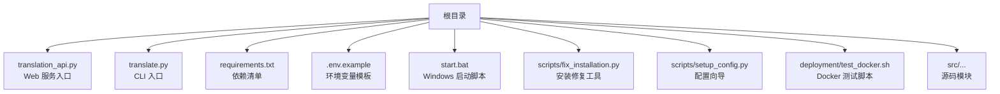
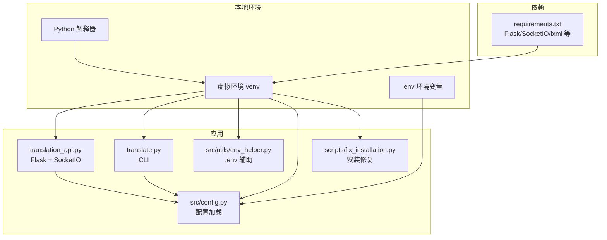
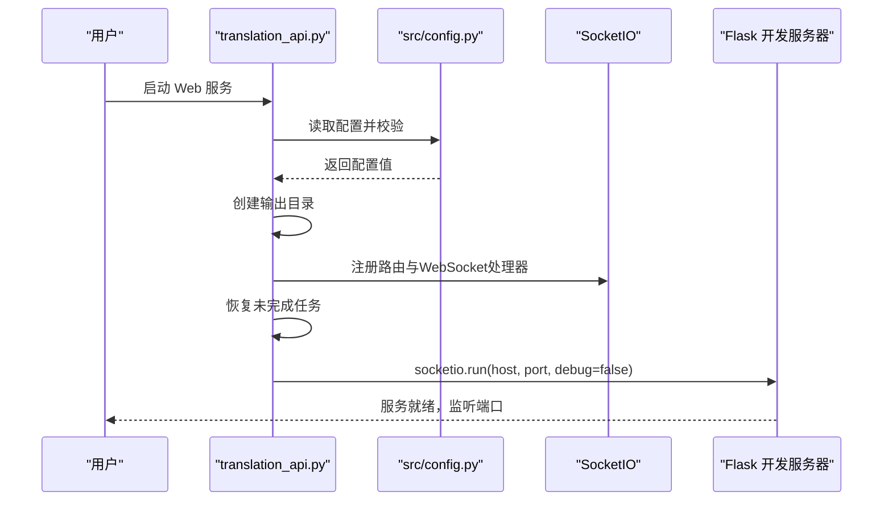
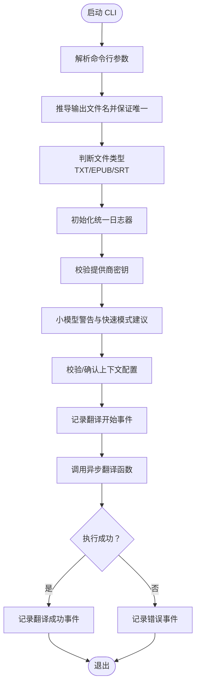
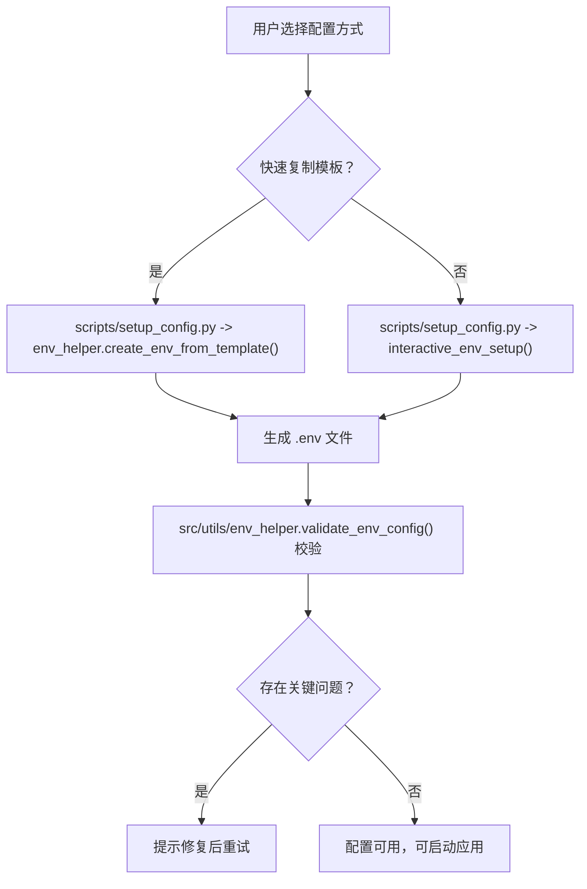
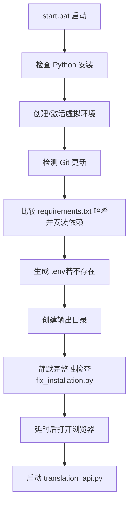
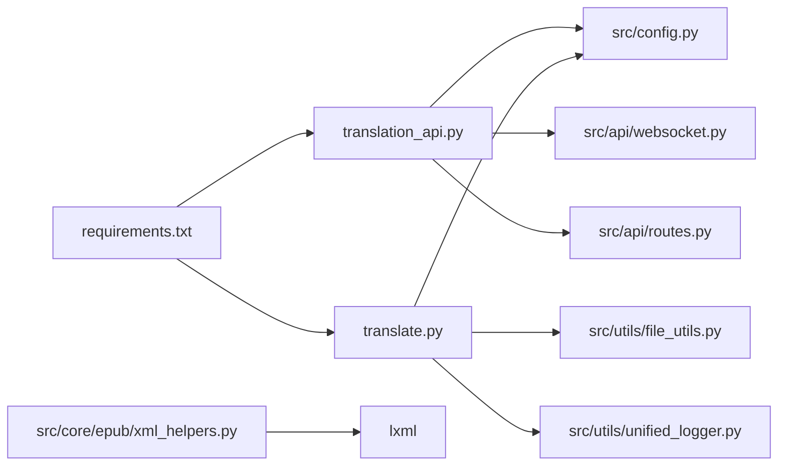

# 本地部署指南

<cite>
**本文引用的文件列表**
- [requirements.txt](file://requirements.txt)
- [translation_api.py](file://translation_api.py)
- [translate.py](file://translate.py)
- [.env.example](file://.env.example)
- [start.bat](file://start.bat)
- [scripts/fix_installation.py](file://scripts/fix_installation.py)
- [scripts/setup_config.py](file://scripts/setup_config.py)
- [src/utils/env_helper.py](file://src/utils/env_helper.py)
- [src/config.py](file://src/config.py)
- [deployment/test_docker.sh](file://deployment/test_docker.sh)
- [src/core/epub/xml_helpers.py](file://src/core/epub/xml_helpers.py)
</cite>

## 目录
1. [简介](#简介)
2. [项目结构](#项目结构)
3. [核心组件](#核心组件)
4. [架构总览](#架构总览)
5. [详细组件分析](#详细组件分析)
6. [依赖关系分析](#依赖关系分析)
7. [性能注意事项](#性能注意事项)
8. [故障排查指南](#故障排查指南)
9. [结论](#结论)
10. [附录](#附录)

## 简介
本指南面向在原生系统环境中进行本地部署的用户，目标是帮助您完成从 Python 环境准备、依赖安装、环境变量配置到启动 Web 服务与 CLI 工具的全流程操作。同时提供 Windows 启动脚本与类 Unix 系统的 Bash 脚本示例，并给出常见依赖冲突（尤其是 lxml 编译问题）的解决方案，以及如何验证本地服务是否正常运行的方法。最后强调在生产环境中使用 WSGI 服务器（如 Gunicorn）替代 Flask 开发服务器的性能优势。

## 项目结构
该项目采用“分层+功能模块化”的组织方式：
- 根目录包含入口脚本与依赖清单：requirements.txt、translation_api.py、translate.py、start.bat
- 配置模板：.env.example
- 源码按领域拆分：src 下包含 API、核心翻译逻辑、持久化、工具等子模块
- 自动化脚本：scripts/fix_installation.py、scripts/setup_config.py
- 部署测试脚本：deployment/test_docker.sh（用于验证健康检查与 Web 接口）

图表来源
- [translation_api.py](file://translation_api.py#L1-L146)
- [translate.py](file://translate.py#L1-L147)
- [requirements.txt](file://requirements.txt#L1-L12)
- [.env.example](file://.env.example#L1-L45)
- [start.bat](file://start.bat#L1-L211)
- [scripts/fix_installation.py](file://scripts/fix_installation.py#L1-L270)
- [scripts/setup_config.py](file://scripts/setup_config.py#L1-L89)
- [deployment/test_docker.sh](file://deployment/test_docker.sh#L1-L122)

章节来源
- [translation_api.py](file://translation_api.py#L1-L146)
- [translate.py](file://translate.py#L1-L147)
- [requirements.txt](file://requirements.txt#L1-L12)
- [.env.example](file://.env.example#L1-L45)
- [start.bat](file://start.bat#L1-L211)
- [scripts/fix_installation.py](file://scripts/fix_installation.py#L1-L270)
- [scripts/setup_config.py](file://scripts/setup_config.py#L1-L89)
- [deployment/test_docker.sh](file://deployment/test_docker.sh#L1-L122)

## 核心组件
- Web 服务入口：translation_api.py 提供 Flask 应用与 SocketIO 支持，负责路由、WebSocket 处理、状态管理与输出目录准备。
- CLI 工具入口：translate.py 提供命令行参数解析、文件类型识别、日志记录与翻译流程调度。
- 环境变量：.env.example 定义了 API 端点、默认模型、端口、主机、输出目录、LLM 提供商、语言设置、上下文窗口等关键配置项。
- 启动脚本：start.bat（Windows）自动检测 Python、创建/激活虚拟环境、安装依赖、生成 .env、创建输出目录、打开浏览器并启动 Web 服务。
- 配置工具：scripts/setup_config.py 与 src/utils/env_helper.py 提供快速复制模板、交互式配置与校验能力。
- 安装修复：scripts/fix_installation.py 用于检测并修复常见安装问题（如 prompts.py 的回车符问题、缓存清理、导入测试等）。

章节来源
- [translation_api.py](file://translation_api.py#L1-L146)
- [translate.py](file://translate.py#L1-L147)
- [.env.example](file://.env.example#L1-L45)
- [start.bat](file://start.bat#L1-L211)
- [scripts/setup_config.py](file://scripts/setup_config.py#L1-L89)
- [src/utils/env_helper.py](file://src/utils/env_helper.py#L1-L239)
- [scripts/fix_installation.py](file://scripts/fix_installation.py#L1-L270)

## 架构总览
下图展示了 Web 服务与 CLI 的启动路径、配置加载与依赖关系。

图表来源
- [translation_api.py](file://translation_api.py#L1-L146)
- [translate.py](file://translate.py#L1-L147)
- [src/config.py](file://src/config.py#L1-L225)
- [src/utils/env_helper.py](file://src/utils/env_helper.py#L1-L239)
- [scripts/fix_installation.py](file://scripts/fix_installation.py#L1-L270)
- [requirements.txt](file://requirements.txt#L1-L12)

## 详细组件分析

### Web 服务启动流程（translation_api.py）
- 初始化 Flask 应用与 SocketIO，配置静态资源路径与跨域策略
- 加载配置并进行必要校验（端口、默认模型、API 端点）
- 准备输出目录
- 注册路由与 WebSocket 处理器
- 启动前恢复未完成任务
- 运行时提示生产环境建议使用 WSGI 服务器

图表来源
- [translation_api.py](file://translation_api.py#L1-L146)
- [src/config.py](file://src/config.py#L1-L225)

章节来源
- [translation_api.py](file://translation_api.py#L1-L146)
- [src/config.py](file://src/config.py#L1-L225)

### CLI 工具启动流程（translate.py）
- 解析命令行参数（输入文件、输出文件、源/目标语言、模型、分块大小、提供商、API 密钥、颜色开关、快速模式等）
- 推导输出文件名并确保唯一性
- 判断文件类型（文本、EPUB、SRT）
- 设置统一日志器
- 校验提供商所需的 API 密钥
- 对小模型（≤12B）给出快速模式建议
- 校验上下文窗口配置（可选确认）
- 记录开始事件，调用异步翻译函数，记录结束或错误事件

图表来源
- [translate.py](file://translate.py#L1-L147)

章节来源
- [translate.py](file://translate.py#L1-L147)

### 环境变量配置（.env.example 与辅助工具）
- .env.example 提供了 API 端点、默认模型、端口、主机、输出目录、LLM 提供商、语言设置、上下文窗口、自动调整、SRT 配置、签名开关等键值
- scripts/setup_config.py 与 src/utils/env_helper.py 提供：
  - 快速复制模板为 .env
  - 交互式配置向导
  - 配置校验（关键项缺失、远程 Ollama 警告、默认配置提示等）

图表来源
- [scripts/setup_config.py](file://scripts/setup_config.py#L1-L89)
- [src/utils/env_helper.py](file://src/utils/env_helper.py#L1-L239)
- [.env.example](file://.env.example#L1-L45)

章节来源
- [.env.example](file://.env.example#L1-L45)
- [scripts/setup_config.py](file://scripts/setup_config.py#L1-L89)
- [src/utils/env_helper.py](file://src/utils/env_helper.py#L1-L239)

### Windows 启动脚本（start.bat）
- 检查 Python 版本与 PATH
- 创建/激活虚拟环境
- 检测代码更新与依赖变更，自动安装/升级依赖
- 生成 .env 并提示编辑
- 创建输出目录
- 打开浏览器并启动 translation_api.py

图表来源
- [start.bat](file://start.bat#L1-L211)
- [scripts/fix_installation.py](file://scripts/fix_installation.py#L1-L270)

章节来源
- [start.bat](file://start.bat#L1-L211)
- [scripts/fix_installation.py](file://scripts/fix_installation.py#L1-L270)

### 类 Unix 系统启动脚本（Bash）
- 仓库未提供直接的 Bash 启动脚本，但可参考 deployment/test_docker.sh 中的健康检查与 Web 接口访问方式，自行编写启动脚本以实现相同效果（例如：创建虚拟环境、安装依赖、生成 .env、启动 translation_api.py、等待健康检查）。

章节来源
- [deployment/test_docker.sh](file://deployment/test_docker.sh#L1-L122)

## 依赖关系分析
- 依赖清单：requirements.txt 包含 Flask、Flask-CORS、Flask-SocketIO、requests、tqdm、httpx、lxml、python-dotenv、aiofiles、tiktoken 等
- Web 服务依赖：translation_api.py 使用 src/config.py 加载配置；注册路由与 WebSocket 处理器；依赖输出目录存在性
- CLI 依赖：translate.py 使用 src/config.py、src.utils.file_utils.translate_file、src.utils.unified_logger
- lxml 使用：src/core/epub/xml_helpers.py 对 lxml 的元素迭代、标签获取、属性访问等做了兼容封装，以应对不同版本的 Cython 行为差异

图表来源
- [requirements.txt](file://requirements.txt#L1-L12)
- [translation_api.py](file://translation_api.py#L1-L146)
- [translate.py](file://translate.py#L1-L147)
- [src/config.py](file://src/config.py#L1-L225)
- [src/core/epub/xml_helpers.py](file://src/core/epub/xml_helpers.py#L1-L279)

章节来源
- [requirements.txt](file://requirements.txt#L1-L12)
- [translation_api.py](file://translation_api.py#L1-L146)
- [translate.py](file://translate.py#L1-L147)
- [src/config.py](file://src/config.py#L1-L225)
- [src/core/epub/xml_helpers.py](file://src/core/epub/xml_helpers.py#L1-L279)

## 性能注意事项
- 生产环境建议使用 WSGI 服务器（如 Gunicorn）替代 Flask 开发服务器
  - translation_api.py 在绑定到 0.0.0.0 时会提示使用 WSGI 服务器（例如 eventlet worker + gunicorn 绑定 0.0.0.0:5000）
  - WSGI 服务器具备更好的并发处理能力与稳定性，适合多用户访问场景
- 上下文窗口与分块大小
  - .env.example 与 src/config.py 提供了 OLLAMA_NUM_CTX、AUTO_ADJUST_CONTEXT、MIN/MAX_CHUNK_SIZE 等参数，合理配置可提升翻译质量与性能
- 输出目录与磁盘 I/O
  - translation_api.py 启动时会确保 OUTPUT_DIR 存在，避免运行中因目录缺失导致失败

章节来源
- [translation_api.py](file://translation_api.py#L1-L146)
- [.env.example](file://.env.example#L1-L45)
- [src/config.py](file://src/config.py#L1-L225)

## 故障排查指南

### 1. Python 安装与版本要求
- 建议使用 Python 3.8+（推荐 3.11+）
- 若系统自带 Python 不满足要求，请前往官方下载并确保勾选“添加到 PATH”
- 可通过命令行查看版本并确认 PATH 正确

章节来源
- [scripts/fix_installation.py](file://scripts/fix_installation.py#L1-L270)

### 2. 依赖安装与 lxml 编译问题
- 使用 requirements.txt 安装全部依赖
- lxml 在部分平台编译可能遇到困难，常见解决思路：
  - Windows：优先使用预编译的 wheel 包；若仍失败，考虑使用 Conda 或安装 Microsoft C++ Build Tools
  - Linux：安装系统依赖（如 libxml2-dev、libxslt1-dev、zlib1g-dev），再尝试 pip 安装
  - macOS：使用 Homebrew 安装依赖后再安装 lxml
- 若依赖安装失败，可先运行安装修复工具，清理缓存并检查 prompts.py 的回车符问题

章节来源
- [requirements.txt](file://requirements.txt#L1-L12)
- [scripts/fix_installation.py](file://scripts/fix_installation.py#L1-L270)
- [src/core/epub/xml_helpers.py](file://src/core/epub/xml_helpers.py#L1-L279)

### 3. 环境变量配置
- 通过 .env.example 了解各配置项含义
- 使用 scripts/setup_config.py 或 src/utils/env_helper.py 的 create/validate/setup 命令快速完成配置
- 常见问题：
  - API_ENDPOINT 未正确指向本地或远程 LLM 服务
  - PROVIDER 选择与密钥不匹配（Gemini/OpenAI 需要对应 API Key）
  - HOST/PORT 设置不当导致无法访问 Web 界面

章节来源
- [.env.example](file://.env.example#L1-L45)
- [scripts/setup_config.py](file://scripts/setup_config.py#L1-L89)
- [src/utils/env_helper.py](file://src/utils/env_helper.py#L1-L239)

### 4. 启动与验证
- Web 服务启动后，可通过 http://localhost:5000 访问 Web 界面
- 健康检查接口：http://localhost:5000/api/health
- CLI 工具：python translate.py -i 输入文件 -o 输出文件 -sl 源语言 -tl 目标语言 -m 模型名
- 若出现端口占用或权限问题，检查 .env 中的 PORT/HOST 设置

章节来源
- [translation_api.py](file://translation_api.py#L1-L146)
- [deployment/test_docker.sh](file://deployment/test_docker.sh#L1-L122)
- [translate.py](file://translate.py#L1-L147)

### 5. 安装修复工具
- 运行 scripts/fix_installation.py 可：
  - 检查 Python 版本
  - 修复 prompts.py 中的回车符问题
  - 清理 Python 缓存
  - 检查 .env 是否存在并基本可用
  - 测试 prompts.py 的导入是否成功

章节来源
- [scripts/fix_installation.py](file://scripts/fix_installation.py#L1-L270)

## 结论
通过本指南，您可以在原生系统环境中完成 Python 环境准备、依赖安装、环境变量配置，并成功启动 Web 服务与 CLI 工具。遇到 lxml 编译问题时，可按章节来源中的方法逐一排查。生产环境建议使用 WSGI 服务器（如 Gunicorn）替代 Flask 开发服务器，以获得更佳的并发与稳定性表现。

## 附录

### A. 安装与运行步骤（Windows）
- 步骤概览
  1) 安装 Python 3.8+ 并加入 PATH
  2) 运行 start.bat（首次运行会自动创建虚拟环境、安装依赖、生成 .env、创建输出目录并启动服务）
  3) 打开浏览器访问 http://localhost:5000
  4) 如需重新配置，可运行 python -m src.utils.env_helper setup 或手动编辑 .env

章节来源
- [start.bat](file://start.bat#L1-L211)
- [src/utils/env_helper.py](file://src/utils/env_helper.py#L1-L239)

### B. 安装与运行步骤（类 Unix 系统）
- 步骤概览
  1) 安装 Python 3.8+ 并加入 PATH
  2) 创建虚拟环境并激活
  3) pip install -r requirements.txt
  4) 复制 .env.example 为 .env，按需修改配置
  5) 创建输出目录（如未自动创建）
  6) 启动 Web 服务：python translation_api.py
  7) 访问 http://localhost:5000
  8) CLI：python translate.py -i 输入文件 -o 输出文件 -sl 源语言 -tl 目标语言 -m 模型名

章节来源
- [requirements.txt](file://requirements.txt#L1-L12)
- [.env.example](file://.env.example#L1-L45)
- [translation_api.py](file://translation_api.py#L1-L146)
- [translate.py](file://translate.py#L1-L147)

### C. 常用命令参考
- 安装依赖：pip install -r requirements.txt
- 生成 .env：python -m src.utils.env_helper create
- 交互式配置：python -m src.utils.env_helper setup
- 校验配置：python -m src.utils.env_helper validate
- 启动 Web 服务：python translation_api.py
- 启动 CLI：python translate.py -i 输入文件 -o 输出文件 -sl 源语言 -tl 目标语言 -m 模型名

章节来源
- [requirements.txt](file://requirements.txt#L1-L12)
- [src/utils/env_helper.py](file://src/utils/env_helper.py#L1-L239)
- [translation_api.py](file://translation_api.py#L1-L146)
- [translate.py](file://translate.py#L1-L147)