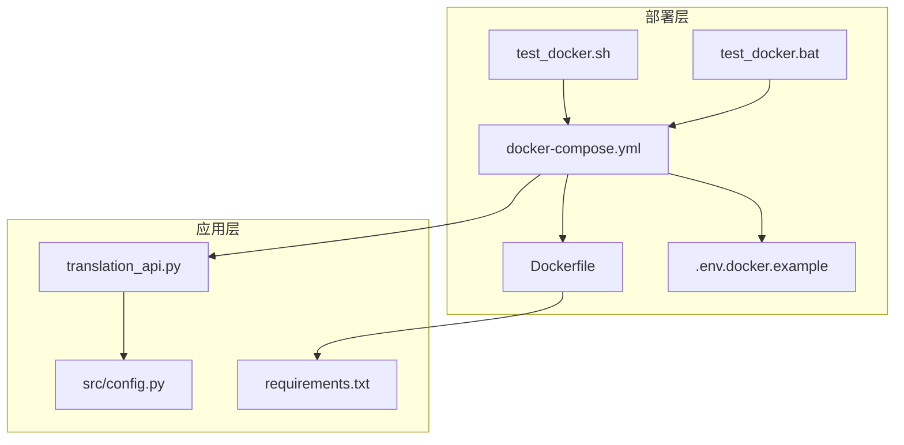
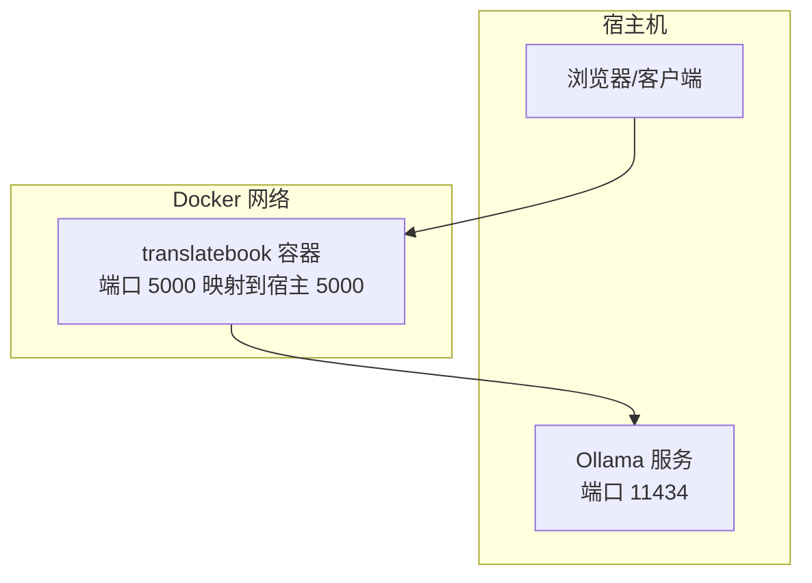
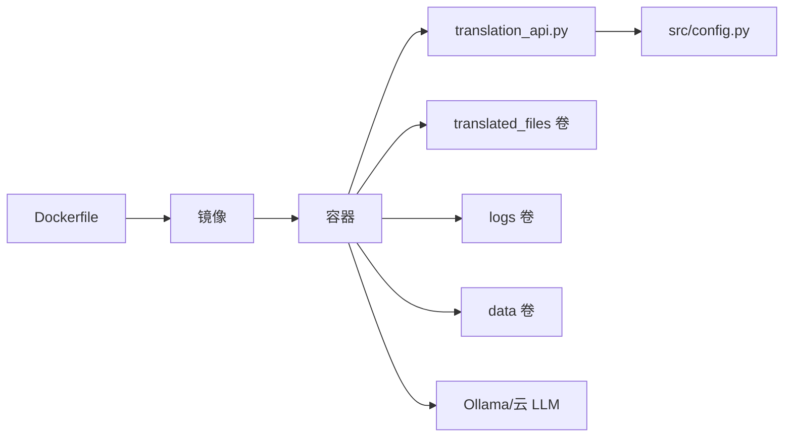

# 部署指南

<cite>
**本文引用的文件**
- [deployment/docker-compose.yml](file://deployment/docker-compose.yml)
- [deployment/Dockerfile](file://deployment/Dockerfile)
- [DOCKER.md](file://DOCKER.md)
- [deployment/.env.docker.example](file://deployment/.env.docker.example)
- [translation_api.py](file://translation_api.py)
- [src/config.py](file://src/config.py)
- [requirements.txt](file://requirements.txt)
- [deployment/test_docker.sh](file://deployment/test_docker.sh)
- [deployment/test_docker.bat](file://deployment/test_docker.bat)
- [docs/DOCKER_DEPLOYMENT.md](file://docs/DOCKER_DEPLOYMENT.md)
- [start.bat](file://start.bat)
</cite>

## 目录
1. [简介](#简介)
2. [项目结构](#项目结构)
3. [核心组件](#核心组件)
4. [架构总览](#架构总览)
5. [详细组件分析](#详细组件分析)
6. [依赖关系分析](#依赖关系分析)
7. [性能考虑](#性能考虑)
8. [故障排查指南](#故障排查指南)
9. [结论](#结论)
10. [附录](#附录)

## 简介
本指南面向需要在本地或容器环境中部署 TranslateBookWithLLM 的用户，涵盖：
- Docker 容器化部署：解释 docker-compose.yml 中各服务定义、端口映射、卷挂载与环境变量传递；提供构建与启动命令；说明如何通过 Docker 网络访问 Ollama 等外部服务。
- 本地部署：列出系统级依赖与 Python 包依赖安装步骤；提供启动命令与浏览器访问方式。
- 性能调优：为 Ollama 分配足够 GPU 内存的建议与配置方法。
- 安全最佳实践：不在生产环境中暴露调试端口，使用 Docker 网络隔离与密钥管理。
- 高级配置：整合 DOCKER.md 中的高级选项（如资源限制、健康检查、日志查看、备份迁移等）。

## 项目结构
该仓库采用“功能模块 + 部署脚本”的组织方式：
- deployment：Docker 构建与编排相关文件（Dockerfile、docker-compose.yml、示例 .env、测试脚本）
- src：应用核心代码（Flask Web 服务、API 路由、WebSocket、翻译引擎、配置与工具）
- 根目录：运行入口脚本、需求清单、示例配置等

图表来源
- [deployment/docker-compose.yml](file://deployment/docker-compose.yml#L1-L69)
- [deployment/Dockerfile](file://deployment/Dockerfile#L1-L35)
- [deployment/.env.docker.example](file://deployment/.env.docker.example#L1-L84)
- [translation_api.py](file://translation_api.py#L1-L146)
- [src/config.py](file://src/config.py#L1-L225)
- [requirements.txt](file://requirements.txt#L1-L12)
- [deployment/test_docker.sh](file://deployment/test_docker.sh#L1-L122)
- [deployment/test_docker.bat](file://deployment/test_docker.bat#L1-L131)

章节来源
- [deployment/docker-compose.yml](file://deployment/docker-compose.yml#L1-L69)
- [deployment/Dockerfile](file://deployment/Dockerfile#L1-L35)
- [translation_api.py](file://translation_api.py#L1-L146)
- [src/config.py](file://src/config.py#L1-L225)

## 核心组件
- Docker 编排与镜像
  - docker-compose.yml 定义了服务名称、镜像构建上下文、端口映射、卷挂载、环境变量与健康检查策略。
  - Dockerfile 指定基础镜像、安装 curl 用于健康检查、复制依赖与源码、创建输出目录、声明端口与健康检查、设置默认 CMD。
- 应用入口与配置
  - translation_api.py 启动 Flask + SocketIO 服务，加载 .env 并进行配置校验，初始化输出目录，注册路由与 WebSocket 处理器。
  - src/config.py 统一从 .env 加载配置项，包括 LLM 提供商、模型、端口、超时、上下文窗口、分块大小、签名开关等。
- 本地启动脚本
  - start.bat 自动检测 Python、创建虚拟环境、安装依赖、生成 .env、创建输出目录、打开浏览器并启动 translation_api.py。

章节来源
- [deployment/docker-compose.yml](file://deployment/docker-compose.yml#L1-L69)
- [deployment/Dockerfile](file://deployment/Dockerfile#L1-L35)
- [translation_api.py](file://translation_api.py#L1-L146)
- [src/config.py](file://src/config.py#L1-L225)
- [start.bat](file://start.bat#L1-L211)

## 架构总览
下图展示了容器化部署的典型拓扑：应用容器通过 Docker 网络访问宿主机上的 Ollama 或独立运行的 Ollama 容器。

图表来源
- [deployment/docker-compose.yml](file://deployment/docker-compose.yml#L1-L69)
- [translation_api.py](file://translation_api.py#L1-L146)

## 详细组件分析

### Docker Compose 服务定义与参数详解
- 服务名称与镜像构建
  - 服务名：translatebook
  - 构建上下文：根目录，Dockerfile 路径为 deployment/Dockerfile
- 容器命名与端口映射
  - 容器名：translatebook-llm
  - 端口映射：将宿主端口 ${PORT:-5000} 映射到容器内 5000
- 卷挂载
  - translated_files：输出翻译结果
  - logs：可选的日志持久化
  - data：必需的持久化数据（检查点、作业历史、上传缓存）
- 环境变量
  - 服务器配置：PORT、HOST、OUTPUT_DIR
  - LLM 提供商：LLM_PROVIDER（ollama/gemini/openai）
  - Ollama 配置：API_ENDPOINT、DEFAULT_MODEL、OLLAMA_NUM_CTX
  - Gemini 配置：GEMINI_API_KEY、GEMINI_MODEL
  - OpenAI 配置：OPENAI_API_KEY、API_ENDPOINT（云厂商兼容接口）
  - 翻译设置：DEFAULT_SOURCE_LANGUAGE、DEFAULT_TARGET_LANGUAGE、MAIN_LINES_PER_CHUNK、MAIN_CHUNK_SIZE、REQUEST_TIMEOUT
  - 上下文管理：AUTO_ADJUST_CONTEXT、MIN_CHUNK_SIZE、MAX_CHUNK_SIZE
  - 高级设置：MAX_TRANSLATION_ATTEMPTS、RETRY_DELAY_SECONDS
  - SRT 特定：SRT_LINES_PER_BLOCK、SRT_MAX_CHARS_PER_BLOCK
- 健康检查
  - 使用 curl 访问 /api/health，间隔 30s，超时 10s，重试 3 次，启动期 40s
- 重启策略
  - unless-stopped
- Linux 访问宿主 Ollama 的替代方案
  - 可取消注释 extra_hosts，将 host.docker.internal 解析到 host-gateway

章节来源
- [deployment/docker-compose.yml](file://deployment/docker-compose.yml#L1-L69)

### Dockerfile 构建流程
- 基础镜像：python:3.9-slim
- 工作目录：/app
- 环境变量：PYTHONDONTWRITEBYTECODE、PYTHONUNBUFFERED
- 安装 curl 用于健康检查
- 复制 requirements.txt 并安装依赖
- 复制项目源码
- 创建必要目录：translated_files、logs、data/uploads
- ARG/ENV 设置默认端口 5000，EXPOSE 5000
- 声明卷：translated_files、logs、data
- 健康检查：curl -f http://localhost:5000/api/health || exit 1
- 默认 CMD：python translation_api.py

章节来源
- [deployment/Dockerfile](file://deployment/Dockerfile#L1-L35)

### 应用启动与配置加载
- translation_api.py
  - 初始化 Flask + SocketIO，启用 CORS
  - 校验配置：PORT、DEFAULT_MODEL、API_ENDPOINT 必填
  - 确保 OUTPUT_DIR 存在
  - 注册路由与 WebSocket 处理器
  - 启动前恢复未完成作业
  - 生产建议：绑定 0.0.0.0 时使用 WSGI（如 gunicorn）以提升稳定性
  - 运行：socketio.run(app, debug=False, host=HOST, port=PORT)
- src/config.py
  - 从 .env 加载配置，含默认值
  - 关键项：API_ENDPOINT、DEFAULT_MODEL、PORT、HOST、OUTPUT_DIR、LLM_PROVIDER、GEMINI_API_KEY、OPENAI_API_KEY、REQUEST_TIMEOUT、OLLAMA_NUM_CTX、AUTO_ADJUST_CONTEXT、MIN/MAX_CHUNK_SIZE、SRT_*、SIGNATURE_ENABLED、DEFAULT_SOURCE/TARGET_LANGUAGE

章节来源
- [translation_api.py](file://translation_api.py#L1-L146)
- [src/config.py](file://src/config.py#L1-L225)

### 本地部署步骤
- 系统依赖
  - Python 3.8+（推荐使用 venv 创建虚拟环境）
  - Git（可选，用于更新代码）
- 安装 Python 依赖
  - 在项目根目录执行：pip install -r requirements.txt
- 准备配置
  - 复制 .env.example 为 .env，并按需编辑（LLM 提供商、模型、端口、超时等）
- 启动应用
  - Windows：双击 start.bat，自动创建虚拟环境、安装依赖、生成 .env、创建输出目录、打开浏览器并启动
  - Linux/macOS：在 venv 中激活后，执行 python translation_api.py
- 访问
  - 浏览器打开 http://localhost:5000

章节来源
- [requirements.txt](file://requirements.txt#L1-L12)
- [start.bat](file://start.bat#L1-L211)
- [translation_api.py](file://translation_api.py#L1-L146)
- [src/config.py](file://src/config.py#L1-L225)

### Docker 网络访问 Ollama
- 方案一：宿主机 Ollama（Windows/Mac/Linux）
  - Windows/Mac：API_ENDPOINT 使用 host.docker.internal:11434
  - Linux：可使用宿主 IP 地址，或在 docker-compose.yml 中取消注释 extra_hosts 将 host.docker.internal 指向 host-gateway
- 方案二：独立运行 Ollama 容器
  - 在同一 docker-compose.yml 中新增 ollama 服务，端口 11434 暴露给宿主
  - translatebook 服务通过服务名 ollama 访问 API_ENDPOINT=http://ollama:11434/api/generate
  - 使用 depends_on 确保 Ollama 先启动

章节来源
- [deployment/docker-compose.yml](file://deployment/docker-compose.yml#L1-L69)
- [DOCKER.md](file://DOCKER.md#L127-L167)

### 构建与启动容器命令
- 使用预构建镜像（快速体验）
  - 拉取镜像：docker pull ghcr.io/hydropix/translatebookwithllm:latest
  - 运行容器：docker run -d -p 5000:5000 -v $(pwd)/translated_files:/app/translated_files -v $(pwd)/logs:/app/logs -e API_ENDPOINT=http://host.docker.internal:11434/api/generate -e DEFAULT_MODEL=qwen3:14b ghcr.io/hydropix/translatebookwithllm:latest
- 使用自定义镜像（开发/定制）
  - 构建镜像：docker build -f deployment/Dockerfile -t translatebookwithllm_translatebook .
  - 启动容器：docker run -d -p 5000:5000 -v ./translated_files:/app/translated_files -v ./logs:/app/logs -v ./data:/app/data translatebookwithlllm_translatebook
- 使用 docker-compose（推荐）
  - 构建并后台启动：docker-compose up -d
  - 查看日志：docker-compose logs -f
  - 查看健康状态：docker-compose ps

章节来源
- [DOCKER.md](file://DOCKER.md#L9-L24)
- [DOCKER.md](file://DOCKER.md#L35-L84)
- [DOCKER.md](file://DOCKER.md#L237-L252)
- [deployment/docker-compose.yml](file://deployment/docker-compose.yml#L1-L69)
- [deployment/Dockerfile](file://deployment/Dockerfile#L1-L35)

### 健康检查与可用性验证
- 健康检查端点：/api/health
- docker-compose 健康检查已内置，也可手动 curl 验证
- 测试脚本
  - Linux：./deployment/test_docker.sh
  - Windows：deployment/test_docker.bat

章节来源
- [deployment/docker-compose.yml](file://deployment/docker-compose.yml#L56-L63)
- [translation_api.py](file://translation_api.py#L1-L146)
- [deployment/test_docker.sh](file://deployment/test_docker.sh#L1-L122)
- [deployment/test_docker.bat](file://deployment/test_docker.bat#L1-L131)

## 依赖关系分析
- 组件耦合
  - translation_api.py 依赖 src/config.py 获取运行时配置
  - Dockerfile 依赖 requirements.txt 安装 Python 依赖
  - docker-compose.yml 依赖 Dockerfile 构建镜像，并通过环境变量与卷挂载连接应用与外部服务
- 外部依赖
  - Ollama（本地或容器）、Gemini、OpenAI（云提供商）
  - Docker 与 Docker Compose

图表来源
- [deployment/Dockerfile](file://deployment/Dockerfile#L1-L35)
- [translation_api.py](file://translation_api.py#L1-L146)
- [src/config.py](file://src/config.py#L1-L225)
- [deployment/docker-compose.yml](file://deployment/docker-compose.yml#L1-L69)

## 性能考虑
- 上下文窗口与分块
  - 增大 OLLAMA_NUM_CTX 与 MAIN_LINES_PER_CHUNK 可提升长文本翻译质量，但会增加请求耗时
  - 开启 AUTO_ADJUST_CONTEXT 并设置 MIN/MAX_CHUNK_SIZE，让系统根据提示长度自动优化
- 超时与重试
  - 对慢模型或大文件，适当提高 REQUEST_TIMEOUT
  - 合理设置 MAX_TRANSLATION_ATTEMPTS 与 RETRY_DELAY_SECONDS
- 资源限制
  - 在 docker-compose.yml 中使用 deploy.resources 限制 CPU 与内存，避免资源争用
- GPU 内存分配（Ollama）
  - 在宿主机上为 Ollama 分配足够显存，确保模型加载成功且推理稳定
  - 可通过 Ollama 的环境变量或配置文件调整 GPU 内存上限
- 生产建议
  - 使用 WSGI（如 gunicorn）托管 Flask，避免直接使用 Werkzeug 的开发模式

章节来源
- [src/config.py](file://src/config.py#L1-L225)
- [docs/DOCKER_DEPLOYMENT.md](file://docs/DOCKER_DEPLOYMENT.md#L590-L618)
- [translation_api.py](file://translation_api.py#L1-L146)

## 故障排查指南
- 容器无法启动
  - 查看日志：docker-compose logs
  - 确认端口未被占用；修改 .env 中 PORT
  - 确认 .env 文件存在且权限正确
- 无法连接 Ollama
  - Windows/Mac：确认 API_ENDPOINT 使用 host.docker.internal
  - Linux：使用宿主 IP 或启用 extra_hosts
  - 在宿主机验证 Ollama 是否监听 0.0.0.0:11434
  - 可通过 curl http://localhost:11434/api/tags 检查模型列表
- 权限问题（Linux）
  - 修改挂载目录权限或以用户映射运行容器
- 健康检查失败
  - 使用 docker inspect 查看健康状态
  - 手动 curl http://localhost:5000/api/health 验证
- 数据丢失或损坏
  - 备份 data 目录（jobs.db、uploads）
  - 迁移时先停止容器，再迁移 data 与 .env

章节来源
- [docs/DOCKER_DEPLOYMENT.md](file://docs/DOCKER_DEPLOYMENT.md#L372-L470)
- [DOCKER.md](file://DOCKER.md#L216-L236)

## 结论
通过本指南，您可以在本地或容器环境中快速部署 TranslateBookWithLLM，并根据实际场景选择合适的 LLM 提供商与性能参数。建议在生产环境使用 WSGI 服务器、Docker 网络隔离与密钥管理，并定期备份 data 目录以保障数据安全与可恢复性。

## 附录

### Docker 高级配置与运维要点（摘自 DOCKER.md）
- 多平台支持：镜像支持 linux/amd64 与 linux/arm64
- 环境变量参考：API_ENDPOINT、DEFAULT_MODEL、LLM_PROVIDER、GEMINI_API_KEY、OPENAI_API_KEY、PORT、OLLAMA_NUM_CTX、REQUEST_TIMEOUT、MAIN_LINES_PER_CHUNK、SIGNATURE_ENABLED 等
- 卷挂载建议：translated_files、logs、data
- 健康检查：内置 /api/health
- 日志查看：docker logs 或查看应用日志文件
- 故障排查：容器启动失败、无法连接 Ollama、权限问题
- 自定义镜像：docker build -f deployment/Dockerfile -t my-custom-translator .
- 安全建议：不要提交 .env；使用 Docker 网络隔离；最小权限挂载；定期更新镜像
- 镜像来源：GitHub Container Registry，支持 latest、语义版本、main-<sha> 等标签
- CI/CD：GitHub Actions 自动构建与发布

章节来源
- [DOCKER.md](file://DOCKER.md#L1-L293)

### 本地部署命令速查
- Windows：双击 start.bat
- Linux/macOS：在 venv 中执行 python translation_api.py
- 访问：http://localhost:5000

章节来源
- [start.bat](file://start.bat#L1-L211)
- [translation_api.py](file://translation_api.py#L1-L146)