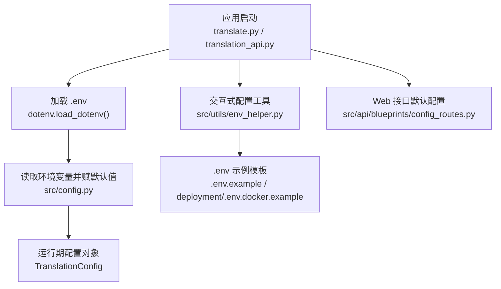
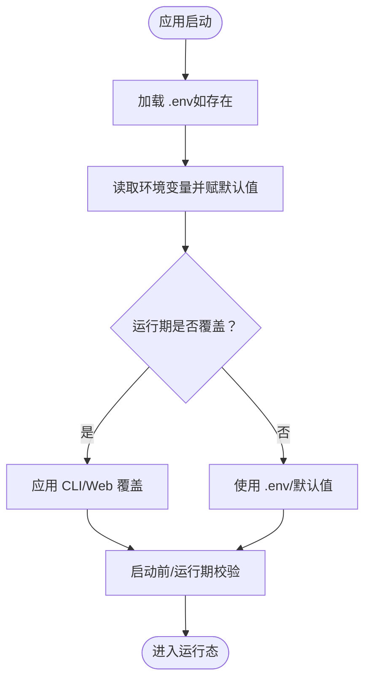
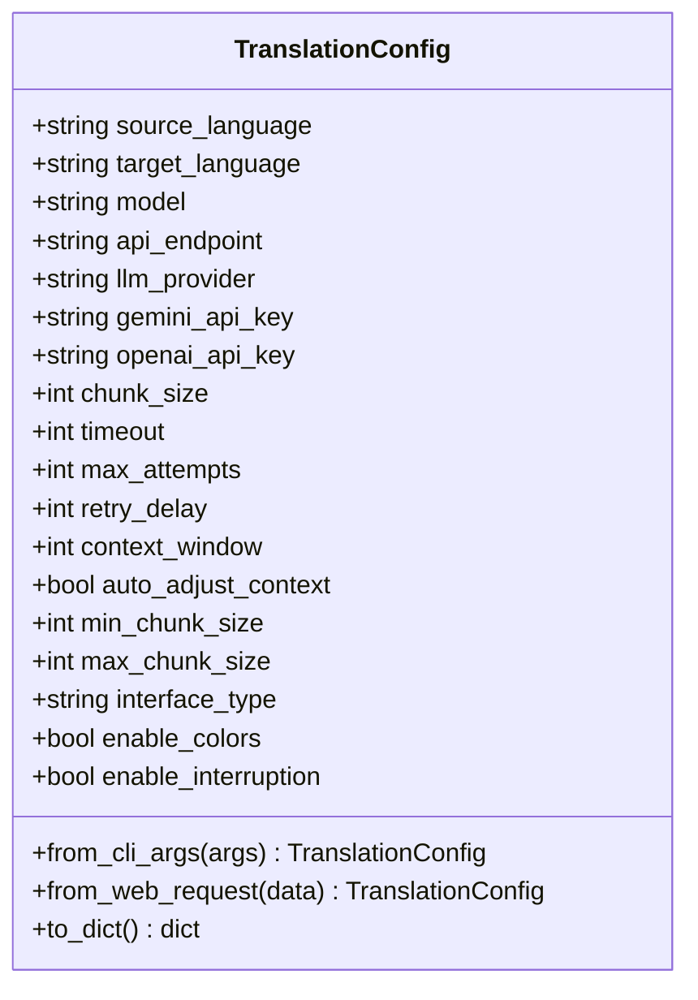
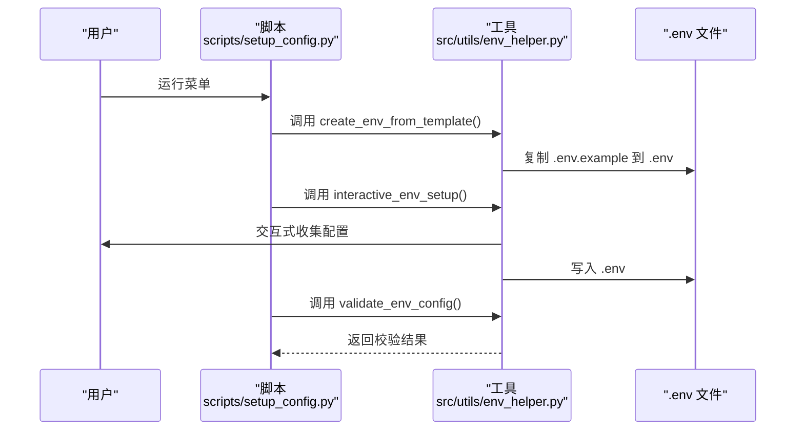
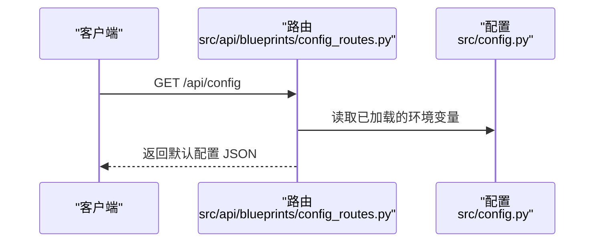
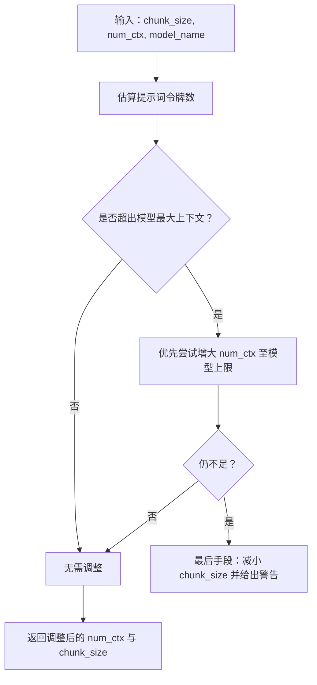
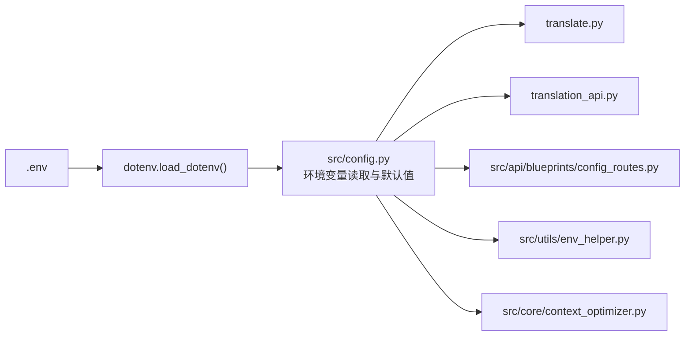

# 配置管理

<cite>
**本文引用的文件**
- [src/config.py](file://src/config.py)
- [src/utils/env_helper.py](file://src/utils/env_helper.py)
- [.env.example](file://.env.example)
- [deployment/.env.docker.example](file://deployment/.env.docker.example)
- [scripts/setup_config.py](file://scripts/setup_config.py)
- [src/api/blueprints/config_routes.py](file://src/api/blueprints/config_routes.py)
- [src/core/context_optimizer.py](file://src/core/context_optimizer.py)
- [translate.py](file://translate.py)
- [translation_api.py](file://translation_api.py)
</cite>

## 目录
1. [简介](#简介)
2. [项目结构与配置入口](#项目结构与配置入口)
3. [核心配置项总览](#核心配置项总览)
4. [架构概览：配置加载与优先级](#架构概览配置加载与优先级)
5. [详细组件解析](#详细组件解析)
6. [依赖关系分析](#依赖关系分析)
7. [性能与稳定性考量](#性能与稳定性考量)
8. [故障排查指南](#故障排查指南)
9. [结论](#结论)
10. [附录：环境变量清单与最佳实践](#附录环境变量清单与最佳实践)

## 简介
本指南是 TranslateBookWithLLM 的“单一事实来源”，系统化梳理了配置体系，包括：
- 所有配置项的默认值、数据类型与业务含义
- 环境变量（.env 文件）如何覆盖默认值
- 通过 env_helper.py 进行交互式配置设置的流程
- 配置加载优先级与验证机制
- 生产与开发环境的差异建议与不安全配置组合警示

## 项目结构与配置入口
- 配置集中定义于 src/config.py，采用环境变量读取与默认值结合的方式，支持 .env 文件覆盖。
- 启动时会尝试加载 .env；若不存在则打印提示并继续使用默认值。
- 提供交互式配置工具 src/utils/env_helper.py，支持从模板复制、校验与向导式设置。
- Web 接口通过 src/api/blueprints/config_routes.py 暴露默认配置查询接口。
- 命令行入口 translate.py 与服务端 translation_api.py 在启动前进行必要的配置校验。

图表来源
- [src/config.py](file://src/config.py#L54-L116)
- [src/utils/env_helper.py](file://src/utils/env_helper.py#L1-L116)
- [src/api/blueprints/config_routes.py](file://src/api/blueprints/config_routes.py#L55-L72)
- [translate.py](file://translate.py#L1-L120)
- [translation_api.py](file://translation_api.py#L50-L86)

章节来源
- [src/config.py](file://src/config.py#L1-L116)
- [src/utils/env_helper.py](file://src/utils/env_helper.py#L1-L116)
- [src/api/blueprints/config_routes.py](file://src/api/blueprints/config_routes.py#L55-L72)
- [translate.py](file://translate.py#L1-L120)
- [translation_api.py](file://translation_api.py#L50-L86)

## 核心配置项总览
以下为所有可配置项的汇总，包含默认值、数据类型与业务含义（节选）：

- 服务器与网络
  - PORT：整数，默认 5000，Web 服务端口
  - HOST：字符串，默认 127.0.0.1，绑定地址
  - OUTPUT_DIR：字符串，默认 translated_files，输出目录

- LLM 提供商与模型
  - LLM_PROVIDER：字符串，默认 ollama，可选 ollama/gemini/openai
  - API_ENDPOINT：字符串，默认 http://localhost:11434/api/generate
  - DEFAULT_MODEL：字符串，默认 qwen3:14b
  - GEMINI_API_KEY：字符串（可空）
  - GEMINI_MODEL：字符串，默认 gemini-2.0-flash
  - OPENAI_API_KEY：字符串（可空）

- 翻译参数
  - DEFAULT_SOURCE_LANGUAGE：字符串，默认 English
  - DEFAULT_TARGET_LANGUAGE：字符串，默认 Chinese
  - MAIN_LINES_PER_CHUNK：整数，默认 25，目标每块行数（可能自动调整）
  - REQUEST_TIMEOUT：整数，默认 900，请求超时秒数
  - SRT_LINES_PER_BLOCK：整数，默认 5
  - SRT_MAX_CHARS_PER_BLOCK：整数，默认 500

- 上下文与分块优化
  - OLLAMA_NUM_CTX：整数，默认 2048 或示例模板中的 8192，上下文窗口（令牌）
  - AUTO_ADJUST_CONTEXT：布尔，默认 true，是否自动调整上下文/分块
  - MIN_CHUNK_SIZE：整数，默认 5
  - MAX_CHUNK_SIZE：整数，默认 100

- 重试与签名
  - MAX_TRANSLATION_ATTEMPTS：整数，默认 2
  - RETRY_DELAY_SECONDS：整数，默认 2
  - SIGNATURE_ENABLED：布尔，默认 true，是否在输出中添加项目署名

- 其他
  - TRANSLATE_TAG_IN/OUT、INPUT_TAG_IN/OUT：标记用于翻译处理
  - SENTENCE_TERMINATORS：标点符号集合
  - NAMESPACES、IGNORED_TAGS_EPUB、CONTENT_BLOCK_TAGS_EPUB：EPUB 处理相关

章节来源
- [src/config.py](file://src/config.py#L56-L116)
- [.env.example](file://.env.example#L1-L45)
- [deployment/.env.docker.example](file://deployment/.env.docker.example#L1-L84)

## 架构概览：配置加载与优先级
- 加载顺序
  1) 应用启动时尝试加载 .env（dotenv.load_dotenv）
  2) 读取环境变量，未设置则使用代码中的默认值
  3) 运行期可通过 CLI/Web 请求覆盖部分配置（例如 chunk_size、timeout、context_window 等）
- 优先级
  - 运行期覆盖 > .env 覆盖 > 代码默认值
  - Web 接口会返回当前生效的默认配置（来自 .env），但客户端可发送请求覆盖
- 验证机制
  - 启动前校验关键配置（端口、模型、端点等）
  - CLI 在使用 Ollama 时对上下文与分块进行风险评估与提示
  - env_helper 提供配置校验与交互式设置

图表来源
- [src/config.py](file://src/config.py#L54-L116)
- [translate.py](file://translate.py#L80-L102)
- [translation_api.py](file://translation_api.py#L50-L86)
- [src/utils/env_helper.py](file://src/utils/env_helper.py#L41-L116)

章节来源
- [src/config.py](file://src/config.py#L54-L116)
- [translate.py](file://translate.py#L80-L102)
- [translation_api.py](file://translation_api.py#L50-L86)
- [src/utils/env_helper.py](file://src/utils/env_helper.py#L41-L116)

## 详细组件解析

### 组件一：集中式配置与运行期对象
- 集中式配置
  - 通过 os.getenv 读取环境变量，未设置则使用代码默认值
  - 关键配置项包括服务器、LLM 提供商、翻译参数、上下文与分块优化、重试与签名等
- 运行期对象 TranslationConfig
  - 提供 from_cli_args 与 from_web_request 两种工厂方法，将 CLI/Web 输入映射到统一配置对象
  - 支持 to_dict 序列化，便于接口传递

图表来源
- [src/config.py](file://src/config.py#L137-L225)

章节来源
- [src/config.py](file://src/config.py#L56-L116)
- [src/config.py](file://src/config.py#L137-L225)

### 组件二：交互式配置工具 env_helper.py
- 功能
  - 从 .env.example 创建 .env（可强制覆盖）
  - 校验当前配置（检查提供商密钥、远程 Ollama 警告、默认值使用提示）
  - 交互式向导：按提示收集 LLM 提供商、端点、模型、端口、语言、上下文等配置，生成 .env
- 使用方式
  - 脚本入口 scripts/setup_config.py 提供菜单式快速设置
  - 可直接调用 env_helper 的 create/validate/setup 子命令

图表来源
- [scripts/setup_config.py](file://scripts/setup_config.py#L1-L89)
- [src/utils/env_helper.py](file://src/utils/env_helper.py#L9-L239)

章节来源
- [scripts/setup_config.py](file://scripts/setup_config.py#L1-L89)
- [src/utils/env_helper.py](file://src/utils/env_helper.py#L9-L239)

### 组件三：Web 接口默认配置与健康检查
- 默认配置接口
  - GET /api/config 返回当前生效的默认配置（来自 .env），包括端点、模型、分块、超时、上下文、语言等
- 健康检查
  - GET /api/health 返回服务状态与默认端点信息

图表来源
- [src/api/blueprints/config_routes.py](file://src/api/blueprints/config_routes.py#L55-L72)

章节来源
- [src/api/blueprints/config_routes.py](file://src/api/blueprints/config_routes.py#L34-L72)

### 组件四：上下文优化与配置校验
- 自动上下文优化
  - 基于 tiktoken 或字符估算计算提示词令牌数，结合模型最大上下文与安全余量，动态调整 num_ctx 与 chunk_size
  - 提供 validate_configuration 对配置进行风险提示与建议
- CLI 启动校验
  - 当使用 Ollama 时，启动阶段对配置进行评估，必要时提示用户确认或启用自动调整

图表来源
- [src/core/context_optimizer.py](file://src/core/context_optimizer.py#L176-L252)
- [src/core/context_optimizer.py](file://src/core/context_optimizer.py#L254-L310)
- [translate.py](file://translate.py#L80-L102)

章节来源
- [src/core/context_optimizer.py](file://src/core/context_optimizer.py#L1-L321)
- [translate.py](file://translate.py#L80-L102)

## 依赖关系分析
- 配置被多处模块共享使用：
  - translate.py：命令行入口，读取默认配置并进行启动前校验
  - translation_api.py：服务端入口，启动前校验关键配置并确保输出目录存在
  - src/api/blueprints/config_routes.py：Web 接口返回默认配置
  - src/utils/env_helper.py：交互式配置与校验
  - src/core/context_optimizer.py：上下文优化与配置校验
- 配置加载路径
  - 启动时 dotenv.load_dotenv() 使 .env 生效
  - 运行期可通过 CLI/Web 覆盖部分字段（如 chunk_size、timeout、context_window 等）

图表来源
- [src/config.py](file://src/config.py#L54-L116)
- [translate.py](file://translate.py#L1-L120)
- [translation_api.py](file://translation_api.py#L28-L86)
- [src/api/blueprints/config_routes.py](file://src/api/blueprints/config_routes.py#L55-L72)
- [src/utils/env_helper.py](file://src/utils/env_helper.py#L41-L116)
- [src/core/context_optimizer.py](file://src/core/context_optimizer.py#L1-L321)

章节来源
- [src/config.py](file://src/config.py#L54-L116)
- [translate.py](file://translate.py#L1-L120)
- [translation_api.py](file://translation_api.py#L28-L86)
- [src/api/blueprints/config_routes.py](file://src/api/blueprints/config_routes.py#L55-L72)
- [src/utils/env_helper.py](file://src/utils/env_helper.py#L41-L116)
- [src/core/context_optimizer.py](file://src/core/context_optimizer.py#L1-L321)

## 性能与稳定性考量
- 分块大小与上下文窗口
  - MAIN_LINES_PER_CHUNK 控制每块行数，影响吞吐与稳定性
  - OLLAMA_NUM_CTX 决定模型上下文窗口，需与 chunk_size 匹配
  - AUTO_ADJUST_CONTEXT=true 时，系统会在提示过大时自动调整 num_ctx 或减小 chunk_size
- 超时与重试
  - REQUEST_TIMEOUT 与 MAX_TRANSLATION_ATTEMPTS/RETRY_DELAY_SECONDS 影响长文本翻译的稳定性
- 模型选择
  - 不同模型家族的最大上下文不同，应据此设置 OLLAMA_NUM_CTX
- 输出目录
  - OUTPUT_DIR 必须存在且可写，否则服务启动失败

章节来源
- [src/config.py](file://src/config.py#L56-L116)
- [src/core/context_optimizer.py](file://src/core/context_optimizer.py#L156-L252)
- [translation_api.py](file://translation_api.py#L78-L86)

## 故障排查指南
- 启动时报错“配置错误”
  - 检查 PORT、DEFAULT_MODEL、API_ENDPOINT 是否正确设置
  - 使用 scripts/setup_config.py 或 src/utils/env_helper.py 的 validate 命令进行校验
- 使用 Gemini/OpenAI 时报错缺少密钥
  - 设置对应 PROVIDER_API_KEY（GEMINI_API_KEY 或 OPENAI_API_KEY）
- 使用远程 Ollama 时连接失败
  - 确认 API_ENDPOINT 正确，且 Ollama 已启动
- 上下文不足导致翻译失败或截断
  - 提升 OLLAMA_NUM_CTX 或减小 MAIN_LINES_PER_CHUNK
  - 启用 AUTO_ADJUST_CONTEXT 让系统自动调整
- Web 接口无法访问
  - 检查 HOST/PORT，确认防火墙与容器网络映射（Docker 环境参考 deployment/.env.docker.example）

章节来源
- [translation_api.py](file://translation_api.py#L50-L86)
- [src/utils/env_helper.py](file://src/utils/env_helper.py#L41-L116)
- [deployment/.env.docker.example](file://deployment/.env.docker.example#L1-L84)

## 结论
本指南明确了配置的来源、覆盖与验证机制，提供了从模板到校验再到自动调整的完整流程。建议在生产环境中：
- 明确区分开发与生产 .env，严格管理密钥
- 启用 AUTO_ADJUST_CONTEXT 并结合实际模型最大上下文合理设置 OLLAMA_NUM_CTX
- 使用 scripts/setup_config.py 或 env_helper 的 validate 命令定期检查配置

## 附录：环境变量清单与最佳实践

### 环境变量清单（按类别）
- 服务器与网络
  - PORT：整数，默认 5000
  - HOST：字符串，默认 127.0.0.1
  - OUTPUT_DIR：字符串，默认 translated_files

- LLM 提供商与模型
  - LLM_PROVIDER：字符串，默认 ollama，可选 ollama/gemini/openai
  - API_ENDPOINT：字符串，默认 http://localhost:11434/api/generate
  - DEFAULT_MODEL：字符串，默认 qwen3:14b
  - GEMINI_API_KEY：字符串（可空）
  - GEMINI_MODEL：字符串，默认 gemini-2.0-flash
  - OPENAI_API_KEY：字符串（可空）

- 翻译参数
  - DEFAULT_SOURCE_LANGUAGE：字符串，默认 English
  - DEFAULT_TARGET_LANGUAGE：字符串，默认 Chinese
  - MAIN_LINES_PER_CHUNK：整数，默认 25
  - REQUEST_TIMEOUT：整数，默认 900
  - SRT_LINES_PER_BLOCK：整数，默认 5
  - SRT_MAX_CHARS_PER_BLOCK：整数，默认 500

- 上下文与分块优化
  - OLLAMA_NUM_CTX：整数，默认 2048 或示例模板中的 8192
  - AUTO_ADJUST_CONTEXT：布尔，默认 true
  - MIN_CHUNK_SIZE：整数，默认 5
  - MAX_CHUNK_SIZE：整数，默认 100

- 重试与签名
  - MAX_TRANSLATION_ATTEMPTS：整数，默认 2
  - RETRY_DELAY_SECONDS：整数，默认 2
  - SIGNATURE_ENABLED：布尔，默认 true

- 其他
  - TRANSLATE_TAG_IN/OUT、INPUT_TAG_IN/OUT：标记
  - SENTENCE_TERMINATORS：标点集合
  - NAMESPACES、IGNORED_TAGS_EPUB、CONTENT_BLOCK_TAGS_EPUB：EPUB 处理相关

章节来源
- [src/config.py](file://src/config.py#L56-L116)
- [.env.example](file://.env.example#L1-L45)
- [deployment/.env.docker.example](file://deployment/.env.docker.example#L1-L84)

### 开发与生产环境建议
- 开发环境
  - 使用本地 Ollama（默认端点），保持 DEFAULT_MODEL 与本地已安装模型一致
  - 可临时降低 OLLAMA_NUM_CTX 以测试较小上下文场景
- 生产环境
  - 使用稳定的 API_ENDPOINT 与密钥管理（如外部密钥服务）
  - 将 HOST 绑定到 0.0.0.0 时务必配合反向代理与 WSGI 服务器（如 gunicorn）
  - 启用 AUTO_ADJUST_CONTEXT 并根据模型族设置合适的 OLLAMA_NUM_CTX
  - 定期通过 scripts/setup_config.py 或 env_helper 的 validate 命令检查配置

### 不安全配置组合警示
- 将 HOST 设为 0.0.0.0 且未做网络隔离与认证，可能导致未授权访问
- 在 .env 中明文存储 API 密钥，未进行权限控制与轮换
- 使用过小的 OLLAMA_NUM_CTX 且未启用 AUTO_ADJUST_CONTEXT，易导致翻译失败或截断
- 使用默认端点但未部署本地 LLM，导致连接失败

章节来源
- [translation_api.py](file://translation_api.py#L139-L145)
- [src/config.py](file://src/config.py#L56-L116)
- [src/utils/env_helper.py](file://src/utils/env_helper.py#L41-L116)