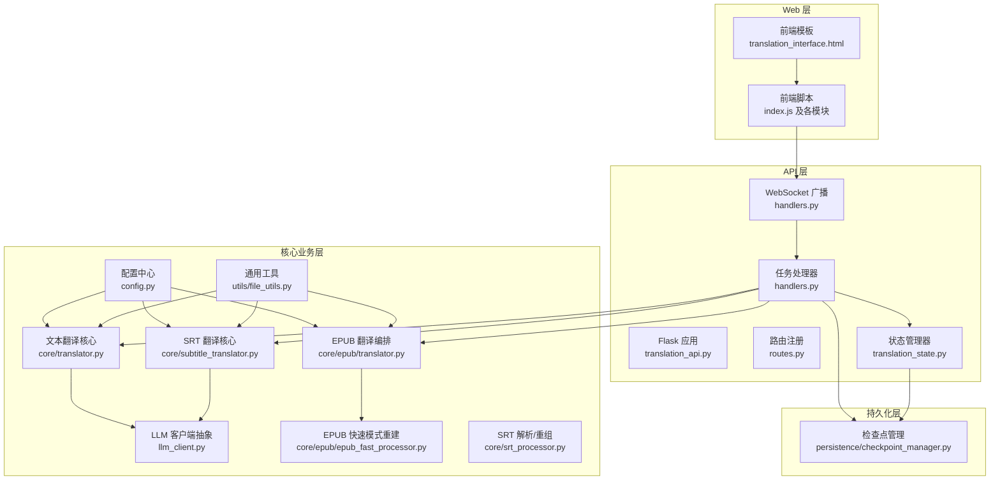
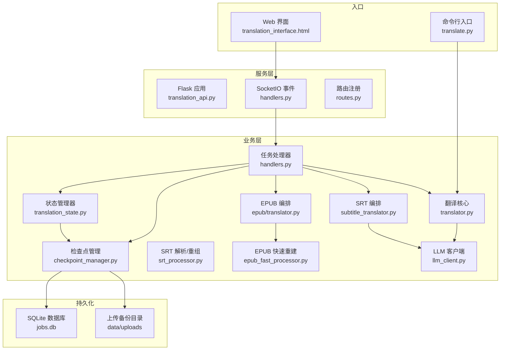
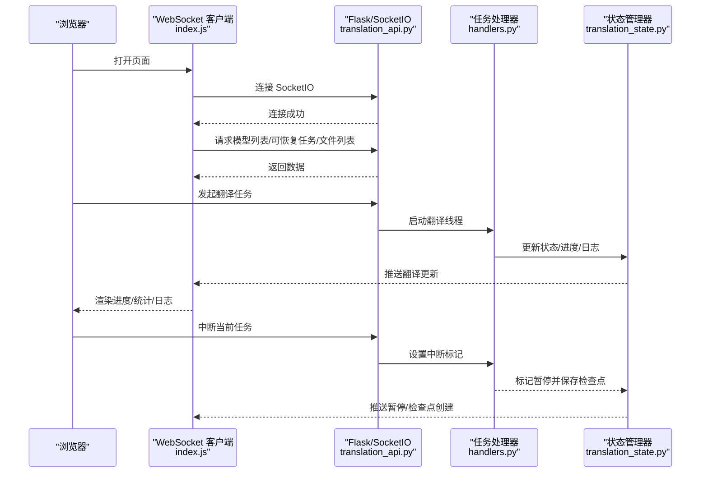
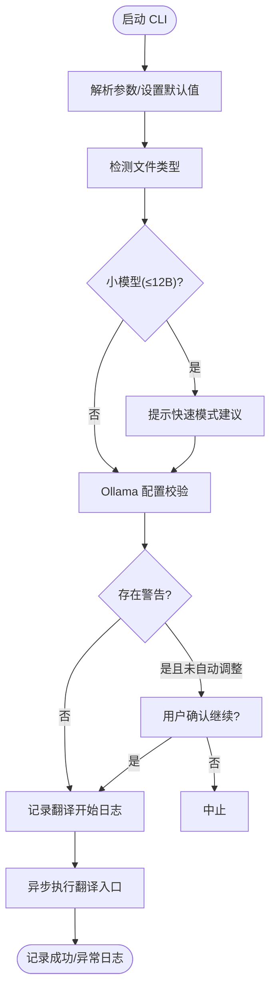
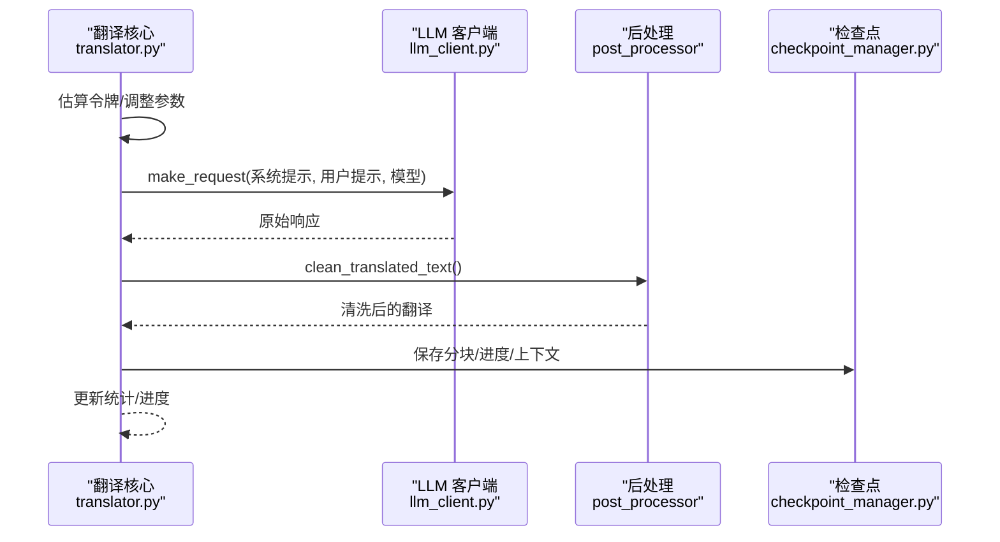
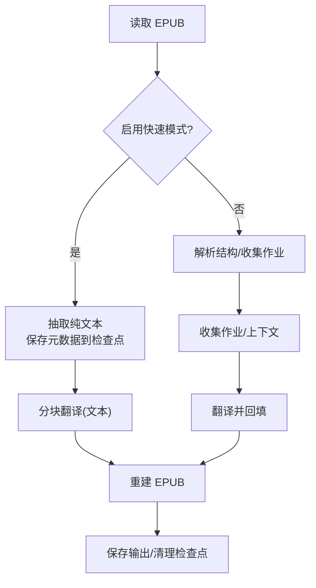
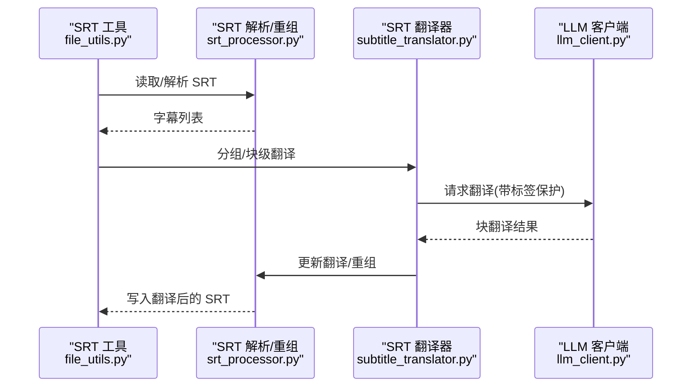
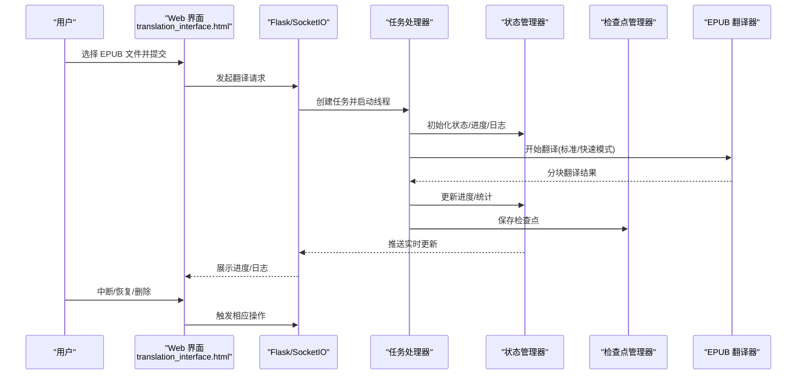
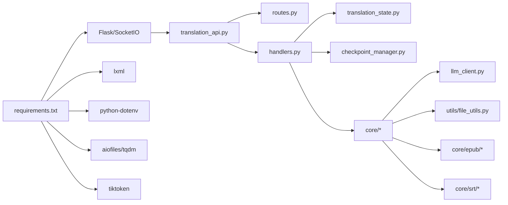
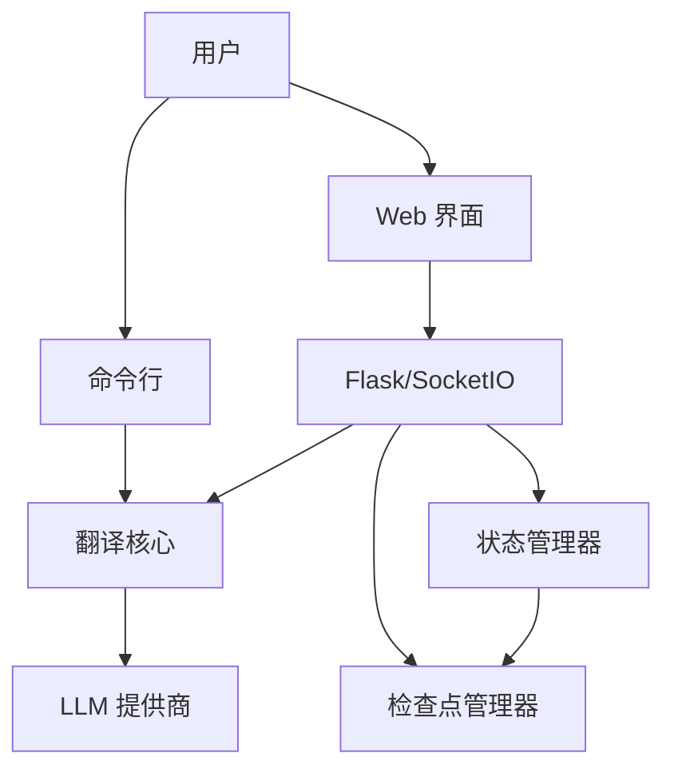

# 项目概述

<cite>
**本文引用的文件列表**
- [translate.py](file://translate.py)
- [translation_api.py](file://translation_api.py)
- [src/config.py](file://src/config.py)
- [requirements.txt](file://requirements.txt)
- [src/core/translator.py](file://src/core/translator.py)
- [src/api/routes.py](file://src/api/routes.py)
- [src/api/handlers.py](file://src/api/handlers.py)
- [src/persistence/checkpoint_manager.py](file://src/persistence/checkpoint_manager.py)
- [src/utils/file_utils.py](file://src/utils/file_utils.py)
- [src/web/static/js/index.js](file://src/web/static/js/index.js)
- [src/web/templates/translation_interface.html](file://src/web/templates/translation_interface.html)
- [src/core/llm_client.py](file://src/core/llm_client.py)
- [src/api/translation_state.py](file://src/api/translation_state.py)
- [src/core/epub/translator.py](file://src/core/epub/translator.py)
- [src/core/epub/epub_fast_processor.py](file://src/core/epub/epub_fast_processor.py)
- [src/core/subtitle_translator.py](file://src/core/subtitle_translator.py)
- [src/core/srt_processor.py](file://src/core/srt_processor.py)
</cite>

## 目录
1. [简介](#简介)
2. [项目结构](#项目结构)
3. [核心组件](#核心组件)
4. [架构总览](#架构总览)
5. [详细组件分析](#详细组件分析)
6. [依赖关系分析](#依赖关系分析)
7. [性能考量](#性能考量)
8. [故障排查指南](#故障排查指南)
9. [结论](#结论)
10. [附录](#附录)

## 简介
TranslateBookWithLLM 是一个基于大型语言模型（LLM）的多格式文本翻译工具，支持 TXT、EPUB、SRT 文件的高质量翻译，强调“格式保持”与“断点续传”。项目提供 Web 界面与 CLI 双模式入口，采用模块化分层架构：Web 层（前端）、API 服务层（Flask + SocketIO）、核心业务逻辑层（翻译编排与 LLM 抽象）、持久化层（SQLite + 文件备份）。系统通过统一配置中心、状态管理器、检查点管理器与日志回调，实现跨接口的一致行为与可观测性；通过 LLM 客户端抽象与上下文优化，适配 Ollama、Gemini、OpenAI 等多种后端。

## 项目结构
项目采用按层与按功能混合的组织方式：
- Web 层：前端模板与静态资源，负责用户交互与实时反馈
- API 层：Flask 路由与 SocketIO 事件，协调任务调度与状态广播
- 核心业务层：翻译编排、EPUB/SRT 处理、LLM 客户端抽象、上下文优化
- 持久化层：SQLite 数据库存储任务与检查点，文件系统备份输入源

图表来源
- [translation_api.py](file://translation_api.py#L1-L146)
- [src/api/routes.py](file://src/api/routes.py#L1-L66)
- [src/api/handlers.py](file://src/api/handlers.py#L1-L452)
- [src/api/translation_state.py](file://src/api/translation_state.py#L1-L225)
- [src/config.py](file://src/config.py#L1-L225)
- [src/core/llm_client.py](file://src/core/llm_client.py#L1-L123)
- [src/core/translator.py](file://src/core/translator.py#L1-L371)
- [src/core/epub/translator.py](file://src/core/epub/translator.py#L1-L790)
- [src/core/epub/epub_fast_processor.py](file://src/core/epub/epub_fast_processor.py#L1-L369)
- [src/core/subtitle_translator.py](file://src/core/subtitle_translator.py#L1-L377)
- [src/core/srt_processor.py](file://src/core/srt_processor.py#L1-L124)
- [src/utils/file_utils.py](file://src/utils/file_utils.py#L1-L405)
- [src/persistence/checkpoint_manager.py](file://src/persistence/checkpoint_manager.py#L1-L528)

章节来源
- [translation_api.py](file://translation_api.py#L1-L146)
- [src/api/routes.py](file://src/api/routes.py#L1-L66)
- [src/api/handlers.py](file://src/api/handlers.py#L1-L452)
- [src/api/translation_state.py](file://src/api/translation_state.py#L1-L225)
- [src/config.py](file://src/config.py#L1-L225)
- [src/core/llm_client.py](file://src/core/llm_client.py#L1-L123)
- [src/core/translator.py](file://src/core/translator.py#L1-L371)
- [src/core/epub/translator.py](file://src/core/epub/translator.py#L1-L790)
- [src/core/epub/epub_fast_processor.py](file://src/core/epub/epub_fast_processor.py#L1-L369)
- [src/core/subtitle_translator.py](file://src/core/subtitle_translator.py#L1-L377)
- [src/core/srt_processor.py](file://src/core/srt_processor.py#L1-L124)
- [src/utils/file_utils.py](file://src/utils/file_utils.py#L1-L405)
- [src/persistence/checkpoint_manager.py](file://src/persistence/checkpoint_manager.py#L1-L528)

## 核心组件
- 配置中心（src/config.py）
  - 统一加载 .env，集中管理 LLM 提供商、模型、端点、分块大小、超时、上下文窗口、SRT 块参数、签名开关等
  - 提供从 CLI/Web 请求构造统一配置对象的方法
- 状态管理器（src/api/translation_state.py）
  - 线程安全的内存态，保存任务状态、进度、统计、日志、中断标记
  - 与检查点管理器协作，支持恢复与清理
- 检查点管理器（src/persistence/checkpoint_manager.py）
  - SQLite 存储任务元数据、分块结果、进度、翻译上下文
  - 文件系统备份上传的输入源，便于断点续传与重建输出
- LLM 客户端抽象（src/core/llm_client.py）
  - 工厂函数根据提供商或自定义端点创建客户端
  - 统一请求、提取翻译、关闭资源
- 文本翻译核心（src/core/translator.py）
  - 分块翻译主流程，上下文估计与自动调整，失败回退与清洗
  - 支持快速模式（跳过占位符指令）与断点续传
- EPUB 翻译（src/core/epub/translator.py）
  - 标准模式：结构解析、标签保留、上下文收集、翻译应用
  - 快速模式：纯文本抽取、标准文本翻译、重建 EPUB
- SRT 翻译（src/core/subtitle_translator.py + src/core/srt_processor.py）
  - 解析/合并/重组字幕，块级翻译，严格保留编号与时间轴
- 文件工具（src/utils/file_utils.py）
  - 自动识别格式并调用对应翻译流程，生成唯一输出路径，写入签名
- Web 入口（translation_api.py + routes.py + handlers.py）
  - Flask + SocketIO，REST 路由 + 实时事件，启动时恢复未完成任务
- CLI 入口（translate.py）
  - 参数解析、小模型建议、配置校验、调用统一翻译流程

章节来源
- [src/config.py](file://src/config.py#L1-L225)
- [src/api/translation_state.py](file://src/api/translation_state.py#L1-L225)
- [src/persistence/checkpoint_manager.py](file://src/persistence/checkpoint_manager.py#L1-L528)
- [src/core/llm_client.py](file://src/core/llm_client.py#L1-L123)
- [src/core/translator.py](file://src/core/translator.py#L1-L371)
- [src/core/epub/translator.py](file://src/core/epub/translator.py#L1-L790)
- [src/core/epub/epub_fast_processor.py](file://src/core/epub/epub_fast_processor.py#L1-L369)
- [src/core/subtitle_translator.py](file://src/core/subtitle_translator.py#L1-L377)
- [src/core/srt_processor.py](file://src/core/srt_processor.py#L1-L124)
- [src/utils/file_utils.py](file://src/utils/file_utils.py#L1-L405)
- [translation_api.py](file://translation_api.py#L1-L146)
- [src/api/routes.py](file://src/api/routes.py#L1-L66)
- [src/api/handlers.py](file://src/api/handlers.py#L1-L452)
- [translate.py](file://translate.py#L1-L147)

## 架构总览
系统采用“Web/CLI 双入口 + API 服务 + 核心翻译 + 持久化”的分层设计，组件间通过回调与事件解耦，保证可扩展与可观测性。

图表来源
- [translate.py](file://translate.py#L1-L147)
- [translation_api.py](file://translation_api.py#L1-L146)
- [src/api/routes.py](file://src/api/routes.py#L1-L66)
- [src/api/handlers.py](file://src/api/handlers.py#L1-L452)
- [src/api/translation_state.py](file://src/api/translation_state.py#L1-L225)
- [src/persistence/checkpoint_manager.py](file://src/persistence/checkpoint_manager.py#L1-L528)
- [src/core/translator.py](file://src/core/translator.py#L1-L371)
- [src/core/epub/translator.py](file://src/core/epub/translator.py#L1-L790)
- [src/core/epub/epub_fast_processor.py](file://src/core/epub/epub_fast_processor.py#L1-L369)
- [src/core/subtitle_translator.py](file://src/core/subtitle_translator.py#L1-L377)
- [src/core/srt_processor.py](file://src/core/srt_processor.py#L1-L124)
- [src/core/llm_client.py](file://src/core/llm_client.py#L1-L123)

## 详细组件分析

### Web 界面与实时交互
- 前端入口与模块化组织：index.js 将 UI、表单、文件、翻译、批次、进度、恢复、生命周期等模块整合，通过 WebSocket 接收服务器状态更新
- WebSocket 事件：连接建立后刷新模型列表、加载可恢复任务、刷新文件列表；接收翻译更新、文件列表变更、检查点创建等事件
- 断点续传与恢复：前端展示可恢复任务列表，支持一键恢复与删除检查点

图表来源
- [src/web/static/js/index.js](file://src/web/static/js/index.js#L1-L329)
- [translation_api.py](file://translation_api.py#L1-L146)
- [src/api/handlers.py](file://src/api/handlers.py#L1-L452)
- [src/api/translation_state.py](file://src/api/translation_state.py#L1-L225)

章节来源
- [src/web/templates/translation_interface.html](file://src/web/templates/translation_interface.html#L1-L291)
- [src/web/static/js/index.js](file://src/web/static/js/index.js#L1-L329)
- [translation_api.py](file://translation_api.py#L1-L146)
- [src/api/handlers.py](file://src/api/handlers.py#L1-L452)
- [src/api/translation_state.py](file://src/api/translation_state.py#L1-L225)

### CLI 翻译流程
- 参数解析与默认值：支持输入/输出路径、源/目标语言、模型、分块大小、提供商标识、API 端点、禁用颜色、快速模式等
- 小模型建议：检测模型参数规模，提示 EPUB 快速模式
- 配置校验：Ollama 上下文窗口与分块大小警告，可选择自动调整或确认继续
- 统一日志：统一回调记录开始/结束、LLM 请求/响应、进度、错误等
- 异步执行：调用统一翻译入口，完成后记录成功信息

图表来源
- [translate.py](file://translate.py#L1-L147)
- [src/utils/unified_logger.py](file://src/utils/unified_logger.py#L1-L200)
- [src/utils/file_utils.py](file://src/utils/file_utils.py#L1-L405)

章节来源
- [translate.py](file://translate.py#L1-L147)

### 翻译核心与 LLM 抽象
- 分块翻译主流程：计算分块数量、逐块生成提示、请求 LLM、提取翻译、清洗残留标签、更新统计与检查点
- 上下文优化：在 Ollama 模式下估算令牌数，动态调整上下文窗口与分块大小，给出警告与建议
- 失败回退：当响应缺失翻译标签或包含原文时，进行清洗并保留占位符，避免中断
- LLM 客户端：工厂方法按提供商创建实例，支持 Gemini/OpenAI/Ollama，统一请求与提取

图表来源
- [src/core/translator.py](file://src/core/translator.py#L1-L371)
- [src/core/llm_client.py](file://src/core/llm_client.py#L1-L123)
- [src/persistence/checkpoint_manager.py](file://src/persistence/checkpoint_manager.py#L1-L528)

章节来源
- [src/core/translator.py](file://src/core/translator.py#L1-L371)
- [src/core/llm_client.py](file://src/core/llm_client.py#L1-L123)
- [src/persistence/checkpoint_manager.py](file://src/persistence/checkpoint_manager.py#L1-L528)

### EPUB 翻译（标准模式与快速模式）
- 标准模式：解析 EPUB 结构，收集可翻译内容，保留 HTML/XML 标签，生成占位符，翻译后安全回填，重建文件
- 快速模式：抽取纯文本，按行分块翻译，再以最小结构重建 EPUB，兼容性更强
- 断点续传：保存每个分块翻译结果与翻译上下文，支持从任意索引恢复

图表来源
- [src/core/epub/translator.py](file://src/core/epub/translator.py#L1-L790)
- [src/core/epub/epub_fast_processor.py](file://src/core/epub/epub_fast_processor.py#L1-L369)
- [src/persistence/checkpoint_manager.py](file://src/persistence/checkpoint_manager.py#L1-L528)

章节来源
- [src/core/epub/translator.py](file://src/core/epub/translator.py#L1-L790)
- [src/core/epub/epub_fast_processor.py](file://src/core/epub/epub_fast_processor.py#L1-L369)
- [src/persistence/checkpoint_manager.py](file://src/persistence/checkpoint_manager.py#L1-L528)

### SRT 字幕翻译
- 解析与验证：读取并验证 SRT 格式，提取可翻译文本
- 分组策略：按行数与字符数限制分组，减少上下文溢出
- 块级翻译：为每组生成提示，严格保留编号与时间轴标签，失败回退原字幕
- 重组输出：按原始顺序重建 SRT，添加可选签名注释

图表来源
- [src/utils/file_utils.py](file://src/utils/file_utils.py#L1-L405)
- [src/core/srt_processor.py](file://src/core/srt_processor.py#L1-L124)
- [src/core/subtitle_translator.py](file://src/core/subtitle_translator.py#L1-L377)
- [src/core/llm_client.py](file://src/core/llm_client.py#L1-L123)

章节来源
- [src/utils/file_utils.py](file://src/utils/file_utils.py#L1-L405)
- [src/core/srt_processor.py](file://src/core/srt_processor.py#L1-L124)
- [src/core/subtitle_translator.py](file://src/core/subtitle_translator.py#L1-L377)
- [src/core/llm_client.py](file://src/core/llm_client.py#L1-L123)

### 典型使用场景：上传 EPUB 文件进行翻译
- Web 界面选择 EPUB 文件，填写语言、模型、分块大小等参数
- 服务器启动翻译任务线程，状态管理器记录队列/运行/完成/中断
- 翻译过程中通过 WebSocket 实时推送进度、统计与日志
- 支持中断与断点续传：中断后保存检查点，重启后可从上次位置继续
- 输出文件保存至指定目录，支持下载与批量操作

图表来源
- [src/web/templates/translation_interface.html](file://src/web/templates/translation_interface.html#L1-L291)
- [translation_api.py](file://translation_api.py#L1-L146)
- [src/api/handlers.py](file://src/api/handlers.py#L1-L452)
- [src/api/translation_state.py](file://src/api/translation_state.py#L1-L225)
- [src/persistence/checkpoint_manager.py](file://src/persistence/checkpoint_manager.py#L1-L528)
- [src/core/epub/translator.py](file://src/core/epub/translator.py#L1-L790)

## 依赖关系分析
- 主要外部依赖（requirements.txt）
  - Flask、Flask-CORS、Flask-SocketIO、python-socketio：Web 服务与实时通信
  - requests、httpx：HTTP 客户端
  - lxml：EPUB/XML 解析与构建
  - python-dotenv：环境变量加载
  - aiofiles、tqdm、tiktoken：异步文件操作、进度条、令牌估算
- 内部模块依赖
  - Web 层依赖 SocketIO 与前端模块，通过 handlers.py 广播状态
  - API 层依赖状态管理器与检查点管理器，协调任务生命周期
  - 核心层依赖配置中心与 LLM 客户端抽象，实现跨提供商一致性
  - 持久化层依赖 SQLite 与文件系统，保障断点续传与输出重建

图表来源
- [requirements.txt](file://requirements.txt#L1-L12)
- [translation_api.py](file://translation_api.py#L1-L146)
- [src/api/routes.py](file://src/api/routes.py#L1-L66)
- [src/api/handlers.py](file://src/api/handlers.py#L1-L452)
- [src/api/translation_state.py](file://src/api/translation_state.py#L1-L225)
- [src/persistence/checkpoint_manager.py](file://src/persistence/checkpoint_manager.py#L1-L528)
- [src/core/llm_client.py](file://src/core/llm_client.py#L1-L123)
- [src/utils/file_utils.py](file://src/utils/file_utils.py#L1-L405)
- [src/core/epub/translator.py](file://src/core/epub/translator.py#L1-L790)
- [src/core/subtitle_translator.py](file://src/core/subtitle_translator.py#L1-L377)
- [src/core/srt_processor.py](file://src/core/srt_processor.py#L1-L124)

章节来源
- [requirements.txt](file://requirements.txt#L1-L12)
- [translation_api.py](file://translation_api.py#L1-L146)
- [src/api/routes.py](file://src/api/routes.py#L1-L66)
- [src/api/handlers.py](file://src/api/handlers.py#L1-L452)
- [src/api/translation_state.py](file://src/api/translation_state.py#L1-L225)
- [src/persistence/checkpoint_manager.py](file://src/persistence/checkpoint_manager.py#L1-L528)
- [src/core/llm_client.py](file://src/core/llm_client.py#L1-L123)
- [src/utils/file_utils.py](file://src/utils/file_utils.py#L1-L405)
- [src/core/epub/translator.py](file://src/core/epub/translator.py#L1-L790)
- [src/core/subtitle_translator.py](file://src/core/subtitle_translator.py#L1-L377)
- [src/core/srt_processor.py](file://src/core/srt_processor.py#L1-L124)

## 性能考量
- 分块策略：通过 MAIN_LINES_PER_CHUNK 控制每段行数，平衡上下文与吞吐；SRT 使用专用块大小配置
- 上下文优化：Ollama 模式下估算令牌并自动调整 num_ctx 与分块大小，降低失败率
- 异步与并发：异步文件读写与翻译请求，SocketIO 实时推送，避免阻塞
- 断点续传：检查点细粒度保存，减少重复工作量
- 快速模式：EPUB 纯文本翻译与最小结构重建，显著提升稳定性与兼容性

## 故障排查指南
- 配置问题
  - 端口/模型/端点未配置：启动前进行配置校验并打印修复指引
  - 小模型建议：检测到 ≤12B 模型时提示启用快速模式
- 翻译失败
  - LLM 响应缺失翻译标签或包含原文：进行清洗并保留占位符
  - 上下文不足：自动调整 num_ctx 或提示增大
- 中断与恢复
  - 中断后会保存检查点，可在 Web 界面查看并恢复
  - 完成后自动清理检查点，释放空间
- 日志与可观测性
  - 统一日志回调记录开始/结束、LLM 请求/响应、进度、错误
  - WebSocket 实时推送，便于前端展示

章节来源
- [translation_api.py](file://translation_api.py#L1-L146)
- [src/api/handlers.py](file://src/api/handlers.py#L1-L452)
- [src/core/translator.py](file://src/core/translator.py#L1-L371)
- [src/persistence/checkpoint_manager.py](file://src/persistence/checkpoint_manager.py#L1-L528)

## 结论
TranslateBookWithLLM 通过清晰的分层架构与模块化设计，实现了跨格式、跨入口（Web/CLI）的一致翻译体验。其关键优势包括：
- 高质量格式保持（EPUB 标准模式与快速模式）
- 断点续传与实时进度监控
- LLM 抽象与上下文优化，适配多提供商
- 统一配置与日志体系，便于运维与调试

对于初学者，建议先从 Web 界面入手，熟悉断点续传与快速模式；对于高级用户，可通过 CLI 精细控制参数与集成自动化流程。

## 附录
- 系统上下文图（概念示意）
