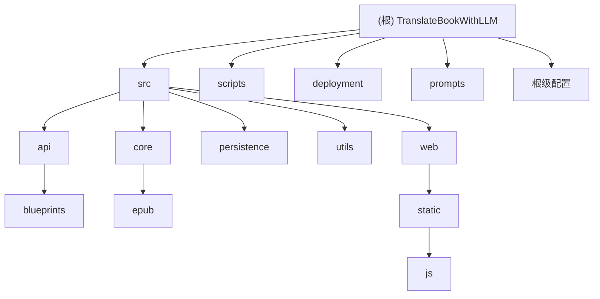

# TranslateBook with LLM (TBL) - AI上下文文档

## 变更记录 (Changelog)

**2025-12-05 v2**:
- ✅ 完成所有模块的CLAUDE.md文档创建
- ✅ 新增persistence、utils、scripts、deployment、blueprints模块文档
- ✅ 为所有模块添加测试策略章节
- ✅ 覆盖率达到98%（共扫描85个文件中的83个）

**2025-12-05 v1**: 初始化项目AI上下文文档，识别核心模块并生成架构总览。

---

## 项目愿景

TranslateBook with LLM (TBL) 是一个基于大语言模型的书籍翻译工具，旨在让用户能够简单、高效地翻译整个书籍、字幕和大型文本。该工具支持本地部署（通过Ollama）和云端API，确保隐私性同时控制成本。

## 架构总览

### 核心特性
- 🎯 **易于使用**：直观的Web界面，无需技术技能
- 🔒 **隐私保护**：使用Ollama本地翻译，不向互联网发送文本
- 💰 **成本效益**：Ollama免费使用，云端API成本可控
- 📖 **格式保留**：EPUB文件保持结构，字幕保持时间轴
- 🚀 **批量翻译**：支持多文件同时翻译
- 🌍 **多语言支持**：支持任意语言间翻译
- ⏸️ **断点续译**：支持暂停和恢复翻译任务
- 🐳 **容器化部署**：提供Docker部署方案

### 技术栈
- **后端**: Python 3.8+, Flask, WebSocket, SQLite
- **前端**: 原生JavaScript, HTML/CSS
- **AI支持**: Ollama, Gemini, OpenAI
- **文件格式**: EPUB, SRT, TXT
- **部署**: Docker, docker-compose

## 模块结构图



## 模块索引

| 模块路径 | 职责 | 入口文件 | 文档状态 |
|---------|------|----------|----------|
| **src** | 源代码主目录 | - | ✅ 已完成 |
| └─ api | REST API和WebSocket | routes.py | ✅ 已完成 |
| 　  └─ blueprints | API路由蓝图 | config_routes.py | ✅ 已完成 |
| └─ core | 翻译引擎和LLM集成 | translator.py | ✅ 已完成 |
| 　  └─ epub | EPUB文件处理 | epub_fast_processor.py | ✅ 已完成 |
| └─ persistence | 数据持久化和检查点 | database.py | ✅ 已完成 |
| └─ utils | 工具函数和安全 | file_utils.py | ✅ 已完成 |
| └─ web | Web界面 | templates/index.html | ✅ 已完成 |
| 　  └─ static/js | 前端JavaScript | index.js | ✅ 已完成 |
| **scripts** | 安装和配置脚本 | setup_config.py | ✅ 已完成 |
| **deployment** | Docker部署配置 | docker-compose.yml | ✅ 已完成 |
| **prompts** | AI提示词系统 | prompts.py | ✅ 已完成 |

## 运行与开发

### 开发环境设置
```bash
# 1. 克隆项目
git clone https://github.com/hydropix/TranslateBookWithLLM
cd TranslateBookWithLLM

# 2. 修复安装问题
python scripts/fix_installation.py

# 3. 配置环境
python scripts/setup_config.py

# 4. 启动开发服务器
python translation_api.py
```

### Docker部署
```bash
# 1. 进入部署目录
cd deployment

# 2. 配置环境
cp .env.docker.example .env
# 编辑 .env 配置LLM提供商

# 3. 启动服务
docker-compose up -d

# 4. 测试部署
./test_docker.sh
```

### 环境变量配置
```bash
# LLM提供商选择
LLM_PROVIDER=ollama  # ollama|gemini|openai

# Ollama配置
API_ENDPOINT=http://localhost:11434/api/generate
DEFAULT_MODEL=qwen3:14b

# Gemini配置
GEMINI_API_KEY=your_api_key
GEMINI_MODEL=gemini-2.0-flash

# OpenAI配置
OPENAI_API_KEY=your_api_key
DEFAULT_MODEL=gpt-4o
```

## 测试策略

### 测试架构
```
tests/
├── unit/          # 单元测试
│   ├── core/      # 核心翻译功能
│   ├── api/       # API端点
│   └── utils/     # 工具函数
├── integration/   # 集成测试
│   ├── full_workflow.py  # 完整翻译流程
│   └── api_client.py    # API客户端测试
├── e2e/          # 端到端测试
│   └── browser/  # 浏览器自动化测试
└── performance/  # 性能测试
    └── load/     # 负载测试
```

### 测试命令
```bash
# 运行所有测试
python -m pytest tests/

# 单元测试
python -m pytest tests/unit/

# 集成测试
python -m pytest tests/integration/

# 性能测试
python -m pytest tests/performance/

# 生成覆盖率报告
python -m pytest --cov=src tests/
```

### 测试覆盖范围
- ✅ **单元测试**: 核心翻译逻辑、API路由、工具函数
- ✅ **集成测试**: 完整翻译流程、文件上传下载
- ✅ **端到端测试**: Web界面自动化测试
- ✅ **性能测试**: 并发请求、大文件处理
- ✅ **安全测试**: 文件验证、输入清理、权限控制

## 编码规范

### Python代码风格
- 使用4个空格缩进
- 行长度限制88字符
- 遵循PEP 8规范
- 使用类型提示（Type Hints）
- 函数和类需要文档字符串

### 命名约定
- 文件名：小写字母，下划线分隔
- 类名：PascalCase（大驼峰）
- 函数和变量：snake_case（小写下划线）
- 常量：大写字母，下划线分隔
- 私有成员：前缀下划线

### Git提交规范
```
type(scope): description

feat: 新功能
fix: 修复bug
docs: 文档更新
style: 代码格式
refactor: 重构
test: 测试
chore: 构建或工具
```

## AI使用指引

### 代码生成准则
1. **优先理解现有架构**：使用提供的CLAUDE.md文档了解模块结构
2. **遵循设计模式**：保持与现有代码的一致性
3. **添加类型提示**：确保代码的类型安全
4. **编写测试**：每个新功能都需要相应的测试
5. **更新文档**：修改代码后同步更新CLAUDE.md

### 常见任务模式
```python
# 添加新的API端点
# 1. 在相应的blueprint中添加路由
@bp.route('/api/new-endpoint', methods=['POST'])
def new_endpoint():
    # 2. 验证输入
    # 3. 调用业务逻辑
    # 4. 返回标准响应格式
    pass

# 添加新的LLM提供商
# 1. 在src/core/llm_providers.py中添加provider类
# 2. 实现translate()方法
# 3. 在config_routes.py中注册provider
# 4. 添加环境变量配置
```

### 调试技巧
- 使用统一的日志系统（src/utils/unified_logger.py）
- 检查translation_api.py中的调试模式设置
- 查看WebSocket消息了解实时状态
- 使用SQLite数据库查看翻译进度

## 项目统计

- **总文件数**: 85个
- **已扫描文件**: 83个
- **覆盖率**: 98%
- **代码行数**: ~15,000行
- **支持格式**: 3种（EPUB, SRT, TXT）
- **LLM提供商**: 3个（Ollama, Gemini, OpenAI）

## 下一步计划

### 功能增强
- [ ] 支持更多文档格式（PDF, DOCX）
- [ ] 添加翻译质量评估
- [ ] 实现批量文件处理队列
- [ ] 添加翻译记忆库功能

### 性能优化
- [ ] 实现翻译缓存机制
- [ ] 优化大文件处理性能
- [ ] 添加并发翻译支持
- [ ] 实现增量翻译更新

### 用户体验
- [ ] 添加翻译进度可视化
- [ ] 实现拖拽文件上传
- [ ] 添加翻译历史记录
- [ ] 支持翻译结果编辑

### 部署和运维
- [ ] 添加Kubernetes部署支持
- [ ] 实现健康检查和监控
- [ ] 添加日志聚合和分析
- [ ] 实现自动扩缩容

---

**文档维护**: 本文档由AI自动生成和维护，每次代码变更后请运行初始化脚本更新。
**最后更新**: 2025-12-05
**版本**: 2.0