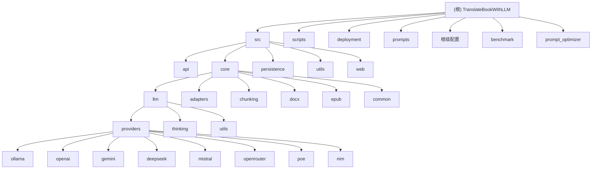

# TranslateBook with LLM (TBL) - AI上下文文档

## 变更记录 (Changelog)

**2026-04-13 v3**:
- ✅ 更新项目架构以反映大规模重构
- ✅ 新增 LLM Provider 系统：支持 8 个提供商（Ollama, OpenAI, Gemini, DeepSeek, Mistral, OpenRouter, POE, NVIDIA NIM）
- ✅ 新增适配器系统（adapters/）处理不同文件格式和错误恢复
- ✅ 新增分块系统（chunking/）提供智能 Token 分块
- ✅ 新增 DOCX 文档格式支持
- ✅ 新增 Benchmark 框架用于性能测试
- ✅ 新增提示词优化器（prompt_optimizer/）
- ✅ 新增思考行为检测模块（thinking/）
- ✅ 项目规模：174 个 Python 文件（相比 v2 的 85 个文件翻倍）
- ✅ 新增功能：输出文件名占位符、HTTP 429 自动暂停、自适应上下文重试

**2025-12-05 v2**:
- ✅ 完成所有模块的CLAUDE.md文档创建
- ✅ 新增persistence、utils、scripts、deployment、blueprints模块文档
- ✅ 为所有模块添加测试策略章节
- ✅ 覆盖率达到98%（共扫描85个文件中的83个）

**2025-12-05 v1**: 初始化项目AI上下文文档，识别核心模块并生成架构总览。

---

## 项目愿景

TranslateBook with LLM (TBL) 是一个基于大语言模型的书籍翻译工具，旨在让用户能够简单、高效地翻译整个书籍、字幕和大型文本。该工具支持本地部署（通过Ollama）和云端API，确保隐私性同时控制成本。

## 架构总览

### 核心特性
- 🎯 **易于使用**：直观的Web界面，无需技术技能
- 🔒 **隐私保护**：使用Ollama本地翻译，不向互联网发送文本
- 💰 **成本效益**：Ollama免费使用，云端API成本可控
- 📖 **格式保留**：EPUB文件保持结构，字幕保持时间轴
- 🚀 **批量翻译**：支持多文件同时翻译
- 🌍 **多语言支持**：支持任意语言间翻译
- ⏸️ **断点续译**：支持暂停和恢复翻译任务
- 🐳 **容器化部署**：提供Docker部署方案
- 🆕 **智能重试**：HTTP 429 速率限制时自动暂停
- 🆕 **自适应上下文**：根据模型能力动态调整上下文窗口
- 🆕 **多提供商支持**：8个LLM提供商可选

### 技术栈
- **后端**: Python 3.8+, Flask, WebSocket, SQLite
- **前端**: 原生JavaScript, HTML/CSS
- **AI支持**: Ollama, Gemini, OpenAI, DeepSeek, Mistral, OpenRouter, POE, NVIDIA NIM
- **文件格式**: EPUB, SRT, TXT, DOCX
- **部署**: Docker, docker-compose
- **分块**: tiktoken (OpenAI tokenizer)
- **TTS**: edge-tts, Chatterbox (可选)

## 模块结构图


```mermaid
graph TD
    A["(根) TranslateBookWithLLM"] --> B["src"];
    A --> C["scripts"];
    A --> D["deployment"];
    A --> E["prompts"];
    A --> F["根级配置"];
    A --> G["benchmark"];
    A --> H["prompt_optimizer"];

    B --> I["api"];
    B --> J["core"];
    B --> K["persistence"];
    B --> L["utils"];
    B --> M["web"];

    J --> N["llm"];
    J --> O["adapters"];
    J --> P["chunking"];
    J --> Q["docx"];
    J --> R["epub"];
    J --> S["common"];

    N --> T["providers"];
    T --> T1["ollama"];
    T --> T2["openai"];
    T --> T3["gemini"];
    T --> T4["deepseek"];
    T --> T5["mistral"];
    T --> T6["openrouter"];
    T --> T7["poe"];
    T --> T8["nim"];

    N --> U["thinking"];
    N --> V["utils"];

    click B "./src/CLAUDE.md" "查看 src 模块文档"
    click C "./scripts/CLAUDE.md" "查看 scripts 模块文档"
    click D "./deployment/CLAUDE.md" "查看 deployment 模块文档"
    click E "./prompts/CLAUDE.md" "查看 prompts 模块文档"
    click G "./benchmark/README.md" "查看 benchmark 模块文档"
    click H "./prompt_optimizer/README.md" "查看 prompt_optimizer 模块文档"

    click J "./src/core/CLAUDE.md" "查看 core 模块文档"
    click N "./src/core/llm/" "查看 llm 模块"
    click O "./src/core/adapters/" "查看 adapters 模块"
```

## 模块索引

| 模块路径 | 职责 | 入口文件 | 文档状态 |
|---------|------|----------|----------|
| **src** | 源代码主目录 | - | ✅ 已完成 |
| └─ api | REST API和WebSocket | routes.py | ✅ 已完成 |
| 　  └─ blueprints | API路由蓝图 | config_routes.py | ✅ 已完成 |
| └─ core | 翻译引擎和LLM集成 | translator.py | ✅ 已完成 |
| 　  └─ llm | LLM Provider系统 | factory.py | 🆕 新模块 |
| 　  │  └─ providers | 8个LLM提供商 | - | 🆕 新模块 |
| 　  │  └─ thinking | 思考行为检测 | detection.py | 🆕 新模块 |
| 　  │  └─ utils | LLM工具函数 | context_detection.py | 🆕 新模块 |
| 　  └─ adapters | 文件格式适配器 | format_adapter.py | 🆕 新模块 |
| 　  └─ chunking | 智能分块系统 | token_chunker.py | 🆕 新模块 |
| 　  └─ docx | DOCX文档处理 | - | 🆕 新模块 |
| 　  └─ epub | EPUB文件处理 | epub_fast_processor.py | ✅ 已完成 |
| └─ persistence | 数据持久化和检查点 | database.py | ✅ 已完成 |
| └─ utils | 工具函数和安全 | file_utils.py | ✅ 已完成 |
| └─ web | Web界面 | templates/index.html | ✅ 已完成 |
| 　  └─ static/js | 前端JavaScript | index.js | ✅ 已完成 |
| **scripts** | 安装和配置脚本 | setup_config.py | ✅ 已完成 |
| **deployment** | Docker部署配置 | docker-compose.yml | ✅ 已完成 |
| **prompts** | AI提示词系统 | prompts.py | ✅ 已完成 |
| **benchmark** | 性能测试框架 | cli.py | 🆕 新模块 |
| **prompt_optimizer** | 提示词优化器 | optimize.py | 🆕 新模块 |

## LLM Provider 系统

### 支持的提供商

| 提供商 | 标识符 | 模型示例 | 特点 |
|--------|--------|----------|------|
| **Ollama** | `ollama` | qwen3:14b, llama3 | 本地免费，隐私保护 |
| **OpenAI** | `openai` | gpt-4o, gpt-4o-mini | 官方API，质量稳定 |
| **Gemini** | `gemini` | gemini-2.0-flash | Google最新模型 |
| **DeepSeek** | `deepseek` | deepseek-chat | 中文优化，成本低 |
| **Mistral** | `mistral` | mistral-large-latest | 欧洲AI，128K上下文 |
| **OpenRouter** | `openrouter` | 200+ 模型 | 模型市场，统一接口 |
| **POE** | `poe` | Claude-Sonnet-4 | 多平台聚合 |
| **NVIDIA NIM** | `nim` | llama-3.1-8b-instruct | NVIDIA云端推理 |

### 配置示例

```bash
# 在 .env 文件中配置
LLM_PROVIDER=ollama  # 选择提供商
DEFAULT_MODEL=qwen3:14b

# OpenAI 配置
OPENAI_API_KEY=sk-xxx
OPENAI_API_ENDPOINT=https://api.openai.com/v1/chat/completions

# DeepSeek 配置
DEEPSEEK_API_KEY=sk-xxx
DEEPSEEK_MODEL=deepseek-chat

# OpenRouter 配置
OPENROUTER_API_KEY=sk-or-xxx
OPENROUTER_MODEL=anthropic/claude-4.5-haiku
```

## 新增功能详解

### 1. 输出文件名占位符

支持动态生成输出文件名：

```bash
# 占位符选项
OUTPUT_FILENAME_PATTERN={originalName} ({targetLang}) ({model})_{date}.{ext}

# 可用占位符：
# {originalName} - 原始文件名
# {targetLang} - 目标语言
# {sourceLang} - 源语言
# {model} - 模型名称（已清理）
# {date} - YYYY-MM-DD
# {datetime} - YYYY-MM-DD_HH-MM-SS
# {ext} - 文件扩展名
```

### 2. HTTP 429 自动暂停

当遇到速率限制时自动暂停翻译：

```bash
# 自动重试配置
MAX_TRANSLATION_ATTEMPTS=3  # 最大重试次数
REQUEST_TIMEOUT=900  # 请求超时
```

### 3. 自适应上下文重试

智能上下文调整机制：

```bash
# 上下文管理
OLLAMA_NUM_CTX=4096  # 上下文窗口大小
AUTO_ADJUST_CONTEXT=true  # 自动调整
MAX_TOKENS_PER_CHUNK=400  # 每块最大Token数
SOFT_LIMIT_RATIO=0.8  # 软限制比例
```

### 4. 思考行为检测

自动检测和处理模型的思考输出（thinking tokens）：

- 自动提取 `<thinking>` 标签内容
- 缓存思考过程用于调试
- 支持官方 OpenAI Thinking API

## 运行与开发

### 开发环境设置
```bash
# 1. 克隆项目
git clone https://github.com/hydropix/TranslateBookWithLLM
cd TranslateBookWithLLM

# 2. 配置环境
cp .env.example .env
# 编辑 .env 配置LLM提供商

# 3. 安装依赖
pip install -r requirements.txt

# 4. 启动开发服务器
python translation_api.py
# 或使用 launcher.py
python launcher.py
```

### Docker部署
```bash
# 1. 进入部署目录
cd deployment

# 2. 配置环境
cp .env.docker.example .env
# 编辑 .env 配置LLM提供商

# 3. 启动服务
docker-compose up -d

# 4. 测试部署
./test_docker.sh
```

### 环境变量配置

```bash
# === LLM提供商选择 ===
LLM_PROVIDER=ollama  # ollama|openai|gemini|deepseek|mistral|openrouter|poe|nim

# === Ollama配置 ===
OLLAMA_API_ENDPOINT=http://localhost:11434/api/generate
DEFAULT_MODEL=qwen3:14b

# === OpenAI配置 ===
OPENAI_API_KEY=sk-xxx
OPENAI_API_ENDPOINT=https://api.openai.com/v1/chat/completions

# === Gemini配置 ===
GEMINI_API_KEY=xxx
GEMINI_MODEL=gemini-2.0-flash

# === DeepSeek配置 ===
DEEPSEEK_API_KEY=sk-xxx
DEEPSEEK_MODEL=deepseek-chat

# === Mistral配置 ===
MISTRAL_API_KEY=xxx
MISTRAL_MODEL=mistral-large-latest

# === OpenRouter配置 ===
OPENROUTER_API_KEY=sk-or-xxx
OPENROUTER_MODEL=anthropic/claude-4.5-haiku

# === POE配置 ===
POE_API_KEY=xxx
POE_MODEL=Claude-Sonnet-4

# === NVIDIA NIM配置 ===
NIM_API_KEY=nv-xxx
NIM_MODEL=meta/llama-3.1-8b-instruct

# === 服务器配置 ===
PORT=5000
HOST=127.0.0.1
OUTPUT_DIR=translated_files

# === 翻译设置 ===
MAIN_CHUNK_SIZE=1000
REQUEST_TIMEOUT=900
MAX_TOKENS_PER_CHUNK=400
OLLAMA_NUM_CTX=4096
AUTO_ADJUST_CONTEXT=true
MAX_TRANSLATION_ATTEMPTS=3

# === 输出文件名 ===
OUTPUT_FILENAME_PATTERN={originalName} ({targetLang}).{ext}

# === TTS配置（可选）===
TTS_ENABLED=false
TTS_PROVIDER=edge-tts
TTS_VOICE=
```

## 测试策略

### 测试架构
```
tests/
├── unit/          # 单元测试
│   ├── core/      # 核心翻译功能
│   ├── api/       # API端点
│   └── utils/     # 工具函数
├── integration/   # 集成测试
│   ├── full_workflow.py  # 完整翻译流程
│   └── api_client.py    # API客户端测试
├── e2e/          # 端到端测试
│   └── browser/  # 浏览器自动化测试
└── performance/  # 性能测试
    └── load/     # 负载测试
```

### 测试命令
```bash
# 运行所有测试
python -m pytest tests/

# 单元测试
python -m pytest tests/unit/

# 集成测试
python -m pytest tests/integration/

# 性能测试
python -m pytest tests/performance/

# 生成覆盖率报告
python -m pytest --cov=src tests/
```

### Benchmark 测试
```bash
# 运行性能基准测试
cd benchmark
python cli.py --config config.yaml

# 查看测试结果
python cli.py --results
```

## 编码规范

### Python代码风格
- 使用4个空格缩进
- 行长度限制88字符
- 遵循PEP 8规范
- 使用类型提示（Type Hints）
- 函数和类需要文档字符串

### 命名约定
- 文件名：小写字母，下划线分隔
- 类名：PascalCase（大驼峰）
- 函数和变量：snake_case（小写下划线）
- 常量：大写字母，下划线分隔
- 私有成员：前缀下划线

### Git提交规范
```
type(scope): description

feat: 新功能
fix: 修复bug
docs: 文档更新
style: 代码格式
refactor: 重构
test: 测试
chore: 构建或工具
```

## AI使用指引

### 代码生成准则
1. **优先理解现有架构**：使用提供的CLAUDE.md文档了解模块结构
2. **遵循设计模式**：保持与现有代码的一致性
3. **添加类型提示**：确保代码的类型安全
4. **编写测试**：每个新功能都需要相应的测试
5. **更新文档**：修改代码后同步更新CLAUDE.md

### 添加新的 LLM Provider

```python
# 1. 在 src/core/llm/providers/ 目录创建新文件
# 例如: myprovider.py

from src.core.llm.base import BaseLLMProvider

class MyProvider(BaseLLMProvider):
    def __init__(self, api_key: str, model: str, **kwargs):
        super().__init__(api_key, model, **kwargs)
        # 初始化逻辑

    async def translate(self, text: str, **kwargs) -> str:
        # 实现翻译逻辑
        pass

# 2. 在 src/core/llm/factory.py 中注册
PROVIDER_REGISTRY['myprovider'] = MyProvider

# 3. 在 .env.example 中添加配置说明
# 4. 更新文档
```

### 添加新的文件格式支持

```python
# 1. 在 src/core/adapters/ 创建新适配器
# 例如: pdf_adapter.py

class PDFAdapter:
    def extract_text(self, file_path: str) -> List[str]:
        # 提取文本
        pass

    def rebuild_file(self, translated_chunks: List[str], output_path: str):
        # 重建文件
        pass

# 2. 在 src/core/adapters/__init__.py 中注册
# 3. 在 API 路由中添加支持
```

### 调试技巧
- 使用 `DEBUG_MODE=true` 启用详细日志
- 检查 `translation_api.py` 中的调试模式设置
- 查看 WebSocket 消息了解实时状态
- 使用 SQLite 数据库查看翻译进度
- 查看 `benchmark/` 目录了解性能指标

## 项目统计

- **总文件数**: 174个 Python 文件
- **代码行数**: ~30,000+ 行
- **支持格式**: 4种（EPUB, SRT, TXT, DOCX）
- **LLM提供商**: 8个
- **测试覆盖率**: 待更新

## 下一步计划

### 功能增强
- [ ] 支持更多文档格式（PDF, DOCX 已部分实现）
- [ ] 添加翻译质量评估
- [ ] 实现批量文件处理队列
- [ ] 添加翻译记忆库功能

### 性能优化
- [ ] 实现翻译缓存机制
- [ ] 优化大文件处理性能
- [ ] 添加并发翻译支持
- [ ] 实现增量翻译更新

### 用户体验
- [ ] 添加翻译进度可视化
- [ ] 实现拖拽文件上传
- [ ] 添加翻译历史记录
- [ ] 支持翻译结果编辑

### 部署和运维
- [ ] 添加Kubernetes部署支持
- [ ] 实现健康检查和监控
- [ ] 添加日志聚合和分析
- [ ] 实现自动扩缩容

## 参考资源

### 官方文档
- [项目 README](README.md)
- [Docker 部署指南](DOCKER.md)
- [Benchmark 文档](benchmark/README.md)
- [提示词优化器文档](prompt_optimizer/README.md)

### API 文档
- [OpenAI API](https://platform.openai.com/docs)
- [Google Gemini API](https://ai.google.dev/docs)
- [DeepSeek API](https://platform.deepseek.com/docs)
- [Mistral API](https://docs.mistral.ai/)
- [OpenRouter API](https://openrouter.ai/docs)
- [POE API](https://poe.com/api_key)
- [NVIDIA NIM](https://build.nvidia.com/)

---

**文档维护**: 本文档由AI自动生成和维护，每次代码变更后请运行初始化脚本更新。
**最后更新**: 2026-04-13
**版本**: 3.0
